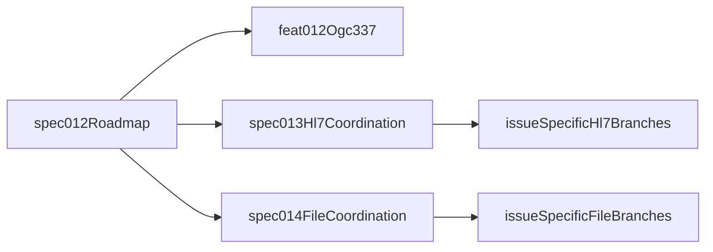

# Madagascar Profile Streams Roadmap

## Purpose

This document is the coordination roadmap for the current analyzer stage for
HJRA/Madagascar.

It defines:

- The parallel feature streams for `ASTM`, `HL7`, and `File Import`
- Which analyzers belong to which stream, and with what level of certainty
- The worktree and branch topology to use
- The exact SpecKit prompts to run in each worktree
- The rules for how planning branches advance into implementation work

It does not define implementation tasks.

## Atlassian Review Status

This roadmap has been reconciled against live Atlassian sources, not just repo
artifacts.

Verified sources:

- Confluence tracker page `1097531396` -
  `OpenELIS Global - Analyzer Integration Tracker`
- Confluence workplan page `1111523331`
- Confluence meeting notes page `1127153666`
- Jira epic `OGC-304` and the linked analyzer issues used by the tracker

Companion note:

- `specs/roadmaps/madagascar-atlassian-alignment.md`

Key correction:

- The earlier assumption that `013` and `014` would map cleanly to one HL7 Jira
  ticket and one File Import Jira ticket does not hold.
- Atlassian treats those streams as bundles of shared infrastructure issues plus
  analyzer-specific issues.
- `013` and `014` therefore remain coordination identifiers for stream planning,
  not one-to-one Jira surrogates.

## Source Of Truth Quick Links

Use this section as the first-stop index before running SpecKit commands.

### Cross-Stream Context

- Roadmap: `specs/roadmaps/madagascar-profile-streams-roadmap.md`
- Atlassian reconciliation note:
  `specs/roadmaps/madagascar-atlassian-alignment.md`
- Confluence tracker:
  [OpenELIS Global - Analyzer Integration Tracker](https://uwdigi.atlassian.net/wiki/spaces/mdgoe/pages/1097531396/OpenELIS+Global+Analyzer+Integration+Tracker)
- Confluence workplan:
  [Workplan](https://uwdigi.atlassian.net/wiki/spaces/mdgoe/pages/1111523331/Workplan)
- Confluence meeting notes:
  [2026-03-05 Meeting notes](https://uwdigi.atlassian.net/wiki/spaces/mdgoe/pages/1127153666/2026-03-05+Meeting+notes)
- Madagascar umbrella spec: `specs/011-madagascar-analyzer-integration/spec.md`
- Supported analyzer contract:
  `specs/011-madagascar-analyzer-integration/contracts/supported-analyzers.md`

### ASTM Source Of Truth

- Repo spec: `specs/012-generic-astm-plugin-profiles/spec.md`
- Repo plan: `specs/012-generic-astm-plugin-profiles/plan.md`
- Repo tasks: `specs/012-generic-astm-plugin-profiles/tasks.md`
- Repo alignment report:
  `specs/012-generic-astm-plugin-profiles/alignment-report.md`
- `.tmp` working references: `specs/012-generic-astm-plugin-profiles/.tmp/`
- Jira `OGC-337`:
  [Implement Generic ASTM Plugin v1.1/1.2](https://uwdigi.atlassian.net/browse/OGC-337)
- Jira `OGC-335`:
  [Implement Cepheid GeneXpert Dx ASTM E1394-97 Adapter](https://uwdigi.atlassian.net/browse/OGC-335)

### HL7 Source Of Truth

- Jira `OGC-325`:
  [Implement HL7 v2.3.1 MLLP Listener Service](https://uwdigi.atlassian.net/browse/OGC-325)
- Jira `OGC-326`:
  [Implement Mindray BS-Series Chemistry HL7 Adapter](https://uwdigi.atlassian.net/browse/OGC-326)
- Jira `OGC-327`:
  [Implement Mindray BC-5380 Hematology HL7 Adapter](https://uwdigi.atlassian.net/browse/OGC-327)
- Optional Jira `OGC-336`:
  [Implement Cepheid GeneXpert Dx HL7 v2.5 Adapter](https://uwdigi.atlassian.net/browse/OGC-336)
- Repo profiles: `projects/analyzer-profiles/hl7`
- Repo plugin docs: `plugins/analyzers/GenericHL7/README.md`
- Repo architecture note: `plugins/analyzers/GenericHL7/ARCHITECTURE.md`
- Design reference:
  [HL7 Analyzer Mapping](https://caseyi.github.io/openelis-work/#/analyzer-integration/hl7-analyzer-mapping)

### File Import Source Of Truth

- Jira `OGC-324`:
  [Implement Analyzer File Upload Screen](https://uwdigi.atlassian.net/browse/OGC-324)
- Jira `OGC-329`:
  [Flat File Analyzer Configuration & Sidebar Navigation](https://uwdigi.atlassian.net/browse/OGC-329)
- Jira `OGC-344`:
  [Implement Wondfo Finecare FS-205 Flat File CSV Import](https://uwdigi.atlassian.net/browse/OGC-344)
- Jira `OGC-348`:
  [Implement QuantStudio 5 / 7 Flex Result Import](https://uwdigi.atlassian.net/browse/OGC-348)
- Jira `OGC-350`:
  [Implement Attune CytPix Flow Cytometer File Import](https://uwdigi.atlassian.net/browse/OGC-350)
- Jira `OGC-351`:
  [Implement Bruker FluoroCycler XT Result Import](https://uwdigi.atlassian.net/browse/OGC-351)
- Jira `OGC-417`:
  [Tecan Infinite F50 ELISA Reader - Analyzer Plugin](https://uwdigi.atlassian.net/browse/OGC-417)
- Jira `OGC-418`:
  [Thermo Multiskan FC ELISA Reader - Analyzer Plugin](https://uwdigi.atlassian.net/browse/OGC-418)
- Current core code:
  `src/main/java/org/openelisglobal/analyzerimport/analyzerreaders/FileAnalyzerReader.java`
- Current service code:
  `src/main/java/org/openelisglobal/analyzer/service/FileImportServiceImpl.java`
- Current UI:
  `frontend/src/components/analyzers/FileImportConfiguration/FileImportConfiguration.jsx`
- Current analyzer form:
  `frontend/src/components/analyzers/AnalyzerForm/AnalyzerForm.jsx`
- Design references:
  [Flat File Analyzer Config](https://caseyi.github.io/openelis-work/#/analyzer-integration/flat-file-analyzer-config)
  and
  [Analyzer File Upload](https://caseyi.github.io/openelis-work/#/analyzer-integration/analyzer-file-upload)

## Stage Boundaries

### In Scope

- Profile-based analyzer communication enablement
- Filesystem-backed analyzer profiles
- Instance-specific deployment configuration such as IPs, ports, bridge targets,
  shared folders, import paths, and similar site-local values
- Roadmap and branch orchestration for the three streams
- Stream-level decisions about which analyzers are handled by `GenericASTM`,
  `GenericHL7`, or a file-oriented import path

### Out Of Scope

- Editing profiles in the UI
- Sharing, exporting, importing, or curating profile libraries
- Community profile exchange
- Profile reapply workflows
- Mixed legacy-plugin growth for new HJRA analyzers
- Detailed implementation task breakdowns

## Planning Principles

- Every analyzer in this stage must have one primary stream owner.
- Profiles provide communication configuration; OpenELIS should only hold
  instance-specific deployment values.
- `012` remains ASTM-scoped in identity, even though it hosts the umbrella
  roadmap.
- `013` and `014` are coordination branches for stream planning. They are not
  proxies for one Jira issue.
- Issue-specific implementation should branch from the stream coordination
  branches only after the issue bundle and sequence are frozen.
- The desired file target is still plugin-owned parsing, but the current
  Atlassian file stories are more core-centric. That architectural mismatch must
  be made explicit before implementation starts.

## Atlassian-Verified Issue Bundles

| Stream      | Coordination ID | Existing Jira Bundle                                                                   | What That Means                                                                                                            |
| ----------- | --------------- | -------------------------------------------------------------------------------------- | -------------------------------------------------------------------------------------------------------------------------- |
| ASTM        | `012`           | `OGC-337`, `OGC-335`                                                                   | `OGC-337` is the generic ASTM/profile work. `OGC-335` is the GeneXpert ASTM proving path.                                  |
| HL7         | `013`           | `OGC-325`, `OGC-326`, `OGC-327`, optional `OGC-336`                                    | There is no single GenericHL7 Jira umbrella. The stream is shared listener infrastructure plus analyzer-specific adapters. |
| File Import | `014`           | `OGC-324`, `OGC-329`, `OGC-344`, `OGC-348`, `OGC-350`, `OGC-351`, `OGC-417`, `OGC-418` | The stream is shared upload/configuration infrastructure plus analyzer-specific file import stories.                       |

## Stream Overview

| Stream      | Coordination ID | Goal For This Stage                                                                                                          | Start Point                                                               | Stop Point For Planning                                                                                           |
| ----------- | --------------- | ---------------------------------------------------------------------------------------------------------------------------- | ------------------------------------------------------------------------- | ----------------------------------------------------------------------------------------------------------------- |
| ASTM        | `012`           | Recover and complete the profile-driven `GenericASTM` pathway, using GeneXpert XVI as the proving path                       | Existing `012` artifacts plus `OGC-337` and `OGC-335`                     | `analyze` complete, branch strategy aligned to the current `012` implementation plan                              |
| HL7         | `013`           | Reconcile the repo's GenericHL7 direction with the real Jira bundle for BC-5380, BS-200, and shared HL7 infrastructure       | Existing Jira/Confluence artifacts plus repo GenericHL7 code and profiles | Issue bundle, scope boundary, and sequence frozen; create targeted follow-on plan/spec only if a real gap remains |
| File Import | `014`           | Reconcile the desired GenericFlatFile direction with the current Jira-backed file import infrastructure and analyzer stories | Existing Jira/Confluence artifacts plus current file-import code          | Architecture delta frozen, issue bundle sequenced, analyzer blockers surfaced explicitly                          |

## Primary Stream Allocation Matrix

This matrix assigns a primary stream for this stage only. If a device supports
multiple protocols, the roadmap still gives it one primary owner for this phase
so planning does not fragment.

### Confirmed Stream Assignment

| Analyzer           | Primary Stream      | Atlassian Evidence                                                                                       | Notes                                                                                                 |
| ------------------ | ------------------- | -------------------------------------------------------------------------------------------------------- | ----------------------------------------------------------------------------------------------------- |
| GeneXpert XVI      | ASTM (`012`)        | `OGC-335` plus tracker marks ASTM as the primary GeneXpert path, with HL7 as an alternative in `OGC-336` | Keep GeneXpert on the ASTM proving path for this stage. Do not absorb the HL7 alternative into `012`. |
| Mindray BC-5380    | HL7 (`013`)         | `OGC-327`, tracker Pattern A2, shared listener dependency `OGC-325`                                      | BC-5380 is confirmed HL7, not ASTM.                                                                   |
| Mindray BS-200     | HL7 (`013`)         | `OGC-326`, tracker row `Mindray BS-series (incl. BS-200)`                                                | Stream assignment is confirmed HL7.                                                                   |
| QuantStudio 7 Flex | File Import (`014`) | `OGC-348`, tracker marks QuantStudio as validated against real files                                     | Strongest file-stream anchor.                                                                         |
| QuantStudio 5      | File Import (`014`) | `OGC-348`, tracker marks QuantStudio as validated against real files                                     | Strongest file-stream anchor.                                                                         |

### Assigned To A Stream But Still Blocked

| Analyzer                 | Primary Stream      | Blocking Condition                                                                        | Why It Stays Blocked                                                                |
| ------------------------ | ------------------- | ----------------------------------------------------------------------------------------- | ----------------------------------------------------------------------------------- |
| FluoroCycler XT          | File Import (`014`) | `OGC-351` says native `.at` is not parseable and export/LIMS protocol is still unresolved | Keep in the file stream, but do not treat it as a ready GenericFlatFile profile.    |
| Invitrogen Attune CytPix | File Import (`014`) | `OGC-350` confirms FCS-only output and lists middleware/preprocessing options             | File stream ownership is still right, but this is not a plain CSV parser story yet. |
| Tecan Infinite F50       | File Import (`014`) | `OGC-417` has low-confidence spec and no real Magellan exports yet                        | Keep provisional until real files and plate-to-accession mapping are validated.     |
| Multiskan FC             | File Import (`014`) | `OGC-418` has low-confidence spec and no real SkanIt exports yet                          | Keep provisional until real files and site software version are confirmed.          |

### Conflicts And Cleanup Required

| Analyzer / Name                       | Current Status                                                                                                                                                           | Planning Rule                                                                                                                           |
| ------------------------------------- | ------------------------------------------------------------------------------------------------------------------------------------------------------------------------ | --------------------------------------------------------------------------------------------------------------------------------------- |
| Wondfo Finecare FIA III Plus / FS-205 | Tracker and Jira disagree on sequencing. The tracker describes ASTM Phase 1 and CSV Phase 2, but `OGC-345` explicitly says ASTM is blocked by `OGC-344` flat-file first. | Do not freeze this analyzer into ASTM-only or File-only planning until the sequence conflict is resolved.                               |
| Mindray BS-300                        | User scope includes BS-300, but the current Jira-backed BS-series work is strongest for BS-200 and not explicit about BS-300                                             | Keep the HL7 stream assignment likely, but do not assume the shared `BS-200/BS-300` profile is already validated by Atlassian evidence. |
| `LA2M Central`                        | Not backed by Jira as an analyzer; Confluence uses `LA2M` as a laboratory/site label                                                                                     | Remove it from analyzer implementation scope. Treat it as a site/workstream reference, not an analyzer.                                 |

## Stream Charters

### ASTM Stream - Feature `012`

Purpose:

- Keep `012` focused on `GenericASTM`
- Use the current `012` spec family as recovery input rather than rewriting the
  feature
- Make GeneXpert XVI the primary proving path for this stage
- Keep `OGC-337` and `OGC-335` aligned rather than mixing in unrelated HL7 work

Inputs:

- `specs/012-generic-astm-plugin-profiles/spec.md`
- `specs/012-generic-astm-plugin-profiles/plan.md`
- `specs/012-generic-astm-plugin-profiles/tasks.md`
- `specs/012-generic-astm-plugin-profiles/alignment-report.md`
- Jira `OGC-337`
- Jira `OGC-335`

Planning outputs expected from this stream:

- A clean statement of remaining ASTM scope
- Recovery sequencing for the existing `012` foundation
- Alignment between the roadmap and the current `012` branch strategy

### HL7 Stream - Coordination `013`

Purpose:

- Coordinate the HL7 stream across the existing Jira bundle rather than invent a
  fake single-ticket feature
- Use the repo's GenericHL7 direction where it helps, but respect that the live
  Jira work is split between listener infrastructure and analyzer-specific
  adapters
- Keep scope limited to communication profiles plus instance-specific deployment
  overrides

Inputs:

- Jira `OGC-325`
- Jira `OGC-326`
- Jira `OGC-327`
- Optional Jira `OGC-336` if Madagascar chooses GeneXpert HL7 instead of ASTM
- `projects/analyzer-profiles/hl7`
- `plugins/analyzers/GenericHL7/README.md`
- [HL7 Analyzer Mapping](https://caseyi.github.io/openelis-work/#/analyzer-integration/hl7-analyzer-mapping)

Planning outputs expected from this stream:

- A clear HL7 scope boundary that matches the actual Jira bundle
- An issue sequence for shared listener work and analyzer-specific HL7 work
- A decision on whether any new umbrella spec artifact is truly needed

### File Import Stream - Coordination `014`

Purpose:

- Coordinate the file stream across shared infrastructure and analyzer-specific
  import stories
- Explicitly reconcile the current Atlassian/core-centric file architecture with
  the desired plugin-owned GenericFlatFile direction
- Keep UI/admin behavior limited to instance-specific configuration,
  review/upload workflows, and plugin discovery

Inputs:

- Jira `OGC-324`
- Jira `OGC-329`
- Jira `OGC-344`
- Jira `OGC-348`
- Jira `OGC-350`
- Jira `OGC-351`
- Jira `OGC-417`
- Jira `OGC-418`
- `src/main/java/org/openelisglobal/analyzerimport/analyzerreaders/FileAnalyzerReader.java`
- `src/main/java/org/openelisglobal/analyzer/service/FileImportServiceImpl.java`
- `frontend/src/components/analyzers/FileImportConfiguration/FileImportConfiguration.jsx`
- `frontend/src/components/analyzers/AnalyzerForm/AnalyzerForm.jsx`
- [Flat File Analyzer Config](https://caseyi.github.io/openelis-work/#/analyzer-integration/flat-file-analyzer-config)
- [Analyzer File Upload](https://caseyi.github.io/openelis-work/#/analyzer-integration/analyzer-file-upload)

Planning outputs expected from this stream:

- A stream-level sequence for shared infrastructure and analyzer-specific import
  work
- An explicit architecture decision on the plugin boundary for file parsing
- A blocker list for analyzers that still need real exports, middleware, or a
  parseable format before implementation

## Worktree Topology

Create one umbrella roadmap worktree and then three parallel stream worktrees.
All worktrees start from `develop`.

### Umbrella Roadmap Worktree

| Item      | Value                                                                                  |
| --------- | -------------------------------------------------------------------------------------- |
| Directory | `../oe-roadmap-012`                                                                    |
| Branch    | `spec/012-ogc-337-generic-astm-plugin-profiles`                                        |
| Role      | Holds the roadmap, stream boundaries, analyzer matrix, and cross-stream reconciliation |
| Rule      | No implementation work in this worktree                                                |

Suggested command:

```bash
git worktree add "../oe-roadmap-012" -b "spec/012-ogc-337-generic-astm-plugin-profiles" develop
```

If the branch already exists locally or on a remote, reuse it instead of
creating it again:

```bash
git worktree add "../oe-roadmap-012" "spec/012-ogc-337-generic-astm-plugin-profiles"
```

### Parallel Stream Worktrees

| Stream      | Directory        | Branch                                                           | Role                                                                                              |
| ----------- | ---------------- | ---------------------------------------------------------------- | ------------------------------------------------------------------------------------------------- |
| ASTM        | `../oe-astm-012` | `feat/012-ogc-337-generic-astm-plugin-profiles-m1-plugin-config` | Aligns to the current `012` plan branch strategy instead of an invented recovery branch           |
| HL7         | `../oe-hl7-013`  | `spec/013-hjra-hl7-stream-alignment`                             | Coordination branch for the HL7 Jira bundle (`OGC-325`, `OGC-326`, `OGC-327`, optional `OGC-336`) |
| File Import | `../oe-file-014` | `spec/014-hjra-file-stream-alignment`                            | Coordination branch for shared file infrastructure plus analyzer-specific file stories            |

Suggested commands:

```bash
git worktree add "../oe-astm-012" -b "feat/012-ogc-337-generic-astm-plugin-profiles-m1-plugin-config" develop
git worktree add "../oe-hl7-013" -b "spec/013-hjra-hl7-stream-alignment" develop
git worktree add "../oe-file-014" -b "spec/014-hjra-file-stream-alignment" develop
```

If a branch already exists, omit `-b` and attach the worktree to the existing
branch instead.

## Jira Mapping Policy

- `012` maps directly to `OGC-337`.
- `013` and `014` should not be given one Jira suffix, because they aggregate
  multiple existing Jira issues.
- Use `013` and `014` only as coordination identifiers for planning worktrees
  and stream-level artifacts.
- When the stream narrows into a real implementation slice, create an
  issue-specific branch instead.

Recommended future branch patterns:

- HL7:
  - `feat/013-ogc-325-hl7-listener-foundation`
  - `feat/013-ogc-326-bs-series-hl7`
  - `feat/013-ogc-327-bc5380-hl7`
- File Import:
  - `feat/014-ogc-324-upload-review-ui`
  - `feat/014-ogc-329-file-config-foundation`
  - `feat/014-ogc-348-quantstudio-import`
  - `feat/014-ogc-350-attune-file-path`
  - `feat/014-ogc-351-fluorocycler-import`
  - `feat/014-ogc-417-tecan-f50-import`
  - `feat/014-ogc-418-multiskan-fc-import`

## SpecKit Entry Prompts

### Umbrella Roadmap Worktree

Run:

```text
/speckit.analyze "Reconcile feature 012 with the live Madagascar analyzer tracker, Jira epic OGC-304, Jira OGC-337, Jira OGC-335, HL7 bundle OGC-325/326/327, and file bundle OGC-324/329/344/348/350/351/417/418. Produce a roadmap-only alignment: stream boundaries, analyzer-to-stream allocation, naming cleanup, issue-bundle sequencing, and branch/worktree orchestration. Exclude implementation."
```

Expected outcome:

- One roadmap artifact updated from live Atlassian evidence
- Frozen stream boundaries
- Analyzer assignment matrix with blockers and cleanup items
- Agreement on branch topology before stream-level execution begins

### ASTM Worktree

Run first:

```text
/speckit.analyze "Recover feature 012 as the profile-based GenericASTM stream for HJRA. Reconcile the existing 012 spec, plan, tasks, current code, Jira OGC-337, and GeneXpert ASTM issue OGC-335. Highlight only the remaining ASTM implementation scope, sequencing, and decision points. Do not expand into HL7 or file-stream planning."
```

Run only after roadmap review and ASTM stream review:

```text
/speckit.implement
```

### HL7 Worktree

Run first:

```text
/speckit.specify "Create the HJRA HL7 stream coordination spec. This is a planning artifact, not an implementation request. Use these as source-of-truth inputs: Confluence tracker page 1097531396, workplan page 1111523331, meeting notes page 1127153666, Jira OGC-325 (HL7 listener), Jira OGC-326 (Mindray BS-series HL7), Jira OGC-327 (Mindray BC-5380 HL7), optional Jira OGC-336 (GeneXpert HL7 alternative), repo profiles in projects/analyzer-profiles/hl7, plugins/analyzers/GenericHL7/README.md, plugins/analyzers/GenericHL7/ARCHITECTURE.md, and the HL7 Analyzer Mapping design reference. Produce a coordination spec that defines stream boundaries, analyzer allocation, issue-bundle sequencing, profile assumptions, branch recommendations, and any true gaps that still require new follow-on specs. Exclude implementation, profile editing/sharing/library features, and do not invent a fake single Jira umbrella."
```

Then:

```text
/speckit.clarify
/speckit.plan
```

### File Import Worktree

Run first:

```text
/speckit.specify "Create the HJRA file import stream coordination spec. This is a planning artifact, not an implementation request. Use these as source-of-truth inputs: Confluence tracker page 1097531396, workplan page 1111523331, meeting notes page 1127153666, Jira OGC-324 (upload/review UI), Jira OGC-329 (file configuration and watcher behavior), Jira OGC-344 (Wondfo CSV), Jira OGC-348 (QuantStudio), Jira OGC-350 (Attune CytPix), Jira OGC-351 (FluoroCycler XT), Jira OGC-417 (Tecan Infinite F50), Jira OGC-418 (Multiskan FC), current OpenELIS file-import code in FileAnalyzerReader.java and FileImportServiceImpl.java, current analyzer UI in FileImportConfiguration.jsx and AnalyzerForm.jsx, and the Flat File Analyzer Config plus Analyzer File Upload design references. Produce a coordination spec that defines stream boundaries, issue-bundle sequencing, analyzer allocation, export blockers, branch recommendations, and the architecture delta between the current Jira assumptions and the desired plugin-owned parser boundary. Exclude implementation, profile editing/sharing/library features, and do not invent a fake single Jira umbrella."
```

Then:

```text
/speckit.clarify
/speckit.plan
```

## Branch Promotion Rules

### Umbrella Roadmap Branch

- Never becomes an implementation branch.
- Its job ends when the roadmap is approved and the three stream branches are
  aligned.

### ASTM Branch

- The ASTM branch is already a feature branch.
- It may move from `analyze` to `implement` only after:
  - The roadmap document is accepted
  - The ASTM stream review confirms the `OGC-337` / `OGC-335` boundary
  - GeneXpert XVI remains the primary ASTM proving path for this stage

### HL7 And File Coordination Branches

- `013` and `014` are coordination branches, not umbrella implementation
  branches.
- They do not automatically promote into one generic `feat/013` or one generic
  `feat/014`.
- They may spawn issue-specific `feat/*` branches only after:
  - The stream analysis is accepted
  - The issue bundle sequence is frozen
  - The analyzer matrix is stable enough to start implementation
  - Any naming cleanup items are resolved or explicitly deferred

## Review Checkpoints

- Checkpoint 1: Roadmap accepted in `../oe-roadmap-012`
- Checkpoint 2: ASTM branch strategy accepted in `../oe-astm-012`
- Checkpoint 3: HL7 issue bundle, boundaries, and branch slices accepted in
  `../oe-hl7-013`
- Checkpoint 4: File issue bundle, architecture delta, and branch slices
  accepted in `../oe-file-014`

No stream should begin implementation before its checkpoint is passed.

## Guardrails

- Do not reintroduce the fiction that `013` or `014` map to one Jira ticket.
- Do not bury unresolved protocol questions inside implementation branches.
- Do not treat `LA2M` as an analyzer. Atlassian evidence uses it as a lab/site
  label.
- Do not freeze Wondfo sequencing until the `OGC-344` vs `OGC-345` conflict is
  resolved.
- Do not call FluoroCycler XT or Attune CytPix "ready GenericFlatFile profiles"
  while export/middleware blockers are still open.
- Do not preserve the current OpenELIS core file-import parser as the target
  architecture for `014` without an explicit decision to do so.
- Do not add new legacy analyzer plugins for this HJRA stage unless a later
  review explicitly overturns the generic-first direction.

## Branch Flow


