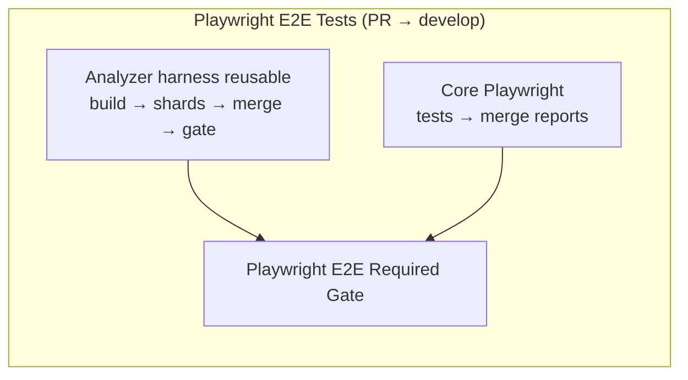

# Playwright CI Stabilization and Acceleration

## Why this exists

This document defines the Playwright CI execution contract for OpenELIS so CI
remains fast, deterministic, and debuggable while still validating analyzer
harness end-to-end behavior.

## Baseline before remediation

- Analyzer workflow:
  `[.github/workflows/analyzer-e2e.yml](../../.github/workflows/analyzer-e2e.yml)`
  - 2 shards, each performing full Maven + plugin + Docker build.
  - 30 minute job timeout per shard.
  - Docker cache aggressively pruned before every run.
  - Blob reporter enabled, but no merged HTML report fan-in.
- Core workflow:
  `[.github/workflows/playwright-e2e.yml](../../.github/workflows/playwright-e2e.yml)`
  - Single Playwright job with Docker rebuild in the test job.
  - 30 minute job timeout.
  - Docker cache aggressively pruned before every run.
- Harness bind-mount gap:
  - `file-import-results` requires
    `projects/analyzer-harness/volume/analyzer-imports`.
  - CI compose override did not bind this host path to `/data/analyzer-imports`.

## New CI topology



**Why the harness runs inside Playwright on PRs:** On `develop`,
`analyzer-e2e.yml` historically only defined `workflow_dispatch`, so GitHub
never scheduled a separate **Analyzer E2E (Harness)** run for pull requests.
`playwright-e2e.yml` already had `pull_request` → develop. The reusable workflow
[`.github/workflows/analyzer-e2e-reusable.yml`](../../.github/workflows/analyzer-e2e-reusable.yml)
is invoked from Playwright so every PR runs core + analyzer harness. Manual runs
still use
[`.github/workflows/analyzer-e2e.yml`](../../.github/workflows/analyzer-e2e.yml)
(`workflow_dispatch`).

## Workflow contracts

### Analyzer harness (reusable + manual entry)

- Implemented in `analyzer-e2e-reusable.yml`; PR path: job
  `analyzer-harness-e2e` in `playwright-e2e.yml`.
- Build once in `build-once`:
  - Maven artifacts and plugin jars are built once.
  - Docker images are built once using Buildx with GHA cache scope
    `analyzer-e2e`.
  - Plugin jars and Docker images are uploaded as short-lived artifacts.
- Test shards in `test-shards`:
  - Download prebuilt artifacts.
  - Restore plugin jars and load Docker images.
  - Start compose stack with `--no-build`.
  - Load fixtures and seed analyzers.
  - Run harness shards; run `demo` on shard 1 only.
  - Upload `blob-report` per shard.
- Merge in `merge-reports`:
  - Download all shard blob reports.
  - Merge to a single HTML report with `playwright merge-reports`.
- Enforce in `analyzer-e2e-gate`:
  - Required gate fails if shard or merge jobs fail.

### Core Playwright workflow

- In parallel with analyzer harness: build images with Buildx cache scope
  `playwright-core`, start compose, run `core-app`.
- Analyzer harness can be intentionally skipped on a PR by adding label
  `skip-analyzer-e2e`; the analyzer job is then marked `skipped`.
- Upload blob report, merge to HTML in a fan-in job.
- `playwright-e2e-gate` fails if core tests, report merge, **or** the analyzer
  harness reusable workflow fails (single blocking gate for PRs). Analyzer
  `skipped` is treated as intentional pass.

## Video and demo test policy

- CI must run `demo` for validation speed and stability.
- `demo-video` is local-only and intentionally slower.
- Canonical local command:

```bash
cd frontend
CLEANUP=false TEST_USER=admin TEST_PASS='<password>' npm run pw:test:video
```

- Current script implementation:
  - `pw:test:video` runs `demo-video` with `PLAYWRIGHT_VIDEO=on` and
    `PLAYWRIGHT_SLOWMO=500`.
  - The command targets Linux/macOS shells; on Windows, run it in WSL.

## Test tiers and intent

- `core-app`: fast smoke checks on shared app behaviors.
- `harness`: analyzer bridge/simulator/plugin integration checks.
- `demo`: end-to-end feature workflow validation in CI.
- `demo-video`: local demonstration capture only.

## Branch protection guidance

- **`Playwright E2E Required Gate`** — required for PRs; it now enforces core
  Playwright, merged HTML report, and analyzer harness success (or intentional
  analyzer skip via `skip-analyzer-e2e` label).
- **`Analyzer E2E Required Gate`** — still emitted by the reusable workflow (may
  appear as a nested check name in the UI); optional as a second required check
  if you want an explicit harness-only signal.
