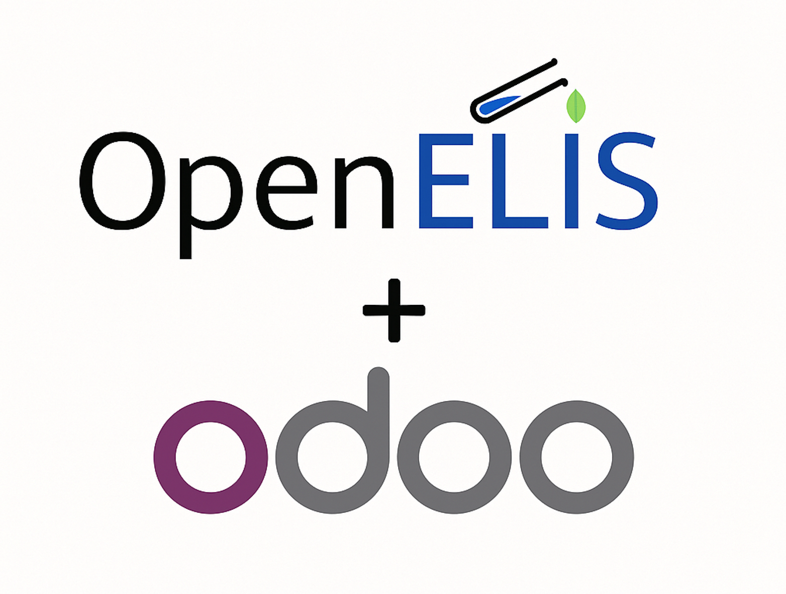

# Odoo-OpenELIS Integration Documentation



## Overview

The Odoo-OpenELIS integration automates billing workflows by seamlessly
generating invoices in Odoo whenever lab orders are placed in OpenELIS. This
integration eliminates manual billing processes, reduces errors, and provides
real-time financial visibility.

## Architecture

The integration follows a **Service-Oriented Architecture (SOA)** with clear
separation of concerns:

```
┌─────────────────┐    ┌──────────────────┐    ┌─────────────────┐
│   OpenELIS      │───▶│   Integration    │───▶│      Odoo       │
│   (LIMS)        │    │     Service      │    │   (ERP)         │
└─────────────────┘    └──────────────────┘    └─────────────────┘
```

### Core Components

1. **OdooClient** - Handles XML-RPC communication with Odoo
2. **OdooIntegrationService** - Business logic for invoice creation
3. **TestProductMapping** - CSV-based test-to-product mapping
4. **Event Handling** - Spring events for asynchronous processing

## Features

- 🔑 **Authentication** with Odoo's XML-RPC endpoint
- 👤 **Automatic patient creation** in Odoo if they don't exist
- 🔍 **Duplicate prevention** using national IDs or names
- 🛡️ **Error resilience** - failures in Odoo don't stop OpenELIS operations
- 📊 **Flexible test mapping** via CSV configuration
- 🔄 **Event-driven workflow** for seamless integration

---

## Quick Start Guide

This section will help you set up the Odoo-OpenELIS integration in 10 minutes.

### Prerequisites

- OpenELIS Global 2.0+ running
- Odoo 16.0+ running and accessible
- Network connectivity between systems

### Step 1: Configure Environment Variables

Add these to your OpenELIS configuration file or environment:

```properties
org.openelisglobal.odoo.baseUrl=http://your-odoo-server:8069
org.openelisglobal.odoo.database=your_odoo_database
org.openelisglobal.odoo.username=your_odoo_username
org.openelisglobal.odoo.password=your_odoo_password
```

### Step 2: Create Test-Product Mapping

Create file: `/var/lib/openelis-global/properties/odoo-test-product-mapping.csv`

```csv
loinc_code,product_name,quantity,price_unit
333-333,Albumine recherche miction,8,76
718-7,Hémoglobine,8,73
787-2,Volume Globulaire Moyen,8,69
777-3,Plaquette,1,32
736-9,Lymphocytes (%),3,15
```

### Step 3: Restart OpenELIS

```bash
# If using Docker
docker-compose restart openelis

# If using standalone Tomcat
sudo systemctl restart tomcat
```

### Step 4: Verify Integration

Check the health endpoint:

```bash
curl https://your-openelis-server:8443/health/odoo
```

Expected response:

```json
{
  "status": "UP",
  "odoo": "Available"
}
```

### Step 5: Test the Integration

1. **Access OpenELIS**: Navigate to https://localhost:8443
2. **Create a new sample** with tests that have LOINC codes
3. **Check Odoo**: Navigate to http://localhost:8069 and verify:
   - Patient creation in Partners
   - Invoice creation in Accounting
   - Product mapping from CSV configuration

### Step 6: Verify Odoo Initialization

Check that the Odoo initializer has run successfully:

```bash
# Check initialization logs
docker-compose logs odoo.initializer.openelis.org

# Expected output:
# Waiting for Odoo to be ready...
# Running initializer...
# Initialization completed!
```

### Step 7: Access Services

Once deployed, the services will be available at:

- **OpenELIS**: https://localhost:8443 (admin/adminADMIN!)
- **Odoo**: http://localhost:8069 (admin/admin)
- **FHIR API**: http://localhost:8081

---

## Installation and Configuration

### Prerequisites

- OpenELIS Global 2.0 or later
- Odoo 17.0 or later
- Network connectivity between OpenELIS and Odoo servers
- Docker and Docker Compose (for containerized deployment)

### Environment Variables

#### Required Configuration

| Variable                           | Description        | Example                         | Default |
| ---------------------------------- | ------------------ | ------------------------------- | ------- |
| `org.openelisglobal.odoo.baseUrl`  | Odoo server URL    | `http://odoo.openelis.org:8069` | -       |
| `org.openelisglobal.odoo.database` | Odoo database name | `postgres`                      | -       |
| `org.openelisglobal.odoo.username` | Odoo username      | `admin`                         | -       |
| `org.openelisglobal.odoo.password` | Odoo password      | `admin`                         | -       |

#### Optional Configuration

| Variable                                | Description                        | Example                          | Default |
| --------------------------------------- | ---------------------------------- | -------------------------------- | ------- |
| `logging.level.org.openelisglobal.odoo` | Logging level for Odoo integration | `DEBUG`, `INFO`, `WARN`, `ERROR` | `INFO`  |

### CSV Mapping Configuration

#### File Location

The test-to-product mapping file must be located at:

```
/var/lib/openelis-global/properties/odoo-test-product-mapping.csv
```

#### CSV Format

The CSV file must have the following structure:

```csv
loinc_code,product_name,quantity,price_unit
333-333,Albumine recherche miction,8,76
718-7,Hémoglobine,8,73
787-2,Volume Globulaire Moyen,8,69
777-3,Plaquette,1,32
736-9,Lymphocytes (%),3,15
```

#### Field Descriptions

| Field          | Type    | Required | Description                             |
| -------------- | ------- | -------- | --------------------------------------- |
| `loinc_code`   | String  | Yes      | LOINC code of the test in OpenELIS      |
| `product_name` | String  | Yes      | Product name in Odoo                    |
| `quantity`     | Decimal | Yes      | Quantity for invoice line (usually 1.0) |
| `price_unit`   | Decimal | Yes      | Unit price in Odoo currency             |

#### CSV Validation Rules

- File must be UTF-8 encoded
- First row must contain headers
- Empty lines are ignored
- Invalid numeric values are logged and skipped
- Duplicate LOINC codes use the last occurrence

### Docker Configuration

#### Complete Docker Compose Example

```yaml
services:
  certs:
    container_name: oe-certs
    image: itechuw/certgen:main
    restart: always
    environment:
      - KEYSTORE_PW="kspass"
      - TRUSTSTORE_PW="tspass"
    networks:
      - hie
    volumes:
      - key_trust-store-volume:/etc/openelis-global
      - keys-vol:/etc/ssl/private/
      - certs-vol:/etc/ssl/certs/

  database:
    container_name: openelisglobal-database
    image: postgres:14.4
    ports:
      - "15432:5432"
    restart: always
    env_file:
      - ./configs/openelis/database/database.env
    volumes:
      - db-data2:/var/lib/postgresql/data
      - ./configs/openelis/database/dbInit:/docker-entrypoint-initdb.d
    networks:
      - hie
    healthcheck:
      test: ["CMD", "pg_isready", "-q", "-d", "clinlims", "-U", "clinlims"]
      timeout: 45s
      interval: 10s
      retries: 10

  oe.openelis.org:
    container_name: openelisglobal-webapp
    image: itechuw/openelis-global-2-dev:develop
    depends_on:
      odoo.openelis.org:
        condition: service_started
      database:
        condition: service_healthy
      certs:
        condition: service_started
    ports:
      - "8080:8080"
      - "8443:8443"
    restart: always
    networks:
      hie:
        ipv4_address: 172.20.1.121
    environment:
      - DEFAULT_PW=adminADMIN!
      - TZ=Africa/Nairobi
      - CATALINA_OPTS= -Ddatasource.url=jdbc:postgresql://database:5432/clinlims
        -Ddatasource.username=clinlims -Ddatasource.password=clinlims
      - ODOO_MAPPING_FILE=/var/lib/openelis-global/properties/odoo-test-product-mapping.csv
    volumes:
      - key_trust-store-volume:/etc/openelis-global
      - lucene_index-vol:/var/lib/lucene_index
      - ./tools/dockerize:/dockerize:ro
      - ./configs/openelis/plugins/:/var/lib/openelis-global/plugins
      - ./configs/openelis/logs/oeLogs:/var/lib/openelis-global/logs
      - ./configs/openelis/logs/tomcatLogs/:/usr/local/tomcat/logs
      - ./configs/openelis/tomcat/oe_server.xml:/usr/local/tomcat/conf/server.xml
      - ./configs/openelis/war/OpenELIS-Global.war:/usr/local/tomcat/webapps/OpenELIS-Global.war
      - ./configs/openelis/properties/SystemConfiguration.properties:/var/lib/openelis-global/properties/SystemConfiguration.properties
      - ./configs/openelis/test-map/test-loinc-map.csv:/var/lib/openelis-global/plugin-test-mappings/test-loinc-map.csv
      - ./configs/openelis/properties/odoo-test-product-mapping.csv:/var/lib/openelis-global/properties/odoo-test-product-mapping.csv
    secrets:
      - source: datasource.password
      - source: common.properties
      - source: odoo-test-product-mapping.csv

  odoo.openelis.org:
    container_name: odoo.openelis.org
    image: odoo:17
    depends_on:
      - db
    ports:
      - "8069:8069"
      - "8072:8072"
    environment:
      - INITIALIZER_DATA_FILES_PATH=/mnt/odoo_config
      - INITIALIZER_CONFIG_FILE_PATH=/mnt/odoo_config/initializer_config.json
      - INITIALIZER_CHECKSUMS_PATH=/var/lib/odoo/checksums
    volumes:
      - ./configs/odoo/addons:/mnt/extra-addons
      - ./configs/odoo/initializer_config:/mnt/odoo_config
      - odoo-openelis-data:/var/lib/odoo
      - ./configs/odoo/config:/etc/odoo
    command: >
      odoo -d postgres -i
      base,base_import,sale_management,stock,account_account,purchase,mrp,odoo_initializer,mrp_product_expiry,product_expiry,l10n_generic_coa
      --db_user=odoo --db_password=odoo --db_host=db
    networks:
      - hie
    healthcheck:
      test: ["CMD-SHELL", "curl -f http://localhost:8069 || exit 1"]
      interval: 30s
      timeout: 10s
      retries: 20
    restart: unless-stopped

  db:
    container_name: odoo.db.openelis.org
    image: postgres:13
    environment:
      - POSTGRES_USER=odoo
      - POSTGRES_PASSWORD=odoo
      - POSTGRES_DB=postgres
    volumes:
      - odoo-openelis-db-data:/var/lib/postgresql/data
    networks:
      - hie
    restart: unless-stopped

  odoo.initializer.openelis.org:
    container_name: odoo.initializer.openelis.org
    image: odoo:17
    depends_on:
      odoo.openelis.org:
        condition: service_healthy
    volumes:
      - ./configs/odoo/addons:/mnt/extra-addons
      - ./configs/odoo/initializer_config:/mnt/odoo_config
      - odoo-openelis-data:/var/lib/odoo
      - ./configs/odoo/config:/etc/odoo
      - ./test_initializer_fixed.py:/tmp/test_initializer_fixed.py
    command: >
      sh -c " echo 'Waiting for Odoo to be ready...' && sleep 60 && echo
      'Running initializer...' && python3 /tmp/test_initializer_fixed.py && echo
      'Initialization completed!' "
    networks:
      - hie
    restart: "no"

secrets:
  datasource.password:
    file: ./configs/openelis/properties/datasource.password
  common.properties:
    file: ./configs/openelis/properties/common.properties
  hapi_application.yaml:
    file: ./configs/openelis/properties/hapi_application.yaml
  odoo-test-product-mapping.csv:
    file: ./configs/openelis/properties/odoo-test-product-mapping.csv

networks:
  hie:
    driver: bridge
    ipam:
      config:
        - subnet: 172.20.1.0/24

volumes:
  db-data2:
  key_trust-store-volume:
  certs-vol:
  certs:
  keys-vol:
  lucene_index-vol:
  odoo-openelis-data:
  odoo-openelis-db-data:
```

#### Volume Mounts

| Host Path                                                     | Container Path                                                      | Purpose              | Permissions |
| ------------------------------------------------------------- | ------------------------------------------------------------------- | -------------------- | ----------- |
| `./configs/openelis/properties/odoo-test-product-mapping.csv` | `/var/lib/openelis-global/properties/odoo-test-product-mapping.csv` | Test-product mapping | Read-only   |

### Odoo Configuration

#### Required Odoo Modules

The integration automatically installs these Odoo modules:

- `base` - Base module (for partners)
- `base_import` - Import functionality
- `sale_management` - Sales module (for products)
- `stock` - Inventory management
- `account_account` - Accounting module
- `purchase` - Purchase management
- `mrp` - Manufacturing
- `odoo_initializer` - Product initialization
- `mrp_product_expiry` - Product expiry management
- `product_expiry` - Product expiry
- `l10n_generic_coa` - Generic chart of accounts

#### Odoo Initializer Configuration

The integration uses the **Odoo Initializer** addon from Mekom Solutions to
automatically configure products and categories. The configuration is defined
in:

**Initializer Config File**:
`configs/odoo/initializer_config/initializer_config.json`

```json
{
  "models": [
    {
      "model_name": "product.category",
      "folder": "product_category",
      "field_rules": {}
    },
    {
      "model_name": "product.template",
      "folder": "product",
      "field_rules": {}
    }
  ]
}
```

**Product Categories**:
`configs/odoo/initializer_config/product_category/product.category.csv`

```csv
id,name,property_valuation
product_category_labtests,"Laboratory Tests",Manual
```

**Product Templates**:
`configs/odoo/initializer_config/product/product.template.csv`

```csv
id,name,list_price,type,product_variant_ids/categ_id/id,default_code,description,sale_ok,purchase_ok,active
odoo_test_albumine_recherche_miction,Albumine recherche miction,76.00,service,product_category_labtests,LAB-ALBUMINE_RECHERCHE_MICTION,Albumine recherche miction - Laboratory Test,true,false,true
odoo_test_hemoglobine,Hémoglobine,73.00,service,product_category_labtests,LAB-HEMOGLOBINE,Hémoglobine - Laboratory Test,true,false,true
```

#### Odoo User Permissions

The integration uses the default `admin` user with full permissions. For
production, consider creating a dedicated user with these permissions:

| Model               | Access Rights       |
| ------------------- | ------------------- |
| `res.partner`       | Create, Read, Write |
| `product.product`   | Read                |
| `account.move`      | Create, Read, Write |
| `account.move.line` | Create, Read, Write |

#### Automatic Initialization

The integration includes an automatic initialization process:

1. **Odoo Initializer Service**: Runs after Odoo is healthy
2. **Product Creation**: Automatically creates products from CSV files
3. **Category Setup**: Establishes product categories
4. **Pricing Configuration**: Sets up pricing from the CSV data

---

## Workflow

### Event-Driven Process

The integration uses Spring events to trigger invoice creation:

```
Sample Created in OpenELIS
           │
           ▼
[ Event Fired: SamplePatientUpdateDataCreated ]
           │
           ▼
OdooIntegrationService → Finds/creates patient in Odoo
           │
           ▼
Maps lab tests → Odoo products
           │
           ▼
Invoice automatically created in Odoo
```

### Detailed Steps

1. **Sample Creation**: When a sample is created in OpenELIS, a
   `SamplePatientUpdateDataCreatedEvent` is fired
2. **Patient Lookup**: The service searches for the patient in Odoo using
   national ID or name
3. **Patient Creation**: If not found, a new partner is created in Odoo
4. **Test Mapping**: Each test in the sample is mapped to an Odoo product using
   the CSV configuration
5. **Invoice Creation**: An invoice is created with all mapped test products
6. **Error Handling**: Any failures are logged but don't affect OpenELIS
   operations

---

## Project Structure and Configuration

### Odoo-OpenELIS Connector Project Structure

The integration is organized in a dedicated connector project with the following
structure:

```
odoo-openelis-connector/
├── configs/
│   ├── nginx/                    # Nginx configuration
│   ├── odoo/                     # Odoo configuration and addons
│   │   ├── addons/              # Odoo addons (managed by Maven)
│   │   ├── config/              # Odoo configuration files
│   │   └── initializer_config/  # Product initialization configs
│   │       ├── product/         # Product templates CSV
│   │       ├── product_category/ # Product categories CSV
│   │       └── initializer_config.json
│   └── openelis/                # OpenELIS configuration
│       ├── properties/          # Application properties
│       ├── test-map/            # Test mapping files
│       ├── war/                 # OpenELIS WAR file
│       ├── database/            # Database configuration
│       └── tomcat/              # Tomcat configuration
├── docker-compose.yml           # Complete deployment setup
├── pom.xml                     # Maven project configuration
├── assembly.xml                # Maven assembly descriptor
└── README.md                   # Project documentation
```

### Key Configuration Files

#### 1. OpenELIS Properties (`configs/openelis/properties/common.properties`)

```properties
# Odoo Integration Configuration
org.openelisglobal.odoo.baseUrl=http://odoo.openelis.org:8069
org.openelisglobal.odoo.database=postgres
org.openelisglobal.odoo.username=admin
org.openelisglobal.odoo.password=admin
```

#### 2. Test-Product Mapping (`configs/openelis/properties/odoo-test-product-mapping.csv`)

```csv
loinc_code,product_name,quantity,price_unit
333-333,Albumine recherche miction,8,76
718-7,Hémoglobine,8,73
787-2,Volume Globulaire Moyen,8,69
777-3,Plaquette,1,32
736-9,Lymphocytes (%),3,15
```

#### 3. Test-LOINC Mapping (`configs/openelis/test-map/test-loinc-map.csv`)

```csv
ANALYSER_TEST,LOINC_CODE,ACTUAL_NAME
MTB,10835-4,Neutrophiles
MTB Trace,10836-2,Basophiles
RIF Resistance,10837-0,Eosinophiles
```

#### 4. Odoo Product Templates (`configs/odoo/initializer_config/product/product.template.csv`)

```csv
id,name,list_price,type,product_variant_ids/categ_id/id,default_code,description,sale_ok,purchase_ok,active
odoo_test_albumine_recherche_miction,Albumine recherche miction,76.00,service,product_category_labtests,LAB-ALBUMINE_RECHERCHE_MICTION,Albumine recherche miction - Laboratory Test,true,false,true
odoo_test_hemoglobine,Hémoglobine,73.00,service,product_category_labtests,LAB-HEMOGLOBINE,Hémoglobine - Laboratory Test,true,false,true
```

### Maven Dependency Management

The project uses Maven to manage the Odoo initializer addon dependency:

```xml
<dependency>
    <groupId>net.mekomsolutions.odoo</groupId>
    <artifactId>odoo-initializer</artifactId>
    <version>2.3.0-SNAPSHOT</version>
    <type>zip</type>
    <optional>true</optional>
</dependency>
```

**Key Features:**

- **Automatic Download**: Maven attempts to download the latest version from the
  Mekom Solutions repository
- **Fallback Mechanism**: If the remote dependency is unavailable, the build
  falls back to local files
- **Version Management**: Easy version updates by changing the version property
  in `pom.xml`

---

## Configuration Details

### Odoo Client Configuration

The `OdooClient` handles all communication with Odoo:

```java
@Component
public class OdooClient {
    @Value("${org.openelisglobal.odoo.baseUrl}")
    private String url;

    @Value("${org.openelisglobal.odoo.database}")
    private String database;

    @Value("${org.openelisglobal.odoo.username}")
    private String username;

    @Value("${org.openelisglobal.odoo.password}")
    private String password;
}
```

### Test Product Mapping

The `TestProductMapping` component loads and manages test-to-product mappings:

```java
@Component
public class TestProductMapping {
    private static final String FIXED_CSV_PATH = "/var/lib/openelis-global/odoo/odoo-test-product-mapping.csv";
    private final Map<String, TestProductInfo> testToProductInfo = new HashMap<>();
}
```

### Integration Service

The `OdooIntegrationService` orchestrates the entire integration process:

```java
@Service
public class OdooIntegrationService {
    public void createInvoice(SamplePatientUpdateData updateData) {
        // 1. Get or create patient partner
        // 2. Map tests to products
        // 3. Create invoice in Odoo
    }
}
```

---

## Monitoring and Health Checks

### Health Check Endpoint

Monitor the integration status via the health check endpoint:

```bash
curl https://your-openelis-server:8443/health/odoo
```

**Response when healthy:**

```json
{
  "status": "UP",
  "odoo": "Available"
}
```

**Response when unhealthy:**

```json
{
  "status": "DOWN",
  "odoo": "Unavailable"
}
```

### Logging

The integration provides comprehensive logging:

- **Info logs**: Successful operations, patient creation, invoice creation
- **Warning logs**: Missing mappings, fallback operations
- **Error logs**: Connection failures, Odoo errors

### Log Examples

```
INFO  - Successfully created invoice in Odoo with ID: 12345 for sample: ABC123
INFO  - Found existing partner with national ID 123456789: 67890
WARN  - No Odoo product mapping found for test: 98765-4
ERROR - Error creating invoice in Odoo for sample ABC123: Connection timeout
```

### Log Levels

Configure logging in your application properties:

```properties
# Debug level - shows all integration details
logging.level.org.openelisglobal.odoo=DEBUG

# Info level - shows key operations (default)
logging.level.org.openelisglobal.odoo=INFO

# Warn level - shows only warnings and errors
logging.level.org.openelisglobal.odoo=WARN

# Error level - shows only errors
logging.level.org.openelisglobal.odoo=ERROR
```

### Log Categories

| Category                                      | Description            | Example                             |
| --------------------------------------------- | ---------------------- | ----------------------------------- |
| `OdooClient`                                  | XML-RPC communication  | Connection attempts, authentication |
| `OdooIntegrationService`                      | Business logic         | Invoice creation, patient lookup    |
| `TestProductMapping`                          | CSV mapping operations | File loading, mapping lookups       |
| `SamplePatientUpdateDataCreatedEventListener` | Event handling         | Event processing, error handling    |

---

## Troubleshooting

### Quick Diagnostic Checklist

Before diving into specific issues, run through this checklist:

- [ ] Odoo server is running and accessible
- [ ] Network connectivity between OpenELIS and Odoo
- [ ] Environment variables are correctly configured
- [ ] CSV mapping file exists and is readable
- [ ] Odoo user has required permissions
- [ ] Health check endpoint returns "UP"

### Common Issues and Solutions

#### 1. Health Check Returns "DOWN"

**Symptoms:**

```json
{
  "status": "DOWN",
  "odoo": "Unavailable"
}
```

**Diagnostic Steps:**

1. **Check Odoo Server Status**

   ```bash
   # Test if Odoo is running
   curl -I http://your-odoo-server:8069

   # Expected: HTTP/1.1 200 OK
   ```

2. **Verify Network Connectivity**

   ```bash
   # Test network connectivity
   telnet your-odoo-server 8069

   # Or use nc
   nc -zv your-odoo-server 8069
   ```

3. **Check Environment Variables**
   ```bash
   # Verify configuration
   grep -E "org\.openelisglobal\.odoo\." /path/to/application.properties
   ```

**Solutions:**

- **Odoo not running**: Start Odoo service
- **Network issues**: Check firewall rules, DNS resolution
- **Wrong credentials**: Update environment variables
- **XML-RPC disabled**: Enable XML-RPC in Odoo configuration

#### 2. CSV Mapping File Not Found

**Symptoms:**

```
ERROR - No CSV mapping file could be loaded from fixed path: /var/lib/openelis-global/odoo/odoo-test-product-mapping.csv
```

**Diagnostic Steps:**

1. **Check File Existence**

   ```bash
   ls -la /var/lib/openelis-global/odoo/odoo-test-product-mapping.csv
   ```

2. **Check File Permissions**

   ```bash
   # File should be readable by OpenELIS process
   sudo chown tomcat:tomcat /var/lib/openelis-global/odoo/odoo-test-product-mapping.csv
   sudo chmod 644 /var/lib/openelis-global/odoo/odoo-test-product-mapping.csv
   ```

3. **Verify CSV Format**

   ```bash
   # Check header format
   head -1 /var/lib/openelis-global/odoo/odoo-test-product-mapping.csv

   # Expected: loinc_code,product_name,quantity,price_unit
   ```

**Solutions:**

- **File missing**: Create the CSV file with proper format
- **Wrong permissions**: Fix file ownership and permissions
- **Wrong location**: Ensure file is in correct directory
- **Invalid format**: Fix CSV header and data format

#### 3. No Invoices Created in Odoo

**Symptoms:**

- Samples created in OpenELIS but no invoices appear in Odoo
- No error messages in logs

**Diagnostic Steps:**

1. **Check Application Logs**

   ```bash
   # Look for integration-related logs
   grep -i "odoo" /var/lib/openelis-global/logs/openelis.log

   # Look for specific error messages
   grep -i "invoice" /var/lib/openelis-global/logs/openelis.log
   ```

2. **Verify Test Mappings**

   ```bash
   # Check if tests have LOINC codes
   # In OpenELIS admin interface, verify test configurations
   ```

3. **Test CSV Mapping**
   ```bash
   # Verify LOINC codes in CSV match OpenELIS
   cat /var/lib/openelis-global/odoo/odoo-test-product-mapping.csv
   ```

**Solutions:**

- **Missing LOINC codes**: Add LOINC codes to tests in OpenELIS
- **No CSV mappings**: Add test mappings to CSV file
- **Silent failures**: Enable debug logging to see detailed errors
- **Event not firing**: Check if sample creation events are working

#### 4. Patient Creation Failures

**Symptoms:**

```
ERROR - Error creating partner in Odoo for patient: Connection timeout
```

**Diagnostic Steps:**

1. **Check Odoo User Permissions**

   ```bash
   # In Odoo, verify user has partner creation rights
   # Settings > Users & Companies > Users > openelis_user
   ```

2. **Verify Required Fields**

   ```bash
   # Check if patient data has required fields
   # National ID, name, etc.
   ```

3. **Test Manual Partner Creation**
   ```bash
   # Try creating a partner manually in Odoo
   # Verify the process works
   ```

**Solutions:**

- **Permission issues**: Grant partner creation rights to integration user
- **Missing fields**: Ensure patient data is complete
- **Odoo configuration**: Check Odoo partner model requirements
- **Network issues**: Verify stable connection to Odoo

#### 5. Invalid CSV Format Errors

**Symptoms:**

```
ERROR - Invalid numeric value in row for key '12345-6': quantity='abc', price_unit='xyz'
```

**Diagnostic Steps:**

1. **Check CSV Data Types**

   ```bash
   # Verify quantity and price_unit are numeric
   awk -F',' 'NR>1 {print $3, $4}' /var/lib/openelis-global/odoo/odoo-test-product-mapping.csv
   ```

2. **Check for Special Characters**

   ```bash
   # Look for hidden characters or encoding issues
   file /var/lib/openelis-global/odoo/odoo-test-product-mapping.csv
   ```

3. **Validate CSV Structure**
   ```bash
   # Count fields in each row
   awk -F',' '{print NF}' /var/lib/openelis-global/odoo/odoo-test-product-mapping.csv
   ```

**Solutions:**

- **Non-numeric values**: Fix quantity and price_unit fields
- **Encoding issues**: Ensure file is UTF-8 encoded
- **Extra fields**: Remove extra commas or fields
- **Missing fields**: Add required fields to all rows

#### 6. Authentication Failures

**Symptoms:**

```
ERROR - Cannot authenticate to Odoo server
```

**Diagnostic Steps:**

1. **Test Authentication Manually**

   ```bash
   curl -X POST http://odoo-server:8069/xmlrpc/2/common \
     -H "Content-Type: text/xml" \
     -d '<?xml version="1.0"?><methodCall><methodName>authenticate</methodName><params><param><value><string>database</string></value></param><param><value><string>username</string></value></param><param><value><string>password</string></value></param><param><value><struct></struct></value></param></params></methodCall>'
   ```

2. **Verify Credentials**

   ```bash
   # Check environment variables
   echo $ODOO_USERNAME
   echo $ODOO_PASSWORD
   ```

3. **Check Odoo User Status**
   ```bash
   # In Odoo, verify user is active and not locked
   ```

**Solutions:**

- **Wrong credentials**: Update username/password
- **User inactive**: Activate user in Odoo
- **Database name**: Verify correct database name
- **User locked**: Unlock user account in Odoo

### Debug Mode

Enable comprehensive debugging to get detailed information:

#### 1. Enable Debug Logging

Add to your application properties:

```properties
logging.level.org.openelisglobal.odoo=DEBUG
logging.level.org.apache.xmlrpc=DEBUG
```

#### 2. Monitor Logs in Real-Time

```bash
# Follow logs in real-time
tail -f /var/lib/openelis-global/logs/openelis.log | grep -i odoo

# Or use journalctl if using systemd
journalctl -u openelis -f | grep -i odoo
```

#### 3. Test Individual Components

```bash
# Test Odoo connectivity
curl -v http://odoo-server:8069/xmlrpc/2/common

# Test CSV file parsing
head -5 /var/lib/openelis-global/odoo/odoo-test-product-mapping.csv

# Test health endpoint
curl -v https://openelis-server:8443/health/odoo
```

### Recovery Procedures

#### 1. Complete Integration Reset

If the integration is completely broken:

```bash
# 1. Stop OpenELIS
sudo systemctl stop openelis

# 2. Clear any cached connections
# (Restart will handle this)

# 3. Verify Odoo is accessible
curl http://odoo-server:8069

# 4. Verify CSV file
ls -la /var/lib/openelis-global/odoo/odoo-test-product-mapping.csv

# 5. Restart OpenELIS
sudo systemctl start openelis

# 6. Check health
curl https://openelis-server:8443/health/odoo
```

#### 2. CSV Mapping Recovery

If CSV mapping is corrupted:

```bash
# 1. Backup current file
cp /var/lib/openelis-global/odoo/odoo-test-product-mapping.csv \
   /var/lib/openelis-global/odoo/odoo-test-product-mapping.csv.backup

# 2. Restore from backup
cp /backup/odoo-mapping-YYYYMMDD.csv \
   /var/lib/openelis-global/odoo/odoo-test-product-mapping.csv

# 3. Fix permissions
sudo chown tomcat:tomcat /var/lib/openelis-global/odoo/odoo-test-product-mapping.csv
sudo chmod 644 /var/lib/openelis-global/odoo/odoo-test-product-mapping.csv

# 4. Restart OpenELIS
sudo systemctl restart openelis
```

#### 3. Odoo Connection Recovery

If Odoo connection is lost:

```bash
# 1. Check Odoo server status
curl http://odoo-server:8069

# 2. Restart Odoo if needed
sudo systemctl restart odoo

# 3. Wait for Odoo to fully start
sleep 30

# 4. Test authentication
# (Use the authentication test from above)

# 5. Restart OpenELIS
sudo systemctl restart openelis
```

---

## API Reference

### Health Check Controller

```java
@RestController
public class HealthCheckController {
    @GetMapping("/health/odoo")
    public ResponseEntity<Map<String, Object>> odooHealth() {
        // Returns integration status
    }
}
```

### Odoo Integration Service

```java
@Service
public class OdooIntegrationService {
    public void createInvoice(SamplePatientUpdateData updateData);
    private Integer getOrCreatePatientPartner(SamplePatientUpdateData updateData);
    private List<Map<String, Object>> createInvoiceLines(SamplePatientUpdateData updateData);
}
```

---

## Deployment Examples

### Using the Odoo-OpenELIS Connector

The easiest way to deploy the integration is using the **Odoo-OpenELIS
Connector** project:

#### Quick Start

1. **Clone the connector repository**:

   ```bash
   git clone https://github.com/DIGI-UW/odoo-openelis-connector.git
   cd odoo-openelis-connector
   ```

2. **Build the distribution**:

   ```bash
   mvn clean package
   ```

3. **Extract and deploy**:
   ```bash
   cd target
   tar -xzf odoo-openelis-connector-1.0.0-SNAPSHOT.tar.gz
   cd odoo-openelis-connector-1.0.0-SNAPSHOT
   docker-compose up -d
   ```

#### Development Setup

For development, use the provided setup script:

```bash
./setup-dev.sh
docker-compose up -d
```

---

_This documentation covers the Odoo-OpenELIS integration developed as part of
Google Summer of Code 2025. For more information about the project and how you
can configure your OpenELIS instance to integrate with Odoo seemlessly, visit
the
[project repository configuration example](https://github.com/DIGI-UW/odoo-openelis-connector)._
