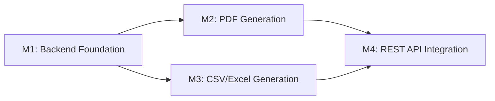

# Implementation Plan: Inventory Management Reporting Backend

**Branch**: `001-inventory-reporting` | **Date**: 2025-12-14 | **Spec**: [spec.md](./spec.md)
**Input**: Feature specification from `/specs/001-inventory-reporting/spec.md`

## Summary

Implement backend REST API endpoints and report generation services for six inventory report types (Stock Levels, Low Stock, Expiration Forecast, Transaction History, Usage Trends, Lot Traceability) with three export formats (PDF, Excel, CSV). The frontend UI is already implemented and expects the backend to integrate with the existing OpenELIS reporting framework (JasperReports for PDF, Apache POI for Excel, custom CSV writer). This feature completes the inventory management module by providing essential reporting capabilities for laboratory operations, compliance, and audit requirements.

## Technical Context

**Language/Version**: Java 21 LTS (OpenJDK/Temurin) - MANDATORY for OpenELIS
**Primary Dependencies**: Spring Framework 6.2.2 (Traditional MVC), Hibernate 6.x, JasperReports 6.20.6, Apache POI 5.4.0
**Storage**: PostgreSQL 14+ (existing inventory tables: inventory_item, inventory_lot, inventory_transaction, inventory_usage, inventory_audit_log)
**Testing**: JUnit 4.13.1 + Mockito 2.21.0 (backend), Cypress 12.17.3 (E2E)
**Target Platform**: Tomcat 10 / Jakarta EE 9 server
**Project Type**: Backend-focused (REST API + report generation services), frontend already implemented
**Performance Goals**: <5 seconds for report generation (datasets <1000 records), <200ms API response for validation endpoints
**Constraints**: MUST use existing reporting framework patterns (JasperReports/POI/CSV), NO new frameworks or libraries beyond what's already in OpenELIS
**Scale/Scope**: Support 10,000 inventory items, 100,000 transactions, 6 report types × 3 export formats = 18 total report variations

## Constitution Check

_GATE: Must pass before Phase 0 research. Re-check after Phase 1 design._

Verify compliance with [OpenELIS Global Constitution](../../.specify/memory/constitution.md):

- [x] **Configuration-Driven**: No country-specific code branches planned - report parameters drive behavior
- [x] **Carbon Design System**: UI already uses @carbon/react exclusively (frontend complete) - backend preserves integration
- [x] **FHIR/IHE Compliance**: Not applicable - internal reporting feature, no external data exchange
- [x] **Layered Architecture**: Backend follows 5-layer pattern (Valueholder→DAO→Service→Controller→Form)
  - **Valueholders MUST use JPA/Hibernate annotations** - Report beans use annotations, no XML mappings
  - **Transaction management MUST be in service layer only** - Services use `@Transactional(readOnly = true)`, NO `@Transactional` on controllers
  - **Services compile all data within transaction** - Report data DTOs fully populated with all required fields before transaction closes
- [x] **Test Coverage**: Unit + ORM validation + integration + E2E tests planned (>80% backend, >70% frontend coverage goal per Constitution V)
  - E2E tests MUST follow Cypress best practices (Constitution V.5):
    - Run tests individually during development (not full suite)
    - Browser console logging enabled and reviewed after each run
    - Video recording disabled by default
    - Post-run review of console logs and screenshots required
    - Use data-testid selectors (PREFERRED)
    - Use cy.session() for login state (10-20x faster)
    - Use API-based test data setup (10x faster than UI)
    - See [Testing Roadmap](../../.specify/guides/testing-roadmap.md#cypress-e2e-testing) for comprehensive Cypress guidance
- [x] **Schema Management**: NO database changes required - uses existing inventory tables
- [x] **Internationalization**: All UI strings already use React Intl (frontend complete) - backend returns data, frontend formats
- [x] **Security & Compliance**: RBAC via existing auth system, audit logging of report generation events

**No Complexity Justifications Required** - All architecture aligns with constitution principles.

## Milestone Plan

_GATE: Features >3 days MUST define milestones per Constitution Principle IX. Each milestone = 1 PR. Use `[P]` prefix for parallel milestones._

**Estimated Effort**: 7-8 days (backend-only, frontend complete)

### Milestone Table

| ID     | Branch Suffix             | Scope                                                                                     | User Stories         | Verification                                | Depends On |
| ------ | ------------------------- | ----------------------------------------------------------------------------------------- | -------------------- | ------------------------------------------- | ---------- |
| M1     | m1-backend-foundation     | Report beans (DTOs), base service structure, DAO queries for data aggregation            | P1, P2 (data layer)  | Unit tests pass (>80% coverage)             | -          |
| M2     | m2-pdf-generation         | JasperReports integration, JRXML templates for all 6 report types, PDF export service    | P1, P2 (PDF export)  | Integration tests pass (PDF generation)     | M1         |
| [P] M3 | m3-csv-excel-generation   | CSV and Excel export services, format-specific data serialization                        | P1, P2 (CSV/Excel)   | Integration tests pass (CSV/Excel files)    | M1         |
| M4     | m4-rest-api-integration   | REST controller, request validation, blob streaming, frontend integration, audit logging | All user stories     | E2E tests pass (all report types + formats) | M2, M3     |

**Legend**:
- **[P]**: Parallel milestone - M3 can be developed alongside M2 after M1 completes
- **Sequential**: M1 → (M2 and M3 in parallel) → M4
- **Branch Names**:
  - `feat/001-inventory-reporting-m1-backend-foundation`
  - `feat/001-inventory-reporting-m2-pdf-generation`
  - `feat/001-inventory-reporting-m3-csv-excel-generation`
  - `feat/001-inventory-reporting-m4-rest-api-integration`

### Milestone Dependency Graph



### PR Strategy

- **Spec PR**: `spec/001-inventory-reporting` → `develop` (specification documents only - ALREADY MERGED)
- **Milestone PRs**:
  - M1: `feat/001-inventory-reporting-m1-backend-foundation` → `develop`
  - M2: `feat/001-inventory-reporting-m2-pdf-generation` → `develop`
  - M3: `feat/001-inventory-reporting-m3-csv-excel-generation` → `develop`
  - M4: `feat/001-inventory-reporting-m4-rest-api-integration` → `develop`

**Rationale for Milestones**:
- M1 establishes data layer - reusable by all export formats
- M2 and M3 can be parallelized (PDF vs CSV/Excel are independent export mechanisms)
- M4 integrates all pieces and validates frontend-backend contract

## Project Structure

### Documentation (this feature)

```text
specs/001-inventory-reporting/
├── plan.md              # This file (/speckit.plan output)
├── spec.md              # Feature specification (COMPLETED)
├── research.md          # Phase 0 output (generated below)
├── data-model.md        # Phase 1 output (generated below)
├── quickstart.md        # Phase 1 output (generated below)
├── contracts/           # Phase 1 output (generated below)
│   └── openapi.yaml     # REST API contract
├── tasks.md             # Phase 2 output (/speckit.tasks - NOT created by /speckit.plan)
└── checklists/
    └── requirements.md  # Spec validation checklist (COMPLETED)
```

### Source Code (repository root)

```text
src/main/java/org/openelisglobal/inventory/
├── controller/
│   └── rest/
│       └── InventoryReportRestController.java         # M4: REST endpoints
├── service/
│   ├── InventoryReportService.java                    # M1: Interface
│   └── InventoryReportServiceImpl.java                # M1-M3: Implementation
├── dao/
│   ├── InventoryReportDAO.java                        # M1: Interface (if complex queries needed)
│   └── InventoryReportDAOImpl.java                    # M1: Implementation
├── valueholder/
│   └── reports/                                       # M1: Report DTOs
│       ├── StockLevelReportData.java
│       ├── LowStockReportData.java
│       ├── ExpirationForecastReportData.java
│       ├── TransactionHistoryReportData.java
│       ├── UsageTrendReportData.java
│       └── LotTraceabilityReportData.java
└── form/
    └── InventoryReportForm.java                       # M4: Request DTO

src/main/resources/reports/
├── InventoryStockLevelsReport.jrxml                   # M2: PDF templates
├── InventoryLowStockReport.jrxml
├── InventoryExpirationForecastReport.jrxml
├── InventoryTransactionHistoryReport.jrxml
├── InventoryUsageTrendsReport.jrxml
└── InventoryLotTraceabilityReport.jrxml

src/test/java/org/openelisglobal/inventory/
├── service/
│   └── InventoryReportServiceTest.java                # M1-M3: Unit tests
└── controller/
    └── rest/
        └── InventoryReportRestControllerTest.java     # M4: Integration tests

frontend/cypress/e2e/
└── inventoryReports.cy.js                             # M4: E2E tests (validate all 6 reports × 3 formats)
```

**Structure Decision**: Backend-focused implementation following OpenELIS 5-layer architecture. Frontend already complete (`InventoryReports.jsx`, `InventoryReportsModal.jsx`, `InventoryService.js`). No new directories created beyond standard OpenELIS patterns.

## Complexity Tracking

> **Fill ONLY if Constitution Check has violations that must be justified**

_Not applicable - no violations identified._

## Testing Strategy

**Reference**: [OpenELIS Testing Roadmap](../../.specify/guides/testing-roadmap.md)

**MANDATORY**: Every plan MUST include a complete testing strategy that references the Testing Roadmap and documents test coverage goals, test types, data management, and checkpoint validations.

### Coverage Goals

- **Backend**: >80% code coverage (measured via JaCoCo)
  - Service layer: >90% (critical business logic for report generation)
  - DAO layer: >75% (query validation)
  - Controller layer: >80% (endpoint validation)
- **Frontend**: >70% code coverage (measured via Jest) - ALREADY MET (UI complete)
- **Critical Paths**: 100% coverage
  - Report generation for all 6 types
  - Export format conversion (PDF/CSV/Excel)
  - Input validation and error handling

### Test Types

Document which test types will be used for this feature:

- [x] **Unit Tests**: Service layer business logic (JUnit 4 + Mockito)
  - Template: `.specify/templates/testing/JUnit4ServiceTest.java.template`
  - **Reference**: [Testing Roadmap - Unit Tests (JUnit 4 + Mockito)](../../.specify/guides/testing-roadmap.md#unit-tests-junit-4--mockito)
  - **Coverage Goal**: >80% (measured via JaCoCo)
  - **SDD Checkpoint**: After M1 (Backend Foundation), all unit tests MUST pass
  - **Test Slicing**: Use `@RunWith(MockitoJUnitRunner.class)` for isolated unit tests
  - **Mocking**: Use `@Mock` (NOT `@MockBean`) for isolated unit tests
  - **Test Cases**:
    - Stock Levels report data aggregation (grouping by type/location)
    - Low Stock threshold calculation logic
    - Expiration forecast date range filtering
    - Transaction history date range validation
    - Usage trends calculation (average consumption rates)
    - Lot traceability linking (lots → test results)

- [x] **DAO Tests**: Persistence layer testing (Traditional Spring MVC)
  - Template: `.specify/templates/testing/DataJpaTestDao.java.template`
  - **Reference**: [Testing Roadmap - Backend Testing](../../.specify/guides/testing-roadmap.md#backend-testing)
  - **Project Note**: This repo uses traditional Spring MVC test patterns (no Boot test slices)
  - **Pattern**: Use `BaseWebContextSensitiveTest` and real DAO beans; rely on rollback/fixture reset patterns from the Testing Roadmap
  - **Test Cases** (if custom DAO methods needed):
    - Complex JOIN FETCH queries for hierarchical data (storage locations)
    - Date range queries for transactions/usage
    - Aggregation queries for stock levels and trends

- [x] **Controller Tests**: REST API endpoints (Traditional Spring MVC)
  - Template: `.specify/templates/testing/WebMvcTestController.java.template`
  - **Reference**: [Testing Roadmap - Backend Testing](../../.specify/guides/testing-roadmap.md#backend-testing)
  - **Project Note**: `@WebMvcTest` is not used in this repository; use `BaseWebContextSensitiveTest`
  - **Pattern**: Use `BaseWebContextSensitiveTest` + `MockMvc`
  - **SDD Checkpoint**: After M4 (REST API Integration), all controller tests MUST pass
  - **Test Cases**:
    - Request validation (required fields, date range validation)
    - HTTP status codes (200 for success, 400 for validation errors, 500 for generation errors)
    - Response headers (Content-Type, Content-Disposition with correct filename)
    - Blob streaming (PDF/CSV/Excel bytes correctly returned)
    - Error handling (graceful degradation, appropriate error messages)

- [x] **Integration Tests**: Full workflow testing (Traditional Spring MVC)
  - **Reference**: [Testing Roadmap - Backend Testing](../../.specify/guides/testing-roadmap.md#backend-testing)
  - **Project Note**: `@SpringBootTest` is not used in this repository; use `BaseWebContextSensitiveTest`
  - **Pattern**: Use `BaseWebContextSensitiveTest` for full-context integration tests
  - **SDD Checkpoint**: After M2/M3 (Export Generation), integration tests MUST pass
  - **Test Cases**:
    - End-to-end report generation (request → service → DAO → JasperReports → PDF bytes)
    - PDF generation for all 6 report types
    - CSV generation for all 6 report types
    - Excel generation for all 6 report types
    - Grouping options (by type, by location) produce correct structure
    - Large dataset handling (1000+ items, 10000+ transactions)

- [x] **E2E Tests**: Critical user workflows (Cypress)
  - Template: `.specify/templates/testing/CypressE2E.cy.js.template`
  - **Reference**: [Constitution Section V.5](../../.specify/memory/constitution.md#section-v5-cypress-e2e-testing-best-practices)
  - **Reference**: [Testing Roadmap - Cypress E2E Testing](../../.specify/guides/testing-roadmap.md#cypress-e2e-testing)
  - **SDD Checkpoint**: After M4 (REST API Integration), E2E tests MUST pass
  - **Test Cases** (6 reports × 3 formats = 18 workflows):
    - Stock Levels: PDF, Excel, CSV generation + download
    - Low Stock: PDF, Excel, CSV generation + download
    - Expiration Forecast: PDF, Excel, CSV generation + download
    - Transaction History: PDF, Excel, CSV generation + download (date range required)
    - Usage Trends: PDF, Excel, CSV generation + download (date range required)
    - Lot Traceability: PDF, Excel, CSV generation + download
  - **Validation**:
    - File downloads with correct filename and extension
    - No JavaScript errors in console
    - Success notifications displayed
    - Report parameters correctly sent to backend

### Test Data Management

Document how test data will be created and cleaned up:

- **Backend**:
  - **Unit Tests**: Use builders/factories for test data (NOT hardcoded values)
    - `InventoryItemTestDataBuilder` - Creates test inventory items with randomized data
    - `InventoryLotTestDataBuilder` - Creates test lots with expiration dates
    - `InventoryTransactionTestDataBuilder` - Creates test transactions with timestamps
  - **DAO/Integration**: Use `@Transactional` rollback for test isolation
    - Each test runs in transaction, rolled back after test completes
    - Test data does not persist between tests
  - **Integration Tests**: Use `BaseWebContextSensitiveTest` with transactional rollback

- **Frontend**:
  - **E2E Tests (Cypress)**:
    - [x] Use API-based setup via `cy.request()` (NOT slow UI interactions) - 10x faster
      - Create inventory items via REST API before test
      - Create lots via REST API with specific expiration dates
      - Create transactions via REST API within date ranges
    - [x] Use fixtures with `cy.intercept()` for consistent test data
      - Mock report generation responses for fast validation tests
      - Use real API calls for integration tests
    - [x] Use `cy.session()` for login state (10-20x faster than per-test login)
      - Cache authentication session across test files
      - Login once, reuse session for all report generation tests

### Checkpoint Validations

Document which tests must pass at each SDD phase checkpoint:

- [x] **After M1 (Backend Foundation)**: Unit tests for service layer and DAO queries must pass (>80% coverage)
  - All 6 report types have unit tests validating data aggregation logic
  - DAO queries correctly fetch and aggregate inventory data
- [x] **After M2 (PDF Generation)**: Integration tests for PDF generation must pass
  - All 6 report types generate valid PDF files
  - JasperReports parameters correctly populated
  - PDF file size >0 bytes, no generation errors
- [x] **After M3 (CSV/Excel Generation)**: Integration tests for CSV/Excel must pass
  - All 6 report types generate valid CSV files
  - All 6 report types generate valid Excel files
  - CSV properly escapes special characters
  - Excel files open without errors in Microsoft Excel
- [x] **After M4 (REST API Integration)**: E2E tests (Cypress) must pass
  - All 18 workflows (6 reports × 3 formats) successfully download files
  - Frontend-backend contract validated
  - No JavaScript errors, no API failures
  - Audit logging correctly records report generation events

### TDD Workflow (Constitution Principle V)

**Red-Green-Refactor Cycle** for all milestones:

1. **M1 - Backend Foundation**:
   - RED: Write unit test for stock level aggregation logic → FAIL
   - GREEN: Implement service method to aggregate stock levels → PASS
   - REFACTOR: Extract common aggregation patterns, improve query performance
   - REPEAT for all 6 report types

2. **M2 - PDF Generation**:
   - RED: Write integration test for PDF generation → FAIL (no JRXML template)
   - GREEN: Create JRXML template, implement PDF generation → PASS
   - REFACTOR: Extract common Jasper parameters, improve template structure

3. **M3 - CSV/Excel Generation**:
   - RED: Write integration test for CSV generation → FAIL
   - GREEN: Implement CSV serialization logic → PASS
   - REFACTOR: Extract common export patterns, improve character escaping

4. **M4 - REST API Integration**:
   - RED: Write E2E test for report download → FAIL (no controller endpoint)
   - GREEN: Implement controller endpoint, blob streaming → PASS
   - REFACTOR: Extract error handling patterns, improve response headers

---

## Phase 0: Research & Unknowns Resolution

All technical unknowns have been resolved through codebase exploration. See [research.md](./research.md) for detailed findings.

**Key Decisions Made**:
- Use existing JasperReports integration patterns (Report.java base class)
- Use Apache POI HSSF for .xls format (poi-ooxml not in dependencies)
- Follow FreezerReportServiceImpl pattern for service layer
- Use HttpServletResponse direct writing for blob responses
- Use JRBeanCollectionDataSource for report data

---

## Phase 1: Design & Contracts

### Data Model

See [data-model.md](./data-model.md) for complete entity definitions.

**Summary of Report DTOs**:
- StockLevelReportData - Current inventory snapshot
- LowStockReportData - Items below reorder threshold
- ExpirationForecastReportData - Expiring lots within date range
- TransactionHistoryReportData - Transaction audit trail
- UsageTrendReportData - Consumption aggregations
- LotTraceabilityReportData - Lot-to-test-result linkage

### API Contracts

See [contracts/openapi.yaml](./contracts/openapi.yaml) for complete OpenAPI specification.

**Summary of REST Endpoints**:
- `POST /rest/inventory/reports/generate` - Generate and download report
  - Query params: reportType, exportFormat, startDate, endDate, includeInactive, includeExpired, groupByType, groupByLocation
  - Response: Binary blob (PDF/CSV/Excel)
  - Headers: Content-Type, Content-Disposition

### Quick Start Guide

See [quickstart.md](./quickstart.md) for step-by-step implementation guide.

---

## Implementation Notes

### Critical Success Factors

1. **Data Compilation in Service Layer** (Constitution IV):
   - Services MUST eagerly fetch all data needed for reports
   - Use JOIN FETCH in HQL queries for hierarchical data (storage locations)
   - Return complete DTOs with all relationships resolved
   - Controllers MUST NOT traverse entity relationships

2. **Transaction Management** (Constitution IV):
   - Services use `@Transactional(readOnly = true)` for report queries
   - Controllers MUST NOT have `@Transactional` annotations
   - All database queries complete within service transaction

3. **Frontend Integration**:
   - Match exact contract expected by InventoryService.js ReportsAPI.generate()
   - Return Content-Type and Content-Disposition headers exactly as frontend expects
   - Generate filenames with format: `inventory-report-{type}-{timestamp}.{ext}`

4. **Performance Optimization**:
   - Use pagination or warning for reports >10,000 records
   - Optimize HQL queries with proper indexing
   - Cache JasperReports compiled templates (.jasper files)
   - Stream large result sets rather than loading all into memory

5. **Testing Rigor**:
   - Run E2E tests individually during development (Constitution V.5)
   - Review browser console logs after each test run
   - Use API-based test data setup (10x faster than UI)
   - Verify all 18 workflows (6 reports × 3 formats)

### Known Constraints

- Apache POI: Only poi (HSSF) available, NOT poi-ooxml (XSSF). Use .xls format, NOT .xlsx.
- JasperReports: Templates must be compiled to .jasper at build time (Maven plugin)
- File Downloads: Frontend expects blob response with Content-Disposition header
- Date Handling: Use server timezone for consistency with existing OpenELIS behavior

---

**Next Steps**:
1. Review and approve this plan
2. Run `/speckit.tasks` to generate milestone-based task breakdown
3. Run `/speckit.implement` to begin M1 implementation (TDD workflow)
