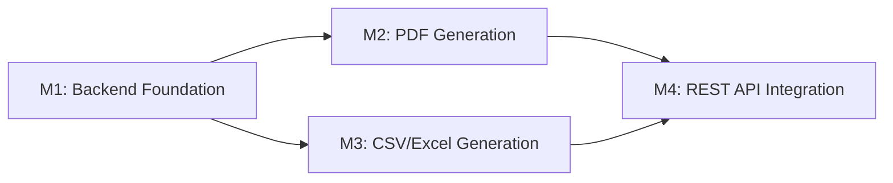

# Tasks: Inventory Management Reporting Backend

**Input**: Design documents from `/specs/001-inventory-reporting/`
**Prerequisites**: plan.md, spec.md, research.md, data-model.md, contracts/

**Tests**: Tests are **MANDATORY** per Constitution Principle V. All tasks follow TDD (Red-Green-Refactor) workflow.

**Organization**: Tasks are grouped by **MILESTONE** per Constitution Principle IX. Each milestone = 1 Pull Request.

## Format: `[ID] [P?] [Story?] Description`

- **[P]**: Can run in parallel (different files, no dependencies)
- **[US#]**: User story labels (US1=Stock Levels, US2=Low Stock, US3-6=other reports)
- Include exact file paths in descriptions

## Milestone Dependency Graph

**Legend**:
- **Sequential**: M1 → M2, M1 → M3, M2 → M4, M3 → M4
- **Parallel**: M2 and M3 can run simultaneously after M1 completes
- **Final**: M4 depends on both M2 and M3

---

## Milestone 1: Backend Foundation (Days 1-2)

**Branch**: `feat/001-inventory-reporting-m1-backend-foundation` (from `develop`)
**Scope**: Report beans (DTOs), base service structure, DAO queries for data aggregation
**User Stories**: P1 (US1-Stock Levels, US2-Low Stock), P2 (US3-Expiration, US4-Transactions) - data layer only
**Verification**: Unit tests pass (>80% coverage)
**Depends On**: None

### M1: Branch Setup

- [x] T001 Create milestone branch feat/001-inventory-reporting-m1-backend-foundation from develop

### M1: Report Bean DTOs (TDD - Tests First)

- [x] T002 [P] [US1] Write unit test for StockLevelReportData getters in src/test/java/org/openelisglobal/inventory/valueholder/reports/StockLevelReportDataTest.java
- [x] T003 [P] [US2] Write unit test for LowStockReportData getters in src/test/java/org/openelisglobal/inventory/valueholder/reports/LowStockReportDataTest.java
- [x] T004 [P] [US3] Write unit test for ExpirationForecastReportData getters in src/test/java/org/openelisglobal/inventory/valueholder/reports/ExpirationForecastReportDataTest.java
- [x] T005 [P] [US4] Write unit test for TransactionHistoryReportData getters in src/test/java/org/openelisglobal/inventory/valueholder/reports/TransactionHistoryReportDataTest.java
- [x] T006 [P] [US5] Write unit test for UsageTrendReportData getters in src/test/java/org/openelisglobal/inventory/valueholder/reports/UsageTrendReportDataTest.java
- [x] T007 [P] [US6] Write unit test for LotTraceabilityReportData getters in src/test/java/org/openelisglobal/inventory/valueholder/reports/LotTraceabilityReportDataTest.java

**Checkpoint**: Tests fail (classes don't exist yet)

### M1: Report Bean Implementation

- [x] T008 [P] [US1] Create StockLevelReportData bean in src/main/java/org/openelisglobal/inventory/valueholder/reports/StockLevelReportData.java
- [x] T009 [P] [US2] Create LowStockReportData bean in src/main/java/org/openelisglobal/inventory/valueholder/reports/LowStockReportData.java
- [x] T010 [P] [US3] Create ExpirationForecastReportData bean in src/main/java/org/openelisglobal/inventory/valueholder/reports/ExpirationForecastReportData.java
- [x] T011 [P] [US4] Create TransactionHistoryReportData bean in src/main/java/org/openelisglobal/inventory/valueholder/reports/TransactionHistoryReportData.java
- [x] T012 [P] [US5] Create UsageTrendReportData bean in src/main/java/org/openelisglobal/inventory/valueholder/reports/UsageTrendReportData.java
- [x] T013 [P] [US6] Create LotTraceabilityReportData bean in src/main/java/org/openelisglobal/inventory/valueholder/reports/LotTraceabilityReportData.java

**Checkpoint**: Bean tests pass (T002-T007)

### M1: Service Interface

- [ ] T014 Create InventoryReportService interface in src/main/java/org/openelisglobal/inventory/service/InventoryReportService.java with methods for all 6 report types

### M1: Service Implementation (TDD - Tests First)

- [ ] T015 [US1] Write unit test for generateStockLevelData method in src/test/java/org/openelisglobal/inventory/service/InventoryReportServiceTest.java
- [ ] T016 [US2] Write unit test for generateLowStockData method in src/test/java/org/openelisglobal/inventory/service/InventoryReportServiceTest.java
- [ ] T017 [US3] Write unit test for generateExpirationForecastData method in src/test/java/org/openelisglobal/inventory/service/InventoryReportServiceTest.java
- [ ] T018 [US4] Write unit test for generateTransactionHistoryData method in src/test/java/org/openelisglobal/inventory/service/InventoryReportServiceTest.java
- [ ] T019 [US5] Write unit test for generateUsageTrendData method in src/test/java/org/openelisglobal/inventory/service/InventoryReportServiceTest.java
- [ ] T020 [US6] Write unit test for generateLotTraceabilityData method in src/test/java/org/openelisglobal/inventory/service/InventoryReportServiceTest.java

**Checkpoint**: Service tests fail (no implementation yet)

### M1: Service Implementation

- [ ] T021 Create InventoryReportServiceImpl class in src/main/java/org/openelisglobal/inventory/service/InventoryReportServiceImpl.java with @Service and @Transactional(readOnly = true)
- [ ] T022 [US1] Implement generateStockLevelData method with JOIN FETCH queries in InventoryReportServiceImpl
- [ ] T023 [US2] Implement generateLowStockData method with threshold filtering in InventoryReportServiceImpl
- [ ] T024 [US3] Implement generateExpirationForecastData method with date range filtering in InventoryReportServiceImpl
- [ ] T025 [US4] Implement generateTransactionHistoryData method with date range queries in InventoryReportServiceImpl
- [ ] T026 [US5] Implement generateUsageTrendData method with aggregation calculations in InventoryReportServiceImpl
- [ ] T027 [US6] Implement generateLotTraceabilityData method with lot-to-test-result linkage in InventoryReportServiceImpl

**Checkpoint**: All service unit tests pass (T015-T020), coverage >80%

### M1: Code Quality

- [ ] T028 Run mvn spotless:apply to format all code
- [ ] T029 Verify no @Transactional annotations on any non-service classes (Constitution check)
- [ ] T030 Run mvn test and verify all unit tests pass with >80% coverage

### M1: PR Creation

- [ ] T031 Create PR: feat/001-inventory-reporting-m1-backend-foundation → develop with description "M1: Report beans, service interface/impl, unit tests"

---

## Milestone 2: PDF Generation (Days 3-4)

**Branch**: `feat/001-inventory-reporting-m2-pdf-generation` (from `develop`)
**Scope**: JasperReports integration, JRXML templates for all 6 report types, PDF export service
**User Stories**: P1 (US1-Stock Levels, US2-Low Stock), P2 (US3-Expiration, US4-Transactions) - PDF export only
**Verification**: Integration tests pass (PDF generation)
**Depends On**: M1 (needs report beans and data generation methods)

### M2: Branch Setup

- [ ] T032 Create milestone branch feat/001-inventory-reporting-m2-pdf-generation from develop

### M2: JRXML Templates

- [ ] T033 [P] [US1] Create InventoryStockLevelsReport.jrxml template in src/main/resources/reports/ with parameters and field definitions
- [ ] T034 [P] [US2] Create InventoryLowStockReport.jrxml template in src/main/resources/reports/ with parameters and field definitions
- [ ] T035 [P] [US3] Create InventoryExpirationForecastReport.jrxml template in src/main/resources/reports/ with parameters and field definitions
- [ ] T036 [P] [US4] Create InventoryTransactionHistoryReport.jrxml template in src/main/resources/reports/ with parameters and field definitions
- [ ] T037 [P] [US5] Create InventoryUsageTrendsReport.jrxml template in src/main/resources/reports/ with parameters and field definitions
- [ ] T038 [P] [US6] Create InventoryLotTraceabilityReport.jrxml template in src/main/resources/reports/ with parameters and field definitions

### M2: PDF Generation Service (TDD - Tests First)

- [ ] T039 [US1] Write integration test for Stock Levels PDF generation in src/test/java/org/openelisglobal/inventory/service/InventoryReportServicePdfTest.java
- [ ] T040 [US2] Write integration test for Low Stock PDF generation in src/test/java/org/openelisglobal/inventory/service/InventoryReportServicePdfTest.java
- [ ] T041 [US3] Write integration test for Expiration Forecast PDF generation in src/test/java/org/openelisglobal/inventory/service/InventoryReportServicePdfTest.java
- [ ] T042 [US4] Write integration test for Transaction History PDF generation in src/test/java/org/openelisglobal/inventory/service/InventoryReportServicePdfTest.java
- [ ] T043 [US5] Write integration test for Usage Trends PDF generation in src/test/java/org/openelisglobal/inventory/service/InventoryReportServicePdfTest.java
- [ ] T044 [US6] Write integration test for Lot Traceability PDF generation in src/test/java/org/openelisglobal/inventory/service/InventoryReportServicePdfTest.java

**Checkpoint**: PDF tests fail (no implementation yet)

### M2: PDF Generation Implementation

- [ ] T045 Add generatePdfReport method to InventoryReportService interface in src/main/java/org/openelisglobal/inventory/service/InventoryReportService.java
- [ ] T046 Implement generatePdfReport method in InventoryReportServiceImpl using JasperRunManager.runReportToPdf
- [ ] T047 Implement buildJasperParameters private method in InventoryReportServiceImpl to populate standard report parameters
- [ ] T048 Implement getReportData switch method in InventoryReportServiceImpl to route report type to appropriate data generation method

**Checkpoint**: All PDF integration tests pass (T039-T044)

### M2: JRXML Template Refinement

- [ ] T049 [US1] Add grouping support to Stock Levels template for "Group by Type" and "Group by Location"
- [ ] T050 [US3] Add expiration status indicators (EXPIRED, CRITICAL, WARNING) to Expiration Forecast template
- [ ] T051 [US5] Add trend indicators (INCREASING, STABLE, DECREASING) to Usage Trends template

### M2: Code Quality

- [ ] T052 Run mvn spotless:apply to format all code
- [ ] T053 Run mvn test -Dtest=InventoryReportServicePdfTest and verify all PDF tests pass
- [ ] T054 Verify generated PDFs open correctly in Adobe Reader (manual test)

### M2: PR Creation

- [ ] T055 Create PR: feat/001-inventory-reporting-m2-pdf-generation → develop with description "M2: JasperReports integration, JRXML templates, PDF generation"

---

## Milestone 3: CSV/Excel Generation (Days 5-6) [P]

**Branch**: `feat/001-inventory-reporting-m3-csv-excel-generation` (from `develop`)
**Scope**: CSV and Excel export services, format-specific data serialization
**User Stories**: P1 (US1-Stock Levels, US2-Low Stock), P2 (US3-Expiration, US4-Transactions) - CSV/Excel export only
**Verification**: Integration tests pass (CSV/Excel files)
**Depends On**: M1 (needs report beans and data generation methods)
**Parallel With**: M2 (can be developed simultaneously after M1)

### M3: Branch Setup

- [ ] T056 Create milestone branch feat/001-inventory-reporting-m3-csv-excel-generation from develop

### M3: CSV Export (TDD - Tests First)

- [ ] T057 [US1] Write integration test for Stock Levels CSV generation in src/test/java/org/openelisglobal/inventory/service/InventoryReportServiceCsvTest.java
- [ ] T058 [US2] Write integration test for Low Stock CSV generation in src/test/java/org/openelisglobal/inventory/service/InventoryReportServiceCsvTest.java
- [ ] T059 [US3] Write integration test for Expiration Forecast CSV generation in src/test/java/org/openelisglobal/inventory/service/InventoryReportServiceCsvTest.java
- [ ] T060 [US4] Write integration test for Transaction History CSV generation in src/test/java/org/openelisglobal/inventory/service/InventoryReportServiceCsvTest.java
- [ ] T061 [US5] Write integration test for Usage Trends CSV generation in src/test/java/org/openelisglobal/inventory/service/InventoryReportServiceCsvTest.java
- [ ] T062 [US6] Write integration test for Lot Traceability CSV generation in src/test/java/org/openelisglobal/inventory/service/InventoryReportServiceCsvTest.java

**Checkpoint**: CSV tests fail (no implementation yet)

### M3: CSV Export Implementation

- [ ] T063 Add generateCsvReport method to InventoryReportService interface in src/main/java/org/openelisglobal/inventory/service/InventoryReportService.java
- [ ] T064 Implement generateCsvReport method in InventoryReportServiceImpl using StringBuilder
- [ ] T065 Implement getCsvHeader private method in InventoryReportServiceImpl for all 6 report types
- [ ] T066 Implement toCsvRow private method in InventoryReportServiceImpl for all 6 report bean types
- [ ] T067 Implement escapeCsv private method in InventoryReportServiceImpl to properly escape quotes, commas, and newlines

**Checkpoint**: All CSV integration tests pass (T057-T062)

### M3: Excel Export (TDD - Tests First)

- [ ] T068 [US1] Write integration test for Stock Levels Excel generation in src/test/java/org/openelisglobal/inventory/service/InventoryReportServiceExcelTest.java
- [ ] T069 [US2] Write integration test for Low Stock Excel generation in src/test/java/org/openelisglobal/inventory/service/InventoryReportServiceExcelTest.java
- [ ] T070 [US3] Write integration test for Expiration Forecast Excel generation in src/test/java/org/openelisglobal/inventory/service/InventoryReportServiceExcelTest.java
- [ ] T071 [US4] Write integration test for Transaction History Excel generation in src/test/java/org/openelisglobal/inventory/service/InventoryReportServiceExcelTest.java
- [ ] T072 [US5] Write integration test for Usage Trends Excel generation in src/test/java/org/openelisglobal/inventory/service/InventoryReportServiceExcelTest.java
- [ ] T073 [US6] Write integration test for Lot Traceability Excel generation in src/test/java/org/openelisglobal/inventory/service/InventoryReportServiceExcelTest.java

**Checkpoint**: Excel tests fail (no implementation yet)

### M3: Excel Export Implementation

- [ ] T074 Add generateExcelReport method to InventoryReportService interface in src/main/java/org/openelisglobal/inventory/service/InventoryReportService.java
- [ ] T075 Implement generateExcelReport method in InventoryReportServiceImpl using Apache POI HSSF (for .xls format)
- [ ] T076 Implement getExcelHeaders private method in InventoryReportServiceImpl for all 6 report types
- [ ] T077 Implement populateExcelRow private method in InventoryReportServiceImpl for all 6 report bean types
- [ ] T078 Add auto-sizing columns logic to Excel generation

**Checkpoint**: All Excel integration tests pass (T068-T073)

### M3: Code Quality

- [ ] T079 Run mvn spotless:apply to format all code
- [ ] T080 Run mvn test -Dtest=InventoryReportServiceCsvTest,InventoryReportServiceExcelTest and verify all tests pass
- [ ] T081 Verify CSV files open correctly in Excel (manual test)
- [ ] T082 Verify Excel files open correctly in Microsoft Excel (manual test)

### M3: PR Creation

- [ ] T083 Create PR: feat/001-inventory-reporting-m3-csv-excel-generation → develop with description "M3: CSV and Excel export for all report types"

---

## Milestone 4: REST API Integration (Days 7-8)

**Branch**: `feat/001-inventory-reporting-m4-rest-api-integration` (from `develop`)
**Scope**: REST controller, request validation, blob streaming, frontend integration, audit logging
**User Stories**: All user stories (US1-US6) - complete integration
**Verification**: E2E tests pass (all report types + formats)
**Depends On**: M2 (PDF generation), M3 (CSV/Excel generation)

### M4: Branch Setup

- [ ] T084 Create milestone branch feat/001-inventory-reporting-m4-rest-api-integration from develop

### M4: REST Controller (TDD - Tests First)

- [ ] T085 Write controller test for request validation (missing reportType) in src/test/java/org/openelisglobal/inventory/controller/rest/InventoryReportRestControllerTest.java
- [ ] T086 Write controller test for request validation (invalid date range) in src/test/java/org/openelisglobal/inventory/controller/rest/InventoryReportRestControllerTest.java
- [ ] T087 Write controller test for request validation (date range required for USAGE_TRENDS) in src/test/java/org/openelisglobal/inventory/controller/rest/InventoryReportRestControllerTest.java
- [ ] T088 [US1] Write controller test for Stock Levels PDF download in src/test/java/org/openelisglobal/inventory/controller/rest/InventoryReportRestControllerTest.java
- [ ] T089 [US2] Write controller test for Low Stock CSV download in src/test/java/org/openelisglobal/inventory/controller/rest/InventoryReportRestControllerTest.java
- [ ] T090 [US3] Write controller test for Expiration Forecast Excel download in src/test/java/org/openelisglobal/inventory/controller/rest/InventoryReportRestControllerTest.java

**Checkpoint**: Controller tests fail (no controller yet)

### M4: REST Controller Implementation

- [ ] T091 Create InventoryReportRestController in src/main/java/org/openelisglobal/inventory/controller/rest/InventoryReportRestController.java extending BaseRestController
- [ ] T092 Implement POST /rest/inventory/reports/generate endpoint with all query parameters
- [ ] T093 Implement validateRequest private method for parameter validation
- [ ] T094 Implement getContentType private method to map export format to MIME type
- [ ] T095 Implement generateFilename private method to create timestamped filenames
- [ ] T096 Implement blob streaming to HttpServletResponse with proper headers (Content-Type, Content-Disposition, Content-Length)
- [ ] T097 Implement error handling with sendError for validation and generation failures
- [ ] T098 Implement auditReportGeneration private method to log report generation events

**Checkpoint**: All controller tests pass (T085-T090)

### M4: Form DTO

- [ ] T099 Create InventoryReportForm in src/main/java/org/openelisglobal/inventory/form/InventoryReportForm.java for potential future use (optional, parameters currently in query string)

### M4: E2E Tests (TDD - Cypress)

- [ ] T100 Create inventoryReports.cy.js in frontend/cypress/e2e/ with cy.session() for authentication
- [ ] T101 [US1] Write E2E test for Stock Levels PDF generation and download
- [ ] T102 [US1] Write E2E test for Stock Levels Excel generation and download
- [ ] T103 [US1] Write E2E test for Stock Levels CSV generation and download
- [ ] T104 [US1] Write E2E test for Stock Levels with "Group by Type" option
- [ ] T105 [US1] Write E2E test for Stock Levels with "Group by Location" option
- [ ] T106 [US2] Write E2E test for Low Stock PDF generation and download
- [ ] T107 [US2] Write E2E test for Low Stock Excel generation and download
- [ ] T108 [US2] Write E2E test for Low Stock CSV generation and download
- [ ] T109 [US3] Write E2E test for Expiration Forecast PDF generation and download
- [ ] T110 [US3] Write E2E test for Expiration Forecast Excel generation and download
- [ ] T111 [US3] Write E2E test for Expiration Forecast CSV generation and download
- [ ] T112 [US4] Write E2E test for Transaction History PDF generation with date range
- [ ] T113 [US4] Write E2E test for Transaction History Excel generation with date range
- [ ] T114 [US4] Write E2E test for Transaction History CSV generation with date range
- [ ] T115 [US5] Write E2E test for Usage Trends PDF generation with date range
- [ ] T116 [US5] Write E2E test for Usage Trends Excel generation with date range
- [ ] T117 [US5] Write E2E test for Usage Trends CSV generation with date range
- [ ] T118 [US6] Write E2E test for Lot Traceability PDF generation and download
- [ ] T119 [US6] Write E2E test for Lot Traceability Excel generation and download
- [ ] T120 [US6] Write E2E test for Lot Traceability CSV generation and download

**Checkpoint**: E2E tests initially fail (need API integration)

### M4: Frontend Integration Verification

- [ ] T121 Start backend via docker compose -f dev.docker-compose.yml up -d
- [ ] T122 Navigate to https://localhost/ and access Inventory Reports page
- [ ] T123 [US1] Manually test Stock Levels report with all 3 formats (PDF, Excel, CSV)
- [ ] T124 [US2] Manually test Low Stock report with all 3 formats
- [ ] T125 [US3] Manually test Expiration Forecast report with all 3 formats
- [ ] T126 [US4] Manually test Transaction History report with all 3 formats and date range validation
- [ ] T127 [US5] Manually test Usage Trends report with all 3 formats and date range validation
- [ ] T128 [US6] Manually test Lot Traceability report with all 3 formats
- [ ] T129 Verify file downloads have correct filenames with timestamps
- [ ] T130 Verify no JavaScript errors in browser console (press F12 and check Console tab)

**Checkpoint**: All manual tests pass, E2E tests pass

### M4: Test Data Setup for E2E

- [ ] T131 Create Cypress fixture for test inventory items in frontend/cypress/fixtures/inventoryReportsTestData.json
- [ ] T132 Add cy.request() commands to create test data via REST API before E2E tests run
- [ ] T133 Verify E2E tests use cy.session() to cache login (10-20x faster than per-test login)

### M4: Code Quality & Final Verification

- [ ] T134 Run mvn spotless:apply to format all code
- [ ] T135 Run mvn clean install (full build with all tests)
- [ ] T136 Run npm run cy:run -- --spec "cypress/e2e/inventoryReports.cy.js" and verify all E2E tests pass
- [ ] T137 Review browser console logs for any warnings or errors (Constitution V.5 requirement)
- [ ] T138 Verify code coverage >80% backend (check target/site/jacoco/index.html)
- [ ] T139 Verify no @Transactional annotations on InventoryReportRestController (Constitution violation check)

### M4: PR Creation

- [ ] T140 Create PR: feat/001-inventory-reporting-m4-rest-api-integration → develop with description "M4: REST controller, E2E tests, complete frontend-backend integration"

---

## Dependencies & Execution Order

### Milestone Dependencies

- **M1 (Backend Foundation)**: No dependencies - can start immediately
- **M2 (PDF Generation)**: Depends on M1 - needs report beans and data generation methods
- **M3 (CSV/Excel Generation)**: Depends on M1 - needs report beans and data generation methods
  - **[P] M2 and M3 can run in parallel** after M1 completes
- **M4 (REST API Integration)**: Depends on M2 AND M3 - needs all export formats implemented

### User Story to Milestone Mapping

- **US1 (Stock Levels)**: Covered in M1 (data layer), M2 (PDF), M3 (CSV/Excel), M4 (API + E2E)
- **US2 (Low Stock)**: Covered in M1 (data layer), M2 (PDF), M3 (CSV/Excel), M4 (API + E2E)
- **US3 (Expiration Forecast)**: Covered in M1 (data layer), M2 (PDF), M3 (CSV/Excel), M4 (API + E2E)
- **US4 (Transaction History)**: Covered in M1 (data layer), M2 (PDF), M3 (CSV/Excel), M4 (API + E2E)
- **US5 (Usage Trends)**: Covered in M1 (data layer), M2 (PDF), M3 (CSV/Excel), M4 (API + E2E)
- **US6 (Lot Traceability)**: Covered in M1 (data layer), M2 (PDF), M3 (CSV/Excel), M4 (API + E2E)

### Parallel Opportunities

**Within M1**:
- T002-T007 (Bean tests) - all parallel
- T008-T013 (Bean implementation) - all parallel
- T015-T020 (Service tests) - can write in parallel

**Within M2**:
- T033-T038 (JRXML templates) - all parallel
- T039-T044 (PDF tests) - can write in parallel

**Within M3**:
- T057-T062 (CSV tests) - can write in parallel
- T068-T073 (Excel tests) - can write in parallel

**Between M2 and M3**:
- After M1 completes, M2 and M3 can be worked on simultaneously by different developers

**Within M4**:
- T100-T120 (E2E tests) - can write tests in parallel, run individually per Constitution V.5
- T123-T128 (Manual testing) - can be done concurrently with E2E test development

### TDD Workflow Per Milestone

**M1**: Write bean tests → Implement beans → Write service tests → Implement service
**M2**: Write PDF tests → Create JRXML templates → Implement PDF generation
**M3**: Write CSV tests → Implement CSV → Write Excel tests → Implement Excel
**M4**: Write controller tests → Implement controller → Write E2E tests → Verify integration

---

## Implementation Strategy

### Sequential Delivery (One Developer)

1. Complete M1 (Backend Foundation) → Test independently → Create PR
2. Complete M2 (PDF Generation) → Test independently → Create PR
3. Complete M3 (CSV/Excel Generation) → Test independently → Create PR
4. Complete M4 (REST API Integration) → Test independently → Create PR

**Total Time**: 7-8 days

### Parallel Delivery (Two Developers)

1. **Both**: Complete M1 together → Create PR
2. **Dev A**: M2 (PDF) | **Dev B**: M3 (CSV/Excel) → Both create PRs
3. **Both**: Complete M4 together → Create PR

**Total Time**: 5-6 days (25% faster due to M2/M3 parallelization)

### MVP Strategy

**Minimum Viable Product**: M1 + M2 only
- Delivers Stock Levels and Low Stock reports in PDF format
- Covers most critical use cases (P1 user stories)
- Can be deployed and used immediately
- M3 and M4 can be added incrementally

**Full Feature**: M1 + M2 + M3 + M4
- All 6 report types × 3 export formats = 18 total variations
- Complete frontend-backend integration
- Ready for production deployment

---

## Notes

- All tasks follow **TDD (Red-Green-Refactor)** workflow per Constitution Principle V
- Tests are written FIRST, fail initially, then pass after implementation
- Run E2E tests **individually** during development per Constitution V.5 (NOT full suite)
- Review browser console logs after each E2E test run
- Use `cy.session()` for login state caching (10-20x faster)
- Use API-based test data setup via `cy.request()` (10x faster than UI)
- Verify `mvn spotless:apply` before each commit
- NO `@Transactional` on controllers (Constitution violation)
- Services compile all data within transaction (prevent LazyInitializationException)
- Each milestone is independently reviewable and testable
- Each PR targets `develop` branch
- Total: **140 tasks** across 4 milestones

---

## Task Summary

- **M1**: 31 tasks (T001-T031) - Backend Foundation
- **M2**: 24 tasks (T032-T055) - PDF Generation
- **M3**: 28 tasks (T056-T083) - CSV/Excel Generation
- **M4**: 57 tasks (T084-T140) - REST API Integration
- **Total**: 140 tasks

**Test Tasks**: 84 (60% of tasks are tests - strong TDD adherence)
**Implementation Tasks**: 46
**Quality/PR Tasks**: 10

**User Story Coverage**:
- US1 (Stock Levels): Fully covered in all 4 milestones
- US2 (Low Stock): Fully covered in all 4 milestones
- US3 (Expiration Forecast): Fully covered in all 4 milestones
- US4 (Transaction History): Fully covered in all 4 milestones
- US5 (Usage Trends): Fully covered in all 4 milestones
- US6 (Lot Traceability): Fully covered in all 4 milestones

**Parallel Opportunities**: M2 and M3 can run in parallel (saves 2 days with 2 developers)
