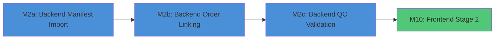

# Tasks: Medical Laboratory Workflow - Stage 2 (Sample Collection)

**Feature Branch**: `001-medical-lab-workflow` **Generated**: 2026-01-08
**Spec**: [spec.md](spec.md) | **Plan**: [plan.md](plan.md)

**Focus**: Stage 2 Sample Collection - Two-step workflow (Manifest Import →
Order Linking)

**User Stories Covered**:

- **US2 (P1)**: Sample Collection and Labeling
- **US3 (P1)**: Sample Reception and Quality Control

## Milestone Dependency Graph



---

## Milestone 2a: Manifest Import Service (Backend)

**Branch**: `feat/001-medical-lab-workflow/m2a-manifest-import`
**Dependencies**: M1 (Order-Driven Foundation) **User Stories**: US2 (P1)
**Verification**: Import 5 samples via CSV, verify all 13 fields parsed
correctly

### Tests for M2a (TDD - Write FIRST)

- [ ] T001 [P] [US2] Create MedLabManifestImportServiceTest.java in
      `src/test/java/org/openelisglobal/medlab/service/MedLabManifestImportServiceTest.java`
- [ ] T002 [P] [US2] Test CSV parsing with all 13 manifest fields in
      MedLabManifestImportServiceTest
- [ ] T003 [P] [US2] Test validation for required fields (sampleId,
      sampleTypeId, containerType, quantity, unitOfMeasure, collectionSource,
      collector, collectionDate, collectionTime)
- [ ] T004 [P] [US2] Test anonymous sample support (patientId = NULL) in
      MedLabManifestImportServiceTest
- [ ] T005 [P] [US2] Test date/time parsing (YYYY-MM-DD, HH:MM) in
      MedLabManifestImportServiceTest

### Implementation for M2a

- [ ] T006 [US2] Create MedLabManifestImportForm.java in
      `src/main/java/org/openelisglobal/medlab/form/MedLabManifestImportForm.java`
      with column mappings: - sampleIdColumn, sampleTypeColumn,
      containerTypeColumn, customLabelColumn - quantityColumn,
      unitOfMeasureColumn, collectionSourceColumn, collectorColumn -
      collectionDateColumn, collectionTimeColumn, orderIdColumn,
      patientIdColumn, notesColumn
- [ ] T007 [US2] Create MedLabManifestImportService interface in
      `src/main/java/org/openelisglobal/medlab/service/MedLabManifestImportService.java`
- [ ] T008 [US2] Create MedLabManifestImportServiceImpl.java in
      `src/main/java/org/openelisglobal/medlab/service/MedLabManifestImportServiceImpl.java`
      with: - parseManifestCsv() - Parse CSV with 13 field mappings -
      validateRequiredFields() - Check required fields present -
      createSamplesForEntry() - Create Sample + SampleItem records
- [ ] T009 [US2] Implement CSV row parsing in MedLabManifestImportServiceImpl: -
      Map sampleId → SampleItem.accessionNumber - Map sampleTypeId →
      SampleItem.typeOfSample - Map containerType →
      SampleItem.collectionContainer - Map customLabel → SampleItem.externalId -
      Map quantity → SampleItem.initialQuantity - Map unitOfMeasure →
      SampleItem.unitOfMeasure - Map collectionSource → Sample.source - Map
      collector → SampleItem.collector - Map collectionDate + collectionTime →
      SampleItem.collectionDate - Map patientId → Sample.patientId (NULL for
      anonymous) - Map notes → SampleItem.note
- [ ] T010 [US2] Create MedLabManifestImportController.java in
      `src/main/java/org/openelisglobal/medlab/controller/rest/MedLabManifestImportController.java`
      with endpoints: - POST /rest/medlab/samples/preview-manifest (preview with
      validation) - POST /rest/medlab/samples/import (create samples from
      manifest)
- [ ] T011 [US2] Add i18n keys for manifest import in
      `frontend/src/languages/en.json`: - medlab.manifest.field.sampleId,
      medlab.manifest.field.containerType, etc. -
      medlab.manifest.error.requiredField, medlab.manifest.error.invalidDate

**Checkpoint M2a**: Manifest import service functional, can parse and create
samples

---

## Milestone 2b: Order-Sample Linking Service (Backend)

**Branch**: `feat/001-medical-lab-workflow/m2b-order-linking` **Dependencies**:
M2a **User Stories**: US2 (P1) **Verification**: Link 3 samples to orders,
assign tests, verify Analysis records created

### Tests for M2b (TDD - Write FIRST)

- [ ] T012 [P] [US2] Create OrderSampleLinkServiceTest.java in
      `src/test/java/org/openelisglobal/medlab/service/OrderSampleLinkServiceTest.java`
- [ ] T013 [P] [US2] Test linking sample to order creates OrderSampleLink record
- [ ] T014 [P] [US2] Test assigning multiple tests to one sample creates
      multiple Analysis records
- [ ] T015 [P] [US2] Test linking sample to order with mismatched patientId
      fails
- [ ] T016 [P] [US2] Test anonymous sample can be linked to order (no patient
      validation)

### Implementation for M2b

- [ ] T017 [US2] Verify OrderSampleLink entity exists in
      `src/main/java/org/openelisglobal/medlab/valueholder/OrderSampleLink.java`
      (created in M1)
- [ ] T018 [US2] Create OrderSampleLinkDAO interface in
      `src/main/java/org/openelisglobal/medlab/dao/OrderSampleLinkDAO.java`
- [ ] T019 [US2] Create OrderSampleLinkDAOImpl.java in
      `src/main/java/org/openelisglobal/medlab/dao/OrderSampleLinkDAOImpl.java`
- [ ] T020 [US2] Create OrderSampleLinkService interface in
      `src/main/java/org/openelisglobal/medlab/service/OrderSampleLinkService.java`
- [ ] T021 [US2] Create OrderSampleLinkServiceImpl.java in
      `src/main/java/org/openelisglobal/medlab/service/OrderSampleLinkServiceImpl.java`
      with: - linkSampleToOrder(sampleId, orderId) - Create link record -
      assignTestsToSample(sampleId, testIds) - Create Analysis records -
      getLinkedOrders(sampleId) - Get orders linked to sample -
      getLinkedSamples(orderId) - Get samples linked to order
- [ ] T022 [US2] Implement test assignment in OrderSampleLinkServiceImpl: - For
      each testId, create Analysis record linked to SampleItem - Use existing
      AnalysisService.createAnalysis() if available - One SampleItem → Many
      Analysis (no auto-aliquoting)
- [ ] T023 [US2] Create OrderSampleLinkController.java in
      `src/main/java/org/openelisglobal/medlab/controller/rest/OrderSampleLinkController.java`
      with endpoints: - POST /rest/medlab/samples/{sampleId}/link-order - GET
      /rest/medlab/samples/{sampleId}/orders - GET
      /rest/medlab/orders/{orderId}/samples
- [ ] T024 [US2] Add i18n keys for order linking in
      `frontend/src/languages/en.json`: - medlab.linkOrder.title,
      medlab.linkOrder.searchOrders - medlab.linkOrder.assignTests,
      medlab.linkOrder.success

**Checkpoint M2b**: Order-sample linking functional, tests can be assigned to
samples

---

## Milestone 2c: QC Order Validation (Backend)

**Branch**: `feat/001-medical-lab-workflow/m2c-qc-order-validation`
**Dependencies**: M2b **User Stories**: US3 (P1) **Verification**: Reject sample
without order, accept sample with valid order

### Tests for M2c (TDD - Write FIRST)

- [ ] T025 [P] [US3] Create SampleReceptionServiceTest.java in
      `src/test/java/org/openelisglobal/medlab/service/SampleReceptionServiceTest.java`
- [ ] T026 [P] [US3] Test sample without order is rejected with reason "Without
      corresponding test request/order"
- [ ] T027 [P] [US3] Test sample with valid order passes order validation
- [ ] T028 [P] [US3] Test sample-type-specific QC criteria (Chemistry:
      hemolysis, volume; Hematology: anticoagulant, clotting)

### Implementation for M2c

- [ ] T029 [US3] Create QualityCheck.java valueholder in
      `src/main/java/org/openelisglobal/medlab/valueholder/QualityCheck.java`
      with: - sampleId, checkType, passed, rejectionReason, checkedBy,
      checkedDate - orderValidated (boolean for order check)
- [ ] T030 [US3] Create QualityCheckDAO interface in
      `src/main/java/org/openelisglobal/medlab/dao/QualityCheckDAO.java`
- [ ] T031 [US3] Create QualityCheckDAOImpl.java in
      `src/main/java/org/openelisglobal/medlab/dao/QualityCheckDAOImpl.java`
- [ ] T032 [US3] Create SampleReceptionService interface in
      `src/main/java/org/openelisglobal/medlab/service/SampleReceptionService.java`
- [ ] T033 [US3] Create SampleReceptionServiceImpl.java in
      `src/main/java/org/openelisglobal/medlab/service/SampleReceptionServiceImpl.java`
      with: - validateOrderExists(sampleId) - Check OrderSampleLink exists,
      reject if not - performQualityCheck(sampleId, criteria) - Run sample-type
      QC checks - acceptSample(sampleId) - Mark sample accepted after all checks
      pass - rejectSample(sampleId, reason) - Mark sample rejected with reason
- [ ] T034 [US3] Implement sample-type-specific QC in
      SampleReceptionServiceImpl: - Chemistry: hemolysis, lipemia, icterus,
      volume (<3ml), delay (>1hr) - Hematology: anticoagulant, clotting,
      hemolysis, volume (<2ml), delay (>4hr) - Stool: delay (>30min), volume,
      leak, urine contamination - Urine: delay (>30min), volume (<10ml), leak,
      stool contamination
- [ ] T035 [US3] Add Liquibase changeset for quality_check table in
      `src/main/resources/liquibase/3.5.x.x/011-quality-check-table.xml`
- [ ] T036 [US3] Update base.xml to include 011-quality-check-table.xml

**Checkpoint M2c**: QC validation functional, samples without orders are
rejected

---

## Milestone 10: Frontend Stage 2 (React)

**Branch**: `feat/001-medical-lab-workflow/m10-frontend-stage2`
**Dependencies**: M2a, M2b, M2c **User Stories**: US2 (P1) **Verification**:
Import manifest, link samples to orders via UI, verify in sample grid

### Tests for M10 (Cypress E2E)

- [ ] T037 [P] [US2] Create medlabSampleCollection.cy.js in
      `frontend/cypress/e2e/medlabSampleCollection.cy.js`
- [ ] T038 [P] [US2] Test manifest upload with valid CSV creates samples
- [ ] T039 [P] [US2] Test "Link to Order" action opens LinkOrderModal
- [ ] T040 [P] [US2] Test anonymous sample displays as "Participant" in grid

### Implementation for M10

- [ ] T041 [P] [US2] Create MedLabManifestImportModal.js in
      `frontend/src/components/notebook/workflow/MedLabManifestImportModal.js`: -
      Fork from ManifestImportModal.js - Replace columnMapping state with 13
      MedLab fields - Add sampleIdColumn, containerTypeColumn,
      customLabelColumn - Add unitOfMeasureColumn, collectionSourceColumn,
      collectorColumn - Add collectionTimeColumn, orderIdColumn,
      patientIdColumn - Update preview endpoint to POST
      /rest/medlab/samples/preview-manifest - Update import endpoint to POST
      /rest/medlab/samples/import
- [ ] T042 [P] [US2] Create LinkOrderModal.js in
      `frontend/src/components/notebook/workflow/LinkOrderModal.js`: - Order
      search by labNo, patientName - Display order details (tests, patient) -
      Test selection checkboxes (one sample → many tests) - Submit calls POST
      /rest/medlab/samples/{sampleId}/link-order
- [ ] T043 [US2] Extend SampleCollectionPage.js in
      `frontend/src/components/notebook/pages/SampleCollectionPage.js`: -
      Replace ManifestImportModal with MedLabManifestImportModal - Add "Link to
      Order" button in TableBatchActions - Add linkOrderModalOpen state - Add
      handleLinkOrder callback - Update sample grid to show orderId column -
      Display "Participant" for samples with patientId = NULL
- [ ] T044 [US2] Add order column to pending samples table in
      SampleCollectionPage: - Column: orderId with header "Linked Order" - Show
      "-" for unlinked samples - Show order labNo for linked samples
- [ ] T045 [US2] Add anonymous sample display in SampleCollectionPage: - If
      patientName is empty and patientId is NULL, display "Participant" - Style
      with Tag type="purple" for visual distinction
- [ ] T046 [US2] Add i18n keys in `frontend/src/languages/en.json`: -
      medlab.collection.linkOrder, medlab.collection.linkOrder.title -
      medlab.collection.participant (for anonymous samples) -
      medlab.manifest.field.\* for all 13 fields
- [ ] T047 [US2] Add i18n keys in `frontend/src/languages/fr.json`: - French
      translations for all keys added in T046

**Checkpoint M10**: Stage 2 UI complete, manifest import and order linking
functional

---

## Phase: Polish & Integration

- [ ] T048 Run `mvn spotless:apply` for backend formatting
- [ ] T049 Run `npm run format` in frontend/ for frontend formatting
- [ ] T050 Run `mvn test` to verify all backend tests pass
- [ ] T051 Run Cypress E2E test:
      `npm run cy:single -- medlabSampleCollection.cy.js`
- [ ] T052 Update quickstart.md with Stage 2 testing steps
- [ ] T053 Verify no hardcoded strings (React Intl check)

---

## Dependencies & Execution Order

### Milestone Dependencies

```
M2a (Manifest Import) → M2b (Order Linking) → M2c (QC Validation) → M10 (Frontend)
```

### Within Each Milestone

1. Tests FIRST (TDD) - Write failing tests
2. Implementation - Make tests pass
3. Integration - Verify with related components

### Parallel Opportunities

**M2a Tests** (T001-T005): All can run in parallel **M2b Tests** (T012-T016):
All can run in parallel **M2c Tests** (T025-T028): All can run in parallel **M10
Tests** (T037-T040): All can run in parallel **M10 New Components** (T041-T042):
Can run in parallel (different files)

---

## Summary

| Milestone | Tasks  | User Story   | Parallel Tasks            |
| --------- | ------ | ------------ | ------------------------- |
| M2a       | 11     | US2          | 5 (tests)                 |
| M2b       | 13     | US2          | 5 (tests)                 |
| M2c       | 12     | US3          | 4 (tests)                 |
| M10       | 11     | US2          | 4 (tests), 2 (components) |
| Polish    | 6      | -            | -                         |
| **Total** | **53** | **US2, US3** | **20**                    |

**MVP Scope**: Complete M2a + M2b + M10 for basic manifest import and order
linking. QC validation (M2c) can be added incrementally.
