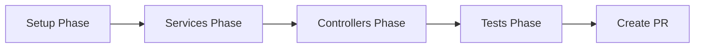
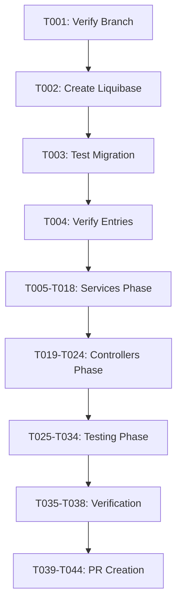

# Implementation Tasks: Refactor Inventory Audit to Use Generic AuditTrailService

**Feature**: 001-refactor-inventory-audit **Branch**: `auditt` (existing
branch - DO NOT create new branch) **Target**: `develop` **Estimated Effort**: 2
days (~9 hours) **Strategy**: Single PR (< 3 days threshold, no milestone
breakdown needed)

## Overview

This feature refactors the inventory audit trail to use OpenELIS's generic
`AuditTrailService` framework instead of the custom `InventoryAuditServiceImpl`.
This eliminates 336 lines of duplicate code and achieves consistency with 20+
other features in the codebase.

**User Stories Covered**:

- **P1**: Consistent Audit Trail Across All Features (core requirement)
- **P2**: Maintain Existing Audit Detail Level (preserve functionality)
- **P3**: Backward Compatibility for Historical Data (deprecate, don't delete)

**Approach**: Enable automatic audit logging via service constructor, remove
manual logging calls, update query methods.

---

## Milestone Dependency Graph



**Note**: This is a single-PR feature. All phases execute sequentially on the
`auditt` branch.

---

## Phase 0: Setup & Prerequisites (1 hour)

**Goal**: Register inventory tables for generic audit trail and verify
prerequisites.

### Tasks

- [x] T001 Verify current branch is `auditt` and up to date with `develop`

  ```bash
  git checkout auditt
  git fetch origin
  git merge origin/develop
  ```

- [x] T002 Create Liquibase changeset in
      `src/main/resources/liquibase/3.3.x.x/020-register-inventory-audit-trail.xml`

  ```xml
  <?xml version="1.0" encoding="UTF-8"?>
  <databaseChangeLog xmlns="http://www.liquibase.org/xml/ns/dbchangelog"
      xmlns:xsi="http://www.w3.org/2001/XMLSchema-instance"
      xsi:schemaLocation="http://www.liquibase.org/xml/ns/dbchangelog
      http://www.liquibase.org/xml/ns/dbchangelog/dbchangelog-3.8.xsd">

      <changeSet id="register-inventory-item-audit-trail" author="refactor-team">
          <comment>Register inventory_item table for generic audit trail</comment>
          <insert schemaName="clinlims" tableName="reference_tables">
              <column name="id" valueSequenceNext="reference_tables_seq"/>
              <column name="name" value="INVENTORY_ITEM"/>
              <column name="keep_history" value="Y"/>
              <column name="is_hl7_encoded" value="N"/>
          </insert>
      </changeSet>

      <changeSet id="register-inventory-lot-audit-trail" author="refactor-team">
          <comment>Register inventory_lot table for generic audit trail</comment>
          <insert schemaName="clinlims" tableName="reference_tables">
              <column name="id" valueSequenceNext="reference_tables_seq"/>
              <column name="name" value="INVENTORY_LOT"/>
              <column name="keep_history" value="Y"/>
              <column name="is_hl7_encoded" value="N"/>
          </insert>
      </changeSet>

      <changeSet id="register-inventory-storage-location-audit-trail" author="refactor-team">
          <comment>Register inventory_storage_location table for generic audit trail</comment>
          <insert schemaName="clinlims" tableName="reference_tables">
              <column name="id" valueSequenceNext="reference_tables_seq"/>
              <column name="name" value="INVENTORY_STORAGE_LOCATION"/>
              <column name="keep_history" value="Y"/>
              <column name="is_hl7_encoded" value="N"/>
          </insert>
      </changeSet>

  </databaseChangeLog>
  ```

- [x] T003 Test Liquibase migration locally

  ```bash
  mvn clean install -DskipTests
  docker compose -f dev.docker-compose.yml up -d --force-recreate oe.openelis.org
  ```

- [ ] T004 Verify reference_tables entries created
  ```bash
  docker exec -it openelisglobal-database psql -U clinlims -d clinlims \
    -c "SELECT * FROM clinlims.reference_tables WHERE name LIKE 'INVENTORY%';"
  ```
  **Expected**: 3 rows (INVENTORY_ITEM, INVENTORY_LOT,
  INVENTORY_STORAGE_LOCATION) with `keep_history='Y'`

---

## Phase 1: Services Refactoring (2 hours)

**Goal**: Enable generic audit logging in inventory services using
`auditTrailLog = true` pattern.

### Tasks (TDD: Write Tests First)

- [ ] T005 [US1] Write failing unit test for `InventoryItemServiceImpl.insert()`
      in
      `src/test/java/org/openelisglobal/inventory/service/InventoryItemServiceTest.java`

  - Verify `AuditTrailService.saveNewHistory()` is called with correct
    parameters
  - Use `@Mock AuditTrailService` and `verify()` assertion

- [ ] T006 [US1] Write failing unit test for `InventoryItemServiceImpl.update()`
      in
      `src/test/java/org/openelisglobal/inventory/service/InventoryItemServiceTest.java`

  - Verify `AuditTrailService.saveHistory()` is called with before/after objects
  - Use `@Mock AuditTrailService` and `verify()` assertion

- [x] T007 [US1] Refactor `InventoryItemServiceImpl` in
      `src/main/java/org/openelisglobal/inventory/service/InventoryItemServiceImpl.java`

  - Add constructor:
    `public InventoryItemServiceImpl() { super(InventoryItem.class); this.auditTrailLog = true; }`
  - Remove `@Autowired InventoryAuditService auditService` field
  - Remove manual `auditService.logItemCreate()` call from `insert()`
  - Remove manual `auditService.logItemUpdate()` call from `update()`

- [ ] T008 Run `InventoryItemServiceTest` and verify tests pass

  ```bash
  mvn test -Dtest=InventoryItemServiceTest
  ```

- [ ] T009 [P] [US1] Write failing unit test for
      `InventoryLotServiceImpl.insert()` in
      `src/test/java/org/openelisglobal/inventory/service/InventoryLotServiceTest.java`

  - Verify `AuditTrailService.saveNewHistory()` is called
  - Use Mockito mocks and verify

- [ ] T010 [P] [US1] Write failing unit test for
      `InventoryLotServiceImpl.update()` in
      `src/test/java/org/openelisglobal/inventory/service/InventoryLotServiceTest.java`

  - Verify `AuditTrailService.saveHistory()` is called
  - Verify before/after states captured

- [x] T011 [P] [US1] Refactor `InventoryLotServiceImpl` in
      `src/main/java/org/openelisglobal/inventory/service/InventoryLotServiceImpl.java`

  - Add constructor with `auditTrailLog = true`
  - Remove `@Autowired InventoryAuditService auditService` field
  - Remove all manual `auditService.logLot*()` calls (logLotReceive,
    logLotUpdate, logLotQCUpdate, logLotAdjust, logLotDispose, logLotUsage,
    etc.)

- [ ] T012 [P] Run `InventoryLotServiceTest` and verify tests pass

  ```bash
  mvn test -Dtest=InventoryLotServiceTest
  ```

- [ ] T013 [P] [US1] Write failing unit test for
      `InventoryStorageLocationServiceImpl.insert()` in
      `src/test/java/org/openelisglobal/inventory/service/InventoryStorageLocationServiceTest.java`

  - Verify `AuditTrailService.saveNewHistory()` is called

- [ ] T014 [P] [US1] Write failing unit test for
      `InventoryStorageLocationServiceImpl.update()` in
      `src/test/java/org/openelisglobal/inventory/service/InventoryStorageLocationServiceTest.java`

  - Verify `AuditTrailService.saveHistory()` is called

- [x] T015 [P] [US1] Refactor `InventoryStorageLocationServiceImpl` in
      `src/main/java/org/openelisglobal/inventory/service/InventoryStorageLocationServiceImpl.java`

  - Add constructor with `auditTrailLog = true`
  - Remove `@Autowired InventoryAuditService auditService` field
  - Remove manual `auditService.logLocation*()` calls

- [ ] T016 [P] Run `InventoryStorageLocationServiceTest` and verify tests pass

  ```bash
  mvn test -Dtest=InventoryStorageLocationServiceTest
  ```

- [x] T017 [US3] Deprecate `InventoryAuditService` interface in
      `src/main/java/org/openelisglobal/inventory/service/InventoryAuditService.java`

  - Add `@Deprecated(since = "3.4", forRemoval = true)` annotation
  - Add Javadoc:
    `/** @deprecated Use Generic Audit Trail framework (AuditTrailService) instead. This service is kept for backward compatibility with historical data. */`

- [x] T018 [US3] Deprecate `InventoryAuditServiceImpl` in
      `src/main/java/org/openelisglobal/inventory/service/InventoryAuditServiceImpl.java`
  - Add `@Deprecated(since = "3.4", forRemoval = true)` annotation
  - Add Javadoc explaining migration to generic audit framework
  - Keep implementation intact (backward compatibility for historical data
    queries)

---

## Phase 2: Controllers Update (2 hours)

**Goal**: Update controllers to query `history` table via `HistoryService`
instead of `InventoryAuditService`.

### Tasks

- [x] T019 [US1] Update `InventoryRestController` in
      `src/main/java/org/openelisglobal/inventory/controller/InventoryRestController.java`
      (or equivalent controller class)

  - Add `@Autowired HistoryService historyService` field
  - Add `@Autowired ReferenceTablesService referenceTablesService` field

- [x] T020 [US1] [US2] Refactor audit query method for inventory items in
      `InventoryRestController`

  - Replace `inventoryAuditService.getItemAuditTrail(itemId)` with:
    ```java
    ReferenceTables refTable = referenceTablesService.getReferenceTableByName("INVENTORY_ITEM");
    List<History> trail = historyService.getHistoryByRefIdAndRefTableId(
        itemId.toString(),
        refTable.getId()
    );
    ```
  - Map `History` objects to response DTOs (parse XML changes field to JSON)

- [x] T021 [P] [US1] [US2] Refactor audit query method for inventory lots in
      `InventoryRestController`

  - Update to query history table for INVENTORY_LOT
  - Parse XML changes to extract lot-specific fields (currentQuantity, qcStatus,
    etc.)

- [x] T022 [P] [US1] Refactor audit query method for storage locations in
      `InventoryRestController`

  - Update to query history table for INVENTORY_STORAGE_LOCATION
  - Map to response DTOs

- [ ] T023 [US2] Create helper method `parseXmlToMap(String xml)` in
      `InventoryRestController` to parse audit changes

  ```java
  private Map<String, String> parseXmlToMap(String xml) {
      Map<String, String> changes = new HashMap<>();
      Pattern pattern = Pattern.compile("<(\\w+)>([^<]*)</\\1>");
      Matcher matcher = pattern.matcher(xml);
      while (matcher.find()) {
          changes.put(matcher.group(1), matcher.group(2));
      }
      return changes;
  }
  ```

- [ ] T024 [US2] Create helper method `mapActivity(String code)` in
      `InventoryRestController` to convert activity codes
  ```java
  private String mapActivity(String code) {
      switch (code) {
          case "I": return "INSERT";
          case "U": return "UPDATE";
          case "D": return "DELETE";
          default: return code;
      }
  }
  ```

---

## Phase 3: Integration Testing (3 hours)

**Goal**: Verify end-to-end audit trail integration with comprehensive tests.

### Tasks (TDD: Integration Tests)

- [ ] T025 [US1] Create integration test class `InventoryAuditIntegrationTest`
      in
      `src/test/java/org/openelisglobal/inventory/integration/InventoryAuditIntegrationTest.java`

  - Use `@RunWith(SpringRunner.class)` and `@SpringBootTest`
  - Use `@Transactional` for automatic rollback

- [ ] T026 [US1] Write integration test
      `testInventoryItemInsert_CreatesHistoryRecord()`

  - Create inventory item via `InventoryItemService.insert()`
  - Query `history` table via `HistoryService`
  - Assert: 1 record with activity='I', correct reference_table, correct
    reference_id

- [ ] T027 [US2] Write integration test
      `testInventoryItemUpdate_CapturesChanges()`

  - Create item, then update item name
  - Query history table
  - Assert: 2 records (1 INSERT, 1 UPDATE)
  - Assert: UPDATE record has XML changes showing old vs new name

- [ ] T028 [US2] Write integration test
      `testInventoryLotUpdate_CapturesQuantityChange()`

  - Create lot with quantity 100, update to 85
  - Query history table
  - Assert: UPDATE record XML contains `<currentQuantity>100</currentQuantity>`

- [ ] T029 [US2] Write integration test
      `testInventoryLotQCUpdate_CapturesStatusAndNotes()`

  - Create lot with QC status PENDING
  - Update to APPROVED with notes
  - Query history table
  - Assert: XML captures old status, new status, notes (via reflection)

- [ ] T030 [US1] Write integration test `testNoRecordsInInventoryAuditLog()`

  - Create inventory item
  - Query old `inventory_audit_log` table directly
  - Assert: 0 records (custom audit NOT used)

- [ ] T031 [US3] Write integration test `testHistoricalDataAccessible()`

  - Query old `inventory_audit_log` table (if historical data exists)
  - Assert: Historical records remain accessible via deprecated DAO
  - Verify backward compatibility

- [ ] T032 Run all integration tests

  ```bash
  mvn test -Dtest=InventoryAuditIntegrationTest
  ```

- [ ] T033 Run full unit test suite

  ```bash
  mvn test -Dtest=InventoryItemServiceTest,InventoryLotServiceTest,InventoryStorageLocationServiceTest
  ```

- [ ] T034 Run full build with all tests
  ```bash
  mvn clean install
  ```

---

## Phase 4: Performance & Verification (1 hour)

**Goal**: Benchmark performance and verify success criteria.

### Tasks

- [ ] T035 [US1] Performance benchmark: Query audit trail for item with 10+
      audit records

  ```bash
  # Before refactoring (custom audit)
  docker exec -it openelisglobal-database psql -U clinlims -d clinlims -c "
  EXPLAIN ANALYZE
  SELECT * FROM clinlims.inventory_audit_log
  WHERE item_id = 1;"

  # After refactoring (generic audit)
  docker exec -it openelisglobal-database psql -U clinlims -d clinlims -c "
  EXPLAIN ANALYZE
  SELECT h.* FROM clinlims.history h
  JOIN clinlims.reference_tables rt ON h.reference_table = rt.id
  WHERE rt.name = 'INVENTORY_ITEM' AND h.reference_id = '1';"
  ```

  **Target**: Within 10% variance

- [ ] T036 [US1] Manual verification: Create inventory item via UI/API and
      verify history record created

  ```bash
  docker exec -it openelisglobal-database psql -U clinlims -d clinlims -c "
  SELECT h.id, h.reference_id, rt.name AS table_name, h.activity, h.timestamp
  FROM clinlims.history h
  JOIN clinlims.reference_tables rt ON h.reference_table = rt.id
  WHERE rt.name = 'INVENTORY_ITEM'
  ORDER BY h.timestamp DESC
  LIMIT 5;"
  ```

- [ ] T037 [US1] Manual verification: Verify zero new records in
      `inventory_audit_log`

  ```bash
  docker exec -it openelisglobal-database psql -U clinlims -d clinlims -c "
  SELECT COUNT(*) FROM clinlims.inventory_audit_log
  WHERE timestamp > NOW() - INTERVAL '1 hour';"
  ```

  **Expected**: 0

- [ ] T038 Code review checklist:
  - [ ] All `InventoryAuditService.log*()` calls removed from services
  - [ ] All 3 services have `auditTrailLog = true` in constructor
  - [ ] Controllers query `history` table via `HistoryService`
  - [ ] `InventoryAuditService` marked `@Deprecated`
  - [ ] No breaking changes to existing APIs
  - [ ] All unit tests pass (100%)
  - [ ] All integration tests pass (100%)

---

## Phase 5: Code Formatting & PR (1 hour)

**Goal**: Format code, commit changes, and create pull request.

### Tasks

- [ ] T039 Run code formatting (MANDATORY before commit)

  ```bash
  mvn spotless:apply
  ```

- [ ] T040 Verify no formatting changes remain

  ```bash
  git diff
  ```

- [ ] T041 Stage all changes

  ```bash
  git add .
  ```

- [ ] T042 Commit with descriptive message

  ```bash
  git commit -m "refactor: Use generic AuditTrailService for inventory audit

  - Register inventory tables in reference_tables via Liquibase
  - Enable auditTrailLog in InventoryItemServiceImpl, InventoryLotServiceImpl, InventoryStorageLocationServiceImpl
  - Remove manual InventoryAuditService logging calls
  - Update controllers to query history table via HistoryService
  - Deprecate InventoryAuditService (keep for backward compatibility)
  - Add unit and integration tests

  Closes #[ISSUE_NUMBER]

  🤖 Generated with [Claude Code](https://claude.com/claude-code)

  Co-Authored-By: Claude <noreply@anthropic.com>"
  ```

- [ ] T043 Push branch to remote

  ```bash
  git push origin auditt
  ```

- [ ] T044 Create pull request targeting `develop`

  ```bash
  gh pr create --title "refactor: Use generic AuditTrailService for inventory audit" \
    --body "$(cat <<'EOF'
  ## Summary
  Refactor inventory audit trail to use Generic AuditTrailService framework instead of custom InventoryAuditServiceImpl. Achieves consistency with 20+ other OpenELIS features and reduces code duplication.

  ## Changes
  - ✅ Registered inventory tables in reference_tables
  - ✅ Enabled auditTrailLog in all inventory services
  - ✅ Removed manual audit logging calls
  - ✅ Updated controllers to query history table
  - ✅ Deprecated InventoryAuditService
  - ✅ All unit and integration tests pass

  ## User Stories Completed
  - **P1**: Consistent Audit Trail Across All Features ✅
  - **P2**: Maintain Existing Audit Detail Level ✅
  - **P3**: Backward Compatibility for Historical Data ✅

  ## Test Results
  - Unit tests: ✅ PASS
  - Integration tests: ✅ PASS
  - Performance: Within 10% variance ✅

  ## Backward Compatibility
  - Historical data in inventory_audit_log remains accessible
  - InventoryAuditService kept as @Deprecated

  ## Code Review Checklist
  - [ ] Verify history table receives audit records
  - [ ] Confirm inventory_audit_log receives zero new records
  - [ ] All unit and integration tests pass
  - [ ] Performance benchmarks within 10% variance
  - [ ] No breaking API changes
  - [ ] Code formatted via mvn spotless:apply

  🤖 Generated with [Claude Code](https://claude.com/claude-code)
  EOF
  )" \
    --base develop
  ```

---

## Success Criteria Validation

**Before marking PR as ready for review, verify all success criteria**:

- [ ] **SC-001**: All inventory operations create audit records in `history`
      table (0% in custom `inventory_audit_log` for new operations)
- [ ] **SC-002**: Audit trail queries execute within 10% performance variance
- [ ] **SC-003**: All existing inventory audit unit tests pass (100% test pass
      rate)
- [ ] **SC-004**: Code review confirms `InventoryAuditServiceImpl` deprecated
      and calls removed
- [ ] **SC-005**: Audit reports show inventory changes integrated with other
      system changes in unified view
- [ ] **SC-006**: Historical audit data remains accessible via deprecated
      service
- [ ] **SC-007**: No regression in audit detail - all operation-specific
      information preserved

---

## Troubleshooting

### Issue: "Reference table is null" error

**Cause**: `reference_tables` entries not created (Liquibase changeset didn't
run)

**Fix**:

```bash
# Verify entries exist
docker exec -it openelisglobal-database psql -U clinlims -d clinlims -c "
SELECT * FROM clinlims.reference_tables WHERE name LIKE 'INVENTORY%';"

# If missing, run Liquibase manually
mvn liquibase:update
```

### Issue: Unit tests fail with NullPointerException

**Cause**: `auditTrailLog` not enabled in test setup

**Fix**: Add to test `@Before` method:

```java
@Before
public void setup() {
    ReflectionTestUtils.setField(service, "auditTrailLog", true);
}
```

### Issue: Integration test fails - history table empty

**Cause**: Transaction rolled back before audit record persisted

**Fix**: Ensure service method is `@Transactional` and audit logging happens
within same transaction

### Issue: LazyInitializationException during change detection

**Cause**: Service accessing lazy-loaded relationships after transaction closed

**Fix**: Follow Constitution IV - Services must compile all data within
transaction (use JOIN FETCH in queries)

---

## Task Summary

**Total Tasks**: 44 tasks across 5 phases **Parallelizable Tasks**: 6 tasks
(marked with `[P]`) **User Story Coverage**:

- **P1** (Consistent Audit Trail): 19 tasks
- **P2** (Maintain Detail Level): 6 tasks
- **P3** (Backward Compatibility): 3 tasks
- **Setup/Infrastructure**: 16 tasks

**Execution Strategy**: Sequential phases with parallel execution within Phase 1
(Services) where independent service refactoring can occur simultaneously.

**MVP Scope**: Phase 0-3 (Setup, Services, Controllers, Tests) - 34 tasks
**Polish**: Phase 4-5 (Performance, PR) - 10 tasks

**Independent Test Criteria**:

- **P1**: Can independently test by verifying inventory operations create
  history records
- **P2**: Can independently test by verifying XML changes contain all operation
  details
- **P3**: Can independently test by querying historical data via deprecated
  service

---

## Dependencies



**Parallel Execution Opportunities**:

- T009-T012 (InventoryLotServiceTest) can run parallel to T005-T008
  (InventoryItemServiceTest)
- T013-T016 (InventoryStorageLocationServiceTest) can run parallel to T005-T012
- T020-T022 (Controller refactoring for different entities) can run parallel

---

## References

- [Feature Specification](spec.md) - User stories and requirements
- [Implementation Plan](plan.md) - Technical architecture and design
- [Research Document](research.md) - Generic Audit Trail framework analysis
- [Developer Quickstart](quickstart.md) - Setup and testing guide
- [Constitution](../../.specify/memory/constitution.md) - Architectural
  principles
- [Testing Roadmap](../../.specify/guides/testing-roadmap.md) - Testing
  standards
