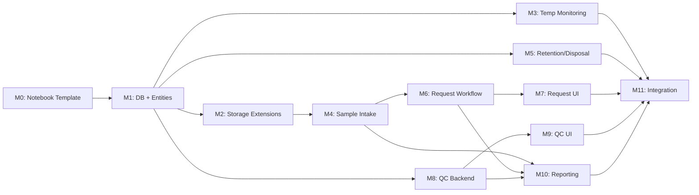

# Implementation Plan: Biorepository Laboratory Module

**Branch**: `feat/003-biorepository-lab` | **Date**: 2026-01-07 | **Spec**:
[spec.md](./spec.md) **Input**: Feature specification from
`/specs/003-biorepository-lab/spec.md` **UAT Release ETA**: January 16th, 2026

## Summary

Implement a comprehensive Biorepository Laboratory Module for AHRI's research
biorepository that provides complete sample lifecycle management from intake
through disposal. The module extends the existing OpenELIS storage
infrastructure (DD-001) to support ISO 20387:2018 biobanking compliance, manual
temperature monitoring (DD-002), fixed sample request workflows (DD-003), CAPA
integration via NcEvent (DD-004), and PDF barcode label generation (DD-005).

**Technical Approach**: Leverage existing OpenELIS infrastructure including:

- **Notebook Workflow**: Create Biorepository Notebook template via Liquibase
  (following Immunology/Pathology patterns) with 7 workflow pages mapping to
  sample lifecycle stages
- **Storage Hierarchy**: Extend `StorageDevice`, `StorageRoom`, `StorageShelf`,
  `StorageRack`, `StorageBox` with biorepository-specific fields
- **Sample Tracking**: Build on `SampleStorageAssignment` and
  `SampleStorageMovement` for chain-of-custody
- **CAPA System**: Extend `NcEvent` for QC discrepancy tracking
- **UI Framework**: Carbon Design System with React Intl internationalization
- **Backend**: 5-layer architecture (Valueholder → DAO → Service → Controller →
  Form)

**Key New Entities**:

- `Shipment` - Incoming delivery record with reference, sender, packaging
  condition, transport temperature
- `BioSample` - Biorepository sample with extended metadata (biosafety level,
  consent tracking, retention policy)
- `DocumentationVerification` - Per-sample 7-point checklist with verification
  status and timestamps
- `TemperatureReading` - Manual temperature logs for storage devices
- `RetentionPolicy` - Configurable retention rules at
  regulatory/project/sample-type levels
- `DisposalRecord` - Disposal documentation with authorizations
- `SampleRequest` - Request workflow entity with approval tracking
- `QCInspection` / `QCResult` - QC batch and individual verification results

---

## Technical Context

**Language/Version**: Java 21 LTS (backend), React 17 (frontend) **Primary
Dependencies**:

- Backend: Spring Framework 6.2.2 (Traditional MVC), Hibernate 6.x, HAPI FHIR R4
  (v6.6.2), JPA
- Frontend: @carbon/react v1.15.0, React Intl 5.20.12, Formik 2.2.9, SWR 2.0.3

**Storage**: PostgreSQL 14+ (existing OpenELIS database) **Testing**:

- Backend: JUnit 4 (4.13.1) + Mockito 2.21.0 (unit/integration)
- Frontend: Jest + React Testing Library (unit), Cypress 12.17.3 (E2E)
- FHIR: Resource validation against R4 profiles

**Target Platform**: Web application (Linux server deployment, browser-based UI)
**Project Type**: Web (backend + frontend integration) **Performance Goals**:

- Sample registration response time < 3 seconds
- Barcode scan validation < 1 second
- QC layout generation (1000 samples) < 10 seconds
- Dashboard refresh < 5 seconds
- Support 50 concurrent users

**Constraints**:

- Manual temperature entry only (no automated sensor integration per DD-002)
- Fixed approval workflow (no configurable workflow engine per DD-003)
- PDF label generation for standard printers (no direct printer integration per
  DD-005)
- > 70% test coverage per OpenELIS constitution

**Scale/Scope**:

- 8 User Stories (P1-P3 prioritized)
- 8 new entity types (Shipment, BioSample, DocumentationVerification,
  TemperatureReading, RetentionPolicy, DisposalRecord, SampleRequest,
  QCInspection/QCResult)
- Extensions to 7 existing storage entities
- ~18 REST API endpoint groups (including manifest import)
- ~15 UI components/modals (including shipment reception, manifest upload, doc
  verification)
- 6 user roles with permission matrix

---

## Constitution Check

_GATE: Must pass before Phase 0 research. Re-check after Phase 1 design._

Verify compliance with
[OpenELIS Global Constitution](../../.specify/memory/constitution.md) v1.8.1:

- [x] **Configuration-Driven**: No country-specific code branches; retention
      policies configurable; sample classifications via database
- [x] **Carbon Design System**: UI uses @carbon/react exclusively (DataTable,
      Modal, Form, Tabs, Notifications)
- [x] **FHIR/IHE Compliance**: BioSample maps to FHIR Specimen; storage
      locations map to FHIR Location; extend existing FHIR infrastructure
- [x] **Layered Architecture**: Backend follows 5-layer pattern
      (Valueholder→DAO→Service→Controller→Form)
  - Valueholders use JPA/Hibernate annotations (NO XML mappings)
  - Transaction management in service layer only (NO @Transactional in
    controllers)
  - Services compile all data within transaction (prevent
    LazyInitializationException)
- [x] **Test Coverage**: Unit + ORM validation + integration + E2E tests planned
      (>80% backend, >70% frontend)
  - E2E tests follow Constitution V.5 Cypress best practices
- [x] **Schema Management**: Database changes via Liquibase changesets only
- [x] **Internationalization**: All UI strings use React Intl (en, fr minimum)
- [x] **Security & Compliance**: RBAC via existing role system, audit trail
      (sys_user_id + lastupdated), input validation

**Complexity Justification**: None required - plan fully compliant with
constitution.

---

## Milestone Plan

_GATE: Features >3 days MUST define milestones per Constitution Principle IX.
Each milestone = 1 PR. Use `[P]` prefix for parallel milestones._

### Milestone Table

| ID     | Branch Suffix       | Scope                                                                                                                                          | User Stories | Verification                                  | Depends On |
| ------ | ------------------- | ---------------------------------------------------------------------------------------------------------------------------------------------- | ------------ | --------------------------------------------- | ---------- |
| M0     | m0-notebook         | Biorepository Notebook template + workflow pages via Liquibase                                                                                 | Foundation   | Notebook appears in dashboard, pages navigate | -          |
| M1     | m1-db-entities      | Database schema + Core entities (Shipment, BioSample, DocumentationVerification, TemperatureReading, RetentionPolicy, DisposalRecord)          | Foundation   | Liquibase runs, ORM tests pass                | M0         |
| M2     | m2-storage-ext      | Extend storage entities with biorepository fields (biosafety level, equipment records)                                                         | US1, US2     | Unit tests pass, existing storage tests pass  | M1         |
| [P] M3 | m3-temp-monitor     | Temperature monitoring (manual entry, excursion flagging, dashboard)                                                                           | US3          | Unit + E2E tests pass                         | M1         |
| M4     | m4-sample-intake    | Sample intake workflow (shipment reception, single/bulk registration via manifest, documentation verification, barcode generation, quarantine) | US1          | Unit + E2E tests pass                         | M1, M2     |
| [P] M5 | m5-retention        | Retention policy management + disposal workflow                                                                                                | US6          | Unit + E2E tests pass                         | M1         |
| M6     | m6-request-workflow | Sample request entities + fixed approval workflow                                                                                              | US4          | Unit tests pass                               | M1, M2     |
| M7     | m7-request-ui       | Sample request UI (submit, approve, retrieve)                                                                                                  | US4          | E2E tests pass                                | M6         |
| [P] M8 | m8-qc-backend       | QC inspection entities + scheduling + CAPA integration                                                                                         | US5          | Unit tests pass                               | M1         |
| M9     | m9-qc-ui            | QC inspection UI (scheduling, execution, results)                                                                                              | US5          | E2E tests pass                                | M8         |
| M10    | m10-reporting       | Audit trail + standard reports + dashboard                                                                                                     | US7, US8     | E2E tests pass                                | M4, M6, M8 |
| M11    | m11-integration     | Integration testing + polish + compliance verification                                                                                         | All          | Full E2E suite passes                         | All        |

**Legend**:

- **[P]**: Parallel milestone - can be developed alongside other milestones
- **Sequential** (no prefix): Must complete before dependent milestones

### Milestone Dependency Graph



### PR Strategy

- **Spec PR**: `spec/003-biorepository-lab` → `develop` (specification documents
  only)
- **Milestone PRs**: `feat/003-biorepository-lab-m{N}-{desc}` → `develop`

---

## Project Structure

### Documentation (this feature)

```text
specs/003-biorepository-lab/
├── spec.md              # Feature specification (completed)
├── plan.md              # This file (/speckit.plan output)
├── research.md          # Phase 0 output (technology validation)
├── data-model.md        # Phase 1 output (entity schemas)
└── tasks.md             # Phase 2 output (/speckit.tasks)
```

### Source Code (repository root)

```text
# Backend (Java) - New biorepository module
src/main/java/org/openelisglobal/biorepository/
├── valueholder/
│   ├── Shipment.java                     # Incoming delivery record
│   ├── BioSample.java                    # Extended sample with biorepository metadata
│   ├── DocumentationVerification.java    # 7-point documentation checklist
│   ├── TemperatureReading.java           # Manual temperature log entries
│   ├── RetentionPolicy.java              # Retention rule definitions
│   ├── DisposalRecord.java               # Disposal documentation
│   ├── SampleRequest.java                # Request workflow entity
│   ├── SampleRequestItem.java            # Individual samples in a request
│   ├── QCInspection.java                 # QC batch entity
│   └── QCResult.java                     # Individual sample QC result
├── dao/
│   ├── ShipmentDAO.java (+ impl)
│   ├── BioSampleDAO.java (+ impl)
│   ├── DocumentationVerificationDAO.java (+ impl)
│   ├── TemperatureReadingDAO.java (+ impl)
│   ├── RetentionPolicyDAO.java (+ impl)
│   ├── DisposalRecordDAO.java (+ impl)
│   ├── SampleRequestDAO.java (+ impl)
│   ├── QCInspectionDAO.java (+ impl)
│   └── QCResultDAO.java (+ impl)
├── service/
│   ├── ShipmentService.java (+ impl)         # Shipment reception workflow
│   ├── BioSampleService.java (+ impl)        # Sample lifecycle management
│   ├── BioSampleIntakeService.java (+ impl)  # Intake workflow (single entry)
│   ├── BiorepositoryManifestImportService.java (+ impl)  # Bulk manifest import
│   ├── DocumentationVerificationService.java (+ impl)    # Doc verification workflow
│   ├── TemperatureMonitoringService.java (+ impl)
│   ├── RetentionPolicyService.java (+ impl)
│   ├── DisposalService.java (+ impl)
│   ├── SampleRequestService.java (+ impl)    # Request workflow logic
│   ├── QCInspectionService.java (+ impl)     # QC scheduling and execution
│   └── BiorepositoryReportService.java (+ impl)
├── controller/
│   ├── ShipmentRestController.java
│   ├── BioSampleRestController.java
│   ├── BiorepositoryManifestImportController.java  # Bulk manifest import (follows existing pattern)
│   ├── DocumentationVerificationRestController.java
│   ├── TemperatureRestController.java
│   ├── RetentionPolicyRestController.java
│   ├── DisposalRestController.java
│   ├── SampleRequestRestController.java
│   ├── QCInspectionRestController.java
│   └── BiorepositoryReportRestController.java
├── form/
│   ├── ShipmentForm.java
│   ├── BioSampleForm.java
│   ├── BioSampleIntakeForm.java
│   ├── ManifestImportForm.java               # CSV manifest upload form
│   ├── DocumentationVerificationForm.java
│   ├── TemperatureReadingForm.java
│   ├── RetentionPolicyForm.java
│   ├── DisposalForm.java
│   ├── SampleRequestForm.java
│   └── QCInspectionForm.java
└── fhir/
    └── BioSampleFhirTransform.java       # FHIR Specimen mapping

# Extensions to existing storage module
src/main/java/org/openelisglobal/storage/valueholder/
├── StorageDevice.java                    # Add: biosafety zone, qualification records
├── StorageRoom.java                      # Add: access control zone
└── StorageBox.java                       # Add: sample type restrictions

# Liquibase migrations
src/main/resources/liquibase/3.5.x.x/
├── 001-biorepository-notebook-template.xml    # Notebook template + 7 workflow pages
├── 002-create-shipment-table.xml              # Shipment reception table
├── 003-create-biosample-table.xml
├── 004-create-documentation-verification-table.xml  # 7-point doc checklist
├── 005-create-temperature-reading-table.xml
├── 006-create-retention-policy-table.xml
├── 007-create-disposal-record-table.xml
├── 008-create-sample-request-tables.xml
├── 009-create-qc-inspection-tables.xml
├── 010-extend-storage-entities.xml
└── 011-create-indexes.xml

# Backend tests
src/test/java/org/openelisglobal/biorepository/
├── service/
│   ├── BioSampleServiceImplTest.java
│   ├── BioSampleIntakeServiceImplTest.java
│   ├── TemperatureMonitoringServiceImplTest.java
│   ├── SampleRequestServiceImplTest.java
│   └── QCInspectionServiceImplTest.java
├── controller/
│   ├── BioSampleRestControllerTest.java
│   ├── SampleRequestRestControllerTest.java
│   └── QCInspectionRestControllerTest.java
└── HibernateMappingValidationTest.java   # ORM validation (Constitution V.4)

# Frontend (React) - Notebook workflow components
frontend/src/components/notebook/
├── workflow/
│   └── BiorepositoryWorkflowTab.js           # Main workflow container (7 pages)
└── pages/biorepository/
    ├── BiorepositoryIntakePage.js            # Page 1: Sample intake
    ├── BiorepositoryStorageAssignmentPage.js # Page 2: Storage assignment
    ├── BiorepositoryEnvironmentalMonitoringPage.js # Page 3: Temperature
    ├── BiorepositorySampleRequestPage.js     # Page 4: Request/retrieval
    ├── BiorepositoryQCInspectionPage.js      # Page 5: QC inspection
    ├── BiorepositoryRetentionDisposalPage.js # Page 6: Retention/disposal
    └── BiorepositoryReportingPage.js         # Page 7: Reporting/audit

# Frontend (React) - New biorepository components
frontend/src/components/biorepository/
├── BiorepositoryDashboard/
│   ├── BiorepositoryDashboard.jsx        # Main dashboard
│   ├── FreezerStatusCard.jsx             # Temperature status cards
│   ├── AlertsPanel.jsx                   # Active alerts display
│   ├── PendingRequestsPanel.jsx          # Pending approvals
│   └── index.js
├── ShipmentReception/
│   ├── ShipmentReceptionForm.jsx         # Log incoming shipment
│   ├── PackagingConditionPanel.jsx       # Intact/damaged with photo upload
│   ├── ShipmentSampleList.jsx            # Samples from this shipment
│   └── index.js
├── SampleIntake/
│   ├── SampleIntakeForm.jsx              # Single sample registration form
│   ├── ManifestUploadPanel.jsx           # CSV manifest upload + preview
│   ├── ManifestPreviewTable.jsx          # Validation preview with error highlight
│   ├── ManifestColumnMapper.jsx          # Column mapping UI
│   ├── ManifestTemplateDownload.jsx      # Template download button
│   ├── DocumentationChecklist.jsx        # 7-point verification checklist
│   ├── DocumentationVerificationModal.jsx  # Auto-verify + manual verify UI
│   ├── BarcodeGenerator.jsx              # Barcode generation/printing
│   ├── QuarantineAlert.jsx               # Incomplete documentation warning
│   └── index.js
├── TemperatureMonitoring/
│   ├── TemperatureEntryForm.jsx          # Manual temperature entry
│   ├── TemperatureLogTable.jsx           # Historical readings
│   ├── ExcursionAlert.jsx                # Out-of-range warning
│   ├── TemperatureTrendChart.jsx         # Trend visualization
│   └── index.js
├── SampleRequest/
│   ├── RequestSubmissionForm.jsx         # Researcher request form
│   ├── RequestApprovalPanel.jsx          # Manager approval UI
│   ├── RetrievalWorkOrder.jsx            # Technician retrieval view
│   ├── RequestStatusTracker.jsx          # Request status display
│   └── index.js
├── QCInspection/
│   ├── QCSchedulingPanel.jsx             # QC schedule management
│   ├── QCLayoutSheet.jsx                 # Printable QC checklist
│   ├── QCExecutionForm.jsx               # QC verification entry
│   ├── DiscrepancyModal.jsx              # Discrepancy recording
│   └── index.js
├── RetentionDisposal/
│   ├── RetentionPolicyManager.jsx        # Policy configuration
│   ├── ExpiryAlertPanel.jsx              # Approaching expiry samples
│   ├── DisposalWorkflowModal.jsx         # Disposal authorization
│   ├── DisposalRecordView.jsx            # Disposal documentation
│   └── index.js
├── Reporting/
│   ├── ReportGenerator.jsx               # Report generation UI
│   ├── AuditTrailViewer.jsx              # Audit trail display
│   └── index.js
└── hooks/
    ├── useBioSamples.js
    ├── useTemperatureReadings.js
    ├── useSampleRequests.js
    ├── useQCInspections.js
    └── index.js

# Internationalization
frontend/src/languages/
├── en.json                               # Add biorepository.* message keys
└── fr.json                               # French translations

# E2E Tests (Cypress)
frontend/cypress/e2e/
├── bioSampleIntake.cy.js
├── temperatureMonitoring.cy.js
├── sampleRequest.cy.js
├── qcInspection.cy.js
├── retentionDisposal.cy.js
└── biorepositoryDashboard.cy.js
```

**Structure Decision**: New biorepository functionality implemented as a
separate module (`org.openelisglobal.biorepository.*`) to maintain clean
separation from existing storage code. Extensions to existing storage entities
made via Liquibase migrations and entity modifications. Frontend components in
`frontend/src/components/biorepository/` with feature-based organization.

---

## Database Schema Design

### New Tables

#### shipment

```sql
CREATE TABLE shipment (
    id NUMERIC(10,0) PRIMARY KEY,
    delivery_reference VARCHAR(100) NOT NULL,
    sender_name VARCHAR(255) NOT NULL,
    sender_organization VARCHAR(255),
    receiver_user_id INT NOT NULL,                -- FK to sys_user
    reception_timestamp TIMESTAMP NOT NULL DEFAULT NOW(),
    packaging_condition VARCHAR(20) NOT NULL,     -- INTACT, DAMAGED
    packaging_condition_notes TEXT,
    packaging_photo_path VARCHAR(500),            -- Photo for damaged shipments
    transport_temperature DECIMAL(5,2),
    expected_sample_count INT,
    actual_sample_count INT,
    status VARCHAR(20) DEFAULT 'RECEIVED',        -- RECEIVED, PROCESSING, COMPLETED
    sys_user_id VARCHAR(36) NOT NULL,
    lastupdated TIMESTAMP DEFAULT NOW()
);
```

#### documentation_verification

```sql
CREATE TABLE documentation_verification (
    id NUMERIC(10,0) PRIMARY KEY,
    bio_sample_id INT NOT NULL,                   -- FK to bio_sample
    check_sample_identifiers BOOLEAN,             -- Sample identifiers match paperwork
    check_project_linkage BOOLEAN,                -- Project/study linkage valid
    check_ethics_approval BOOLEAN,                -- Ethical approval on file and current
    check_consent_record BOOLEAN,                 -- Consent record exists (human samples)
    check_mta_documented BOOLEAN,                 -- MTA documented (external samples)
    check_biosafety_match BOOLEAN,                -- Biosafety classification matches
    check_packaging_integrity BOOLEAN,            -- Packaging integrity verified
    status_sample_identifiers VARCHAR(20),        -- VERIFIED, PENDING, N_A
    status_project_linkage VARCHAR(20),
    status_ethics_approval VARCHAR(20),
    status_consent_record VARCHAR(20),
    status_mta_documented VARCHAR(20),
    status_biosafety_match VARCHAR(20),
    status_packaging_integrity VARCHAR(20),
    na_justification_mta TEXT,                    -- Justification for N/A items
    na_justification_consent TEXT,
    overall_status VARCHAR(20) NOT NULL DEFAULT 'PENDING', -- PENDING, VERIFIED, QUARANTINE
    verified_by_user_id INT,                      -- FK to sys_user
    verified_timestamp TIMESTAMP,
    sys_user_id VARCHAR(36) NOT NULL,
    lastupdated TIMESTAMP DEFAULT NOW()
);
```

#### bio_sample

```sql
CREATE TABLE bio_sample (
    id NUMERIC(10,0) PRIMARY KEY,
    fhir_uuid UUID NOT NULL UNIQUE,
    barcode VARCHAR(50) NOT NULL UNIQUE,
    shipment_id INT,                           -- FK to shipment (optional, for received samples)
    sample_type_id INT NOT NULL,              -- FK to sample_type
    biosafety_level VARCHAR(10) NOT NULL,     -- BSL-1, BSL-2, BSL-3
    classification VARCHAR(50),                -- Blood-derived, Nucleic Acids, etc.
    collection_date TIMESTAMP NOT NULL,
    receipt_date TIMESTAMP NOT NULL,
    project_id INT,                            -- FK to project
    consent_id VARCHAR(100),                   -- External consent reference
    ethics_approval_ref VARCHAR(100),
    mta_reference VARCHAR(100),                -- Material Transfer Agreement
    origin_lab VARCHAR(255),
    principal_investigator VARCHAR(255),
    arrival_condition VARCHAR(50),
    arrival_condition_notes TEXT,
    preservation_medium VARCHAR(100),
    required_temp_min DECIMAL(5,2),
    required_temp_max DECIMAL(5,2),
    parent_sample_id INT,                      -- FK to bio_sample (for aliquots)
    retention_policy_id INT,                   -- FK to retention_policy
    retention_expiry_date DATE,
    documentation_status VARCHAR(20) DEFAULT 'PENDING', -- PENDING, VERIFIED, QUARANTINE
    status VARCHAR(20) NOT NULL DEFAULT 'ACTIVE',  -- ACTIVE, QUARANTINE, DISPOSED, CHECKED_OUT
    quarantine_reason TEXT,
    last_verified_date TIMESTAMP,
    sys_user_id VARCHAR(36) NOT NULL,
    lastupdated TIMESTAMP DEFAULT NOW()
);
```

#### temperature_reading

```sql
CREATE TABLE temperature_reading (
    id NUMERIC(10,0) PRIMARY KEY,
    storage_device_id INT NOT NULL,            -- FK to storage_device
    reading_value DECIMAL(5,2) NOT NULL,
    reading_timestamp TIMESTAMP NOT NULL,
    is_excursion BOOLEAN DEFAULT FALSE,
    excursion_type VARCHAR(20),                -- WARNING, CRITICAL
    excursion_acknowledged BOOLEAN DEFAULT FALSE,
    acknowledged_by_user_id INT,
    acknowledged_timestamp TIMESTAMP,
    corrective_action_notes TEXT,
    entry_method VARCHAR(20) DEFAULT 'MANUAL', -- MANUAL, SENSOR (future)
    sys_user_id VARCHAR(36) NOT NULL,
    lastupdated TIMESTAMP DEFAULT NOW()
);
```

#### retention_policy

```sql
CREATE TABLE retention_policy (
    id NUMERIC(10,0) PRIMARY KEY,
    name VARCHAR(255) NOT NULL,
    policy_level VARCHAR(20) NOT NULL,         -- REGULATORY, ETHICAL, PROJECT, SAMPLE_TYPE, DEFAULT
    duration_days INT,                          -- NULL for indefinite
    authority VARCHAR(255),
    description TEXT,
    is_active BOOLEAN DEFAULT TRUE,
    sys_user_id VARCHAR(36) NOT NULL,
    lastupdated TIMESTAMP DEFAULT NOW()
);
```

#### disposal_record

```sql
CREATE TABLE disposal_record (
    id NUMERIC(10,0) PRIMARY KEY,
    bio_sample_id INT NOT NULL,                -- FK to bio_sample
    disposal_method VARCHAR(50) NOT NULL,      -- AUTOCLAVING, INCINERATION, CHEMICAL_TREATMENT
    disposal_date TIMESTAMP NOT NULL,
    disposal_reason TEXT NOT NULL,
    certificate_reference VARCHAR(100),
    responsible_user_id INT NOT NULL,          -- FK to sys_user
    authorizing_user_id INT NOT NULL,          -- FK to sys_user (Manager)
    secondary_authorizer_id INT,               -- FK to sys_user (QA Officer for human samples)
    verification_notes TEXT,
    sys_user_id VARCHAR(36) NOT NULL,
    lastupdated TIMESTAMP DEFAULT NOW()
);
```

#### sample_request

```sql
CREATE TABLE sample_request (
    id NUMERIC(10,0) PRIMARY KEY,
    request_number VARCHAR(50) NOT NULL UNIQUE,
    requester_user_id INT NOT NULL,            -- FK to sys_user (Researcher)
    project_id INT NOT NULL,                   -- FK to project
    purpose TEXT NOT NULL,
    ethics_approval_ref VARCHAR(100),
    requested_date TIMESTAMP NOT NULL DEFAULT NOW(),
    status VARCHAR(30) NOT NULL DEFAULT 'SUBMITTED',  -- SUBMITTED, MANAGER_REVIEW, APPROVED, REJECTED, ASSIGNED_TO_TECHNICIAN, RETRIEVED
    reviewer_user_id INT,                      -- FK to sys_user (Manager)
    review_date TIMESTAMP,
    review_notes TEXT,
    rejection_reason TEXT,
    assigned_technician_id INT,                -- FK to sys_user
    retrieval_scheduled_date DATE,
    retrieval_completed_date TIMESTAMP,
    sys_user_id VARCHAR(36) NOT NULL,
    lastupdated TIMESTAMP DEFAULT NOW()
);
```

#### sample_request_item

```sql
CREATE TABLE sample_request_item (
    id NUMERIC(10,0) PRIMARY KEY,
    sample_request_id INT NOT NULL,            -- FK to sample_request
    bio_sample_id INT NOT NULL,                -- FK to bio_sample
    quantity_requested INT DEFAULT 1,
    status VARCHAR(20) DEFAULT 'PENDING',      -- PENDING, RETRIEVED, RETURNED, CONSUMED
    retrieved_date TIMESTAMP,
    return_due_date DATE,
    returned_date TIMESTAMP,
    return_condition VARCHAR(50),
    sys_user_id VARCHAR(36) NOT NULL,
    lastupdated TIMESTAMP DEFAULT NOW()
);
```

#### qc_inspection

```sql
CREATE TABLE qc_inspection (
    id NUMERIC(10,0) PRIMARY KEY,
    inspection_number VARCHAR(50) NOT NULL UNIQUE,
    schedule_type VARCHAR(20) NOT NULL,        -- SCHEDULED, RANDOM, RISK_BASED, EVENT_TRIGGERED
    scheduled_date DATE NOT NULL,
    storage_unit_id INT,                       -- FK to storage_device (optional scope)
    target_sample_count INT,
    actual_sample_count INT,
    status VARCHAR(20) DEFAULT 'SCHEDULED',    -- SCHEDULED, IN_PROGRESS, COMPLETED
    started_date TIMESTAMP,
    completed_date TIMESTAMP,
    performed_by_user_id INT,                  -- FK to sys_user
    summary_notes TEXT,
    pass_count INT DEFAULT 0,
    discrepancy_count INT DEFAULT 0,
    sys_user_id VARCHAR(36) NOT NULL,
    lastupdated TIMESTAMP DEFAULT NOW()
);
```

#### qc_result

```sql
CREATE TABLE qc_result (
    id NUMERIC(10,0) PRIMARY KEY,
    qc_inspection_id INT NOT NULL,             -- FK to qc_inspection
    bio_sample_id INT NOT NULL,                -- FK to bio_sample
    result_status VARCHAR(20) NOT NULL,        -- PASS, MISSING, MISPLACED, DAMAGED_LABEL, PHYSICAL_DAMAGE
    expected_location_path VARCHAR(500),
    actual_location_path VARCHAR(500),
    discrepancy_notes TEXT,
    nc_event_id INT,                           -- FK to nc_event (CAPA ticket)
    verified_date TIMESTAMP NOT NULL,
    verified_by_user_id INT NOT NULL,
    sys_user_id VARCHAR(36) NOT NULL,
    lastupdated TIMESTAMP DEFAULT NOW()
);
```

### Extensions to Existing Tables

#### storage_device (add columns)

```sql
ALTER TABLE storage_device ADD COLUMN biosafety_zone VARCHAR(10);           -- BSL-1, BSL-2, BSL-3
ALTER TABLE storage_device ADD COLUMN qualification_date DATE;
ALTER TABLE storage_device ADD COLUMN last_calibration_date DATE;
ALTER TABLE storage_device ADD COLUMN next_calibration_due DATE;
ALTER TABLE storage_device ADD COLUMN maintenance_notes TEXT;
ALTER TABLE storage_device ADD COLUMN temp_range_min DECIMAL(5,2);
ALTER TABLE storage_device ADD COLUMN temp_range_max DECIMAL(5,2);
```

#### storage_room (add columns)

```sql
ALTER TABLE storage_room ADD COLUMN access_control_zone VARCHAR(50);
ALTER TABLE storage_room ADD COLUMN biosafety_level VARCHAR(10);
```

---

## API Endpoints Design

### Shipment Endpoints

| Method | Endpoint                                      | Description                        |
| ------ | --------------------------------------------- | ---------------------------------- |
| POST   | `/rest/biorepository/shipments`               | Log new shipment reception         |
| GET    | `/rest/biorepository/shipments`               | List shipments with filters        |
| GET    | `/rest/biorepository/shipments/{id}`          | Get shipment details               |
| PUT    | `/rest/biorepository/shipments/{id}`          | Update shipment (add notes, photo) |
| GET    | `/rest/biorepository/shipments/{id}/samples`  | Get samples from shipment          |
| POST   | `/rest/biorepository/shipments/{id}/complete` | Mark shipment processing complete  |

### Manifest Import Endpoints (follows existing notebook pattern)

| Method | Endpoint                                                                  | Description                        |
| ------ | ------------------------------------------------------------------------- | ---------------------------------- |
| GET    | `/rest/biorepository/manifest/template`                                   | Download CSV manifest template     |
| POST   | `/rest/biorepository/shipments/{shipmentId}/samples/preview-manifest`     | Preview manifest with validation   |
| POST   | `/rest/biorepository/shipments/{shipmentId}/samples/create-from-manifest` | Create samples from valid manifest |

### Documentation Verification Endpoints

| Method | Endpoint                                                          | Description                           |
| ------ | ----------------------------------------------------------------- | ------------------------------------- |
| GET    | `/rest/biorepository/samples/{sampleId}/documentation`            | Get documentation verification status |
| POST   | `/rest/biorepository/samples/{sampleId}/documentation/verify`     | Submit verification (auto + manual)   |
| POST   | `/rest/biorepository/samples/{sampleId}/documentation/quarantine` | Place in quarantine                   |
| POST   | `/rest/biorepository/samples/{sampleId}/documentation/release`    | Release from quarantine               |

### BioSample Endpoints

| Method | Endpoint                                              | Description                  |
| ------ | ----------------------------------------------------- | ---------------------------- |
| POST   | `/rest/biorepository/samples`                         | Register new sample (intake) |
| GET    | `/rest/biorepository/samples`                         | List samples with filters    |
| GET    | `/rest/biorepository/samples/{id}`                    | Get sample details           |
| PUT    | `/rest/biorepository/samples/{id}`                    | Update sample metadata       |
| POST   | `/rest/biorepository/samples/{id}/quarantine`         | Place sample in quarantine   |
| POST   | `/rest/biorepository/samples/{id}/release-quarantine` | Release from quarantine      |
| GET    | `/rest/biorepository/samples/{id}/audit-trail`        | Get sample audit trail       |
| POST   | `/rest/biorepository/samples/{id}/barcode/generate`   | Generate barcode PDF         |

### Temperature Monitoring Endpoints

| Method | Endpoint                                            | Description                      |
| ------ | --------------------------------------------------- | -------------------------------- |
| POST   | `/rest/biorepository/temperature`                   | Record temperature reading       |
| GET    | `/rest/biorepository/temperature/device/{deviceId}` | Get readings for device          |
| GET    | `/rest/biorepository/temperature/excursions`        | List unacknowledged excursions   |
| POST   | `/rest/biorepository/temperature/{id}/acknowledge`  | Acknowledge excursion            |
| GET    | `/rest/biorepository/temperature/overdue`           | List devices overdue for reading |

### Sample Request Endpoints

| Method | Endpoint                                               | Description                      |
| ------ | ------------------------------------------------------ | -------------------------------- |
| POST   | `/rest/biorepository/requests`                         | Submit sample request            |
| GET    | `/rest/biorepository/requests`                         | List requests (filtered by role) |
| GET    | `/rest/biorepository/requests/{id}`                    | Get request details              |
| POST   | `/rest/biorepository/requests/{id}/approve`            | Approve request (Manager)        |
| POST   | `/rest/biorepository/requests/{id}/reject`             | Reject request                   |
| POST   | `/rest/biorepository/requests/{id}/assign`             | Assign to technician             |
| POST   | `/rest/biorepository/requests/{id}/complete-retrieval` | Complete retrieval               |
| POST   | `/rest/biorepository/requests/items/{itemId}/return`   | Return sample                    |

### QC Inspection Endpoints

| Method | Endpoint                                               | Description            |
| ------ | ------------------------------------------------------ | ---------------------- |
| POST   | `/rest/biorepository/qc/schedule`                      | Schedule QC inspection |
| GET    | `/rest/biorepository/qc/inspections`                   | List inspections       |
| GET    | `/rest/biorepository/qc/inspections/{id}`              | Get inspection details |
| POST   | `/rest/biorepository/qc/inspections/{id}/start`        | Start inspection       |
| POST   | `/rest/biorepository/qc/inspections/{id}/results`      | Submit QC results      |
| POST   | `/rest/biorepository/qc/inspections/{id}/complete`     | Complete inspection    |
| GET    | `/rest/biorepository/qc/inspections/{id}/layout-sheet` | Generate QC layout PDF |

### Retention & Disposal Endpoints

| Method | Endpoint                                      | Description                     |
| ------ | --------------------------------------------- | ------------------------------- |
| GET    | `/rest/biorepository/retention-policies`      | List retention policies         |
| POST   | `/rest/biorepository/retention-policies`      | Create retention policy         |
| GET    | `/rest/biorepository/samples/expiring`        | List samples approaching expiry |
| POST   | `/rest/biorepository/samples/{id}/dispose`    | Initiate disposal workflow      |
| POST   | `/rest/biorepository/disposal/{id}/authorize` | Authorize disposal              |
| GET    | `/rest/biorepository/disposal/records`        | List disposal records           |

### Reporting Endpoints

| Method | Endpoint                                                  | Description              |
| ------ | --------------------------------------------------------- | ------------------------ |
| GET    | `/rest/biorepository/reports/inventory`                   | Inventory summary report |
| GET    | `/rest/biorepository/reports/intake-log`                  | Sample intake log        |
| GET    | `/rest/biorepository/reports/retrieval-log`               | Retrieval log            |
| GET    | `/rest/biorepository/reports/disposal-log`                | Disposal log             |
| GET    | `/rest/biorepository/reports/qc-summary`                  | QC summary report        |
| GET    | `/rest/biorepository/reports/temperature-log`             | Temperature log report   |
| GET    | `/rest/biorepository/reports/chain-of-custody/{sampleId}` | Chain of custody report  |
| GET    | `/rest/biorepository/dashboard/metrics`                   | Dashboard metrics        |

---

## Testing Strategy

**Reference**:
[OpenELIS Testing Roadmap](../../.specify/guides/testing-roadmap.md)

### Coverage Goals

- **Backend**: >80% code coverage (measured via JaCoCo)
- **Frontend**: >70% code coverage (measured via Jest)
- **Critical Paths**: 100% coverage (sample intake, request approval, QC
  verification)

### Test Types

- [x] **Unit Tests**: Service layer business logic (JUnit 4 + Mockito)

  - `BioSampleServiceImplTest.java` - Sample lifecycle, validation
  - `SampleRequestServiceImplTest.java` - Workflow state transitions
  - `QCInspectionServiceImplTest.java` - QC scheduling, result aggregation
  - `TemperatureMonitoringServiceImplTest.java` - Excursion detection

- [x] **DAO Tests**: Persistence layer testing (Traditional Spring MVC)

  - Use `BaseWebContextSensitiveTest` pattern
  - Test query methods, pagination, filtering

- [x] **Controller Tests**: REST API endpoints (Traditional Spring MVC)

  - Use `BaseWebContextSensitiveTest` + MockMvc
  - Validate request/response contracts

- [x] **ORM Validation Tests**: Entity mapping validation (Constitution V.4)

  - `HibernateMappingValidationTest.java`
  - Verify all 8 new entity mappings load correctly
  - Execute in <5 seconds, no database required

- [x] **Frontend Unit Tests**: React component logic (Jest + React Testing
      Library)

  - `SampleIntakeForm.test.jsx`
  - `TemperatureEntryForm.test.jsx`
  - `RequestApprovalPanel.test.jsx`
  - `QCExecutionForm.test.jsx`

- [x] **E2E Tests**: Critical user workflows (Cypress)
  - `bioSampleIntake.cy.js` - US1: Sample registration flow
  - `temperatureMonitoring.cy.js` - US3: Temperature entry and excursion
    handling
  - `sampleRequest.cy.js` - US4: Request submission through retrieval
  - `qcInspection.cy.js` - US5: QC scheduling through completion
  - `retentionDisposal.cy.js` - US6: Disposal workflow
  - Follow Constitution V.5 best practices (individual execution, console log
    review)

### Checkpoint Validations

- [x] **After M0 (Notebook)**: Notebook template visible in dashboard, pages
      navigate correctly
- [x] **After M1 (Entities)**: ORM validation tests must pass
- [x] **After M4 (Sample Intake)**: Backend unit tests + E2E tests must pass
- [x] **After M7 (Request UI)**: Full request workflow E2E tests must pass
- [x] **After M9 (QC UI)**: Full QC workflow E2E tests must pass
- [x] **After M11 (Integration)**: All unit + E2E tests must pass

---

## Implementation Phases

### M0: Biorepository Notebook Template + Workflow Pages

**Objective**: Create the Biorepository Laboratory Notebook template via
Liquibase, following the established pattern of Immunology, Pathology, and MNTD
notebooks.

**Reference Patterns**:

- Immunology:
  `src/main/resources/liquibase/3.4.x.x/008-immunology-notebook-template.xml` (9
  pages)
- Pathology:
  `src/main/resources/liquibase/3.4.x.x/019-pathology-notebook-template.xml` (11
  pages)
- MNTD: `src/main/resources/liquibase/3.4.x.x/009-mntd-notebook-template.xml`

**Biorepository Workflow Pages** (7 pages mapping to SRS lifecycle stages):

| Order | Page Title                   | SRS Stage | Description                                                               |
| ----- | ---------------------------- | --------- | ------------------------------------------------------------------------- |
| 1     | Sample Intake & Registration | Stage 1   | Documentation verification, barcode generation, biosafety classification  |
| 2     | Storage Assignment           | Stage 2   | Hierarchical location selection, dual verification for high-value samples |
| 3     | Environmental Monitoring     | Stage 3   | Temperature entry, excursion acknowledgment, maintenance logging          |
| 4     | Sample Request & Retrieval   | Stage 5   | Request submission, approval workflow, retrieval documentation            |
| 5     | QC Inspection                | Stage 6   | Scheduled/random QC, barcode verification, discrepancy recording          |
| 6     | Retention & Disposal         | Stage 4   | Retention policy application, expiry alerts, disposal authorization       |
| 7     | Reporting & Audit            | Stage 7   | Chain-of-custody reports, audit trail, dashboard metrics                  |

**Tasks**:

1. Create Liquibase changeset:
   `src/main/resources/liquibase/3.5.x.x/001-biorepository-notebook-template.xml`
   - Add "Biorepository Laboratory" to `notebook_experiment_type` dictionary
   - Create notebook template with `is_template=true`, `status=ACTIVE`
   - Create 7 workflow pages with appropriate `page_order`, `title`,
     `instructions`
2. Create Workflow Tab component:
   `frontend/src/components/notebook/workflow/BiorepositoryWorkflowTab.js`
3. Create page components in:
   `frontend/src/components/notebook/pages/biorepository/`
   - `BiorepositoryIntakePage.js`
   - `BiorepositoryStorageAssignmentPage.js`
   - `BiorepositoryEnvironmentalMonitoringPage.js`
   - `BiorepositorySampleRequestPage.js`
   - `BiorepositoryQCInspectionPage.js`
   - `BiorepositoryRetentionDisposalPage.js`
   - `BiorepositoryReportingPage.js`
4. Register workflow tab in notebook component registry
5. Add React Intl message keys for all page titles and instructions

**Liquibase Changeset Pattern**:

```xml
<?xml version="1.0" encoding="UTF-8"?>
<databaseChangeLog xmlns="http://www.liquibase.org/xml/ns/dbchangelog">
    <property name="now" value="now()" dbms="postgresql"/>

    <!-- Add Biorepository to notebook types dictionary -->
    <changeSet id="add-biorepository-notebook-type" author="openelis-biorepository">
        <preConditions onFail="MARK_RAN">
            <sqlCheck expectedResult="0">
                SELECT COUNT(*) FROM clinlims.dictionary
                WHERE dict_entry = 'Biorepository Laboratory'
                AND dictionary_category_id = (SELECT id FROM clinlims.dictionary_category WHERE name = 'notebook_experiment_type')
            </sqlCheck>
        </preConditions>
        <insert tableName="dictionary" schemaName="clinlims">
            <column name="id" valueSequenceNext="dictionary_seq"/>
            <column name="dict_entry" value="Biorepository Laboratory"/>
            <column name="dictionary_category_id"
                valueComputed="(SELECT id FROM clinlims.dictionary_category WHERE name = 'notebook_experiment_type')"/>
            <column name="is_active" value="Y"/>
            <column name="lastupdated" valueComputed="${now}"/>
        </insert>
    </changeSet>

    <!-- Create Biorepository Notebook Template -->
    <changeSet id="create-biorepository-notebook-template" author="openelis-biorepository">
        <preConditions onFail="MARK_RAN">
            <sqlCheck expectedResult="0">
                SELECT COUNT(*) FROM clinlims.notebook
                WHERE title = 'Biorepository Laboratory' AND is_template = true
            </sqlCheck>
        </preConditions>
        <insert tableName="notebook" schemaName="clinlims">
            <column name="id" valueSequenceNext="notebook_seq"/>
            <column name="title" value="Biorepository Laboratory"/>
            <column name="objective" value="Manage biological specimen lifecycle from intake through disposal with ISO 20387:2018 compliance"/>
            <column name="protocol" value="AHRI Biorepository Standard Operating Procedures"/>
            <column name="content" value="7-stage workflow: Intake, Storage, Monitoring, Request/Retrieval, QC, Retention/Disposal, Reporting"/>
            <column name="status" value="ACTIVE"/>
            <column name="is_template" valueBoolean="true"/>
            <column name="last_updated" valueComputed="${now}"/>
            <column name="date_created" valueComputed="${now}"/>
        </insert>
    </changeSet>

    <!-- Page 1: Sample Intake & Registration -->
    <changeSet id="create-biorepository-page-1-intake" author="openelis-biorepository">
        <!-- ... page creation SQL ... -->
    </changeSet>

    <!-- Repeat for pages 2-7 -->
</databaseChangeLog>
```

**Verification**:

- Biorepository notebook appears in Notebook Dashboard
- Can create new entry from template
- All 7 pages navigate correctly
- Page-level access control works per role

**Dependencies**: None (this is the foundation)

---

### M1: Database Schema + Core Entities

**Objective**: Create database foundation and core entity classes.

**Tasks**:

1. Create Liquibase changeset for shipment table
2. Create Liquibase changeset for bio_sample table (with shipment_id FK)
3. Create Liquibase changeset for documentation_verification table
4. Create Liquibase changeset for temperature_reading table
5. Create Liquibase changeset for retention_policy table
6. Create Liquibase changeset for disposal_record table
7. Create Shipment entity with JPA annotations
8. Create BioSample entity with JPA annotations
9. Create DocumentationVerification entity with JPA annotations
10. Create TemperatureReading entity with JPA annotations
11. Create RetentionPolicy entity with JPA annotations
12. Create DisposalRecord entity with JPA annotations
13. Create DAO interfaces and implementations for all entities
14. Create ORM validation test for all 6 entities

**Verification**: `mvn clean install` passes, ORM validation test passes for all
6 entities

---

### M2: Storage Entity Extensions

**Objective**: Extend existing storage entities with biorepository-specific
fields.

**Tasks**:

1. Create Liquibase changeset for storage_device extensions
2. Create Liquibase changeset for storage_room extensions
3. Update StorageDevice.java with new fields (biosafety zone, calibration dates)
4. Update StorageRoom.java with access control zone
5. Update existing storage services to populate new fields
6. Verify backward compatibility with existing storage tests

**Verification**: Existing storage tests pass, new fields accessible via API

---

### M3: Temperature Monitoring (Parallel)

**Objective**: Implement manual temperature entry with excursion flagging.

**Tasks**:

1. Create TemperatureMonitoringService with excursion detection
2. Create TemperatureRestController with CRUD endpoints
3. Create TemperatureEntryForm.jsx for manual entry
4. Create ExcursionAlert.jsx for out-of-range warnings
5. Create TemperatureTrendChart.jsx for visualization
6. Add dashboard integration for overdue readings
7. Add React Intl message keys
8. Write unit tests and E2E tests

**Verification**: Can enter temperature, excursions flagged, dashboard shows
overdue devices

---

### M4: Sample Intake Workflow (4 Sub-stages)

**Objective**: Implement complete sample intake workflow with shipment
reception, single/bulk registration, documentation verification, and barcode
generation.

**Sub-stage 1a: Shipment Reception**

1. Create Shipment entity with JPA annotations
2. Create ShipmentDAO and ShipmentService
3. Create ShipmentRestController with CRUD endpoints
4. Create ShipmentReceptionForm.jsx (delivery reference, sender, receiver,
   packaging condition)
5. Create PackagingConditionPanel.jsx with photo upload for damaged shipments
6. Add React Intl message keys for shipment UI

**Sub-stage 1b: Sample Registration (Single + Bulk)** 7. Create BioSampleService
with intake workflow 8. Create BioSampleIntakeService with validation (single
entry) 9. Create BiorepositoryManifestImportService (bulk manifest import -
follows existing pattern) 10. Create BiorepositoryManifestImportController with
preview-manifest and create-from-manifest endpoints 11. Create
SampleIntakeForm.jsx with all required fields (linked to shipment) 12. Create
ManifestUploadPanel.jsx with CSV upload 13. Create ManifestPreviewTable.jsx with
row-level validation and error highlighting 14. Create ManifestColumnMapper.jsx
for column mapping 15. Create ManifestTemplateDownload.jsx for template
download 16. Implement manifest template generation endpoint

**Sub-stage 1c: Documentation Verification** 17. Create
DocumentationVerification entity with 7-point checklist 18. Create
DocumentationVerificationDAO and DocumentationVerificationService 19. Create
DocumentationVerificationRestController 20. Create DocumentationChecklist.jsx
with 7 verification items 21. Create DocumentationVerificationModal.jsx with
auto-verify + manual verify 22. Implement auto-verification for checkable items
(project linkage, biosafety match) 23. Implement N/A status with justification
for conditional items 24. Implement quarantine workflow for incomplete
documentation

**Sub-stage 1d: Barcode Generation** 25. Create BarcodeGenerator.jsx with PDF
generation 26. Create QuarantineAlert.jsx for incomplete documentation
warning 27. Implement DataMatrix 2D barcode generation (no PII) 28. Support
Avery-style label sheet layouts

**Cross-cutting** 29. Add FHIR Specimen mapping for BioSample 30. Write unit
tests for all services 31. Write E2E tests for complete intake workflow

**Verification**:

- Can log shipment reception with packaging condition
- Can register samples individually linked to shipment
- Can import bulk samples via CSV manifest with validation preview
- Documentation verification workflow gates proceed/quarantine
- Can generate barcode PDF labels

---

### M5: Retention & Disposal (Parallel)

**Objective**: Implement retention policy management and disposal workflow.

**Tasks**:

1. Create RetentionPolicyService
2. Create DisposalService with dual authorization
3. Create RetentionPolicyRestController
4. Create DisposalRestController
5. Create RetentionPolicyManager.jsx
6. Create ExpiryAlertPanel.jsx
7. Create DisposalWorkflowModal.jsx with authorization tracking
8. Implement disposal record generation
9. Write unit tests and E2E tests

**Verification**: Can create policies, receive expiry alerts, complete disposal
with authorization

---

### M6: Sample Request Workflow (Backend)

**Objective**: Implement request entities and fixed approval workflow.

**Tasks**:

1. Create SampleRequest entity with workflow states
2. Create SampleRequestItem entity
3. Create Liquibase changesets
4. Create SampleRequestService with state machine logic
5. Create SampleRequestDAO
6. Create SampleRequestRestController
7. Implement validation against ethics/consent/availability
8. Write unit tests

**Verification**: Request state transitions work, validation catches invalid
requests

---

### M7: Sample Request UI

**Objective**: Implement request submission and approval UI.

**Tasks**:

1. Create RequestSubmissionForm.jsx for researchers
2. Create RequestApprovalPanel.jsx for managers
3. Create RetrievalWorkOrder.jsx for technicians
4. Create RequestStatusTracker.jsx
5. Implement role-based visibility
6. Add notifications for status changes
7. Write E2E tests

**Verification**: Full request workflow from submission to retrieval works

---

### M8: QC Inspection Backend (Parallel)

**Objective**: Implement QC scheduling and CAPA integration.

**Tasks**:

1. Create QCInspection entity
2. Create QCResult entity
3. Create Liquibase changesets
4. Create QCInspectionService with scheduling algorithms
5. Implement random sample selection for QC
6. Integrate with NcEvent for discrepancies (per DD-004)
7. Create QCInspectionDAO
8. Create QCInspectionRestController
9. Write unit tests

**Verification**: Can schedule QC, generate sample subsets, create NcEvent on
discrepancy

---

### M9: QC Inspection UI

**Objective**: Implement QC execution interface.

**Tasks**:

1. Create QCSchedulingPanel.jsx
2. Create QCLayoutSheet.jsx with printable format
3. Create QCExecutionForm.jsx for barcode scanning verification
4. Create DiscrepancyModal.jsx
5. Implement QC dashboard panel
6. Add React Intl message keys
7. Write E2E tests

**Verification**: Full QC workflow from scheduling through completion works

---

### M10: Reporting & Dashboard

**Objective**: Implement audit trail and standard reports.

**Tasks**:

1. Create BiorepositoryReportService
2. Create report endpoints (inventory, intake, retrieval, disposal, QC,
   temperature)
3. Create ReportGenerator.jsx with filters and export
4. Create AuditTrailViewer.jsx
5. Create BiorepositoryDashboard.jsx with all panels
6. Implement role-based report access
7. Write E2E tests

**Verification**: All reports generate correctly, dashboard displays real-time
metrics

---

### M11: Integration & Polish

**Objective**: Final integration testing and compliance verification.

**Tasks**:

1. Run full E2E test suite
2. Verify Constitution compliance (all 9 principles)
3. Complete internationalization audit
4. Run code coverage reports
5. Performance testing (50 concurrent users)
6. Security audit (RBAC, input validation)
7. Documentation updates

**Verification**: All tests pass, >80% backend coverage, >70% frontend coverage

---

## Success Criteria

Per spec.md:

- [ ] Sample retrieval time reduced to <5 minutes
- [ ] Temperature excursion detection during manual entry works correctly
- [ ] Request-to-retrieval workflow completes end-to-end
- [ ] QC inspection coverage achieves 100% annual verification tracking
- [ ] Audit-ready documentation producible within minutes
- [ ] All 8 user stories have passing E2E tests
- [ ] Constitution compliance verified (all 9 principles)
- [ ] Test coverage: >80% backend, >70% frontend

---

## Risk Mitigation

| Risk                                   | Mitigation                                                                     |
| -------------------------------------- | ------------------------------------------------------------------------------ |
| Tight UAT deadline (Jan 16)            | Parallel milestones (M3, M5, M8) reduce critical path                          |
| Integration with existing storage code | DD-001 extends existing entities; comprehensive backward compatibility testing |
| Complex approval workflow              | DD-003 simplifies to fixed workflow; can refactor later if needed              |
| CAPA system changes                    | DD-004 notes may change; NcEvent extension isolated                            |
| Performance with 50 users              | Add database indexes, use pagination, monitor during M11                       |

---

## References

- Spec: [specs/003-biorepository-lab/spec.md](./spec.md)
- Constitution:
  [.specify/memory/constitution.md](../../.specify/memory/constitution.md)
  v1.8.1
- Existing Storage: [specs/001-sample-storage/](../001-sample-storage/)
- ISO 20387:2018 - Biobanking requirements
- GLP guidelines for data integrity (ALCOA+)
