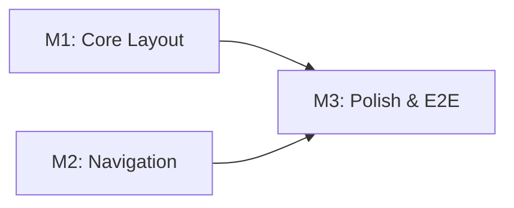

# Tasks: Carbon Design System Sidenav

**Feature Branch**: `feat/OGC-009-sidenav`  
**Input**: Design documents from `/specs/009-carbon-sidenav/`  
**Prerequisites**: plan.md ✓, spec.md ✓, research.md ✓, data-model.md ✓,
quickstart.md ✓

**Tests**: Tests are MANDATORY for all user stories (per Constitution V and
Testing Roadmap). Test tasks MUST appear BEFORE implementation tasks to enforce
TDD workflow (Red-Green-Refactor cycle).

**TDD Enforcement**:

- Write test FIRST → Verify it FAILS (Red)
- Write minimal code to pass → Verify it PASSES (Green)
- Refactor while keeping tests green
- Reference: [Testing Roadmap](../../.specify/guides/testing-roadmap.md)

**Organization**: Tasks are grouped by **Milestone** (per Constitution Principle
IX). Each Milestone = 1 PR. Milestones marked `[P]` can be developed in
parallel.

## Format: `[ID] [P?] [M#] Description`

- **[P]**: Can run in parallel (different files, no dependencies)
- **[M#]**: Which milestone this task belongs to (e.g., M1, M2, M3)
- Include exact file paths in descriptions

## User Story to Milestone Mapping

| Milestone | User Stories                                      | Scope                                        |
| --------- | ------------------------------------------------- | -------------------------------------------- |
| M1        | P1-US1 (Toggle), P1-US2 (Persistence)             | Core layout, toggle, localStorage            |
| M2 [P]    | P2-US3 (Hierarchical Nav), P2-US4 (Page Config)   | Hierarchical menus, auto-expand, page config |
| M3        | P3-US5 (Icons/Tooltips), P3-US6 (Mobile Response) | Icons, responsive behavior, E2E tests        |

## Milestone Dependency Graph



**Legend**: M1 and M2 can run in parallel. M3 depends on both M1 and M2.

---

## Milestone 1: Core Layout (Branch: `feat/OGC-009-sidenav/m1-core`)

**Type**: Sequential (blocks M3)  
**PR Target**: `develop`  
**Scope**: TwoModeLayout component, toggle functionality, localStorage
persistence  
**Verification**: Jest unit tests pass, toggle works, preference persists  
**User Stories**: P1-US1 (Toggle Sidenav), P1-US2 (Persist Preference)

### Branch Setup (MANDATORY - First Task)

- [ ] T001 [M1] Verify on milestone branch: `feat/OGC-009-sidenav/m1-core`

### Tests for Milestone 1 (MANDATORY - TDD Enforcement)

> **CRITICAL: Write these tests FIRST, run them, and verify they FAIL (Red
> phase)**
>
> - Tests MUST fail before implementation code exists
> - After implementation, tests MUST pass (Green phase)
> - PR will NOT be approved if tests were written after implementation
>
> Reference: [Jest Best Practices](../../.specify/guides/jest-best-practices.md)
> Template: `.specify/templates/testing/JestComponent.test.jsx.template`

- [ ] T002 [P] [M1] **[RED]** Create test file for useSideNavPreference hook in
      `frontend/src/components/layout/useSideNavPreference.test.js` → Run
      `npm test`, verify FAILS before T008

  - Test: returns defaultExpanded when no localStorage value
  - Test: returns stored value when localStorage has preference
  - Test: toggle() inverts state and persists to localStorage
  - Test: setExpanded() sets state and persists to localStorage
  - Test: handles localStorage unavailable gracefully

- [ ] T003 [P] [M1] **[RED]** Create test file for TwoModeLayout component in
      `frontend/src/components/layout/TwoModeLayout.test.js` → Run `npm test`,
      verify FAILS before T009
  - Test: renders with sidenav collapsed by default
  - Test: renders with sidenav expanded when defaultExpanded={true}
  - Test: toggle button changes sidenav state
  - Test: content area has correct margin class when expanded
  - Test: content area has correct margin class when collapsed
  - Test: renders children in Content area

### Implementation for Milestone 1

> **CRITICAL: Implementation tasks depend on test tasks. After each
> implementation task, run related tests and verify they now PASS (Green
> phase).**

- [ ] T004 [M1] Create CSS file for TwoModeLayout in
      `frontend/src/components/layout/TwoModeLayout.css`

  - Add `.content-expanded` class (margin-left: 16rem)
  - Add `.content-collapsed` class (margin-left: 3rem)
  - Add Carbon transition timing (0.11s cubic-bezier)
  - Override `.cds--content` default margins

- [ ] T005 [P] [M1] **[GREEN]** Create useSideNavPreference custom hook in
      `frontend/src/components/layout/useSideNavPreference.js` → Run T002 -
      verify it PASSES

  - Implement useState with localStorage initialization
  - Implement toggle() function with persistence
  - Implement setExpanded() function with persistence
  - Handle localStorage unavailable (try/catch with fallback)

- [ ] T006 [P] [M1] **[GREEN]** Create TwoModeLayout component in
      `frontend/src/components/layout/TwoModeLayout.js` → Run T003 - verify it
      PASSES

  - Import Carbon components (Header, SideNav, SideNavItems, Content, Theme)
  - Use useSideNavPreference hook for state management
  - Configure SideNav with isFixedNav={true}, isChildOfHeader={true}
  - Render HeaderMenuButton with toggle handler
  - Render content wrapper with dynamic margin class
  - Accept children prop and render in Content

- [ ] T007 [M1] Add export for TwoModeLayout in
      `frontend/src/components/layout/index.js` (or create if needed)

### Milestone 1 Completion

- [ ] T008 [M1] Run all M1 tests:
      `cd frontend && npm test -- --testPathPattern="(useSideNavPreference|TwoModeLayout)"`
- [ ] T009 [M1] Manual verification: Toggle works, preference persists across
      refresh
- [ ] T010 [M1] Format code: `cd frontend && npm run format`
- [ ] T011 [M1] Create PR for M1: `feat/OGC-009-sidenav/m1-core` → `develop`

**Checkpoint**: Milestone 1 PR ready for review. Jest tests passing, toggle and
persistence working.

---

## [P] Milestone 2: Navigation (Branch: `feat/OGC-009-sidenav/m2-nav`)

**Type**: Parallel (can be developed alongside M1)  
**PR Target**: `develop`  
**Scope**: Hierarchical menus, auto-expand active branch, page-level
configuration  
**Verification**: Jest tests pass, menu hierarchy displays correctly,
auto-expand works  
**User Stories**: P2-US3 (Hierarchical Navigation), P2-US4 (Page-Level Config)

### Branch Setup (MANDATORY - First Task)

- [ ] T020 [M2] Create milestone branch from develop:
      `git checkout develop && git pull && git checkout -b feat/OGC-009-sidenav/m2-nav`

### Tests for Milestone 2 (MANDATORY - TDD Enforcement)

> **CRITICAL: Write these tests FIRST, run them, and verify they FAIL (Red
> phase)**
>
> Reference: [Jest Best Practices](../../.specify/guides/jest-best-practices.md)
> Template: `.specify/templates/testing/JestComponent.test.jsx.template`

- [ ] T021 [P] [M2] **[RED]** Create test for menu rendering in
      `frontend/src/components/layout/TwoModeLayout.test.js` (add to existing) →
      Run `npm test`, verify FAILS before T025

  - Test: renders SideNavMenu for items with children
  - Test: renders SideNavMenuItem for leaf items
  - Test: supports 4 levels of menu nesting
  - Test: applies correct indentation per level

- [ ] T022 [P] [M2] **[RED]** Create test for auto-expand in
      `frontend/src/components/layout/useMenuAutoExpand.test.js` → Run
      `npm test`, verify FAILS before T026

  - Test: expands parent when child route is active
  - Test: expands multiple ancestors for deeply nested routes
  - Test: handles route prefix matching (/analyzers/qc matches
    /analyzers/qc/alerts)
  - Test: does not expand unrelated branches

- [ ] T023 [P] [M2] **[RED]** Create test for page config in
      `frontend/src/components/layout/TwoModeLayout.test.js` (add to existing) →
      Run `npm test`, verify FAILS before T027
  - Test: uses defaultExpanded prop when no stored preference
  - Test: stored preference overrides defaultExpanded prop
  - Test: different storageKeyPrefix creates separate preferences

### Implementation for Milestone 2

- [ ] T024 [M2] **[GREEN]** Add menu fetching to TwoModeLayout in
      `frontend/src/components/layout/TwoModeLayout.js`

  - Fetch menu from /rest/menu API
  - Store menu state with useState
  - Handle loading state

- [ ] T025 [M2] **[GREEN]** Add hierarchical menu rendering to TwoModeLayout in
      `frontend/src/components/layout/TwoModeLayout.js` → Run T021 - verify it
      PASSES

  - Create generateMenuItems() recursive function
  - Render SideNavMenu for items with childMenus
  - Render SideNavMenuItem for leaf items
  - Support up to 4 levels of nesting
  - Use intl.formatMessage for menu labels

- [ ] T026 [P] [M2] **[GREEN]** Create useMenuAutoExpand custom hook in
      `frontend/src/components/layout/useMenuAutoExpand.js` → Run T022 - verify
      it PASSES

  - Implement markActiveExpanded() recursive function
  - Detect active route from useLocation()
  - Expand parent items in path to active route
  - Trigger on location.pathname change via useEffect

- [ ] T027 [M2] **[GREEN]** Integrate auto-expand and page config in
      TwoModeLayout in `frontend/src/components/layout/TwoModeLayout.js` → Run
      T023 - verify it PASSES
  - Use useMenuAutoExpand hook
  - Pass storageKeyPrefix to useSideNavPreference
  - Ensure defaultExpanded prop flows through correctly

### Milestone 2 Completion

- [ ] T028 [M2] Run all M2 tests:
      `cd frontend && npm test -- --testPathPattern="(TwoModeLayout|useMenuAutoExpand)"`
- [ ] T029 [M2] Manual verification: Menu hierarchy renders, auto-expand works
      on navigation
- [ ] T030 [M2] Format code: `cd frontend && npm run format`
- [ ] T031 [M2] Create PR for M2: `feat/OGC-009-sidenav/m2-nav` → `develop`

**Checkpoint**: Milestone 2 PR ready for review. Hierarchical menus and
auto-expand working.

---

## Milestone 3: Polish & E2E (Branch: `feat/OGC-009-sidenav/m3-polish`)

**Type**: Sequential (depends on M1, M2)  
**PR Target**: `develop`  
**Scope**: Icons/tooltips, responsive behavior, E2E tests, final polish  
**Verification**: E2E tests pass, responsive behavior works, all user stories
complete  
**User Stories**: P3-US5 (Icons/Tooltips), P3-US6 (Responsive Behavior)

### Branch Setup (MANDATORY - First Task)

- [ ] T040 [M3] Create milestone branch after M1 and M2 merged:
      `git checkout develop && git pull && git checkout -b feat/OGC-009-sidenav/m3-polish`

### Tests for Milestone 3 (MANDATORY - TDD Enforcement)

> **CRITICAL: Write these tests FIRST, run them, and verify they FAIL (Red
> phase)**
>
> References:
>
> - [Cypress Best Practices](../../.specify/guides/cypress-best-practices.md)
> - [Constitution Section V.5](../../.specify/memory/constitution.md)

- [ ] T041 [P] [M3] **[RED]** Create Cypress E2E test file in
      `frontend/cypress/e2e/sidenavNavigation.cy.js` → Run
      `npm run cy:run -- --spec "cypress/e2e/sidenavNavigation.cy.js"`, verify
      FAILS before T047

  - Test: can toggle sidenav between expanded and collapsed
  - Test: preference persists after page refresh
  - Test: hierarchical menu expands/collapses
  - Test: active page is highlighted in navigation
  - Test: auto-expands to show active page location

- [ ] T042 [P] [M3] **[RED]** Add responsive behavior test in
      `frontend/src/components/layout/TwoModeLayout.test.js` (add to existing) →
      Run `npm test`, verify FAILS before T048

  - Test: content does not push when viewport < 1056px

- [ ] T043 [P] [M3] **[RED]** Add icon/tooltip tests in
      `frontend/src/components/layout/TwoModeLayout.test.js` (add to existing) →
      Run `npm test`, verify FAILS before T049
  - Test: icons render in collapsed mode
  - Test: tooltips appear on hover in collapsed mode

### Implementation for Milestone 3

- [ ] T044 [M3] Add responsive CSS to TwoModeLayout.css in
      `frontend/src/components/layout/TwoModeLayout.css`

  - Add @media query for max-width: 1056px
  - Set margin-left: 0 and width: 100% for mobile
  - Ensure sidenav overlays (not pushes) on mobile

- [ ] T045 [M3] **[GREEN]** Add icon support to menu items in
      `frontend/src/components/layout/TwoModeLayout.js` → Run T043 - verify it
      PASSES

  - Import Carbon icons (@carbon/icons-react)
  - Map menu items to appropriate icons
  - Render icons in SideNavMenuItem

- [ ] T046 [M3] **[GREEN]** Add tooltip support for collapsed mode in
      `frontend/src/components/layout/TwoModeLayout.js` → Run T043 - verify it
      PASSES

  - Add title attribute or Carbon Tooltip component
  - Show full label on hover when collapsed

- [ ] T047 [M3] **[GREEN]** Implement E2E test scenarios in
      `frontend/cypress/e2e/sidenavNavigation.cy.js` → Run T041 - verify it
      PASSES

  - Use cy.session() for login state
  - Use data-testid selectors
  - Follow Cypress best practices (no arbitrary waits)

- [ ] T048 [M3] **[GREEN]** Verify responsive behavior works → Run T042 - verify
      it PASSES

### Constitution Compliance Verification

- [ ] T049 [M3] **Configuration-Driven**: Verify defaultExpanded and
      storageKeyPrefix allow per-page configuration (no code branching)
- [ ] T050 [M3] **Carbon Design System**: Audit - confirm @carbon/react
      components used exclusively (Header, SideNav, SideNavItems, SideNavMenu,
      SideNavMenuItem, Content, Theme)
- [ ] T051 [M3] **Internationalization**: Verify all menu labels use
      intl.formatMessage (no hardcoded text)
- [ ] T052 [M3] **Test Coverage**: Run coverage report - confirm >70% for new
      code `cd frontend && npm test -- --coverage`
- [ ] T053 [M3] **Security**: Verify menu API filters by user permissions
      (existing behavior preserved)

### Milestone 3 Completion

- [ ] T054 [M3] Run all unit tests: `cd frontend && npm test`
- [ ] T055 [M3] Run E2E tests individually:
      `npm run cy:run -- --spec "cypress/e2e/sidenavNavigation.cy.js"`
- [ ] T056 [M3] Review browser console logs after E2E run (Constitution V.5)
- [ ] T057 [M3] Format code: `cd frontend && npm run format`
- [ ] T058 [M3] Create PR for M3: `feat/OGC-009-sidenav/m3-polish` → `develop`

**Checkpoint**: Milestone 3 PR ready for review. All tests passing, feature
complete.

---

## Dependencies & Execution Order

### Milestone Dependencies

- **Milestone 1 (M1)**: Core Layout - No dependencies, starts immediately
- **[P] Milestone 2 (M2)**: Navigation - Can run in parallel with M1
- **Milestone 3 (M3)**: Polish & E2E - Depends on M1 AND M2 completion

### PR Flow

```
develop
  ├── spec/009-carbon-sidenav (Spec PR - already exists as 009-carbon-sidenav)
  │
  ├── feat/OGC-009-sidenav/m1-core (Milestone PR #1) → develop
  ├── feat/OGC-009-sidenav/m2-nav (Milestone PR #2) [P - parallel] → develop
  └── feat/OGC-009-sidenav/m3-polish (Milestone PR #3) → develop
```

### Within Each Milestone

- Branch setup task MUST be first
- Tests MUST be written and FAIL before implementation
- Implementation tasks follow dependency order
- PR creation task is last
- All tests must pass before creating milestone PR

### Parallel Opportunities

**At Milestone Level**:

- M1 (Core Layout) and M2 (Navigation) can be developed simultaneously
- Different developers can work on M1 and M2 in parallel
- M3 must wait for both M1 and M2 to merge

**At Task Level (within M1)**:

- T002, T003 (test files) can be written in parallel
- T005, T006 (hook and component) can be implemented in parallel

**At Task Level (within M2)**:

- T021, T022, T023 (test files) can be written in parallel
- T025, T026 (menu rendering and auto-expand) can be implemented in parallel

---

## Task Summary

| Milestone | Task Count | Test Tasks | Implementation Tasks | User Stories   |
| --------- | ---------- | ---------- | -------------------- | -------------- |
| M1        | 11         | 2          | 4                    | P1-US1, P1-US2 |
| M2        | 12         | 3          | 4                    | P2-US3, P2-US4 |
| M3        | 19         | 3          | 5                    | P3-US5, P3-US6 |
| **Total** | **42**     | **8**      | **13**               | **6 stories**  |

---

## Notes

- This is a **frontend-only** feature - no backend tasks required
- All components use Carbon Design System (@carbon/react)
- POC code is available in research.md Appendix for reference
- E2E tests follow Constitution V.5 guidelines (individual test runs, console
  log review)
- Target >70% code coverage for new code (measured via Jest)
