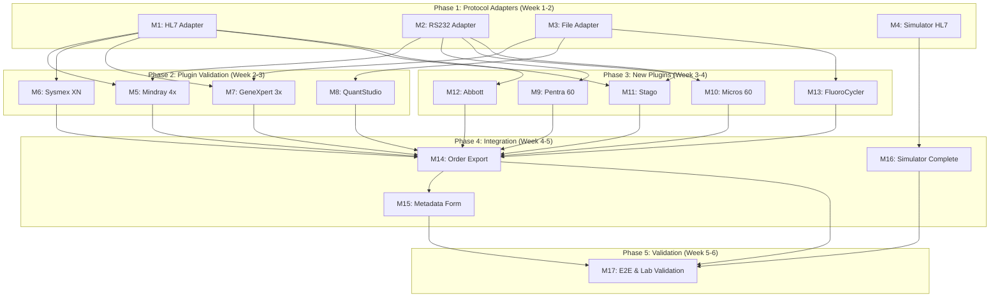

# Implementation Plan: Madagascar Analyzer Integration

**Branch**: `feat/150-madagascar-analyzer-integration` | **Date**: 2026-01-22 |
**Spec**: [spec.md](spec.md) **Input**: Feature specification from
`/specs/150-madagascar-analyzer-integration/spec.md` **Contract Deadline**:
2026-02-28 (37 days from plan creation)

## Summary

This plan extends the existing Feature 004 ASTM analyzer mapping infrastructure
to support the Madagascar contract requirements: integrating 12+ laboratory
analyzers with bidirectional communication. The implementation leverages:

1. **Existing 004 infrastructure**: Field mapping engine, error dashboard,
   status management, TCP/IP connectivity via ASTM-HTTP Bridge
2. **19+ existing analyzer plugins**: Mindray, SysmexXN-L, GeneXpertHL7,
   GeneXpertFile, QuantStudio3
3. **Plugin-first approach**: Integrate proven plugins before building new
   protocol adapters

**Key Technical Additions**:

- HL7 v2.x protocol support (ORU^R01 results, ORM^O01 orders)
- RS232 serial communication adapter (jSerialComm library)
- File-based result import (directory watcher, CSV/TXT parsing)
- Order export workflow (manual trigger, status tracking)
- Enhanced instrument metadata form
- Multi-protocol analyzer simulator (expanding astm-mock-server)

## Technical Context

**Language/Version**: Java 21 LTS (OpenJDK/Temurin), Jakarta EE 9 **Primary
Dependencies**: Spring Framework 6.2.2 (Traditional MVC), Hibernate 6.x, HAPI
HL7 v2 library, jSerialComm 2.x, Apache Commons CSV **Storage**: PostgreSQL 14+
via Liquibase migrations **Testing**: JUnit 4 + Mockito (backend), Jest + React
Testing Library (frontend), Cypress 12.x (E2E) **Target Platform**: Docker
containers on Ubuntu 20.04+, RS232 via USB-serial pass-through **Project Type**:
Web application (Java backend + React frontend) **Performance Goals**: 60-second
message processing, 5+ concurrent analyzers, 99%+ uptime **Constraints**:
Contract deadline 2026-02-28, backward compatibility with Feature 004, legacy
XML-mapped Analyzer entity

## Constitution Check

_GATE: Must pass before Phase 0 research. Re-check after Phase 1 design._

Verify compliance with
[OpenELIS Global Constitution](../../.specify/memory/constitution.md):

- [x] **Configuration-Driven**: No Madagascar-specific code branches; all
      analyzer configs via database (CR-006)
- [x] **Carbon Design System**: UI extends existing 004 Carbon components; NO
      Bootstrap/Tailwind (CR-001)
- [x] **FHIR/IHE Compliance**: Optional FHIR R4 for device/location sync; not
      required for core functionality (CR-005)
- [x] **Layered Architecture**: Backend follows 5-layer pattern; new entities
      use JPA annotations (CR-003)
  - **Valueholders MUST use JPA/Hibernate annotations** - InstrumentMetadata,
    OrderExport, SerialPortConfiguration, FileImportConfiguration
  - **Legacy exception**: Analyzer entity remains XML-mapped; manual
    relationship management pattern from 004
  - **Transaction management MUST be in service layer only** - NO @Transactional
    on controllers
  - **Services compile all data within transaction** - Prevent
    LazyInitializationException
- [x] **Test Coverage**: Unit + ORM validation + integration + E2E planned; >80%
      backend, >70% frontend (CR-008)
  - E2E tests follow Cypress best practices (Constitution V.5)
  - Run tests individually during development
  - Multi-protocol simulator enables CI/CD automation
- [x] **Schema Management**: Database changes via Liquibase changesets (CR-004)
- [x] **Internationalization**: All UI strings via React Intl; en + fr required
      (CR-002)
- [x] **Security & Compliance**: RBAC for analyzer config (LAB_SUPERVISOR+),
      audit trail, input validation (CR-007)

**Complexity Justification Required If**: None anticipated - all work follows
established patterns.

## Milestone Plan

_GATE: Features >3 days MUST define milestones per Constitution Principle IX.
Each milestone = 1 PR. Use `[P]` prefix for parallel milestones._

### Milestone Strategy: Easy Wins First

The user requested focus on **small, manageable milestones**, **prioritization
of P1 analyzers**, and **easy wins**. This plan follows a layered approach:

1. **Foundation milestones** establish protocol adapters (reusable across all
   analyzers)
2. **Validation milestones** integrate existing plugins (7-8 analyzers with
   minimal new code)
3. **Build milestones** create new plugins (5 analyzers requiring new
   development)
4. **Integration milestones** add order export and metadata (applies to all 12)

### Milestone Table

| ID          | Branch Suffix           | Scope                                                      | User Stories | Verification                                                                           | Depends On    | Est. Days |
| ----------- | ----------------------- | ---------------------------------------------------------- | ------------ | -------------------------------------------------------------------------------------- | ------------- | --------- |
| **M1**      | m1-hl7-adapter          | HL7 v2.x protocol adapter (parser + generator)             | US-1         | Unit tests: ORU^R01 parsing, ORM^O01 generation; Integration: HL7 message round-trip   | -             | 3         |
| **[P] M2**  | m2-serial-adapter       | RS232 serial communication adapter                         | US-3         | Unit tests: serial config, connection lifecycle; Integration: virtual serial port test | -             | 3         |
| **[P] M3**  | m3-file-adapter         | File-based import adapter (directory watcher)              | US-4         | Unit tests: CSV parsing, file detection; Integration: file import round-trip           | -             | 2         |
| **[P] M4**  | m4-simulator-hl7        | Expand astm-mock-server with HL7 support                   | US-9         | Simulator generates HL7 messages; OpenELIS receives correctly                          | -             | 2         |
| **M5**      | m5-mindray-validation   | Validate Mindray plugin (BC-5380, BS-360E, BC2000, BA-88A) | US-1, US-6   | 4 Mindray analyzers receive results via HL7/RS232                                      | M1, M2        | 3         |
| **M6**      | m6-sysmex-validation    | Validate SysmexXN-L plugin                                 | US-1, US-6   | Sysmex XN Series receives results via HL7                                              | M1            | 1         |
| **M7**      | m7-genexpert-validation | Validate GeneXpert plugins (3 variants)                    | US-6         | GeneXpert results via ASTM/HL7/File                                                    | M1, M3        | 2         |
| **M8**      | m8-quantstudio-adapt    | Adapt QuantStudio3 plugin for QuantStudio 7 Flex           | US-4, US-6   | QuantStudio 7 Flex CSV import works                                                    | M3            | 2         |
| **[P] M9**  | m9-plugin-pentra        | Build Horiba Pentra 60 plugin (ASTM/RS232)                 | US-3         | Pentra 60 results via RS232                                                            | M2            | 2         |
| **[P] M10** | m10-plugin-micros       | Build Horiba Micros 60 plugin (ASTM/RS232)                 | US-3         | Micros 60 results via RS232                                                            | M2            | 2         |
| **[P] M11** | m11-plugin-stago        | Build Stago STart 4 plugin (ASTM/HL7)                      | US-1, US-3   | Stago results via RS232/Network                                                        | M1, M2        | 2         |
| **[P] M12** | m12-plugin-abbott       | Build Abbott Architect plugin (HL7)                        | US-1         | Abbott results via HL7                                                                 | M1            | 2         |
| **[P] M13** | m13-plugin-fluorocycler | Build FluoroCycler XT plugin (File)                        | US-4         | FluoroCycler CSV import works                                                          | M3            | 2         |
| **M14**     | m14-order-export        | Order export workflow (manual trigger)                     | US-2         | Orders export to analyzers; status tracking works                                      | M5-M13        | 4         |
| **M15**     | m15-metadata-form       | Enhanced instrument metadata form                          | US-5         | Metadata form captures all fields; location history works                              | M14           | 3         |
| **M16**     | m16-simulator-complete  | Complete multi-protocol simulator                          | US-9         | Simulator supports all 12 analyzers; CI/CD integration                                 | M4            | 3         |
| **M17**     | m17-e2e-validation      | E2E testing and Madagascar lab validation                  | All          | All 12 analyzers bidirectional; E2E tests pass                                         | M14, M15, M16 | 5         |

**Total Estimated Duration**: 6 weeks (with parallel development on M2/M3/M4 and
M9-M13)

### Milestone Dependency Graph



### PR Strategy

- **Spec PR**: `spec/150-madagascar-analyzer-integration` → `demo/madagascar`
  (specification documents only) ✅ Created
- **Milestone PRs**: `feat/150-madagascar-analyzer-integration-m{N}-{desc}` →
  `demo/madagascar`
- **Final Integration**: `demo/madagascar` → `develop` (after contract deadline
  validation)

**Parallel Development Note**: Milestones M2, M3, M4 can proceed simultaneously
with M1. Milestones M9-M13 can proceed in parallel once their dependencies are
met.

## Project Structure

### Documentation (this feature)

```text
specs/150-madagascar-analyzer-integration/
├── spec.md              # Feature specification ✅
├── plan.md              # This file ✅
├── research.md          # Phase 0 output (protocol research)
├── data-model.md        # Phase 1 output (entity definitions)
├── quickstart.md        # Phase 1 output (developer onboarding)
├── contracts/           # Phase 1 output (API contracts)
│   ├── hl7-adapter-api.yaml
│   ├── serial-adapter-api.yaml
│   ├── file-import-api.yaml
│   └── order-export-api.yaml
├── checklists/
│   └── requirements.md  # Specification quality checklist ✅
└── tasks.md             # Phase 2 output (/speckit.tasks command)
```

### Source Code (repository root)

```text
# Backend - Protocol Adapters
src/main/java/org/openelisglobal/
├── analyzer/
│   ├── valueholder/
│   │   ├── InstrumentMetadata.java           # NEW: Extended metadata entity
│   │   ├── InstrumentLocationHistory.java    # NEW: Location history entity
│   │   ├── OrderExport.java                  # NEW: Order export tracking
│   │   ├── SerialPortConfiguration.java      # NEW: RS232 config entity
│   │   └── FileImportConfiguration.java      # NEW: File import config entity
│   ├── dao/
│   │   ├── InstrumentMetadataDAO.java        # NEW
│   │   ├── OrderExportDAO.java               # NEW
│   │   └── ...
│   ├── service/
│   │   ├── HL7MessageService.java            # NEW: HL7 message handling
│   │   ├── SerialPortService.java            # NEW: RS232 communication
│   │   ├── FileImportService.java            # NEW: Directory watcher
│   │   ├── OrderExportService.java           # NEW: Order export workflow
│   │   ├── InstrumentMetadataService.java    # NEW: Metadata management
│   │   └── ...
│   └── controller/
│       ├── HL7RestController.java            # NEW: HL7 endpoints
│       ├── OrderExportRestController.java    # NEW: Order export endpoints
│       └── InstrumentMetadataRestController.java  # NEW
├── analyzerimport/
│   └── analyzerreaders/
│       ├── HL7AnalyzerReader.java            # NEW: HL7 message parser
│       ├── SerialAnalyzerReader.java         # NEW: RS232 message handler
│       └── FileAnalyzerReader.java           # NEW: File import handler

# Backend - Tests
src/test/java/org/openelisglobal/
├── analyzer/
│   ├── service/
│   │   ├── HL7MessageServiceTest.java        # Unit tests
│   │   ├── SerialPortServiceTest.java
│   │   ├── FileImportServiceTest.java
│   │   └── OrderExportServiceTest.java
│   └── controller/
│       ├── HL7RestControllerTest.java        # Controller tests
│       └── OrderExportRestControllerTest.java
└── analyzerimport/
    └── analyzerreaders/
        ├── HL7AnalyzerReaderTest.java
        └── FileAnalyzerReaderTest.java

# Frontend - Components
frontend/src/
├── components/
│   └── analyzers/
│       ├── HL7Configuration/                 # NEW: HL7 config UI
│       │   └── HL7Configuration.jsx
│       ├── SerialConfiguration/              # NEW: RS232 config UI
│       │   └── SerialConfiguration.jsx
│       ├── FileImportConfiguration/          # NEW: File import config UI
│       │   └── FileImportConfiguration.jsx
│       ├── OrderExport/                      # NEW: Order export UI
│       │   ├── OrderExportList.jsx
│       │   └── OrderExportModal.jsx
│       └── InstrumentMetadata/               # NEW: Metadata form
│           └── InstrumentMetadataForm.jsx
├── services/
│   ├── hl7Service.js                         # NEW
│   ├── serialService.js                      # NEW
│   ├── fileImportService.js                  # NEW
│   └── orderExportService.js                 # NEW
└── languages/
    ├── en.json                               # Add new i18n keys
    └── fr.json                               # French translations

# Frontend - Tests
frontend/src/components/analyzers/
├── HL7Configuration/__tests__/
├── SerialConfiguration/__tests__/
├── FileImportConfiguration/__tests__/
├── OrderExport/__tests__/
└── InstrumentMetadata/__tests__/

# E2E Tests
frontend/cypress/e2e/
├── hl7AnalyzerIntegration.cy.js              # NEW
├── serialAnalyzerIntegration.cy.js           # NEW
├── fileImportIntegration.cy.js               # NEW
└── orderExport.cy.js                         # NEW

# Database Migrations
src/main/resources/liquibase/3.8.x.x/         # Version TBD
├── 001-instrument-metadata-table.xml
├── 002-order-export-table.xml
├── 003-serial-port-configuration-table.xml
├── 004-file-import-configuration-table.xml
└── 005-instrument-location-history-table.xml

# Multi-Protocol Analyzer Simulator
tools/astm-mock-server/
├── src/
│   ├── hl7/                                  # NEW: HL7 simulation
│   │   ├── HL7MessageGenerator.java
│   │   └── HL7Server.java
│   ├── serial/                               # NEW: Virtual serial port
│   │   └── VirtualSerialPort.java
│   └── file/                                 # NEW: File generation
│       └── CSVResultGenerator.java
└── configs/
    ├── mindray-bc5380.json                   # Analyzer-specific templates
    ├── sysmex-xn.json
    └── ...
```

**Structure Decision**: Web application pattern with extended analyzer module.
New protocol adapters integrate with existing ASTM infrastructure via the
MappingAwareAnalyzerLineInserter wrapper pattern.

## Testing Strategy

**Reference**:
[OpenELIS Testing Roadmap](../../.specify/guides/testing-roadmap.md)

### Coverage Goals

- **Backend**: >80% code coverage (measured via JaCoCo)
- **Frontend**: >70% code coverage (measured via Jest)
- **Critical Paths**: 100% coverage (HL7 parsing, RS232 communication, order
  export, field mapping)

### Test Types

- [x] **Unit Tests**: Service layer business logic (JUnit 4 + Mockito)

  - Template: `.specify/templates/testing/JUnit4ServiceTest.java.template`
  - **Coverage Goal**: >80%
  - **Key Tests**:
    - `HL7MessageServiceTest`: ORU^R01 parsing, ORM^O01 generation, field
      extraction
    - `SerialPortServiceTest`: Connection lifecycle, configuration validation
    - `FileImportServiceTest`: CSV parsing, directory watching, duplicate
      detection
    - `OrderExportServiceTest`: Status transitions, retry logic, timeout
      handling

- [x] **DAO Tests**: Persistence layer testing (Traditional Spring MVC)

  - Template: `.specify/templates/testing/DataJpaTestDao.java.template`
  - **Pattern**: Use `BaseWebContextSensitiveTest` and real DAO beans
  - **Key Tests**:
    - `InstrumentMetadataDAOTest`: CRUD, location history queries
    - `OrderExportDAOTest`: Status filtering, analyzer lookup

- [x] **Controller Tests**: REST API endpoints (Traditional Spring MVC)

  - Template: `.specify/templates/testing/WebMvcTestController.java.template`
  - **Pattern**: Use `BaseWebContextSensitiveTest` + `MockMvc`
  - **Key Tests**:
    - `HL7RestControllerTest`: Message reception, validation errors
    - `OrderExportRestControllerTest`: Export trigger, status queries

- [x] **ORM Validation Tests**: Entity mapping validation (Constitution V.4)

  - **Requirements**: <5 seconds, NO database connection
  - **Key Tests**: Validate all new JPA-annotated entities load correctly

- [x] **Integration Tests**: Full workflow testing

  - **Pattern**: Use `BaseWebContextSensitiveTest` for full-context tests
  - **Key Tests**:
    - HL7 message → Field mapping → Results staging → Validation
    - Order creation → Export trigger → Acknowledgment → Result matching
    - RS232 connection → Message reception → Processing

- [x] **Frontend Unit Tests**: React component logic (Jest + React Testing
      Library)

  - Template: `.specify/templates/testing/JestComponent.test.jsx.template`
  - **Coverage Goal**: >70%
  - **Key Tests**:
    - `HL7Configuration.test.jsx`: Form validation, connection test
    - `OrderExportList.test.jsx`: Filtering, status display, export trigger
    - `InstrumentMetadataForm.test.jsx`: All fields, location picker

- [x] **E2E Tests**: Critical user workflows (Cypress)
  - Template: `.specify/templates/testing/CypressE2E.cy.js.template`
  - **Reference**: [Constitution V.5](../../.specify/memory/constitution.md)
  - **Key Tests**:
    - `hl7AnalyzerIntegration.cy.js`: Configure HL7 analyzer → Receive results →
      Validate in UI
    - `orderExport.cy.js`: Create order → Export to analyzer → Verify status
    - `fileImportIntegration.cy.js`: Configure file import → Drop file → Verify
      results

### Test Data Management

- **Backend**:

  - **Unit Tests**: Use builders/factories for test data (e.g.,
    `HL7MessageBuilder`, `OrderExportBuilder`)
  - **DAO/Integration**: Use `@Transactional` rollback pattern

- **Frontend**:

  - **E2E Tests (Cypress)**:
    - [x] Use API-based setup via `cy.request()` (10x faster than UI)
    - [x] Use unified fixture loader for baseline data
    - [x] Use `cy.intercept()` as spy-first (alias + assertions)
    - [x] Use `cy.session()` for login state (10-20x faster)

- **Multi-Protocol Simulator**:
  - Provides realistic test data for all 12 analyzer types
  - Configurable message templates (normal, QC, error conditions)
  - CI/CD integration via HTTP API mode

### Checkpoint Validations

- [x] **After M1 (HL7 Adapter)**: ORM validation + HL7 parsing unit tests pass
- [x] **After M2 (RS232 Adapter)**: Serial config unit tests + virtual port
      tests pass
- [x] **After M3 (File Adapter)**: File detection + CSV parsing tests pass
- [x] **After M5-M13 (Plugin Validation/Build)**: Integration tests per analyzer
      pass
- [x] **After M14 (Order Export)**: Order export unit + integration tests pass
- [x] **After M15 (Metadata Form)**: Frontend unit tests + form validation tests
      pass
- [x] **After M17 (E2E Validation)**: All E2E tests pass; Madagascar lab
      validation complete

## Milestone Details

### M1: HL7 v2.x Protocol Adapter (3 days)

**Scope**: HL7 message parsing (ORU^R01) and generation (ORM^O01)

**Deliverables**:

- `HL7AnalyzerReader.java` - Parse incoming HL7 results messages
- `HL7MessageService.java` - Generate outgoing order messages
- Integration with existing field mapping engine
- Unit tests for HL7 parsing/generation

**Acceptance Criteria**:

1. HL7 ORU^R01 messages parse correctly (patient ID, test codes, results)
2. HL7 ORM^O01 messages generate correctly for order export
3. MSH segment sender ID extracted for analyzer identification
4. Unmapped fields create error records in dashboard
5. Unit test coverage >80%

**Dependencies**: None (foundation milestone)

---

### M2: RS232 Serial Communication Adapter (3 days)

**Scope**: Serial port configuration and communication via jSerialComm

**Deliverables**:

- `SerialPortConfiguration.java` entity (baud rate, parity, stop bits, flow
  control)
- `SerialPortService.java` - Connection lifecycle management
- `SerialAnalyzerReader.java` - Message reception handler
- Virtual serial port testing infrastructure

**Acceptance Criteria**:

1. Serial port configuration stored in database
2. Connection established with correct parameters
3. ASTM messages received over serial processed by existing infrastructure
4. Connection status tracked (connected/disconnected/error)
5. Graceful handling of cable disconnection

**Dependencies**: None (parallel with M1)

---

### M3: File-Based Import Adapter (2 days)

**Scope**: Directory watcher and CSV/TXT file parsing

**Deliverables**:

- `FileImportConfiguration.java` entity (directory, pattern, column mappings)
- `FileImportService.java` - Directory watcher with WatchService
- `FileAnalyzerReader.java` - CSV/TXT parsing
- File archival and error handling

**Acceptance Criteria**:

1. Files detected within 60 seconds of creation
2. CSV rows mapped to results via configured column mappings
3. Processed files moved to archive directory
4. Malformed files moved to error directory with log entry
5. Duplicate detection warns before creating new results

**Dependencies**: None (parallel with M1, M2)

---

### M4: Simulator HL7 Support (2 days)

**Scope**: Expand astm-mock-server to generate HL7 messages

**Deliverables**:

- `HL7MessageGenerator.java` in simulator
- `HL7Server.java` - TCP server for HL7 communication
- Analyzer-specific message templates (Mindray, Sysmex)

**Acceptance Criteria**:

1. Simulator generates valid HL7 ORU^R01 messages
2. Messages received and processed correctly by OpenELIS
3. Configurable analyzer type (template selection)
4. HTTP API mode for CI/CD integration

**Dependencies**: None (parallel with M1-M3)

---

### M5: Mindray Plugin Validation (3 days)

**Scope**: Validate existing Mindray plugin with 4 analyzers

**Analyzers**: BC-5380, BS-360E, BC2000 (HL7), BA-88A (RS232)

**Deliverables**:

- Validated Mindray plugin integration with HL7 adapter
- RS232 configuration for BA-88A
- Integration tests for all 4 analyzers

**Acceptance Criteria**:

1. BC-5380 receives results via HL7 (simulator)
2. BS-360E receives results via HL7 (simulator)
3. BC2000 receives results via HL7 (simulator)
4. BA-88A receives results via RS232 (virtual serial)
5. Field mappings work with plugin + mapping system

**Dependencies**: M1 (HL7), M2 (RS232)

---

### M6: Sysmex Plugin Validation (1 day)

**Scope**: Validate existing SysmexXN-L plugin

**Analyzer**: Sysmex XN Series (HL7)

**Deliverables**:

- Validated SysmexXN-L plugin integration with HL7 adapter
- Integration tests

**Acceptance Criteria**:

1. Sysmex XN Series receives results via HL7
2. Field mappings work correctly
3. Override mappings take precedence over plugin defaults

**Dependencies**: M1 (HL7)

---

### M7: GeneXpert Plugin Validation (2 days)

**Scope**: Validate 3 GeneXpert plugin variants

**Analyzer**: Cepheid GeneXpert (ASTM, HL7, File variants)

**Deliverables**:

- Validated GeneXpert plugin (ASTM via existing bridge)
- Validated GeneXpertHL7 plugin with HL7 adapter
- Validated GeneXpertFile plugin with file adapter

**Acceptance Criteria**:

1. GeneXpert ASTM variant works (existing)
2. GeneXpert HL7 variant works via HL7 adapter
3. GeneXpert File variant works via file adapter
4. All 3 variants can coexist for different deployments

**Dependencies**: M1 (HL7), M3 (File)

---

### M8: QuantStudio Adaptation (2 days)

**Scope**: Adapt QuantStudio3 plugin for QuantStudio 7 Flex

**Analyzer**: Thermo Fisher QuantStudio 7 Flex (File-based)

**Deliverables**:

- Modified QuantStudio3 plugin for 7 Flex CSV format
- Column mapping configuration
- Integration tests

**Acceptance Criteria**:

1. QuantStudio 7 Flex CSV files import correctly
2. Different column layout handled via configuration
3. Backward compatibility with QuantStudio 3 maintained

**Dependencies**: M3 (File)

---

### M9-M13: New Plugin Development (2 days each, parallel)

**Scope**: Build 5 new analyzer plugins using template

| Milestone | Analyzer             | Protocol   | Dependencies |
| --------- | -------------------- | ---------- | ------------ |
| M9        | Horiba Pentra 60     | ASTM/RS232 | M2           |
| M10       | Horiba Micros 60     | ASTM/RS232 | M2           |
| M11       | Stago STart 4        | ASTM/HL7   | M1, M2       |
| M12       | Abbott Architect     | HL7        | M1           |
| M13       | Hain FluoroCycler XT | File       | M3           |

**Deliverables per plugin**:

- Plugin class extending base analyzer plugin
- Protocol-specific message parsing
- Field extraction for mapping system
- Unit tests + integration tests

**Acceptance Criteria per plugin**:

1. Results import correctly via configured protocol
2. Field mappings work with plugin
3. Errors logged to dashboard for unmapped fields
4. Unit test coverage >80%

---

### M14: Order Export Workflow (4 days)

**Scope**: Manual order export with status tracking

**Deliverables**:

- `OrderExport.java` entity (status, timestamps, retry count)
- `OrderExportService.java` - Export logic with retry mechanism
- `OrderExportRestController.java` - REST endpoints
- Order export UI (list, modal, status display)
- ASTM O-segment and HL7 ORM^O01 message generation

**Acceptance Criteria**:

1. Users can select pending orders and trigger export
2. Orders sent via appropriate protocol (ASTM/HL7)
3. Status tracked: pending → sent → acknowledged → results_received
4. Retry mechanism (3 attempts, exponential backoff)
5. Results automatically matched to exported orders
6. UI displays export status per analyzer

**Dependencies**: M5-M13 (all analyzers operational for results)

---

### M15: Enhanced Instrument Metadata Form (3 days)

**Scope**: Comprehensive metadata capture and location history

**Deliverables**:

- `InstrumentMetadata.java` entity (installation, warranty, software version)
- `InstrumentLocationHistory.java` entity (effective dates, audit trail)
- Metadata form UI (Carbon components)
- Location picker (existing Organization/Location entities)

**Acceptance Criteria**:

1. Form captures all required metadata fields
2. Location linked to existing facility hierarchy
3. Location history preserved on relocation
4. Calibration due date warning displayed
5. Validation prevents incomplete registrations

**Dependencies**: M14 (order export operational)

---

### M16: Complete Multi-Protocol Simulator (3 days)

**Scope**: Simulator supports all 12 analyzers + CI/CD integration

**Deliverables**:

- RS232 simulation via virtual serial ports (socat)
- File generation for all file-based analyzers
- Message templates for all 12 contract analyzers
- HTTP API mode with test scenario endpoints
- Docker integration for CI/CD

**Acceptance Criteria**:

1. Simulator supports ASTM, HL7, RS232, File protocols
2. Templates for all 12 analyzers with realistic data
3. QC results, patient results, error conditions
4. CI/CD pipeline can trigger test scenarios via HTTP
5. Concurrent multi-analyzer simulation works

**Dependencies**: M4 (HL7 simulator base)

---

### M17: E2E Validation and Madagascar Lab Testing (5 days)

**Scope**: Comprehensive testing and production validation

**Deliverables**:

- E2E test suite (Cypress) for all user stories
- Integration test suite with simulator
- Madagascar lab validation (remote with lab technicians)
- User training materials
- Performance validation (5+ concurrent analyzers)

**Acceptance Criteria**:

1. All 12 analyzers receive results within 60 seconds
2. All 12 analyzers receive orders via export
3. 5+ analyzers operate simultaneously without issues
4. <5% mapping errors after initial configuration
5. Lab technicians complete configuration in <30 minutes (existing plugins)
6. E2E tests pass in CI/CD pipeline

**Dependencies**: M14, M15, M16

---

## Risk Mitigation

| Risk                           | Mitigation                                                                           | Fallback                                                                         |
| ------------------------------ | ------------------------------------------------------------------------------------ | -------------------------------------------------------------------------------- |
| HL7 vendor variations          | Use HAPI HL7 library with flexible parsing; test with actual Mindray/Sysmex messages | Manual message format configuration per analyzer                                 |
| RS232 Docker pass-through      | Test early with USB-serial adapters; document required Docker privileges             | Deploy serial handler outside container if needed                                |
| Plugin compatibility           | Validate existing plugins in M5-M8 before building dependencies                      | Build replacement plugins using template if incompatible                         |
| Madagascar lab access          | Remote validation via video; ship USB-serial adapters early                          | Extended simulator testing; defer some validation to post-deployment             |
| Contract deadline (2026-02-28) | Parallel milestone execution; prioritize P1 analyzers first                          | Deliver 12 minimum analyzers; defer P3 features (maintenance, GeneXpert modules) |

---

## Post-Deadline Features (Not in Milestones)

Per specification, these are deferred to post-deadline:

- **US-7**: GeneXpert Module Management (FR-019 to FR-021)
- **US-8**: Maintenance Tracking (FR-022 to FR-024)
- **POCT1A Protocol**: Point-of-care devices

These will be planned as separate features after contract deadline is met.

---

**Plan Created**: 2026-01-22 **Plan Author**: Claude Code with /speckit.plan
**Next Step**: Run `/speckit.tasks` to generate task breakdown by milestone
