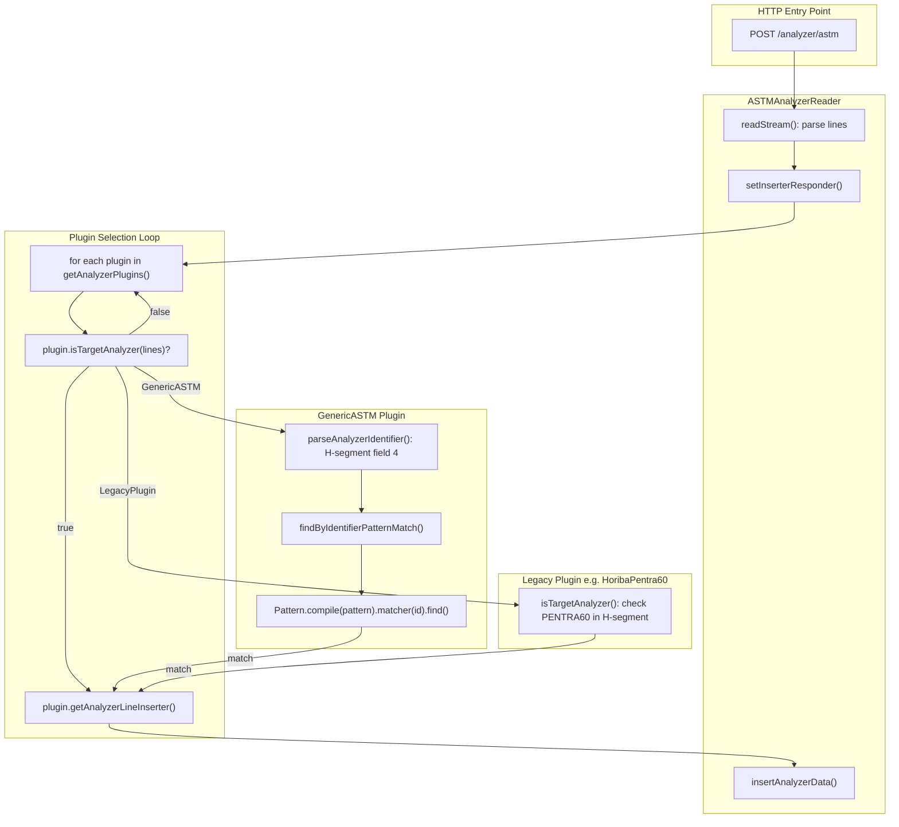

## Context / current findings (read-only)

- **ASTM import is already plugin-dispatched**: `ASTMAnalyzerReader` and
  `SerialAnalyzerReader` iterate `PluginAnalyzerService.getAnalyzerPlugins()`
  and select the first plugin whose `isTargetAnalyzer(lines)` returns true;
  there is **no built-in ASTM inserter fallback** like the file-based
  `AnalyzerLineReader` has.
  - See `ASTMAnalyzerReader#setInserterResponder()` and
    `SerialAnalyzerReader#setInserterResponder()`.
- **GenericASTM selection is configuration-driven** and already supports the
  “per-analyzer decision” you want:
  - GenericASTM only matches analyzers where
    `analyzer_configuration.is_generic_plugin = true` and `identifier_pattern`
    is non-null
    (`AnalyzerConfigurationDAOImpl#findGenericPluginConfigsWithPatterns`).
  - Matching is regex-based:
    `Pattern.compile(identifier_pattern).matcher(identifier).find()`
    (`AnalyzerConfigurationServiceImpl#findByIdentifierPatternMatch`).
  - For ASTM, the **matched identifier string** is extracted from the ASTM `H|`
    header **field 4** (0-based index 4 after `split("|")`), i.e. the
    manufacturer/model/version field
    (`GenericASTMAnalyzer#parseAnalyzerIdentifier`).
  - Therefore: **wrong/mismatched `identifier_pattern` really does mean the
    GenericASTM plugin will not be selected**, and because ASTM matches during
    `readStream()`, the request will fail with “Unable to understand which
    analyzer sent the message.”
- **Note on “main repo business logic”**:
  - The ASTM readers are in main repo (transport + dispatch). They optionally
    wrap the plugin inserter with `MappingAwareAnalyzerLineInserter` when
    mappings exist (Feature 004 behavior). This is cross-cutting mapping/QC
    behavior, not analyzer-specific parsing.

## Goal

- Ensure **ASTM ingestion never falls back to non-plugin insertion logic**.
- Ensure **dashboard-configured ASTM analyzers (is_generic_plugin=true)** are
  processed by **GenericASTM** via `identifier_pattern` matching.
- Provide **robust integration tests** (mirroring GenericHL7 approach) and a
  **clear, documented configuration pathway** for choosing “generic vs specific
  plugin” per analyzer.

## Investigation steps (confirm & document)

- Audit all ASTM entry points:
  - HTTP: `/analyzer/astm` in `AnalyzerImportController` → `ASTMAnalyzerReader`
  - Serial: `SerialAnalyzerReader`
  - Error reprocessing: `AnalyzerReprocessingServiceImpl` uses
    `ASTMAnalyzerReader`
- Confirm there is **no ASTM-specific non-plugin fallback** anywhere in main
  repo (contrast with `AnalyzerLineReader#setInserter()`, which still has legacy
  file-based fallbacks).
- Document the per-analyzer selection model:
  - **Generic path**: `is_generic_plugin=true` + `identifier_pattern` →
    GenericASTM matches
  - **Specific plugin path**: `is_generic_plugin=false` (and typically no
    identifier_pattern) → a dedicated plugin must match via its own
    `isTargetAnalyzer` logic

## Remediation (incremental, test-first)

### Phase 1 — Make behavior explicit + enforce via tests

- **Fix/strengthen ASTM integration test** in
  `src/test/java/org/openelisglobal/analyzer/GenericASTMIntegrationTest.java`:
  - Adjust “unknown analyzer” expectations to match current ASTM behavior:
    `readStream()` should fail when no plugin matches (unlike HL7).
  - Strengthen assertions to verify persisted rows’ `analyzer_id`, `test_id`,
    and `result` values (avoid fuzzy `test_name` matching).
  - Ensure fixtures include:
    - Test catalog rows with valid localization
      (`src/test/resources/testdata/test-result.xml`)
    - Analyzer + analyzer_configuration for BA-88A
      (`src/test/resources/testdata/madagascar-analyzer-test-data.xml`,
      `CONFIG-2006`)
    - Analyzer test mappings for analyzer 2006 (`analyzer_test_map`)
      created/cleaned in-test.
- Add **unit tests** for
  `AnalyzerConfigurationServiceImpl#findByIdentifierPatternMatch`:
  - Valid regex matching using `.find()` (substring match)
  - Invalid regex handling (does not throw; logs warn; returns empty)
  - Ensure only `is_generic_plugin=true` candidates are considered.

### Phase 2 — Improve determinism + configuration UX safety

- Add explicit validation in the analyzer configuration save path
  (controller/service layer in analyzer module) so that:
  - If `is_generic_plugin=true`, `identifier_pattern` must be non-empty and must
    compile as a regex.
  - If `is_generic_plugin=false`, warn/clear `identifier_pattern` to avoid
    confusion.
- Add/extend docs in `docs/analyzer.md` and/or
  `specs/011-madagascar-analyzer-integration/...` explaining:
  - What string `identifier_pattern` matches for ASTM (H-segment field 4 value)
  - Example patterns for common analyzers (e.g., `MINDRAY.*BA-88A|BA88A`)

### Phase 3 (optional) — Align ASTM reader semantics with HL7 for consistency

- Refactor `ASTMAnalyzerReader` (and `SerialAnalyzerReader`) so:
  - `readStream()` only reads/parses lines (does not depend on plugin match)
  - plugin matching happens inside `processData()` / `insertAnalyzerData()`
  - unknown analyzer becomes a consistent “no plugin matched” error at
    insert/process time, similar to `HL7AnalyzerReader`
- If we do this, update controller status handling so “unknown analyzer” returns
  a consistent HTTP status (likely 400).

## Validation plan (after changes)

- Build plugins needed for tests (GenericASTM) and run:
  - `GenericASTMIntegrationTest`
  - analyzer integration test subset
- Run with logs teed to `/tmp/...` for review.

## Mermaid: Current ASTM Dispatch Flow



---

# Appendix: Comprehensive Analyzer Architecture Background

## 1. Plugin Loading Lifecycle

### How plugins get loaded at application startup

**Location:** `src/main/java/org/openelisglobal/plugin/PluginLoader.java`

**Flow:**

1. Spring `@PostConstruct` triggers `PluginLoader.load()` at startup
2. Scans `/var/lib/openelis-global/plugins/` directory for JAR files
3. For each JAR, reads `plugin.xml` (or similar) to find `<analyzerImporter>`
   elements
4. Uses `URLClassLoader` to load plugin class from JAR
5. Instantiates plugin and calls `plugin.connect()`
6. Plugin's `connect()` method registers itself via
   `PluginAnalyzerService.registerAnalyzer(this)`

**Key code path:**

```
PluginLoader.load() → loadDirectory() → loadPlugin(file) → loadFromXML() → loadActualPlugin()
  → plugin.connect() → PluginAnalyzerService.registerAnalyzer(this)
```

### Legacy vs Generic plugin registration

| Aspect               | Legacy Plugin (e.g. HoribaPentra60)                                    | Generic Plugin (GenericASTM/GenericHL7)               |
| -------------------- | ---------------------------------------------------------------------- | ----------------------------------------------------- |
| `connect()` behavior | Calls `addAnalyzerDatabaseParts()` to create analyzer + mappings in DB | Only calls `registerAnalyzer(this)` - no DB parts     |
| Test mappings        | Hardcoded in plugin code                                               | Configured via Dashboard UI (analyzer_test_map table) |
| `isTargetAnalyzer()` | Hardcoded string matching (e.g. "PENTRA60")                            | DB query + regex pattern matching                     |
| Analyzer count       | One plugin = one analyzer                                              | One plugin = many analyzers (one per config row)      |

## 2. Reader Types and Their Plugin Selection Logic

### Overview of all reader types

| Reader Class            | Protocol               | Entry Point                          | Plugin Selection Method                         | Fallback Behavior                                            |
| ----------------------- | ---------------------- | ------------------------------------ | ----------------------------------------------- | ------------------------------------------------------------ |
| `ASTMAnalyzerReader`    | ASTM LIS2-A2 over HTTP | `POST /analyzer/astm`                | `setInserterResponder()` during `readStream()`  | **None** - fails if no plugin matches                        |
| `HL7AnalyzerReader`     | HL7 v2.x over HTTP     | `POST /analyzer/hl7`                 | Plugin loop in `insertAnalyzerData()`           | **None** - fails if no plugin matches                        |
| `SerialAnalyzerReader`  | ASTM over RS232        | Serial port daemon                   | `setInserterResponder()` during `readStream()`  | **None** - fails if no plugin matches                        |
| `AnalyzerLineReader`    | Generic flat file      | `POST /importAnalyzer` (file upload) | Plugin loop first, then **hardcoded fallbacks** | **YES** - legacy inserters (CobasReader, SysmexReader, etc.) |
| `FileAnalyzerReader`    | CSV/TXT with config    | File watch service                   | Plugin lookup by analyzer ID                    | **None** - requires configured plugin                        |
| `AnalyzerXLSLineReader` | Excel file             | `POST /importAnalyzer`               | Same as AnalyzerLineReader                      | **YES** - same fallbacks                                     |

### Critical difference: ASTM/HL7 are plugin-only; FILE has legacy fallbacks

**ASTM (`ASTMAnalyzerReader.setInserterResponder()`):**

```java
for (AnalyzerImporterPlugin plugin : pluginService.getAnalyzerPlugins()) {
    if (plugin.isTargetAnalyzer(lines)) {
        this.plugin = plugin;
        inserter = plugin.getAnalyzerLineInserter();
        return;
    }
}
// If we get here: inserter is null, readStream() returns true but insertAnalyzerData() fails
```

**FILE (`AnalyzerLineReader.setInserter()`):**

```java
// First try plugins
for (AnalyzerImporterPlugin plugin : pluginService.getAnalyzerPlugins()) {
    if (plugin.isTargetAnalyzer(lines)) { inserter = plugin.getAnalyzerLineInserter(); return; }
}
// Then fallback to hardcoded legacy inserters
if (lines.get(0).contains(COBAS_INDICATOR)) { inserter = new CobasReader(); }
else if (lines.get(0).contains(EVOLIS_INTEGRAL_INDICATOR)) { inserter = new EvolisReader(); }
// ... many more hardcoded fallbacks
```

## 3. Plugin Selection: Generic vs Legacy Priority

### Order of plugin evaluation

Plugins are evaluated in the **order they were registered** (list order in
`PluginAnalyzerService.analyzerPlugins`).

**Current behavior:**

- Legacy plugins (from `/var/lib/openelis-global/plugins/`) are loaded first at
  startup
- GenericASTM/GenericHL7 register themselves when their JAR is loaded
- **First match wins** - if a legacy plugin matches, GenericASTM is never
  consulted

**GenericASTM comment (line 100-101 in GenericASTMAnalyzer.java):**

> "Note: This is called AFTER legacy plugins have had a chance to match. Legacy
> plugins always get priority since they have more specific identification
> logic."

### Per-analyzer selection model (the vision)

| Scenario                   | Configuration                                              | What Happens                                                                       |
| -------------------------- | ---------------------------------------------------------- | ---------------------------------------------------------------------------------- |
| Use legacy plugin          | `is_generic_plugin=false` or no analyzer_configuration row | Legacy plugin's hardcoded `isTargetAnalyzer()` matches first                       |
| Use generic plugin         | `is_generic_plugin=true` + valid `identifier_pattern`      | GenericASTM/GenericHL7 matches via DB pattern lookup                               |
| Conflict: both could match | Legacy plugin matches first (list order)                   | GenericASTM never consulted - admin must remove legacy plugin JAR to force generic |

## 4. Identifier Pattern Matching (ASTM vs HL7)

### ASTM H-segment identifier extraction

**Format:** `H|\^&|||MANUFACTURER^MODEL^VERSION|INSTITUTION|...`

**Extraction logic (GenericASTMAnalyzer.parseAnalyzerIdentifier):**

```java
// Split by |, get field 4 (index 4), return as-is
// Example: "MINDRAY^BA-88A^1.0" from H|\\^&|||MINDRAY^BA-88A^1.0|...
```

**Pattern matching:**

- `identifier_pattern` is a Java regex
- Uses `Pattern.compile(pattern).matcher(identifier).find()` (substring match,
  not full match)
- Example pattern: `MINDRAY.*BA-88A|BA88A` matches `MINDRAY^BA-88A^1.0`

### HL7 MSH-3 identifier extraction

**Format:** `MSH|^~\&|SENDING_APP|SENDING_FAC|RECEIVING_APP|...`

**Extraction logic (GenericHL7Analyzer.parseAnalyzerIdentifier):**

```java
// MSH-3 is field 2 after split (0=MSH, 1=encoding, 2=sending_app)
// Example: "MINDRAY" from MSH|^~\\&|MINDRAY|LAB|...
```

## 5. Dashboard Management Vision (Features 004 + 011)

### Unified dashboard requirements

Per the user's clarification:

- All analyzers should appear in a unified dashboard
- Admin chooses per analyzer: legacy plugin OR generic plugin
- Both coexist - no forced migration

### Current implementation status

| Feature                 | Status       | Notes                                     |
| ----------------------- | ------------ | ----------------------------------------- |
| Analyzer list dashboard | Implemented  | FR-001 in 004 spec                        |
| Add/Edit analyzer modal | Implemented  | Includes `is_generic_plugin` toggle       |
| Field mapping UI        | Implemented  | FR-003-005 in 004 spec                    |
| Error dashboard         | Implemented  | FR-016 in 004 spec                        |
| GenericASTM plugin      | Implemented  | Works with DB-configured analyzers        |
| GenericHL7 plugin       | Implemented  | M19 in 011 spec                           |
| GenericFile plugin      | **DEFERRED** | Per 011 spec - complex format abstraction |
| Copy mappings           | Implemented  | FR-006                                    |
| Test mapping preview    | Implemented  | FR-007                                    |

## 6. Identified Gaps and Issues

### Gap 1: FILE-based analyzers still use legacy fallbacks

**Problem:** `AnalyzerLineReader` has hardcoded fallback inserters (CobasReader,
SysmexReader, etc.) in main repo. This is inconsistent with ASTM/HL7 which are
plugin-only.

**Impact:** Cannot manage file-based analyzers via dashboard configuration
alone.

**Remediation:** Defer (per user decision) - GenericFile plugin is complex and
not needed for 011 deadline.

### Gap 2: ASTM reader behavior differs from HL7

**Problem:** ASTM matches plugin during `readStream()`; HL7 matches plugin
during `insertAnalyzerData()`. This means:

- ASTM: `readStream()` returns false if no plugin matches
- HL7: `readStream()` returns true; `insertAnalyzerData()` returns false if no
  plugin matches

**Impact:** Different HTTP error handling paths; harder to test consistently.

**Remediation:** Optional (Phase 3 in plan) - refactor ASTM readers to match HL7
pattern.

### Gap 3: No validation on identifier_pattern when saving configuration

**Problem:** Admin can save `is_generic_plugin=true` with empty or invalid regex
pattern. GenericASTM will silently fail to match.

**Impact:** Silent configuration errors.

**Remediation:** Add server-side validation (Phase 2 in plan).

### Gap 4: Plugin order determines priority (not explicit config)

**Problem:** If both a legacy plugin and GenericASTM could match the same
analyzer identifier, the legacy plugin wins because it's earlier in the list.
Admin has no way to force GenericASTM to take priority.

**Impact:** Cannot switch from legacy to generic for an analyzer without
removing the legacy plugin JAR.

**Remediation:** Consider adding explicit priority or "use_generic_override"
flag in analyzer_configuration. (Future enhancement - not in current plan.)

### Gap 5: GenericASTM integration test needs strengthening

**Problem:** Current `GenericASTMIntegrationTest` was just created but may have
test fixture or assertion issues similar to what was fixed for
`GenericHL7IntegrationTest`.

**Impact:** May not catch regressions.

**Remediation:** Phase 1 in plan - strengthen test assertions.

## 7. Next Steps Summary

Given user priorities (docs/audit first, then tests):

1. **Document** the current architecture thoroughly (this appendix)
2. **Audit** ASTM entry points to confirm no non-plugin fallbacks
3. **Test** GenericASTM integration test to verify end-to-end flow
4. **Validate** configuration - add regex validation on save
5. **(Optional)** Align ASTM reader semantics with HL7 for consistency
