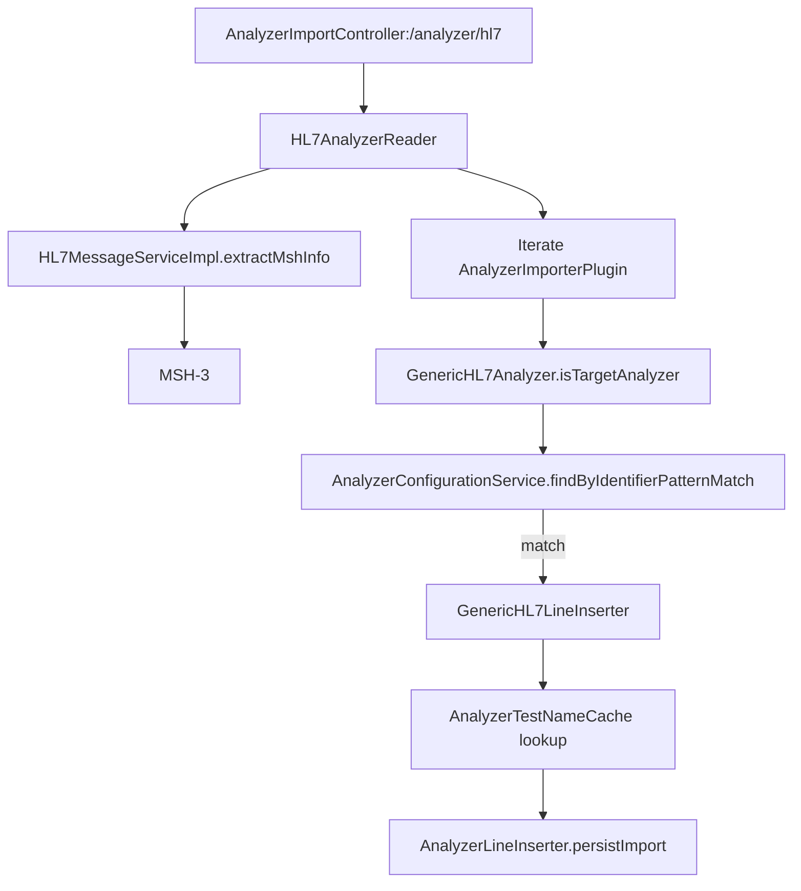

# M19-M20 Immediate Execution Plan (with Doc-Sync Gate)

## Phase 0: Doc-Sync Gate (MANDATORY FIRST STEP)

Before any implementation, fix documentation mismatches to ensure
`/speckit.implement` references correct files and scope.

### 0.1 Update spec.md

- **File**: `specs/011-madagascar-analyzer-integration/spec.md`
- **Changes**:
  - Remove remaining "BC2000 is P2" references
  - Align language with "GenericHL7 planned (M19)" + "BC2000 in scope for M19
    validation"
  - Ensure analyzer counts reflect current scope (13 required, 36 plugins)

### 0.2 Update tasks.md

- **File**: `specs/011-madagascar-analyzer-integration/tasks.md`
- **Changes**:
  - M20 tasks: Reference `AnalyzerForm.jsx` (NOT `AnalyzerConfigForm.jsx`)
  - Correct path:
    `frontend/src/components/analyzers/AnalyzerForm/AnalyzerForm.jsx`
  - Add explicit note: "Execute via `/speckit.implement` + TDD
    (Red→Green→Refactor)"

### 0.3 Update plan.md

- **File**: `specs/011-madagascar-analyzer-integration/plan.md`
- **Changes**:
  - M20 section: Explicitly state defaults served from filesystem
    (`/data/analyzer-defaults`, configurable via `ANALYZER_DEFAULTS_DIR`)
  - Tie M20 endpoints to that filesystem source

---

## Implementation Workflow (MANDATORY)

- **Use `/speckit.implement**` to execute work once doc-sync is complete
- **Follow TDD (Red → Green → Refactor)**:
  - Write failing test first
  - Implement minimal change to make it pass
  - Refactor with tests staying green
  - Do NOT bulk implement then test

---

## Phase 1: M19 - GenericHL7 Plugin (PR 1)

### Architecture (mirroring GenericASTM)

### Key Files to Create/Modify

- `plugins/analyzers/GenericHL7/src/main/java/.../GenericHL7Analyzer.java`
- `plugins/analyzers/GenericHL7/src/main/java/.../GenericHL7LineInserter.java`
- `plugins/analyzers/GenericHL7/pom.xml`
- Fixtures: `src/test/resources/testdata/madagascar-analyzer-test-data.xml`
  (BC2000 config)

### Tests (TDD)

- Unit: `isTargetAnalyzer()` MSH-3 regex matching
- Unit: OBX parsing to AnalyzerResults
- Integration: POST HL7 to `/analyzer/hl7` and verify persistence

---

## Phase 2: M20 - Defaults API + UI (PR 2)

### Backend

- **File**:
  `src/main/java/org/openelisglobal/analyzer/controller/AnalyzerRestController.java`
- **Endpoints**:
  - `GET /rest/analyzer/defaults` - list available templates
  - `GET /rest/analyzer/defaults/{protocol}/{name}` - return JSON content
- **Source**: Filesystem `/data/analyzer-defaults` (configurable via
  `ANALYZER_DEFAULTS_DIR`)

### Frontend

- **File**: `frontend/src/components/analyzers/AnalyzerForm/AnalyzerForm.jsx`
- **Changes**: Add "Load Default Config" dropdown (create mode only)
- **Service**: `frontend/src/services/analyzerService.js` - add
  `getDefaultConfigs()`, `getDefaultConfig()`
- **i18n**: Add keys to `en.json` and `fr.json`

### Tests

- Backend: Defaults listing + path traversal prevention
- Frontend: Jest test for dropdown + form population
- E2E: Cypress test for load-default→populate→save flow

---

## Consistency Gate (End of Each Milestone)

After finishing each PR:

- Verify `tasks.md` checkboxes updated
- Cross-doc alignment check (spec/plan/tasks match implementation)
- Endpoints/files match what's documented

---

## Execution Order

1. **Doc-Sync Gate** (Phase 0) - fix docs first
2. **PR 1**: M19 GenericHL7 (tasks T200-T209)
3. **PR 2**: M20 Defaults API + UI (tasks T210-T219)

## Definition of Done

- **Doc-Sync**: All three docs (spec/plan/tasks) aligned with current scope and
  correct file paths
- **M19**: GenericHL7 plugin exists + tests green; BC2000 handled via MSH-3
  matching
- **M20**: Defaults endpoints work from filesystem; AnalyzerForm loads defaults;
  i18n complete
