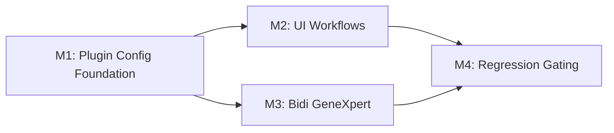

# Tasks: Generic ASTM Plugin Profiles v1.2 (Simplified)

**Input**: design documents in `specs/012-generic-astm-plugin-profiles/`  
**Tests**: mandatory before implementation in each milestone

## Format

`[ID] [P?] [Milestone] Description`

- **[P]**: parallelizable
- **[Milestone]**: M1, M2, M3, M4

---

## Phase 1: Setup and Baseline

- [ ] T001 Verify environment and submodules per quickstart.
- [ ] T002 Run baseline GeneXpert regression (test-connection) before any
      feature work.

---

## Phase 2: M1 - Plugin Config Foundation

**Branch**: `feat/012-ogc-337-generic-astm-plugin-profiles-m1-plugin-config`

### Foundation sync from reference branches (manual apply only)

- [ ] T003 [M1] Manual-apply RBAC infra from old M1:
  - `src/main/java/org/openelisglobal/security/SecurityConfig.java`
  - `src/main/java/org/openelisglobal/security/login/CustomUserDetailsService.java`
- [ ] T004 [M1] Manual-apply 009 decouple mapping set:
  - `src/main/resources/liquibase/3.4.x.x/009-decouple-test-mappings.xml`
  - `src/main/java/org/openelisglobal/analyzerimport/valueholder/AnalyzerTestMappingPK.java`
  - `src/main/java/org/openelisglobal/analyzerimport/valueholder/AnalyzerTestMapping.java`
  - `src/main/java/org/openelisglobal/analyzerimport/daoimpl/AnalyzerTestMappingDAOImpl.java`
  - `src/main/java/org/openelisglobal/analyzerimport/util/AnalyzerTestNameCache.java`
  - `src/main/java/org/openelisglobal/analyzerimport/analyzerreaders/AnalyzerLineInserter.java`
  - `src/main/java/org/openelisglobal/analyzerimport/analyzerreaders/ASTMAnalyzerReader.java`
- [ ] T005 [M1] Manual-apply `AnalyzerControllerHelper.java` from old M2.
- [ ] T006 [M1] Manual-apply `profileMeta` updates in 11 profile JSON files.

### Directory and naming cleanup

- [ ] T007 [M1] Rename `projects/analyzer-defaults/` ->
      `projects/analyzer-profiles/`.
- [ ] T008 [P] [M1] Update backend references (`AnalyzerRestController`, env var
      usage, config paths).
- [ ] T009 [P] [M1] Update build and infra references (`pom.xml`, docker
      compose, harness references).
- [ ] T010 [P] [M1] Update frontend service path references to
      `analyzer-profiles`.

### Liquibase and schema

- [ ] T011 [M1] Ensure `base.xml` includes changesets in order: 009, 010, 011.
- [ ] T012 [M1] Create `010-create-analyzer-plugin-config.xml`.
- [ ] T013 [P] [M1] Create `011-create-analyzer-pending-code.xml`.

### Entities and DAOs

- [ ] T014 [M1] Add `AnalyzerPluginConfig` valueholder/entity.
- [ ] T015 [P] [M1] Add `AnalyzerPendingCode` valueholder/entity.
- [ ] T016 [P] [M1] Add DAO interfaces/impls for plugin config and pending code.

### Services and business logic

- [ ] T017 [M1] Implement `AnalyzerPluginConfigService` (CRUD + validation +
      QC/transform evaluators).
- [ ] T018 [P] [M1] Implement `AnalyzerPendingCodeService`
      (detect/increment/cap/purge/resolve/ignore).
- [ ] T019 [M1] Enhance `AnalyzerServiceImpl.autoCreateTestMappings()` to
      populate `configDefaults`.
- [ ] T020 [M1] Enforce activation gate in analyzer status transition (BR-12 via
      JSONB config).
- [ ] T021 [M1] Extend `AnalyzerMappingPreviewServiceImpl` with v1.2 outputs
      from JSONB config.
- [ ] T060 [M1] Implement port conflict validation for active analyzer listeners
      (BR-11).
- [ ] T061 [M1] Implement profile schema validation on profile read/apply path
      (BR-18).
- [ ] T062 [M1] Enforce built-in profile immutability in runtime profile APIs
      (BR-20).

### Controllers and RBAC

- [ ] T022 [M1] Implement `AnalyzerPluginConfigRestController`.
- [ ] T023 [M1] Apply `@PreAuthorize("hasRole('GLOBAL_ADMIN')")` to new
      endpoints.
- [ ] T024 [M1] Standardize structured error responses via
      `AnalyzerControllerHelper`.

### Tests

- [ ] T025 [M1] ORM mapping tests for new entities.
- [ ] T026 [P] [M1] Service unit tests for plugin config service.
- [ ] T027 [P] [M1] Service unit tests for pending code service.
- [ ] T028 [P] [M1] Controller tests for plugin-config APIs and RBAC.
- [ ] T029 [M1] Integration test: profile apply -> mappings + plugin config
      defaults.
- [ ] T030 [M1] Integration test: activation gate + preview extension behavior.
- [ ] T063 [P] [M1] Validation tests for aggregation window bounds (`BY_SESSION`
      5-300) (BR-14).
- [ ] T064 [P] [M1] Integration tests for pending-code cap/purge behavior and
      status transitions (BR-16).
- [ ] T065 [P] [M1] Parsing/preview tests for 1-indexed ASTM field/component
      extraction references (BR-17).
- [ ] T066 [P] [M1] Negative tests for profile schema validation failures
      (BR-18).
- [ ] T067 [P] [M1] Tests that profile mutation/update APIs reject writes to
      built-in filesystem templates (BR-20).
- [ ] T068 [P] [M1] Tests for active analyzer port conflict detection and
      conflict response payload (BR-11).

### Build and gate

- [ ] T031 [M1] Run backend formatting/build.
- [ ] T032 [M1] Run target M1 tests.
- [ ] T033 [M1] Run GeneXpert regression gate.
- [ ] T034 [M1] Open replacement PR referencing closed #2969 and #2970.

---

## Phase 3: M2 - Analyzer UI Workflows

**Depends on**: M1

- [x] T035 [M2] Update analyzer UI flows to consume plugin-config APIs (not
      astm-config APIs).
- [ ] T036 [P] [M2] Implement/adjust UI for QC rules, transforms, extraction,
      aggregation, flag mappings.
- [x] T037 [P] [M2] Extend simulator UI to show v1.2 preview payload.
- [x] T038 [P] [M2] Add pending-code UI workflow.
- [x] T039 [M2] Update i18n keys for new/changed labels.
- [x] T040 [M2] Remove profile-library and lab-unit UI/API assumptions from M2
      scope.
- [x] T041 [M2] Jest tests for updated UI components.
- [x] T042 [M2] Playwright tests for revised analyzer setup + simulator paths.
- [ ] T043 [M2] Run M2 build/tests and GeneXpert regression gate.
- [ ] T044 [M2] Open M2 PR.

---

## Phase 4: M3 - Bidirectional GeneXpert ASTM

**Depends on**: M1

- [ ] T045 [M3] Implement Q-segment detection/responder path.
- [ ] T046 [P] [M3] Implement order send service (`send-order`).
- [ ] T047 [P] [M3] Implement results query service (`query-results`).
- [ ] T048 [P] [M3] Add/update mock-server and harness scripts for all 4
      pathways.
- [ ] T049 [M3] Add controller endpoints and RBAC checks.
- [ ] T050 [M3] Add unit/integration tests for each pathway.
- [ ] T051 [M3] Validate all 4 pathways against mock analyzer.
- [ ] T052 [M3] Validate all 4 pathways against real GeneXpert and capture
      evidence.
- [ ] T053 [M3] Run build/tests and open M3 PR.

---

## Phase 5: M4 - Regression Gating

**Depends on**: M2 and M3

- [ ] T054 [M4] Full analyzer UI E2E regression suite.
- [ ] T055 [M4] Full bidirectional pathway regression suite.
- [ ] T056 [M4] Non-regression backend analyzer test suite.
- [ ] T057 [M4] Final formatting/build verification.
- [ ] T058 [M4] Final documentation alignment and evidence packaging.
- [ ] T059 [M4] Open final regression-gating PR.

---

## Dependencies

## Deferred (Not in this task list)

- DB-backed profile library/import/export/sharing (US6)
- `analyzer_profile` and `analyzer_profile_application`
- `analyzer_lab_unit` and FR-025
- tiered LAB_USER/LAB_SUPERVISOR/LAB_ADMIN authorization model
