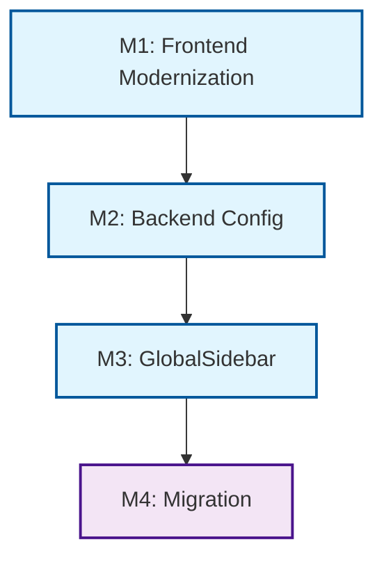

---
description:
  "Task list for unified application navigation feature implementation"
---

# Tasks: Unified Application Navigation

**Input**: Design documents from `/specs/016-unified-app-navigation/`  
**Prerequisites**: plan.md, spec.md, data-model.md, contracts/, research.md

**Tests**: Tests are MANDATORY for new behavior (Constitution Principle V).

**Organization**: Tasks are grouped by **Milestone** per Constitution Principle
IX (overriding default User Story organization).

## Format: `[ID] [P?] [Milestone] Description`

- **[P]**: Can run in parallel (different files, no dependencies)
- **[Milestone]**: Which milestone this task belongs to (M1, M2, M3, M4)
- Include exact file paths in descriptions

## Milestone Dependency Graph

---

## M1: Frontend Stack Modernization

_Goal: Upgrade React 17 → 18 and Carbon to latest v11. Remove legacy
carbon-components._

- [ ] T001 [M1] Create branch
      `feat/016-unified-app-navigation-m1-frontend-modern` from `develop`
- [ ] T002 [M1] Update React to ^18.2.0 and Carbon to latest v11 in
      `frontend/package.json`
- [ ] T003 [M1] Remove `carbon-components` legacy dependency from
      `frontend/package.json`
- [ ] T004 [M1] Update test configuration in `frontend/package.json` for React
      18 compatibility
- [ ] T005 [P] [M1] Fix breaking changes in
      `frontend/src/components/admin/Admin.js` (React 18 + Carbon v11)
- [ ] T006 [P] [M1] Fix breaking changes in
      `frontend/src/components/coldStorage/Reports.js`
- [ ] T007 [P] [M1] Fix breaking changes in
      `frontend/src/components/validation/Validation.js`
- [ ] T008 [M1] Run frontend unit tests and verify >70% coverage maintained
- [ ] T009 [M1] Run `npm run test:e2e:smoke` to verify application starts and
      critical paths work
- [ ] T010 [M1] Create PR for M1 targeting `develop`

---

## M2: Backend Configuration Foundation

_Goal: Extend Menu entity, add Liquibase migration, implement
MenuConfigurationHandler._

- [ ] T011 [M2] Create branch
      `feat/016-unified-app-navigation-m2-backend-config` from `develop` (or M1
      if merged)
- [ ] T012 [M2] Create Liquibase migration
      `src/main/resources/db/changelog/2026-04-menu-navigation-enhancements.xml`
- [ ] T013 [M2] Update `src/main/resources/db/changelog/changelog-master.xml` to
      include new migration
- [ ] T014 [M2] Write ORM validation test
      `src/test/java/org/openelisglobal/menu/valueholder/MenuValidationTest.java`
      (MUST FAIL)
- [ ] T015 [M2] Update `Menu` entity in
      `src/main/java/org/openelisglobal/menu/valueholder/Menu.java` with new
      fields
- [ ] T016 [M2] Verify ORM validation test passes
- [ ] T017 [M2] Write unit tests
      `src/test/java/org/openelisglobal/menu/service/MenuConfigurationHandlerTest.java`
      (MUST FAIL)
- [ ] T018 [M2] Implement `MenuConfigurationHandler.java` in
      `src/main/java/org/openelisglobal/menu/service/`
- [ ] T019 [M2] Verify `MenuConfigurationHandlerTest` passes
- [ ] T020 [M2] Write unit tests
      `src/test/java/org/openelisglobal/menu/service/MenuServiceTest.java` for
      provenance logic (MUST FAIL)
- [ ] T021 [M2] Update `MenuServiceImpl.java` with provenance tracking
      (`config_source` handling)
- [ ] T022 [M2] Verify `MenuServiceTest` passes
- [ ] T023 [M2] Write integration tests
      `src/test/java/org/openelisglobal/menu/controller/MenuControllerTest.java`
      (MUST FAIL)
- [ ] T024 [M2] Update `MenuController.java` to implement role filtering and
      return new fields
- [ ] T025 [M2] Verify `MenuControllerTest` passes
- [ ] T026 [M2] Create base configuration file
      `src/main/resources/configuration/menus/menus.json`
- [ ] T027 [M2] Create PR for M2 targeting `develop`

---

## M3: Frontend GlobalSidebar Component

_Goal: Create GlobalSidebar React component and MenuIconRegistry._

- [ ] T028 [M3] Create branch
      `feat/016-unified-app-navigation-m3-global-sidebar` from `develop` (or M2)
- [ ] T029 [M3] Write unit tests
      `frontend/src/components/navigation/MenuIconRegistry.test.js` (MUST FAIL)
- [ ] T030 [P] [M3] Implement `MenuIconRegistry.js` in
      `frontend/src/components/navigation/`
- [ ] T031 [M3] Verify `MenuIconRegistry.test.js` passes
- [ ] T032 [M3] Write unit tests
      `frontend/src/components/navigation/GlobalSidebar.test.js` (MUST FAIL)
- [ ] T033 [P] [M3] Implement `GlobalSidebar.js` using `@carbon/react` and SWR
      for data fetching
- [ ] T034 [P] [M3] Implement client-side role filtering and navigation state
      persistence in `GlobalSidebar.js`
- [ ] T035 [M3] Verify `GlobalSidebar.test.js` passes
- [ ] T036 [M3] Create PR for M3 targeting `develop`

---

## M4: Migration & Cleanup [P]

_Goal: Replace hardcoded SideNavs across Admin, Reports, and Validation._

- [ ] T037 [M4] Create branch `feat/016-unified-app-navigation-m4-migration`
      from `develop` (or M3)
- [ ] T038 [M4] `/plan-record-playwright` - Plan E2E tests for unified
      navigation flows
- [ ] T039 [M4] `/write-playwright-test` - Create
      `e2e/playwright/tests/navigation.spec.ts` (MUST FAIL)
- [ ] T040 [P] [M4] Replace hardcoded SideNav in
      `frontend/src/components/admin/Admin.js` with `GlobalSidebar`
- [ ] T041 [P] [M4] Replace hardcoded SideNav in
      `frontend/src/components/coldStorage/Reports.js`
- [ ] T042 [P] [M4] Replace hardcoded SideNav in
      `frontend/src/components/validation/Validation.js`
- [ ] T043 [P] [M4] Update Admin UI (e.g., `GlobalMenuManagement.js`) to show
      `config_source` and add "Reset"
- [ ] T044 [P] [M4] Implement `/rest/menu/{elementId}/reset` endpoint in
      `MenuController.java`
- [ ] T045 [P] [M4] Create `reports.json` config in
      `src/main/resources/configuration/menus/`
- [ ] T046 [P] [M4] Create `validation.json` config in
      `src/main/resources/configuration/menus/`
- [ ] T047 [M4] `/audit-playwright` - Run and verify `navigation.spec.ts` passes
- [ ] T048 [M4] Run `npm run test:a11y` to verify WCAG 2.1 AA compliance
- [ ] T049 [M4] Create PR for M4 targeting `develop`
