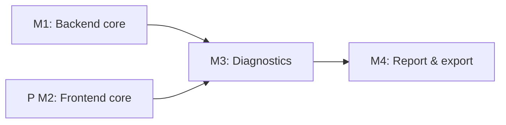

# Implementation Plan: Tuberculosis Laboratory Workflow

**Branch**: `feat/053-tb-lab-workflow` | **Date**: 2025-12-14 | **Updated**:
2025-12-18 | **Spec**: `specs/053-tb-lab-workflow/spec.md` **Input**: Feature
specification from `/specs/053-tb-lab-workflow/spec.md` + TB workflow
screenshots

## Summary

Extend the OGC-51 Notebook/Page architecture to deliver a TB-specific,
multi-page workflow (registration, QC, labeling, processing, culture tracking,
smear, identification, GeneXpert, DST, isolate storage, reporting, REDCap
export). Add TB sample ID generator (NNN/YY with yearly reset), TB
valueholders/DAOs/services/controllers/forms, Liquibase schema, and Carbon-based
React pages.

**Duplication Strategy**: Frontend pages will be **duplicated** from existing
workflows (Immunology/MNTD, Pharma) to prevent merge conflicts during parallel
development. Shared components like `SampleGrid`, `PageNavigation`,
`StorageHierarchySelector` will be reused. Pages will be harmonized in a future
refactoring milestone after all workflows stabilize.

**Current Progress**:

- Page 1 (Sample Creation): ✅ Implemented (`TBSampleCreationPage.js`)
- Pages 2-6: Placeholders in `TBWorkflowTab.js` (to be implemented)

## Technical Context

**Language/Version**: Java 21 (Spring MVC) + React 17  
**Primary Dependencies**: Spring Framework 6.2.2, Hibernate 6.x, Liquibase
4.8.0, @carbon/react 1.15, React Intl 5.20.12, SWR 2.0.3  
**Storage**: PostgreSQL 14 via JPA/Hibernate; Liquibase changesets for TB
tables + TB sample ID sequence (yearly reset)  
**Testing**: JUnit 4 + Mockito + BaseWebContextSensitiveTest; Jest + React
Testing Library; Cypress 12 E2E  
**Target Platform**: Tomcat 10 WAR backend; modern Chromium/Firefox; Docker
Compose dev env  
**Project Type**: web (backend + frontend monorepo)  
**Performance Goals**: Registration <3 min; QC <1 min; MDR alert within 5s of
DST save; culture tracking grid responsive for 50 samples with 8-week readings;
REDCap export <30s for 500 samples  
**Constraints**: Carbon-only UI, React Intl for all strings; 5-layer
architecture with @Transactional only in services; services compile data to
avoid lazy loading; Liquibase with rollback + indexes; no country-specific code;
audit trail for PHI; TB sample ID generator config-driven  
**Scale/Scope**: ~10 notebook pages, 12 user stories, new 7+ TB tables; 8-week
readings per sample; batch label/exports and storage hierarchy reuse

**Resolved Questions** (from research.md):

- ✅ **GeneXpert import**: Manual entry only for this milestone; expose
  future-safe hook (service method + REST endpoint flag) for instrument
  payloads.
- ✅ **REDCap export**: CSV/Excel via existing DataExport pattern; include
  REDCap-ready column order + `exported_to_redcap_at` timestamp. API integration
  deferred until mapping/credentials provided.
- ✅ **TB sample ID scope**: One sequence per installation per year
  (`tb_sample_id_seq_<year>`). Config hook for per-site namespace later if
  needed.

## Constitution Check

- Carbon Design System only; update notebook UI with @carbon/react components.
- Internationalization mandatory (React Intl); no hardcoded user-facing text.
- Strict 5-layer backend: Valueholder→DAO→Service→Controller→Form; no
  @Transactional in controllers; services perform data compilation with JOIN
  FETCH to avoid lazy loads.
- Database changes through Liquibase with rollbacks and indexes (culture
  readings by sample/week, storage location lookups, TB sample ID uniqueness).
- Configuration-driven variation: TB ID generation and page templates
  configured, no country-specific branching.
- Security: reuse RBAC for notebook operations; audit trail (sys_user_id +
  timestamps) on TB records; input validation for all forms.
- Testing: unit + ORM validation + integration + E2E per milestone; >70%
  coverage overall (backend >80% target for new code); Cypress executed
  per-feature file during dev.
- E2E data setup via fixtures/API (no UI seeding).
- Constitution file is a placeholder; applying AGENTS.md v1.8.0 rules until it
  is updated.

## Project Structure

```text
specs/053-tb-lab-workflow/
├── plan.md                     # This file
├── research.md                 # Research decisions
├── data-model.md               # Entity/table documentation
├── quickstart.md               # Developer guide
├── contracts/                  # API contracts (OpenAPI)
│   └── tb-lab-api.md
└── checklists/
    └── requirements.md

# Backend (Java)
src/main/java/org/openelisglobal/
├── notebook/                   # Reused OGC-51 notebook core
│   ├── valueholder/
│   ├── dao/
│   ├── service/
│   └── controller/
└── tb/                         # NEW: TB-specific entities
    ├── valueholder/
    │   ├── TbSampleRegistration.java
    │   ├── TbQualityCheck.java
    │   ├── TbCultureReading.java
    │   ├── TbSmearResult.java
    │   ├── TbIdentificationResult.java
    │   ├── TbGeneXpertResult.java
    │   ├── TbDstResult.java
    │   └── TbIsolateStorage.java
    ├── dao/
    ├── service/
    ├── controller/
    └── form/

src/main/resources/liquibase/3.4.x.x/   # TB Liquibase changesets
└── xxx-tb-workflow-tables.xml

src/test/java/org/openelisglobal/tb/   # JUnit 4 tests

# Frontend (React) - EXISTING STRUCTURE
frontend/src/components/notebook/
├── pages/
│   └── tb/                           # TB-specific pages
│       ├── index.js                  # ✅ EXISTS
│       ├── TBSampleCreationPage.js   # ✅ Page 1 IMPLEMENTED
│       ├── TBQualityCheckPage.js     # TODO: Page 2
│       ├── TBStorageAssignmentPage.js# TODO: Page 3
│       ├── TBInitialProcessingPage.js# TODO: Page 4
│       ├── TBCultureTrackingPage.js  # TODO: Page 5 (8-week grid)
│       ├── TBSmearPage.js            # TODO: Page 6
│       ├── TBIdentificationPage.js   # TODO: Page 7
│       ├── TBGeneXpertPage.js        # TODO: Page 8
│       ├── TBDSTPage.js              # TODO: Page 9
│       ├── TBIsolateStoragePage.js   # TODO: Page 10
│       └── TBResultCompilationPage.js# TODO: Page 11
└── workflow/
    ├── TBWorkflowTab.js              # ✅ EXISTS (container)
    ├── TBManifestImportModal.js      # ✅ EXISTS
    ├── SampleGrid.js                 # Shared - reuse
    ├── PageNavigation.js             # Shared - reuse
    └── StorageHierarchySelector.js   # Shared - reuse

frontend/src/languages/
├── en.json                           # Add TB i18n keys
└── fr.json

frontend/cypress/e2e/
└── tb-workflow.cy.js                 # E2E tests
```

**Structure Decision**: Duplicate TB-specific pages (not shared code) to avoid
merge conflicts with parallel Immunology/Pharma development. Reuse shared
components (`SampleGrid`, `PageNavigation`, `StorageHierarchySelector`). Backend
follows existing 5-layer pattern in `org.openelisglobal.tb` package.

## TB Workflow Pages (from Screenshots)

Based on the TB laboratory workflow specification:

| Page | Name                              | Status     | Description                                                      |
| ---- | --------------------------------- | ---------- | ---------------------------------------------------------------- |
| 1    | Sample Creation & Registration    | ✅ Done    | Full metadata capture, TB sample ID (NNN/YY), manifest import    |
| 2    | Quality Check (QC)                | 🔲 Pending | Leak, temp, packaging, labeling, volume checks; rejection reason |
| 3    | Sample Storage Assignment         | 🔲 Pending | Temporary/long-term storage or shipment routing                  |
| 4    | Initial Processing                | 🔲 Pending | Media preparation (LJ/MGIT/Both), reagents, instruments          |
| 5    | Culture Tracking (8 weeks)        | 🔲 Pending | Weekly growth readings grid; No Growth/Growth/Contaminated       |
| 6    | Smear Microscopy & AFB            | 🔲 Pending | Method (ZN/Fluorescent), AFB result (Neg/Scanty/1+/2+/3+)        |
| 7    | Species Identification            | 🔲 Pending | MTB/NTM/Negative/Contaminated; method selection                  |
| 8    | GeneXpert Testing                 | 🔲 Pending | MTB detection + Rifampicin resistance status                     |
| 9    | Drug Susceptibility Testing (DST) | 🔲 Pending | 1st line (INH/RMP/STM/EMB/PZA), 2nd line drugs; MDR flag         |
| 10   | Isolate Storage                   | 🔲 Pending | Room > Fridge > Compartment > Rack > Box hierarchy               |
| 11   | Result Compilation & Reporting    | 🔲 Pending | Final report with all results; Reported by/Reviewed by           |
| 12   | Data Export (REDCap)              | 🔲 Pending | CSV/Excel export with REDCap-ready column mapping                |

## Milestone Plan (feature >3 days)

| ID     | Branch Suffix    | Scope                                                                                                                                                         | User Stories              | Verification                                                  | Depends On |
| ------ | ---------------- | ------------------------------------------------------------------------------------------------------------------------------------------------------------- | ------------------------- | ------------------------------------------------------------- | ---------- |
| M1     | m1-backend-core  | Liquibase for TB tables/sequences; TB valueholders/DAOs/services; TB sample ID generator; REST for registration, QC, culture status; audit + config hooks     | P0 (1-2), P1 (5 backbone) | Unit + ORM validation + integration (registration/QC/culture) | -          |
| [P] M2 | m2-frontend-core | Carbon pages for QC (Page 2), storage (Page 3), processing (Page 4), culture grid (Page 5); SWR clients; label generation; i18n keys; update TBWorkflowTab.js | P0 (1-2), P1 (3-5 UI)     | Jest/RTL for forms/grids; accessibility checks                | -          |
| M3     | m3-diagnostics   | Smear (Page 6), identification (Page 7), GeneXpert (Page 8), DST (Page 9) backend + frontend; MDR alert logic; QC warning propagation                         | P1 (6-9)                  | Unit/integration for diagnostics APIs; Jest for forms         | M1, M2     |
| M4     | m4-report-export | Isolate storage (Page 10); result compilation (Page 11); REDCap export (Page 12); finalize report; Cypress e2e + performance checks                           | P2 (10-12), P3 (export)   | Cypress e2e (report/export); CSV validation; perf checks      | M3         |



### Milestone Details

#### M1: Backend Core (feat/053-tb-lab-workflow-m1-backend-core)

**Scope**: Database schema, entities, DAOs, services for core TB workflow.

**Deliverables**:

- Liquibase changesets for all TB tables (8 tables)
- TB sample ID sequence with yearly reset (`tb_sample_id_seq_<year>`)
- Valueholders: `TbSampleRegistration`, `TbQualityCheck`, `TbCultureReading`
- DAOs with HQL queries and indexes
- Services with `@Transactional`, data compilation (JOIN FETCH)
- REST endpoints for registration, QC, culture CRUD
- Unit + ORM validation + integration tests (>80% coverage)

#### M2: Frontend Core (feat/053-tb-lab-workflow-m2-frontend-core) [P]

**Scope**: Carbon UI pages for workflow steps 2-5.

**Deliverables**:

- `TBQualityCheckPage.js` - QC checklist, rejection reasons, proceed with
  remarks
- `TBStorageAssignmentPage.js` - Storage routing panel (duplicate from MNTD)
- `TBInitialProcessingPage.js` - Media selection (LJ/MGIT/Both), reagents
- `TBCultureTrackingPage.js` - 8-week reading grid (unique to TB)
- Update `TBWorkflowTab.js` to render new pages
- i18n keys in `en.json`/`fr.json`
- Jest/RTL tests for each page

#### M3: Diagnostics (feat/053-tb-lab-workflow-m3-diagnostics)

**Scope**: All diagnostic test result pages (Smear, ID, GeneXpert, DST).

**Deliverables**:

- Backend: `TbSmearResult`, `TbIdentificationResult`, `TbGeneXpertResult`,
  `TbDstResult` entities
- MDR-TB flag computation (INH-R + RMP-R)
- Rifampicin resistance alert
- Frontend pages 6-9 with Carbon forms
- QC failure warning propagation across pages

#### M4: Report & Export (feat/053-tb-lab-workflow-m4-report-export)

**Scope**: Storage, reporting, and export functionality.

**Deliverables**:

- `TbIsolateStorage` entity with hierarchical location
- Integration with `SampleStorageService`
- Result compilation page aggregating all results
- REDCap CSV/Excel export with timestamp tracking
- Cypress E2E tests covering full workflow
- Performance validation (culture grid <100ms, export <30s for 500 samples)

## TB Workflow Details (from Screenshots)

### Sample Accession and Registration (Page 1)

**Format for test request paper**:

- Document number as free text
- Sample types: sputum, body fluids, swab, tissue, others
- Required metadata: patient name, age, sex, patient ID/code, study ID, sample
  ID, referring health facility/collection site, treatment history, specimen
  type, specimen quality, received site/date/time, patient address, physician
  phone, patient phone, consent status, test requested, method used
- Sample received date and time
- Result entry part: Reported by, Reviewed by, Comment section
- **Unique specimen ID**: Sequential number per year (e.g., 345/25)

### Quality Check (QC) - Raw Sample Integrity (Page 2)

**TB-specific QC criteria**:

- Leak detection
- Transportation conditions (temperature, triple packaging)
- Mislabeled/incomplete labeling
- Mismatched b/n request and sample
- Sample volume adequacy

**QC Outcomes**:

- **Passed samples**: Proceed to processing, or storage
  (temporary/shipment/long-term)
- **Failed samples**: Notify physician/researcher/bringing person
  - Sample may be discarded OR kept with remarks for analysis
  - **Rejection reason is MANDATORY** - must record: mislabeling, insufficient,
    contaminated, etc.

### System Registration and Labeling (Page 3)

- Once registered, a label is generated
- Label includes barcode or name for identification during collection

### Initial Processing (Page 4)

- Register processing date and initials
- Media preparation takes place
- Select reagents and instruments at process start
- After media prepared, taken to incubator for bacterial growth storage
- Document type of assay and equipment used

### Culture Inoculation & Weekly Monitoring (Page 5)

**Culture process**:

- Samples processed and inoculated to media (LJ/MGIT/Both)
- Checked for growth **every week** for up to 8 weeks (week 1 to week 8)
- Week 8 = negative result (reading date recorded)
- Method used for Culture: MGIT or LJ

**Culture Positive result format**:

- Negative, NTM, Contaminated
- Result reported date, Test done by, Reviewed by
- Method used for: ZN or concentrated, fluorescens, Others
- **AFB Result**: Scanty, 1+, 2+, 3+, Negative
- Result reported date, Test done by, Reviewed by

**GeneXpert results**:

- MTB detected and if not detected
- MTB detected, MTB not detected
- MTB detected and Rif indeterminate
- Method used for: Real time PCR
- Result reported date, Test done by, Reviewed by

**Drug Susceptibility Testing (DST) result**:

- Method Used: Phenotypic DST (1st line drugs, 2nd line drugs), Molecular DST
  (1st line drugs)
- **1st line drugs**: INH, RMP, STM, EMB, PZA
- **2nd line drugs**: FLQ, KAN/AMK/CAP, KAN/CAP/VIO, KAN/AMK/CAP/VIO, Low level
  KAN
- **DST results**: Sensitive, Resistance, Invalid

### Laboratory-specific Processing

- Outline **culture inoculation**, smear preparation, enrichment, colony
  isolation
- **Isolate storage**: Room, Fridge ID, Compartment, Rack, Box

### Assay/Test Execution (Page 6-9)

Experimental/diagnostic procedures:

- Smear microscopy
- Identification (BHI/BA, MTB rapid test kit)
- Culture (LJ, MGIT)
- DST (1st and 2nd antibiotic susceptibility)

### Data Handling, Analysis & Interpretation (Page 11-12)

**Data Export**:

- Raw data generated by machines exported to LMS (if supported)

**Data Analysis**:

- Data manager analyzes exported data using specialized software tools

**Final Output Integration**:

- Once analysis complete and final output validated, results integrated into
  REDCap database for secure storage and research use

## Testing Strategy

- **Reference**: `.specify/guides/testing-roadmap.md`; follow TDD for complex
  logic.
- **Coverage goals**: Backend new code >80%; frontend >70%; overall >70% for
  feature scope.
- **Test types**: Unit (services, TB ID generator, MDR flag), ORM validation
  (mappings/load), integration (`BaseWebContextSensitiveTest` for REST flows),
  Jest/RTL for Carbon pages, Cypress e2e for result compilation/export.
- **Test data management**: Use builders/factories and fixture loader
  (`src/test/resources/load-test-fixtures.sh`) for TB samples; Cypress uses
  API-based setup (no UI seeding).
- **Checkpoint validations**:
  - M1: unit + ORM validation + integration tests for registration/QC/culture.
  - M2: Jest/RTL for registration/QC/culture pages + i18n coverage.
  - M3: integration for smear/ID/GeneXpert/DST + Jest forms + MDR alert logic.
  - M4: Cypress e2e covering report generation, storage, REDCap export; CSV
    schema validation; performance sanity (grid render/exports within targets).
- **Lint/format**: `mvn spotless:apply` and `npm run format` before commits; run
  `mvn clean install -DskipTests -Dmaven.test.skip=true` for fast builds during
  dev.

## Complexity Tracking

| Violation | Why Needed | Simpler Alternative Rejected Because |
| --------- | ---------- | ------------------------------------ |
| None      | N/A        | N/A                                  |
