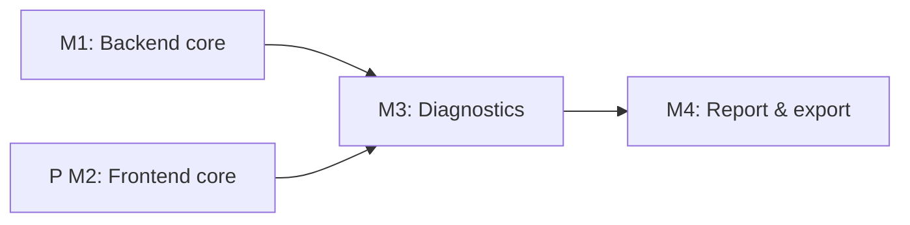

# Implementation Plan: Tuberculosis Laboratory Workflow

**Branch**: `053-tb-lab-workflow` | **Date**: 2025-12-14 | **Spec**: `specs/053-tb-lab-workflow/spec.md`
**Input**: Feature specification from `/specs/053-tb-lab-workflow/spec.md`

## Summary

Extend the OGC-51 Notebook/Page architecture to deliver a TB-specific, multi-page workflow (registration, QC, labeling, processing, culture tracking, smear, identification, GeneXpert, DST, isolate storage, reporting, REDCap export). Add TB sample ID generator (NNN/YY with yearly reset), TB valueholders/DAOs/services/controllers/forms, Liquibase schema, and Carbon-based React pages that reuse notebook grids, bulk actions, and SampleStorageService.

## Technical Context

**Language/Version**: Java 21 (Spring MVC) + React 17  
**Primary Dependencies**: Spring Framework 6.2.2, Hibernate 6.x, Liquibase 4.8.0, @carbon/react 1.15, React Intl 5.20.12, SWR 2.0.3  
**Storage**: PostgreSQL 14 via JPA/Hibernate; Liquibase changesets for TB tables + TB sample ID sequence (yearly reset)  
**Testing**: JUnit 4 + Mockito + BaseWebContextSensitiveTest; Jest + React Testing Library; Cypress 12 E2E  
**Target Platform**: Tomcat 10 WAR backend; modern Chromium/Firefox; Docker Compose dev env  
**Project Type**: web (backend + frontend monorepo)  
**Performance Goals**: Registration <3 min; QC <1 min; MDR alert within 5s of DST save; culture tracking grid responsive for 50 samples with 8-week readings; REDCap export <30s for 500 samples  
**Constraints**: Carbon-only UI, React Intl for all strings; 5-layer architecture with @Transactional only in services; services compile data to avoid lazy loading; Liquibase with rollback + indexes; no country-specific code; audit trail for PHI; TB sample ID generator config-driven  
**Scale/Scope**: ~10 notebook pages, 12 user stories, new 7+ TB tables; 8-week readings per sample; batch label/exports and storage hierarchy reuse

Open Questions (NEEDS CLARIFICATION):
- GeneXpert import: manual entry only vs analyzer import hook for future?
- REDCap export: CSV-only vs API integration contract and field mapping.
- TB sample ID scope: single global sequence per year vs per site/lab.

## Constitution Check

- Carbon Design System only; update notebook UI with @carbon/react components.
- Internationalization mandatory (React Intl); no hardcoded user-facing text.
- Strict 5-layer backend: Valueholder→DAO→Service→Controller→Form; no @Transactional in controllers; services perform data compilation with JOIN FETCH to avoid lazy loads.
- Database changes through Liquibase with rollbacks and indexes (culture readings by sample/week, storage location lookups, TB sample ID uniqueness).
- Configuration-driven variation: TB ID generation and page templates configured, no country-specific branching.
- Security: reuse RBAC for notebook operations; audit trail (sys_user_id + timestamps) on TB records; input validation for all forms.
- Testing: unit + ORM validation + integration + E2E per milestone; >70% coverage overall (backend >80% target for new code); Cypress executed per-feature file during dev.
- E2E data setup via fixtures/API (no UI seeding).
- Constitution file is a placeholder; applying AGENTS.md v1.8.0 rules until it is updated.

## Project Structure

```text
specs/053-tb-lab-workflow/
├── plan.md
├── research.md
├── data-model.md
├── quickstart.md
└── contracts/
src/main/java/org/openelisglobal/
├── notebook/…                 # reuse OGC-51 notebook core
└── tb/
    ├── valueholder/
    ├── dao/
    ├── service/
    ├── controller/
    └── form/
src/main/resources/liquibase/tb/      # TB tables + sequences + rollbacks
src/test/java/org/openelisglobal/tb/  # JUnit 4 unit/integration/ORM validation
frontend/src/
├── pages/notebook/tb/                # Carbon pages for Registration…Report
├── components/notebook/tb/           # Reusable widgets (culture grid, QC)
├── services/tb/                      # SWR/REST clients
└── languages/en.json|fr.json         # Message ids for TB pages
frontend/cypress/e2e/tb-workflow.cy.js
```

**Structure Decision**: Single repo with backend in `src/main/java` + Liquibase resources and frontend in `frontend/src`, leveraging existing notebook modules and storage services; contracts kept under `specs/053-tb-lab-workflow/contracts/`.

## Milestone Plan (feature >3 days)

| ID     | Branch Suffix     | Scope                                                     | User Stories          | Verification                                        | Depends On |
|--------|-------------------|-----------------------------------------------------------|-----------------------|-----------------------------------------------------|------------|
| M1     | m1-backend-core   | Liquibase for TB tables/sequences; TB valueholders/DAOs/services; TB sample ID generator; REST for registration, QC, culture status; audit + config hooks | P0 (1-2), P1 (5 backbone) | Unit + ORM validation + integration (registration/QC/culture) | - |
| [P] M2 | m2-frontend-core  | Carbon pages for registration, QC, labeling, processing, culture grid; SWR clients; label generation hook; i18n keys | P0 (1-2), P1 (3-5 UI) | Jest/RTL for forms/grids; accessibility checks      | - |
| M3     | m3-diagnostics    | Smear, identification, GeneXpert, DST backend + frontend; MDR alert logic; QC warning propagation; label print finalize | P1 (6-9)              | Unit/integration for diagnostics APIs; Jest for forms | M1, M2    |
| M4     | m4-report-export  | Isolate storage integration; result compilation; REDCap CSV/Excel export; finalize report; Cypress e2e + performance checks | P2 (10-12), P3 (export) | Cypress e2e (report/export); CSV validation; perf checks | M3         |



## Testing Strategy

- **Reference**: `.specify/guides/testing-roadmap.md`; follow TDD for complex logic.
- **Coverage goals**: Backend new code >80%; frontend >70%; overall >70% for feature scope.
- **Test types**: Unit (services, TB ID generator, MDR flag), ORM validation (mappings/load), integration (`BaseWebContextSensitiveTest` for REST flows), Jest/RTL for Carbon pages, Cypress e2e for result compilation/export.
- **Test data management**: Use builders/factories and fixture loader (`src/test/resources/load-test-fixtures.sh`) for TB samples; Cypress uses API-based setup (no UI seeding).
- **Checkpoint validations**:  
  - M1: unit + ORM validation + integration tests for registration/QC/culture.  
  - M2: Jest/RTL for registration/QC/culture pages + i18n coverage.  
  - M3: integration for smear/ID/GeneXpert/DST + Jest forms + MDR alert logic.  
  - M4: Cypress e2e covering report generation, storage, REDCap export; CSV schema validation; performance sanity (grid render/exports within targets).
- **Lint/format**: `mvn spotless:apply` and `npm run format` before commits; run `mvn clean install -DskipTests -Dmaven.test.skip=true` for fast builds during dev.

## Complexity Tracking

| Violation | Why Needed | Simpler Alternative Rejected Because |
|-----------|------------|-------------------------------------|
| None | N/A | N/A |
