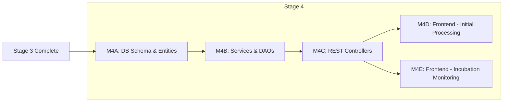

# Tasks: TB Workflow Stage 4 - Initial Processing & Incubation

**Input**: `specs/053-tb-lab-workflow/stages/stage4-plan.md` **Prerequisites**:
Stage 3 (Sample Storage Assignment) complete **Branch**:
`feat/053-tb-lab-workflow`

**Tests**: Per Constitution Principle V, tests are MANDATORY for new behavior.

## Architecture: TWO SEPARATE PAGES

1. **Page 4: TBInitialProcessingPage** - Media Prep → Sample Processing →
   Inoculation
2. **Page 5: TBIncubationMonitoringPage** - Weekly readings with expandable
   sample rows

---

## Milestone Dependency Graph

---

## Phase 1: Database Schema

- [ ] T001 [P] Create Liquibase migration for `tb_media_preparation` in
      `src/main/resources/liquibase/3.4.x.x/032-tb-media-preparation.xml`
- [ ] T002 [P] Create Liquibase migration for `tb_sample_processing` in
      `src/main/resources/liquibase/3.4.x.x/033-tb-sample-processing.xml`
- [ ] T003 [P] Create Liquibase migration to enhance `tb_culture_reading` in
      `src/main/resources/liquibase/3.4.x.x/034-tb-culture-reading-enhance.xml`
- [ ] T004 Update Liquibase base.xml to include 032, 033, 034 in
      `src/main/resources/liquibase/3.4.x.x/base.xml`

**Checkpoint**: Database schema ready

---

## Phase 2: Enums & Valueholders

- [ ] T005 Add Stage 4 enums (MediaQcStatus, DecontaminationMethod,
      ProcessingStatus, CultureResult) in
      `src/main/java/org/openelisglobal/tb/valueholder/TbEnums.java`
- [ ] T006 [P] Create TbMediaPreparation JPA entity in
      `src/main/java/org/openelisglobal/tb/valueholder/TbMediaPreparation.java`
- [ ] T007 [P] Create TbSampleProcessing JPA entity in
      `src/main/java/org/openelisglobal/tb/valueholder/TbSampleProcessing.java`
- [ ] T008 Update TbCultureReading with inoculationDate, mediaBatchId,
      sampleProcessingId, cultureResult, positiveWeek, finalResultDate in
      `src/main/java/org/openelisglobal/tb/valueholder/TbCultureReading.java`

**Checkpoint**: Entities defined

---

## Phase 3: US4.1 - Media Preparation

### Tests

- [ ] T009 [P] [US4.1] Create ORM test in
      `src/test/java/org/openelisglobal/tb/TbMediaPreparationOrmTest.java`
- [ ] T010 [P] [US4.1] Create service test in
      `src/test/java/org/openelisglobal/tb/service/TbMediaPreparationServiceTest.java`

### Implementation

- [ ] T011 [P] [US4.1] Create TbMediaPreparationDAO in
      `src/main/java/org/openelisglobal/tb/dao/TbMediaPreparationDAO.java`
- [ ] T012 [P] [US4.1] Implement TbMediaPreparationDAOImpl in
      `src/main/java/org/openelisglobal/tb/daoimpl/TbMediaPreparationDAOImpl.java`
- [ ] T013 [US4.1] Create TbMediaPreparationService in
      `src/main/java/org/openelisglobal/tb/service/TbMediaPreparationService.java`
- [ ] T014 [US4.1] Implement TbMediaPreparationServiceImpl in
      `src/main/java/org/openelisglobal/tb/service/TbMediaPreparationServiceImpl.java`

---

## Phase 4: US4.2 - Sample Processing

### Tests

- [ ] T015 [P] [US4.2] Create ORM test in
      `src/test/java/org/openelisglobal/tb/TbSampleProcessingOrmTest.java`
- [ ] T016 [P] [US4.2] Create service test in
      `src/test/java/org/openelisglobal/tb/service/TbSampleProcessingServiceTest.java`

### Implementation

- [ ] T017 [P] [US4.2] Create TbSampleProcessingDAO in
      `src/main/java/org/openelisglobal/tb/dao/TbSampleProcessingDAO.java`
- [ ] T018 [P] [US4.2] Implement TbSampleProcessingDAOImpl in
      `src/main/java/org/openelisglobal/tb/daoimpl/TbSampleProcessingDAOImpl.java`
- [ ] T019 [US4.2] Create TbSampleProcessingService in
      `src/main/java/org/openelisglobal/tb/service/TbSampleProcessingService.java`
- [ ] T020 [US4.2] Implement TbSampleProcessingServiceImpl in
      `src/main/java/org/openelisglobal/tb/service/TbSampleProcessingServiceImpl.java`

---

## Phase 5: US4.3 - Inoculation

### Tests

- [ ] T021 [P] [US4.3] Create inoculation test in
      `src/test/java/org/openelisglobal/tb/service/TbCultureReadingInoculationTest.java`

### Implementation

- [ ] T022 [US4.3] Update TbCultureReadingService with inoculate,
      getInoculatedSamples in
      `src/main/java/org/openelisglobal/tb/service/TbCultureReadingServiceImpl.java`
- [ ] T023 [US4.3] Update TbCultureReadingDAO with new queries in
      `src/main/java/org/openelisglobal/tb/daoimpl/TbCultureReadingDAOImpl.java`

---

## Phase 6: US4.4 - Weekly Monitoring

### Tests

- [ ] T024 [P] [US4.4] Create monitoring test in
      `src/test/java/org/openelisglobal/tb/service/TbWeeklyMonitoringTest.java`

### Implementation

- [ ] T025 [US4.4] Add getIncubatingSamples, recordReading, determineFinalResult
      to TbCultureReadingService

---

## Phase 7: REST Controllers

### Tests

- [ ] T026 [P] Create controller test in
      `src/test/java/org/openelisglobal/tb/controller/TbInitialProcessingControllerTest.java`
- [ ] T027 [P] Create controller test in
      `src/test/java/org/openelisglobal/tb/controller/TbIncubationMonitoringControllerTest.java`

### Implementation

- [ ] T028 Create TbInitialProcessingController in
      `src/main/java/org/openelisglobal/tb/controller/rest/TbInitialProcessingController.java`
- [ ] T029 Create TbIncubationMonitoringController (NEW) in
      `src/main/java/org/openelisglobal/tb/controller/rest/TbIncubationMonitoringController.java`

---

## Phase 8: Frontend - Page 1 (Initial Processing)

**Pattern:** Follow `BacteriologyProcessingQCPage.js`

- [ ] T030 [P] Create SWR hooks in
      `frontend/src/components/notebook/pages/tb/hooks/useStage4.js`
- [ ] T031 [P] Create MediaPreparationModal in
      `frontend/src/components/notebook/pages/tb/components/MediaPreparationModal.js`
- [ ] T032 [P] Create SampleProcessingModal in
      `frontend/src/components/notebook/pages/tb/components/SampleProcessingModal.js`
- [ ] T033 [P] Create InoculationModal in
      `frontend/src/components/notebook/pages/tb/components/InoculationModal.js`
- [ ] T034 REWRITE TBInitialProcessingPage (BacteriologyProcessingQCPage
      pattern) in
      `frontend/src/components/notebook/pages/tb/TBInitialProcessingPage.js`

---

## Phase 9: Frontend - Page 2 (Incubation Monitoring) - NEW

**Pattern:** Carbon ExpandableRow DataTable + Modal logging

- [ ] T035 [P] Create WeeklyReadingTable component in
      `frontend/src/components/notebook/pages/tb/components/WeeklyReadingTable.js`
- [ ] T036 [P] Create RecordReadingModal in
      `frontend/src/components/notebook/pages/tb/components/RecordReadingModal.js`
- [ ] T037 CREATE TBIncubationMonitoringPage with ExpandableRow DataTable in
      `frontend/src/components/notebook/pages/tb/TBIncubationMonitoringPage.js`
- [ ] T038 DELETE TBCultureTrackingPage (replaced by TBIncubationMonitoringPage)

---

## Phase 10: i18n

- [ ] T039 [P] Add Stage 4 i18n keys to `frontend/src/languages/en.json`
- [ ] T040 [P] Add Stage 4 i18n keys to `frontend/src/languages/fr.json`

---

## Phase 11: Frontend Tests

- [ ] T041 [P] Create TBInitialProcessingPage tests in
      `frontend/src/components/notebook/pages/tb/TBInitialProcessingPage.test.js`
- [ ] T042 [P] Create TBIncubationMonitoringPage tests in
      `frontend/src/components/notebook/pages/tb/TBIncubationMonitoringPage.test.js`
- [ ] T043 [P] Create MediaPreparationModal tests
- [ ] T044 [P] Create SampleProcessingModal tests
- [ ] T045 [P] Create InoculationModal tests
- [ ] T046 [P] Create RecordReadingModal tests
- [ ] T047 [P] Create WeeklyReadingTable tests

---

## Phase 12: Validation

- [ ] T048 Run `mvn clean compile` to verify backend
- [ ] T049 Run `mvn test -Dtest=Tb*` for TB tests
- [ ] T050 Run `npm run build` for frontend
- [ ] T051 Verify success criteria SC4-01 through SC4-08

---

## Files Summary

| Category  | File                                        | Action  | Task       |
| --------- | ------------------------------------------- | ------- | ---------- |
| Liquibase | `032-tb-media-preparation.xml`              | CREATE  | T001       |
| Liquibase | `033-tb-sample-processing.xml`              | CREATE  | T002       |
| Liquibase | `034-tb-culture-reading-enhance.xml`        | CREATE  | T003       |
| Liquibase | `base.xml`                                  | MODIFY  | T004       |
| Backend   | `TbEnums.java`                              | MODIFY  | T005       |
| Backend   | `TbMediaPreparation.java`                   | CREATE  | T006       |
| Backend   | `TbSampleProcessing.java`                   | CREATE  | T007       |
| Backend   | `TbCultureReading.java`                     | MODIFY  | T008       |
| Backend   | `TbMediaPreparationDAO.java`                | CREATE  | T011       |
| Backend   | `TbMediaPreparationDAOImpl.java`            | CREATE  | T012       |
| Backend   | `TbMediaPreparationService.java`            | CREATE  | T013       |
| Backend   | `TbMediaPreparationServiceImpl.java`        | CREATE  | T014       |
| Backend   | `TbSampleProcessingDAO.java`                | CREATE  | T017       |
| Backend   | `TbSampleProcessingDAOImpl.java`            | CREATE  | T018       |
| Backend   | `TbSampleProcessingService.java`            | CREATE  | T019       |
| Backend   | `TbSampleProcessingServiceImpl.java`        | CREATE  | T020       |
| Backend   | `TbCultureReadingServiceImpl.java`          | MODIFY  | T022, T025 |
| Backend   | `TbCultureReadingDAOImpl.java`              | MODIFY  | T023       |
| Backend   | `TbInitialProcessingController.java`        | CREATE  | T028       |
| Backend   | `TbIncubationMonitoringController.java`     | CREATE  | T029       |
| Test      | `TbMediaPreparationOrmTest.java`            | CREATE  | T009       |
| Test      | `TbSampleProcessingOrmTest.java`            | CREATE  | T015       |
| Test      | `TbMediaPreparationServiceTest.java`        | CREATE  | T010       |
| Test      | `TbSampleProcessingServiceTest.java`        | CREATE  | T016       |
| Test      | `TbCultureReadingInoculationTest.java`      | CREATE  | T021       |
| Test      | `TbWeeklyMonitoringTest.java`               | CREATE  | T024       |
| Test      | `TbInitialProcessingControllerTest.java`    | CREATE  | T026       |
| Test      | `TbIncubationMonitoringControllerTest.java` | CREATE  | T027       |
| Frontend  | `useStage4.js`                              | CREATE  | T030       |
| Frontend  | `MediaPreparationModal.js`                  | CREATE  | T031       |
| Frontend  | `SampleProcessingModal.js`                  | CREATE  | T032       |
| Frontend  | `InoculationModal.js`                       | CREATE  | T033       |
| Frontend  | `TBInitialProcessingPage.js`                | REWRITE | T034       |
| Frontend  | `WeeklyReadingTable.js`                     | CREATE  | T035       |
| Frontend  | `RecordReadingModal.js`                     | CREATE  | T036       |
| Frontend  | `TBIncubationMonitoringPage.js`             | CREATE  | T037       |
| Frontend  | `TBCultureTrackingPage.js`                  | DELETE  | T038       |
| Frontend  | `en.json`                                   | MODIFY  | T039       |
| Frontend  | `fr.json`                                   | MODIFY  | T040       |
| Frontend  | `TBInitialProcessingPage.test.js`           | CREATE  | T041       |
| Frontend  | `TBIncubationMonitoringPage.test.js`        | CREATE  | T042       |

---

## Parallel Execution Opportunities

Tasks marked [P] within the same phase can execute in parallel:

**Phase 1:**

- T001, T002, T003 (Liquibase migrations)

**Phase 2:**

- T006, T007 (Valueholders)

**Phase 3:**

- T009, T010 (US4.1 tests)
- T011, T012 (US4.1 DAOs)

**Phase 7:**

- T026, T027 (Controller tests)

**Phase 8:**

- T030, T031, T032, T033 (SWR hooks + modals)

**Phase 9:**

- T035, T036 (Incubation components)

**Phase 10:**

- T039, T040 (i18n files)

**Phase 11:**

- T041, T042, T043, T044, T045, T046, T047 (All frontend tests)

---

## Implementation Strategy

### MVP First (US4.1 + US4.2)

1. Complete Phase 1: Schema
2. Complete Phase 2: Entities
3. Complete Phase 3: US4.1 Media Preparation
4. Complete Phase 4: US4.2 Sample Processing
5. **STOP and VALIDATE**: Test media prep and processing independently
6. Continue with US4.3, US4.4

### Incremental Delivery

1. Schema + Entities → Foundation ready
2. Add US4.1 → Test → Media batch management works
3. Add US4.2 → Test → Sample processing works
4. Add US4.3 → Test → Inoculation links samples to media batches
5. Add US4.4 → Test → Weekly monitoring enhanced
6. Add Frontend → Test → Full UI available

---

## Success Criteria

- [ ] SC4-01: Lab tech can create media batch in <1 minute
- [ ] SC4-02: Sample processing with batch mode handles 10 samples in <2 minutes
- [ ] SC4-03: Inoculation links sample to media batch with full traceability
- [ ] SC4-04: After inoculation, sample appears on Incubation Monitoring page
- [ ] SC4-05: Weekly readings recorded with expandable row view
- [ ] SC4-06: Auto-determination prompts work for Positive/Negative
- [ ] SC4-07: Backend tests achieve >80% coverage
- [ ] SC4-08: Frontend tests achieve >70% coverage

---

## Notes

- [P] tasks = different files, no dependencies
- [Story] label maps task to specific user story for traceability
- Each user story should be independently completable and testable
- Verify tests fail before implementing
- Commit after each task or logical group
- Run `mvn spotless:apply` before commits (per CLAUDE.md)
