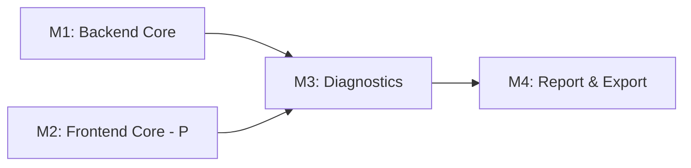

# Tasks: Tuberculosis Laboratory Workflow

**Input**: Design documents from `/specs/053-tb-lab-workflow/`
**Prerequisites**: plan.md, spec.md, data-model.md, research.md **Branch**:
`feat/053-tb-lab-workflow` **Generated**: 2025-12-18

## Format: `[ID] [P?] [Story] Description`

- **[P]**: Can run in parallel (different files, no dependencies)
- **[Story]**: Which user story this task belongs to (e.g., US1, US2, US3)
- Include exact file paths in descriptions

## Milestone Dependency Graph



## User Story to Milestone Mapping

| Milestone | User Stories Covered                           | Pages  |
| --------- | ---------------------------------------------- | ------ |
| M1        | US1 (P0), US2 (P0), US5 backbone               | 1-2, 5 |
| M2 [P]    | US1-2 UI (P0), US3 (P1), US4 (P1), US5 UI (P1) | 2-5    |
| M3        | US6 (P1), US7 (P1), US8 (P1), US9 (P2)         | 6-9    |
| M4        | US10 (P2), US11 (P2), US12 (P3)                | 10-12  |

---

## M1: Backend Core (feat/053-tb-lab-workflow/m1-backend-core)

**Scope**: Database schema, entities, DAOs, services for core TB workflow **User
Stories**: US1 (P0), US2 (P0), US5 (P1 backbone) **Verification**: Unit + ORM
validation + integration tests (>80% coverage) **Depends On**: None

### Branch Setup

- [ ] T001 Create milestone branch
      `git checkout -b feat/053-tb-lab-workflow/m1-backend-core`

### Liquibase Schema (T002-T008)

- [ ] T002 [P] Create Liquibase changeset for `tb_sample_registration` table in
      `src/main/resources/liquibase/3.4.x.x/020-tb-sample-registration.xml`
- [ ] T003 [P] Create Liquibase changeset for `tb_quality_check` table in
      `src/main/resources/liquibase/3.4.x.x/021-tb-quality-check.xml`
- [ ] T004 [P] Create Liquibase changeset for `tb_culture_reading` table with
      week_number constraint in
      `src/main/resources/liquibase/3.4.x.x/022-tb-culture-reading.xml`
- [ ] T005 [P] Create Liquibase changeset for `tb_sample_id` column on
      `sample_item` with yearly sequence in
      `src/main/resources/liquibase/3.4.x.x/023-tb-sample-id-sequence.xml`
- [ ] T006 [P] Create Liquibase changeset for `tb_smear_result` table in
      `src/main/resources/liquibase/3.4.x.x/024-tb-smear-result.xml`
- [ ] T007 [P] Create Liquibase changeset for `tb_identification_result` table
      in `src/main/resources/liquibase/3.4.x.x/025-tb-identification-result.xml`
- [ ] T008 Create Liquibase base.xml include for all TB changesets in
      `src/main/resources/liquibase/3.4.x.x/base.xml`

### Tests First - ORM Validation (T009-T012)

- [ ] T009 [P] [US1] Create ORM validation test for TbSampleRegistration in
      `src/test/java/org/openelisglobal/tb/TbSampleRegistrationOrmTest.java`
- [ ] T010 [P] [US2] Create ORM validation test for TbQualityCheck in
      `src/test/java/org/openelisglobal/tb/TbQualityCheckOrmTest.java`
- [ ] T011 [P] [US5] Create ORM validation test for TbCultureReading in
      `src/test/java/org/openelisglobal/tb/TbCultureReadingOrmTest.java`
- [ ] T012 [P] Create test data builder for TB entities in
      `src/test/java/org/openelisglobal/tb/TbTestDataBuilder.java`

### Valueholders (T013-T016)

- [ ] T013 [P] [US1] Create TbSampleRegistration valueholder with JPA
      annotations in
      `src/main/java/org/openelisglobal/tb/valueholder/TbSampleRegistration.java`
- [ ] T014 [P] [US2] Create TbQualityCheck valueholder with enum fields in
      `src/main/java/org/openelisglobal/tb/valueholder/TbQualityCheck.java`
- [ ] T015 [P] [US5] Create TbCultureReading valueholder with week validation in
      `src/main/java/org/openelisglobal/tb/valueholder/TbCultureReading.java`
- [ ] T016 [P] Create TB enum types (SpecimenType, QcResult, GrowthObservation,
      CultureMethod) in
      `src/main/java/org/openelisglobal/tb/valueholder/TbEnums.java`

### DAOs (T017-T020)

- [ ] T017 [P] [US1] Create TbSampleRegistrationDAO interface and impl in
      `src/main/java/org/openelisglobal/tb/dao/TbSampleRegistrationDAO.java` and
      `TbSampleRegistrationDAOImpl.java`
- [ ] T018 [P] [US2] Create TbQualityCheckDAO interface and impl in
      `src/main/java/org/openelisglobal/tb/dao/TbQualityCheckDAO.java` and
      `TbQualityCheckDAOImpl.java`
- [ ] T019 [P] [US5] Create TbCultureReadingDAO interface and impl with
      week-based queries in
      `src/main/java/org/openelisglobal/tb/dao/TbCultureReadingDAO.java` and
      `TbCultureReadingDAOImpl.java`
- [ ] T020 [P] Create DAO unit tests in
      `src/test/java/org/openelisglobal/tb/dao/`

### Services (T021-T025)

- [ ] T021 [US1] Create TbSampleRegistrationService with TB sample ID generator
      in
      `src/main/java/org/openelisglobal/tb/service/TbSampleRegistrationService.java`
      and `TbSampleRegistrationServiceImpl.java`
- [ ] T022 [P] [US1] Create unit tests for TB sample ID generation (NNN/YY
      format, yearly reset) in
      `src/test/java/org/openelisglobal/tb/service/TbSampleIdGeneratorTest.java`
- [ ] T023 [US2] Create TbQualityCheckService with QC flag propagation in
      `src/main/java/org/openelisglobal/tb/service/TbQualityCheckService.java`
      and `TbQualityCheckServiceImpl.java`
- [ ] T024 [US5] Create TbCultureReadingService with culture status derivation
      in
      `src/main/java/org/openelisglobal/tb/service/TbCultureReadingService.java`
      and `TbCultureReadingServiceImpl.java`
- [ ] T025 [P] Create service unit tests in
      `src/test/java/org/openelisglobal/tb/service/`

### REST Controllers (T026-T029)

- [ ] T026 [US1] Create TbRegistrationController with POST/GET endpoints in
      `src/main/java/org/openelisglobal/tb/controller/rest/TbRegistrationController.java`
- [ ] T027 [US2] Create TbQualityCheckController with QC CRUD in
      `src/main/java/org/openelisglobal/tb/controller/rest/TbQualityCheckController.java`
- [ ] T028 [US5] Create TbCultureController with weekly reading endpoints in
      `src/main/java/org/openelisglobal/tb/controller/rest/TbCultureController.java`
- [ ] T029 [P] Create integration tests for REST endpoints in
      `src/test/java/org/openelisglobal/tb/controller/`

### PR Creation

- [ ] T030 Run `mvn spotless:apply` and verify all tests pass with
      `mvn clean install`
- [ ] T031 Create PR for M1 backend core targeting `feat/053-tb-lab-workflow`
      branch

**Checkpoint M1**: All backend entities, DAOs, services operational. Unit
tests >80% coverage.

---

## M2: Frontend Core [P] (feat/053-tb-lab-workflow/m2-frontend-core)

**Scope**: Carbon UI pages for QC, Storage, Processing, Culture tracking **User
Stories**: US2 UI (P0), US3 (P1), US4 (P1), US5 UI (P1) **Verification**:
Jest/RTL tests, accessibility checks **Depends On**: None (parallel with M1)

### Branch Setup

- [ ] T032 Create milestone branch
      `git checkout -b feat/053-tb-lab-workflow/m2-frontend-core`

### i18n Keys (T033-T034)

- [ ] T033 [P] Add TB workflow i18n keys to `frontend/src/languages/en.json`
      (QC, Storage, Processing, Culture sections)
- [ ] T034 [P] Add TB workflow i18n keys to `frontend/src/languages/fr.json`

### Tests First - Jest/RTL (T035-T038)

- [ ] T035 [P] [US2] Create Jest test for TBQualityCheckPage in
      `frontend/src/components/notebook/pages/tb/TBQualityCheckPage.test.js`
- [ ] T036 [P] [US3] Create Jest test for TBStorageAssignmentPage in
      `frontend/src/components/notebook/pages/tb/TBStorageAssignmentPage.test.js`
- [ ] T037 [P] [US4] Create Jest test for TBInitialProcessingPage in
      `frontend/src/components/notebook/pages/tb/TBInitialProcessingPage.test.js`
- [ ] T038 [P] [US5] Create Jest test for TBCultureTrackingPage in
      `frontend/src/components/notebook/pages/tb/TBCultureTrackingPage.test.js`

### Page Components (T039-T043)

- [ ] T039 [US2] Create TBQualityCheckPage with QC checklist and rejection
      handling in
      `frontend/src/components/notebook/pages/tb/TBQualityCheckPage.js`
- [ ] T040 [US3] Create TBStorageAssignmentPage with routing panel (duplicate
      from MNTD pattern) in
      `frontend/src/components/notebook/pages/tb/TBStorageAssignmentPage.js`
- [ ] T041 [US4] Create TBInitialProcessingPage with media selection
      (LJ/MGIT/Both) in
      `frontend/src/components/notebook/pages/tb/TBInitialProcessingPage.js`
- [ ] T042 [US5] Create TBCultureTrackingPage with 8-week reading grid in
      `frontend/src/components/notebook/pages/tb/TBCultureTrackingPage.js`
- [ ] T043 Update index.js exports in
      `frontend/src/components/notebook/pages/tb/index.js`

### Workflow Tab Update (T044-T046)

- [ ] T044 Update TBWorkflowTab.js to import and render new pages (2-5) in
      `frontend/src/components/notebook/workflow/TBWorkflowTab.js`
- [ ] T045 Update DEFAULT_TB_WORKFLOW_PAGES to include all 12 pages in
      `frontend/src/components/notebook/workflow/TBWorkflowTab.js`
- [ ] T046 [US3] Add label generation hook to TBStorageAssignmentPage using
      existing LabelMakerServlet

### PR Creation

- [ ] T047 Run `npm run format` and verify Jest tests pass with `npm test`
- [ ] T048 Create PR for M2 frontend core targeting `feat/053-tb-lab-workflow`
      branch

**Checkpoint M2**: Pages 2-5 render with Carbon components, forms submit, i18n
works.

---

## M3: Diagnostics (feat/053-tb-lab-workflow/m3-diagnostics)

**Scope**: Smear, Identification, GeneXpert, DST backend + frontend **User
Stories**: US6 (P1), US7 (P1), US8 (P1), US9 (P2) **Verification**:
Unit/integration tests, Jest forms, MDR alert logic **Depends On**: M1, M2

### Branch Setup

- [ ] T049 Create milestone branch
      `git checkout -b feat/053-tb-lab-workflow/m3-diagnostics` from merged
      M1+M2

### Backend - Liquibase (T050-T052)

- [ ] T050 [P] Create Liquibase changeset for `tb_genexpert_result` table in
      `src/main/resources/liquibase/3.4.x.x/026-tb-genexpert-result.xml`
- [ ] T051 [P] Create Liquibase changeset for `tb_dst_result` table with JSONB
      second-line in
      `src/main/resources/liquibase/3.4.x.x/027-tb-dst-result.xml`
- [ ] T052 Update base.xml to include new changesets

### Backend - Tests First (T053-T056)

- [ ] T053 [P] [US6] Create ORM validation test for TbSmearResult in
      `src/test/java/org/openelisglobal/tb/TbSmearResultOrmTest.java`
- [ ] T054 [P] [US7] Create ORM validation test for TbIdentificationResult in
      `src/test/java/org/openelisglobal/tb/TbIdentificationResultOrmTest.java`
- [ ] T055 [P] [US8] Create ORM validation test for TbGeneXpertResult in
      `src/test/java/org/openelisglobal/tb/TbGeneXpertResultOrmTest.java`
- [ ] T056 [P] [US9] Create ORM validation test for TbDstResult in
      `src/test/java/org/openelisglobal/tb/TbDstResultOrmTest.java`

### Backend - Valueholders (T057-T060)

- [ ] T057 [P] [US6] Create TbSmearResult valueholder in
      `src/main/java/org/openelisglobal/tb/valueholder/TbSmearResult.java`
- [ ] T058 [P] [US7] Create TbIdentificationResult valueholder in
      `src/main/java/org/openelisglobal/tb/valueholder/TbIdentificationResult.java`
- [ ] T059 [P] [US8] Create TbGeneXpertResult valueholder in
      `src/main/java/org/openelisglobal/tb/valueholder/TbGeneXpertResult.java`
- [ ] T060 [P] [US9] Create TbDstResult valueholder with mdr_flag computation in
      `src/main/java/org/openelisglobal/tb/valueholder/TbDstResult.java`

### Backend - DAOs & Services (T061-T066)

- [ ] T061 [P] [US6] Create TbSmearResultDAO and service in
      `src/main/java/org/openelisglobal/tb/dao/` and `service/`
- [ ] T062 [P] [US7] Create TbIdentificationResultDAO and service in
      `src/main/java/org/openelisglobal/tb/dao/` and `service/`
- [ ] T063 [P] [US8] Create TbGeneXpertResultDAO and service in
      `src/main/java/org/openelisglobal/tb/dao/` and `service/`
- [ ] T064 [US9] Create TbDstResultDAO and service with MDR flag logic in
      `src/main/java/org/openelisglobal/tb/dao/` and `service/`
- [ ] T065 [US9] Create MDR-TB alert service that fires on INH-R + RMP-R save in
      `src/main/java/org/openelisglobal/tb/service/TbMdrAlertService.java`
- [ ] T066 [P] Create unit tests for MDR flag computation in
      `src/test/java/org/openelisglobal/tb/service/TbDstResultServiceTest.java`

### Backend - Controllers (T067-T070)

- [ ] T067 [P] [US6] Create TbSmearController in
      `src/main/java/org/openelisglobal/tb/controller/rest/TbSmearController.java`
- [ ] T068 [P] [US7] Create TbIdentificationController in
      `src/main/java/org/openelisglobal/tb/controller/rest/TbIdentificationController.java`
- [ ] T069 [P] [US8] Create TbGeneXpertController in
      `src/main/java/org/openelisglobal/tb/controller/rest/TbGeneXpertController.java`
- [ ] T070 [US9] Create TbDstController with MDR alert response in
      `src/main/java/org/openelisglobal/tb/controller/rest/TbDstController.java`

### Frontend - Tests First (T071-T074)

- [ ] T071 [P] [US6] Create Jest test for TBSmearPage in
      `frontend/src/components/notebook/pages/tb/TBSmearPage.test.js`
- [ ] T072 [P] [US7] Create Jest test for TBIdentificationPage in
      `frontend/src/components/notebook/pages/tb/TBIdentificationPage.test.js`
- [ ] T073 [P] [US8] Create Jest test for TBGeneXpertPage in
      `frontend/src/components/notebook/pages/tb/TBGeneXpertPage.test.js`
- [ ] T074 [P] [US9] Create Jest test for TBDSTPage in
      `frontend/src/components/notebook/pages/tb/TBDSTPage.test.js`

### Frontend - Page Components (T075-T080)

- [ ] T075 [US6] Create TBSmearPage with method/AFB result selection in
      `frontend/src/components/notebook/pages/tb/TBSmearPage.js`
- [ ] T076 [US7] Create TBIdentificationPage with MTB/NTM selection in
      `frontend/src/components/notebook/pages/tb/TBIdentificationPage.js`
- [ ] T077 [US8] Create TBGeneXpertPage with resistance status in
      `frontend/src/components/notebook/pages/tb/TBGeneXpertPage.js`
- [ ] T078 [US9] Create TBDSTPage with 1st/2nd line drug panels in
      `frontend/src/components/notebook/pages/tb/TBDSTPage.js`
- [ ] T079 Add QC failure warning banner to all diagnostic pages (propagate from
      QC status)
- [ ] T080 Update TBWorkflowTab.js to render pages 6-9 and add i18n keys

### PR Creation

- [ ] T081 Run formatting and verify all tests pass
- [ ] T082 Create PR for M3 diagnostics targeting `feat/053-tb-lab-workflow`
      branch

**Checkpoint M3**: All diagnostic pages functional. MDR alert fires correctly.
QC warnings display.

---

## M4: Report & Export (feat/053-tb-lab-workflow/m4-report-export)

**Scope**: Isolate storage, result compilation, REDCap export **User Stories**:
US10 (P2), US11 (P2), US12 (P3) **Verification**: Cypress E2E, CSV validation,
performance checks **Depends On**: M3

### Branch Setup

- [ ] T083 Create milestone branch
      `git checkout -b feat/053-tb-lab-workflow/m4-report-export` from merged M3

### Backend - Liquibase (T084-T085)

- [ ] T084 Create Liquibase changeset for `tb_isolate_storage` table in
      `src/main/resources/liquibase/3.4.x.x/028-tb-isolate-storage.xml`
- [ ] T085 Update base.xml to include new changeset

### Backend - Tests First (T086-T088)

- [ ] T086 [P] [US10] Create ORM validation test for TbIsolateStorage in
      `src/test/java/org/openelisglobal/tb/TbIsolateStorageOrmTest.java`
- [ ] T087 [P] [US11] Create integration test for result compilation in
      `src/test/java/org/openelisglobal/tb/service/TbResultCompilationServiceTest.java`
- [ ] T088 [P] [US12] Create integration test for REDCap export format in
      `src/test/java/org/openelisglobal/tb/service/TbRedcapExportServiceTest.java`

### Backend - Entities & Services (T089-T094)

- [ ] T089 [US10] Create TbIsolateStorage valueholder in
      `src/main/java/org/openelisglobal/tb/valueholder/TbIsolateStorage.java`
- [ ] T090 [US10] Create TbIsolateStorageDAO and service in
      `src/main/java/org/openelisglobal/tb/dao/` and `service/`
- [ ] T091 [US11] Create TbResultCompilationService aggregating all results in
      `src/main/java/org/openelisglobal/tb/service/TbResultCompilationService.java`
- [ ] T092 [US12] Create TbRedcapExportService with CSV/Excel generation in
      `src/main/java/org/openelisglobal/tb/service/TbRedcapExportService.java`
- [ ] T093 [US12] Add `exported_to_redcap_at` timestamp tracking to result
      entities
- [ ] T094 [P] Create controllers for storage, compilation, export in
      `src/main/java/org/openelisglobal/tb/controller/rest/`

### Frontend - Tests First (T095-T097)

- [ ] T095 [P] [US10] Create Jest test for TBIsolateStoragePage in
      `frontend/src/components/notebook/pages/tb/TBIsolateStoragePage.test.js`
- [ ] T096 [P] [US11] Create Jest test for TBResultCompilationPage in
      `frontend/src/components/notebook/pages/tb/TBResultCompilationPage.test.js`
- [ ] T097 [P] [US12] Create Jest test for TBDataExportPage in
      `frontend/src/components/notebook/pages/tb/TBDataExportPage.test.js`

### Frontend - Page Components (T098-T102)

- [ ] T098 [US10] Create TBIsolateStoragePage with hierarchical selector in
      `frontend/src/components/notebook/pages/tb/TBIsolateStoragePage.js`
- [ ] T099 [US11] Create TBResultCompilationPage with all results summary in
      `frontend/src/components/notebook/pages/tb/TBResultCompilationPage.js`
- [ ] T100 [US12] Create TBDataExportPage with export controls in
      `frontend/src/components/notebook/pages/tb/TBDataExportPage.js`
- [ ] T101 Update TBWorkflowTab.js to render pages 10-12
- [ ] T102 Update index.js with all page exports

### E2E Tests (T103-T106)

- [ ] T103 [US1] Create Cypress E2E test for sample registration flow in
      `frontend/cypress/e2e/tb-workflow-registration.cy.js`
- [ ] T104 [US5] Create Cypress E2E test for culture tracking flow in
      `frontend/cypress/e2e/tb-workflow-culture.cy.js`
- [ ] T105 [US11] Create Cypress E2E test for result compilation in
      `frontend/cypress/e2e/tb-workflow-reporting.cy.js`
- [ ] T106 [US12] Create Cypress E2E test for REDCap export in
      `frontend/cypress/e2e/tb-workflow-export.cy.js`

### Performance Validation (T107-T108)

- [ ] T107 Verify culture grid renders <100ms for 50 samples with 8-week
      readings
- [ ] T108 Verify REDCap export completes <30s for 500 samples

### PR Creation

- [ ] T109 Run formatting and verify all tests pass (unit, integration, E2E)
- [ ] T110 Create PR for M4 report & export targeting `feat/053-tb-lab-workflow`
      branch

**Checkpoint M4**: Full workflow functional. E2E tests pass. Performance
validated.

---

## Final: Integration & Polish (feat/053-tb-lab-workflow)

### Merge & Integration

- [ ] T111 Merge M1 + M2 + M3 + M4 into `feat/053-tb-lab-workflow`
- [ ] T112 Run full test suite and E2E validation
- [ ] T113 Verify all 12 pages render correctly in TBWorkflowTab

### Documentation

- [ ] T114 Update quickstart.md with TB workflow usage examples
- [ ] T115 Verify spec.md acceptance scenarios are covered by tests

### Final PR

- [ ] T116 Create final PR from `feat/053-tb-lab-workflow` to `develop`

---

## Dependencies & Execution Order

### Milestone Dependencies

```text
M1 (Backend Core)  ─────────────────────┐
                                        ├──> M3 (Diagnostics) ──> M4 (Report & Export) ──> Final
M2 (Frontend Core) [P] ─────────────────┘
```

### Parallel Opportunities

**M1 + M2 can run simultaneously** (different tech stacks, no file conflicts)

**Within M1**:

- T002-T007 Liquibase changesets (parallel)
- T009-T012 ORM tests (parallel)
- T013-T016 Valueholders (parallel)
- T017-T020 DAOs (parallel)

**Within M2**:

- T033-T034 i18n keys (parallel)
- T035-T038 Jest tests (parallel)
- T039-T042 Page components (parallel)

**Within M3**:

- T050-T051 Liquibase changesets (parallel)
- T053-T056 ORM tests (parallel)
- T057-T060 Valueholders (parallel)
- T067-T070 Controllers (parallel - except T070)
- T071-T074 Jest tests (parallel)
- T075-T078 Page components (parallel)

**Within M4**:

- T086-T088 Tests (parallel)
- T095-T097 Jest tests (parallel)
- T103-T106 E2E tests (parallel)

---

## Implementation Strategy

### MVP First (M1 + M2 Only)

1. Complete M1: Backend Core - registration, QC, culture entities
2. Complete M2: Frontend Core - pages 2-5 functional
3. **STOP and VALIDATE**: Test sample registration through culture tracking
4. Deploy/demo TB workflow foundation

### Incremental Delivery

1. M1 + M2 (parallel) → Foundation ready → Demo registration + QC + culture
2. M3 → Add diagnostics (Smear, ID, GeneXpert, DST) → Demo full testing
3. M4 → Add storage, reporting, export → Full workflow complete
4. Final → Merge to develop → Production ready

### Task Counts

| Milestone | Task Count | User Stories   |
| --------- | ---------- | -------------- |
| M1        | 31         | US1, US2, US5  |
| M2        | 17         | US2-5 UI       |
| M3        | 34         | US6-9          |
| M4        | 28         | US10-12        |
| Final     | 6          | Integration    |
| **Total** | **116**    | **12 stories** |

---

## Notes

- [P] tasks = different files, no dependencies
- [Story] label maps task to specific user story for traceability
- All TB pages use Carbon Design System exclusively
- All user-facing text uses React Intl (no hardcoded strings)
- Backend follows 5-layer pattern: Valueholder→DAO→Service→Controller→Form
- @Transactional only in services (NOT controllers)
- Run `mvn spotless:apply` and `npm run format` before commits
