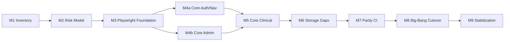

# Implementation Plan: E2E Test Battery Revamp to Playwright with Risk-Based Parity

**Branch**: `201-e2e-playwright-risk-parity` | **Date**: 2026-02-14 | **Spec**:
[spec.md](spec.md)  
**Input**: Feature specification from
`/specs/201-e2e-playwright-risk-parity/spec.md`

## Summary

Migrate E2E testing to Playwright as the **primary** framework using
**risk-based parity** with legacy Cypress while preserving full Cypress
execution for comparison. Implementation will proceed through **bite-size,
testable milestones** that each deliver reviewable artifacts, passing checks,
and clear go/no-go criteria.

This plan explicitly includes:

1. Evidence-first inventory and parity mapping
2. Critical gap closure (not just parity by count)
3. Big-bang primary-framework cutover
4. Ongoing full Cypress execution (no decommission in this feature)

## Milestone Sizing Policy (Bite-Size Rule)

To keep delivery testable and reviewable:

- **Each milestone = one PR-sized unit**
- **Target duration**: 1-2 working days per milestone
- **Max scenario scope** per milestone: one domain slice (or ~5-15 scenarios)
- **Hard gate**: each milestone must include explicit verification commands and
  pass criteria

## Technical Context

**Language/Version**: TypeScript/JavaScript (Node 20+)  
**Primary Dependencies**: `@playwright/test`, existing Cypress stack, GitHub
Actions workflows  
**Storage**: PostgreSQL-backed app test data via existing fixture loaders  
**Testing**: Playwright (target primary E2E), Cypress (legacy comparison
suite)  
**Target Platform**: GitHub Actions + local Docker-based OpenELIS environment  
**Project Type**: Web application (React frontend + Java backend)  
**Performance Goals**: Keep CI E2E wall-clock reasonable while running dual
suites; maintain deterministic results in critical paths  
**Constraints**: No Cypress removal in this feature; maintain dual-run
comparability; preserve constitutional E2E workflow  
**Scale/Scope**: Full Cypress inventory, P0/P1 parity and critical gap closure,
CI cutover with side-by-side execution

## Constitution Check

_GATE: Must pass before implementation. Re-check after milestone planning._

Verify compliance with
[OpenELIS Global Constitution](../../.specify/memory/constitution.md):

- [x] **Configuration-Driven**: No country-specific branching introduced
- [x] **Carbon Design System**: N/A for framework migration; no non-Carbon UI
      framework added
- [x] **FHIR/IHE Compliance**: N/A (no interoperability model changes)
- [x] **Layered Architecture**: Backend architecture unchanged
- [x] **Test Coverage**: E2E strategy includes migration + gap closure +
      dual-run validation
- [x] **Schema Management**: No schema changes required for planning scope
- [x] **Internationalization**: No new UI strings planned in this migration plan
- [x] **Security & Compliance**: Existing RBAC/audit behavior remains exercised
      by E2E suites

**Section V.5 Compliance Notes**:

- Development execution in small slices is allowed and required
- Full-suite pre-push validation remains mandatory and must run both frameworks:
  - `cd frontend && npm run pw:test`
  - `cd frontend && npm run cy:failfast`
- Playwright is preferred for new development; Cypress remains valid legacy
  suite

## Milestone Plan

_GATE: Feature spans >3 days; milestone breakdown required._

### Milestone Table

| ID      | Branch Suffix    | Scope (Bite-Size)                                             | User Stories  | Verification Gate                                                | Depends On |
| ------- | ---------------- | ------------------------------------------------------------- | ------------- | ---------------------------------------------------------------- | ---------- |
| M1      | m1-inventory     | Authoritative inventory artifacts from current Cypress/PW     | US1           | Inventory files generated; 100% active specs accounted for       | -          |
| M2      | m2-risk-model    | Risk rubric + scenario tiering (P0/P1/P2) + parity map shell  | US1, US2      | All P0/P1 legacy scenarios mapped to parity records              | M1         |
| M3      | m3-pw-foundation | Stabilize Playwright harness/fixtures/reporting for migration | US2           | Existing PW suite green locally/CI; reusable fixtures in place   | M2         |
| [P] M4a | m4a-core-authnav | Migrate P0 auth/nav core scenarios to Playwright              | US2, US3      | New PW tests pass + linked parity entries for migrated scenarios | M3         |
| [P] M4b | m4b-core-admin   | Migrate P0 admin-critical scenarios to Playwright             | US2, US3      | New PW tests pass + linked parity entries for migrated scenarios | M3         |
| M5      | m5-core-clinical | Migrate P0 patient/order/result/report scenarios              | US2, US3      | P0 clinical scenarios passing in PW with parity evidence         | M4a, M4b   |
| M6      | m6-storage-gaps  | Close critical storage/skip gaps in Playwright                | US3           | Previously critical skipped/partial legacy cases covered in PW   | M5         |
| M7      | m7-parity-ci     | Dual-run Parity Report pipeline (PW + full Cypress)           | US2, US4, US5 | CI emits classified parity report + runtime metrics              | M6         |
| M8      | m8-bigbang       | Big-bang cutover: Playwright primary gate, Cypress comparison | US4, US5      | Playwright primary check active; full Cypress still runs         | M7         |
| M9      | m9-stabilization | Stabilization window + unresolved divergence triage packet    | US4, US5      | No untriaged P0/P1 divergences during agreed window              | M8         |

### Milestone Dependency Graph



### PR Strategy

- **Spec PR**: `spec/201-e2e-playwright-risk-parity` (spec artifacts only)
- **Milestone PR pattern**: `feat/201-e2e-playwright-risk-parity-m{N}-{suffix}`
- One milestone per PR unless explicitly marked parallel (`M4a`, `M4b`)

## Milestone Verification Detail

### M1 - Inventory (US1)

**Deliverables**

- Coverage inventory artifact(s): by spec, domain, scenario count, skip status
- CI mapping artifact(s): which workflow shard/job executes which specs

**Testable Gate**

- Validation script/check confirms every active Cypress spec appears once in
  inventory
- Spot-check confirms Playwright specs represented and labeled

### M2 - Risk Model + Parity Skeleton (US1, US2)

**Deliverables**

- Risk rubric (P0/P1/P2 definitions)
- Scenario-level parity map skeleton (legacy->Playwright mapping records)

**Testable Gate**

- 100% of P0/P1 legacy scenarios have parity map entries (status may be
  gap/blocked)

### M3 - Playwright Foundation (US2)

**Deliverables**

- Reusable auth/session fixture strategy
- Common page objects/fixtures conventions
- Reporting conventions for parity evidence

**Testable Gate**

- Existing Playwright suite passes locally and in CI
- New foundation does not regress current suite

### M4a/M4b - P0 Migration Waves (US2, US3)

**Deliverables**

- New Playwright tests for P0 auth/nav and P0 admin-critical flows
- Parity map updates for each migrated scenario

**Testable Gate**

- New tests pass in isolation and CI
- Parity entries for migrated scenarios move from gap->pass

### M5 - P0 Clinical Migration (US2, US3)

**Deliverables**

- Playwright coverage for patient/order/result/report critical journeys

**Testable Gate**

- P0 clinical scenarios pass with robust user-visible assertions
- No unresolved blocking gaps in P0 set

### M6 - Critical Storage Gap Closure (US3)

**Deliverables**

- Playwright tests covering critical storage scenarios currently skipped/partial

**Testable Gate**

- Critical storage gap list reduced to zero open P0/P1 entries (or approved
  exception records)

### M7 - Dual-Run Parity CI (US2, US4, US5)

**Deliverables**

- CI Parity Report output (Playwright + full Cypress normalized results)
- Divergence report with risk labels, scenario links, and failure classification
- Per-run runtime metrics for both suites versus runtime budget

**Testable Gate**

- CI emits Parity Report artifact on every run
- Every divergence includes `failure_class` (setup/infra, assertion, parity)
- Runtime metrics are captured and compared to the agreed runtime budget

### M8 - Big-Bang Cutover (US4, US5)

**Deliverables**

- Playwright configured as primary E2E gate
- Cypress full suite still configured and executed for comparison

**Testable Gate**

- Branch protection/check naming reflects Playwright primary
- Cypress jobs remain green/visible and non-removed
- Required check policy is verified via `gh` output and recorded in signoff docs

### M9 - Stabilization + Decision Packet (US4, US5)

**Deliverables**

- Time-boxed stabilization report
- Final parity and divergence status summary
- Explicit statement: Cypress retained; no retirement scope in this feature

**Testable Gate**

- No untriaged P0/P1 divergence at stabilization end
- Previously flaky migrated scenarios meet the reliability SLO (>=95% pass rate
  across 20 CI-equivalent runs)
- Dual-run execution remains within runtime budget for >=90% of stabilization
  runs
- Signoff report accepted by stakeholders

## Project Structure

### Documentation (this feature)

```text
specs/201-e2e-playwright-risk-parity/
├── spec.md
├── plan.md
├── research.md          # optional deep-dive artifacts
├── data-model.md        # parity entities/risk model (logical, not DB schema)
├── quickstart.md        # dual-run local/CI execution guidance
└── tasks.md             # generated next via /speckit.tasks
```

### Expected Source Touchpoints

```text
frontend/
├── playwright/
│   ├── tests/           # migrated scenarios
│   └── fixtures/        # shared fixtures/page objects
├── cypress/
│   └── e2e/             # retained for comparison in this feature
├── playwright.config.ts
└── package.json

.github/workflows/
├── playwright-e2e.yml
└── frontend-qa.yml
```

**Structure Decision**: Keep both frameworks active; progressively migrate
scenario ownership to Playwright while preserving Cypress execution and assets.

## Testing Strategy

**Reference**:
[OpenELIS Testing Roadmap](../../.specify/guides/testing-roadmap.md)

### Coverage Goals

- **Parity Coverage**: 100% mapped P0/P1 legacy scenarios
- **Critical Gap Closure**: 100% baseline critical gaps resolved or exceptioned
- **Dual-Run Visibility**: 100% PR runs produce comparable E2E status artifacts
- **Reliability SLO**: Migrated baseline-flaky scenarios achieve >=95% pass rate
  over 20 CI-equivalent runs
- **Runtime Budget**: Dual-run wall-clock remains within agreed budget for >=90%
  of stabilization runs

### Test Types

- [x] **Playwright E2E**: Primary migration target for new/ported scenarios
- [x] **Cypress E2E**: Legacy comparison suite remains active
- [x] **CI Parity Report Validation**: Cross-framework divergence reporting

### Test Data Management

- Reuse existing fixture loaders and environment setup scripts
- Prefer deterministic API/fixture-backed setup for migration scenarios
- Maintain real E2E semantics for tests labeled as E2E

### Mandatory Pre-Push Validation (Constitution V.5)

- Execute Playwright full suite: `cd frontend && npm run pw:test`
- Execute Cypress full comparison suite: `cd frontend && npm run cy:failfast`
- Capture and attach parity artifacts before merge/cutover decisions

### Checkpoint Validations

- [x] **M1**: inventory completeness verified
- [x] **M2**: P0/P1 parity map completeness verified
- [ ] **M3-M6**: scenario-level runtime gates pass (currently blocked in this
      cloud environment: `https://localhost` unavailable for Playwright/Cypress
      execution)
- [ ] **M7**: dual-run parity report artifact generated in CI (pending
      implementation)
- [ ] **M8-M9**: big-bang cutover + stabilization gates satisfied (pending M7
      through M9 completion)

## Risks & Mitigations

| Risk                                       | Impact | Mitigation                                                                 |
| ------------------------------------------ | ------ | -------------------------------------------------------------------------- |
| False parity from weak legacy assertions   | High   | Require assertion-strength review in parity mapping (not only pass/fail)   |
| CI runtime increase during dual-run window | Medium | Maintain shard strategy and fail-fast where appropriate                    |
| Divergence noise obscures true regressions | High   | Risk-tiered reporting with owner assignment and triage SLA                 |
| Migration stalls on large monolithic specs | Medium | Bite-size milestone slicing + P0-first decomposition before long-tail work |

## Next Steps

1. Use `/speckit.tasks` to generate milestone-ordered implementation tasks
2. Start with M1 inventory artifact generation
3. Enforce milestone gate checks before entering each subsequent milestone
