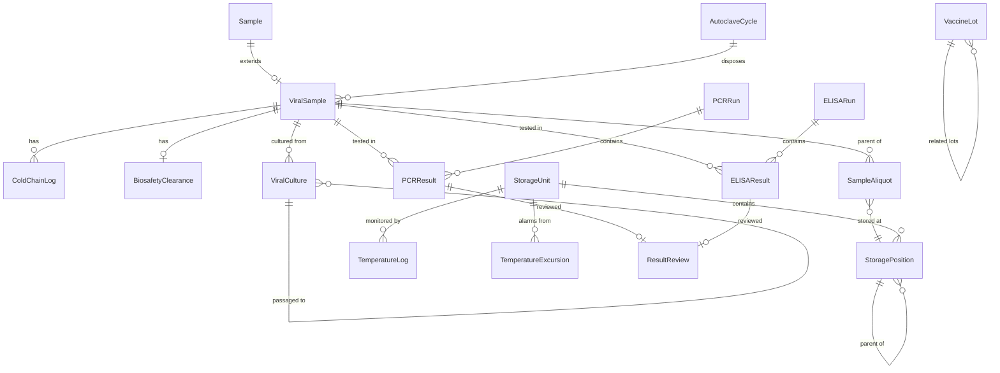

# Data Model: Viral and Vaccine Laboratory Workflow

**Feature**: `282-viral-vaccine-workflow`  
**Date**: 2025-12-14  
**Status**: Complete

## Entity Relationship Overview



## Core Entities

### 1. ViralSample

Extends base `Sample` entity with viral/vaccine-specific attributes.

**Table**: `viral_sample`

| Column                  | Type         | Constraints      | Description                                  |
| ----------------------- | ------------ | ---------------- | -------------------------------------------- |
| id                      | VARCHAR(36)  | PK, UUID         | Unique identifier                            |
| sample_id               | VARCHAR(36)  | FK → sample.id   | Reference to core Sample entity              |
| specimen_type           | VARCHAR(50)  | NOT NULL         | NP_SWAB/SERUM/VIRAL_CULTURE/VACCINE_VIAL/CSF |
| biosafety_level         | VARCHAR(10)  | NOT NULL         | BSL-1/BSL-2/BSL-3/BSL-4                      |
| cold_chain_status       | VARCHAR(20)  | NOT NULL         | COMPLIANT/EXCURSION/BREAK                    |
| collection_site         | VARCHAR(100) |                  | Field site name                              |
| collector_id            | VARCHAR(36)  | FK → sys_user.id | Collector user ID                            |
| study_protocol_number   | VARCHAR(50)  |                  | Research protocol reference                  |
| consent_status          | VARCHAR(20)  |                  | OBTAINED/PENDING/DECLINED                    |
| fhir_uuid               | UUID         | UNIQUE           | For FHIR synchronization                     |
| sys_user_id             | VARCHAR(36)  | FK → sys_user.id | Created by user                              |
| lastupdated             | TIMESTAMP    | NOT NULL         | Last modified timestamp                      |

**Validations**:
- `specimen_type` must be in allowed enum
- `biosafety_level` must be BSL-1 through BSL-4
- `cold_chain_status` defaults to COMPLIANT

**Relationships**:
- Many-to-One with `Sample` (core entity)
- One-to-Many with `ColdChainLog`
- One-to-One with `BiosafetyClearance`
- One-to-Many with `SampleAliquot` (as parent)
- One-to-Many with `PCRResult`, `ELISAResult`, `ViralCulture`

---

### 2. ColdChainLog

Records temperature conditions during transport and storage.

**Table**: `cold_chain_log`

| Column            | Type        | Constraints         | Description                         |
| ----------------- | ----------- | ------------------- | ----------------------------------- |
| id                | VARCHAR(36) | PK, UUID            | Unique identifier                   |
| viral_sample_id   | VARCHAR(36) | FK → viral_sample.id | Reference to viral sample           |
| event_type        | VARCHAR(20) | NOT NULL            | DISPATCH/ARRIVAL/STORAGE            |
| temperature       | DECIMAL(5,2)| NOT NULL            | Temperature in Celsius              |
| event_timestamp   | TIMESTAMP   | NOT NULL            | When temperature recorded           |
| transport_method  | VARCHAR(50) |                     | DRY_ICE/REFRIGERATED/AMBIENT        |
| excursion_flag    | BOOLEAN     | DEFAULT FALSE       | True if temp out of range           |
| excursion_duration| INTEGER     |                     | Minutes out of range                |
| corrective_action | TEXT        |                     | Action taken if excursion           |
| recorded_by       | VARCHAR(36) | FK → sys_user.id    | User who recorded                   |
| lastupdated       | TIMESTAMP   | NOT NULL            | Last modified timestamp             |

**Validations**:
- `event_type` must be in allowed enum
- `temperature` must be between -200°C and 50°C
- `excursion_duration` must be non-negative if provided

**Indexes**:
- `idx_coldchain_sample` on `(viral_sample_id, event_timestamp)`

---

### 3. BiosafetyClearance

Documents biosafety level assignment and PPE requirements.

**Table**: `biosafety_clearance`

| Column                   | Type        | Constraints         | Description                      |
| ------------------------ | ----------- | ------------------- | -------------------------------- |
| id                       | VARCHAR(36) | PK, UUID            | Unique identifier                |
| viral_sample_id          | VARCHAR(36) | FK → viral_sample.id, UNIQUE | Reference to viral sample        |
| biosafety_level          | VARCHAR(10) | NOT NULL            | BSL-1/BSL-2/BSL-3/BSL-4          |
| required_ppe             | TEXT        |                     | JSON array of PPE items          |
| checklist_complete       | BOOLEAN     | DEFAULT FALSE       | True if all items checked        |
| checklist_items          | TEXT        |                     | JSON array of checklist items    |
| approved_by              | VARCHAR(36) | FK → sys_user.id    | Biosafety officer approval       |
| approval_date            | TIMESTAMP   |                     | When approved                    |
| incident_log             | TEXT        |                     | Any spills/exposures documented  |
| sys_user_id              | VARCHAR(36) | FK → sys_user.id    | Created by user                  |
| lastupdated              | TIMESTAMP   | NOT NULL            | Last modified timestamp          |

**Validations**:
- One clearance per sample (enforced by UNIQUE constraint on viral_sample_id)
- Cannot approve if `checklist_complete` is FALSE

**Example JSON**:
```json
{
  "required_ppe": ["N95 respirator", "Double gloves", "Gown", "Face shield"],
  "checklist_items": [
    {"item": "Appropriate PPE worn", "checked": true},
    {"item": "BSL-3 hood operational", "checked": true},
    {"item": "Spill kit available", "checked": true}
  ]
}
```

---

### 4. SampleAliquot

Parent-child relationships for sample aliquoting.

**Table**: `sample_aliquot`

| Column              | Type        | Constraints           | Description                    |
| ------------------- | ----------- | --------------------- | ------------------------------ |
| id                  | VARCHAR(36) | PK, UUID              | Unique identifier              |
| parent_sample_id    | VARCHAR(36) | FK → viral_sample.id  | Parent sample                  |
| aliquot_id          | VARCHAR(50) | UNIQUE, NOT NULL      | Child aliquot ID (PARENT-A1)   |
| volume_ml           | DECIMAL(10,4)| NOT NULL             | Aliquot volume                 |
| aliquot_purpose     | VARCHAR(30) | NOT NULL              | TESTING/BACKUP/BIOBANK/SHIPMENT|
| aliquot_status      | VARCHAR(20) | NOT NULL              | AVAILABLE/USED/DISCARDED       |
| storage_position_id | VARCHAR(36) | FK → storage_position.id | Where stored                   |
| creation_date       | TIMESTAMP   | NOT NULL              | When aliquoted                 |
| created_by          | VARCHAR(36) | FK → sys_user.id      | Technician who created         |
| used_date           | TIMESTAMP   |                       | When consumed for testing      |
| lastupdated         | TIMESTAMP   | NOT NULL              | Last modified timestamp        |

**Validations**:
- `volume_ml` must be positive
- `aliquot_status` defaults to AVAILABLE
- Cannot use aliquot if `aliquot_status` is USED or DISCARDED

**Indexes**:
- `idx_aliquot_parent` on `(parent_sample_id)`
- `idx_aliquot_status` on `(aliquot_status, storage_position_id)`

---

### 5. PCRRun

PCR batch execution.

**Table**: `pcr_run`

| Column          | Type        | Constraints      | Description                     |
| --------------- | ----------- | ---------------- | ------------------------------- |
| id              | VARCHAR(36) | PK, UUID         | Unique identifier               |
| run_id          | VARCHAR(50) | UNIQUE, NOT NULL | Human-readable run ID           |
| run_date        | TIMESTAMP   | NOT NULL         | When run performed              |
| instrument_id   | VARCHAR(50) | NOT NULL         | PCR machine identifier          |
| assay_type      | VARCHAR(50) | NOT NULL         | COVID19/INFLUENZA_AB/DENGUE/HIV_VL |
| kit_lot_number  | VARCHAR(30) | NOT NULL         | Reagent kit lot                 |
| technician_id   | VARCHAR(36) | FK → sys_user.id | Technician who ran              |
| control_status  | VARCHAR(20) |                  | PASS/FAIL/PENDING               |
| notes           | TEXT        |                  | Run comments                    |
| sys_user_id     | VARCHAR(36) | FK → sys_user.id | Created by user                 |
| lastupdated     | TIMESTAMP   | NOT NULL         | Last modified timestamp         |

**Validations**:
- `assay_type` must be in allowed enum
- `run_date` cannot be in future

---

### 6. PCRResult

Individual PCR sample results with multi-target support.

**Table**: `pcr_result`

| Column           | Type        | Constraints         | Description                        |
| ---------------- | ----------- | ------------------- | ---------------------------------- |
| id               | VARCHAR(36) | PK, UUID            | Unique identifier                  |
| pcr_run_id       | VARCHAR(36) | FK → pcr_run.id     | Reference to run                   |
| viral_sample_id  | VARCHAR(36) | FK → viral_sample.id | Reference to sample                |
| target_gene      | VARCHAR(30) | NOT NULL            | N/ORF1AB/S/INFLUENZA_A/INFLUENZA_B |
| ct_value         | DECIMAL(5,2)|                     | Cycle threshold value              |
| interpretation   | VARCHAR(20) | NOT NULL            | DETECTED/NOT_DETECTED/INDETERMINATE|
| sys_user_id      | VARCHAR(36) | FK → sys_user.id    | Created by user                    |
| lastupdated      | TIMESTAMP   | NOT NULL            | Last modified timestamp            |

**Validations**:
- `ct_value` between 0 and 45 if provided
- `interpretation` = DETECTED if `ct_value` < 40
- `interpretation` = NOT_DETECTED if `ct_value` > 40 or NULL

**Indexes**:
- `idx_pcr_result_run` on `(pcr_run_id)`
- `idx_pcr_result_sample` on `(viral_sample_id, target_gene)`

---

### 7. ELISARun

ELISA batch execution.

**Table**: `elisa_run`

| Column           | Type        | Constraints      | Description                     |
| ---------------- | ----------- | ---------------- | ------------------------------- |
| id               | VARCHAR(36) | PK, UUID         | Unique identifier               |
| run_id           | VARCHAR(50) | UNIQUE, NOT NULL | Human-readable run ID           |
| run_date         | TIMESTAMP   | NOT NULL         | When run performed              |
| plate_id         | VARCHAR(30) | NOT NULL         | ELISA plate identifier          |
| reader_instrument| VARCHAR(50) | NOT NULL         | Plate reader machine            |
| assay_type       | VARCHAR(50) | NOT NULL         | ANTI_SPIKE_IGG/DENGUE_IGM_IGG   |
| kit_lot_number   | VARCHAR(30) | NOT NULL         | Reagent kit lot                 |
| kit_expiry_date  | DATE        | NOT NULL         | Kit expiration                  |
| standard_curve_params | TEXT   |                  | JSON: 4PL parameters + R²       |
| technician_id    | VARCHAR(36) | FK → sys_user.id | Technician who ran              |
| sys_user_id      | VARCHAR(36) | FK → sys_user.id | Created by user                 |
| lastupdated      | TIMESTAMP   | NOT NULL         | Last modified timestamp         |

**Example standard_curve_params**:
```json
{
  "a": 0.05,
  "b": 1.2,
  "c": 50.0,
  "d": 3.5,
  "rSquared": 0.998
}
```

---

### 8. ELISAResult

Individual ELISA sample results.

**Table**: `elisa_result`

| Column            | Type        | Constraints         | Description                     |
| ----------------- | ----------- | ------------------- | ------------------------------- |
| id                | VARCHAR(36) | PK, UUID            | Unique identifier               |
| elisa_run_id      | VARCHAR(36) | FK → elisa_run.id   | Reference to run                |
| viral_sample_id   | VARCHAR(36) | FK → viral_sample.id | Reference to sample             |
| od_450nm          | DECIMAL(6,4)| NOT NULL            | Primary optical density         |
| od_630nm          | DECIMAL(6,4)|                     | Reference OD (optional)         |
| net_od            | DECIMAL(6,4)| NOT NULL            | 450nm - 630nm                   |
| calculated_titer  | DECIMAL(10,2)|                    | From standard curve (BAU/ml)    |
| interpretation    | VARCHAR(20) | NOT NULL            | POSITIVE/NEGATIVE/EQUIVOCAL     |
| cutoff_value      | DECIMAL(6,4)|                     | Assay cutoff for pos/neg        |
| sys_user_id       | VARCHAR(36) | FK → sys_user.id    | Created by user                 |
| lastupdated       | TIMESTAMP   | NOT NULL            | Last modified timestamp         |

**Validations**:
- `od_450nm`, `od_630nm` between 0 and 4.0
- `net_od` = `od_450nm` - `od_630nm` (or = `od_450nm` if 630nm NULL)
- `interpretation` based on cutoff: POSITIVE if `net_od` > `cutoff_value` × 1.1

**Indexes**:
- `idx_elisa_result_run` on `(elisa_run_id)`
- `idx_elisa_result_sample` on `(viral_sample_id)`

---

### 9. ViralCulture

Viral culture with passage tracking.

**Table**: `viral_culture`

| Column             | Type        | Constraints           | Description                    |
| ------------------ | ----------- | --------------------- | ------------------------------ |
| id                 | VARCHAR(36) | PK, UUID              | Unique identifier              |
| culture_id         | VARCHAR(50) | UNIQUE, NOT NULL      | Human-readable (VCU-2025-001)  |
| specimen_id        | VARCHAR(36) | FK → viral_sample.id  | Source specimen (P0 only)      |
| parent_culture_id  | VARCHAR(36) | FK → viral_culture.id | Parent passage (NULL for P0)   |
| passage_number     | INTEGER     | NOT NULL              | 0, 1, 2, ... P0, P1, P2        |
| cell_line          | VARCHAR(30) | NOT NULL              | VERO/MDCK/A549                 |
| culture_medium     | VARCHAR(50) | NOT NULL              | Medium used                    |
| inoculation_date   | TIMESTAMP   | NOT NULL              | When inoculated                |
| harvest_date       | TIMESTAMP   |                       | When harvested                 |
| cpe_status         | VARCHAR(20) |                       | NONE/MILD/MODERATE/SEVERE      |
| cpe_observations   | TEXT        |                       | Daily CPE notes (JSON array)   |
| viral_titer        | DECIMAL(10,2)|                      | TCID₅₀ or PFU/ml               |
| titer_method       | VARCHAR(20) |                       | TCID50/PLAQUE_ASSAY            |
| operator_id        | VARCHAR(36) | FK → sys_user.id      | Virologist                     |
| sys_user_id        | VARCHAR(36) | FK → sys_user.id      | Created by user                |
| lastupdated        | TIMESTAMP   | NOT NULL              | Last modified timestamp        |

**Validations**:
- P0 must have `specimen_id`, passages (P1+) must have `parent_culture_id`
- `passage_number` >= 0

**Indexes**:
- `idx_culture_parent` on `(parent_culture_id, passage_number)`
- `idx_culture_specimen` on `(specimen_id)`

**Example Lineage Query**:
```sql
WITH RECURSIVE passage_tree AS (
  SELECT * FROM viral_culture WHERE id = 'P2_ID'
  UNION ALL
  SELECT c.* FROM viral_culture c
  JOIN passage_tree pt ON c.id = pt.parent_culture_id
)
SELECT * FROM passage_tree ORDER BY passage_number;
```

---

### 10. VaccineLot

Vaccine batch testing.

**Table**: `vaccine_lot`

| Column                | Type        | Constraints      | Description                     |
| --------------------- | ----------- | ---------------- | ------------------------------- |
| id                    | VARCHAR(36) | PK, UUID         | Unique identifier               |
| lot_number            | VARCHAR(30) | UNIQUE, NOT NULL | Manufacturer lot number         |
| manufacturer          | VARCHAR(100)| NOT NULL         | Vaccine manufacturer            |
| vaccine_type          | VARCHAR(50) | NOT NULL         | INACTIVATED/SUBUNIT/MRNA/VECTOR |
| expiry_date           | DATE        | NOT NULL         | Lot expiration                  |
| storage_temp          | VARCHAR(20) | NOT NULL         | REFRIGERATED/FROZEN             |
| sterility_result      | VARCHAR(10) |                  | PASS/FAIL                       |
| sterility_date        | TIMESTAMP   |                  | When tested                     |
| sterility_operator    | VARCHAR(36) | FK → sys_user.id | Who tested                      |
| potency_result        | VARCHAR(10) |                  | PASS/FAIL                       |
| potency_value         | DECIMAL(10,2)|                 | Antigen µg/dose                 |
| potency_date          | TIMESTAMP   |                  | When tested                     |
| potency_operator      | VARCHAR(36) | FK → sys_user.id | Who tested                      |
| endotoxin_result      | VARCHAR(10) |                  | PASS/FAIL                       |
| endotoxin_value       | DECIMAL(8,4)|                  | EU/ml                           |
| endotoxin_date        | TIMESTAMP   |                  | When tested                     |
| endotoxin_operator    | VARCHAR(36) | FK → sys_user.id | Who tested                      |
| release_status        | VARCHAR(20) | NOT NULL         | PENDING/APPROVED/REJECTED       |
| release_date          | TIMESTAMP   |                  | When released                   |
| release_approved_by   | VARCHAR(36) | FK → sys_user.id | Quality manager approval        |
| sys_user_id           | VARCHAR(36) | FK → sys_user.id | Created by user                 |
| lastupdated           | TIMESTAMP   | NOT NULL         | Last modified timestamp         |

**Validations**:
- Cannot release if any test result is FAIL
- Cannot release if `release_approved_by` is NULL
- `release_status` = APPROVED only if all tests PASS + QM approved

---

### 11. StorageUnit

Cryogenic dewars and ultra-cold freezers.

**Table**: `storage_unit`

| Column        | Type        | Constraints      | Description                     |
| ------------- | ----------- | ---------------- | ------------------------------- |
| id            | VARCHAR(36) | PK, UUID         | Unique identifier               |
| unit_id       | VARCHAR(30) | UNIQUE, NOT NULL | Human-readable (LN2-01/ULT-01)  |
| unit_type     | VARCHAR(10) | NOT NULL         | DEWAR/FREEZER                   |
| name          | VARCHAR(100)| NOT NULL         | Descriptive name                |
| capacity      | INTEGER     |                  | Liters (dewars) or positions    |
| location      | VARCHAR(100)| NOT NULL         | Building/Room                   |
| target_temperature | DECIMAL(6,2) | NOT NULL    | -196°C (LN₂) or -80°C           |
| alarm_system  | VARCHAR(50) |                  | Email/SMS/Audible               |
| responsible_person | VARCHAR(36) | FK → sys_user.id | Cold chain coordinator          |
| sys_user_id   | VARCHAR(36) | FK → sys_user.id | Created by user                 |
| lastupdated   | TIMESTAMP   | NOT NULL         | Last modified timestamp         |

---

### 12. StoragePosition

Hierarchical storage positions.

**Table**: `storage_position`

| Column            | Type        | Constraints           | Description                      |
| ----------------- | ----------- | --------------------- | -------------------------------- |
| id                | VARCHAR(36) | PK, UUID              | Unique identifier                |
| storage_unit_id   | VARCHAR(36) | FK → storage_unit.id  | Parent storage unit              |
| parent_id         | VARCHAR(36) | FK → storage_position.id | Parent position (NULL for root)  |
| level             | VARCHAR(20) | NOT NULL              | CANISTER/SHELF/RACK/BOX/POSITION |
| name              | VARCHAR(30) | NOT NULL              | C2/S3/R2/BOX-A/D5                |
| occupancy_status  | VARCHAR(20) | NOT NULL              | EMPTY/OCCUPIED/RESERVED          |
| sample_id         | VARCHAR(36) | FK → viral_sample.id or sample_aliquot.id | Stored sample (leaf only)        |
| sys_user_id       | VARCHAR(36) | FK → sys_user.id      | Created by user                  |
| lastupdated       | TIMESTAMP   | NOT NULL              | Last modified timestamp          |

**Validations**:
- `sample_id` only populated at POSITION level (leaf nodes)
- `occupancy_status` = OCCUPIED requires `sample_id`

**Indexes**:
- `idx_position_parent` on `(parent_id, level)`
- `idx_position_unit` on `(storage_unit_id, level)`
- `idx_position_sample` on `(sample_id)`

---

### 13. TemperatureLog

Continuous temperature monitoring.

**Table**: `temperature_log`

| Column            | Type        | Constraints         | Description                     |
| ----------------- | ----------- | ------------------- | ------------------------------- |
| id                | VARCHAR(36) | PK, UUID            | Unique identifier               |
| storage_unit_id   | VARCHAR(36) | FK → storage_unit.id | Unit being monitored            |
| log_timestamp     | TIMESTAMP   | NOT NULL            | When recorded                   |
| temperature       | DECIMAL(6,2)| NOT NULL            | Temperature in Celsius          |
| within_range      | BOOLEAN     | NOT NULL            | True if within acceptable range |
| recorded_by       | VARCHAR(36) | FK → sys_user.id    | User (manual) or SYSTEM (auto)  |
| lastupdated       | TIMESTAMP   | NOT NULL            | Last modified timestamp         |

**Indexes**:
- `idx_templog_unit_time` on `(storage_unit_id, log_timestamp DESC)`

**Retention**: Partition by month, archive older than 5 years.

---

### 14. TemperatureExcursion

Alarm events for temperature out of range.

**Table**: `temperature_excursion`

| Column             | Type        | Constraints         | Description                     |
| ------------------ | ----------- | ------------------- | ------------------------------- |
| id                 | VARCHAR(36) | PK, UUID            | Unique identifier               |
| storage_unit_id    | VARCHAR(36) | FK → storage_unit.id | Unit with alarm                 |
| alarm_start_time   | TIMESTAMP   | NOT NULL            | When excursion started          |
| alarm_end_time     | TIMESTAMP   |                     | When resolved (NULL if ongoing) |
| min_temperature    | DECIMAL(6,2)| NOT NULL            | Minimum temp during excursion   |
| max_temperature    | DECIMAL(6,2)| NOT NULL            | Maximum temp during excursion   |
| duration_minutes   | INTEGER     |                     | Total duration                  |
| affected_samples   | TEXT        |                     | JSON array of sample IDs        |
| corrective_action  | TEXT        |                     | Action taken                    |
| alert_sent         | BOOLEAN     | DEFAULT FALSE       | True if notification sent       |
| acknowledged_by    | VARCHAR(36) | FK → sys_user.id    | User who acknowledged           |
| sys_user_id        | VARCHAR(36) | FK → sys_user.id    | Created by user (SYSTEM)        |
| lastupdated        | TIMESTAMP   | NOT NULL            | Last modified timestamp         |

**Indexes**:
- `idx_excursion_unit` on `(storage_unit_id, alarm_start_time)`
- `idx_excursion_ongoing` on `(alarm_end_time)` WHERE alarm_end_time IS NULL

---

### 15. AutoclaveCycle

Disposal documentation.

**Table**: `autoclave_cycle`

| Column            | Type        | Constraints      | Description                     |
| ----------------- | ----------- | ---------------- | ------------------------------- |
| id                | VARCHAR(36) | PK, UUID         | Unique identifier               |
| batch_id          | VARCHAR(30) | UNIQUE, NOT NULL | Autoclave batch ID              |
| autoclave_id      | VARCHAR(30) | NOT NULL         | Autoclave machine ID            |
| cycle_date        | TIMESTAMP   | NOT NULL         | When run                        |
| start_time        | TIMESTAMP   | NOT NULL         | Cycle start                     |
| end_time          | TIMESTAMP   | NOT NULL         | Cycle end                       |
| temperature       | DECIMAL(5,2)| NOT NULL         | Peak temperature (°C)           |
| pressure          | DECIMAL(5,2)| NOT NULL         | Peak pressure (psi)             |
| duration_minutes  | INTEGER     | NOT NULL         | Total cycle time                |
| validation_status | VARCHAR(10) | NOT NULL         | PASS/FAIL                       |
| disposed_samples  | TEXT        |                  | JSON array of sample IDs        |
| operator_id       | VARCHAR(36) | FK → sys_user.id | Who ran cycle                   |
| sys_user_id       | VARCHAR(36) | FK → sys_user.id | Created by user                 |
| lastupdated       | TIMESTAMP   | NOT NULL         | Last modified timestamp         |

**Validations**:
- `validation_status` = PASS if `temperature` >= 121°C AND `pressure` >= 15 psi AND `duration_minutes` >= 30
- Samples remain PENDING_DISPOSAL if validation FAIL

---

### 16. ResultReview

Result approval tracking.

**Table**: `result_review`

| Column           | Type        | Constraints      | Description                     |
| ---------------- | ----------- | ---------------- | ------------------------------- |
| id               | VARCHAR(36) | PK, UUID         | Unique identifier               |
| result_type      | VARCHAR(20) | NOT NULL         | PCR/ELISA/CULTURE/VACCINE_LOT   |
| result_id        | VARCHAR(36) | NOT NULL         | FK to result table              |
| review_status    | VARCHAR(20) | NOT NULL         | PENDING/APPROVED/REJECTED/REPEAT|
| reviewer_id      | VARCHAR(36) | FK → sys_user.id | Senior virologist/supervisor    |
| review_date      | TIMESTAMP   |                  | When reviewed                   |
| reviewer_comments| TEXT        |                  | Comments/rejection reason       |
| digital_signature| VARCHAR(255)|                  | Reviewer signature              |
| sys_user_id      | VARCHAR(36) | FK → sys_user.id | Created by user                 |
| lastupdated      | TIMESTAMP   | NOT NULL         | Last modified timestamp         |

**Indexes**:
- `idx_review_type_id` on `(result_type, result_id)`
- `idx_review_status` on `(review_status, review_date)`

---

## Summary

**Total Entities**: 16 core entities + extensions to existing Sample/Patient entities

**Key Relationships**:
- Hierarchical: StoragePosition (self-referencing), ViralCulture (passage tracking)
- One-to-Many: ViralSample → ColdChainLog, PCRRun → PCRResult, ELISARun → ELISAResult
- One-to-One: ViralSample → BiosafetyClearance
- Many-to-One: SampleAliquot → StoragePosition, TemperatureLog → StorageUnit

**Indexes Strategy**:
- Foreign key columns for join performance
- Timestamp columns for date range queries (temperature logs, cold chain events)
- Status columns for filtering (sample status, review status, excursion ongoing)

**Audit Trail**:
- All tables include `sys_user_id` (who created) and `lastupdated` (when modified)
- Sensitive actions (biosafety approval, result review, lot release) include operator/reviewer tracking

**FHIR Mapping**:
- `ViralSample.fhir_uuid` → FHIR Specimen resource
- `PCRResult` + `ELISAResult` → FHIR Observation resources
- `ViralCulture` → FHIR Specimen (derived)
- `VaccineLot` → FHIR Medication resource (for vaccine inventory)

**Next Steps**:
1. Generate Liquibase changesets for all tables
2. Create JPA entity classes with annotations
3. Implement DAO layer with BaseDAOImpl extensions
4. Build service layer with transaction management
