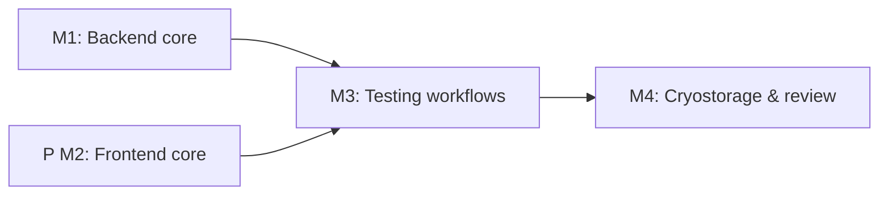

# Implementation Plan: Viral and Vaccine Laboratory Workflow

**Branch**: `282-viral-vaccine-workflow` | **Date**: 2025-12-14 | **Spec**: [spec.md](spec.md)  
**Input**: Feature specification from `/specs/282-viral-vaccine-workflow/spec.md`

## Summary

Extend the OGC-51 Notebook/Page architecture to deliver a comprehensive viral and vaccine laboratory workflow covering viral diagnostics (PCR, serology, viral culture) and vaccine research (potency, sterility, immunogenicity). Key differentiators include ultra-cold storage management (-80°C freezers, liquid nitrogen dewars), continuous cold chain monitoring with temperature excursion logging, biosafety level tracking (BSL-2/BSL-3), and specialized testing workflows (RT-PCR with multi-target Ct values, ELISA with standard curves, viral culture passage tracking, vaccine lot testing). The implementation reuses existing Notebook, SampleStorage, and Patient services while adding viral-specific entities, cold chain monitoring services, and cryogenic storage hierarchies.

**Technical Approach**: Build on existing OpenELIS infrastructure (Notebook system from OGC-51, SampleStorageService, PatientService). Create new service modules for cold chain monitoring, biosafety compliance, PCR/serology testing, viral culture tracking, vaccine lot testing, and cryogenic storage management. Implement React frontend with Carbon Design System for 13 workflow pages reusing notebook grids and storage components. Use Liquibase for all schema changes including temperature logging tables and storage hierarchies.

## Technical Context

**Language/Version**: Java 21 LTS (OpenJDK/Temurin) + React 17  
**Primary Dependencies**: Spring Framework 6.2.2, Hibernate 6.x (ORM 5.6.15.Final), HAPI FHIR R4 6.6.2, @carbon/react 1.15.0, React Intl 5.20.12, SWR 2.0.3, Formik 2.2.9  
**Storage**: PostgreSQL 14+ via JPA/Hibernate; Liquibase 4.8.0 for schema migrations including cold chain logging tables, storage hierarchies (dewar/freezer positions), and temperature excursion events  
**Testing**: JUnit 4 (4.13.1) + Mockito 2.21.0 + BaseWebContextSensitiveTest; Jest + React Testing Library; Cypress 12.17.3 E2E  
**Target Platform**: Tomcat 10 WAR backend; modern browsers (Chrome, Firefox, Safari); Docker Compose dev environment  
**Project Type**: Web application (Java backend + React frontend monorepo)  
**Performance Goals**: Sample registration with cold chain docs <3 min; PCR run creation (96 samples) <5 min; ELISA standard curve calculation <2s; temperature excursion alert <5s from trigger; cold chain report generation (1 year data) <30s; cryostorage position lookup <1s  
**Constraints**: Carbon Design System only; React Intl for all strings; 5-layer architecture with @Transactional only in services; services compile data to avoid lazy loading; Liquibase with rollback + indexes; no country-specific code; audit trail for all actions; continuous temperature monitoring with alert system; biosafety checklist enforcement  
**Scale/Scope**: ~13 workflow pages, 13 user stories, 14+ new entity types; support 500+ samples with cold chain tracking; 10,000+ temperature readings per month; liquid nitrogen dewars with 6 canisters × 4 racks × 3 boxes × 81 positions (5,832 positions per dewar); -80°C freezers with 5 shelves × 4 racks × 6 boxes × 100 positions (12,000 positions per freezer)

## Constitution Check

_GATE: Must pass before Phase 0 research. Re-check after Phase 1 design._

| Principle                          | Requirement                                          | Status | Notes                                                                      |
| ---------------------------------- | ---------------------------------------------------- | ------ | -------------------------------------------------------------------------- |
| I. Configuration-Driven Variation  | Country customizations via config, not code          | PASS   | Biosafety levels, temperature thresholds, alert recipients configurable    |
| II. Carbon Design System First     | All UI uses @carbon/react exclusively                | PASS   | DataTable, Modal, Form, Grid, Charts components for all 13 pages          |
| III. FHIR/IHE Standards Compliance | FHIR R4 for external data                            | PASS   | Specimen, Observation, DiagnosticReport FHIR resources for viral samples  |
| IV. Layered Architecture           | 5-layer: Valueholder→DAO→Service→Controller→Form     | PASS   | All new entities follow strict layering                                    |
| V. Test-Driven Development         | TDD, >70% coverage, individual E2E tests             | PASS   | JUnit 4 unit tests, Cypress E2E per page, >80% backend coverage goal      |
| VI. Database Schema Management     | Liquibase only, no direct DDL                        | PASS   | All tables via Liquibase including temperature logs and storage positions  |
| VII. Internationalization First    | React Intl for all strings                           | PASS   | ~600 new keys for en.json and fr.json (viral/vaccine/cold chain terms)    |
| VIII. Security & Compliance        | RBAC, audit trail, input validation                  | PASS   | Biosafety-based access control, complete audit trail, PHI logging          |
| IX. Spec-Driven Iteration          | Milestones for >3 day efforts                        | PASS   | 4 milestones planned covering all workflow phases                          |

## Project Structure

### Documentation (this feature)

```text
specs/282-viral-vaccine-workflow/
├── plan.md              # This file
├── research.md          # Phase 0 research output
├── data-model.md        # Entity relationship documentation
├── quickstart.md        # Step-by-step developer guide
├── contracts/           # API contracts
│   ├── viral-workflow.md     # Main API contract
│   ├── cold-chain-api.yaml   # Cold chain monitoring endpoints
│   ├── pcr-serology.yaml     # Testing workflow endpoints
│   ├── cryostorage.yaml      # Storage management endpoints
│   └── fhir-viral-mapping.md # FHIR resource mappings
└── tasks.md             # Phase 2 task breakdown (via /speckit.tasks)
```

### Source Code (repository root)

```text
# Backend (Java)
src/main/java/org/openelisglobal/
├── notebook/…                           # REUSE: OGC-51 notebook core
├── samplestorage/…                      # REUSE: OGC-51 storage services
└── viral/                               # NEW MODULE: Viral & Vaccine Workflow
    ├── valueholder/
    │   ├── ViralSample.java             # Viral specimen with biosafety level
    │   ├── ColdChainLog.java            # Transport temperature records
    │   ├── BiosafetyClearance.java      # BSL assignment + PPE docs
    │   ├── SampleAliquot.java           # Parent-child aliquoting
    │   ├── PCRRun.java                  # RT-PCR batch
    │   ├── PCRResult.java               # Multi-target Ct values
    │   ├── ELISARun.java                # ELISA batch
    │   ├── ELISAResult.java             # OD values + titer calculation
    │   ├── ViralCulture.java            # Culture with passage tracking
    │   ├── VaccineLot.java              # Vaccine batch testing
    │   ├── CryogenicDewar.java          # LN₂ storage unit
    │   ├── UltraColdFreezer.java        # -80°C freezer
    │   ├── StoragePosition.java         # Hierarchical position (dewar/freezer→box→position)
    │   ├── TemperatureLog.java          # Continuous monitoring
    │   ├── TemperatureExcursion.java    # Alarm events
    │   ├── AutoclaveCycle.java          # Disposal documentation
    │   └── ResultReview.java            # Approval tracking
    ├── dao/
    │   ├── ViralSampleDAO.java
    │   ├── ColdChainLogDAO.java
    │   ├── BiosafetyClearanceDAO.java
    │   ├── SampleAliquotDAO.java
    │   ├── PCRRunDAO.java
    │   ├── PCRResultDAO.java
    │   ├── ELISARunDAO.java
    │   ├── ELISAResultDAO.java
    │   ├── ViralCultureDAO.java
    │   ├── VaccineLotDAO.java
    │   ├── CryogenicDewarDAO.java
    │   ├── UltraColdFreezerDAO.java
    │   ├── StoragePositionDAO.java
    │   ├── TemperatureLogDAO.java
    │   ├── TemperatureExcursionDAO.java
    │   ├── AutoclaveCycleDAO.java
    │   └── ResultReviewDAO.java
    ├── service/
    │   ├── ViralSampleService.java           # Sample registration with cold chain
    │   ├── ColdChainService.java             # Temperature monitoring + alerts
    │   ├── BiosafetyClearanceService.java    # BSL assignment + checklist
    │   ├── SampleAliquotService.java         # Parent-child relationships
    │   ├── PCRService.java                   # PCR run management + validation
    │   ├── ELISAService.java                 # ELISA with standard curves
    │   ├── ViralCultureService.java          # Culture passage tracking
    │   ├── VaccineLotService.java            # Vaccine testing workflows
    │   ├── CryogenicStorageService.java      # Dewar/freezer management
    │   ├── TemperatureMonitoringService.java # Continuous logging + excursions
    │   ├── AutoclaveService.java             # Disposal validation
    │   └── ResultReviewService.java          # Result approval workflow
    ├── controller/rest/
    │   ├── ViralSampleController.java
    │   ├── ColdChainController.java
    │   ├── BiosafetyClearanceController.java
    │   ├── PCRController.java
    │   ├── ELISAController.java
    │   ├── ViralCultureController.java
    │   ├── VaccineLotController.java
    │   ├── CryogenicStorageController.java
    │   ├── TemperatureMonitoringController.java
    │   ├── AutoclaveController.java
    │   └── ResultReviewController.java
    └── form/
        ├── ViralSampleForm.java
        ├── ColdChainLogForm.java
        ├── BiosafetyClearanceForm.java
        ├── PCRRunForm.java
        ├── ELISARunForm.java
        ├── ViralCultureForm.java
        ├── VaccineLotForm.java
        ├── StorageAssignmentForm.java
        └── ResultReviewForm.java

src/main/resources/liquibase/viral/
├── 001-viral-sample.xml                # ViralSample table with biosafety level
├── 002-cold-chain-log.xml              # ColdChainLog table for transport temps
├── 003-biosafety-clearance.xml         # BiosafetyClearance table
├── 004-sample-aliquot.xml              # SampleAliquot table with parent FK
├── 005-pcr-run.xml                     # PCRRun table
├── 006-pcr-result.xml                  # PCRResult table with multi-target Ct
├── 007-elisa-run.xml                   # ELISARun table
├── 008-elisa-result.xml                # ELISAResult table with OD/titer
├── 009-viral-culture.xml               # ViralCulture table with passage tracking
├── 010-vaccine-lot.xml                 # VaccineLot table
├── 011-cryogenic-dewar.xml             # CryogenicDewar table
├── 012-ultracold-freezer.xml           # UltraColdFreezer table
├── 013-storage-position.xml            # StoragePosition hierarchical table
├── 014-temperature-log.xml             # TemperatureLog table with indexes
├── 015-temperature-excursion.xml       # TemperatureExcursion alarm table
├── 016-autoclave-cycle.xml             # AutoclaveCycle disposal table
└── 017-result-review.xml               # ResultReview approval table

# Frontend (React)
frontend/src/
├── components/
│   └── viral/                           # NEW: Viral & Vaccine module
│       ├── ViralSampleReception.js      # Sample registration with cold chain docs
│       ├── BiosafetyClearance.js        # BSL assignment + PPE checklist
│       ├── SampleQualityCheck.js        # Specimen-type QC
│       ├── SampleAliquoting.js          # Parent-child aliquoting
│       ├── PCRRunManagement.js          # PCR batch setup + result entry
│       │   ├── PCRRunForm.js
│       │   ├── PCRResultEntry.js
│       │   └── CtValueValidator.js
│       ├── ELISARunManagement.js        # ELISA batch + standard curve
│       │   ├── ELISARunForm.js
│       │   ├── StandardCurveCalc.js
│       │   └── ELISAResultEntry.js
│       ├── ViralCultureTracking.js      # Culture initiation + passage history
│       │   ├── CultureInitiationForm.js
│       │   ├── CPEObservationLog.js
│       │   └── PassageHistoryView.js
│       ├── VaccineLotTesting.js         # Vaccine potency + sterility
│       ├── CryogenicStorageManagement.js # LN₂ dewar + -80°C freezer
│       │   ├── DewarManagement.js
│       │   ├── FreezerManagement.js
│       │   ├── StorageBoxGrid.js        # 9×9 or 10×10 grid view
│       │   └── PositionAssignment.js
│       ├── TemperatureMonitoring.js     # Temperature logs + excursion alerts
│       │   ├── TemperatureLogChart.js
│       │   ├── ExcursionAlertPanel.js
│       │   └── LiquidNitrogenLevelLog.js
│       ├── AutoclaveDisposal.js         # Autoclave batch + validation
│       ├── ResultReview.js              # Result approval workflow
│       └── ColdChainReport.js           # Compliance report generation
└── languages/
    ├── en.json                          # UPDATE: Add ~600 new keys
    └── fr.json                          # UPDATE: Add ~600 new keys

# Tests
src/test/java/org/openelisglobal/viral/
├── service/
│   ├── ViralSampleServiceTest.java
│   ├── ColdChainServiceTest.java
│   ├── PCRServiceTest.java
│   ├── ELISAServiceTest.java
│   ├── ViralCultureServiceTest.java
│   ├── CryogenicStorageServiceTest.java
│   └── TemperatureMonitoringServiceTest.java
├── dao/
│   ├── ViralSampleDAOTest.java
│   ├── PCRRunDAOTest.java
│   └── StoragePositionDAOTest.java
└── controller/
    ├── ViralSampleControllerTest.java
    └── CryogenicStorageControllerTest.java

frontend/cypress/e2e/viral/
├── viralSampleReception.cy.js
├── biosafetyClearance.cy.js
├── sampleAliquoting.cy.js
├── pcrRunManagement.cy.js
├── elisaRunManagement.cy.js
├── viralCultureTracking.cy.js
├── vaccineLotTesting.cy.js
├── cryogenicStorage.cy.js
├── temperatureMonitoring.cy.js
├── autoclaveDisposal.cy.js
├── resultReview.cy.js
└── coldChainReport.cy.js
```

**Structure Decision**: Single monorepo with Java backend in `src/main/java` + Liquibase resources and React frontend in `frontend/src`. Leverages existing Notebook system (OGC-51) and SampleStorageService for hierarchical storage. New viral module follows 5-layer architecture. Contracts kept under `specs/282-viral-vaccine-workflow/contracts/`.

## Milestone Plan (feature >3 days)

**Estimated Total Effort**: ~15-20 days

| ID     | Branch Suffix          | Scope                                                                                     | User Stories            | Verification                                                  | Depends On |
| ------ | ---------------------- | ----------------------------------------------------------------------------------------- | ----------------------- | ------------------------------------------------------------- | ---------- |
| M1     | m1-backend-core        | Liquibase for viral tables; viral valueholders/DAOs/services; cold chain logging; biosafety clearance; sample aliquoting; REST for registration/QC/aliquoting | P0 (1-3), P1 (4)        | Unit + ORM validation + integration (registration/QC/aliquoting) | -          |
| [P] M2 | m2-frontend-core       | Carbon pages for sample reception, biosafety clearance, QC, aliquoting; SWR clients; cold chain form; i18n keys | P0 (1-3), P1 (4)        | Jest/RTL for forms; accessibility checks                      | -          |
| M3     | m3-testing-workflows   | PCR/ELISA/viral culture/vaccine lot testing backend + frontend; standard curve calculation; passage tracking; result validation | P1 (5-8), P2 (8)        | Unit/integration for testing APIs; Jest for PCR/ELISA forms   | M1, M2     |
| M4     | m4-cryostorage-review  | Cryogenic storage backend + frontend; temperature monitoring; excursion alerts; autoclave disposal; result review; cold chain reports; Cypress E2E | P1 (9-10), P2 (11-13)   | Cypress E2E (storage/alerts/reports); cold chain validation   | M3         |



**Milestone Details**:

- **M1 (Backend Core)**: ~4 days - Foundation with cold chain + biosafety + aliquoting
- **M2 (Frontend Core)**: ~4 days - Parallel with M1, UI for reception + QC + aliquoting
- **M3 (Testing Workflows)**: ~5 days - PCR + ELISA + viral culture + vaccine testing
- **M4 (Cryostorage & Review)**: ~6 days - Storage management + monitoring + final workflows

## Testing Strategy

**Reference**: `.specify/guides/testing-roadmap.md` - Follow TDD for complex logic (standard curve calculation, temperature excursion detection, passage tracking).

### Coverage Goals
- **Backend**: New code >80% (JaCoCo), focus on services with complex logic
- **Frontend**: >70% (Jest coverage), focus on PCR/ELISA calculation components
- **Overall**: >70% for feature scope

### Test Types
1. **Unit Tests** (JUnit 4 + Mockito):
   - Service logic: Cold chain validation, biosafety checks, aliquot creation, PCR control validation, ELISA standard curve fitting, passage lineage tracking, temperature excursion detection
   - Test data: Use builders/factories (ViralSampleBuilder, PCRRunBuilder, etc.)
   
2. **ORM Validation Tests**:
   - Hibernate mapping validation: All viral entities load without errors
   - Verify property names match getters/setters
   - Execute in <5s without database

3. **Integration Tests** (BaseWebContextSensitiveTest):
   - REST API flows: Sample registration → QC → aliquoting → testing → storage → review
   - Transaction management: Service layer @Transactional only
   - Data compilation: Services eagerly fetch with JOIN FETCH

4. **Frontend Unit Tests** (Jest + React Testing Library):
   - Component behavior: PCR result entry with Ct validation, ELISA standard curve display, storage grid interaction
   - Form validation: Cold chain temperature ranges, biosafety checklist completion, autoclave cycle parameters
   - Calculation logic: Standard curve 4-parameter logistic fit, cutoff-based interpretation

5. **E2E Tests** (Cypress):
   - Full workflows: Sample reception → PCR testing → result review → storage assignment
   - Cold chain compliance: Temperature excursion logging → alert generation → corrective action
   - Report generation: Cold chain compliance report with >95% in-range readings

### Test Data Management
- **Builders/Factories**: Create test data programmatically (ViralSampleBuilder, PCRRunBuilder, etc.)
- **Fixture Loader**: Use `src/test/resources/load-test-fixtures.sh` for viral samples and storage hierarchies
- **Cypress API Setup**: No UI seeding; use API calls to create samples, runs, and storage positions
- **Test Isolation**: Each test creates its own data; cleanup in `@After` methods

### Checkpoint Validations
- **M1 Checkpoint**: Unit + ORM validation + integration tests for registration/QC/aliquoting pass; coverage >80%
- **M2 Checkpoint**: Jest/RTL for reception/biosafety/QC pages; i18n coverage complete; accessibility checks pass
- **M3 Checkpoint**: Integration tests for PCR/ELISA/culture/vaccine APIs; Jest for testing forms; calculation logic verified
- **M4 Checkpoint**: Cypress E2E covering storage assignment, temperature monitoring, cold chain reports; performance targets met (position lookup <1s, report generation <30s)

### TDD Workflow
- **Red**: Write failing test first (defines expected behavior)
- **Green**: Write minimal code to make test pass
- **Refactor**: Improve code quality while keeping tests green

**Examples for TDD**:
- ELISA standard curve calculation: Test with known calibrator ODs → verify titer calculations
- Temperature excursion detection: Test with temp >threshold for >duration → verify alarm created
- Viral culture passage tracking: Test P0 → P1 → P2 chain → verify lineage integrity

### Lint/Format
- **Backend**: `mvn spotless:apply` before commits
- **Frontend**: `npm run format` before commits
- **Fast builds**: `mvn clean install -DskipTests -Dmaven.test.skip=true` during development

## Complexity Tracking

> **Fill ONLY if Constitution Check has violations that must be justified**

| Violation | Why Needed | Simpler Alternative Rejected Because |
| --------- | ---------- | ------------------------------------ |
| None      | N/A        | N/A                                  |

All constitution principles are met. No architectural violations require justification.
