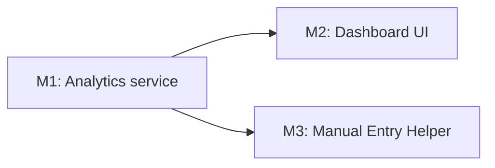

# Implementation Plan: Vector Surveillance Reporting (OGC-585 / V-04)

**Branch**: `372-vector-surveillance-reporting` | **Date**: 2026-06-15 | **Spec**: [spec.md](./spec.md)
**Target**: `demo-silnas` (milestone PRs target demo-silnas, **not** develop — per the roadmap scope decision)
**Roadmap**: [vector-surveillance-reporting-roadmap.md](../roadmaps/vector-surveillance-reporting-roadmap.md)

## Summary

An **internal** vector surveillance reporting module: a Carbon dashboard of computed indices (collection density, species distribution, MIR with classic + deconvolution-aware + resolution %, pathogen positivity, QC pass-rate) with date/site filters and PDF export, plus a SILANTOR **Manual Entry Helper** (copy-to-portal + immutable submission audit + admin-configurable field map). **Technical approach**: compute indices **on demand from OpenELIS's own OLTP data** in a read-only service (mirroring the existing `TATReportService` pattern) — no ETL, no Superset, no FHIR. Two new persisted entities back the Manual Entry Helper; everything else is derived or read-only. See [research.md](./research.md) for the read-model decision.

## Technical Context

**Language/Version**: Java 21 LTS (Jakarta EE 9, `jakarta.*`); JavaScript / React 17
**Primary Dependencies**: Spring Framework 6.2 (Traditional MVC, NOT Boot), Hibernate/JPA, Liquibase 4.8; `@carbon/react` 1.x, `@carbon/charts-react` 1.27.3 (already present), `jspdf` 4.2.1 + `jspdf-autotable` (already present), React Intl
**Storage**: PostgreSQL 14+ via JPA/Hibernate. **Read model: OLTP-direct, service-layer HQL aggregation, computed on demand** (D1). 2 new tables (`manual_entry_field_map`, `manual_entry_submission_audit`).
**Testing**: JUnit 4 + Mockito (unit), `BaseWebContextSensitiveTest` (DAO/controller/integration, Testcontainers), ORM validation test, Jest + RTL (frontend), Playwright (E2E)
**Target Platform**: OpenELIS web app on `demo-silnas`
**Project Type**: web (backend + frontend)
**Performance Goals**: dashboard renders a typical site/period scope without perceptible delay at demo data volumes (SC-008); figures live/on-demand (freshness ≤ 15 min trivially met, SC-002)
**Constraints**: HQL only (no native SQL unless justified — Constitution IV); services compile all data in-transaction; Carbon-only UI; i18n for all strings
**Scale/Scope**: 5 user stories, 14 FRs; ~2 new entities + 1 read-only analytics service + 1 dashboard + 1 helper + 1 admin page

## Constitution Check

_GATE: Must pass before Phase 0. Re-checked after design — still passing._

- [x] **Configuration-Driven**: No country-specific code branches. The SILANTOR field map is **configuration** (`ManualEntryFieldMap`), not code (CR-006 / FR-009).
- [x] **Carbon Design System**: UI uses `@carbon/react` + `@carbon/charts-react` exclusively. No Bootstrap/Tailwind.
- [~] **FHIR/IHE Compliance**: **N/A — no external integration in this feature.** It is internal reporting over OE's own data; no new external-facing entities, no `fhir_uuid`. The external FHIR path is parked (OGC-586/592). This is *absence of* external integration, not a bypass — see Complexity Tracking.
- [x] **Layered Architecture**: 5-layer (Valueholder→DAO→Service→Controller→Form); JPA-annotated valueholders; `@Transactional` in services only; services return fully-compiled DTOs (no controller relationship traversal).
- [x] **Test Coverage**: Unit + ORM validation + DAO/integration + frontend Jest + Playwright E2E planned (Testing Strategy below).
- [x] **Schema Management**: Liquibase changesets `042`/`043`/`044` in `3.5.x.x/` with rollbacks.
- [x] **Internationalization**: All UI strings via React Intl; new keys in `en.json` only.
- [x] **Security & Compliance**: RBAC via 3 new `system_module`s (D7); audit trail (`AuditTrailService` + immutable submission audit); input validation on forms.

## Milestone Plan

_Effort > 3 days → milestones required (Principle IX). Each milestone = 1 PR → `demo-silnas`._

### Milestone Table

| ID | Branch Suffix | Scope | User Stories | Verification | Depends On |
| --- | --- | --- | --- | --- | --- |
| M1 | m1-analytics | Backend analytics: read-only HQL aggregation service computing all indices (density, species, MIR classic + observed + resolution %, positivity, QC pass-rate) from the vector OLTP model; `/rest/reports/vector-surveillance/indices` + `/sites`; `VectorSurveillanceDashboard` permission seed (Liquibase 044) | US1 (backend) | Service unit tests incl. **MIR + QC-exclusion inversion tests** (SC-005/006); integration test on the endpoint (auth-before-logic) | — |
| [P] M2 | m2-dashboard | Frontend: Reports → Vector Surveillance Carbon page consuming M1; date/site filters; `@carbon/charts` charts; client-side PDF (jsPDF); empty/loading states; freshness indicator; route + nav + `SecureRoute` gating; i18n | US1, US2, US3 | Jest component tests; Playwright E2E (view + filter + export); i18n-only strings | M1 |
| [P] M3 | m3-manual-entry | Full-stack: `ManualEntryFieldMap` + `ManualEntrySubmissionAudit` entities (Liquibase 042/043, audited); DAO/Service/REST; Manual Entry Helper page (copy + mark-submitted); admin field-map page; `VectorManualEntryHelper` + `VectorManualEntryFieldMap` permissions | US4, US5 | ORM validation test; service tests (audit snapshot immutability, field-map ordering/gating); Playwright E2E (submit → audit row; re-submit → 2nd row) | M1 |

**Branch naming** (Principle IX): `feat/372-ogc-585-vector-surveillance-reporting-m{N}-{desc}` → `demo-silnas`.

### Milestone Dependency Graph



### PR Strategy

- **Spec/plan** lives on `372-vector-surveillance-reporting` (this branch).
- **Milestone PRs**: `feat/372-ogc-585-vector-surveillance-reporting-m{N}-{desc}` → **`demo-silnas`** (overrides the template's `develop` default — this work is scoped to the demo trunk).

## Project Structure

### Documentation (this feature)

```text
specs/372-vector-surveillance-reporting/
├── plan.md            # this file
├── research.md        # read-model + 8 decisions
├── data-model.md      # 2 new entities + derived DTOs + read-only model
├── quickstart.md
├── contracts/
│   └── vector-surveillance-api.yaml
└── tasks.md           # /speckit.tasks output (NOT created here)
```

### Source Code (repository root)

```text
# Backend (Java) — analytics service follows the reports.tat precedent
src/main/java/org/openelisglobal/reports/vectorsurveillance/
├── service/        # VectorSurveillanceService(+Impl) — read-only HQL aggregation, returns DTOs
├── controller/rest/# VectorSurveillanceRestController — /rest/reports/vector-surveillance/*
├── valueholder/    # DTOs: SurveillanceIndicesDTO, ManualEntryViewDTO, etc.
└── manualentry/
    ├── valueholder/  # ManualEntryFieldMap, ManualEntrySubmissionAudit (extend BaseObject<Integer>)
    ├── dao/ daoimpl/ # BaseDAO/BaseDAOImpl pattern
    ├── service/      # AuditableBaseObjectServiceImpl pattern
    └── controller/rest/ # /rest/admin/vector/manual-entry-fields, /rest/reports/vector-surveillance/manual-entry*

src/main/resources/liquibase/3.5.x.x/
├── 042-vector-surveillance-dashboard-permissions.xml  # M1: dashboard module + url + grants
├── 043-manual-entry-field-map.xml          # M3: table + seed 8 default metrics
├── 044-manual-entry-submission-audit.xml   # M3: immutable audit table
├── 045-manual-entry-permissions.xml        # M3: helper + field-map modules + grants
└── base.xml                                # add 4 includes after 041-laporan-hasil-menu.xml

# Frontend (React + Carbon)
frontend/src/components/reports/vectorSurveillance/
├── Index.jsx                       # route entry
├── VectorSurveillanceDashboard.jsx # charts + filters + PDF (US1/2/3)
└── ManualEntryHelper.jsx           # copy + mark-submitted (US4)
frontend/src/components/admin/vectorSurveillance/
└── ManualEntryFieldMapPage.jsx     # admin field map (US5) — dir already exists
frontend/src/languages/en.json      # new i18n keys (en only)
frontend/src/App.jsx                # routes (SecureRoute)

# Tests
src/test/java/org/openelisglobal/reports/vectorsurveillance/   # unit + ORM + integration
frontend/src/components/reports/vectorSurveillance/*.test.jsx  # Jest
frontend/playwright/tests/.../vector-surveillance.spec.ts      # E2E
```

**Structure Decision**: Web (backend + frontend). The analytics service lives under `org.openelisglobal.reports.vectorsurveillance` (parallel to `reports.tat`, the modern precedent); the configurable Manual Entry entities follow the `VectorTrapType` end-to-end exemplar.

## Complexity Tracking

| Item | Why / Status | Simpler alternative & decision |
| --- | --- | --- |
| FHIR not used | Internal reporting; no external-facing entity. **Not a bypass** — there is no external integration to route through FHIR. The external FHIR path is a separate, parked story (OGC-586/592). | N/A — adding FHIR here would be the over-engineering the roadmap rejected. |
| Possible native SQL for one aggregation | Default is **HQL** (Constitution IV). If a single index (e.g., a window-function trend) is impractical in HQL, that query MAY use native SQL **with explicit PR justification**. | HQL preferred; native SQL is a per-query, documented exception only. |

## Testing Strategy

**Reference**: [OpenELIS Testing Roadmap](../../.specify/guides/testing-roadmap.md). Coverage goals: **>80% backend** (JaCoCo), **>70% frontend** (Jest); **100%** on the MIR math + QC exclusion + auth checks.

### Test Types

- [x] **Unit (JUnit 4 + Mockito)** — `VectorSurveillanceService`: MIR classic/observed, resolution %, QC exclusion. **Inversion test (V.6)**: replace an aggregation with a constant → test MUST fail. QC sample MUST NOT change indices (SC-005). `@RunWith(MockitoJUnitRunner.class)`, `@Mock` (not `@MockBean`).
- [x] **ORM Validation (V.4)** — `ManualEntryFieldMap` + `ManualEntrySubmissionAudit` build the `SessionFactory` (no DB, <5s); catch getter/property mismatches.
- [x] **DAO / Integration (`BaseWebContextSensitiveTest`)** — aggregation HQL against a seeded vector dataset (Testcontainers Postgres + full Liquibase); field-map CRUD; submission audit insert + re-submit creates a 2nd row.
- [x] **Controller / Integration** — `BaseWebContextSensitiveTest` + `MockMvc`: endpoints return correct DTOs; **auth-before-logic** (J3) — a user lacking each module gets blocked (SC-007).
- [x] **Frontend Unit (Jest + RTL)** — dashboard renders indices from a mocked API (verify request shape, not render-only); empty state; i18n assertions for visible text; helper copy + mark-submitted.
- [x] **E2E (Playwright)** — `vector-surveillance.spec.ts`: view dashboard, filter, export PDF; manual-entry submit → audit; admin field-map change reflected. API-first data setup; assert on visible UI state.

### Test Data Management

- Backend: builders/factories for vector pools/results; integration via the unified fixture loader (`src/test/resources/load-test-fixtures.sh`) + `@Transactional` rollback. **New FKs into sample/sample_item must extend the E2E fixture cleanup SQL in the same PR.**
- Frontend E2E: API-based setup (`cy.request`/`page.request`); `cy.session()`/Playwright storage state for login.

### Checkpoint Validations

- [x] **After M3 entities**: ORM validation tests pass.
- [x] **After M1 service**: backend unit tests (MIR/QC inversion) pass.
- [x] **After M1/M3 controllers**: integration + auth-ordering tests pass.
- [x] **After M2/M3 frontend**: Jest + Playwright E2E pass.

## Phase status

- [x] Phase 0 — research.md (read model + 8 decisions; 0 unresolved unknowns)
- [x] Phase 1 — data-model.md, contracts/, quickstart.md
- [x] Constitution re-check post-design — PASS
- [ ] Phase 2 — tasks.md (via `/speckit.tasks`)
