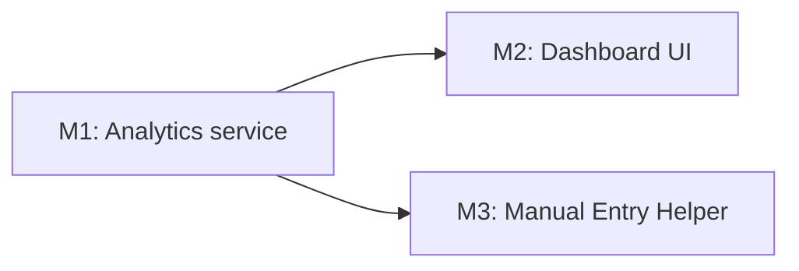

# Tasks: Vector Surveillance Reporting (OGC-585 / V-04)

**Input**: Design documents in `/specs/372-vector-surveillance-reporting/` (plan.md, spec.md, research.md, data-model.md, contracts/)
**Organization**: By **Milestone** per Constitution Principle IX (OpenELIS override) — NOT by user story. Each milestone = one PR → **`demo-silnas`**. Tests are **MANDATORY** (Principle V) and precede implementation.

**Format**: `- [ ] [TaskID] [P?] [Milestone] Description with exact file path`
- **[P]** = parallelizable (different files, no incomplete-task dependency)
- **[M1]/[M2]/[M3]** = owning milestone (the branch/PR it belongs to)

**Milestones** (from plan.md): **M1** Analytics Service (backend) → **M2** Dashboard UI `[P]` + **M3** Manual Entry Helper `[P]` (both depend on M1).

---

## Phase 1 — Milestone M1: Analytics Service (backend) 🎯 FOUNDATION

**Goal**: Read-only HQL aggregation service computing all surveillance indices from the vector OLTP model, exposed at `/rest/reports/vector-surveillance/*`. Blocks M2 and M3.
**Delivers**: US1 (backend). **Independent test**: seed vector pools/results → `GET /indices` returns correct density/species/MIR/positivity/QC; a QC sample never changes the numbers; a user lacking the permission is blocked.
**Branch**: `feat/372-ogc-585-vector-surveillance-reporting-m1-analytics` → `demo-silnas`

### Setup
- [X] T001 [M1] **Option A (single branch):** implement on `372-vector-surveillance-reporting` — one branch, one PR; no separate milestone branch (per user decision + `feedback_single_feature_branch`)
- [X] T002 [M1] Create backend package skeleton `src/main/java/org/openelisglobal/reports/vectorsurveillance/{service,valueholder,dao}/` (controller/daoimpl land with T009/T011)
- [X] T003 [P] [M1] Confirmed vector read-model from source: decon on `VectorPool` (stale Javadoc), `Analysis.vectorPoolId` (excl. `sampitem_id`), `sampleItemId` type mismatch (String vs Long) — caveats noted for T009 HQL

### Tests (write FIRST; must FAIL before implementation)
- [X] T004 [P] [M1] Unit test: classical MIR = positive pools ÷ Σ specimen quantity ×1000 (+ zero-guard + empty-scope), inversion-guarded — `VectorSurveillanceServiceTest.java` (Red→Green: 3/3 pass)
- [ ] T005 [P] [M1] Unit test: deconvolution-aware infection rate + `positiveResolutionPct` (COMPLETE pools use exact counts; fallback otherwise) in `VectorSurveillanceServiceTest.java`
- [ ] T006 [P] [M1] Unit test: QC exclusion — adding a QC sample leaves MIR/positivity/density unchanged (SC-005) in `VectorSurveillanceServiceTest.java`
- [ ] T007 [M1] Integration test: `GET /rest/reports/vector-surveillance/indices` returns correct DTO for a seeded dataset AND **auth-before-logic** (no `VectorSurveillanceDashboard` permission → blocked, SC-007) in `src/test/java/org/openelisglobal/reports/vectorsurveillance/VectorSurveillanceRestControllerIntegrationTest.java` (extends `BaseWebContextSensitiveTest`)

### Implementation
- [X] T008 [P] [M1] Response DTOs (`SurveillanceIndicesDTO` + nested rows) + raw `SurveillanceAggregates.SpeciesMirAggregate` in `valueholder/` (SiteOption lands with `/sites` in T011)
- [ ] T009 [M1] Create `VectorSurveillanceDAO` + `VectorSurveillanceDAOImpl` (HQL aggregations: density, species distribution, MIR pools/specimens, pathogen positivity, QC anti-join on `analysis_qaevent`) in `dao/` + `daoimpl/` (depends on T008)
- [ ] T010 [M1] Implement `VectorSurveillanceService` + `Impl` (`@Service`, `@Transactional(readOnly=true)`; compute classical + observed MIR + resolution %; set `freshness` = query time; leave `sporozoiteRatePct` **null** (deferred — gating only); compile DTOs in-transaction; `getSites()`) in `service/` (depends on T009)
- [ ] T011 [M1] Implement `VectorSurveillanceRestController` (`GET /indices?dateFrom&dateTo&siteId`, `GET /sites`) extending `BaseRestController`, no `@Transactional` in `controller/rest/` (depends on T010)
- [ ] T012 [M1] Liquibase `src/main/resources/liquibase/3.5.x.x/042-vector-surveillance-dashboard-permissions.xml` — `system_module` `VectorSurveillanceDashboard` + `system_module_url` for `/indices`+`/sites` + role grants + `<rollback>`; register include in `base.xml`
- [ ] T013 [M1] `rm -rf target/spotless-* && mvn spotless:apply`; run `mvn -Dtest=VectorSurveillance* test` green
- [ ] T014 [M1] Open PR `feat/372-ogc-585-vector-surveillance-reporting-m1-analytics` → `demo-silnas`

**Checkpoint**: M1 merged — analytics endpoints live; M2 and M3 can start in parallel.

---

## Phase 2 — Milestone M2: Dashboard UI (frontend) `[P]`

**Goal**: Reports → Vector Surveillance Carbon dashboard consuming M1; date/site filters; PDF export.
**Delivers**: US1 (UI), US2, US3. **Depends on**: M1. **Independent test**: open the page → 5 indices render; filter by date+site → recompute; export PDF.
**Branch**: `feat/372-ogc-585-vector-surveillance-reporting-m2-dashboard` → `demo-silnas`

### Setup
- [ ] T015 [M2] Create branch `feat/372-ogc-585-vector-surveillance-reporting-m2-dashboard` off `demo-silnas` (after M1 merged)

### Tests (write FIRST; must FAIL)
- [ ] T016 [P] [M2] Jest: dashboard renders indices from a mocked `/indices` — assert **request shape** (dateFrom/dateTo/siteId) and visible figures (not render-only), MIR shows classic+observed+resolution%, i18n keys resolve — in `frontend/src/components/reports/vectorSurveillance/VectorSurveillanceDashboard.test.jsx`
- [ ] T017 [P] [M2] Jest: changing a filter re-fetches `/indices` with new params; empty scope renders empty state (FR-012) in same test file
- [ ] T018 [M2] Author Playwright E2E via `/plan-record-playwright` then `/write-playwright-test`: view dashboard → filter (date+site) → export PDF, asserting visible UI state (and no non-OpenELIS outbound calls — FR-011), in `frontend/playwright/tests/demo/.../vector-surveillance.spec.ts`

### Implementation
- [ ] T019 [P] [M2] API client `VectorSurveillanceService.js` (`getFromOpenElisServer` for `/indices`, `/sites`) in `frontend/src/components/reports/vectorSurveillance/`
- [ ] T020 [M2] `VectorSurveillanceDashboard.jsx` — render `@carbon/charts-react` (density line, species donut, MIR table, positivity bar, QC bar) + freshness indicator + loading/empty states (depends on T019)
- [ ] T021 [M2] Filters: Carbon date-range + site `Select` (from `/sites`) + Apply, recompute all charts (US2)
- [ ] T022 [M2] PDF export via client-side `jsPDF`/`jspdf-autotable`, button gated in UI by `VectorSurveillanceDashboard` permission (US3)
- [ ] T023 [M2] `Index.jsx` route entry + `SecureRoute` gating + nav wiring in `frontend/src/App.jsx`; add `vectorReport.*` keys to `frontend/src/languages/en.json` (en only)
- [ ] T024 [M2] `cd frontend && npm run format`; Jest + `npm run pw:test -- vector-surveillance.spec.ts` green
- [ ] T025 [M2] Open PR `...-m2-dashboard` → `demo-silnas`

**Checkpoint**: Dashboard demoable end-to-end (first user-visible increment).

---

## Phase 3 — Milestone M3: Manual Entry Helper (full-stack) `[P]`

**Goal**: SILANTOR Manual Entry Helper (Aedes/Anopheles tabs, copy-to-portal, mark-week-submitted + immutable audit) + admin-configurable field map.
**Delivers**: US4, US5. **Depends on**: M1 (reuses the indices service). **Independent test**: open helper → copy values → mark week submitted → audit row written; re-submit → 2nd row; admin reorders/hides a metric → helper reflects it.
**Branch**: `feat/372-ogc-585-vector-surveillance-reporting-m3-manual-entry` → `demo-silnas`

### Setup
- [ ] T026 [M3] Create branch `feat/372-ogc-585-vector-surveillance-reporting-m3-manual-entry` off `demo-silnas` (after M1 merged)

### Tests (write FIRST; must FAIL)
- [ ] T027 [P] [M3] ORM validation test: `ManualEntryFieldMap` + `ManualEntrySubmissionAudit` build the `SessionFactory` (no DB, <5s) in `src/test/java/org/openelisglobal/reports/vectorsurveillance/manualentry/ManualEntryOrmValidationTest.java`
- [ ] T028 [P] [M3] Service test: field-map order/visibility drives `ManualEntryViewDTO`; sporozoite tile **withheld (gating only — no computed value)** when `positiveResolutionPct < 95` (US4-3) in `manualentry/ManualEntryViewServiceTest.java`
- [ ] T029 [P] [M3] Integration test: `mark submitted` writes an immutable audit row with `snapshot_json`; re-submit creates a **distinct** 2nd row (FR-008) in `manualentry/ManualEntrySubmissionServiceIntegrationTest.java` (`BaseWebContextSensitiveTest`)
- [ ] T030 [M3] Integration test: `/manual-entry/submit` requires `VectorManualEntryHelper`; `/admin/vector/manual-entry-fields` requires `VectorManualEntryFieldMap` (SC-007) in `manualentry/ManualEntryRestControllerIntegrationTest.java`
- [ ] T031 [P] [M3] Jest: helper renders tiles in field-map order with per-tile copy + mark-week-submitted POSTs snapshot; admin page reorders/hides/relabels — in `frontend/src/components/reports/vectorSurveillance/ManualEntryHelper.test.jsx`
- [ ] T032 [M3] Playwright E2E (`/write-playwright-test`): helper submit → audit row; admin field-map change reflected in helper, in `frontend/playwright/tests/demo/.../vector-manual-entry.spec.ts`

### Implementation
- [ ] T033 [M3] Liquibase in `src/main/resources/liquibase/3.5.x.x/`: `043-manual-entry-field-map.xml` (table + seed 8 default metrics + `reference_tables` keep_history), `044-manual-entry-submission-audit.xml` (immutable table), `045-manual-entry-permissions.xml` (`VectorManualEntryHelper` + `VectorManualEntryFieldMap` modules + urls + grants); all with `<rollback>`; register includes in `base.xml`
- [ ] T034 [P] [M3] Entities `ManualEntryFieldMap` + `ManualEntrySubmissionAudit` (extend `BaseObject<Integer>`, JPA annotations) in `.../manualentry/valueholder/`; register in `persistence.xml` + `test-persistence.xml`
- [ ] T035 [P] [M3] DAO + DAOImpl for both entities (`BaseDAOImpl`) in `.../manualentry/dao` + `daoimpl`
- [ ] T036 [M3] Services: `ManualEntryFieldMapService` (`AuditableBaseObjectServiceImpl`), `ManualEntryViewService` (compose `ManualEntryViewDTO` from field map + M1 indices; sporozoite gate), `ManualEntrySubmissionService` (immutable insert + snapshot) in `.../manualentry/service/` (depends on T034, T035, M1 T010)
- [ ] T037 [M3] REST controllers: `/rest/reports/vector-surveillance/manual-entry`, `/manual-entry/submit`, `/manual-entry/audit`, and `/rest/admin/vector/manual-entry-fields` (extend `BaseRestController`) in `.../manualentry/controller/rest/`
- [ ] T038 [M3] Frontend `ManualEntryHelper.jsx` (Aedes/Anopheles `Tabs`, metric `Tile`s + copy `IconButton`, mark-week-submitted `Modal` + confirm) and admin `ManualEntryFieldMapPage.jsx` (reorder/hide/relabel/portal-tag) + routes + `SecureRoute`; `vectorReport.manualEntry.*` keys in `en.json`
- [ ] T039 [M3] `rm -rf target/spotless-* && mvn spotless:apply` + `cd frontend && npm run format`; all M3 backend + Jest + Playwright tests green
- [ ] T040 [M3] Open PR `...-m3-manual-entry` → `demo-silnas`

**Checkpoint**: Full V-04 lean scope delivered (dashboard + manual entry).

---

## Phase 4 — Polish & Cross-Cutting

- [ ] T041 [P] Update `specs/roadmaps/vector-surveillance-reporting-roadmap.md` + `spec.md` header: v1.5 FRS + mock are now **in the repo** (committed 2026-06-15) — correct the "never pushed" wording
- [ ] T042 [P] Run `quickstart.md` end-to-end on a `demo-silnas` instance (all 5 user-story checks) **including a perceptible-delay check at representative demo data volume (SC-008)**
- [ ] T043 Consolidate/dedupe `vectorReport.*` i18n keys; confirm new keys are in `en.json` only (Transifex source-of-truth check)
- [ ] T044 Final `mvn spotless:check` + `cd frontend && npm run format` clean across all three PRs

---

## Dependencies & Execution Order

- **M1 (Phase 1)** — no dependency; **blocks M2 and M3**. Must merge first.
- **M2 (Phase 2)** `[P]` and **M3 (Phase 3)** `[P]` — both depend only on M1; independent of each other; can be built/reviewed in parallel by different devs.
- **Polish (Phase 4)** — after M2 and M3 merge.
- **Within each milestone**: branch (first) → tests (must fail) → DTOs/entities → DAO → service → controller/UI → format → PR (last). Liquibase before entity tests that hit the DB.

## Parallel opportunities

- **M1**: T004/T005/T006 (unit tests) parallel; T008 (DTOs) parallel with test authoring.
- **M2**: T016/T017 (Jest) parallel; T019 (API client) parallel with test authoring.
- **M3**: T027/T028/T031 parallel; T034/T035 (entities/DAO) parallel.
- **Cross-milestone**: once M1 merges, **M2 and M3 run fully in parallel**.

## Implementation strategy (MVP-first)

1. **M1** (foundation — not demoable alone) → merge.
2. **M2** → **first demoable increment**: the dashboard. **Stop & demo.**
3. **M3** → adds the SILANTOR Manual Entry Helper. **Stop & demo.**
4. **Polish.**

## Notes

- Liquibase numbering (042 M1 / 043–045 M3) is now **reconciled across data-model.md + plan.md**; M1's permission changeset lands first. Confirm the next free number at implementation time.
- Every milestone PR targets **`demo-silnas`**, not `develop` (roadmap scope decision).
- FHIR/Superset/OHS, RLS, alerts, MLE, API push remain **out of scope** (separate stories) — do not add tasks for them here.
