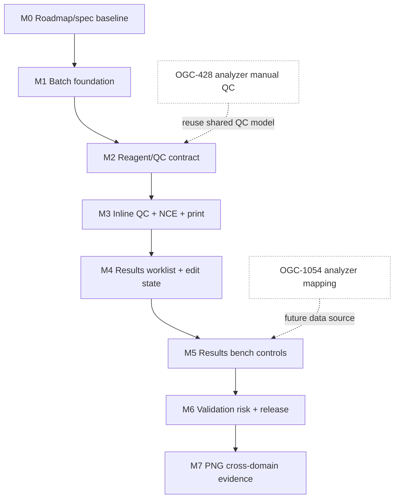

# Implementation Plan: Analyzer-Independent QC, Results Entry, and Validation

**Branch**: `codex/qc-results-entry-roadmap`
**Date**: 2026-06-28
**Spec**: [spec.md](./spec.md)
**Roadmap Index**:
[qc-results-entry-analyzer-independent-roadmap-2026-06-28.md](../roadmaps/qc-results-entry-analyzer-independent-roadmap-2026-06-28.md)

## Summary

This plan sequences analyzer-independent development across OGC-427, OGC-811,
and OGC-817. It deliberately excludes OGC-1054 analyzer profile/mapping work,
which is already in progress on a separate branch. The implementation path is:

1. Batch Workplan foundation.
2. Shared reagent/QC/NCE contract.
3. Inline QC, NCE override, and printable workplan.
4. Results Entry v4 foundation.
5. Results Entry v4 bench controls.
6. Validation v4 risk triage and guarded release.
7. PNG/CPHL cross-domain evidence hardening.

Each milestone is one PR, starts from a clean worktree based on current
`origin/develop`, and must include code-qa plus visual evidence before it is
marked ready.

## Technical Context

**Language/Version**: Java 21 LTS; JavaScript/React 17
**Backend**: Spring Framework 6.2 traditional MVC, Jakarta EE 9, Hibernate/JPA,
Liquibase 4.8
**Frontend**: React 17, Carbon Design System, React Intl, SWR, Formik/Yup where
appropriate
**Testing**: JUnit 4, Mockito, Spring integration tests, Vitest/RTL, Playwright
for new E2E/video evidence
**Target**: OpenELIS Global 2 web app on Tomcat/nginx/PostgreSQL
**Evidence source**: `digi-uw/openelis-work` mock commit
`6c24b6ee04aab4ecef96e8daa57dc88ae8821356`

## Constitution Check

- [x] **Configuration-Driven Variation**: PNG/SILNAS/domain behavior must be
      configuration/data, not country-specific code branches.
- [x] **Carbon First**: New UI uses `@carbon/react`, Carbon icons, Carbon grid,
      and React Intl. No Bootstrap/Tailwind/custom framework.
- [x] **FHIR/IHE**: External healthcare data exposure must preserve existing
      FHIR patterns and use service transforms where applicable.
- [x] **Layered Architecture**: Valueholder -> DAO -> Service -> Controller ->
      Form/DTO. Transactions start in services. Controllers do not traverse lazy
      relationships.
- [x] **TDD and E2E Evidence**: Backend contracts get backend tests; browser
      user stories get Playwright tests and MP4 evidence. No API-focused
      Playwright proof.
- [x] **Liquibase**: All schema changes via versioned Liquibase changesets.
- [x] **i18n**: New user-facing strings in `frontend/src/languages/en.json`
      only.
- [x] **Security and Audit**: Role checks, input validation, audit trail, and
      NCE/e-signature semantics are part of the milestone contract.
- [x] **Spec-Driven Iteration**: Each milestone is one reviewable PR.
- [x] **Legacy Removal**: When a milestone touches legacy Results or Workplan
      routes, it must remove, redirect, or file paired removal work. No
      duplicate long-lived path.

## Mock Baseline and Evidence Contract

Every UI milestone must create an evidence folder, not committed unless the
repo's evidence convention for that milestone says otherwise:

```text
specs/427-811-qc-results-entry-roadmap/evidence/<milestone>/
+-- README.md
+-- mock-screenshots/
+-- implementation-screenshots/
+-- mock-comparison.md
+-- code-qa.md
+-- videos/
```

Required viewport captures:

- Desktop: 1440 x 900
- Tablet: 1024 x 768 when the workflow has dense tables
- Mobile: 390 x 844 for any route expected to be usable on phones

Required mock comparison checks:

- Correct route and workflow surface.
- Primary work zone matches mock ordering.
- Context/reference sections are not above the work zone unless the mock shows
  that.
- No developer-only controls in lab-facing paths.
- No blank panels, overlapping text, or hidden action buttons.
- Carbon component usage and spacing are consistent with nearby app patterns.
- Any deviation from the mock is explicitly justified in `mock-comparison.md`.

Required video checks:

- Generated with the repo Playwright demo-video project.
- Shows the full user story with visible UI state changes.
- Does not use `page.request` or REST shortcuts as proof.
- Ends on a visible success state that a reviewer can understand.

Required code-qa gates:

- Spec-code alignment.
- Meaningful test coverage at the correct layer.
- Architecture and transaction-boundary review.
- i18n and Carbon review.
- Security/audit review.
- Legacy-path review.
- Simplicity review.
- Visual evidence and MP4 review.

## Milestone Plan

### Table 1: Sequential MVP Roadmap

| ID | Branch suffix | Scope | Jira | MVP contribution | Verification | Depends on |
| --- | --- | --- | --- | --- | --- | --- |
| **M0** | roadmap-spec | Roadmap/spec baseline, mock source pin, evidence checklist | OGC-427/811/817/899 | Establishes execution contract | Docs review, markdown/format checks | None |
| **M1** | m1-batch-foundation | Unified workplan route, Pending Tests and Batches shell, batch persistence, lifecycle service | OGC-427 | Batch Workplan foundation | Backend integration tests, UI smoke, mock screenshots, MP4 route walkthrough | M0 |
| **M2** | m2-reagent-qc-contract | Reagent lot assignment, QC validity model, shared DTO/API contract for QC/reagent/NCE signals | OGC-427, OGC-811 | Shared contract | Service tests, controller tests, contract fixtures, no UI shortcut proof | M1 |
| **M3** | m3-inline-qc-nce-print | Inline QC entry, QC override creates NCE, auto-expand overdue/failed QC batches, printable workplan | OGC-427 | Batch Workplan MVP complete | Full UI Playwright MP4, mock comparison, backend NCE/audit tests | M2 |
| **M4** | m4-results-worklist-edit-state | `/Results` route, worklist foundation, row expansion, v4 edit-state machine, method field, optional analyzer field | OGC-811 | Results Entry foundation | UI/component/integration tests, Results v4 mock screenshots, MP4 | M3 |
| **M5** | m5-results-bench-controls | Combined Reagents/QC/Controls section, inline NCE, sample usage, aliquots, scoped history | OGC-811 | Results Entry MVP complete | Full Results Entry MP4, reagent-usage mock comparison, audit tests | M4 |
| **M6** | m6-validation-risk-release | Validation queue risk chips, Needs review filters, guarded clear-lane release, inline NCE reject, retest note, e-sign final release | OGC-817 | Validation MVP | Validation v4 MP4, mock comparison, release/audit tests | M5 |
| **M7** | m7-png-cross-domain-evidence | Cross-domain clinical/environmental/vector hardening, PNG evidence bundle, roadmap rollup | OGC-899, OGC-527 context | Program-ready evidence | Cross-domain seeded demo MP4s, code-qa final pass, PR checklist | M6 |

### Table 2: Explicitly Excluded Analyzer Lane

| Item | Status | Treatment |
| --- | --- | --- |
| OGC-1054 Analyzer Types and Mapping | Active separate PR/worktree | Reference only; do not block this roadmap |
| Analyzer bridge and mock server | Separate ownership | Not part of these milestones |
| ASTM/HL7/FILE result ingestion | Separate analyzer integration lane | Optional future data source |
| Analyzer Manual QC OGC-428 | Adjacent QC story | Reuse shared QC model when ready, but do not make M1-M7 depend on analyzer UI |

## Dependency Graph



## Branch and Worktree Strategy

Use a new clean worktree for each implementation milestone:

```bash
git fetch origin develop
git worktree add /Users/pmanko/.codex/worktrees/<id>/OpenELIS-Global-2 -b feat/427-811-qc-results-mN-<desc> origin/develop
```

Rules:

- Do not implement in the active OGC-1054 worktree.
- Do not base implementation on stale `feat/ogc-517-results-entry-redesign`.
- Do not base implementation on `stack/qc-on-madagascar`; cherry-pick only
  after explicit review.
- Each milestone PR targets `develop`.
- Each milestone PR body includes the validation commands, code-qa summary,
  mock comparison summary, and MP4 path.

## Architecture Notes

### Shared QC/Reagent Signal

The shared contract must expose enough state for Workplan, Results Entry, and
Validation without binding to analyzers:

- Entity context: batch, sample item, analysis/result, reagent lot.
- QC state: valid, missing, overdue, failed, overridden.
- QC source: manual entry, imported result, control result, future analyzer
  source.
- Enforcement target: block print, block save, flag release, or warn only.
- NCE link: created NCE id, disposition, reason, status.
- Audit: actor, timestamp, reason, source screen, affected records.

### Results Entry v4 Boundaries

Results Entry consumes the shared contract, but must not own every upstream
configuration problem. For MVP:

- Analyzer instance is optional and nullable.
- Method is a first-class field.
- Reagent capture supports manual lot selection.
- Control capture supports manual/RDT style control result entry.
- Inline NCE is required.
- Refer-out remains a separate action.
- History is this-analysis scoped.

### Validation v4 Boundaries

Validation should not duplicate QC/NCE computation. It consumes the shared
signals:

- NCE open.
- QC fail or override.
- Modified.
- Ack pending.
- Nonconforming.
- Critical/abnormal/invalid range.

## PR Readiness Gate

A milestone PR is not ready until:

- Spec/task checkbox for that milestone is updated.
- New code is formatted.
- Relevant backend tests pass.
- Relevant frontend tests pass.
- Relevant Playwright story passes.
- Demo-video MP4 exists and was inspected.
- Mock screenshots and implementation screenshots are compared.
- Browser console logs from the Playwright run are reviewed.
- Code-qa note is complete.
- Legacy/deprecated path decision is documented.
- PR body links the evidence note and lists commands run.
