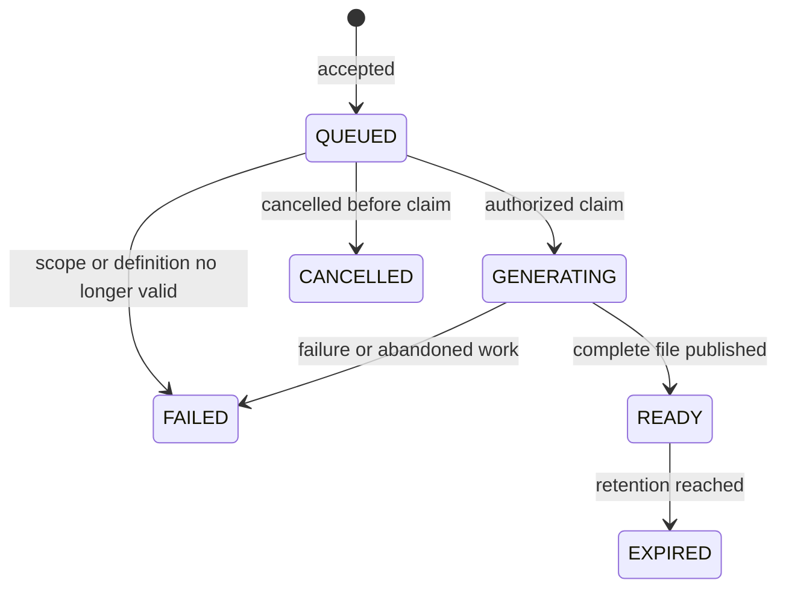

# Logical Model and Mapping Rules

This model defines responsibilities and observable data semantics. Physical
tables/classes follow current JPA and Liquibase conventions during
implementation. Clinical records remain in OpenELIS; no reporting database copy
is proposed.

## Report Source Definition

A versioned definition contains a stable identifier, label, supported source
mapping, available field/filter definitions, date meaning, record/group
identity, layout options and defaults. The instance can enable definitions and
supply its configured metadata. The three product report types use this common
mechanism.

| Reporting area               | Existing source evidence                                                                                | Date and row rules to prove                                                                                                                            |
| ---------------------------- | ------------------------------------------------------------------------------------------------------- | ------------------------------------------------------------------------------------------------------------------------------------------------------ |
| Sample & Testing             | Result → Analysis → SampleItem → Sample; configured tests/components and relevant patient/question data | Specimen collection date; independent result identity; specimen grouping for the spreadsheet                                                           |
| Referrals                    | Referral, its analysis/organization and related result records                                          | Referral request date, not sent/received date; one referred-analysis occurrence in the detailed view; preserve repeated linked results                 |
| Non-Conformance / Rejections | NcEvent with specimen links; recorded SampleQaEvent rejection occurrences where applicable              | Event date for NcEvent; explicitly labeled recorded-rejection date for legacy rejection records; distinct event identity, not QaEvent catalog identity |

T002/T020 establish actual relationships and date/value fixtures before
accepting the mappings. For non-conformance, do not substitute `reportDate` for
`dateOfEvent`. If a recorded rejection is represented by a linked
non-conformance event, do not count it twice. Do not infer equivalence from
matching accession or display text. Definitions distinguish event-date and
recorded-date semantics rather than hiding different timestamps behind an
unexplained label.

## Field Catalog

Combine application-defined common attributes with instance-configured items
from supported source mappings. Each field needs a stable identity, readable
label, value type, applicable layouts and source identity. The frontend consumes
the catalog; there is no seven/38/50-field cap.

Common attributes cover relevant sample/order, patient, result and turnaround
information in the product baseline. Configured items include tests, result
components, observation-history types and questionnaire items where a supported
mapping can resolve values. A new item of an already supported type needs no
reporting-code change. A new source type may require a mapping.

Names do not establish identity. Renames retain identity; duplicate labels do
not merge fields. Capture selected labels and source-definition version on
submission. Retired/retyped fields in a reopened draft need an explanation and
deliberate correction; do not silently retarget them. A null value in a
supported field is different from an unsupported field.

## Result Values and Two Layouts

Use the same normalized source records for both layouts. A result carries stable
identity, specimen/sample identity, configured test/component identity, value,
unit, status and relevant timestamps. Preserve separate specimens under one
accession. The specimen is the grouping unit for the default sample spreadsheet;
its identifier/label should be available alongside accession information.

**Detailed list**: one row per independent result, with common columns such as
Test Name, Component, Result Value and Result Unit. Selecting local tests
restricts the included result set; configured questions can supply additional
columns.

**Spreadsheet**: selected local tests/components supply column groups. Preserve
all repeats with continuation rows. Use actual event/group relationships when
present; otherwise keep unrelated repeated values separate with blank unrelated
test cells. Never cross-join repeat sets or pick only the latest result. Common
specimen metadata repeats as needed. Stable ordering uses meaningful timestamps
and identity tie-breaks; identical values do not justify deduplication.

When only specimen metadata is selected, the spreadsheet has one row per
eligible specimen; the detailed list still has one row per eligible result.
Display-value deduplication is never a substitute for the layout's declared
grouping identity.

Flat referral/event reports use the common tabular projection directly. A source
definition exposes only meaningful layouts; an event report does not need an
invented test pivot. The user's two-layout requirement applies to Sample &
Testing.

**Value rules**: Resolve dictionary display values, join a genuine multi-valued
result in one cell with `; `, preserve free text, and use applicable numeric
precision without assuming it exists. Do not use UI HTML encoding/truncation as
an export formatter. Prove grouped helper records versus independent results and
the linkage of configured components to actual readings. Use existing clinical
rules for reference ranges, abnormal flags and turnaround calculations; test
missing timestamps and relevant demographic context rather than invent values.

**Statuses**: Finalized is the default Sample & Testing filter. Supported status
choices use the existing status service. Corrected finalized results remain
included with current values; a correction awaiting finalization is excluded by
the default filter. Do not invent a standalone Corrected status enum.

**Dates**: Inclusive dates become the half-open interval from the start of the
first day to the start of the day after the last day, in the laboratory
timezone. Count calendar days across daylight saving changes. Null date anchors
do not match. Each definition declares its relevant anchor; never silently fall
back to order-entry time.

**Consistency**: A run reads current data during generation, not a historical
snapshot. Record start/completion times. Its completed file is immutable until
expiry and re-download returns those bytes.

## Draft and Shared Saved Definition

A draft retains source definition, filters, dates, selected layout and that
layout's ordered columns within the current user session. Retain filters and
per-layout column choices when switching layouts. Clear user-bound draft state
on sign-out/user change.

A saved definition contains identifier, name, source definition/version, layout,
ordered field identities, non-date filters, creator/change metadata and
concurrency version. It belongs to the instance's shared library. Existing
report users can reuse it; running it uses the runner's current access. Opening
a saved definition creates a draft and requires fresh dates. Copy/update/delete
actions do not change submitted jobs. No generated clinical values or file paths
belong in it.

## Job and Output

| Information          | Rules                                                                                                       |
| -------------------- | ----------------------------------------------------------------------------------------------------------- |
| Identifier and owner | Server identifier and authenticated runner; job/file operations remain owner-scoped                         |
| Frozen request       | Source/version, layout, ordered field identities and captured labels, dates, filters and resolved lab scope |
| Submission identity  | Owner plus client request identifier is unique; same key with changed request conflicts                     |
| Lifecycle            | State, timestamps, safe failure code, completed output row count and file size                              |
| Retry lineage        | New child job copies the failed parent's frozen request; current access is rechecked                        |
| Worker claim         | Atomic persisted ownership that distinguishes abandoned work from another live worker                       |
| Output               | Private server-owned reference and expiry deadline; no client-selected path                                 |

Retry creates a child, leaving the FAILED parent unchanged. Rerun from EXPIRED
restores non-date choices and requires fresh dates. GENERATING cannot be
cancelled. Retain terminal history, including cancelled jobs, in this MVP.

Stage output outside web-served content and publish it atomically. Clean partial
files after failure/recovery. Deny new downloads at expiry even if physical
cleanup runs later. Coordinate cleanup with already authorized file reads. Use
existing audit mechanisms for definition changes, submission, outcome, download,
retry, cancellation, expiry and denial; diagnostic logs omit result values.
