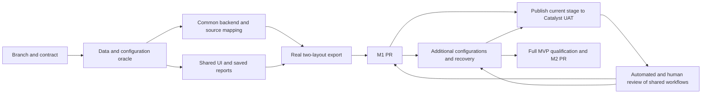

# Tasks: Configurable Reporting MVP

**Delivery update:** The [review stopping point](review-stopping-point.md)
now governs PR packaging: an official GitHub stack, one initial snapshot commit
per PR with ordinary follow-up commits for review repairs,
roughly 600 lines of real business logic (separate from markup, styles,
declarations, tests, fixtures, helpers and documentation), and separate
navigation changes. M1/M2 below retain functional traceability; their old
one-PR-per-milestone branch packaging is superseded. The full MVP scope remains.

**Inputs**: [spec.md](spec.md), [plan.md](plan.md),
[data-model.md](data-model.md), [contract](contracts/export-api.md),
[acceptance plan](quickstart.md), [UAT contract](uat.md).
**Current review/UAT checkpoint (September 14, Pacific time):** All ten stack
PRs are ready for review; none is merged. Public frontend `7cca586e58`, backend
`8005e4cc0b` and review tooling `2048bc3cfd` remain deployed. The focused public
run passed four checks covering both layouts at phone width and a saved report
rerun across distinct periods. [Recordings and actual CSVs](https://reporting.catalyst.openelis-global.org/reporting-evidence/20260914-uat-checkpoint-2048/)
are published. Submitted UI `568b745437` and navigation `9c1bfd713c` pass frontend
and full E2E CI; backend checks remain running at this checkpoint.
Grist publication is complete for currently executable stages: six stories and
23 steps. Non-Conformance and human acceptance remain open. See the current
receipt in `execution.md`; earlier snapshots below retain their historical scope.

**Earlier Referral qualification**: Sample & Testing, Referrals, queue recovery and configurable
navigation are publicly testable at frontend/backend/instance configuration
`d48cd790c492`. Six public checks pass for this Referral increment, including
actual CSV downloads, shared report reuse, desktop/phone Referral workflows,
Sample & Testing repeats/turnaround, and configured navigation. Direct public
screen comparison used the pinned mock at widths 1280 and 390.
Database section/icon editing and instance override protection remain deployed;
the earlier 10-check public navigation run and local restart/two-profile
qualification remain recorded separately. Runtime configuration `7780ee2cd9`
retains one application context. Review widget `54b99f8d76ba` is unchanged and
retains its earlier cross-tab verification. The live checklist still has six
stories and 17 steps: RPT-201, RPT-303 and RPT-504 are prepared, but publication
remains blocked by authoring access. Frontend, backend and translation CI pass
for `d48cd790c492`. Public queued cancellation now passes at both widths using
real 50,000-result exports; retry and expired re-run also pass publicly.
Non-Conformance, checklist publication, final audit and human acceptance remain open.
See the current receipt and remaining qualification in `execution.md`.
T027 now passes against the disposable local stack: both 50,000-result layouts,
bounded fetches, one worker, the five-job limit, ordinary reads and desktop/phone
downloads. These workload measurements are local; they are not public performance evidence.
T024/T028 now pass, including two real application processes, live lease renewal,
abandoned-only cleanup, queued completion and exact downloaded CSVs after killing
the temporary peer. T021 now includes the passed public queued-cancellation workflow.
T032, T033 and T035–T038 repeat for each usable stage. T034 remains partial until
all workflow fixtures are available. Public availability does not close M1 or M2.

Use one engine and configured source definitions. Complete useful functionality
first: instance-aware columns, both layouts, every repeated result and shared
saved reports. Existing data access is a background constraint. The ten-PR
delivery stack above packages these functional milestones. Tests for complex behavior precede implementation. `[P]` means work
can proceed independently after prerequisites, not an instruction to launch
agents.

For each usable iteration follow the [validation and review policy](uat.md#iteration-validation-and-review-responsibilities):
affected automated checks before merge, selected existing E2E workflows after
deployment, and concise Grist human feedback. Do not repeat heavy qualification
or every human step solely because another commit was created.

## M1 — One Engine and a Useful Native Reporting Workflow

**Goal**: Demonstrate US1–US3 with Sample & Testing through the common feature,
plus basic queue return visits from US4. This is a working first slice; M2
completes the other mock source definitions and operational qualification.

- [x] T001 Create `feat/479-ogc-479-reporting-mvp-m1-result-export` in its own
      worktree; refresh `develop`, confirm the spec PR exists, and read
      `specs/479-reporting-mvp/` plus current configuration/reporting
      conventions.
- [x] T002 [US1] Build independent fixture oracles and failing source/catalog
      tests under `src/test/java/org/openelisglobal/reports/dataexport/` with
      fixtures in `src/test/resources/`: specimen dates, patient/common
      attributes, corrections, components, dictionary/multi-valued/text values,
      precision and two instance configurations; verify adding/renaming a
      supported configured item without code edits.
- [x] T003 [US1] Add failing layout/CSV tests under
      `src/test/java/org/openelisglobal/reports/dataexport/` for ordered
      headers/cells, BOM, escaping, nulls, zero rows and both layouts; preserve
      every repeat and compare identity/value multiplicities without
      cross-products or latest-only selection.
- [ ] T004 [US3] Add failing ORM/persistence tests under
      `src/test/java/org/openelisglobal/reports/dataexport/` for source
      references, shared definitions, concurrent edits, immutable job requests,
      submission identity and migration/rollback.
      Partial: database-free ORM startup passes. Dedicated PostgreSQL tests now
      verify fresh initialization, full reporting rollback/reapply, and recovery
      upgrade/rollback over 50,000 jobs while retaining all prior job fields and
      shared-definition fields. A synchronized PostgreSQL two-editor regression
      now passes after correcting the losing write from a server error to the
      intended conflict response; see `code-qa.md`. Final assembled persistence
      and migration checks remain required.
- [x] T005 [US2] Add focused service/API tests under
      `src/test/java/org/openelisglobal/reports/dataexport/` for valid
      configured requests, existing access, owner-scoped files, idempotency and
      concurrent active-job limits; include a normal report user completing the
      flow without additional setup.
      Service/database checks and the two-user native browser flow pass; see
      Iteration 6 in `execution.md`. Access-negative browser cases remain in T016.
- [x] T006 [P] [US2] Add component tests in
      `frontend/src/components/reports/CustomDataExport/` for
      configuration-driven fields/filters, defaults, search/order, layout
      switching, retained edits, inline ready download and shared
      save/reopen/copy/update/delete with fresh dates.
- [x] T007 [P] [US1] Author real native reporting flows in
      `frontend/playwright/tests/foundational/core/custom-data-export.spec.ts`
      using `specs/479-reporting-mvp/quickstart.md`; validate `core-app`
      classification and follow the current Playwright author/audit workflow.
- [ ] T008 [US3] Implement shared-definition/job persistence under
      `src/main/java/org/openelisglobal/reports/dataexport/valueholder/` and
      `dao/`, with registered Liquibase migration and rollback under
      `src/main/resources/liquibase/3.6.x.x/`, making T004 pass.
- [x] T009 [US1] Implement validated report-source configuration and the common
      catalog under
      `src/main/java/org/openelisglobal/reports/dataexport/service/` using
      current configuration-loading conventions; load instance tests/components
      and supported additional fields by stable identity, without a fixed count
      or report-specific frontend list.
      The existing initializer now loads versioned `reporting-sources/*.json`
      into `CSV_SOURCE` definitions. Explicit defaults, dynamic group expansion
      and invalid-update preservation pass database tests. Iteration 8 verifies
      filter subsets in the builder, review, save and request paths, including
      real output after switching reports. Broader field and access-negative
      qualification remains in T016.
- [ ] T010 [US1] Implement the Sample & Testing source mapping and bounded
      parameterized queries under
      `src/main/java/org/openelisglobal/reports/dataexport/dao/` and `service/`,
      making T002 pass; document proven field/date/component mappings in
      `specs/479-reporting-mvp/data-model.md`.
- [x] T011 [US1] Implement common spreadsheet and detailed-list formatting under
      `src/main/java/org/openelisglobal/reports/dataexport/service/`, making
      T003 pass; preserve source identities, typed values, repeated results and
      captured labels without extending the legacy Routine CSV writer.
      Iteration 9 resolves the first-record turnaround defect. Real-database
      comparisons and browser downloads preserve per-test/repeat durations in
      both layouts, including missing intervals and renamed components.
- [ ] T012 [US2] Implement submission, bounded worker/atomic claims, private
      file publication, existing-access checks and download under
      `src/main/java/org/openelisglobal/reports/dataexport/service/`; retain
      ordinary audit, idempotency and admission limits, making T005 pass.
- [ ] T013 [US3] Implement thin common catalog/job and shared-definition
      endpoints/forms under
      `src/main/java/org/openelisglobal/reports/dataexport/controller/` and
      `form/` following `specs/479-reporting-mvp/contracts/export-api.md`; use
      shared instance scope for definitions and owner scope for jobs/files.
- [x] T014 [US1] Implement the common Carbon builder, source-driven
      fields/filters, both layouts and shared report reuse in
      `frontend/src/components/reports/CustomDataExport/`; wire Reports
      navigation and `frontend/src/languages/en.json`, preserving state and
      confirmations from T006. Use URL-owned navigation and session drafts as
      specified in the plan; verify Back/Forward, reload, deep links, late
      responses, keyboard focus and fresh-export reset.
- [ ] T015 [US4] Add inline job progress/ready download and the basic personal
      queue using current shared query utilities in
      `frontend/src/components/reports/CustomDataExport/`; wire configured
      limits/protected persistent output through existing deployment conventions
      and document settings in `specs/479-reporting-mvp/quickstart.md`.
- [ ] T016 [US1] Run focused backend, component and real-browser checks from
      `specs/479-reporting-mvp/quickstart.md`: compare both CSV layouts to
      records, verify configuration changes, repeat preservation and reuse by a
      second report user; inspect browser console/screenshots and ordinary
      access-negative cases.
- [ ] T017 Run applicable format/build/coverage checks and document tested
      revision and M1 evidence in `specs/479-reporting-mvp/quickstart.md`;
      confirm useful reporting works before expanding the source definitions.
- [ ] T018 Open the M1 PR to `develop`, linking the spec, UI evidence and actual
      CSV comparisons. Report current required CI results and the remaining M2
      scope; do not merge. Publish each usable stage through the UAT tasks below.

## M2 — Remaining Configurations and Recoverable Delivery

**Goal**: Complete the mock's source coverage using the same feature, complete
US4, and qualify the full workflow. There are no separate report-type
applications.

- [x] T019 Create `feat/479-ogc-479-reporting-mvp-m2-queue-recovery` in its own
      worktree from the M1 result; refresh branch/PR state and
      `specs/479-reporting-mvp/`.
- [ ] T020 [US1] Add failing fixture tests under
      `src/test/java/org/openelisglobal/reports/dataexport/` for Referral and
      Non-Conformance definitions: occurrence identity, applicable
      dates/statuses, repeated results, event/rejection links and avoiding
      duplicate occurrences; test an additional definition over an existing
      source with no frontend/queue code changes.
      Partial: nine real-database Referral checks now pass, including configured
      date/column mappings, pending and repeated results, interleaved multi-select
      returned dates and source-specific status defaults. Sent date and repeat
      preservation follow the pinned mock and explicit user instruction.
      Native rejection date coverage remains an unanswered product question;
      Non-Conformance activation and affected expectations remain open.
- [x] T021 [US4] Add failing lifecycle tests under
      `src/test/java/org/openelisglobal/reports/dataexport/` for retry lineage,
      queued cancellation, concurrent claims, restart/live-worker isolation,
      expiry/download races, partial-file cleanup and retained audit; add
      recovery browser tests under
      `frontend/playwright/tests/foundational/core/custom-data-export-recovery.spec.ts`.
      Seven new real-database checks pass for retry identity, cancellation,
      live/abandoned leases, publication, cleanup, an open download at expiry,
      concurrent claims and claim/cancel races. Failed retry and expired re-run also pass in the real browser with actual
      CSVs. Desktop/phone cancellation now passes locally and publicly using an
      ordinary queued report behind a real 50,000-result export. The 50,000-result workload
      now verifies the active-job limit and single-worker behavior. Full-suite fixture
      isolation now passes CI. A real local
      process kill/restart preserves queued and completed work, fails abandoned
      jobs, removes partial files and permits a successful linked retry; see the
      runtime qualification record. Two real application processes now prove
      live-worker lease renewal and output isolation after killing the other
      process, with exact CSV and interruption-audit checks. Cancellation
      confirmation/reload, no later claim and refused download pass publicly;
      publication of its RPT-303 checklist instruction remains under T036.
- [ ] T022 [US1] Add Referral and Non-Conformance source mappings/configured
      definitions using the same feature under
      `src/main/java/org/openelisglobal/reports/dataexport/` and the existing
      resource/configuration locations, making T020 pass; record exact date and
      event-link rules in `specs/479-reporting-mvp/data-model.md`.
      Partial: Referrals is connected and publicly validated at `d48cd790c492`
      through the existing builder, shared reports, queue and actual CSV at
      desktop/phone widths. Non-Conformance remains open.
- [x] T023 [US4] Implement failed-job retry and queued-only cancellation through
      the common service/controller paths under
      `src/main/java/org/openelisglobal/reports/dataexport/`, preserving
      immutable requests, source/version, layout, labels, current access and
      lineage.
- [x] T024 [US4] Implement abandoned-worker recovery, expiry enforcement and
      private-file cleanup under
      `src/main/java/org/openelisglobal/reports/dataexport/service/`, making
      T021 pass without interfering with another live application context.
      Backend lifecycle checks, actual restart/expiry and two-process crash
      isolation pass. The latter retains the live process/output while the
      unchanged five-minute lease expires for the killed worker only.
- [x] T025 [US4] Implement shared recovery controls and source-appropriate
      labels in `frontend/src/components/reports/CustomDataExport/` and
      `frontend/src/languages/en.json`; retain choices, require fresh dates for
      expired reruns and avoid report-specific screens.
- [ ] T026 [US1] Run the three configured source definitions through the common
      builder/saved-report/download flow; compare real fixture records and
      dates, test additional configuration without code changes, and audit the
      focused browser tests using `specs/479-reporting-mvp/quickstart.md`.
- [x] T027 [US4] Add/run a reproducible 50,000-result qualification using
      `projects/reporting-uat/qualify-workload.py`, the fixture under
      `src/test/resources/fixtures/`, the incremental Java writer test under
      `src/test/java/org/openelisglobal/reports/dataexport/` and browser downloads
      under `frontend/playwright/tests/performance/core/`; record expected counts, batches, memory, duration,
      worker limits and ordinary request behavior in
      `specs/479-reporting-mvp/quickstart.md`.
      The operational runner exercises the full running WAR, real database and
      HTTP queue so process memory, cursor fetches and concurrent ordinary reads
      are measured directly. This changes the test location, not the acceptance
      criteria. Both layouts preserve all 50,000 results, including 10,000 for
      one specimen. Two runs produce identical files; the final run samples
      concurrent states atomically. Public-server performance remains unmeasured.
- [x] T028 [US4] Verify migration/rollback on empty/populated disposable
      databases, persistent output, restart, retention and cleanup; document
      actual deployment settings/procedures and implementation evidence in
      `specs/479-reporting-mvp/quickstart.md`.
      Actual process interruption/restart and accelerated local expiry
      passed, including retained queued/completed work, cleanup, frozen settings
      and unaffected prior downloads. Fresh/populated database migration and
      rollback now pass through the actual Liquibase changelogs, including a
      50,000-job queue and retained shared definitions. Two-process crash
      isolation now passes with live lease renewal, abandoned-only cleanup,
      queued completion, linked retry and unchanged actual CSVs; see execution.md.
- [ ] T029 Verify every functional requirement and success criterion against
      implementation evidence; update
      `specs/479-reporting-mvp/checklists/requirements.md` and `quickstart.md`
      without conflating document validation, code tests, CI, deployment or user
      acceptance.
- [ ] T030 Run applicable formatter/build/coverage and required CI checks, audit
      the focused Playwright files and prepare the final evidence; do not run
      full E2E suites during ordinary development.
- [ ] T031 Open the M2 PR to `develop`, linking the completed configured-source
      and recovery evidence. State deployment/user-acceptance status separately;
      do not merge or deploy as part of this task.

## Continuous UAT Delivery — Publish Each Usable Stage

**Goal**: Keep the Catalyst UAT instance aligned with each usable development
stage. Automated end-to-end checks and human review exercise the same workflows,
fixtures and expected outcomes. Publish working stages with explicit known gaps;
do not wait for completion of the whole MVP. Full MVP acceptance remains a
separate completion criterion. Repeat these delivery tasks for each stage.

- [x] T032 Record the exact application revision, current CI and stage scope, then
      create a reproducible deployment candidate for
      `reporting.catalyst.openelis-global.org`. Record current Catalyst capacity,
      existing service ownership, backup and rollback inputs before mutation.
- [x] T033 Provision or update the reporting UAT application without changing
      the existing Catalyst UI, databases or unrelated CSiM deployments. Use
      persistent output storage and publish `/__review/target.json` only after
      backend, frontend, database migration and route health checks pass.
- [ ] T034 Seed idempotent, public synthetic reporting fixtures for the stable
      identifiers in `uat.md`, including repeated identical results, a referral,
      a non-conformance event, two report users and prepared queue states. Do
      not depend on browser-only test helpers.
      Current stage has persistent synthetic repeat/turnaround fixtures and two
      existing report users, failed/expired recovery examples, the three-row
      Referral fixture and the 50,000-result workload for repeatable queued
      cancellation. The Non-Conformance fixture remains open.
- [x] T035 Run the focused Playwright acceptance files against the deployed
      target, compare actual downloaded CSVs with the fixture oracle, and verify
      both Sample & Testing layouts, shared reuse, configured source reports and
      available queue behavior. Record failures and uncovered planned capabilities;
      they do not postpone access to other usable workflows.
- [x] T036 Create the `reporting` review in the central Grist document and apply
      the currently executable stages of the five stable UAT stories from `uat.md` through the review-tooling
      authoring path. Read before writing, inspect computed problems and verify
      the public checklist JSON after every change.
      Verified public revision `8b87c62931a3`: six stories and 23 steps.
      The newer split Referrals walkthrough was preserved; RPT-303 and RPT-504
      were added without changing any of the 21 preexisting step objects or
      reviewer results. Publication does not imply human acceptance.
- [x] T037 Inject the established review overlay into the reporting UAT host;
      configure authenticated submission against that OpenELIS backend; verify
      checklist loading, target identity, route capture, retained answers and a
      real submitted/downloaded review report.
- [x] T038 Record the deployed URL, exact application/review-tooling revisions,
      checklist revision, automated preflight evidence and remaining human UAT
      status in `execution.md`. Hand each usable stage to reviewers with its
      actual check results and known limitations; do not wait for the full MVP.

## Navigation Configuration Follow-through

The user requires the navigation cleanup to enhance both the database and
instance configuration layers. Preserve the public profile and the existing
reporting scope while completing the navigation contract in `plan.md`.

- [x] T039 Add regression coverage for section/icon database persistence and
      administrative save/reload, configuration precedence and removal,
      unchanged database defaults, unlisted extensions and existing filtering.
      Four new database checks prove persistence, overlay removal, preservation
      of older requests, and protection of database defaults during an overlaid
      save. Annotation startup and existing menu API/service checks pass. Three
      isolated migration checks include 1,000 menu entries and retain the existing
      reporting rollback coverage. The real local editor saves, reloads and
      restores a database icon; controlled fields remain read-only.
- [x] T040 Extend the existing menu model, service and administrative editing
      path with optional section/icon metadata and a versioned, reversible
      Liquibase migration. Use the same fields in JSON and the effective menu
      response. Make configuration-controlled values clear during editing and
      preserve deployments that do not supply the new fields. Make T039 pass.
- [x] T041 Verify two instance profiles without frontend changes, including
      persisted edits after restart and restoration after removing an override.
      Compare the effective sidebar with the mock at desktop and narrow widths,
      exercise route/history/draft behavior, and publish the working increment
      through T032–T038. Record database/editor support separately from the
      already published JSON presentation support.
      Application publication, all 10 public browser checks and actual local
      restart/two-profile/default-restoration checks now pass at `22e3a66b6175`.
      Review-picker regression tests and live refresh/reload/two-tab checks now
      pass at harness `54b99f8d76ba`. RPT-504 authoring is now published and
      read back at checklist revision `8b87c62931a3`; see `execution.md`.
      Human acceptance remains separate.

## Dependencies

T006/T007 may proceed alongside backend work after the contract and fixture
semantics are established. Coordinate shared files such as `en.json`. M2 depends
on the working M1 engine; separate source definitions do not imply independent
milestones or teams.

## Requirement Coverage

| Requirement | Implementation and verification tasks    |
| ----------- | ---------------------------------------- |
| FR-001      | T005, T013–T016                          |
| FR-002      | T002, T006, T009, T013, T014, T016       |
| FR-003      | T003, T006, T011, T014, T016             |
| FR-004      | T002, T005, T010, T014, T020, T022, T026 |
| FR-005      | T002, T009, T010, T014, T020, T022, T026 |
| FR-006      | T002, T003, T010, T011, T014, T016       |
| FR-007      | T006, T007, T014–T016                    |
| FR-008      | T006, T014, T015, T021, T025             |
| FR-009      | T005, T012, T013, T016, T021, T023       |
| FR-010      | T004, T005, T008, T012, T021, T023       |
| FR-011      | T007, T008, T013, T015, T021, T025       |
| FR-012      | T003, T011, T012, T016, T021, T024       |
| FR-013      | T005, T012, T013, T016, T021, T024       |
| FR-014      | T021, T023, T025, T028                   |
| FR-015      | T012, T015, T021, T024, T027, T028       |
| FR-016      | T021, T024, T025, T028                   |
| FR-017      | T005, T012, T021, T023, T025             |
| FR-018      | T005, T012, T021, T023, T024, T028       |
| FR-019      | T002, T006, T009, T013, T014, T016       |
| FR-020      | T005–T007, T014–T016                     |
| FR-021      | T004, T006, T008, T013, T014, T016       |
| FR-022      | T009, T013, T014, T020, T022, T026       |
| FR-023      | T032–T038                                |

CR-001–CR-005 are covered by the architecture, migration, test and milestone
tasks. SC-001–SC-003 and SC-007/008 are demonstrated in T016; SC-004 in
T021/T028; SC-005 in T016/T017/T026/T030; SC-006 in T027; and SC-009 in
T020/T026. SC-010 is established by T032–T038. T029 checks the complete
implementation evidence map; T038 closes the deployment/UAT-readiness map.

Personal-library/sharing administration, arbitrary source discovery, external
integrations, scheduling and separate synchronous generation are outside this
task list. Shared saved reports, patient information under existing access and
the mock's three source definitions are included.
