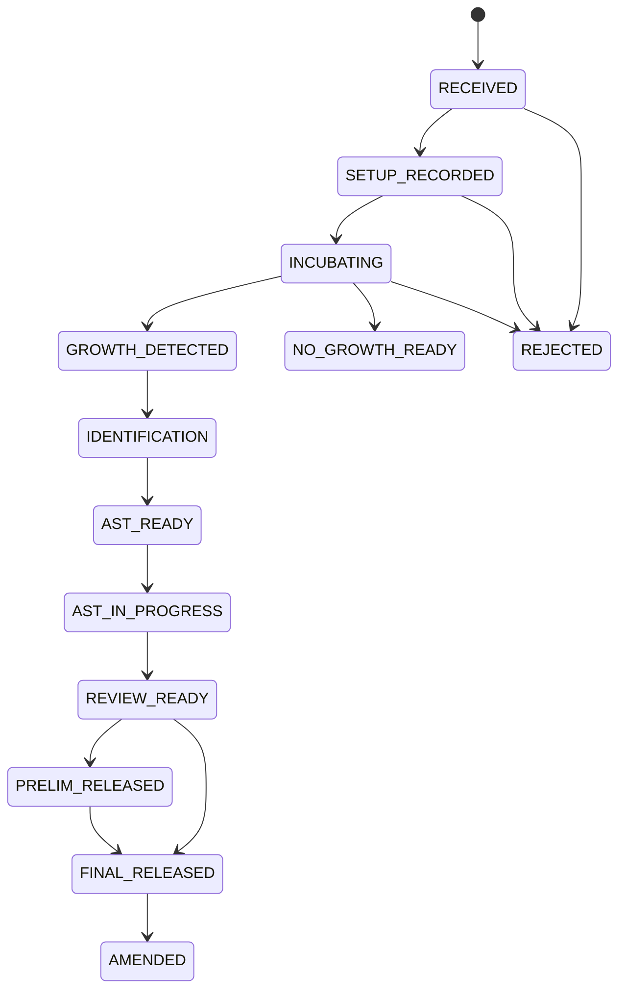

# Data Model: Microbiology MVP Workflow

This model is for implementation planning. It intentionally goes beyond the
product spec and may be refined during milestone tasks.

## Existing Anchors To Reuse

- `SampleItem`: physical specimen anchor for case identity.
- `Test`: ordered/catalog test; already has `domain` and
  `antimicrobialResistance`.
- `test_amr_config` and `whonet_antibiotic_codes`: existing AMR/WHONET
  groundwork.
- `Method` and `TestMethod`: existing test method/default-method configuration.
- `TestResultComponent`: supports labeled result components and
  `allow_multiple_readings`.
- `Result`, `Analysis`, result validation/reporting services: reuse for final
  reportable outputs where feasible.
- `Alert`: operational surfacing for critical microbiology communications.
- `WHONetReportService`: existing surveillance export path to extend.

## New Reference Concepts

### MicroWorkflowType

Enumeration for workflow routing and case identity.

- `BACTERIOLOGY`
- `MYCOBACTERIOLOGY_TB` reserved for TB cycle
- `MYCOLOGY` reserved for future cycle

Validation:

- MVP creates only `BACTERIOLOGY` cases.
- Reserved values may be stored in reference configuration but must not expose
  incomplete workflow screens as usable features.

### MicroCultureSetupRecipe

Microbiology metadata for a culture setup method.

Fields:

- `id`
- `methodId`
- `name`
- `workflowType`
- `mediaDefaults`
- `incubationDefaults`
- `atmosphereDefaults`
- `active`
- `lastUpdated`

Relationships:

- References existing `Method`.
- May be selected by default from a test's default method.

Validation:

- Active routine bacteriology tests must resolve to a usable recipe before case
  setup.
- Missing recipe blocks setup with a clear configuration error.

### MicroOrganism

Organism reference entry for identification and WHONET readiness.

Fields:

- `id`
- `displayName`
- `shortName`
- `whonetCode`
- `oclCode`
- `organismGroup`
- `active`
- `lastUpdated`

Validation:

- Active organism names must be unique within a deployment.
- WHONET readiness flags organisms without an export mapping.

### MicroAntibiotic

Antibiotic reference entry for AST panels and WHONET readiness.

Fields:

- `id`
- `displayName`
- `whonetCode`
- `antibioticClass`
- `active`
- `lastUpdated`

Relationships:

- May reuse or mirror `whonet_antibiotic_codes` for the WHONET code list.

Validation:

- WHONET-ready antibiotics require a WHONET code.

### MicroBreakpointStandard

Versioned AST interpretation standard.

Fields:

- `id`
- `authority` such as `CLSI` or `EUCAST`
- `version`
- `effectiveDate`
- `active`
- `lastUpdated`

Validation:

- A reading can be interpreted only when a matching active standard/rule exists.
- No-breakpoint results remain saveable but are marked for manual judgment.

### MicroAstPanel

Reusable AST panel for organism/specimen/workflow contexts.

Fields:

- `id`
- `name`
- `workflowType`
- `organismGroup`
- `specimenTypeId`
- `active`
- `lastUpdated`

Relationships:

- Has many panel antibiotics.
- Referenced when starting AST for an isolate.

## New Workflow Entities

### MicroCase

One microbiology workflow for one physical specimen.

Fields:

- `id`
- `sampleItemId`
- `workflowType`
- `stage`
- `priority`
- `cultureMethodId`
- `createdAt`
- `createdBy`
- `lastUpdated`
- `closedAt`
- `closedBy`
- `finalReleaseState`

Relationships:

- References one existing `SampleItem`.
- Has many `MicroCaseActivity`.
- Has zero or many `MicroIsolate`.
- Has zero or many `MicroCriticalCommunication`.

Uniqueness:

- Unique on `sampleItemId + workflowType`.

State transitions:

Validation:

- Final release requires all required isolate, AST, review, and critical
  follow-up work to be complete.
- Rejected/lost cases require reason and actor/time.
- Sibling workflows are found through shared `sampleItemId`.

### MicroCaseActivity

Timeline event for case actions and observations.

Fields:

- `id`
- `caseId`
- `activityType`
- `occurredAt`
- `performedBy`
- `note`
- `structuredData`
- `lastUpdated`

Validation:

- Activity type must be valid for the current case stage.
- Actor/time are required for clinical/audit events.

### MicroIsolate

Distinct organism identified from the case.

Fields:

- `id`
- `caseId`
- `isolateLabel`
- `organismId`
- `preliminaryOrganismText`
- `significance`
- `identificationStatus`
- `createdAt`
- `lastUpdated`

Relationships:

- Belongs to one `MicroCase`.
- Has zero or many `MicroAstRun`.

Validation:

- AST setup requires a clinically significant isolate with sufficient organism
  context.
- Reidentification preserves prior organism history through activity entries or
  versioning in a later amendment slice.

### MicroAstRun

AST workflow for one isolate and one panel/method.

Fields:

- `id`
- `isolateId`
- `panelId`
- `method`
- `breakpointStandardId`
- `status`
- `startedAt`
- `reviewedAt`
- `reviewedBy`
- `repeatReason`
- `lastUpdated`

Relationships:

- Belongs to one `MicroIsolate`.
- Has many `MicroAstReading`.

Validation:

- Only reviewed AST can satisfy final release readiness.
- Repeat/retest creates a new run or linked repeat record rather than
  overwriting prior readings.

### MicroAstReading

Antibiotic result inside an AST run.

Fields:

- `id`
- `astRunId`
- `antibioticId`
- `readingType`
- `readingValue`
- `readingUnit`
- `interpretedValue`
- `finalInterpretation`
- `overrideReason`
- `breakpointRuleId`
- `requiresManualJudgment`
- `lastUpdated`

Validation:

- Override requires a reason and preserves the original interpreted value.
- Missing breakpoint sets `requiresManualJudgment`.
- Numeric readings validate precision and allowed ranges by method.

### MicroCriticalCommunication

Clinical call/read-back communication log for urgent microbiology findings.

Fields:

- `id`
- `targetType`
- `targetId`
- `caseId`
- `recipientName`
- `recipientContact`
- `message`
- `method`
- `communicationStatus`
- `communicatedAt`
- `communicatedBy`
- `acknowledgedAt`
- `acknowledgedBy`
- `followUpRequired`
- `linkedAlertId`
- `lastUpdated`

Relationships:

- May link to one generic `Alert`.
- Targets case, isolate, sample, or result context.

Validation:

- Recipient may be free text when provider directory data is incomplete.
- Critical communication cannot be deleted after creation; correction is an
  additional activity/log entry.

## Computed Views

### MicrobiologyWorklist

Computed service response, not a dedicated table for MVP.

Fields:

- `caseId`
- `accessionNumber`
- `sampleItemId`
- `patientDisplay`
- `workflowType`
- `stage`
- `dueAction`
- `urgency`
- `hasSiblingWorkflow`
- `needsReview`
- `hasCriticalOpen`
- `lastActivityAt`

Validation:

- Filters and sorting must be stable for at least 200 in-flight seeded cases.

### WhonetReadiness

Computed readiness result over finalized microbiology cases.

Fields:

- `caseId`
- `organismStatus`
- `antibioticStatus`
- `specimenStatus`
- `breakpointStatus`
- `missingMappings`
- `ready`

Validation:

- Readiness reports missing mappings without blocking normal clinical case
  review or report release unless configured to do so.
