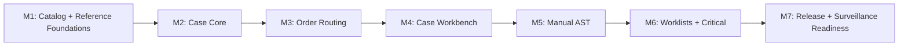

# Implementation Plan: Microbiology MVP Workflow

**Branch**: `spec/782-ogc-782-microbiology-mvp-spec` | **Date**: 2026-06-27 | **Spec**: [spec.md](./spec.md)
**Input**: Feature specification from `/specs/782-ogc-782-microbiology-mvp-spec/spec.md`

## Summary

Implement the microbiology MVP as a milestone-based OpenELIS module that routes
culture-capable ordered tests into a microbiology case, supports routine
bacteriology bench work, records isolates and manual AST, gates preliminary and
final release, logs critical communications, and prepares finalized data for
WHONET readiness. The plan uses the Confluence workflow narrative and
openelis-work M-* bundle as product evidence, but treats implementation-heavy
phrasing there as engineering input only.

The technical approach is to add a new `org.openelisglobal.microbiology`
backend area for the case workflow while reusing existing OpenELIS anchors:
`SampleItem` for specimen identity, Test Catalog and `test_amr_config` for AMR
configuration, `test_method`/Method for culture setup defaults,
`test_result_component.allow_multiple_readings` and existing result/reporting
infrastructure where feasible, generic Alerts for operational surfacing, and
existing WHONET services for surveillance export readiness.

## Technical Context

**Language/Version**: Java 21, JavaScript/React 17
**Primary Dependencies**: Spring Framework 6.2.2 traditional Spring MVC,
Hibernate/JPA, Liquibase, PostgreSQL, React Intl, Carbon Design System v1.15,
SWR, Formik/Yup where forms require validation
**Storage**: PostgreSQL through Hibernate/JPA valueholders and Liquibase XML
changesets
**Testing**: JUnit 4, Mockito 2, BaseWebContextSensitiveTest, MockMvc, ORM
validation tests, Vitest/React Testing Library, Playwright-first E2E planning
**Target Platform**: OpenELIS Global WAR deployed to Tomcat 10, React frontend
served by the existing OpenELIS web app
**Project Type**: Web application with traditional Spring MVC backend and React
frontend
**Performance Goals**: Worklist users can find urgent positive/growth/AST-review
work within 30 seconds in a seeded data set of at least 200 in-flight cases;
REST reads for worklist and case detail should target sub-second p95 in that
seeded data set; individual ORM validation tests must run in under 5 seconds
**Constraints**: Service-layer transactions only; no controller transactions;
Carbon-only UI; React Intl for all user-facing text; Liquibase-only schema
changes with rollback; configuration-driven variation; no product artifact may
force table, class, route, or storage decisions
**Scale/Scope**: MVP-1A routine bacteriology end-to-end with manual AST.
Analyzer ingestion, expert rules, TB/mycobacteriology, macro library, full
WHONET export automation, GLASS/FHIR surveillance, and antibiograms are later
slices unless explicitly pulled into a milestone.

## Constitution Check

_GATE: Passed before Phase 0 research. Re-check after Phase 1 design._

- [x] **Configuration-Driven**: Culture workflows, methods, panels,
      breakpoint standards, alert thresholds, and reporting variation are
      configuration/reference data, not country-specific branches.
- [x] **Carbon Design System**: New UI surfaces use `@carbon/react` and Carbon
      icons/tokens exclusively.
- [x] **FHIR/IHE Compliance**: MVP WHONET readiness is CSV/reporting-oriented;
      any future external FHIR push must use existing FHIR R4/IHE-aligned
      services and add `fhir_uuid` where entities become externally exposed.
- [x] **Layered Architecture**: Backend follows
      Valueholder -> DAO -> Service -> Controller -> Form/DTO. Controllers stay
      thin and non-transactional; services compile DTO data inside transactions.
- [x] **Test Coverage**: Unit, ORM validation, DAO/integration, controller,
      frontend unit, and Playwright E2E validation are planned for relevant
      milestones.
- [x] **Schema Management**: All schema changes go through versioned Liquibase
      XML changesets with rollback.
- [x] **Internationalization**: New UI strings go in `frontend/src/languages/en.json`
      and render via React Intl.
- [x] **Security & Compliance**: RBAC, audit trail, actor/time capture, input
      validation, and clinical communication history are explicit requirements.
- [x] **Legacy Code Removal**: Existing result, alert, Test Catalog, and WHONET
      paths are reused only when they fit the target architecture; no parallel
      legacy exporter or duplicate alert dashboard is planned.

## Clarification Result

`/speckit.clarify` was applied conceptually against the active spec. No
critical product ambiguities were detected that justified stopping for a formal
question. Remaining choices are engineering planning decisions captured in
`research.md` and this plan.

## Milestone Plan

_GATE: This feature exceeds three days; each milestone is intended as one PR._

### Milestone Table

| ID | Branch Suffix | Scope | User Stories | Verification | Depends On |
| --- | --- | --- | --- | --- | --- |
| M1 | `m1-catalog-reference-foundations` | Minimal microbiology reference/config foundation: workflow type on culture-capable tests, organism/antibiotic seeds, AST panel model, breakpoint standard/version import, culture method metadata | US1, US3, US6 | Liquibase rollback test, ORM validation, reference lookup unit tests, Test Catalog save/load regression tests | - |
| M2 | `m2-case-core` | Backend case core: microbiology case, activity timeline, isolate lifecycle, case DTO compilation anchored to `SampleItem + workflow` | US2 | Service unit tests, DAO/integration tests, uniqueness and sibling workflow tests, no controller transaction scan | M1 |
| M3 | `m3-order-routing` | Order/sample save hook that creates or finds the correct microbiology case from ordered test workflow configuration | US1 | Integration test for non-micro order, bacteriology order, and bacteriology + TB sibling workflows on one SampleItem | M2 |
| M4 | `m4-case-workbench` | REST and React case workbench for setup, incubation/growth/no-growth/rejection events, isolate creation/update, and case history | US2 | MockMvc controller tests, React interaction tests, Playwright case-workflow smoke plan | M3 |
| M5 | `m5-manual-ast` | Manual AST setup, readings, S/I/R interpretation, no-breakpoint handling, repeat/retest, review, and override audit | US3 | Breakpoint interpretation unit tests, AST persistence integration tests, frontend AST interaction tests | M4 |
| M6 | `m6-worklists-critical` | Shared microbiology worklist, due-action prioritization, sibling visibility, critical communication log, and operational alert surfacing | US4, US5 | Worklist filter/sort tests, alert integration tests, critical communication audit tests, accessibility checks | M5 |
| M7 | `m7-release-surveillance-readiness` | Preliminary/final readiness gates, report release handoff, amendment-safe history, and WHONET readiness extension over finalized cases | US5, US6 | Release-blocking integration tests, WHONET readiness tests, Playwright release/readiness flow | M6 |

### Milestone Dependency Graph



### PR Strategy

- **Spec PR**: `spec/782-ogc-782-microbiology-mvp-spec` -> `develop`
- **Milestone PRs**:
  - `feat/782-ogc-782-microbiology-mvp-m1-catalog-reference-foundations`
  - `feat/782-ogc-782-microbiology-mvp-m2-case-core`
  - `feat/782-ogc-782-microbiology-mvp-m3-order-routing`
  - `feat/782-ogc-782-microbiology-mvp-m4-case-workbench`
  - `feat/782-ogc-782-microbiology-mvp-m5-manual-ast`
  - `feat/782-ogc-782-microbiology-mvp-m6-worklists-critical`
  - `feat/782-ogc-782-microbiology-mvp-m7-release-surveillance-readiness`

## Project Structure

### Documentation (this feature)

```text
specs/782-ogc-782-microbiology-mvp-spec/
├── spec.md
├── plan.md
├── research.md
├── data-model.md
├── quickstart.md
├── checklists/
│   └── requirements.md
└── contracts/
    └── microbiology-openapi.yaml
```

### Source Code (future milestone branches)

```text
src/main/java/org/openelisglobal/microbiology/
├── controller/
├── dao/
├── daoimpl/
├── form/
├── service/
└── valueholder/

src/main/resources/liquibase/3.5.x.x/
└── 05x-microbiology-mvp-*.xml

src/test/java/org/openelisglobal/microbiology/
├── controller/
├── service/
└── Microbiology*IntegrationTest.java

frontend/src/components/microbiology/
├── MicrobiologyWorklist.jsx
├── MicrobiologyCaseView.jsx
├── AstEntryPanel.jsx
├── CriticalCommunicationPanel.jsx
└── __tests__/

frontend/src/pages/
└── MicrobiologyPage.jsx

frontend/tests/e2e/
└── microbiology-mvp.spec.ts
```

**Structure Decision**: Use a dedicated `microbiology` backend package for the
new case workflow, while integrating with existing `sampleitem`, `test`,
`testcatalog`, `method`, `result`, `alert`, and `reports` services through
service-layer dependencies. Use `frontend/src/components/microbiology/` for the
new workflow UI and add routes in `frontend/src/App.jsx`.

## Complexity Tracking

No constitution violations are planned. The only complexity risk is the AST
storage bridge between microbiology workflow state and existing result/reporting
behavior; this is addressed as an explicit M5 validation gate rather than hidden
inside product requirements.

## Testing Strategy

**Reference**: [OpenELIS Testing Roadmap](../../.specify/guides/testing-roadmap.md)

### Coverage Goals

- **Backend**: >80% code coverage for new service/controller code, measured via
  JaCoCo where available.
- **Frontend**: >70% code coverage for new React components.
- **Critical Paths**: 100% targeted coverage for order routing, case identity,
  AST interpretation/override, final-release gating, and critical communication
  audit behavior.

### Test Types

- [x] **Unit Tests**: JUnit 4 + Mockito service tests for routing decisions,
      state transitions, readiness gates, breakpoint interpretation, and
      override validation.
- [x] **DAO/Integration Tests**: `BaseWebContextSensitiveTest` tests for
      persistence, uniqueness, sibling workflow lookup, read-after-write, and
      rollback-safe migrations.
- [x] **Controller Tests**: MockMvc tests using `BaseWebContextSensitiveTest`
      for REST status codes, validation errors, auth/RBAC, and JSON shape.
- [x] **ORM Validation Tests**: Fast mapping tests for all new valueholders and
      relationships, under 5 seconds and without a database connection.
- [x] **Frontend Unit Tests**: Vitest/React Testing Library interaction tests
      for worklist filters, case timeline actions, AST entry, override reason
      handling, critical communication panel, and i18n rendering.
- [x] **E2E Tests**: Playwright-first flows planned through
      `/plan-record-playwright`; cover order -> worklist -> setup -> isolate ->
      AST -> review -> blocked/final release. Cypress is not expanded unless a
      project blocker prevents Playwright.

### Test Data Management

- Backend unit tests use builders/factories and avoid assert-on-mock-return
  patterns.
- Integration tests seed micro reference data through test fixtures or focused
  Liquibase-backed setup; mutation tests assert real persisted effects.
- Frontend tests mock API utilities at the utility boundary and verify URL,
  CSRF, and payload shape.
- E2E setup uses API/fixture setup rather than UI setup and does not stub the
  mutation endpoint under test.

### Checkpoint Validations

- **After M1**: Liquibase update/rollback path, ORM validation, reference lookup
  tests, Test Catalog regression tests.
- **After M2**: Case service and DAO/integration tests, uniqueness and sibling
  lookup tests.
- **After M3**: Order-routing integration tests for micro, non-micro, and
  sibling workflows.
- **After M4**: Controller and frontend case workbench tests; Playwright smoke
  plan drafted.
- **After M5**: AST interpretation, override, repeat/retest, and review gate
  tests.
- **After M6**: Worklist prioritization, alert surfacing, critical
  communication audit, accessibility checks.
- **After M7**: Release readiness, report handoff, WHONET readiness, and
  Playwright happy-path/blocking-path flows.

## Phase 1 Design Outputs

- [research.md](./research.md): Engineering decisions and alternatives.
- [data-model.md](./data-model.md): Proposed entities, relationships, states,
  and validation rules.
- [contracts/microbiology-openapi.yaml](./contracts/microbiology-openapi.yaml):
  REST contract for planning and later contract tests.
- [quickstart.md](./quickstart.md): Developer validation guide for the spec and
  first implementation slices.

## Post-Design Constitution Check

- [x] Plan still separates Casey/product intent from engineering decisions.
- [x] No schema/API/class names were added to product requirements in
      `spec.md`.
- [x] Milestones are reviewable as separate PRs.
- [x] Test strategy references the Testing Roadmap and names useful validation
      points.
- [x] No custom CSS framework, native SQL plan, controller transaction, or
      parallel alert/export dashboard is introduced.
