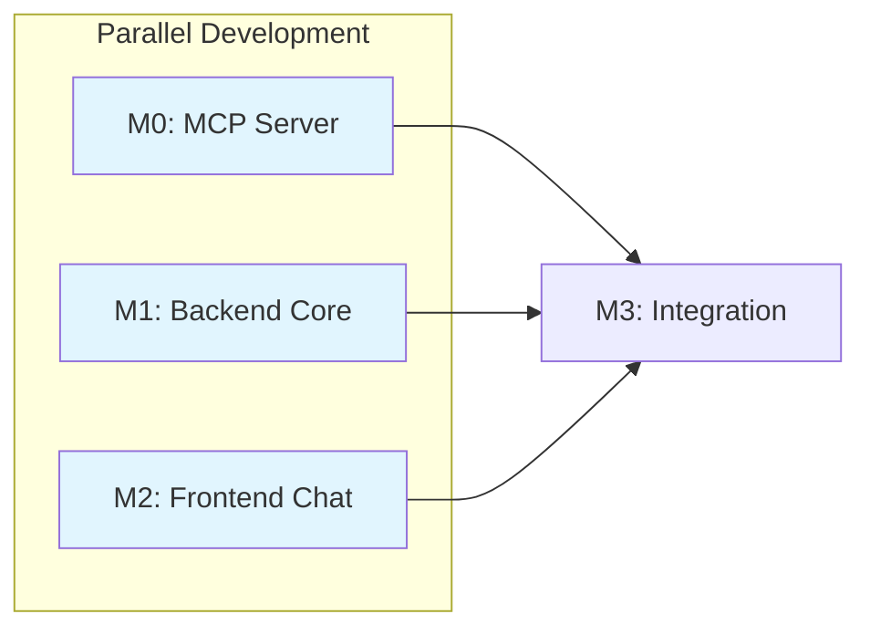

# Implementation Plan: Catalyst - LLM-Powered Lab Data Assistant

**Branch**: `spec/OGC-070-catalyst-assistant` | **Date**: 2026-01-21 | **Spec**:
[spec.md](./spec.md)  
**Jira**: [OGC-70](https://uwdigi.atlassian.net/browse/OGC-70)

## Summary

Catalyst enables lab managers to query OpenELIS data using natural language. The
system converts plain-language questions into SQL queries, executes them against
a read-only database connection, and displays results. **The core privacy
constraint is that the LLM receives only schema metadata, never patient data.**

**Primary Goal**: Rapid MVP prototype (2-3 sprints) that validates the
chat→SQL→results flow with standards-based architecture (MCP for schema
retrieval).

**Key Architectural Decision**: MVP will pilot a **standalone Python MCP
server** for schema retrieval to validate standards-based architecture early
(per clarification session 2026-01-20).

## Technical Context

**Language/Version**:

- Java 21 LTS (OpenJDK/Temurin) - OpenELIS backend
- Python 3.11+ - MCP Schema Server

**Framework**: Spring Framework 6.2.2 (Traditional Spring MVC - NOT Spring Boot)

**Primary Dependencies**:

- Backend (Java): LangChain4j 1.10.0 (core, ollama, open-ai, google-ai-gemini
  modules), MCP Java SDK 0.8.0, Hibernate 6.x, Jakarta EE 9
- MCP Server (Python): mcp SDK, langchain, chromadb (for RAG embeddings)
- Frontend: React 17, @carbon/react v1.15, @carbon/ai-chat v1.0, React Intl

**LLM Providers (MVP)**:

- **Cloud**: OpenAI (GPT-4o), Google Gemini (gemini-1.5-pro)
- **Local**: Ollama (SQLCoder-7B), LM Studio (OpenAI-compatible API)

**Storage**: PostgreSQL 14+ (OpenELIS database - read-only for Catalyst
queries)  
**Testing**: JUnit 4 + Mockito (backend), pytest (MCP server), Jest + React
Testing Library (frontend), Cypress 12.17 (E2E)  
**Target Platform**: Docker containers deployed via existing OpenELIS
infrastructure  
**Project Type**: Multi-service application (Java backend + Python MCP server +
React frontend)  
**Performance Goals**: Query response <10s for <1000 rows, SQL generation
success >80%  
**Constraints**: LLM never receives patient data, read-only database access,
<10k row limit  
**Scale/Scope**: Single-user MVP, production will support concurrent OpenELIS
users

## Constitution Check

_GATE: Verified before research. Re-check after design._

- [x] **Configuration-Driven (I)**: LLM provider selection via properties file,
      not code branches
- [x] **Carbon Design System (II)**: @carbon/ai-chat for chat UI, no
      Bootstrap/Tailwind
- [x] **FHIR/IHE Compliance (III)**: N/A for MVP (internal read-only queries),
      future phases may expose FHIR resources
- [x] **Layered Architecture (IV)**:
  - CatalystQuery valueholder → CatalystQueryDAO → CatalystQueryService →
    CatalystRestController
  - JPA/Hibernate annotations (NO XML mappings)
  - @Transactional in services ONLY
- [x] **Test Coverage (V)**:
  - Unit tests for service layer (>80% target)
  - ORM validation test for entity mappings
  - One E2E test for MVP (chat→SQL→results flow)
  - Cypress best practices (V.5): individual test execution, console log review
- [x] **Schema Management (VI)**: Liquibase changesets for audit log table
- [x] **Internationalization (VII)**: All UI strings via React Intl (en, fr
      minimum)
- [x] **Security & Compliance (VIII)**:
  - RBAC (MVP): Blocked-table list only (no per-user / row-level enforcement in
    MVP)
  - Audit: Log all generated queries with user ID + timestamp
  - Validation: Block restricted tables (sys_user, login_user)
- [x] **Spec-Driven Iteration (IX)**: Milestones defined below, each milestone =
      1 PR

**No complexity justifications required** - all approaches use standard
patterns.

## Milestone Plan

_Features >3 days MUST define milestones per Constitution Principle IX._

### Milestone Table

| ID     | Branch Suffix    | Scope                                      | User Stories            | Verification                       | Depends On |
| ------ | ---------------- | ------------------------------------------ | ----------------------- | ---------------------------------- | ---------- |
| M0     | m0-mcp-server    | Python MCP server for schema RAG retrieval | US1 (partial), US2      | MCP tools callable, pytest passes  | -          |
| [P] M1 | m1-backend-core  | LLM config, MCP client, query service      | US1 (partial), US2, US3 | Unit tests pass, ORM test passes   | -          |
| [P] M2 | m2-frontend-chat | Carbon chat sidebar, i18n, basic UI        | US1 (partial)           | Jest tests pass, renders correctly | -          |
| M3     | m3-integration   | REST controller, SQL execution, E2E test   | US1, US4                | Integration + E2E tests pass       | M0, M1, M2 |

**Legend**:

- **[P]**: Parallel milestone - M0, M1, M2 can be developed simultaneously
- **Sequential** (no prefix): M3 requires M0 + M1 + M2 to complete

### Milestone Details

#### M0: MCP Schema Server (Estimate: 3-4 days) [PARALLEL]

**Scope**:

- Python MCP server exposing schema retrieval tools
- RAG-based schema filtering using embeddings (ChromaDB)
- MCP tools: `get_relevant_tables`, `get_table_ddl`, `get_relationships`
- Docker container for deployment alongside OpenELIS

**Files to Create**:

```
projects/catalyst/catalyst-mcp/
├── pyproject.toml                         # Python dependencies
├── Dockerfile                             # Container build
├── src/
│   ├── __init__.py
│   ├── server.py                          # MCP server entry point
│   ├── tools/
│   │   ├── __init__.py
│   │   ├── schema_tools.py                # get_relevant_tables, get_table_ddl
│   │   └── relationship_tools.py          # get_relationships
│   ├── rag/
│   │   ├── __init__.py
│   │   ├── embeddings.py                  # Schema embedding generation
│   │   └── retriever.py                   # ChromaDB vector search
│   └── db/
│       ├── __init__.py
│       └── schema_extractor.py            # PostgreSQL schema extraction
├── tests/
│   ├── __init__.py
│   ├── test_schema_tools.py
│   └── test_retriever.py
└── config/
    └── mcp_config.yaml                    # Server configuration

projects/catalyst/catalyst-dev.docker-compose.yml  # Add MCP server service
```

**Verification**:

- pytest: All MCP tool tests pass
- Manual: MCP server responds to tool calls via Streamable HTTP (SSE optional
  for streaming)
- Integration: Java backend can call MCP tools

---

#### M1: Backend Core (Estimate: 4-5 days) [PARALLEL]

**Scope**:

- MCP client integration (connect to Python MCP server)
- LLM provider abstraction (LangChain4j with OpenAI/Gemini/Ollama/LM Studio)
- CatalystQueryService with text-to-SQL prompt construction
- Privacy guardrails (blocked tables, schema-only context)
- CatalystQuery valueholder + DAO for audit logging (provider type/id, PHI
  gating flag, schema tables used; do not persist raw schema context)

**Files to Create**:

```
src/main/java/org/openelisglobal/catalyst/
├── config/
│   ├── CatalystLLMConfig.java             # LangChain4j provider switching
│   └── CatalystMCPConfig.java             # MCP client configuration
├── mcp/
│   ├── MCPSchemaClient.java               # MCP client for schema tools
│   └── MCPSchemaClientImpl.java
├── service/
│   ├── CatalystQueryService.java          # Text-to-SQL generation
│   └── CatalystQueryServiceImpl.java
├── valueholder/CatalystQuery.java         # Audit entity
├── dao/
│   ├── CatalystQueryDAO.java
│   └── CatalystQueryDAOImpl.java
└── guardrails/SQLGuardrails.java          # Blocked tables, validation

src/main/resources/liquibase/catalyst/     # Audit table changeset
volume/properties/catalyst.properties      # Provider + MCP configuration
```

**Verification**:

- Unit tests: CatalystQueryServiceTest (mocked MCP + LLM), SQLGuardrailsTest
- ORM validation test: HibernateMappingValidationTest (CatalystQuery entity)
- Integration: MCP client successfully calls Python server

#### M2: Frontend Chat (Estimate: 3-4 days) [PARALLEL]

**Scope**:

- CatalystSidebar component using @carbon/ai-chat
- Internationalized strings (en.json, fr.json)
- Query input, response display, SQL preview
- Loading states, error handling

**Files to Create**:

```
frontend/src/components/catalyst/
├── CatalystSidebar.jsx                    # Main sidebar component
├── ChatInterface.jsx                      # Chat message list
├── QueryInput.jsx                         # Text input with submit
├── ResultsDisplay.jsx                     # Table/JSON display
├── SQLPreview.jsx                         # Generated SQL preview
└── index.js                               # Module exports

frontend/src/languages/en.json             # Add catalyst.* keys
frontend/src/languages/fr.json             # Add catalyst.* keys
```

**Verification**:

- Jest tests: CatalystSidebar.test.jsx, ChatInterface.test.jsx
- Manual: Component renders, i18n works for en/fr

#### M3: Integration (Estimate: 3-4 days)

**Scope**:

- CatalystRestController with /rest/catalyst/query endpoint
- SQL execution against read-only database connection
- Response formatting (table, JSON, CSV export)
- Full E2E test proving chat→SQL→results flow

**Files to Create**:

```
src/main/java/org/openelisglobal/catalyst/
├── controller/CatalystRestController.java
├── form/CatalystQueryForm.java
└── form/CatalystQueryResponse.java

frontend/cypress/e2e/catalyst.cy.js        # E2E test
```

**Verification**:

- Controller integration test: POST /rest/catalyst/query returns valid response
- E2E test: User types query → sees SQL preview → confirms → sees results

### Milestone Dependency Graph



### PR Strategy

- **Spec PR**: `spec/OGC-070-catalyst-assistant` → `develop` (this spec + plan)
- **M0 PR**: `feat/OGC-070-catalyst-assistant-m0-mcp-server` → `develop`
- **M1 PR**: `feat/OGC-070-catalyst-assistant-m1-backend-core` → `develop`
- **M2 PR**: `feat/OGC-070-catalyst-assistant-m2-frontend-chat` → `develop`
- **M3 PR**: `feat/OGC-070-catalyst-assistant-m3-integration` → `develop`

**Estimated Total**: ~13-17 days (2-3 sprints) for working MVP with MCP
architecture

### Future Phases (Post-MVP)

| Phase   | Scope                                         | Prerequisite     |
| ------- | --------------------------------------------- | ---------------- |
| Phase 2 | A2A Agent orchestration, multi-agent refactor | MVP validated    |
| Phase 3 | Report storage, scheduling, dashboards        | Phase 2 complete |

## Project Structure

### Repository Scoping (Tooling Under `projects/`)

To keep Catalyst work scoped and reviewable, **supporting services and tooling**
(e.g., the Python MCP server and Catalyst-specific Docker Compose) live under:

- `projects/catalyst/`

Only **required OpenELIS integration changes** should touch:

- Backend: `src/main/java/org/openelisglobal/catalyst/`
- Frontend: `frontend/src/components/catalyst/`
- Config: `volume/properties/catalyst.properties`

### Documentation (this feature)

```text
specs/OGC-070-catalyst-assistant/
├── spec.md              # Feature specification
├── plan.md              # This file
├── research.md          # Technology research
├── data-model.md        # Entity documentation
├── quickstart.md        # Developer quick start
├── contracts/           # API contracts
│   └── catalyst-api.yaml
└── checklists/
    └── requirements.md  # Quality checklist
```

### Source Code (repository root)

```text
# MCP Schema Server (Python - Standalone)
projects/catalyst/catalyst-mcp/
├── pyproject.toml
├── Dockerfile
├── src/
│   ├── server.py                # MCP entry point
│   ├── tools/                   # MCP tool implementations
│   ├── rag/                     # Embedding + retrieval
│   └── db/                      # Schema extraction
├── tests/                       # pytest tests
└── config/
    └── mcp_config.yaml

# Backend (Java - Traditional Spring MVC)
src/main/java/org/openelisglobal/catalyst/
├── config/              # LLM + MCP configuration
├── mcp/                 # MCP client for schema tools
├── controller/          # REST endpoints
├── dao/                 # Data access
├── form/                # Request/response DTOs
├── guardrails/          # SQL validation
├── service/             # Business logic
└── valueholder/         # JPA entities

src/main/resources/liquibase/catalyst/
└── catalyst-001-create-audit-table.xml

src/test/java/org/openelisglobal/catalyst/
├── service/             # Unit tests
├── mcp/                 # MCP client tests
├── controller/          # Integration tests
└── HibernateMappingValidationTest.java

# Frontend (React + Carbon)
frontend/src/components/catalyst/
├── CatalystSidebar.jsx
├── ChatInterface.jsx
├── QueryInput.jsx
├── ResultsDisplay.jsx
├── SQLPreview.jsx
└── __tests__/           # Jest tests

frontend/cypress/e2e/
└── catalyst.cy.js       # E2E test

# Configuration
volume/properties/catalyst.properties    # LLM + MCP settings
projects/catalyst/catalyst-dev.docker-compose.yml  # MCP server + Ollama
```

**Structure Decision**: Multi-service architecture - Python MCP server for
schema retrieval (standards-based), Java backend for orchestration + SQL
execution, React frontend for chat UI.

## Testing Strategy

**Reference**: [OpenELIS Testing Roadmap](.specify/guides/testing-roadmap.md)

### Coverage Goals

- **Backend**: >80% for service layer (JaCoCo)
- **Frontend**: >70% for catalyst components (Jest)
- **Critical Paths**: 100% coverage for SQL guardrails (blocked tables,
  injection prevention)

### Test Types

- [x] **MCP Server Tests**: Python (pytest)

  - `test_schema_tools.py` - Test MCP tool implementations
  - `test_retriever.py` - Test RAG embedding search
  - **SDD Checkpoint**: After M0, all pytest tests MUST pass

- [x] **Unit Tests**: Service layer (JUnit 4 + Mockito)

  - `CatalystQueryServiceTest` - Mock MCP + LLM responses, test prompt
    construction
  - `MCPSchemaClientTest` - Mock MCP server, test client calls
  - `SQLGuardrailsTest` - Test blocked table detection, SQL validation
  - Template: `.specify/templates/testing/JUnit4ServiceTest.java.template`
  - **SDD Checkpoint**: After M1, all unit tests MUST pass

- [x] **ORM Validation Tests**: Entity mapping (Constitution V.4)

  - `HibernateMappingValidationTest` - Validate CatalystQuery entity mappings
  - MUST execute in <5 seconds, MUST NOT require database
  - **SDD Checkpoint**: After M1, ORM test MUST pass

- [x] **Controller Tests**: REST endpoints (BaseWebContextSensitiveTest)

  - `CatalystRestControllerTest` - Test /rest/catalyst/query endpoint
  - Template: `.specify/templates/testing/WebMvcTestController.java.template`
  - **SDD Checkpoint**: After M3, integration tests MUST pass

- [x] **Frontend Unit Tests**: React components (Jest + RTL)

  - `CatalystSidebar.test.jsx` - Component rendering, i18n
  - `ChatInterface.test.jsx` - Message display
  - Template: `.specify/templates/testing/JestComponent.test.jsx.template`
  - **SDD Checkpoint**: After M2, Jest tests MUST pass

- [x] **E2E Tests**: Critical workflow (Cypress)
  - `catalyst.cy.js` - Full chat→SQL→results flow
  - Run individually during development (Constitution V.5)
  - Template: `.specify/templates/testing/CypressE2E.cy.js.template`
  - **SDD Checkpoint**: After M3, E2E test MUST pass

### Test Data Management

- **Backend Unit Tests**: Mock LLM responses for deterministic testing

  ```java
  // Canned responses for predictable tests
  when(mockLLM.generate(anyString())).thenReturn(
      "SELECT COUNT(*) FROM sample WHERE entered_date = CURRENT_DATE"
  );
  ```

- **E2E Tests (Cypress)**:
  - Use `cy.intercept()` to spy on /rest/catalyst/query (NOT stub)
  - Use existing OpenELIS test database with sample data
  - Login via `cy.session()` (Constitution V.5)

### Checkpoint Validations

- [x] **After M0 (MCP Server)**: pytest tests MUST pass, MCP tools callable
- [x] **After M1 (Backend Core)**: ORM validation + unit tests MUST pass
- [x] **After M2 (Frontend Chat)**: Jest tests MUST pass
- [x] **After M3 (Integration)**: Controller integration tests + E2E test MUST
      pass

## LLM Integration Approach

### Provider Abstraction (4 Providers)

```java
// CatalystLLMConfig.java - Provider switching via configuration
@Configuration
public class CatalystLLMConfig {

    @Value("${catalyst.llm.provider:ollama}")
    private String provider;

    @Bean
    public ChatLanguageModel chatLanguageModel() {
        return switch (provider) {
            case "openai" -> OpenAiChatModel.builder()
                .apiKey(System.getenv("OPENAI_API_KEY"))
                .modelName("gpt-4o")
                .build();
            case "gemini" -> GoogleAiGeminiChatModel.builder()
                .apiKey(System.getenv("GOOGLE_API_KEY"))
                .modelName("gemini-1.5-pro")
                .build();
            case "ollama" -> OllamaChatModel.builder()
                .baseUrl(ollamaBaseUrl)
                .modelName("sqlcoder:7b")
                .build();
            case "lmstudio" -> OpenAiChatModel.builder()
                .baseUrl(lmStudioBaseUrl)  // OpenAI-compatible API
                .apiKey("not-needed")
                .modelName("local-model")
                .build();
            default -> throw new IllegalStateException("Unknown provider: " + provider);
        };
    }
}
```

### MCP-Based Schema Retrieval

**Transport note**: Use MCP **Streamable HTTP** transport (SSE optional for
streaming). See
`https://modelcontextprotocol.io/specification/2025-11-25/basic/transports`.

```java
// MCPSchemaClient.java - Get relevant schema via MCP tools
public interface MCPSchemaClient {
    // Call MCP server's get_relevant_tables tool
    List<String> getRelevantTables(String userQuery);

    // Call MCP server's get_table_ddl tool
    String getTableDDL(String tableName);

    // Call MCP server's get_relationships tool
    List<Relationship> getRelationships(List<String> tableNames);
}

// CatalystQueryServiceImpl.java - Uses MCP for schema context
public String generateSQL(String userQuery) {
    // 1. Get relevant tables via RAG (MCP tool)
    List<String> relevantTables = mcpClient.getRelevantTables(userQuery);

    // 2. Get DDL for relevant tables only (MCP tool)
    String schemaContext = relevantTables.stream()
        .map(mcpClient::getTableDDL)
        .collect(Collectors.joining("\n"));

    // 3. Construct prompt with filtered schema
    String prompt = """
        ### Task: Generate SQL for PostgreSQL database
        ### Schema:
        %s
        ### Question: %s
        ### SQL:
        """.formatted(schemaContext, userQuery);

    // LLM receives ONLY relevant schema + question, never patient data
    return chatModel.generate(prompt);
}
```

### Python MCP Server Tools

```python
# projects/catalyst/catalyst-mcp/src/tools/schema_tools.py
from mcp import tool

@tool
def get_relevant_tables(query: str) -> list[str]:
    """Find tables relevant to the user's natural language query using RAG."""
    # Embed query and search ChromaDB for similar table descriptions
    results = retriever.search(query, k=10)
    return [r.table_name for r in results]

@tool
def get_table_ddl(table_name: str) -> str:
    """Get CREATE TABLE statement for a specific table."""
    return schema_extractor.get_ddl(table_name)

@tool
def get_relationships(table_names: list[str]) -> list[dict]:
    """Get foreign key relationships between specified tables."""
    return schema_extractor.get_fk_relationships(table_names)
```

### Configuration

```properties
# volume/properties/catalyst.properties

# LLM Provider (openai, gemini, ollama, lmstudio)
catalyst.llm.provider=ollama

# Cloud providers
catalyst.llm.openai.model=gpt-4o
catalyst.llm.gemini.model=gemini-1.5-pro

# Local providers
catalyst.llm.ollama.base-url=http://ollama:11434
catalyst.llm.ollama.model=sqlcoder:7b
catalyst.llm.lmstudio.base-url=http://host.docker.internal:1234/v1
catalyst.llm.lmstudio.model=local-model

# MCP Server
catalyst.mcp.server-url=http://catalyst-mcp:8000/mcp

# Guardrails
catalyst.guardrails.max-rows=10000
catalyst.guardrails.query-timeout=30s
catalyst.guardrails.blocked-tables=sys_user,login_user,user_role
```

### PHI-Aware Provider Gating (MVP Safety)

**Goal**: Preserve the privacy-first constraint even when users include
identifiers/PHI in the _question text_.

**Rule (MVP)**:

- If the user question is flagged as likely containing PHI/identifiers **and**
  the configured provider is externally-hosted, the request **MUST NOT** be sent
  to that provider.
- The system should attempt to route the request to an on-premises provider
  (Ollama or LM Studio) if configured and healthy.
- If no on-premises provider is available, the request is blocked with a
  user-facing message instructing the user to remove PHI and retry.

**Reference**: This is required to make US2/FR-004 testable in real workflows
where users paste patient identifiers into questions.

## References

- **Spec**: [specs/OGC-070-catalyst-assistant/spec.md](./spec.md)
- **Research**: [specs/OGC-070-catalyst-assistant/research.md](./research.md)
- **API Contract**:
  [specs/OGC-070-catalyst-assistant/contracts/catalyst-api.yaml](./contracts/catalyst-api.yaml)
- **Constitution**:
  [.specify/memory/constitution.md](../../.specify/memory/constitution.md)
- **Testing Roadmap**:
  [.specify/guides/testing-roadmap.md](../../.specify/guides/testing-roadmap.md)
- **Jira Issue**: [OGC-70](https://uwdigi.atlassian.net/browse/OGC-70)

### External References

- [LangChain4j Documentation](https://docs.langchain4j.dev/)
- [Carbon AI Chat](https://chat.carbondesignsystem.com/)
- [SQLCoder on Ollama](https://ollama.com/library/sqlcoder:7b)
- [MCP Documentation](https://modelcontextprotocol.io/) (MVP - Python SDK)
- [MCP Python SDK](https://github.com/modelcontextprotocol/python-sdk)
- [MCP Java SDK](https://github.com/modelcontextprotocol/java-sdk)
- [ChromaDB](https://www.trychroma.com/) (RAG vector store)
- [Google Gemini API](https://ai.google.dev/)
- [LM Studio](https://lmstudio.ai/) (OpenAI-compatible local inference)
- [A2A Protocol](https://google.github.io/A2A/) (Phase 2)
