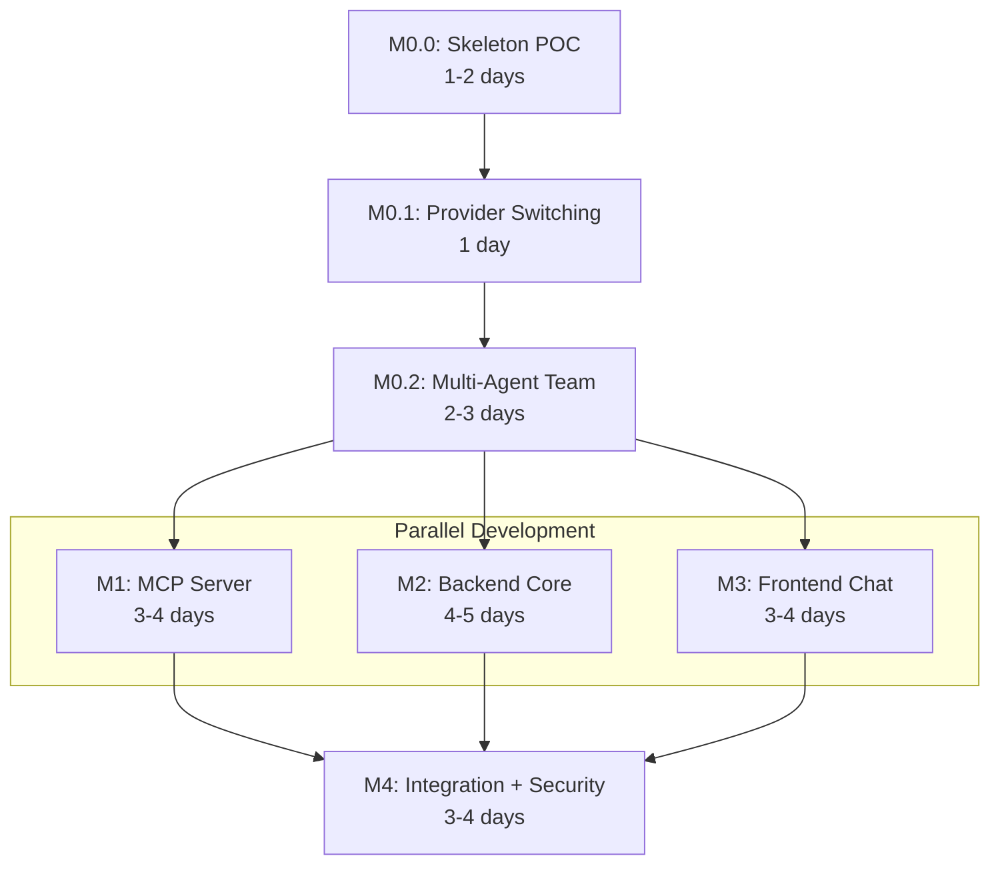

# Implementation Plan: Catalyst - LLM-Powered Lab Data Assistant

**Branch**: `spec/OGC-070-catalyst-assistant` | **Date**: 2026-01-21 | **Spec**:
[spec.md](./spec.md)  
**Jira**: [OGC-70](https://uwdigi.atlassian.net/browse/OGC-70)

## Summary

Catalyst enables lab managers to query OpenELIS data using natural language. The
system converts plain-language questions into SQL queries, executes them against
a read-only database connection, and displays results. **The core privacy
constraint is that the LLM receives only schema metadata, never patient data.**

**Primary Goal**: Rapid MVP prototype (2-3 sprints) that validates the
chat→SQL→results flow with **standards-based multi-agent architecture** (A2A
protocol + MCP for tools).

**Key Architectural Decisions**:

1. **A2A Multi-Agent Team (MVP)**: Simple 3-agent team based on med-agent-hub
   patterns - Router Agent (orchestration), Schema Agent (RAG via MCP), SQL
   Generator Agent (text-to-SQL). Single-agent fallback mode for simpler
   deployments.
2. **MCP for Tools**: Standalone Python MCP server for schema retrieval,
   callable by Schema Agent via MCP protocol.
3. **Standards-First**: Validate A2A + MCP architecture early to enable future
   scaling without refactoring.

## Technical Context

**Language/Version**:

- Java 21 LTS (OpenJDK/Temurin) - OpenELIS backend
- Python 3.11+ - MCP Schema Server

**Framework**: Spring Framework 6.2.2 (Traditional Spring MVC - NOT Spring Boot)

**Primary Dependencies**:

- Backend (Java): HTTP client (Apache HttpClient or OkHttp) for A2A agent communication, Jackson for JSON, Hibernate 6.x, Jakarta EE 9
- A2A Agents (Python): a2a-sdk 0.3.22+ (with http-server extra), FastAPI, uvicorn, OpenAI SDK, Google Generative AI SDK, Ollama SDK, httpx (for LM Studio)
- MCP Server (Python): mcp SDK, langchain, chromadb (for RAG embeddings), psycopg2-binary (PostgreSQL schema extraction)
- Frontend: React 17, @carbon/react v1.15, @carbon/ai-chat v1.0, React Intl

**LLM Providers (MVP)**:

- **Cloud**: OpenAI (GPT-4o), Google Gemini (gemini-1.5-pro)
- **Local**: Ollama (SQLCoder-7B), LM Studio (OpenAI-compatible API)

**Storage**: PostgreSQL 14+ (OpenELIS database - read-only for Catalyst
queries)  
**Testing**: JUnit 4 + Mockito (backend), pytest (MCP server), Jest + React
Testing Library (frontend), Cypress 12.17 (E2E)  
**Target Platform**: Docker containers deployed via existing OpenELIS
infrastructure  
**Project Type**: Multi-agent application (A2A agents in Python + Java backend
for OpenELIS integration + Python MCP server + React frontend)  
**Performance Goals**: Query response <10s for <1000 rows, SQL generation
success >80%  
**Constraints**: LLM never receives patient data, read-only database access,
<10k row limit  
**Scale/Scope**: Single-user MVP, production will support concurrent OpenELIS
users

## Constitution Check

_GATE: Verified before research. Re-check after design._

- [x] **Configuration-Driven (I)**: LLM provider selection via properties file,
      not code branches
- [x] **Carbon Design System (II)**: @carbon/ai-chat for chat UI, no
      Bootstrap/Tailwind
- [x] **FHIR/IHE Compliance (III)**: N/A for MVP (internal read-only queries),
      future phases may expose FHIR resources
- [x] **Layered Architecture (IV)**:
  - CatalystQuery valueholder → CatalystQueryDAO → CatalystQueryService →
    CatalystRestController
  - JPA/Hibernate annotations (NO XML mappings)
  - @Transactional in services ONLY
- [x] **Test Coverage (V)**:
  - Unit tests for service layer (>80% target)
  - ORM validation test for entity mappings
  - One E2E test for MVP (chat→SQL→results flow)
  - Cypress best practices (V.5): individual test execution, console log review
- [x] **Schema Management (VI)**: Liquibase changesets for audit log table
- [x] **Internationalization (VII)**: All UI strings via React Intl (en, fr
      minimum)
- [x] **Security & Compliance (VIII)**:
  - RBAC (MVP): Blocked-table list only (no per-user / row-level enforcement in
    MVP)
  - Audit: Log all generated queries with user ID + timestamp
  - Validation: Block restricted tables (sys_user, login_user)
- [x] **Spec-Driven Iteration (IX)**: Milestones defined below, each milestone =
      1 PR

**No complexity justifications required** - all approaches use standard
patterns.

## Milestone Plan

_Features >3 days MUST define milestones per Constitution Principle IX._

### Milestone Table

| ID     | Branch Suffix      | Scope                                          | User Stories            | Verification                           | Depends On    |
| ------ | ------------------ | ---------------------------------------------- | ----------------------- | -------------------------------------- | ------------- |
| M0     | m0-a2a-agents      | A2A agent infrastructure + 3-agent team        | US1 (partial), US2      | Agent Cards valid, agents communicate  | -             |
| [P] M1 | m1-mcp-server      | Python MCP server for schema RAG retrieval     | US1 (partial), US2      | MCP tools callable, pytest passes      | -             |
| [P] M2 | m2-backend-core    | Java OpenELIS integration, SQL execution       | US1 (partial), US2, US3 | Unit tests pass, ORM test passes       | -             |
| [P] M3 | m3-frontend-chat   | Carbon chat sidebar, i18n, basic UI            | US1 (partial)           | Jest tests pass, renders correctly     | -             |
| M4     | m4-integration     | Wire agents + backend + frontend, E2E test     | US1, US4                | Integration + E2E tests pass           | M0, M1, M2, M3|

**Legend**:

- **[P]**: Parallel milestone - M0, M1, M2, M3 can be developed simultaneously
- **Sequential** (no prefix): M4 requires all parallel milestones to complete

### Milestone Details

#### M0.0: Skeleton POC (Estimate: 1-2 days)

**Goal**: Prove A2A + LLM works with ZERO complexity

**Scope**:

- Single `SQLGenAgent` only (no Router, no Schema, no MCP)
- Hardcoded schema context (3-5 sample tables as string, not RAG)
- ONE provider only (Ollama with SQLCoder-7B - local first)
- No security (no PHI detection, no confirmation tokens)
- Minimal Agent Card for discovery
- Python script entry point

**Files to Create**:

```
projects/catalyst/catalyst-agents/
├── pyproject.toml                         # Minimal deps: a2a-sdk, ollama
├── src/
│   ├── __init__.py
│   ├── main.py                            # FastAPI entry point
│   └── agents/
│       ├── __init__.py
│       └── sqlgen_agent.py                # Single agent, hardcoded schema
├── tests/
│   └── test_sqlgen_agent.py               # Basic TDD test
└── .well-known/
    └── agent.json                         # Minimal Agent Card
```

**Verification**:

```bash
curl -X POST http://localhost:8000/task \
  -d '{"query": "How many samples today?"}' \
  → returns {"sql": "SELECT COUNT(*) FROM sample WHERE ..."}
```

---

#### M0.1: Provider Switching (Estimate: 1 day)

**Goal**: Prove same agent works with local AND cloud providers

**Scope**:

- Add OpenAI provider to SQLGenAgent
- Add Gemini provider to SQLGenAgent
- Add LM Studio provider to SQLGenAgent
- Config-driven provider selection (`agents_config.yaml`)
- No code changes to switch providers

**Files to Modify/Create**:

```
projects/catalyst/catalyst-agents/
├── src/
│   ├── agents/
│   │   └── sqlgen_agent.py                # Add provider abstraction
│   └── config/
│       └── agents_config.yaml             # Provider configuration
├── tests/
│   └── test_provider_switching.py         # Verify all 4 providers
```

**Verification**:

```bash
# Test with Ollama (local)
CATALYST_LLM_PROVIDER=ollama pytest tests/test_provider_switching.py

# Test with OpenAI (cloud)
CATALYST_LLM_PROVIDER=openai pytest tests/test_provider_switching.py
```

---

#### M0.2: Multi-Agent Team (Estimate: 2-3 days)

**Goal**: Prove Router → SchemaAgent → SQLGenAgent orchestration

**Scope**:

- Add RouterAgent (orchestration logic)
- Add SchemaAgent (still hardcoded schema, no MCP yet)
- Agent Cards for all 3 agents
- Single-agent fallback mode
- NO PHI detection (defer to M4)
- NO confirmation tokens (defer to M4)

**Files to Create**:

```
projects/catalyst/catalyst-agents/
├── src/
│   ├── agents/
│   │   ├── router_agent.py                # Orchestration (no PHI detection)
│   │   └── schema_agent.py                # Hardcoded schema (no MCP)
│   └── agent_cards/
│       ├── router.json
│       ├── schema.json
│       └── sqlgen.json
├── tests/
│   ├── test_router_agent.py
│   └── test_schema_agent.py
```

**Verification**:

- pytest: All agent tests pass
- RouterAgent delegates correctly to SchemaAgent and SQLGenAgent
- Single-agent fallback mode works when `mode=single`

---

#### M1: MCP Schema Server (Estimate: 3-4 days) [PARALLEL]

**Scope**:

- Python MCP server exposing schema retrieval tools
- RAG-based schema filtering using embeddings (ChromaDB)
- MCP tools: `get_relevant_tables`, `get_table_ddl`, `get_relationships`
- Docker container for deployment alongside OpenELIS
- Called by SchemaAgent via MCP protocol

**Files to Create**:

```
projects/catalyst/catalyst-mcp/
├── pyproject.toml                         # Python dependencies
├── Dockerfile                             # Container build
├── src/
│   ├── __init__.py
│   ├── server.py                          # MCP server entry point
│   ├── tools/
│   │   ├── __init__.py
│   │   ├── schema_tools.py                # get_relevant_tables, get_table_ddl
│   │   └── relationship_tools.py          # get_relationships
│   ├── rag/
│   │   ├── __init__.py
│   │   ├── embeddings.py                  # Schema embedding generation
│   │   └── retriever.py                   # ChromaDB vector search
│   └── db/
│       ├── __init__.py
│       └── schema_extractor.py            # PostgreSQL schema extraction
├── tests/
│   ├── __init__.py
│   ├── test_schema_tools.py
│   └── test_retriever.py
└── config/
    └── mcp_config.yaml                    # Server configuration
```

**Verification**:

- pytest: All MCP tool tests pass
- Manual: MCP server responds to tool calls via Streamable HTTP
- Integration: SchemaAgent can call MCP tools

---

#### M2: Backend Core (Estimate: 4-5 days) [PARALLEL]

**Scope**:

- Java OpenELIS integration layer (REST API, SQL execution, audit)
- A2A client to call RouterAgent (or direct single-agent mode)
- Privacy guardrails (blocked tables, schema-only context)
- CatalystQuery valueholder + DAO for audit logging (without security fields)
- SQL execution against read-only database connection
- **Note**: Security features (PHI detection, confirmation tokens) deferred to M4

**Files to Create**:

```
src/main/java/org/openelisglobal/catalyst/
├── config/
│   ├── CatalystAgentConfig.java           # A2A agent client configuration
│   └── CatalystDatabaseConfig.java        # Read-only connection config
├── agent/
│   ├── A2AAgentClient.java                # Client to call A2A agents
│   └── A2AAgentClientImpl.java
├── service/
│   ├── CatalystQueryService.java          # Orchestrates agent calls + SQL exec
│   └── CatalystQueryServiceImpl.java
├── valueholder/CatalystQuery.java         # Audit entity
├── dao/
│   ├── CatalystQueryDAO.java
│   └── CatalystQueryDAOImpl.java
└── guardrails/SQLGuardrails.java          # Blocked tables, validation

src/main/resources/liquibase/catalyst/     # Audit table changeset
volume/properties/catalyst.properties      # Agent + database configuration
```

**Verification**:

- Unit tests: CatalystQueryServiceTest (mocked agent), SQLGuardrailsTest
- ORM validation test: HibernateMappingValidationTest (CatalystQuery entity)
- Integration: Java backend calls RouterAgent successfully

---

#### M3: Frontend Chat (Estimate: 3-4 days) [PARALLEL]

**Scope**:

- CatalystSidebar component using @carbon/ai-chat
- Internationalized strings (en.json, fr.json)
- Query input, response display, SQL preview
- Loading states, error handling

**Files to Create**:

```
frontend/src/components/catalyst/
├── CatalystSidebar.jsx                    # Main sidebar component
├── ChatInterface.jsx                      # Chat message list
├── QueryInput.jsx                         # Text input with submit
├── ResultsDisplay.jsx                     # Table/JSON display
├── SQLPreview.jsx                         # Generated SQL preview
└── index.js                               # Module exports

frontend/src/languages/en.json             # Add catalyst.* keys
frontend/src/languages/fr.json             # Add catalyst.* keys
```

**Verification**:

- Jest tests: CatalystSidebar.test.jsx, ChatInterface.test.jsx
- Manual: Component renders, i18n works for en/fr

---

#### M4: Integration + Security (Estimate: 3-4 days)

**Scope**:

- Wire all components: Frontend → Java backend → A2A agents → MCP server
- CatalystRestController with /rest/catalyst/query endpoint
- Agent Card discovery endpoint (/.well-known/agent.json proxy)
- Response formatting (table, JSON, CSV export)
- Full E2E test proving chat→agents→SQL→results flow
- Single-agent fallback mode toggle
- **Security features** (deferred from M0/M2):
  - PHI detection in RouterAgent (FR-018)
  - Provider routing for PHI-flagged queries
  - Confirmation token generation and validation (FR-016)
  - Add security fields to CatalystQuery entity (phi_gated, confirmation_token)

**Files to Create**:

```
src/main/java/org/openelisglobal/catalyst/
├── controller/CatalystRestController.java
├── form/CatalystQueryForm.java
└── form/CatalystQueryResponse.java

frontend/cypress/e2e/catalyst.cy.js        # E2E test

projects/catalyst/catalyst-dev.docker-compose.yml  # Full stack compose
```

**Verification**:

- Controller integration test: POST /rest/catalyst/query returns valid response
- E2E test: User types query → Router delegates → SQL generated → results shown
- Fallback test: Single-agent mode works when multi-agent disabled

### Milestone Dependency Graph



### PR Strategy

- **Spec PR**: `spec/OGC-070-catalyst-assistant` → `develop` (this spec + plan)
- **M0.0 PR**: `feat/OGC-070-catalyst-assistant-m0-skeleton-poc` → `develop`
- **M0.1 PR**: `feat/OGC-070-catalyst-assistant-m0-provider-switching` → `develop`
- **M0.2 PR**: `feat/OGC-070-catalyst-assistant-m0-multi-agent` → `develop`
- **M1 PR**: `feat/OGC-070-catalyst-assistant-m1-mcp-server` → `develop`
- **M2 PR**: `feat/OGC-070-catalyst-assistant-m2-backend-core` → `develop`
- **M3 PR**: `feat/OGC-070-catalyst-assistant-m3-frontend-chat` → `develop`
- **M4 PR**: `feat/OGC-070-catalyst-assistant-m4-integration-security` → `develop`

**Estimated Total**: ~14-16 days (3 sprints) for working MVP with A2A + MCP architecture

### Future Phases (Post-MVP)

| Phase   | Scope                                                      | Prerequisite     |
| ------- | ---------------------------------------------------------- | ---------------- |
| Phase 2 | Advanced multi-agent orchestration, external agent federation | MVP validated    |
| Phase 3 | Report storage, scheduling, dashboards                     | Phase 2 complete |

**Note**: Basic A2A multi-agent team (Router + Schema + SQLGen) is now in MVP
scope. Phase 2 extends to more complex orchestration patterns, dynamic agent
discovery, and external agent collaboration.

## Project Structure

### Repository Scoping (Tooling Under `projects/`)

To keep Catalyst work scoped and reviewable, **supporting services and tooling**
(e.g., the Python MCP server and Catalyst-specific Docker Compose) live under:

- `projects/catalyst/`

Only **required OpenELIS integration changes** should touch:

- Backend: `src/main/java/org/openelisglobal/catalyst/`
- Frontend: `frontend/src/components/catalyst/`
- Config: `volume/properties/catalyst.properties`

### Documentation (this feature)

```text
specs/OGC-070-catalyst-assistant/
├── spec.md              # Feature specification
├── plan.md              # This file
├── research.md          # Technology research
├── data-model.md        # Entity documentation
├── quickstart.md        # Developer quick start
├── contracts/           # API contracts
│   └── catalyst-api.yaml
└── checklists/
    └── requirements.md  # Quality checklist
```

### Source Code (repository root)

```text
# A2A Agent Team (Python - A2A SDK)
projects/catalyst/catalyst-agents/
├── pyproject.toml
├── Dockerfile
├── src/
│   ├── main.py                  # Agent server entry point
│   ├── agents/                  # Agent implementations
│   │   ├── router_agent.py      # RouterAgent
│   │   ├── schema_agent.py      # SchemaAgent
│   │   └── sqlgen_agent.py      # SQLGenAgent
│   ├── agent_cards/             # A2A Agent Cards
│   └── config/
├── tests/                       # pytest tests
└── .well-known/
    └── agent.json               # RouterAgent discovery

# MCP Schema Server (Python - Standalone)
projects/catalyst/catalyst-mcp/
├── pyproject.toml
├── Dockerfile
├── src/
│   ├── server.py                # MCP entry point
│   ├── tools/                   # MCP tool implementations
│   ├── rag/                     # Embedding + retrieval
│   └── db/                      # Schema extraction
├── tests/                       # pytest tests
└── config/
    └── mcp_config.yaml

# Backend (Java - Traditional Spring MVC)
src/main/java/org/openelisglobal/catalyst/
├── config/              # Agent + database configuration
├── agent/               # A2A agent client
├── controller/          # REST endpoints
├── dao/                 # Data access
├── form/                # Request/response DTOs
├── guardrails/          # SQL validation
├── service/             # Business logic
└── valueholder/         # JPA entities

src/main/resources/liquibase/catalyst/
└── catalyst-001-create-audit-table.xml

src/test/java/org/openelisglobal/catalyst/
├── service/             # Unit tests
├── mcp/                 # MCP client tests
├── controller/          # Integration tests
└── HibernateMappingValidationTest.java

# Frontend (React + Carbon)
frontend/src/components/catalyst/
├── CatalystSidebar.jsx
├── ChatInterface.jsx
├── QueryInput.jsx
├── ResultsDisplay.jsx
├── SQLPreview.jsx
└── __tests__/           # Jest tests

frontend/cypress/e2e/
└── catalyst.cy.js       # E2E test

# Configuration
volume/properties/catalyst.properties    # Java backend config (agent URL, guardrails)
projects/catalyst/catalyst-agents/src/config/agents_config.yaml  # Agent runtime config (LLM provider, MCP URL)
projects/catalyst/catalyst-dev.docker-compose.yml  # Full stack (agents + MCP + Ollama)
```

**Structure Decision**: Multi-agent architecture - Python A2A agent runtime
(RouterAgent, SchemaAgent, SQLGenAgent) for AI orchestration, Python MCP server
for schema retrieval (standards-based), Java backend for OpenELIS integration +
SQL execution + audit, React frontend for chat UI.

## Testing Strategy

**Reference**: [OpenELIS Testing Roadmap](.specify/guides/testing-roadmap.md)

### Coverage Goals

- **Backend**: >80% for service layer (JaCoCo)
- **Frontend**: >70% for catalyst components (Jest)
- **Critical Paths**: 100% coverage for SQL guardrails (blocked tables,
  injection prevention)

### Test Types

- [x] **A2A Agent Tests**: Python (pytest)

  - `test_router_agent.py` - Test orchestration logic
  - `test_schema_agent.py` - Test MCP tool delegation
  - `test_sqlgen_agent.py` - Test SQL generation
  - **SDD Checkpoint**: After M0, all agent tests MUST pass

- [x] **MCP Server Tests**: Python (pytest)

  - `test_schema_tools.py` - Test MCP tool implementations
  - `test_retriever.py` - Test RAG embedding search
  - **SDD Checkpoint**: After M1, all MCP tests MUST pass

- [x] **Unit Tests**: Service layer (JUnit 4 + Mockito)

  - `CatalystQueryServiceTest` - Mock agent responses, test orchestration
  - `A2AAgentClientTest` - Mock agent server, test client calls
  - `SQLGuardrailsTest` - Test blocked table detection, SQL validation
  - Template: `.specify/templates/testing/JUnit4ServiceTest.java.template`
  - **SDD Checkpoint**: After M2, all unit tests MUST pass

- [x] **ORM Validation Tests**: Entity mapping (Constitution V.4)

  - `HibernateMappingValidationTest` - Validate CatalystQuery entity mappings
  - MUST execute in <5 seconds, MUST NOT require database
  - **SDD Checkpoint**: After M2, ORM test MUST pass

- [x] **Controller Tests**: REST endpoints (BaseWebContextSensitiveTest)

  - `CatalystRestControllerTest` - Test /rest/catalyst/query endpoint
  - Template: `.specify/templates/testing/WebMvcTestController.java.template`
  - **SDD Checkpoint**: After M4, integration tests MUST pass

- [x] **Frontend Unit Tests**: React components (Jest + RTL)

  - `CatalystSidebar.test.jsx` - Component rendering, i18n
  - `ChatInterface.test.jsx` - Message display
  - Template: `.specify/templates/testing/JestComponent.test.jsx.template`
  - **SDD Checkpoint**: After M3, Jest tests MUST pass

- [x] **E2E Tests**: Critical workflow (Cypress)
  - `catalyst.cy.js` - Full chat→agents→SQL→results flow
  - Run individually during development (Constitution V.5)
  - Template: `.specify/templates/testing/CypressE2E.cy.js.template`
  - **SDD Checkpoint**: After M4, E2E test MUST pass

### Test Data Management

- **Backend Unit Tests**: Mock LLM responses for deterministic testing

  ```java
  // Canned responses for predictable tests
  when(mockLLM.generate(anyString())).thenReturn(
      "SELECT COUNT(*) FROM sample WHERE entered_date = CURRENT_DATE"
  );
  ```

- **E2E Tests (Cypress)**:
  - Use `cy.intercept()` to spy on /rest/catalyst/query (NOT stub)
  - Use existing OpenELIS test database with sample data
  - Login via `cy.session()` (Constitution V.5)

### Checkpoint Validations

- [x] **After M0 (A2A Agents)**: Agent tests MUST pass, Agent Cards valid
- [x] **After M1 (MCP Server)**: pytest tests MUST pass, MCP tools callable
- [x] **After M2 (Backend Core)**: ORM validation + unit tests MUST pass
- [x] **After M3 (Frontend Chat)**: Jest tests MUST pass
- [x] **After M4 (Integration)**: Controller integration tests + E2E test MUST
      pass, multi-agent flow verified

## Agent Responsibilities & Integration

### Agent-Owned Responsibilities

**SQL Generation + LLM Provider Switching** (SQLGenAgent - Python):

- SQLGenAgent owns text-to-SQL generation using configured LLM provider
- Supports 4 providers: OpenAI (GPT-4o), Google Gemini (gemini-1.5-pro), Ollama (SQLCoder-7B), LM Studio (OpenAI-compatible)
- Provider selection configured via agent runtime config (YAML/properties)
- PHI detection and cloud provider blocking logic lives in RouterAgent (delegates to SQLGenAgent only if safe)

**Schema Retrieval via MCP** (SchemaAgent - Python):

- SchemaAgent calls MCP server tools for RAG-based schema retrieval
- MCP tools: `get_relevant_tables`, `get_table_ddl`, `get_relationships`
- MCP transport: Streamable HTTP (SSE optional for streaming)
- Reference: https://modelcontextprotocol.io/specification/2025-11-25/basic/transports

**Orchestration** (RouterAgent - Python):

- RouterAgent orchestrates query flow: delegates to SchemaAgent for schema, then SQLGenAgent for SQL generation
- Performs PHI detection on user query before delegation
- Returns generated SQL to Java backend (no execution in agent layer)

### Java Backend Responsibilities

**OpenELIS Integration** (CatalystRestController + CatalystQueryService):

- Receives HTTP requests from frontend
- Calls RouterAgent via A2A protocol (HTTP client to agent runtime)
- Executes generated SQL against read-only database connection
- Persists audit records (CatalystQuery entity) with FR-019 metadata
- Validates confirmation token before execution (review-before-execute enforcement)

**No Direct LLM/MCP Access**: Java backend does NOT directly call LLM providers or MCP server. All AI operations happen in the agent runtime.

### Python MCP Server Tools

```python
# projects/catalyst/catalyst-mcp/src/tools/schema_tools.py
from mcp import tool

@tool
def get_relevant_tables(query: str) -> list[str]:
    """Find tables relevant to the user's natural language query using RAG."""
    # Embed query and search ChromaDB for similar table descriptions
    results = retriever.search(query, k=10)
    return [r.table_name for r in results]

@tool
def get_table_ddl(table_name: str) -> str:
    """Get CREATE TABLE statement for a specific table."""
    return schema_extractor.get_ddl(table_name)

@tool
def get_relationships(table_names: list[str]) -> list[dict]:
    """Get foreign key relationships between specified tables."""
    return schema_extractor.get_fk_relationships(table_names)
```

### Configuration

**Java Backend** (`volume/properties/catalyst.properties`):

```properties
# A2A Agent Runtime
catalyst.agents.mode=multi    # Options: multi, single
catalyst.agents.url=http://catalyst-agents:8000

# Guardrails (enforced in Java backend)
catalyst.guardrails.max-rows=10000
catalyst.guardrails.query-timeout=30s
catalyst.guardrails.blocked-tables=sys_user,login_user,user_role
```

**Agent Runtime** (`projects/catalyst/catalyst-agents/src/config/agents_config.yaml`):

```yaml
# LLM Provider Selection (SQLGenAgent)
llm:
  provider: ollama  # Options: openai, gemini, ollama, lmstudio
  
  # Cloud providers
  openai:
    model: gpt-4o
    api_key: ${OPENAI_API_KEY}
  gemini:
    model: gemini-1.5-pro
    api_key: ${GOOGLE_API_KEY}
  
  # Local providers
  ollama:
    base_url: http://ollama:11434
    model: sqlcoder:7b
  lmstudio:
    base_url: http://host.docker.internal:1234/v1
    model: local-model

# MCP Server (SchemaAgent)
mcp:
  server_url: http://catalyst-mcp:8000/mcp
```

### PHI-Aware Provider Gating (MVP Safety)

**Goal**: Preserve the privacy-first constraint even when users include
identifiers/PHI in the _question text_.

**Rule (MVP)**:

- RouterAgent detects likely PHI/identifiers in user query
- If PHI detected **and** configured provider is externally-hosted (OpenAI/Gemini), RouterAgent **MUST NOT** delegate to SQLGenAgent with that provider
- RouterAgent attempts to route to on-premises provider (Ollama or LM Studio) if configured and healthy
- If no on-premises provider available, RouterAgent returns error to Java backend, which blocks request with user-facing message

**Reference**: This is required to make US2/FR-004 testable in real workflows
where users paste patient identifiers into questions.

## A2A Multi-Agent Architecture

**Reference**: [A2A Protocol](https://google.github.io/A2A/),
[med-agent-hub](https://github.com/pmanko/med-agent-hub)

### Agent Team Overview

MVP implements a simple 3-agent team based on med-agent-hub patterns:

```
┌─────────────────────────────────────────────────────────────────┐
│                     OpenELIS Frontend                           │
│                    (CatalystSidebar.jsx)                        │
└────────────────────────────┬────────────────────────────────────┘
                             │ HTTP
┌────────────────────────────▼────────────────────────────────────┐
│                   Java Backend (OpenELIS)                       │
│               CatalystRestController + Service                  │
└────────────────────────────┬────────────────────────────────────┘
                             │ A2A Task Request
┌────────────────────────────▼────────────────────────────────────┐
│                      RouterAgent                                │
│           (Orchestrates query flow, delegates)                  │
│                 /.well-known/agent.json                         │
└───────────┬─────────────────────────────────┬───────────────────┘
            │ A2A                             │ A2A
┌───────────▼───────────┐         ┌───────────▼───────────┐
│     SchemaAgent       │         │     SQLGenAgent       │
│  (RAG schema lookup)  │         │   (Text-to-SQL LLM)   │
└───────────┬───────────┘         └───────────────────────┘
            │ MCP
┌───────────▼───────────┐
│    MCP Schema Server  │
│  (ChromaDB + Postgres)│
└───────────────────────┘
```

### Agent Responsibilities

| Agent | Skill | Input | Output |
|-------|-------|-------|--------|
| **RouterAgent** | `orchestrate_query` | Natural language query | Final SQL + results |
| **SchemaAgent** | `retrieve_schema` | Query text | Relevant table DDL |
| **SQLGenAgent** | `generate_sql` | Query + schema context | Valid SQL statement |

### Agent Card Structure (A2A Specification)

**Required Fields** (per A2A spec v0.3.0+):

- `protocolVersions`: Array of supported A2A protocol versions (e.g., `["0.3.0"]`)
- `name`: Human-readable agent name
- `description`: Agent purpose
- `url`: Base URL for A2A service
- `version`: Agent implementation version (not protocol version)
- `capabilities`: Feature flags (streaming, pushNotifications, etc.)
- `defaultInputModes`: Supported input MIME types (e.g., `["text/plain", "application/json"]`)
- `defaultOutputModes`: Supported output MIME types
- `skills`: Array of AgentSkill objects (at least one required)

**Example RouterAgent Card**:

```json
{
  "protocolVersions": ["0.3.0"],
  "name": "CatalystRouterAgent",
  "description": "Orchestrates text-to-SQL query flow for OpenELIS lab data",
  "url": "http://catalyst-agents:8000",
  "version": "1.0.0",
  "capabilities": {
    "streaming": false,
    "pushNotifications": false
  },
  "defaultInputModes": ["text/plain", "application/json"],
  "defaultOutputModes": ["application/json"],
  "skills": [
    {
      "id": "orchestrate_query",
      "name": "Orchestrate Query",
      "description": "Convert natural language to SQL and return results",
      "tags": ["text-to-sql", "lab-data", "query"]
    }
  ]
}
```

**Discovery Path**: RouterAgent publishes Agent Card at `/.well-known/agent.json` (or `/.well-known/agent-card.json` per A2A SDK 0.3.x default).

### Single-Agent Fallback Mode

For simpler deployments, Catalyst supports single-agent mode where all logic
runs in one agent (no inter-agent communication):

```properties
# volume/properties/catalyst.properties
catalyst.agents.mode=multi    # Options: multi, single
catalyst.agents.url=http://catalyst-agents:8000
```

When `mode=single`, the RouterAgent performs all tasks internally without
delegating to SchemaAgent or SQLGenAgent.

## References

- **Spec**: [specs/OGC-070-catalyst-assistant/spec.md](./spec.md)
- **Research**: [specs/OGC-070-catalyst-assistant/research.md](./research.md)
- **API Contract**:
  [specs/OGC-070-catalyst-assistant/contracts/catalyst-api.yaml](./contracts/catalyst-api.yaml)
- **Constitution**:
  [.specify/memory/constitution.md](../../.specify/memory/constitution.md)
- **Testing Roadmap**:
  [.specify/guides/testing-roadmap.md](../../.specify/guides/testing-roadmap.md)
- **Jira Issue**: [OGC-70](https://uwdigi.atlassian.net/browse/OGC-70)

### External References

- [A2A Python SDK](https://pypi.org/project/a2a-sdk/)
- [OpenAI Python SDK](https://github.com/openai/openai-python)
- [Google Generative AI Python SDK](https://github.com/google/generative-ai-python)
- [Carbon AI Chat](https://chat.carbondesignsystem.com/)
- [SQLCoder on Ollama](https://ollama.com/library/sqlcoder:7b)
- [MCP Documentation](https://modelcontextprotocol.io/) (MVP - Python SDK)
- [MCP Python SDK](https://github.com/modelcontextprotocol/python-sdk)
- [MCP Java SDK](https://github.com/modelcontextprotocol/java-sdk)
- [ChromaDB](https://www.trychroma.com/) (RAG vector store)
- [Google Gemini API](https://ai.google.dev/)
- [LM Studio](https://lmstudio.ai/) (OpenAI-compatible local inference)
- [A2A Protocol](https://google.github.io/A2A/) (MVP - multi-agent architecture)
- [A2A Python SDK](https://github.com/a2aproject/a2a-samples) (agent implementation)
- [med-agent-hub](https://github.com/pmanko/med-agent-hub) (reference patterns)
