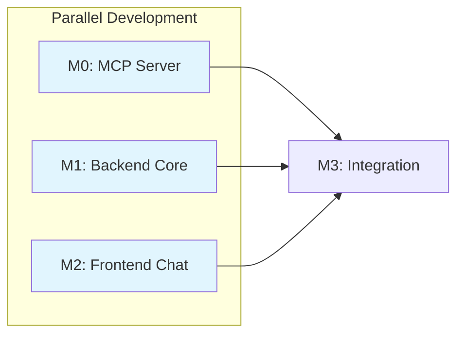

# Tasks: Catalyst - LLM-Powered Lab Data Assistant

**Feature**: OGC-070-catalyst-assistant  
**Input**: Design documents from `specs/OGC-070-catalyst-assistant/`  
**Prerequisites**: plan.md, spec.md, data-model.md, contracts/catalyst-api.yaml, research.md, quickstart.md

**Organization**: Tasks are organized by **Milestone** per Constitution Principle IX.  
**Testing**: Tests are **MANDATORY** per Constitution Principle V (TDD).

**Repo Scope**:
- Catalyst supporting services/tooling live under `projects/catalyst/`
- OpenELIS integration changes are limited to `src/`, `frontend/`, and required config under `volume/`

## Format: `[ID] [P?] [M?] Description`

- **[P]**: Can run in parallel (different files, no dependencies)
- **[M?]**: Milestone this task belongs to (M0, M1, M2, M3)
- Include exact file paths in descriptions

---

## Milestone Dependency Graph

**Legend**:
- **M0 + M1 + M2**: Can be developed in parallel
- **M3**: Requires M0, M1, and M2 to complete

---

## Phase 1: Setup (Shared Infrastructure)

**Purpose**: Project structure, dependencies, and configuration that all milestones need.

**Branch**: Work on `spec/OGC-070-catalyst-assistant` branch

- [ ] T001 Add LangChain4j dependencies to `pom.xml` (langchain4j 1.10.0, langchain4j-ollama, langchain4j-open-ai, langchain4j-google-ai-gemini)
- [ ] T002 [P] Add MCP Java SDK dependency to `pom.xml` (mcp-java-sdk 0.8.0)
- [ ] T003 [P] Create Catalyst module directory structure at `src/main/java/org/openelisglobal/catalyst/`
- [ ] T004 [P] Create MCP server directory structure at `projects/catalyst/catalyst-mcp/`
- [ ] T005 [P] Create Catalyst configuration file at `volume/properties/catalyst.properties`
- [ ] T006 [P] Create test directory structure at `src/test/java/org/openelisglobal/catalyst/`
- [ ] T007 [P] Create frontend component directory at `frontend/src/components/catalyst/`
- [ ] T008 Add Carbon AI Chat dependencies to `frontend/package.json` (@carbon/ai-chat v1.0)
- [ ] T009 Create `projects/catalyst/catalyst-dev.docker-compose.yml` with MCP server + Ollama services

**Checkpoint**: Project structure ready for milestone development

---

## Phase 2: [P] M0 - MCP Schema Server (Estimate: 3-4 days)

**Branch**: `feat/OGC-070-catalyst-assistant-m0-mcp-server`

**Scope**: Python MCP server for schema RAG retrieval

**User Stories**: US1 (partial), US2

**Verification**: pytest passes, MCP tools callable

### M0.1 - Branch Setup

- [ ] T010 [M0] Create milestone branch `feat/OGC-070-catalyst-assistant-m0-mcp-server` from `develop`

### M0.2 - Tests First (TDD - Red Phase)

> **NOTE**: Write these tests FIRST, ensure they FAIL before implementation

- [ ] T011 [P] [M0] Create pytest test `test_schema_tools.py` at `projects/catalyst/catalyst-mcp/tests/test_schema_tools.py`
- [ ] T012 [P] [M0] Create pytest test `test_retriever.py` at `projects/catalyst/catalyst-mcp/tests/test_retriever.py`
- [ ] T013 [P] [M0] Create pytest test `test_server.py` at `projects/catalyst/catalyst-mcp/tests/test_server.py`

### M0.3 - Project Setup

- [ ] T014 [M0] Create `pyproject.toml` at `projects/catalyst/catalyst-mcp/pyproject.toml` (mcp, chromadb, langchain, psycopg2-binary)
- [ ] T015 [M0] Create `Dockerfile` at `projects/catalyst/catalyst-mcp/Dockerfile`
- [ ] T016 [M0] Create `mcp_config.yaml` at `projects/catalyst/catalyst-mcp/config/mcp_config.yaml`

### M0.4 - Database Schema Extraction

- [ ] T017 [M0] Create `schema_extractor.py` at `projects/catalyst/catalyst-mcp/src/db/schema_extractor.py` (PostgreSQL information_schema queries)
- [ ] T018 [M0] Create `__init__.py` files for all packages

### M0.5 - RAG Components

- [ ] T019 [M0] Create `embeddings.py` at `projects/catalyst/catalyst-mcp/src/rag/embeddings.py` (generate embeddings for tables)
- [ ] T020 [M0] Create `retriever.py` at `projects/catalyst/catalyst-mcp/src/rag/retriever.py` (ChromaDB vector search)
- [ ] T021 [M0] Create `init_embeddings.py` at `projects/catalyst/catalyst-mcp/src/rag/init_embeddings.py` (one-time initialization script)

**Checkpoint**: RAG retriever tests (T012) should PASS

### M0.6 - MCP Tools

- [ ] T022 [M0] Create `schema_tools.py` at `projects/catalyst/catalyst-mcp/src/tools/schema_tools.py` (get_relevant_tables, get_table_ddl)
- [ ] T023 [M0] Create `relationship_tools.py` at `projects/catalyst/catalyst-mcp/src/tools/relationship_tools.py` (get_relationships)

**Checkpoint**: Schema tools tests (T011) should PASS

### M0.7 - MCP Server

- [ ] T024 [M0] Create `server.py` at `projects/catalyst/catalyst-mcp/src/server.py` (MCP entry point with Streamable HTTP transport; SSE optional for streaming)

**Checkpoint**: Server tests (T013) should PASS

### M0.8 - Verification & PR

- [ ] T025 [M0] Run all pytest tests: `cd projects/catalyst/catalyst-mcp && pytest`
- [ ] T026 [M0] Build Docker image: `docker build -t catalyst-mcp ./projects/catalyst/catalyst-mcp`
- [ ] T027 [M0] Verify MCP server responds to tool calls manually
- [ ] T028 [M0] Create PR `feat/OGC-070-catalyst-assistant-m0-mcp-server` → `develop`

**M0 Complete**: All pytest tests pass, MCP tools callable

---

## Phase 3: [P] M1 - Backend Core (Estimate: 4-5 days)

**Branch**: `feat/OGC-070-catalyst-assistant-m1-backend-core`

**Scope**: MCP client, LLM config (4 providers), query service, privacy guardrails, audit logging

**User Stories**: US1 (partial), US2, US3

**Verification**: Unit tests pass, ORM validation test passes

### M1.1 - Branch Setup

- [ ] T029 [M1] Create milestone branch `feat/OGC-070-catalyst-assistant-m1-backend-core` from `develop`

### M1.2 - Tests First (TDD - Red Phase)

> **NOTE**: Write these tests FIRST, ensure they FAIL before implementation

- [ ] T030 [P] [M1] Create ORM validation test `HibernateMappingValidationTest.java` at `src/test/java/org/openelisglobal/catalyst/HibernateMappingValidationTest.java`
- [ ] T031 [P] [M1] Create unit test `MCPSchemaClientTest.java` at `src/test/java/org/openelisglobal/catalyst/mcp/MCPSchemaClientTest.java`
- [ ] T032 [P] [M1] Create unit test `CatalystQueryServiceTest.java` at `src/test/java/org/openelisglobal/catalyst/service/CatalystQueryServiceTest.java` (prompt construction uses schema-only context; audit metadata captured per FR-019)
- [ ] T033 [P] [M1] Create unit test `SQLGuardrailsTest.java` at `src/test/java/org/openelisglobal/catalyst/guardrails/SQLGuardrailsTest.java` (MVP authorization: blocked-table list only; no per-user/row-level RBAC enforcement)
- [ ] T034 [P] [M1] Create unit test `CatalystQueryDAOTest.java` at `src/test/java/org/openelisglobal/catalyst/dao/CatalystQueryDAOTest.java` (persists audit metadata fields per FR-019)

### M1.3 - Entity Layer (TDD - Green Phase)

- [ ] T035 [M1] Create `ExecutionStatus.java` enum at `src/main/java/org/openelisglobal/catalyst/valueholder/ExecutionStatus.java`
- [ ] T036 [M1] Create `CatalystQuery.java` entity at `src/main/java/org/openelisglobal/catalyst/valueholder/CatalystQuery.java` (extends BaseObject, JPA annotations; includes audit metadata fields per FR-019: provider type/id, PHI gating flag, schema tables used)
- [ ] T037 [M1] Create Liquibase changeset `catalyst-001-create-audit-table.xml` at `src/main/resources/liquibase/catalyst/catalyst-001-create-audit-table.xml` (include audit metadata columns per FR-019)
- [ ] T038 [M1] Register Liquibase changeset in master changelog

**Checkpoint**: ORM validation test (T030) should PASS

### M1.4 - DAO Layer

- [ ] T039 [M1] Create `CatalystQueryDAO.java` interface at `src/main/java/org/openelisglobal/catalyst/dao/CatalystQueryDAO.java`
- [ ] T040 [M1] Create `CatalystQueryDAOImpl.java` at `src/main/java/org/openelisglobal/catalyst/dao/CatalystQueryDAOImpl.java` (extends BaseDAOImpl, HQL queries)

**Checkpoint**: DAO test (T034) should PASS

### M1.5 - MCP Client Layer

- [ ] T041 [M1] Create `MCPSchemaClient.java` interface at `src/main/java/org/openelisglobal/catalyst/mcp/MCPSchemaClient.java`
- [ ] T042 [M1] Create `MCPSchemaClientImpl.java` at `src/main/java/org/openelisglobal/catalyst/mcp/MCPSchemaClientImpl.java` (Streamable HTTP transport to Python MCP server; SSE optional for streaming)
- [ ] T043 [M1] Create `CatalystMCPConfig.java` at `src/main/java/org/openelisglobal/catalyst/config/CatalystMCPConfig.java`

**Checkpoint**: MCP client test (T031) should PASS

### M1.6 - Service Layer

- [ ] T044 [M1] Create `CatalystQueryService.java` interface at `src/main/java/org/openelisglobal/catalyst/service/CatalystQueryService.java`
- [ ] T045 [M1] Create `CatalystQueryServiceImpl.java` at `src/main/java/org/openelisglobal/catalyst/service/CatalystQueryServiceImpl.java` (text-to-SQL generation using MCP + LLM)

**Checkpoint**: Service test (T032) should PASS

### M1.7 - Guardrails

- [ ] T046 [M1] Create `SQLGuardrails.java` at `src/main/java/org/openelisglobal/catalyst/guardrails/SQLGuardrails.java` (blocked tables, row estimation, validation)

**Checkpoint**: Guardrails test (T033) should PASS

### M1.8 - LLM Configuration (4 Providers)

- [ ] T047 [M1] Create `CatalystLLMConfig.java` at `src/main/java/org/openelisglobal/catalyst/config/CatalystLLMConfig.java` (OpenAI, Gemini, Ollama, LM Studio)
- [ ] T048 [M1] Update `volume/properties/catalyst.properties` with all provider settings

### M1.8b - PHI-Aware Provider Gating (MVP Safety)

- [ ] T108 [P] [M1] Create unit test `PhiDetectionServiceTest.java` at `src/test/java/org/openelisglobal/catalyst/privacy/PhiDetectionServiceTest.java`
- [ ] T109 [M1] Create `PhiDetectionService.java` and `PhiDetectionServiceImpl.java` at `src/main/java/org/openelisglobal/catalyst/privacy/` (detect likely PHI/identifiers in question text)
- [ ] T110 [M1] Add provider gating logic to `CatalystQueryServiceImpl.java` (if PHI detected and provider is cloud, do not call cloud; route to local if configured and healthy, else block)
- [ ] T111 [M1] Update `CatalystQueryServiceTest.java` to assert cloud provider is not called when PHI detected (and that request is routed/blocked as configured)

### M1.9 - Verification & PR

- [ ] T049 [M1] Run `mvn spotless:apply` to format code
- [ ] T050 [M1] Run all M1 unit tests: `mvn test -Dtest=*Catalyst*`
- [ ] T051 [M1] Verify ORM validation test passes in <5 seconds
- [ ] T052 [M1] Create PR `feat/OGC-070-catalyst-assistant-m1-backend-core` → `develop`

**M1 Complete**: All unit tests pass, ORM validation passes, MCP client connects

---

## Phase 4: [P] M2 - Frontend Chat (Estimate: 3-4 days)

**Branch**: `feat/OGC-070-catalyst-assistant-m2-frontend-chat`

**Scope**: Carbon chat sidebar, i18n, query input, results display, SQL preview

**User Stories**: US1 (partial)

**Verification**: Jest tests pass, components render correctly

**Note**: This phase can run **in parallel** with M0 and M1

### M2.1 - Branch Setup

- [ ] T053 [M2] Create milestone branch `feat/OGC-070-catalyst-assistant-m2-frontend-chat` from `develop`

### M2.2 - Tests First (TDD - Red Phase)

> **NOTE**: Write these tests FIRST, ensure they FAIL before implementation

- [ ] T054 [P] [M2] Create Jest test `CatalystSidebar.test.jsx` at `frontend/src/components/catalyst/__tests__/CatalystSidebar.test.jsx`
- [ ] T055 [P] [M2] Create Jest test `ChatInterface.test.jsx` at `frontend/src/components/catalyst/__tests__/ChatInterface.test.jsx`
- [ ] T056 [P] [M2] Create Jest test `QueryInput.test.jsx` at `frontend/src/components/catalyst/__tests__/QueryInput.test.jsx`
- [ ] T057 [P] [M2] Create Jest test `ResultsDisplay.test.jsx` at `frontend/src/components/catalyst/__tests__/ResultsDisplay.test.jsx`
- [ ] T058 [P] [M2] Create Jest test `SQLPreview.test.jsx` at `frontend/src/components/catalyst/__tests__/SQLPreview.test.jsx`
- [ ] T114 [P] [M2] Extend `CatalystSidebar.test.jsx` to assert example prompts render and populate the input when clicked (FR-014)

### M2.3 - Internationalization

- [ ] T059 [P] [M2] Add `catalyst.*` keys to `frontend/src/languages/en.json` (English translations)
- [ ] T060 [P] [M2] Add `catalyst.*` keys to `frontend/src/languages/fr.json` (French translations)
- [ ] T112 [P] [M2] Add localized example prompts for FR-014 (ids + translations) and define how they render in the UI (en/fr minimum)

### M2.4 - Component Implementation (TDD - Green Phase)

- [ ] T061 [M2] Create `QueryInput.jsx` at `frontend/src/components/catalyst/QueryInput.jsx` (text input with submit)
- [ ] T062 [M2] Create `SQLPreview.jsx` at `frontend/src/components/catalyst/SQLPreview.jsx` (generated SQL display with confirm action)
- [ ] T063 [M2] Create `ResultsDisplay.jsx` at `frontend/src/components/catalyst/ResultsDisplay.jsx` (table/JSON display)
- [ ] T064 [M2] Create `ChatInterface.jsx` at `frontend/src/components/catalyst/ChatInterface.jsx` (message list using @carbon/ai-chat)
- [ ] T065 [M2] Create `CatalystSidebar.jsx` at `frontend/src/components/catalyst/CatalystSidebar.jsx` (main sidebar container)
- [ ] T113 [M2] Implement an “Example prompts” UI element in `CatalystSidebar.jsx` that allows clicking an example to populate `QueryInput.jsx` (FR-014)
- [ ] T066 [M2] Create module exports `index.js` at `frontend/src/components/catalyst/index.js`

**Checkpoint**: All Jest tests (T054-T058) should PASS

### M2.5 - Integration with OpenELIS UI

- [ ] T067 [M2] Add Catalyst sidebar toggle to OpenELIS main layout (location TBD based on existing UI)
- [ ] T068 [M2] Add loading states and error handling to components

### M2.6 - Verification & PR

- [ ] T069 [M2] Run `npm run format` to format code
- [ ] T070 [M2] Run Jest tests: `cd frontend && npm test -- --testPathPattern=catalyst`
- [ ] T071 [M2] Verify components render correctly in browser (manual check)
- [ ] T072 [M2] Verify i18n works for en/fr locales (manual check)
- [ ] T073 [M2] Create PR `feat/OGC-070-catalyst-assistant-m2-frontend-chat` → `develop`

**M2 Complete**: All Jest tests pass, components render, i18n works

---

## Phase 5: M3 - Integration (Estimate: 3-4 days)

**Branch**: `feat/OGC-070-catalyst-assistant-m3-integration`

**Scope**: REST controller, SQL execution, frontend-backend integration, E2E test

**User Stories**: US1, US4

**Verification**: Integration tests pass, E2E test passes

**Prerequisites**: M0, M1, and M2 must be merged to `develop` first

### M3.1 - Branch Setup

- [ ] T074 [M3] Create milestone branch `feat/OGC-070-catalyst-assistant-m3-integration` from `develop` (after M0 + M1 + M2 merged)

### M3.2 - Tests First (TDD - Red Phase)

> **NOTE**: Write these tests FIRST, ensure they FAIL before implementation

- [ ] T075 [M3] Create controller integration test `CatalystRestControllerTest.java` at `src/test/java/org/openelisglobal/catalyst/controller/CatalystRestControllerTest.java`
- [ ] T076 [M3] Create E2E test `catalyst.cy.js` at `frontend/cypress/e2e/catalyst.cy.js` (chat→SQL→results flow)

### M3.3 - Form/DTO Layer

- [ ] T077 [P] [M3] Create `CatalystQueryForm.java` at `src/main/java/org/openelisglobal/catalyst/form/CatalystQueryForm.java` (request DTO)
- [ ] T078 [P] [M3] Create `CatalystQueryResponse.java` at `src/main/java/org/openelisglobal/catalyst/form/CatalystQueryResponse.java` (response DTO)
- [ ] T079 [P] [M3] Create `CatalystQueryResults.java` at `src/main/java/org/openelisglobal/catalyst/form/CatalystQueryResults.java` (results DTO)
- [ ] T080 [P] [M3] Create `CatalystErrorResponse.java` at `src/main/java/org/openelisglobal/catalyst/form/CatalystErrorResponse.java` (error DTO)

### M3.4 - Controller Layer

- [ ] T081 [M3] Create `CatalystRestController.java` at `src/main/java/org/openelisglobal/catalyst/controller/CatalystRestController.java` (extends BaseRestController)
- [ ] T082 [M3] Implement POST `/rest/catalyst/query` endpoint (submit natural language query)
- [ ] T083 [M3] Implement POST `/rest/catalyst/query/{queryId}/execute` endpoint (execute previously generated SQL)
- [ ] T084 [M3] Implement GET `/rest/catalyst/history` endpoint (user query history)
- [ ] T085 [M3] Implement GET `/rest/catalyst/export/{queryId}` endpoint (CSV/JSON export)
- [ ] T086 [M3] Implement GET `/rest/catalyst/health` endpoint (health check with MCP + LLM status)

**Checkpoint**: Controller integration test (T075) should PASS

### M3.5 - SQL Execution Service

- [ ] T087 [M3] Add SQL execution method to `CatalystQueryServiceImpl.java` (read-only connection, timeout)
- [ ] T088 [M3] Add row estimation method using `EXPLAIN`
- [ ] T089 [M3] Add export formatting methods (CSV, JSON)

### M3.6 - Frontend-Backend Integration

- [ ] T090 [M3] Connect `QueryInput.jsx` to POST `/rest/catalyst/query` endpoint
- [ ] T091 [M3] Connect `SQLPreview.jsx` confirm action to POST `/rest/catalyst/query/{queryId}/execute` endpoint
- [ ] T092 [M3] Connect `ResultsDisplay.jsx` to display query results
- [ ] T093 [M3] Add export button to `ResultsDisplay.jsx` linked to `/rest/catalyst/export/{queryId}`

### M3.7 - E2E Verification

- [ ] T094 [M3] Run E2E test: `cd frontend && npm run cy:run -- --spec "cypress/e2e/catalyst.cy.js"`
- [ ] T095 [M3] Review browser console logs after E2E test (Constitution V.5)
- [ ] T096 [M3] Verify full flow: user types query → sees SQL preview → confirms → sees results

**Checkpoint**: E2E test (T076) should PASS

### M3.8 - Final Verification & PR

- [ ] T097 [M3] Run `mvn spotless:apply && cd frontend && npm run format`
- [ ] T098 [M3] Run all backend tests: `mvn test`
- [ ] T099 [M3] Run all frontend tests: `cd frontend && npm test`
- [ ] T100 [M3] Run E2E test suite
- [ ] T101 [M3] Update `quickstart.md` with any setup changes discovered during implementation
- [ ] T102 [M3] Create PR `feat/OGC-070-catalyst-assistant-m3-integration` → `develop`

**M3 Complete**: All tests pass, E2E validates full flow

---

## Phase 6: Polish & Documentation

**Purpose**: Final cleanup and documentation updates after all milestones merged

- [ ] T103 [P] Update `specs/OGC-070-catalyst-assistant/quickstart.md` with final setup instructions
- [ ] T104 [P] Add Catalyst to OpenELIS user documentation (if applicable)
- [ ] T105 Code review and address any feedback from M0-M3 PRs
- [ ] T106 Performance testing: verify <10s response time for queries <1000 rows
- [ ] T107 Security review: verify no patient data in LLM context (audit log inspection)

---

## Dependencies Summary

### Milestone Dependencies

| Milestone | Depends On | Can Start After |
|-----------|------------|----------------|
| M0 [P] | Setup | Phase 1 complete |
| M1 [P] | Setup | Phase 1 complete |
| M2 [P] | Setup | Phase 1 complete |
| M3 | M0 + M1 + M2 | All three PRs merged |

### Within Each Milestone

- **Tests MUST be written and FAIL before implementation** (TDD Red phase)
- Entity → DAO → Service → Controller (layered architecture)
- Backend before frontend integration
- Unit tests before integration tests before E2E tests

### Parallel Opportunities

**Setup Phase**:
- T002-T009 can run in parallel

**M0 (MCP Server)** - Entire milestone can run parallel to M1 and M2:
- T011-T013 (tests) can run in parallel
- T014-T016 (project setup) in sequence
- T017-T023 (implementation) in sequence

**M1 (Backend)** - Can run parallel to M0 and M2:
- T030-T034 (tests) can run in parallel
- T039-T040 (DAO) after entity layer
- T041-T045 (MCP client + services) after DAO layer

**M2 (Frontend)** - Can run parallel to M0 and M1:
- T054-T058 (tests) can run in parallel
- T059-T060 (i18n) can run in parallel
- T061-T066 (components) can run in sequence or parallel

**M3 (Integration)** - After M0 + M1 + M2 merged:
- T077-T080 (DTOs) can run in parallel

---

## Implementation Strategy

### MVP First (All 4 Milestones)

1. Complete Phase 1: Setup → Dependencies and structure ready
2. **Parallel**: Start M0 (MCP Server), M1 (Backend), and M2 (Frontend) simultaneously
3. Complete M0 → Create PR → Review → Merge
4. Complete M1 → Create PR → Review → Merge
5. Complete M2 → Create PR → Review → Merge
6. Complete M3 → Full integration → E2E validation
7. **STOP and VALIDATE**: E2E test proves chat→SQL→results flow

### Single Developer Strategy

1. Setup → M0 → M1 → M2 → M3 (sequential)
2. ~13-17 days total as estimated in plan.md

### Two Developer Strategy

1. Setup (together)
2. **Parallel**: Developer A → M0 + M1, Developer B → M2
3. M3 (together after all merges)
4. ~8-10 days total

### Three Developer Strategy

1. Setup (together)
2. **Parallel**: Developer A → M0, Developer B → M1, Developer C → M2
3. M3 (together)
4. ~6-8 days total

---

## Task Summary

| Phase | Milestone | Task Count | Parallel Tasks |
|-------|-----------|------------|----------------|
| 1 | Setup | 9 | 7 |
| 2 | M0 - MCP Server | 19 | 6 |
| 3 | M1 - Backend Core | 28 | 9 |
| 4 | M2 - Frontend Chat | 24 | 11 |
| 5 | M3 - Integration | 29 | 6 |
| 6 | Polish | 5 | 2 |
| **Total** | | **114** | **41** |

### Tasks by User Story Coverage

| User Story | Milestones | Key Tasks |
|------------|------------|-----------|
| US1 (Query to Results) | M0, M1, M2, M3 | T022, T032, T054-T058, T081-T085 |
| US2 (Privacy) | M0, M1 | T017, T033, T046 |
| US3 (LLM Switching) | M1 | T047, T048 |
| US4 (Export) | M3 | T085, T089, T093 |

### Independent Test Criteria

- **M0**: `pytest` passes, MCP tools callable via curl
- **M1**: `mvn test -Dtest=*Catalyst*` passes, ORM validation <5s
- **M2**: `npm test -- --testPathPattern=catalyst` passes
- **M3**: E2E test `catalyst.cy.js` passes, full flow validated

---

## Notes

- [P] tasks = different files, no dependencies within the same phase
- [M?] label maps task to specific milestone for traceability
- Each milestone should be independently completable and testable
- TDD: Verify tests FAIL before implementing (Red-Green cycle)
- Commit after each task or logical group
- Stop at any checkpoint to validate milestone independently
- Run `mvn spotless:apply` and `npm run format` before each PR
