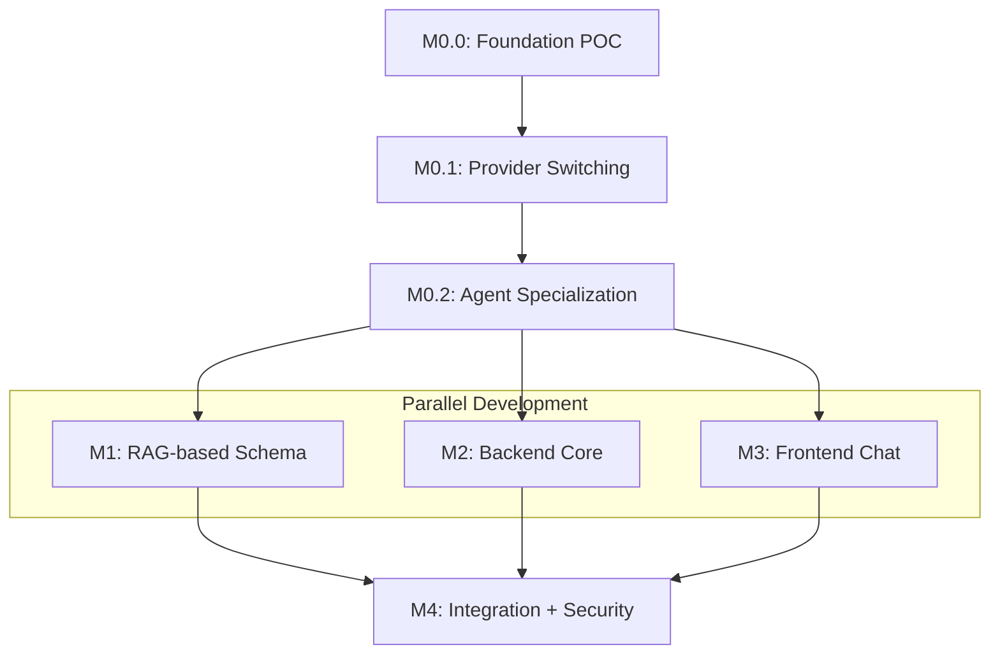

# Tasks: Catalyst - LLM-Powered Lab Data Assistant

**Branch**: `spec/OGC-070-catalyst-assistant` | **Date**: 2026-01-21  
**Input**: Design documents from `/specs/OGC-070-catalyst-assistant/`  
**Prerequisites**: plan.md, spec.md, research.md, data-model.md, contracts/

**Organization**: Tasks are organized by **Milestone** per Constitution
Principle IX. Tests are **MANDATORY** per Constitution Principle V (TDD).

## Format: `[ID] [P?] [M#] Description`

- **[P]**: Can run in parallel (different files, no dependencies)
- **[M#]**: Which milestone this task belongs to (e.g., M0, M1, M2, M3, M4)
- Include exact file paths in descriptions

## Total Task Count

- **M0.0 (Foundation POC)**: 18 tasks (Router + CatalystAgent + MCP skeleton)
- **M0.1 (Provider Switching)**: 4 tasks
- **M0.2 (Agent Specialization)**: 14 tasks (split CatalystAgent)
- **M1 (RAG-based Schema)**: 18 tasks (RAG + real MCP tools)
- **M2 (Backend Core)**: 28 tasks (reduced - security deferred)
- **M3 (Frontend Chat)**: 22 tasks (reduced - token handling deferred)
- **M4 (Integration + Security)**: 31 tasks (includes role-based access control)
- **Total**: 135 tasks (adjusted for proper architecture foundation)

---

## Milestone 0.0: Foundation POC (Estimate: 2-3 days)

**Branch**: `feat/OGC-070-catalyst-assistant-m0-foundation-poc`  
**Goal**: Prove A2A Router → Agent → MCP tool flow works end-to-end  
**Verification**: Router → CatalystAgent → MCP → LLM → SQL flow complete

### M0.0.1: Branch Setup & Project Structure (med-agent-hub style)

- [ ] T001 [M0.0] Create milestone branch
      `feat/OGC-070-catalyst-assistant-m0-foundation-poc` from `develop`
- [ ] T002 [M0.0] Create project directory structure `projects/catalyst/` with
      med-agent-hub-style layout (server/, tests/, .well-known/)
- [ ] T002a [M0.0] Create `projects/catalyst/pyproject.toml` with dependencies:
      a2a-sdk[http-server] >=0.3.22, mcp, httpx, google-generativeai
- [ ] T003 [P] [M0.0] Create `projects/catalyst/server/__init__.py`
- [ ] T003a [P] [M0.0] Create `projects/catalyst/server/sdk_agents/__init__.py`
- [ ] T003b [P] [M0.0] Create `projects/catalyst/server/mcp/__init__.py`
- [ ] T003c [P] [M0.0] Create `projects/catalyst/server/agent_cards/` directory
- [ ] T003d [P] [M0.0] Create `projects/catalyst/tests/__init__.py`

### M0.0.2: MCP Skeleton Test (TDD - MANDATORY)

> **NOTE: Write this test FIRST, ensure it FAILS before implementation**

- [ ] T004 [P] [M0.0] Write pytest test for hardcoded MCP `get_schema` tool in
      `projects/catalyst/tests/test_mcp_tools.py`

### M0.0.3: MCP Skeleton Implementation

- [ ] T005 [M0.0] Implement hardcoded MCP `get_schema` tool in
      `projects/catalyst/server/mcp/schema_tools.py` (returns 3-5 tables as
      string: sample, test, analysis, patient, organization)

### M0.0.4: CatalystAgent Test (TDD - MANDATORY)

> **NOTE: Write this test FIRST, ensure it FAILS before implementation**

- [ ] T006 [P] [M0.0] Write pytest test for CatalystAgent (schema + SQL
      generation) in `projects/catalyst/tests/test_catalyst_agent.py`

### M0.0.5: CatalystAgent Implementation

- [ ] T007 [M0.0] Implement `projects/catalyst/server/llm_clients.py` with LM
      Studio provider support (OpenAI-compatible API)
- [ ] T008 [M0.0] Implement `projects/catalyst/server/config.py` for LLM
      configuration loading
- [ ] T009 [M0.0] Implement CatalystAgent executor in
      `projects/catalyst/server/sdk_agents/catalyst_executor.py` (calls MCP
      get_schema, then generates SQL via LLM)
- [ ] T010 [M0.0] Implement CatalystAgent server in
      `projects/catalyst/server/sdk_agents/catalyst_server.py` with FastAPI +
      A2A SDK
- [ ] T011 [M0.0] Create CatalystAgent card at
      `projects/catalyst/server/agent_cards/catalyst.json` per A2A spec

### M0.0.6: RouterAgent Test (TDD - MANDATORY)

> **NOTE: Write this test FIRST, ensure it FAILS before implementation**

- [ ] T012 [P] [M0.0] Write pytest test for RouterAgent delegation in
      `projects/catalyst/tests/test_router.py`

### M0.0.7: RouterAgent Implementation

- [ ] T013 [M0.0] Implement RouterAgent executor in
      `projects/catalyst/server/sdk_agents/router_executor.py` (simple
      pass-through delegation to CatalystAgent)
- [ ] T014 [M0.0] Implement RouterAgent server in
      `projects/catalyst/server/sdk_agents/router_server.py` with FastAPI + A2A
      SDK
- [ ] T015 [M0.0] Create RouterAgent card at
      `projects/catalyst/server/agent_cards/router.json` per A2A spec
- [ ] T016 [M0.0] Create discovery endpoint at
      `projects/catalyst/.well-known/agent.json` pointing to RouterAgent

### M0.0.8: Integration Test (TDD - MANDATORY)

> **NOTE: Write this test FIRST, ensure it FAILS before implementation**

- [ ] T017 [P] [M0.0] Write pytest integration test for full Router →
      CatalystAgent → MCP flow in `projects/catalyst/tests/test_integration.py`

### M0.0.9: Verification & PR

- [ ] T018 [M0.0] Run pytest to verify all M0.0 tests pass, verify curl to
      Router returns SQL, create PR
      `feat/OGC-070-catalyst-assistant-m0-foundation-poc` → `develop`

---

## Milestone 0.1: Provider Switching (Estimate: 0.5 days)

**Branch**: `feat/OGC-070-catalyst-assistant-m0-provider-switching`  
**Goal**: Prove same agent works with local AND cloud providers  
**Verification**: Both providers (LM Studio, Gemini) generate SQL

### M0.1.1: Provider Switching Tests (TDD - MANDATORY)

> **NOTE: Write these tests FIRST, ensure they FAIL before implementation**

- [ ] T019 [P] [M0.1] Write pytest test for CatalystAgent provider switching
      (Gemini/LM Studio) in `projects/catalyst/tests/test_catalyst_agent.py`
      (FR-007)

### M0.1.2: Provider Implementation

- [ ] T020 [M0.1] Add Gemini provider support to
      `projects/catalyst/server/llm_clients.py`
- [ ] T021 [M0.1] Update CatalystAgent executor in
      `projects/catalyst/server/sdk_agents/catalyst_executor.py` to use
      provider-agnostic LLM client
- [ ] T022 [M0.1] Create agent configuration in
      `projects/catalyst/server/config/agents_config.yaml` with both providers
      (Gemini, LM Studio)

### M0.1.3: Verification & PR

- [ ] T023 [M0.1] Run pytest to verify all provider tests pass, test with each
      provider (LM Studio and Gemini), create PR
      `feat/OGC-070-catalyst-assistant-m0-provider-switching` → `develop`

---

## Milestone 0.2: Agent Specialization (Estimate: 2 days)

**Branch**: `feat/OGC-070-catalyst-assistant-m0-agent-specialization`  
**Goal**: Split CatalystAgent into specialized SchemaAgent + SQLGenAgent  
**Verification**: Router → SchemaAgent → SQLGenAgent flow works, CatalystAgent
fallback works

### M0.2.1: SchemaAgent Test (TDD - MANDATORY)

> **NOTE: Write this test FIRST, ensure it FAILS before implementation**

- [ ] T019 [P] [M0.2] Write pytest test for SchemaAgent (calls MCP get_schema)
      in `projects/catalyst/tests/test_schema_agent.py`

### M0.2.2: SchemaAgent Implementation

- [ ] T020 [M0.2] Implement SchemaAgent executor in
      `projects/catalyst/server/sdk_agents/schema_executor.py` (calls MCP
      get_schema, returns schema context)
- [ ] T021 [M0.2] Implement SchemaAgent server in
      `projects/catalyst/server/sdk_agents/schema_server.py` with FastAPI + A2A
      SDK
- [ ] T022 [M0.2] Create SchemaAgent card at
      `projects/catalyst/server/agent_cards/schema.json` per A2A spec

### M0.2.3: SQLGenAgent Test (TDD - MANDATORY)

> **NOTE: Write this test FIRST, ensure it FAILS before implementation**

- [ ] T023 [P] [M0.2] Write pytest test for SQLGenAgent (receives schema
      context) in `projects/catalyst/tests/test_sqlgen_agent.py`

### M0.2.4: SQLGenAgent Implementation

- [ ] T024 [M0.2] Implement SQLGenAgent executor in
      `projects/catalyst/server/sdk_agents/sqlgen_executor.py` (receives schema
      from SchemaAgent, generates SQL via LLM)
- [ ] T025 [M0.2] Implement SQLGenAgent server in
      `projects/catalyst/server/sdk_agents/sqlgen_server.py` with FastAPI + A2A
      SDK
- [ ] T026 [M0.2] Create SQLGenAgent card at
      `projects/catalyst/server/agent_cards/sqlgen.json` per A2A spec

### M0.2.5: RouterAgent Update

- [ ] T027 [M0.2] Update RouterAgent executor in
      `projects/catalyst/server/sdk_agents/router_executor.py` to orchestrate:
      query → SchemaAgent → SQLGenAgent → response
- [ ] T028 [M0.2] Update RouterAgent card at
      `projects/catalyst/server/agent_cards/router.json` to reference
      SchemaAgent + SQLGenAgent

### M0.2.6: Integration Test

> **NOTE: Write this test FIRST, ensure it FAILS before implementation**

- [ ] T029 [P] [M0.2] Write pytest integration test for Router → SchemaAgent →
      SQLGenAgent flow in `projects/catalyst/tests/test_multi_agent_flow.py`

### M0.2.7: Single-Agent Fallback

- [ ] T030 [M0.2] Add single-agent fallback mode to RouterAgent (direct to
      CatalystAgent when `mode=single`)
- [ ] T031 [P] [M0.2] Write pytest test for single-agent fallback in
      `projects/catalyst/tests/test_fallback_mode.py`

### M0.2.8: Verification & PR

- [ ] T032 [M0.2] Run pytest to verify all M0.2 tests pass, verify multi-agent
      flow works, verify fallback mode works, create PR
      `feat/OGC-070-catalyst-assistant-m0-agent-specialization` → `develop`

---

## Milestone 1: RAG-based Schema (Estimate: 3-4 days) [PARALLEL]

**Branch**: `feat/OGC-070-catalyst-assistant-m1-rag-schema`  
**Goal**: Replace hardcoded schema with ChromaDB RAG-based retrieval  
**Verification**: MCP tools return real schema, RAG retrieval works  
**Depends On**: M0 (MCP skeleton and SchemaAgent exist)

### M1.1: Branch Setup

- [ ] T024 [M1] Create milestone branch
      `feat/OGC-070-catalyst-assistant-m1-rag-schema` from `develop` (after M0.2
      merged)

### M1.2: RAG Retrieval Tests (TDD - MANDATORY)

> **NOTE: Write these tests FIRST, ensure they FAIL before implementation**

- [ ] T034 [P] [M1] Write pytest test for RAG retriever in
      `projects/catalyst/tests/test_rag_retrieval.py`
- [ ] T035 [P] [M1] Write pytest test for PostgreSQL schema extraction in
      `projects/catalyst/tests/test_schema_extraction.py`
- [ ] T036 [P] [M1] Write pytest test for `get_relevant_tables` with RAG in
      `projects/catalyst/tests/test_mcp_tools.py` (update existing test)
- [ ] T037 [P] [M1] Write pytest test for `get_table_ddl` in
      `projects/catalyst/tests/test_mcp_tools.py`
- [ ] T038 [P] [M1] Write pytest test for `get_relationships` in
      `projects/catalyst/tests/test_mcp_tools.py`

### M1.3: PostgreSQL Schema Extraction

- [ ] T039 [M1] Add chromadb and langchain dependencies to
      `projects/catalyst/pyproject.toml` for RAG
- [ ] T040 [M1] Create `projects/catalyst/server/mcp/db/__init__.py`
- [ ] T041 [M1] Implement PostgreSQL schema extractor in
      `projects/catalyst/server/mcp/db/schema_extractor.py` (extract table DDL,
      columns, relationships)

### M1.4: RAG Implementation

- [ ] T042 [M1] Create `projects/catalyst/server/mcp/rag/__init__.py`
- [ ] T043 [M1] Implement embeddings in
      `projects/catalyst/server/mcp/rag/embeddings.py`
- [ ] T044 [M1] Implement ChromaDB retriever in
      `projects/catalyst/server/mcp/rag/retriever.py` (embedding generation +
      similarity search)

### M1.5: MCP Tools Enhancement

- [ ] T045 [M1] Update `projects/catalyst/server/mcp/schema_tools.py` to use
      RAG-based retrieval (replace hardcoded get_schema with
      get_relevant_tables)
- [ ] T046 [M1] Implement `get_table_ddl` MCP tool in schema_tools.py using
      schema extractor
- [ ] T047 [M1] Create `projects/catalyst/server/mcp/relationship_tools.py`
- [ ] T048 [M1] Implement `get_relationships` MCP tool in relationship_tools.py

### M1.6: Deployment

- [ ] T049 [M1] Create Dockerfile.mcp in `projects/catalyst/Dockerfile.mcp` for
      containerized MCP server deployment
- [ ] T050 [M1] Update `projects/catalyst/catalyst-dev.docker-compose.yml` to
      add MCP server as separate container (if not already present)

### M1.7: Verification & PR

- [ ] T051 [M1] Run pytest to verify all M1 tests pass, verify MCP tools return
      real schema from PostgreSQL, verify SchemaAgent retrieves relevant tables
      based on query semantics, create PR
      `feat/OGC-070-catalyst-assistant-m1-rag-schema` → `develop`

### M1.4: RAG Implementation

- [ ] T038 [M1] Implement schema embedding generation in
      `projects/catalyst/catalyst-mcp/src/rag/embeddings.py` with ChromaDB
- [ ] T039 [M1] Implement vector retriever in
      `projects/catalyst/catalyst-mcp/src/rag/retriever.py` for RAG-based table
      filtering

### M1.6: Deployment

- [ ] T049 [M1] Create Dockerfile.mcp in `projects/catalyst/Dockerfile.mcp` for
      containerized MCP server deployment
- [ ] T050 [M1] Update `projects/catalyst/catalyst-dev.docker-compose.yml` to
      add MCP server as separate container (if not already present)

### M1.7: Verification & PR

- [ ] T051 [M1] Run pytest to verify all M1 tests pass, verify MCP tools return
      real schema from PostgreSQL, verify SchemaAgent retrieves relevant tables
      based on query semantics, create PR
      `feat/OGC-070-catalyst-assistant-m1-rag-schema` → `develop`

---

## Milestone 2: Backend Core (Estimate: 4-5 days) [PARALLEL]

**Branch**: `feat/OGC-070-catalyst-assistant-m2-backend-core`  
**Goal**: Implement Java OpenELIS integration with A2A client, SQL guardrails,
audit logging (no security features)  
**Verification**: Unit tests pass, ORM test passes, A2A client calls
RouterAgent  
**Depends On**: M0 (needs RouterAgent to call)  
**Note**: Security features (PHI detection, confirmation tokens) deferred to M4

### M2.1: Branch Setup & Package Structure

- [ ] T045 [M2] Create milestone branch
      `feat/OGC-070-catalyst-assistant-m2-backend-core` from `develop`
- [ ] T045a [M2] Add HTTP client dependency to `pom.xml` for A2A agent
      communication (e.g., Apache HttpClient or OkHttp)
- [ ] T045b [M2] Add JSON processing dependency to `pom.xml` if not already
      present (Jackson)
- [ ] T046 [M2] Create package structure
      `src/main/java/org/openelisglobal/catalyst/` with subpackages (config,
      agent, service, dao, valueholder, guardrails, form)

### M2.2: Backend Tests (TDD - MANDATORY)

> **NOTE: Write these tests FIRST, ensure they FAIL before implementation**

- [ ] T047 [P] [M2] Write ORM validation test for CatalystQuery entity in
      `src/test/java/org/openelisglobal/catalyst/HibernateMappingValidationTest.java`
      (Constitution V.4)
- [ ] T048 [P] [M2] Write JUnit test for CatalystQueryService in
      `src/test/java/org/openelisglobal/catalyst/service/CatalystQueryServiceTest.java`
      with mocked A2A client
- [ ] T048a [P] [M2] Write JUnit test for audit metadata capture (providerType,
      providerId, tablesUsed) in
      `src/test/java/org/openelisglobal/catalyst/service/CatalystQueryServiceTest.java`
      (FR-019 - without phiGated, deferred to M4)
- [ ] T049 [P] [M2] Write JUnit test for A2AAgentClient in
      `src/test/java/org/openelisglobal/catalyst/agent/A2AAgentClientTest.java`
- [ ] T050 [P] [M2] Write JUnit test for SQLGuardrails in
      `src/test/java/org/openelisglobal/catalyst/guardrails/SQLGuardrailsTest.java`
      (blocked tables only, NO PHI detection - deferred to M4)
- [ ] T050a [P] [M2] Write JUnit test for row estimation (EXPLAIN-based) in
      `src/test/java/org/openelisglobal/catalyst/guardrails/SQLGuardrailsTest.java`
      (FR-009)
- [ ] T050b [P] [M2] Write JUnit test for >10k row warning/truncation logic in
      `src/test/java/org/openelisglobal/catalyst/guardrails/SQLGuardrailsTest.java`
      (FR-009)

### M2.3: Entity Layer (Valueholder)

- [ ] T051 [M2] Create CatalystQuery valueholder in
      `src/main/java/org/openelisglobal/catalyst/valueholder/CatalystQuery.java`
      extending BaseObject with JPA annotations (user_id, query_text,
      generated_sql, provider_type, provider_id, tables_used, timestamp)
      (FR-019 - without phi_gated and confirmation_token, deferred to M4)

### M2.4: DAO Layer

- [ ] T052 [M2] Create CatalystQueryDAO interface in
      `src/main/java/org/openelisglobal/catalyst/dao/CatalystQueryDAO.java`
- [ ] T053 [M2] Implement CatalystQueryDAOImpl in
      `src/main/java/org/openelisglobal/catalyst/dao/CatalystQueryDAOImpl.java`
      extending BaseDAOImpl with @Component

### M2.5: Service Layer

- [ ] T054 [M2] Create CatalystQueryService interface in
      `src/main/java/org/openelisglobal/catalyst/service/CatalystQueryService.java`
- [ ] T055 [M2] Implement CatalystQueryServiceImpl in
      `src/main/java/org/openelisglobal/catalyst/service/CatalystQueryServiceImpl.java`
      with @Service and @Transactional
- [ ] T055a [M2] Implement row estimation using EXPLAIN in
      `src/main/java/org/openelisglobal/catalyst/service/CatalystQueryServiceImpl.java`
      (FR-009)
- [ ] T056 [M2] Implement SQL guardrails in
      `src/main/java/org/openelisglobal/catalyst/guardrails/SQLGuardrails.java`
      (blocked tables, SQL validation - NO PHI detection, deferred to M4)

### M2.6: A2A Agent Client

- [ ] T057 [M2] Create A2AAgentClient interface in
      `src/main/java/org/openelisglobal/catalyst/agent/A2AAgentClient.java`
- [ ] T058 [M2] Implement A2AAgentClientImpl in
      `src/main/java/org/openelisglobal/catalyst/agent/A2AAgentClientImpl.java`
      with HTTP client to call RouterAgent

### M2.7: Configuration

- [ ] T059 [M2] Create CatalystAgentConfig in
      `src/main/java/org/openelisglobal/catalyst/config/CatalystAgentConfig.java`
      with @Configuration for A2A agent URL and mode (multi/single)
- [ ] T060 [M2] Create CatalystDatabaseConfig in
      `src/main/java/org/openelisglobal/catalyst/config/CatalystDatabaseConfig.java`
      for read-only connection
- [ ] T061 [M2] Create Catalyst properties file in
      `volume/properties/catalyst.properties` with agent URL, mode, guardrails
      config

### M2.8: Database Schema

- [ ] T062 [M2] Create Liquibase changeset in
      `src/main/resources/liquibase/catalyst/catalyst-001-create-audit-table.xml`
      for CatalystQuery table without security fields (phi_gated,
      confirmation_token added in M4) (Constitution VI)

### M2.9: Forms (DTOs)

- [ ] T063 [P] [M2] Create CatalystQueryForm in
      `src/main/java/org/openelisglobal/catalyst/form/CatalystQueryForm.java`
      for request mapping
- [ ] T064 [P] [M2] Create CatalystQueryResponse in
      `src/main/java/org/openelisglobal/catalyst/form/CatalystQueryResponse.java`
      for response mapping

### M2.10: Verification & PR

- [ ] T065 [M2] Run ORM validation test (MUST pass in <5s, no database)
- [ ] T066 [M2] Run unit tests with Maven (MUST pass, >80% coverage target)
- [ ] T067 [M2] Format code with `mvn spotless:apply` (MANDATORY before commit)
- [ ] T068 [M2] Build backend with
      `mvn clean install -DskipTests -Dmaven.test.skip=true`
- [ ] T069 [M2] Verify A2A client can call RouterAgent (integration check)
- [ ] T070 [M2] Create PR `feat/OGC-070-catalyst-assistant-m2-backend-core` →
      `develop`

---

## Milestone 3: Frontend Chat (Estimate: 3-4 days) [PARALLEL]

**Branch**: `feat/OGC-070-catalyst-assistant-m3-frontend-chat`  
**Goal**: Implement Carbon chat sidebar with i18n, query input, results
display  
**Verification**: Jest tests pass, component renders correctly with en/fr
translations

### M3.1: Branch Setup & Component Structure

- [ ] T071 [M3] Create milestone branch
      `feat/OGC-070-catalyst-assistant-m3-frontend-chat` from `develop`
- [ ] T071a [M3] Add @carbon/ai-chat dependency to `frontend/package.json`
      (version 1.0+)
- [ ] T072 [M3] Create component directory `frontend/src/components/catalyst/`
      with index.js

### M3.2: Frontend Tests (TDD - MANDATORY)

> **NOTE: Write these tests FIRST, ensure they FAIL before implementation**

- [ ] T073 [P] [M3] Write Jest test for CatalystSidebar in
      `frontend/src/components/catalyst/__tests__/CatalystSidebar.test.jsx`
      (render, i18n)
- [ ] T074 [P] [M3] Write Jest test for ChatInterface in
      `frontend/src/components/catalyst/__tests__/ChatInterface.test.jsx`
      (message display)
- [ ] T075 [P] [M3] Write Jest test for QueryInput in
      `frontend/src/components/catalyst/__tests__/QueryInput.test.jsx` (user
      input)
- [ ] T076 [P] [M3] Write Jest test for ResultsDisplay in
      `frontend/src/components/catalyst/__tests__/ResultsDisplay.test.jsx`
      (table rendering)

### M3.3: Component Implementation

- [ ] T077 [M3] Implement CatalystSidebar in
      `frontend/src/components/catalyst/CatalystSidebar.jsx` using
      @carbon/ai-chat
- [ ] T078 [M3] Implement ChatInterface in
      `frontend/src/components/catalyst/ChatInterface.jsx` with message list and
      Carbon components
- [ ] T079 [M3] Implement QueryInput in
      `frontend/src/components/catalyst/QueryInput.jsx` with Carbon TextInput
      and Button
- [ ] T080 [M3] Implement ResultsDisplay in
      `frontend/src/components/catalyst/ResultsDisplay.jsx` with Carbon
      DataTable
- [ ] T080a [M3] Implement >10k row warning UI in
      `frontend/src/components/catalyst/ResultsDisplay.jsx` (FR-009)
- [ ] T081 [M3] Implement SQLPreview in
      `frontend/src/components/catalyst/SQLPreview.jsx` with Carbon CodeSnippet
- [ ] T081a [M3] Implement example prompts display in
      `frontend/src/components/catalyst/CatalystSidebar.jsx` with Carbon
      components (FR-014)
- [ ] T081b [M3] Add example prompts i18n keys to
      `frontend/src/languages/en.json` and `frontend/src/languages/fr.json`
      (FR-014)

### M3.4: Internationalization (Constitution VII - MANDATORY)

- [ ] T082 [M3] Add Catalyst keys to `frontend/src/languages/en.json`
      (catalyst.sidebar.title, catalyst.query.placeholder,
      catalyst.button.submit, catalyst.results.title, catalyst.sql.preview,
      etc.)
- [ ] T083 [M3] Add Catalyst keys to `frontend/src/languages/fr.json` with
      French translations (Constitution VII - minimum en + fr)

### M3.5: Component Exports

- [ ] T084 [M3] Export components from
      `frontend/src/components/catalyst/index.js`

### M3.6: Verification & PR

- [ ] T085 [M3] Run Jest tests with `npm test` (MUST pass, >70% coverage target)
- [ ] T086 [M3] Format code with `npm run format` (MANDATORY before commit)
- [ ] T087 [M3] Verify components render correctly with `npm start` (manual
      check)
- [ ] T088 [M3] Verify i18n works for en/fr by switching language in browser
- [ ] T089 [M3] Create PR `feat/OGC-070-catalyst-assistant-m3-frontend-chat` →
      `develop`

---

## Milestone 4: Integration + Security (Estimate: 3-4 days) [SEQUENTIAL - depends on M0.2, M1, M2, M3]

**Branch**: `feat/OGC-070-catalyst-assistant-m4-integration-security`  
**Goal**: Wire all components, implement REST controller, add security features
(role-based endpoint access, PHI detection, confirmation tokens), create E2E
test  
**Verification**: Controller integration tests pass (including role check), E2E
test passes (chat→agents→SQL→results), security features work (FR-021, FR-016,
FR-018)

### M4.1: Branch Setup & REST Controller

- [ ] T090 [M4] Create milestone branch
      `feat/OGC-070-catalyst-assistant-m4-integration-security` from `develop`
      (merge M0.2, M1, M2, M3 first)
- [ ] T091 [M4] Implement CatalystRestController in
      `src/main/java/org/openelisglobal/catalyst/controller/CatalystRestController.java`
      with @RestController and /rest/catalyst/query endpoint

### M4.2: Integration Tests (TDD - MANDATORY)

> **NOTE: Write these tests FIRST, ensure they FAIL before implementation**

- [ ] T092 [P] [M4] Write controller integration test for /rest/catalyst/query
      in
      `src/test/java/org/openelisglobal/catalyst/controller/CatalystRestControllerTest.java`
      extending BaseWebContextSensitiveTest
- [ ] T093 [M4] Write Cypress E2E test in `frontend/cypress/e2e/catalyst.cy.js`
      proving full chat→agents→SQL→confirmation→results flow (Constitution V.5)
- [ ] T093a [M4] Write Cypress E2E test for JOIN queries in
      `frontend/cypress/e2e/catalyst.cy.js` (FR-015)
- [ ] T093b [M4] Write Cypress E2E test for aggregation queries in
      `frontend/cypress/e2e/catalyst.cy.js` (FR-015)
- [ ] T093c [M4] Write Cypress E2E test for date filtering queries in
      `frontend/cypress/e2e/catalyst.cy.js` (FR-015)

### M4.3: Full Stack Integration

- [ ] T094 [M4] Wire frontend CatalystSidebar to backend REST endpoint with
      fetch/axios in `frontend/src/components/catalyst/CatalystSidebar.jsx`
- [ ] T094a [M4] Implement basic query handling in frontend (confirmation token
      handling deferred to M4.6)
- [ ] T095 [M4] Configure full stack Docker Compose in
      `projects/catalyst/catalyst-dev.docker-compose.yml` (agents + MCP +
      OpenELIS + frontend)
- [ ] T096 [M4] Add Agent Card discovery endpoint proxy at
      `/.well-known/agent.json` in
      `src/main/java/org/openelisglobal/catalyst/controller/CatalystRestController.java`

### M4.4: Response Formatting & Export

- [ ] T097 [M4] Implement table response formatting in
      `src/main/java/org/openelisglobal/catalyst/service/CatalystQueryServiceImpl.java`
- [ ] T098 [M4] Implement CSV export endpoint in
      `src/main/java/org/openelisglobal/catalyst/controller/CatalystRestController.java`
      (GET /export/{queryId}?format=csv per contract)
- [ ] T099 [M4] Implement JSON export endpoint in
      `src/main/java/org/openelisglobal/catalyst/controller/CatalystRestController.java`
      (GET /export/{queryId}?format=json per contract)

### M4.5: Role-Based Endpoint Access Control (FR-021)

> **NOTE: Write tests FIRST, ensure they FAIL before implementation**

- [ ] T099a [P] [M4] Write integration test for role-based access control in
      `src/test/java/org/openelisglobal/catalyst/controller/CatalystRestControllerTest.java`:
      test that users with `Global Administrator` role can access endpoint, test
      that users with `Reports` role can access endpoint, test that users
      without these roles receive 403 Forbidden
- [ ] T099b [M4] Implement role check in CatalystRestController: inject
      `UserRoleService`, check
      `userInRole(sysUserId, Constants.ROLE_GLOBAL_ADMIN)` or
      `userInRole(sysUserId, Constants.ROLE_REPORTS)` before processing request.
      Return 403 Forbidden if user lacks required roles. (Pattern: see
      `PatientMergeRestController` and `StorageLocationRestController`)
- [ ] T099c [M4] Write Cypress E2E test in `frontend/cypress/e2e/catalyst.cy.js`
      verifying that non-privileged users cannot access Catalyst (shows access
      denied message)
- [ ] T099d [M4] Add user-friendly "Access Denied" UI message in
      `frontend/src/components/catalyst/CatalystSidebar.jsx` when backend
      returns 403 (i18n key: `catalyst.error.accessDenied`)

### M4.6: Security Features (Deferred from M0/M2)

- [ ] T090a [M4] Add PHI detection to RouterAgent in
      `projects/catalyst/catalyst-agents/src/agents/router_agent.py` (FR-018)
- [ ] T090b [M4] Add provider routing for PHI-flagged queries in RouterAgent: if
      PHI detected and provider is external, route to local provider if healthy,
      else block
- [ ] T090c [M4] Add confirmation_token column to CatalystQuery entity in
      `src/main/java/org/openelisglobal/catalyst/valueholder/CatalystQuery.java`
      (FR-016)
- [ ] T090d [M4] Add phi_gated column to CatalystQuery entity in
      `src/main/java/org/openelisglobal/catalyst/valueholder/CatalystQuery.java`
      (FR-019)
- [ ] T090e [M4] Create Liquibase changeset to add confirmation_token and
      phi_gated columns to catalyst_query table in
      `src/main/resources/liquibase/catalyst/catalyst-002-add-security-fields.xml`
- [ ] T090f [M4] Implement confirmation token generation in
      `src/main/java/org/openelisglobal/catalyst/service/CatalystQueryServiceImpl.java`
      (compute hash from generated SQL) (FR-016)
- [ ] T090g [M4] Implement confirmation token validation in
      `src/main/java/org/openelisglobal/catalyst/service/CatalystQueryServiceImpl.java`
      (validate token matches SQL before execution) (FR-016)
- [ ] T090h [M4] Update audit metadata capture to include phiGated in
      `src/main/java/org/openelisglobal/catalyst/service/CatalystQueryServiceImpl.java`
      (FR-019)
- [ ] T090i [M4] Write pytest test for RouterAgent PHI detection and provider
      routing in `projects/catalyst/catalyst-agents/tests/test_router_agent.py`
      (FR-018)
- [ ] T090j [M4] Write unit test for confirmation token validation in
      `src/test/java/org/openelisglobal/catalyst/service/CatalystQueryServiceTest.java`
      (test token mismatch rejection)
- [ ] T090k [M4] Write unit test for PHI gating in
      `src/test/java/org/openelisglobal/catalyst/service/CatalystQueryServiceTest.java`
- [ ] T090l [M4] Implement confirmation token handling in frontend: store token
      from generation response, include in execution request in
      `frontend/src/components/catalyst/CatalystSidebar.jsx`
- [ ] T090m [M4] Write E2E test for PHI blocking in
      `frontend/cypress/e2e/catalyst.cy.js` (FR-018)
- [ ] T090n [M4] Write E2E test for confirmation flow in
      `frontend/cypress/e2e/catalyst.cy.js` (FR-016)

### M4.7: Verification & PR

- [ ] T100 [M4] Run controller integration tests with Maven (MUST pass)
- [ ] T101 [M4] Run Cypress E2E test individually with
      `npm run cy:run -- --spec "cypress/e2e/catalyst.cy.js"` (Constitution V.5)
- [ ] T102 [M4] Verify multi-agent flow works (Router delegates to Schema +
      SQLGen)
- [ ] T103 [M4] Verify single-agent fallback mode works when configured
- [ ] T104 [M4] Verify security features work (PHI detection, confirmation
      tokens)
- [ ] T104a [M4] Verify role-based access control works (privileged users can
      access, non-privileged users get 403)
- [ ] T105 [M4] Create PR
      `feat/OGC-070-catalyst-assistant-m4-integration-security` → `develop`

---

## Dependencies & Execution Order

### Milestone Dependencies



- **M0.0 → M0.1 → M0.2**: Sequential (foundational architecture validation)
- **M1, M2, M3**: Can be developed in parallel after M0.2 (marked [P] in
  milestone table)
- **M4**: MUST wait for M0.2, M1, M2, M3 to complete (sequential)

### Within Each Milestone

1. **Branch creation task** runs first
2. **Tests** MUST be written before implementation (TDD - Constitution V)
3. **Implementation** follows Red-Green-Refactor cycle
4. **Verification** confirms all tests pass
5. **PR creation** marks milestone complete

### Parallel Opportunities

- **M0-M3** can be worked on by different developers simultaneously
- Within each milestone, tasks marked [P] can run in parallel
- Tests within a milestone marked [P] can run in parallel

---

## Parallel Example: M2 (Backend Core)

```bash
# Launch all tests together (TDD):
Task T047: "Write ORM validation test for CatalystQuery entity"
Task T048: "Write JUnit test for CatalystQueryService"
Task T049: "Write JUnit test for A2AAgentClient"
Task T050: "Write JUnit test for SQLGuardrails"

# Launch all form DTOs together:
Task T063: "Create CatalystQueryForm"
Task T064: "Create CatalystQueryResponse"
```

---

## Implementation Strategy

### MVP Delivery (All Milestones)

1. **Week 1**: M0.0 (Foundation POC) → M0.1 (Provider Switching) → M0.2 (Agent
   Specialization)
2. **Week 2**: M1 (RAG-based Schema) + M2 (Backend Core) + M3 (Frontend Chat) in
   parallel
3. **Week 3**: M4 (Integration + Security) + Testing + Bug fixes
4. **Deploy MVP**: Full chat→agents→SQL→results flow validated with security
   features

### Constitution Checkpoints (MANDATORY)

- **After M0.0**: Router → CatalystAgent → MCP flow MUST work end-to-end
- **After M0.1**: Provider switching tests MUST pass, both providers (Gemini +
  LM Studio) work
- **After M0.2**: Router → SchemaAgent → SQLGenAgent flow MUST work,
  single-agent fallback works
- **After M1**: MCP tests MUST pass, MCP tools callable
- **After M2**: ORM test + unit tests MUST pass (>80% coverage)
- **After M3**: Jest tests MUST pass (>70% coverage)
- **After M4**: E2E test MUST pass, security features validated (Constitution
  V.5)

### Pre-Commit Checklist (MANDATORY)

```bash
# Backend (M2, M4)
mvn spotless:apply                                    # Format code
mvn clean install -DskipTests -Dmaven.test.skip=true  # Build
mvn test                                              # Run tests

# Frontend (M3, M4)
npm run format                                        # Format code
npm test                                              # Run tests
npm run cy:run -- --spec "cypress/e2e/catalyst.cy.js" # E2E test (M4 only)

# Python (M0, M1)
pytest                                                # Run tests
```

---

## Notes

- **[P]** tasks = different files, no dependencies, can run in parallel
- **[M#]** label maps task to specific milestone for traceability
- Each milestone is independently completable and testable
- **Tests FIRST** (TDD - Constitution V): Verify tests fail before implementing
- **Format code** before EVERY commit (Constitution: `mvn spotless:apply`,
  `npm run format`)
- **Individual E2E tests** during development (Constitution V.5:
  `npm run cy:run -- --spec "cypress/e2e/catalyst.cy.js"`)
- Commit after each task or logical group
- Stop at any checkpoint to validate milestone independently
