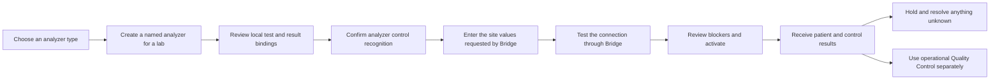
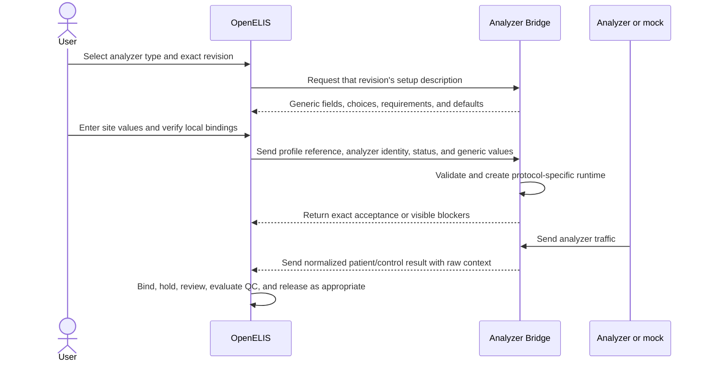

# OGC-1054 Feature Map

**Updated:** 2026-08-24

**Purpose:** Plain-language review aid for the analyzer feature

**Status authority:** [Authoritative roadmap](../roadmaps/ogc-1054-analyzer-feature-roadmap.md)

This page explains the feature without creating another source of delivery
state. Roadmap markers change only in the authoritative roadmap. GitHub remains
the source for pull-request and merge state.

## Start Here

| Question                      | Current answer                                                                                                                                                                                                    |
| ----------------------------- | ----------------------------------------------------------------------------------------------------------------------------------------------------------------------------------------------------------------- |
| What is the product outcome?  | A laboratory administrator chooses a reusable analyzer type, creates and verifies a local analyzer connection, connects it through Bridge, activates it, and safely reviews incoming patient and control results. |
| What is active now?           | M3: guided setup, connection testing, activation, lifecycle, and the link to operational Quality Control.                                                                                                         |
| Is the MVP accepted?          | No. M4 result traffic and G0 deployed human acceptance have not happened.                                                                                                                                         |
| What is the immediate defect? | The current M3 code makes OpenELIS interpret analyzer protocol and transport details that belong in Bridge.                                                                                                       |
| What must happen next?        | Correct the canonical M3 contract, remove or rewrite tests that require the wrong ownership, then replace the OpenELIS-specific runtime path with a generic Bridge-described setup path.                          |

## Product Story

The user should experience one analyzer dashboard, one separate Analyzer Types
manager, and links to existing Quality Control and alert workflows. The user
should never need to understand plugins, profile files, protocols, listeners,
payloads, or Bridge internals.

## System Responsibilities

| System              | Owns                                                                                                                                                                                                                                                                                                        | Must not own                                                                                                                                    |
| ------------------- | ----------------------------------------------------------------------------------------------------------------------------------------------------------------------------------------------------------------------------------------------------------------------------------------------------------- | ----------------------------------------------------------------------------------------------------------------------------------------------- |
| **Analyzer Bridge** | Reusable analyzer profiles and immutable revisions; the fields and defaults needed for site setup; protocol and transport behavior; listeners; parsing; connection tests; FILE watching and transport; control-result recognition; normalized output; runtime registration; outbound analyzer communication | OpenELIS laboratory units, local clinical catalog choices, operational Quality Control policy, result release, or user review decisions         |
| **OpenELIS**        | Named analyzer instances; selected profile ID and revision; lab units; generic site-entered values; local Test and Result Option bindings; verification and audit; activation intent; held results; alerts; clinical review; operational Quality Control                                                    | ASTM, HL7, FILE, TCP, serial, listener, parser, or analyzer-specific runtime decisions; a copied profile; a second mapping editor; FILE polling |
| **Analyzer mock**   | Realistic, deterministic instrument behavior and traffic for the priority analyzers                                                                                                                                                                                                                         | Profiles, mapping, activation, Quality Control, review, or other product workflows                                                              |
| **Review tooling**  | Grist checklist delivery, build identity, checklist revision, review capture, and report export                                                                                                                                                                                                             | Product behavior, fixtures, or acceptance decisions                                                                                             |

### Correct Setup Boundary

The decisive architecture test is:

> A valid profile revision can add, remove, or change a described site field
> without changing OpenELIS production code.

OpenELIS may display and retain the field; it may not interpret its analyzer
runtime meaning.

## How Configuration Relates To A Profile

| Information                     | Authority | Meaning                                                                                                                                                         |
| ------------------------------- | --------- | --------------------------------------------------------------------------------------------------------------------------------------------------------------- |
| Profile revision                | Bridge    | Immutable definition of one analyzer type: analyzer communication behavior plus the configuration fields and defaults for a new instance                        |
| Site-entered values             | OpenELIS  | The lab's desired values for the generic fields described by the pinned profile revision                                                                        |
| Effective runtime configuration | Bridge    | The pinned profile defaults merged with accepted site values and materialized into listeners, connections, parsers, routing, probes, and outbound behavior      |
| Local laboratory configuration  | OpenELIS  | Analyzer name, lab units, Test and Result Option bindings, verification/audit, activation intent, held results, review, alerts, and operational Quality Control |

OpenELIS keeps what the laboratory selected; Bridge alone decides what those
values mean to an analyzer runtime. OpenELIS does not copy the profile or store
Bridge's materialized runtime as a second authority. A new profile revision
never changes an existing analyzer implicitly.

The missing interface in the current implementation is a versioned generic
field description. The Bridge response must identify stable keys, input kinds,
requiredness, choices, conditions, defaults, and display information. OpenELIS
must render and retain those values without a protocol decision table. The
registration and probe requests then contain the exact profile pin plus those
generic values; Bridge validates and materializes both requests through the
same profile-owned logic.

## Why The Boundary Drifted

This was an implementation and review failure, not an unresolved product
choice.

| Evidence                                                                                                                                     | What it left behind                                                                                    |
| -------------------------------------------------------------------------------------------------------------------------------------------- | ------------------------------------------------------------------------------------------------------ |
| [OpenELIS PR #2767](https://github.com/DIGI-UW/OpenELIS-Global-2/pull/2767) introduced fixed analyzer network fields                         | The OpenELIS analyzer record became an analyzer-runtime schema rather than an abstract instance record |
| [OpenELIS PR #3195](https://github.com/DIGI-UW/OpenELIS-Global-2/pull/3195) moved FILE fields onto that record while making Bridge mandatory | Bridge owned execution, but OpenELIS still described FILE and network runtime configuration            |
| [OpenELIS PR #3390](https://github.com/DIGI-UW/OpenELIS-Global-2/pull/3390) sent editable analyzer identification rules to Bridge            | Operational Quality Control and analyzer control recognition became one mixed path                     |
| The pushed R0 runtime contract said OpenELIS sent connection choices and runtime configuration                                               | Detailed acceptance contradicted the roadmap's higher-level Bridge ownership rule                      |
| Existing tests asserted concrete GeneXpert, HL7, and FILE payloads                                                                           | The examples could pass without proving that OpenELIS remained analyzer-agnostic                       |

The required guard was absent: a synthetic valid profile must be able to add,
remove, or change its described site fields without an OpenELIS production-code
change. That guard is now mandatory for M3 and every later checkpoint.

## Measured Remediation Surface

The 2026-08-24 source audit found protocol/transport-specific OpenELIS concepts
in 25 production files and 27 test or evidence files. Of those, the active
OGC-1054 stack introduced 12 production files and 17 test or evidence files;
13 production files and 10 tests inherited the older model. These are affected
files, not files that must all be discarded.

The direct replacement surface is the fixed OpenELIS connection fields and
enums, profile-default interpretation, protocol-specific form branches,
runtime-payload construction, activation checks that interpret runtime details,
outbound host/protocol routing, and tests that require those behaviors. The
profile catalog, immutable revisions, type-management workflow, local mappings,
guided-setup shell, lab units, audit/lifecycle, operational Quality Control,
Bridge transport/probe executors, and analyzer-mock traffic remain useful.

## Current Implementation Disposition

These labels describe what to do with current code. They are not roadmap
markers.

| Area                           | Current implementation                                                                                                 | Disposition                                                                                     |
| ------------------------------ | ---------------------------------------------------------------------------------------------------------------------- | ----------------------------------------------------------------------------------------------- |
| Existing Bridge profile system | Reusable profiles now have catalog lifecycle, publication metadata, immutable revisions, and priority profile fixtures | **Retain and verify** against the established GeneXpert and FluoroCycler behavior               |
| Analyzer Types                 | Bridge-backed list, profile lifecycle actions, revision history, usage, and local readiness composition                | **Retain and audit** for complete Carbon, URL, and visual behavior                              |
| Local mapping                  | One shared Analyzer Types mapping surface with Test and Result Option binding and confirmation                         | **Retain and audit**; remove any remaining duplicate or per-analyzer path                       |
| Revision pinning               | Analyzer instances reference an exact profile revision and do not move automatically                                   | **Retain**                                                                                      |
| Guided setup shell             | Inline setup, URL-backed steps, lab units, summary, lifecycle actions, and linked Quality Control work                 | **Retain the user workflow; refactor its connection section**                                   |
| Connection form                | OpenELIS branches on FILE/network behavior and owns fixed transport fields                                             | **Replace** with one generic renderer driven by Bridge's setup description                      |
| Profile default application    | OpenELIS parses protocol, transport, role, port, and communication defaults                                            | **Remove**; Bridge supplies the generic setup description and materializes runtime behavior     |
| Runtime registration           | OpenELIS constructs protocol, data-flow, source, and transport-specific connection objects                             | **Replace** with profile reference plus generic site values                                     |
| Activation checks              | OpenELIS checks transport and data-flow compatibility itself                                                           | **Replace** with local clinical checks plus exact Bridge acceptance of the candidate            |
| Outbound orders                | OpenELIS sends analyzer protocol, host, and port                                                                       | **Replace** with analyzer identity and clinical order data; Bridge uses its active registration |
| Operational Quality Control    | Existing control lots, QC results, statistics, Westgard evaluation, violations, and alerts remain separate             | **Retain**; never use them as analyzer activation blockers                                      |
| Safe result traffic            | Complete known, unknown, held, resolved, alert, and visible verification story                                         | **Not yet delivered; M4**                                                                       |
| Exact remote human acceptance  | One unchanged deployment, 17 Grist steps, inspected screenshots/trace/console, and MP4                                 | **Not yet delivered; G0**                                                                       |

## Roadmap In Plain Language

| Checkpoint | Delivers                                                                             | Acceptance meaning                                                                                                    |
| ---------- | ------------------------------------------------------------------------------------ | --------------------------------------------------------------------------------------------------------------------- |
| **R0**     | One governing roadmap and architecture                                               | The work has one unambiguous source of direction                                                                      |
| **F0**     | A small trustworthy foundation                                                       | Existing behavior and tests survive only when they match the target architecture                                      |
| **E0**     | The versioned OpenELIS/Bridge contract and clean replacement boundary                | Both sides agree on ownership before feature work builds on it                                                        |
| **M1**     | Reusable Analyzer Types and profile lifecycle                                        | Laboratories can manage reusable analyzer types without making OpenELIS the profile authority                         |
| **M2**     | Local test/result binding and recognition confirmation                               | A laboratory can safely connect analyzer vocabulary to its local catalog                                              |
| **M3**     | Guided setup, connection evidence, activation, lifecycle, and linked Quality Control | A complete analyzer can be configured and activated while Bridge owns runtime and Quality Control remains independent |
| **M4**     | Real traffic, verification, held unknowns, resolution, and alerts                    | Realistic analyzer traffic is safe and understandable end to end                                                      |
| **G0**     | Exact deployment and named human acceptance                                          | The full MVP, not merely a checkpoint, is accepted                                                                    |
| **R1/R2**  | Broader analyzer catalog and operational rollout                                     | The accepted MVP expands without changing its ownership model                                                         |

## Required Loop For Every Implementation Slice

Every bounded behavior change follows this sequence. A slice stops when any
step fails; later UI or deployment evidence cannot waive an earlier failure.

1. **Select one acceptance statement.** Name the user behavior, owning system,
   forbidden behavior, and required proof before editing production code.
2. **Audit existing tests first.** Mark each affected test as retain, rewrite,
   move to the owning repository, or delete. A current test is evidence only
   after it matches the governing specification.
3. **Record the expected failure.** Add the smallest failing test at the system
   that owns the behavior. For a repository boundary, add producer and consumer
   contract tests before either implementation changes.
4. **Implement the smallest complete behavior.** Do not keep the superseded
   writer, reader, route, field, or test beside the replacement.
5. **Run the owning tests.** Unit, persistence, contract, frontend, mock, and
   assembled tests prove only the behavior appropriate to their layer.
6. **Run alignment before closing the slice.** Compare the changed code and
   tests with the selected acceptance statement and the responsibility table
   above. Run the relevant `digi-uw/code-qa` alignment, coverage, simplicity,
   legacy-removal, and companion checks now, not only before merge.
7. **Inspect the assembled user behavior when applicable.** Review console
   output, trace, screenshots, runtime state, and desktop/mobile layout before
   recording video or publishing a checkpoint.
8. **Change roadmap state only at the formal gate.** Code existence and green
   tests are insufficient when the required ownership, removal, integration,
   or visible evidence is missing.

### Slice Exit Questions

Every answer must be **yes**:

- Does the implementation satisfy the selected acceptance statement exactly?
- Is the behavior implemented in the system that owns it?
- Were contradictory tests removed, rewritten, or moved before relying on the
  new green result?
- Is there one active implementation path and no compatibility writer or
  duplicate interface?
- Do contract tests prove both sides of every changed repository boundary?
- Do user-interface tests exercise real routing and user interaction rather
  than asserting application programming interface behavior?
- Does the assembled behavior still match the functional and visual intent in
  `openelis-work@main` without using that repository as technical direction?
- Is the pull request evidence strong enough to prove the full checkpoint exit,
  rather than one example within it?

## Immediate M3 Remediation

1. Correct the canonical roadmap wording that currently lets OpenELIS interpret
   connection details despite the fixed Bridge ownership rule.
2. Inventory affected connection, registration, activation, dispatch, and UI
   tests; delete, move, or rewrite every test that requires the wrong owner.
3. Add failing Bridge producer and OpenELIS consumer tests for a generated
   generic setup description and generic instance values.
4. Make Bridge derive, validate, probe, and materialize runtime behavior from
   the exact profile revision and entered values.
5. Make OpenELIS render and persist those values generically, then remove its
   transport decisions, fixed runtime fields, duplicate endpoints, and obsolete
   tests.
6. Prove that a synthetic valid profile can change its setup fields without an
   OpenELIS production-code change.
7. Re-run the complete M3 lower-level, cross-repository, assembled, desktop,
   mobile, remote-preview, and Grist gates before calling M3 review-ready.

## Review Sources

- [Authoritative roadmap](../roadmaps/ogc-1054-analyzer-feature-roadmap.md)
- [Functional specification](./spec.md)
- [Engineering plan](./plan.md)
- [Acceptance matrix](./contracts/acceptance-matrix.md)
- [UAT mapping](./contracts/uat-mapping.md)
- [Profile-system remediation report](../roadmaps/ogc-1054-profile-system-remediation-report-2026-08-19.md)
- [`openelis-work@main` analyzer designs](https://github.com/DIGI-UW/openelis-work/tree/main/designs/analyzer-integration) - functional and visual intent only
- [R0 roadmap pull request](https://github.com/DIGI-UW/OpenELIS-Global-2/pull/4049)
- [Active M3 OpenELIS pull request](https://github.com/DIGI-UW/OpenELIS-Global-2/pull/4125)
- [Active M3 Bridge pull request](https://github.com/DIGI-UW/openelis-analyzer-bridge/pull/48)
