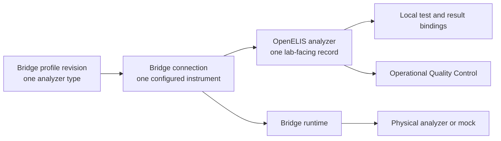

# OGC-1054 Architecture Review

**Updated:** 2026-08-24

**Delivery state:** [authoritative roadmap](../roadmaps/ogc-1054-analyzer-feature-roadmap.md)

**Product contract:** [functional specification](./spec.md)

This is a review aid, not another status ledger. It explains what exists, what
must change, and what must be proven before implementation resumes.

## Verdict

The stack contains useful profile management, mapping, guided-setup, lifecycle,
and QC-link work. It is not yet the approved architecture or an accepted MVP.

The main correction is narrow but structural: current OpenELIS code stores and
interprets analyzer connection details, then sends a complete runtime
registration to Bridge. The target keeps the lab-facing workflow in OpenELIS
while Bridge owns and persists the profile-pinned connection and all
analyzer-facing behavior.

The current remote M3 preview is reviewable but not acceptance-ready. Its
visible Add Analyzer flow failed at **Continue to Verify** on 2026-08-24. No
root cause is asserted until the owning tests and runtime evidence identify it.

## Product Model

There are three objects, with one authority for each:

| Object | Authority | Meaning |
| --- | --- | --- |
| Profile revision | Bridge | Immutable analyzer-type behavior and defaults for a new connection |
| Analyzer connection | Bridge | Durable entered settings, exact profile pin, revision, probe evidence, and runtime state |
| Analyzer | OpenELIS | Name, lab units, Bridge connection reference, local bindings, verification, activation intent, results, and QC links |

`Analyzer Type` is the lab-facing composition of a Bridge profile and its local
OpenELIS catalog binding. It is not another profile implementation.

## One User Workflow

1. A lab administrator opens **Analyzers** and starts **Add Analyzer** inline.
2. They choose an Analyzer Type, name the physical instrument, and assign lab
   units.
3. They review the type's local Test, Result Option, and control-recognition
   bindings.
4. OpenELIS asks Bridge to create a connection pinned to the chosen profile
   revision.
5. OpenELIS renders Bridge-described setup fields and submits values back to
   that connection without interpreting or storing them as runtime authority.
6. The user runs a visible connection test, reviews blockers, and activates the
   analyzer. Probe success is evidence, not an activation gate.
7. Bridge receives and normalizes traffic. OpenELIS binds known results, holds
   unknowns, and routes recognized controls into the separate QC workflow.

The UI remains coherent in OpenELIS. Moving connection authority to Bridge does
not create a second admin application.

## Ownership Test

The boundary is correct only when all of these are true:

- A valid profile may add, remove, or change a setup field without an OpenELIS
  production-code or schema change.
- Restarting Bridge restores the exact active connection and profile revision
  without OpenELIS replaying a complete runtime definition.
- OpenELIS can be inspected without finding an analyzer IP address, port,
  credential, watch directory, delimiter, protocol mode, parser choice, or
  other analyzer-facing value as configuration authority.
- Operational QC changes neither analyzer verification nor activation.
- Production behavior contains no branch for a named analyzer, profile ID,
  vendor, model, test code, or fixture.

## Profile Contract

A profile has exactly two jobs:

1. define communication and runtime behavior for one analyzer type; and
2. provide defaults for creating a new connection of that type.

The existing Bridge profile system is evolved in place. M1 must not introduce a
second profile family, frontend defaults, or server constants that duplicate
profile content.

### Required In Every Published Revision

| Section | Requirement |
| --- | --- |
| Identity | Stable profile ID, immutable revision, display name, manufacturer/model metadata, lifecycle state |
| Runtime | Complete protocol-conditional framing, transport, direction, identification, extraction, aggregation, and capabilities |
| New-connection defaults | Stable field keys, input type, requiredness, choices/conditions, and safe defaults where a default is valid |
| Vocabulary | Every evidence-backed emitted test/result concept and portable coding hints |
| Control recognition | Explicit `RULES` definition or an affirmed `NONE`; no hidden fallback |

Protocol-specific sections are required only when that protocol needs them.
Secrets and site-specific values may intentionally have no default. Portable
coding hints are optional; an OpenELIS database identifier is forbidden.

### Never In A Profile

- a concrete analyzer connection, site address, credential, or watch directory;
- an OpenELIS lab unit, Test ID, Result Option ID, or operational-QC policy;
- mutable shared state or an instruction to repoint existing connections; or
- a hidden classifier, analyzer-name switch, or compatibility fallback.

MVP runtime publication is limited to the evidence-backed GeneXpert ASTM,
FluoroCycler FILE, and QuantStudio FILE profiles. Other files are curated and
returned one by one after contract and mock-transport proof; they are not
carried as a legacy catalog.

## Current Code Disposition

| Current area | Finding | Action |
| --- | --- | --- |
| Bridge profile catalog and immutable revisions | Useful foundation built on the established profile concept | Retain; correct the single contract and prove priority-profile parity |
| Analyzer Types UI and lifecycle | Useful lab-facing management surface | Retain; complete Carbon, URL, breadcrumb, and visual behavior |
| Shared local mapping and verification | Correct OpenELIS responsibility | Retain; ensure one editor and catalog-bound targets only |
| Guided Add Analyzer shell | Correct user journey and location | Retain the shell; replace its connection implementation |
| OpenELIS `Analyzer` runtime fields | Stores address, port, modes, FILE settings, and other Bridge concerns | Migrate released values, then delete fields and schema |
| OpenELIS `AnalyzerType` and plugin registry | Local runtime/type authority duplicates Bridge | Remove after consumers use the Bridge profile composition |
| `BridgeRegistrationService` full-state sync | Makes OpenELIS the runtime source of truth | Replace with versioned Bridge connection commands |
| `InstanceAwareAnalyzerRouter` | Routes using OpenELIS runtime details | Remove; dispatch through the referenced Bridge connection identity |
| Protocol-specific setup branches | OpenELIS understands FILE/network/runtime fields | Replace with one generic Bridge-described Carbon form |
| Activation candidate full-registration JSON | Preserves the wrong desired-state model | Replace with explicit local verification and Bridge acknowledgment references |
| `AnalyzerQcRule` | Mixed control recognition with operational QC | Production path removed in M2; no replacement or compatibility path |
| `/analyzers/errors` duplicate dashboard | Second unresolved-result workflow | Remove; use one held-result/review workflow |
| Bridge profile runtime and probes | Correct owner, currently fed by transient OE registration | Retain executors; back them with durable Bridge connections |
| Analyzer mock priority traffic | Useful deterministic instrument evidence | Retain; remove direct-to-OE and obsolete alias behavior after parity |

This does not discard all M1-M3 work. It replaces the connection-authority
subset and removes inherited paths that contradict the target.

## Released-Data Migration

OpenELIS release `3.2.2.0` already contains analyzer runtime fields. A real
upgrade therefore needs a one-time migration, even though the feature is new
and no legacy runtime is allowed at G0.

1. Quiesce analyzer configuration changes and analyzer traffic.
2. Add the durable Bridge connection contract and an additive OpenELIS
   connection reference.
3. Run a repository-owned `plan` operation that reports every source analyzer
   as migratable, needing correction, or intentionally excluded. It must not
   infer a profile from names or silently invent values.
4. Apply idempotently: create the pinned Bridge connection, verify its durable
   revision, and record the reference in OpenELIS.
5. Restart Bridge and verify that each migrated active connection restores
   exactly.
6. Remove the old writer, reader, endpoints, schema fields, migration utility,
   and superseded tests before G0. Resume traffic only after verification.

This is a bounded upgrade operation, not a dual writer or compatibility path.
The analyzer demo data may be reset rather than migrated.

## Design And Remote Review

`openelis-work@main` supplies functional and visual intent only. The current
mock and the deployed preview agree on the main composition: analyzer list,
inline Add Analyzer, staged Instrument/Verify/Connect sections, Analyzer Types,
mapping review, and a visible connection result.

| Review point | Current preview | Required correction |
| --- | --- | --- |
| Dashboard summary | Total, Active, Inactive | Show setup and attention states needed for work triage |
| Setup | Inline Carbon flow is present | Save currently fails before Verify; repair from owning evidence |
| Connection form | Fixed FILE/network concerns | Render Bridge-described fields generically |
| Navigation | Exposes a separate Error Dashboard | Remove duplicate queue and link the canonical held-result flow |
| Breadcrumbs | Present, with awkward trailing separators | One linkable path with deterministic route/query state |
| Types | Separate manager with profile actions | Preserve this separation; clarify type versus connection |
| Responsive proof | Not accepted | Compare inspected desktop and mobile screenshots to current mocks |

The analyzer review overlay is deployed and currently exposes 17 Grist steps
with build metadata and checklist revision. After this architecture is approved,
three step descriptions need synchronization: durable Bridge connection save
and reload; activation independent of QC/probe with exact Bridge acknowledgment;
and priority ASTM plus FILE traffic. Existing checkmarks do not accept a changed
build.

## Pull-Request Train

| Checkpoint | Pull requests | State |
| --- | --- | --- |
| R0 | OpenELIS #4049 | Review-ready; this correction belongs here |
| F0 | OpenELIS #4053 | Review-ready, stacked |
| E0 | OpenELIS #4055; Bridge #45 | Review-ready, stacked; contracts require correction after R0 approval |
| M1 | OpenELIS #4056; Bridge #46; mock #40 | Review-ready, stacked; profile work must remain one evolved system |
| M2 | OpenELIS #4118; Bridge #47 | Review-ready, stacked |
| M3 | OpenELIS #4125; Bridge #48 | Active; production edits paused for this architecture review |
| M4, G0 | Not opened | Future |

Corrections stay in their owning existing pull requests and merge in roadmap
order. There is no parallel remediation stack and no empty companion pull
request.

## First Slice After Approval

1. Amend E0 producer and consumer contracts for a durable, revisioned Bridge
   connection whose setup description is profile-driven.
2. Audit affected tests before production edits; classify each as retain,
   rewrite, move, or delete.
3. Record failing Bridge persistence/restart tests and failing OpenELIS consumer
   tests using a synthetic profile with fields unknown to OpenELIS.
4. Implement Bridge create/read/update/probe/lifecycle persistence and restart
   restoration without changing protocol executors unnecessarily.
5. Replace OpenELIS full-state registration and fixed connection storage with
   the connection reference and generic mediator.
6. Run the migration fixture, closed owner contracts, persistence and migration
   integration, router-based UI tests, and assembled priority mock traffic.
7. Publish the same tested build to the shared analyzer demo without touching
   the AMR deployment, inspect evidence, then update Grist wording.

## Approval Points

The ownership model is fixed. Three user-policy details are stated explicitly
for confirmation before implementation resumes:

1. **Incomplete mappings:** activation is allowed only after a human reviews
   and acknowledges every unresolved/excluded item. Unknown incoming traffic is
   held; unrelated mapped traffic continues. This matches the current product
   mock's functional intent.
2. **Failed two-way probe:** the UI offers an explicit switch to a supported
   results-only mode when the profile allows it. There is no silent fallback.
3. **Instrument type not listed:** setup links to the separate Analyzer Types
   workflow to create or duplicate a profile; it does not author a profile
   inside the analyzer-connection form.

Approval of this page authorizes contract correction and the first TDD slice.
It does not accept the current deployment or waive any roadmap gate.

## Review Sources

- [Functional specification](./spec.md)
- [Authoritative roadmap](../roadmaps/ogc-1054-analyzer-feature-roadmap.md)
- [`openelis-work@main` analyzer designs](https://github.com/DIGI-UW/openelis-work/tree/main/designs/analyzer-integration), functional and visual intent only
- [OGC-1057 design QA findings](https://github.com/DIGI-UW/openelis-work/blob/qa/ogc-1057-guided-setup-report/designs/analyzer-integration/ogc-1057-qa-report.md)
- [R0 pull request #4049](https://github.com/DIGI-UW/OpenELIS-Global-2/pull/4049)
- [Active OpenELIS M3 pull request #4125](https://github.com/DIGI-UW/OpenELIS-Global-2/pull/4125)
- [Active Bridge M3 pull request #48](https://github.com/DIGI-UW/openelis-analyzer-bridge/pull/48)
