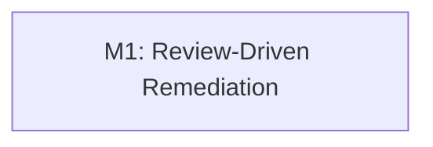

# Implementation Plan: Barcode Label Quantity Management (Assessment-Driven Remediation)

**Branch**: `feat/OGC-284-barcode-label-quantity-management` | **Date**: 2026-02-14 | **Spec**: [spec.md](./spec.md)  
**Input**: Feature specification from `/specs/OGC-284-barcode-label-quantity-management/spec.md`  
**Issue**: [OGC-284](https://uwdigi.atlassian.net/browse/OGC-284)

## Summary

This plan converts the current OGC-284 assessment into implementation actions
needed to make the feature production-ready and review-ready.

Assessment highlights addressed by this plan:

1. `BlockLabel` performs unscoped per-label FHIR questionnaire lookup
   (performance and correctness risk).
2. Slide/freezer config flags are exposed in configuration but not fully applied
   in rendered labels.
3. New backend label message keys referenced in Java classes are missing in
   backend `message_*.properties`.
4. Review threads remain unresolved in GitHub even where code was updated.
5. PR merge readiness is blocked by conflicts and a failing frontend QA workflow.

Planned technical approach:

- Keep existing OGC-284 persistence model and config expansion.
- Introduce a service-layer context assembly for pathology label fields so label
  objects do not perform expensive unscoped lookups.
- Align configurable fields and rendered fields for slide/freezer labels.
- Complete backend message bundles for newly referenced keys.
- Add/extend tests to lock behavior and prevent regressions.

## Technical Context

**Language/Version**: Java 21 (backend), JavaScript/React 17 (frontend)  
**Primary Dependencies**:

- Spring Framework 6.2.2 (traditional MVC), Hibernate/JPA
- React 17 + Carbon Design System (`@carbon/react`)
- React Intl for UI localization

**Storage**: PostgreSQL (existing schema + existing OGC-284 Liquibase additions)  
**Testing**:

- JUnit 4 + Mockito for backend service tests
- `BaseWebContextSensitiveTest` for REST integration tests
- Jest/RTL + Cypress for frontend workflows

**Target Platform**: OpenELIS web application on Linux  
**Project Type**: Web monolith (backend + frontend)  
**Performance Goals**:

- Avoid repeated unscoped FHIR lookups in label generation paths.
- Keep label printing response behavior consistent with current baseline for
  normal order volumes.

**Constraints**:

- Preserve existing OGC-284 behavior where already validated (label count
  persistence + admin config surfaces).
- No direct SQL; schema work must remain Liquibase-driven.
- Do not add `@Transactional` to controllers.

**Scale/Scope**:

- Medium follow-up scope on existing OGC-284 branch content.
- Touch points expected in barcode label classes, barcode services, i18n
  bundles, and tests.

## Constitution Check

_GATE: Must pass before Phase 0 research. Re-check after Phase 1 design._

Verify compliance with
[OpenELIS Global Constitution](../../.specify/memory/constitution.md):

- [x] **Configuration-Driven**: Uses configurable `site_information`/properties;
      no country-specific code branching.
- [x] **Carbon Design System**: Existing/admin UI remains Carbon-based.
- [x] **FHIR/IHE Compliance**: No new external-facing resource introduced; FHIR
      use in pathology label enrichment is constrained to internal lookup logic.
- [x] **Layered Architecture**: Changes remain in Valueholder/DAO/Service/
      Controller/Form pattern; transaction boundaries stay in services.
  - Valueholders use JPA annotations.
  - No controller-level transaction annotations.
- [x] **Test Coverage**: Unit + integration + frontend validation planned with
      OGC-284 regression focus.
- [x] **Schema Management**: Any additional schema change (if required) will be
      Liquibase only; current remediation targets existing schema.
- [x] **Internationalization**: All added/updated UI strings and backend label
      keys use localization bundles.
- [x] **Security & Compliance**: Input validation and bounded parsing continue
      through safe parsing and typed form constraints.

**Complexity Justification**: No constitutional violations expected.

## Milestone Plan

_GATE: Features >3 days MUST define milestones per Constitution Principle IX._

**Estimated Total Effort**: ~2-3 days (single remediation milestone)

### Milestone Table

| ID | Branch Suffix         | Scope                                                  | User Stories | Verification                                                | Depends On |
| -- | --------------------- | ------------------------------------------------------ | ------------ | ----------------------------------------------------------- | ---------- |
| M1 | m1-review-remediation | Resolve active review risks, finalize tests, re-open CI | US1, US2, US3 | Backend unit/integration + targeted frontend tests + CI recheck | -          |

### Milestone Dependency Graph



### PR Strategy

- **Spec artifacts**: stay in `specs/OGC-284-barcode-label-quantity-management/`
- **Implementation milestone branch**:
  `feat/OGC-284-barcode-label-quantity-management-m1-review-remediation` → `develop`

## Project Structure

### Documentation (this feature)

```text
specs/OGC-284-barcode-label-quantity-management/
├── spec.md
├── plan.md
├── research.md
├── data-model.md
├── quickstart.md
├── contracts/
│   └── barcode-configuration-and-generic-sample-order.openapi.yml
└── tasks.md  # generated by /speckit.tasks (next step)
```

### Source Code (repository root)

```text
src/main/java/org/openelisglobal/barcode/
├── labeltype/
│   ├── BlockLabel.java
│   ├── SlideLabel.java
│   └── FreezerLabel.java
├── service/
│   ├── BarcodeInfoServiceImpl.java
│   ├── BarcodeConfigServiceImpl.java
│   └── (new/updated service-layer helper for pathology label context)
└── controller/rest/
    └── BarcodeConfigurationRestController.java

src/main/java/org/openelisglobal/genericsample/
├── form/GenericSampleOrderForm.java
└── service/GenericSampleOrderServiceImpl.java

src/main/resources/languages/
├── message_en.properties
└── message_fr.properties

frontend/src/components/admin/barcodeConfiguration/BarcodeConfiguration.js
frontend/src/languages/en.json
frontend/src/languages/fr.json

src/test/java/org/openelisglobal/barcode/
├── BarcodeConfigurationRestControllerTest.java
├── BarcodeInformationServiceTest.java
└── service/BarcodeInfoServiceImplTest.java
```

**Structure Decision**: Use existing module layout and extend current OGC-284
files only; no new top-level modules.

## Testing Strategy

**Reference**: [OpenELIS Testing Roadmap](../../.specify/guides/testing-roadmap.md)

### Coverage Goals

- **Backend**: >80% on touched service/label logic
- **Frontend**: >70% on touched UI logic and localization wiring
- **Critical Paths**: 100% for label count persistence and label configuration
  interpretation paths

### Test Types

- [x] **Unit Tests**: Service-layer and label-generation behavior (JUnit 4 +
      Mockito)
- [ ] **DAO Tests**: Not primary for this remediation unless query changes are
      introduced
- [x] **Controller Tests**: Barcode configuration REST behavior and validation
- [ ] **ORM Validation Tests**: Not required unless entity mapping changes
- [x] **Integration Tests**: Existing context-backed tests for configuration
      persistence and loading
- [x] **Frontend Unit Tests**: Configuration UI behavior + i18n key mapping
- [x] **E2E Tests**: Targeted verification for impacted barcode flows as needed
      to close CI gaps

### Test Data Management

- Backend integration tests continue using existing DBUnit dataset patterns.
- Service unit tests use mocked dependencies for isolated risk areas.
- Frontend uses existing Jest mocks + fixture setup conventions.
- E2E/Cypress runs should be executed per-file during development.

### Checkpoint Validations

- [x] **After Phase 0**: All research unknowns resolved (see `research.md`)
- [ ] **After Phase 1**: Design artifacts complete (`data-model.md`,
      `contracts/`, `quickstart.md`)
- [ ] **After Phase 2**: New/updated backend unit tests pass
- [ ] **After Phase 3**: Controller/integration tests pass
- [ ] **After Phase 4**: Frontend unit tests and targeted QA checks pass

## Phase 0: Research Outcomes Applied

Primary decisions to drive implementation:

1. Remove per-label unscoped FHIR querying from `BlockLabel`.
2. Build pathology label context in service layer and pass resolved values to
   label constructors.
3. Ensure all configuration toggles shown in admin are reflected in label output
   behavior (or explicitly removed from UI if intentionally unsupported).
4. Add backend localization keys for all newly introduced label field keys.
5. Re-run and triage CI after remediation, then explicitly resolve review
   threads.

## Phase 1: Design & Contract Plan

1. Model runtime flow for:
   - config retrieval/safe parsing
   - sample and sample-item label quantity persistence
   - pathology label context enrichment
2. Capture external API contracts for:
   - `/rest/BarcodeConfiguration` GET/POST
   - `/rest/GenericSampleOrder` POST with default field quantity inputs
3. Define implementation quickstart with test checkpoints and review-thread
   closure checklist.

## Risks & Mitigations

| Risk | Impact | Mitigation |
| ---- | ------ | ---------- |
| Unscoped FHIR lookup in label path | Slow label generation, wrong specimen text | Move lookup to bounded service call; pass context to label |
| UI toggles not applied in output | Admin confusion and incorrect expectations | Implement missing fields or remove toggles consistently |
| Missing backend message keys | Raw/fallback key rendering on labels | Add/verify keys in `message_en` and `message_fr` |
| CI instability on unrelated tests | Delayed merge despite fixes | Document baseline failures, rerun targeted jobs, isolate OGC-284 regressions |

## Next Steps

1. Complete `/speckit.tasks` to generate dependency-ordered implementation
   tasks.
2. Execute remediation in small commits grouped by risk area.
3. Re-run CI checks and close unresolved PR review threads with evidence.
