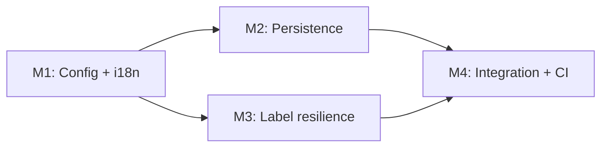

# Implementation Plan: Barcode Label Quantity Management (OGC-284)

**Branch**: `feat/ogc-284-expand-barcode` | **Date**: 2026-02-14 | **Spec**:
[spec.md](./spec.md)  
**Input**: Feature specification from
`/specs/OGC-284-barcode-label-quantity-management/spec.md`  
**Issue**: [OGC-284](https://uwdigi.atlassian.net/browse/OGC-284)

## Summary

Deliver OGC-284 in implementation-ready milestones that are small, reviewable,
and partially parallelizable:

1. stabilize admin barcode configuration and localization,
2. verify and harden existing sample/sample-item label quantity persistence,
3. fix label generation resilience gaps (including max-limit enforcement and
   optional-field rendering consistency),
4. integrate, validate CI, and close review threads.

This plan aligns with the latest assessment and resolves prior inconsistencies:

- scope now matches `spec.md` user stories,
- explicit max-limit enforcement (`FR-013`) is included,
- milestones are bite-sized with parallel tracks,
- task file paths are grounded in actual module structure.
- schema additions already exist and are treated as verification/hardening
  scope, not greenfield implementation.

## Technical Context

**Language/Version**: Java 21 (backend), React 17 (frontend)  
**Primary Dependencies**:

- Spring Framework 6.2.2 (traditional MVC), Hibernate/JPA
- Carbon Design System (`@carbon/react`)
- React Intl, Jest/RTL, Cypress

**Storage**: PostgreSQL, existing OGC-284 Liquibase changes
(`028-barcode-info-tables.xml`, `barcode_expansion.xml`)  
**Testing**:

- Backend: JUnit 4 + Mockito + `BaseWebContextSensitiveTest`
- Frontend: Jest + React Testing Library
- E2E: Cypress (individual-file runs during development)

**Target Platform**: OpenELIS web (Linux)  
**Project Type**: Web monolith  
**Performance Goals**:

- avoid unscoped/expensive runtime lookups in per-label render flow,
- keep label generation stable under malformed configuration values.

**Constraints**:

- transactions remain in service layer only,
- no direct SQL / native DDL,
- all user-facing strings via React Intl / message bundles.

## Constitution Check

_GATE: Must pass before implementation. Re-check after each milestone._

- [x] **Configuration-Driven** (Principle I)
- [x] **Carbon Design System** (Principle II)
- [x] **FHIR/IHE Compliance** (Principle III; no new external FHIR entity scope)
- [x] **Layered Architecture** (Principle IV; no controller transactions)
- [x] **Test-Driven Delivery** (Principle V)
- [x] **Liquibase-only Schema Management** (Principle VI)
- [x] **Internationalization First** (Principle VII)
- [x] **Security/Input Validation** (Principle VIII)
- [x] **Milestone-based Delivery** (Principle IX)

## Milestone Plan

_Bite-size milestones with explicit verification gates._

### Milestone Table

| ID     | Branch Suffix            | Suggested Branch (Principle IX)                                       | Suggested Worktree                                      | Scope                                                                                                                                 | User Stories  | Verification                                                                                               | Depends On |
| ------ | ------------------------ | --------------------------------------------------------------------- | ------------------------------------------------------- | ------------------------------------------------------------------------------------------------------------------------------------- | ------------- | ---------------------------------------------------------------------------------------------------------- | ---------- |
| M1     | m1-config-i18n-hardening | `feat/284-barcode-label-quantity-management-m1-config-i18n-hardening` | `/workspace-worktrees/ogc-284-m1-config-i18n`           | Admin config safety, fallback/range handling, localization completeness                                                               | US1           | `BarcodeConfigurationRestControllerTest`, `BarcodeInformationServiceTest`, frontend barcode config tests   | -          |
| [P] M2 | m2-persistence-upsert    | `feat/284-barcode-label-quantity-management-m2-persistence-upsert`    | `/workspace-worktrees/ogc-284-m2-persistence-upsert`    | Verify/harden existing generic sample order quantity defaults + upsert/dedup reliability; add ORM and Liquibase verification coverage | US2           | `BarcodeInfoServiceImplTest` + generic sample service tests + ORM mapping validation + schema verification | M1         |
| [P] M3 | m3-label-resilience      | `feat/284-barcode-label-quantity-management-m3-label-resilience`      | `/workspace-worktrees/ogc-284-m3-label-resilience`      | Label rendering consistency (slide/freezer fields), BlockLabel lookup hardening, max-limit enforcement/override behavior              | US3           | New label-type tests + barcode label maker tests                                                           | M1         |
| M4     | m4-integration-ci-review | `feat/284-barcode-label-quantity-management-m4-integration-ci-review` | `/workspace-worktrees/ogc-284-m4-integration-ci-review` | Merge tracks, CI stabilization, review-thread closure evidence                                                                        | US1, US2, US3 | targeted backend/frontend/E2E + workflow reruns                                                            | M2, M3     |

### Milestone Dependency Graph



### PR Strategy

- One PR per milestone branch (`feat/...-m{N}-{desc}`).
- M2 and M3 can proceed in parallel after M1.
- M4 is the integration/closure milestone.
- Recommended execution model: one dedicated git worktree per milestone branch.

### Worktree Execution Recommendation

Use isolated worktrees for milestone parallelization and safer rebases:

```bash
git worktree add "/workspace-worktrees/ogc-284-m1-config-i18n" "feat/284-barcode-label-quantity-management-m1-config-i18n-hardening"
git worktree add "/workspace-worktrees/ogc-284-m2-persistence-upsert" "feat/284-barcode-label-quantity-management-m2-persistence-upsert"
git worktree add "/workspace-worktrees/ogc-284-m3-label-resilience" "feat/284-barcode-label-quantity-management-m3-label-resilience"
git worktree add "/workspace-worktrees/ogc-284-m4-integration-ci-review" "feat/284-barcode-label-quantity-management-m4-integration-ci-review"
```

_Note: `/workspace-worktrees/...` paths are examples. Use local workspace paths
that match your environment._

## Project Structure

### Documentation

```text
specs/OGC-284-barcode-label-quantity-management/
├── spec.md
├── plan.md
├── research.md
├── data-model.md
├── quickstart.md
├── contracts/
│   └── barcode-configuration-and-generic-sample-order.openapi.yml
└── tasks.md
```

### Source Scope

```text
src/main/java/org/openelisglobal/barcode/
├── controller/rest/BarcodeConfigurationRestController.java
├── service/BarcodeConfigServiceImpl.java
├── service/BarcodeInfoServiceImpl.java
├── labeltype/BlockLabel.java
├── labeltype/SlideLabel.java
├── labeltype/FreezerLabel.java
└── BarcodeLabelMaker.java

src/main/java/org/openelisglobal/genericsample/service/GenericSampleOrderServiceImpl.java
src/main/resources/languages/message_en.properties
src/main/resources/languages/message_fr.properties
frontend/src/components/admin/barcodeConfiguration/BarcodeConfiguration.js
frontend/src/languages/en.json
frontend/src/languages/fr.json

src/test/java/org/openelisglobal/barcode/...
src/test/java/org/openelisglobal/genericsample/...
frontend/src/components/admin/barcodeConfiguration/...
```

## Testing Strategy

**Reference**: [Testing Roadmap](../../.specify/guides/testing-roadmap.md)

### Coverage Goals

- Backend >80% on touched service/label logic
- Frontend >70% on touched UI/i18n logic
- Critical paths (max-limit enforcement, upsert behavior) fully covered

### Required Test Types

- Unit tests (services + label classes)
- Controller/integration tests for barcode configuration and sample order flow
- Frontend unit tests for barcode config UI
- Targeted Cypress verification for impacted print/config flows
- ORM validation test for barcode entities (`SampleBarcodeInfo`,
  `SampleItemBarcodeInfo`) per Constitution V.4
- Liquibase/schema verification for existing OGC-284 changesets in
  `src/main/resources/liquibase/3.3.x.x/base.xml`,
  `028-barcode-info-tables.xml`, and `barcode_expansion.xml`

### Checkpoint Gates

- **After M1**: US1 tests pass; i18n key completeness verified
- **After M2**: US2 tests pass; upsert/default behavior verified; ORM mapping
  validation and Liquibase/schema verification pass
- **After M3**: US3 tests pass; max-limit + override behavior verified
- **After M4**: targeted CI checks green; review threads resolved

## Risks & Mitigations

| Risk                                         | Mitigation                                                                |
| -------------------------------------------- | ------------------------------------------------------------------------- |
| Unscoped runtime lookups in label rendering  | Move resolution to bounded context before render/use deterministic inputs |
| Config UI/options drift from rendered output | Align toggle mapping in label classes and tests                           |
| Missing backend message keys                 | Add/verify key parity in `message_en/fr.properties`                       |
| Merge friction late in cycle                 | Use milestone PRs with small scope and early CI reruns                    |
