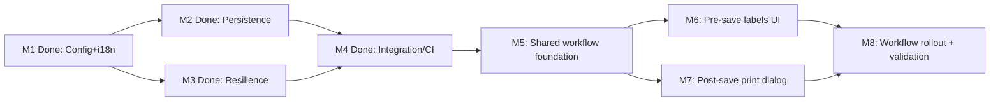

# Implementation Plan: Barcode Label Quantity Management (OGC-284)

**Branch**:
`feat/284-barcode-label-quantity-management-m4-integration-ci-review` |
**Date**: 2026-03-11 | **Spec**: [spec.md](./spec.md)  
**Input**: Feature specification from
`/specs/OGC-284-barcode-label-quantity-management/spec.md`  
**Issue**: [OGC-284](https://uwdigi.atlassian.net/browse/OGC-284)

## Summary

This plan updates OGC-284 after clarification that the feature must deliver
**full parity with Jira acceptance criteria**, not only the remediation work
already completed on the current branch.

The Jira OGC-284 FRS attachment (`OpenELIS_Barcode_Labels_v1_FRS.md`) and
companion mockup (`OpenELIS_BarcodeConfig_Mockup.jsx`) are treated as the
governing design artifacts for implementation and validation.

### Completed baseline (already done on branch)

The following milestones are complete and should be treated as enabling
foundation:

1. admin barcode configuration hardening and i18n completion,
2. sample/sample-item barcode persistence and upsert reliability,
3. pathology quantity persistence support,
4. label resilience and max-limit enforcement,
5. CI and review-thread stabilization evidence.

This completed baseline includes parity with the barcode configuration design
surface for:

- default/max count controls for order/specimen/block/slide/freezer,
- optional label-element toggles with Lab Number mandatory,
- dimension configuration for all label types,
- preservation of preprinted accession settings behavior.

### Remaining scope (to achieve full ticket/design parity)

The remaining work is the still-missing workflow UX:

1. shared workflow foundation for labels-section and post-save printing state,
2. pre-save labels UI in applicable sample-creation workflows,
3. post-save print dialog with per-label-type PDF Print buttons and Done,
4. reprint entry from the Order View page,
5. rollout and validation across all relevant barcode-printing sample-creation
   workflows.

This plan differentiates clearly between **what is already done** and the
**remaining milestones** that should be executed next.

## Technical Context

**Language/Version**: Java 21 (backend), React 17 (frontend)  
**Primary Dependencies**:

- Spring Framework 6.2.2 (traditional MVC), Hibernate/JPA
- Carbon Design System (`@carbon/react`)
- React Intl, Jest/RTL, Cypress, Playwright

**Storage**: PostgreSQL, existing OGC-284 Liquibase changes
(`028-barcode-info-tables.xml`, `barcode_expansion.xml`)  
**Testing**:

- Backend: JUnit 4 + Mockito + `BaseWebContextSensitiveTest`
- Frontend: Jest + React Testing Library
- E2E: Cypress and Playwright, using focused runs during development and full
  validation before push

**Target Platform**: OpenELIS web (Linux)  
**Project Type**: Hybrid web monolith (React + existing workflow surfaces)  
**Performance Goals**:

- keep label generation stable under malformed configuration values,
- avoid duplicated orchestration logic across workflow families,
- avoid user-perceived delay when launching the post-save print dialog.

**Constraints**:

- transactions remain in service layer only,
- no direct SQL / native DDL,
- all user-facing strings via React Intl / message bundles,
- existing print infrastructure (`LabelMakerServlet` and related routes) should
  be reused rather than replaced,
- completed remediation work must be preserved and built upon, not rewritten.

## Constitution Check

_GATE: Must pass before implementation. Re-check after each milestone._

- [x] **Configuration-Driven** (Principle I)
- [x] **Carbon Design System** (Principle II)
- [x] **FHIR/IHE Compliance** (Principle III; no new external FHIR entity scope)
- [x] **Layered Architecture** (Principle IV; no controller transactions)
- [x] **Test-Driven Delivery** (Principle V)
- [x] **Liquibase-only Schema Management** (Principle VI)
- [x] **Internationalization First** (Principle VII)
- [x] **Security/Input Validation** (Principle VIII)
- [x] **Milestone-based Delivery** (Principle IX)

## Phase 0: Research Outcome

Research conclusions captured in `research.md`:

- current M1-M4 work is completed baseline, not full feature completion,
- full Jira/design parity is required,
- remaining implementation should follow a shared foundation plus staged rollout
  model,
- existing print infrastructure should be reused with new workflow
  orchestration,
- contracts/data model must expand beyond generic-sample persistence only.

No remaining `NEEDS CLARIFICATION` items block planning.

## Phase 1: Design Artifacts

Updated artifacts aligned with the clarified scope:

- `research.md`
- `data-model.md`
- `contracts/barcode-configuration-and-generic-sample-order.openapi.yml`
- `quickstart.md`

These now reflect:

- labels-section row model,
- post-save print dialog state,
- full-parity scope,
- completed baseline vs remaining milestones.

## Milestone Plan

_Bite-size milestones with explicit verification gates and a clear split between
completed and remaining work._

### Completed Baseline Milestones

| ID  | Status         | Branch Suffix              | Scope                                                                                                                                                                                                                                                                             | Verification                                                        |
| --- | -------------- | -------------------------- | --------------------------------------------------------------------------------------------------------------------------------------------------------------------------------------------------------------------------------------------------------------------------------- | ------------------------------------------------------------------- |
| M1  | Done (partial) | `m1-config-i18n-hardening` | Admin config safety, fallback/range handling, localization completeness, label-element toggle behavior, and dimensions/preprinted section parity. **Not yet implemented**: FR-004a default-lte-max cross-field validation, FR-002b positive-dimension validation (deferred to M5) | Barcode config backend/frontend tests + evidence in `quickstart.md` |
| M2  | Done           | `m2-persistence-upsert`    | Generic/pathology persistence hardening, ORM/schema verification                                                                                                                                                                                                                  | Backend service + ORM/schema tests                                  |
| M3  | Done           | `m3-label-resilience`      | Optional-field rendering and max-limit enforcement                                                                                                                                                                                                                                | Label-type + label-maker tests                                      |
| M4  | Done           | `m4-integration-ci-review` | Integration verification, CI stabilization, review closure                                                                                                                                                                                                                        | CI evidence + Playwright remediation                                |

### Remaining Delivery Milestones

| ID     | Branch Suffix                    | Suggested Branch                                                            | Suggested Worktree                             | Scope                                                                                                                                                                                                                                                                                                                                                                                                     | User Stories | Verification                                                                                                | Depends On |
| ------ | -------------------------------- | --------------------------------------------------------------------------- | ---------------------------------------------- | --------------------------------------------------------------------------------------------------------------------------------------------------------------------------------------------------------------------------------------------------------------------------------------------------------------------------------------------------------------------------------------------------------- | ------------ | ----------------------------------------------------------------------------------------------------------- | ---------- |
| M5     | `m5-shared-workflow-foundation`  | `feat/284-barcode-label-quantity-management-m5-shared-workflow-foundation`  | `/workspace-worktrees/ogc-284-m5-foundation`   | Inventory all barcode-printing sample-creation workflows; define shared labels-section row model, post-save print dialog state, save-response/reprint contracts, backend orchestration foundation; **also includes deferred M1 validation gaps**: FR-004a default-lte-max cross-field validation, FR-002b positive-dimension validation, and FR-012a cumulative printed-count tracking (schema + service) | US2, US3     | Updated contracts/data model; backend integration tests for shared orchestration; validation gap tests pass | M4         |
| [P] M6 | `m6-pre-save-labels-ui`          | `feat/284-barcode-label-quantity-management-m6-pre-save-labels-ui`          | `/workspace-worktrees/ogc-284-m6-labels-ui`    | Implement the pre-save labels section in the Add Order workflow (`/SamplePatientEntry`) and shared UI model: one order row, one row per sample, editable applicable counts, running total                                                                                                                                                                                                                 | US2          | Frontend unit tests + backend integration for quantity submission + targeted E2E                            | M5         |
| [P] M7 | `m7-post-save-print-dialog`      | `feat/284-barcode-label-quantity-management-m7-post-save-print-dialog`      | `/workspace-worktrees/ogc-284-m7-print-dialog` | Implement post-save print dialog in the Add Order workflow (`/SamplePatientEntry`) after accession assignment, including per-label-type PDF Print buttons, dimension-matched PDF generation, and a Done button; wire reprint entry from the Order View page                                                                                                                                               | US3          | Backend print orchestration tests + targeted E2E save-to-print flow                                         | M5         |
| M8     | `m8-workflow-rollout-validation` | `feat/284-barcode-label-quantity-management-m8-workflow-rollout-validation` | `/workspace-worktrees/ogc-284-m8-rollout`      | Roll out shared labels/printing behavior across all remaining in-scope barcode-printing sample-creation workflows identified by M5 inventory; complete regression coverage and CI stabilization                                                                                                                                                                                                           | US2, US3     | Cross-workflow E2E matrix, CI green, final review evidence                                                  | M6, M7     |

### Milestone Dependency Graph



### PR Strategy

- Completed baseline milestones remain historical evidence and should not be
  reopened unless defects are found.
- One PR per remaining milestone branch (`feat/...-m{N}-{desc}`).
- M6 and M7 can proceed in parallel after M5.
- M8 is the final rollout/validation milestone.
- Recommended execution model: one dedicated git worktree per remaining
  milestone branch.

## Project Structure

### Documentation

```text
specs/OGC-284-barcode-label-quantity-management/
├── spec.md
├── plan.md
├── research.md
├── data-model.md
├── quickstart.md
├── contracts/
│   └── barcode-configuration-and-generic-sample-order.openapi.yml
└── tasks.md
```

### Source Scope

```text
src/main/java/org/openelisglobal/barcode/
src/main/java/org/openelisglobal/genericsample/
src/main/java/org/openelisglobal/program/
src/main/java/org/openelisglobal/sample/
src/main/java/org/openelisglobal/common/servlet/barcode/

frontend/src/components/admin/barcodeConfiguration/
frontend/src/components/addOrder/
frontend/src/components/batchOrderEntry/
frontend/src/components/genericSample/
frontend/src/components/notebook/
frontend/src/components/pathology/
frontend/src/components/printBarcode/
frontend/src/languages/

src/test/java/org/openelisglobal/barcode/...
src/test/java/org/openelisglobal/genericsample/...
src/test/java/org/openelisglobal/program/...
frontend/src/components/**/__tests__ or *.test.*
```

## Testing Strategy

**Reference**: [Testing Roadmap](../../.specify/guides/testing-roadmap.md)

### Coverage Goals

- Preserve already-added backend coverage for barcode config/persistence logic
- Backend >80% on newly touched workflow orchestration/service logic
- Frontend >70% on newly touched labels UI / post-save dialog logic
- Critical user journeys fully covered:
  - pre-save labels UI,
  - save with persisted counts,
  - post-save print dialog,
  - done-without-printing + Order View reprint,
  - over-max block/override behavior

### Required Test Types

- Unit tests for shared orchestration, quantity applicability, and print-job
  dispatch
- Controller/integration tests for sample-save and post-save response payloads
- Frontend unit tests for labels-section row model and post-save print dialog
- Targeted E2E coverage for Add Order (`/SamplePatientEntry`) first, then all
  remaining in-scope workflows identified by M5 inventory
- ORM validation test for barcode entities (`SampleBarcodeInfo`,
  `SampleItemBarcodeInfo`) per Constitution V.4
- Liquibase/schema verification for existing OGC-284 changesets

### Test Data Management

- Reuse existing barcode/persistence fixtures where possible
- Prefer API/service setup over recreating complex sample states through UI
- Ensure each workflow E2E test can create a sample, reach the print dialog, and
  validate deferred printing/re-entry with isolated data

### Checkpoint Gates

- **After M5**: shared orchestration contracts reviewed; backend foundation
  tests pass
- **After M6**: primary workflow labels UI tests pass; persisted counts verified
- **After M7**: post-save print dialog and print-later tests pass
- **After M8**: cross-workflow E2E matrix green; CI green; final evidence posted

## Risks & Mitigations

| Risk                                                                 | Mitigation                                                                             |
| -------------------------------------------------------------------- | -------------------------------------------------------------------------------------- |
| Completed remediation baseline is accidentally reworked or regressed | Treat M1-M4 as frozen baseline; add regression tests before workflow UX changes        |
| Scope balloons across too many workflow variants at once             | Use M5 inventory + shared model first, then rollout in M6-M8                           |
| Legacy and React workflow surfaces diverge in behavior               | Define a shared labels-section and post-save dialog contract in M5                     |
| Print-later semantics vary by workflow                               | Centralize reprint/re-entry rules in shared orchestration and contract docs            |
| Reviewers cannot tell what is done vs remaining                      | Keep completed baseline milestones separate from remaining milestones in all artifacts |
