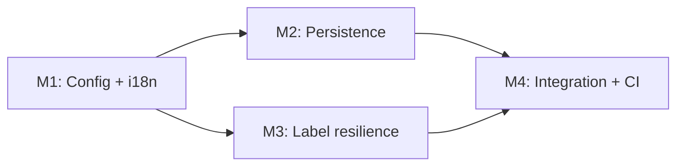

# Tasks: Barcode Label Quantity Management (OGC-284)

**Input**: Design documents from
`/specs/OGC-284-barcode-label-quantity-management/`  
**Prerequisites**: `plan.md`, `spec.md`, `research.md`, `data-model.md`,
`contracts/`, `quickstart.md`

**Organization Rule (OpenELIS Override)**: Tasks are organized by milestone
(Principle IX), and tests are mandatory before implementation tasks in each
milestone (Principle V).

## Format: `- [ ] [ID] [P?] [Story?] Description with file path`

- **[P]**: Parallelizable task (separate files, no unresolved dependency)
- **[Story]**: Story traceability label (`[US1]`, `[US2]`, `[US3]`)

---

## Milestone Dependency Graph

---

## Milestone M1: Config + i18n hardening

**Branch Suffix**: `m1-config-i18n-hardening`  
**Suggested Branch**:
`feat/284-barcode-label-quantity-management-m1-config-i18n-hardening`  
**Suggested Worktree**: `/workspace-worktrees/ogc-284-m1-config-i18n`  
**Stories**: US1  
**Depends On**: None  
**Independent Test**: Admin config save/load round-trip works; malformed values
fallback safely; localized labels render correctly.

- [x] T001 Create milestone branch
      `feat/284-barcode-label-quantity-management-m1-config-i18n-hardening` from
      `develop` and add worktree at
      `/workspace-worktrees/ogc-284-m1-config-i18n`
- [x] T002 [P] [US1] Extend configuration round-trip and malformed-value
      fallback tests in
      `src/test/java/org/openelisglobal/barcode/BarcodeConfigurationRestControllerTest.java`
- [x] T003 [P] [US1] Add backend message-key and safe parsing coverage in
      `src/test/java/org/openelisglobal/barcode/BarcodeInformationServiceTest.java`
- [x] T004 [P] [US1] Create/extend frontend config and i18n tests in
      `frontend/src/components/admin/barcodeConfiguration/BarcodeConfiguration.test.js`
- [x] T005 [US1] Implement explicit numeric range validation + fallback behavior
      in
      `src/main/java/org/openelisglobal/barcode/controller/rest/BarcodeConfigurationRestController.java`
- [x] T006 [US1] Align config load/save mapping for touched quantity and toggle
      keys in
      `src/main/java/org/openelisglobal/barcode/service/BarcodeConfigServiceImpl.java`
- [x] T007 [US1] Add missing backend label info keys in
      `src/main/resources/languages/message_en.properties`
- [x] T008 [US1] Add matching backend label info keys in
      `src/main/resources/languages/message_fr.properties`
- [x] T009 [US1] Align frontend localization keys for barcode config labels in
      `frontend/src/languages/en.json` and `frontend/src/languages/fr.json`
- [x] T010 [US1] Verify Carbon-only component usage for touched barcode config
      UI in
      `frontend/src/components/admin/barcodeConfiguration/BarcodeConfiguration.js`
- [x] T011 [US1] Run milestone tests and record verification evidence in
      `specs/OGC-284-barcode-label-quantity-management/quickstart.md`
- [ ] T012 Create milestone PR for M1 with test evidence and scope summary

---

## Milestone [P] M2: Persistence + upsert reliability

**Branch Suffix**: `m2-persistence-upsert`  
**Suggested Branch**:
`feat/284-barcode-label-quantity-management-m2-persistence-upsert`  
**Suggested Worktree**: `/workspace-worktrees/ogc-284-m2-persistence-upsert`  
**Stories**: US2  
**Depends On**: M1  
**Independent Test**: Generic sample order stores default/explicit quantities
and updates existing barcode metadata without duplication.

- [ ] T013 Create milestone branch
      `feat/284-barcode-label-quantity-management-m2-persistence-upsert` from
      `develop` and add worktree at
      `/workspace-worktrees/ogc-284-m2-persistence-upsert`
- [ ] T014 [P] [US2] Extend default-value and upsert/dedup tests in
      `src/test/java/org/openelisglobal/barcode/service/BarcodeInfoServiceImplTest.java`
- [ ] T015 [P] [US2] Create service-level generic sample order persistence tests
      in
      `src/test/java/org/openelisglobal/genericsample/service/GenericSampleOrderServiceImplTest.java`
- [ ] T016 [US2] Ensure default quantity application and null-safe handling in
      `src/main/java/org/openelisglobal/genericsample/service/GenericSampleOrderServiceImpl.java`
- [ ] T017 [US2] Harden sample and sample-item upsert behavior in
      `src/main/java/org/openelisglobal/barcode/service/BarcodeInfoServiceImpl.java`
- [ ] T018 [US2] Align form contract for label quantity fields (optional + valid
      values) in
      `src/main/java/org/openelisglobal/genericsample/form/GenericSampleOrderForm.java`
- [ ] T019 [US2] Run milestone tests and record verification evidence in
      `specs/OGC-284-barcode-label-quantity-management/quickstart.md`
- [ ] T020 Create milestone PR for M2 with verification details

---

## Milestone [P] M3: Label resilience + max-limit enforcement

**Branch Suffix**: `m3-label-resilience`  
**Suggested Branch**:
`feat/284-barcode-label-quantity-management-m3-label-resilience`  
**Suggested Worktree**: `/workspace-worktrees/ogc-284-m3-label-resilience`  
**Stories**: US3  
**Depends On**: M1  
**Independent Test**: Slide/freezer/block labels honor toggles and remain
stable; requests above max labels are blocked unless override is enabled.

- [ ] T021 Create milestone branch
      `feat/284-barcode-label-quantity-management-m3-label-resilience` from
      `develop` and add worktree at
      `/workspace-worktrees/ogc-284-m3-label-resilience`
- [ ] T022 [P] [US3] Add block label behavior tests in
      `src/test/java/org/openelisglobal/barcode/labeltype/BlockLabelTest.java`
- [ ] T023 [P] [US3] Add slide label optional-field tests in
      `src/test/java/org/openelisglobal/barcode/labeltype/SlideLabelTest.java`
- [ ] T024 [P] [US3] Add freezer label optional-field tests in
      `src/test/java/org/openelisglobal/barcode/labeltype/FreezerLabelTest.java`
- [ ] T025 [P] [US3] Add max-limit and override-path tests in
      `src/test/java/org/openelisglobal/barcode/BarcodeLabelMakerTest.java`
- [ ] T026 [US3] Refactor block label specimen-type behavior to remove unscoped
      runtime lookup in
      `src/main/java/org/openelisglobal/barcode/labeltype/BlockLabel.java`
- [ ] T027 [US3] Resolve and pass block specimen context at label construction
      time in `src/main/java/org/openelisglobal/barcode/BarcodeLabelMaker.java`
- [ ] T028 [US3] Implement slide optional-field rendering for configured toggles
      in `src/main/java/org/openelisglobal/barcode/labeltype/SlideLabel.java`
- [ ] T029 [US3] Implement freezer optional-field rendering for configured
      toggles in
      `src/main/java/org/openelisglobal/barcode/labeltype/FreezerLabel.java`
- [ ] T030 [US3] Enforce FR-013 max-label request behavior (block over-max
      unless override enabled) in
      `src/main/java/org/openelisglobal/barcode/BarcodeLabelMaker.java`
- [ ] T031 [US3] Run milestone tests and record verification evidence in
      `specs/OGC-284-barcode-label-quantity-management/quickstart.md`
- [ ] T032 Create milestone PR for M3 with verification details

---

## Milestone M4: Integration, CI, and review closure

**Branch Suffix**: `m4-integration-ci-review`  
**Suggested Branch**:
`feat/284-barcode-label-quantity-management-m4-integration-ci-review`  
**Suggested Worktree**:
`/workspace-worktrees/ogc-284-m4-integration-ci-review`  
**Stories**: US1, US2, US3  
**Depends On**: M2, M3  
**Independent Test**: Combined milestone changes pass targeted QA checks and all
review threads can be closed with evidence.

- [ ] T033 Create milestone branch
      `feat/284-barcode-label-quantity-management-m4-integration-ci-review` from
      `develop` and add worktree at
      `/workspace-worktrees/ogc-284-m4-integration-ci-review`
- [ ] T034 [P] Run combined backend verification suites for M1-M3 changes and
      record outputs in
      `specs/OGC-284-barcode-label-quantity-management/quickstart.md`
- [ ] T035 [P] Run frontend unit tests and impacted Cypress spec(s)
      individually, then record console/screenshot review notes in
      `specs/OGC-284-barcode-label-quantity-management/quickstart.md`
- [ ] T036 Merge M2 and M3 into M4 and resolve integration conflicts in touched
      barcode/generic sample files
- [ ] T037 Address open review feedback with explicit file/line references in
      milestone PR discussion
- [ ] T038 Re-run failed PR workflow(s) and record run IDs + final status in
      `specs/OGC-284-barcode-label-quantity-management/quickstart.md`
- [ ] T039 Resolve remaining review threads after verification evidence is
      posted
- [ ] T040 Create milestone PR for M4 with consolidated verification summary

---

## Dependencies & Execution Order

### Milestone Order

1. M1 (required foundation)
2. M2 and M3 in parallel
3. M4 integration and closure

### Within Each Milestone

1. Branch creation task first
2. Test tasks before implementation tasks
3. Verification tasks
4. PR task last

---

## Parallel Opportunities

- **Milestone-level**: M2 and M3 can run in parallel after M1.
- **Task-level [P] examples**:
  - M1: T002 + T003 + T004
  - M2: T014 + T015
  - M3: T022 + T023 + T024 + T025
  - M4: T034 + T035

---

## Implementation Strategy

### MVP First

1. Deliver M1 (US1 stabilization)
2. Deliver M2 (US2 persistence reliability)
3. Validate before starting M3 if needed for release slicing

### Full Delivery

- Complete M3 for US3 resilience and explicit FR-013 enforcement.
- Complete M4 for CI/review closure and integration readiness.
