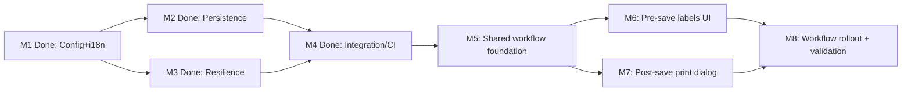

# Tasks: Barcode Label Quantity Management (OGC-284)

**Input**: Design documents from
`/specs/OGC-284-barcode-label-quantity-management/`  
**Prerequisites**: `plan.md`, `spec.md`, `research.md`, `data-model.md`,
`contracts/`, `quickstart.md`

**Organization Rule (OpenELIS Override)**: Tasks are organized by milestone
(Principle IX), and tests are mandatory before implementation tasks in each
milestone (Principle V).

## Format: `- [ ] [ID] [P?] [Story?] Description with file path`

- **[P]**: Parallelizable task (separate files, no unresolved dependency)
- **[Story]**: Story traceability label (`[US1]`, `[US2]`, `[US3]`)
- Suggested worktree paths are examples; use local paths appropriate to your
  environment.

---

## Milestone Dependency Graph



---

## Completed Baseline Milestones (Historical, No Action Required)

These tasks are recorded as complete to distinguish already-delivered
remediation work from the remaining full-scope OGC-284 milestones.

- [x] T001 Record completed M1 baseline (admin config + i18n hardening,
      label-element toggle behavior, dimensions, and preprinted section parity;
      **note**: FR-004a default-lte-max and FR-002b dimension validation are
      deferred to M5 T005a/T005b) in
      `specs/OGC-284-barcode-label-quantity-management/quickstart.md` and
      `specs/OGC-284-barcode-label-quantity-management/plan.md`
- [x] T002 Record completed M2 baseline (persistence + ORM/schema verification)
      in `specs/OGC-284-barcode-label-quantity-management/quickstart.md` and
      `specs/OGC-284-barcode-label-quantity-management/plan.md`
- [x] T003 Record completed M3 baseline (label resilience + max-limit
      enforcement) in
      `specs/OGC-284-barcode-label-quantity-management/quickstart.md` and
      `specs/OGC-284-barcode-label-quantity-management/plan.md`
- [x] T004 Record completed M4 baseline (integration/CI/review stabilization) in
      `specs/OGC-284-barcode-label-quantity-management/quickstart.md` and
      `specs/OGC-284-barcode-label-quantity-management/plan.md`

---

## Milestone M5: Shared workflow foundation

**Branch Suffix**: `m5-shared-workflow-foundation`  
**Suggested Branch**:
`feat/284-barcode-label-quantity-management-m5-shared-workflow-foundation`  
**Suggested Worktree**: `/workspace-worktrees/ogc-284-m5-foundation`  
**Stories**: US2, US3  
**Depends On**: M4  
**Independent Test**: Shared labels-section/post-save-print contracts compile,
workflow applicability is documented, and backend orchestration tests pass
without changing the completed baseline behavior.

- [x] T005 Create milestone branch
      `feat/284-barcode-label-quantity-management-m5-shared-workflow-foundation`
      from `feat/284-barcode-label-quantity-management-m4-integration-ci-review`
      and add worktree at `/workspace-worktrees/ogc-284-m5-foundation`
- [x] T005a [P] [US1] Implement FR-004a default-lte-max cross-field validation
      in
      `src/main/java/org/openelisglobal/barcode/controller/rest/BarcodeConfigurationRestController.java`
      (compare each default against its corresponding max and reject with
      validation error if default > max) and add test in
      `src/test/java/org/openelisglobal/barcode/controller/rest/BarcodeConfigurationRestControllerValidationTest.java`
- [x] T005b [P] [US1] Implement FR-002b positive-dimension validation in
      `src/main/java/org/openelisglobal/barcode/controller/rest/BarcodeConfigurationRestController.java`
      (reject dimension values that are not positive numbers) and enable
      frontend `validationSchema` in
      `frontend/src/components/admin/barcodeConfiguration/BarcodeConfiguration.js`
- [x] T005c [P] [US3] Implement FR-012a cumulative printed-count tracking: add
      `printed_order_count` column to `sample_barcode_info` and
      `printed_specimen_count`, `printed_block_count`, `printed_slide_count`,
      `printed_freezer_count` columns to `sample_item_barcode_info` via
      Liquibase changeset; add corresponding fields to
      `src/main/java/org/openelisglobal/barcode/valueholder/SampleBarcodeInfo.java`
      and
      `src/main/java/org/openelisglobal/barcode/valueholder/SampleItemBarcodeInfo.java`;
      update `BarcodeInfoServiceImpl` to increment counts on print
- [x] T006 [P] [US2] Create backend orchestration tests for labels-section and
      post-save print state in
      `src/test/java/org/openelisglobal/barcode/service/BarcodeWorkflowPrintServiceTest.java`
- [x] T007 [P] [US2] Create frontend shared-model tests for labels row model and
      running total (stub/unit tests; component may be minimal) in
      `frontend/src/components/barcodeWorkflow/LabelsSection.test.jsx`
- [x] T008 [P] [US2] Create workflow applicability verification notes and
      **workflow inventory table** in
      `specs/OGC-284-barcode-label-quantity-management/quickstart.md`.
      Acceptance: quickstart contains a named "Workflow inventory" section
      listing all barcode-printing sample-creation workflows; M8 tasks use this
      list as the authoritative scope.
- [x] T009 [US2] Create shared workflow DTOs/forms in
      `src/main/java/org/openelisglobal/barcode/form/LabelsSectionForm.java`,
      `src/main/java/org/openelisglobal/barcode/form/LabelRowForm.java`, and
      `src/main/java/org/openelisglobal/barcode/form/PostSavePrintDialogForm.java`
- [x] T010 [US2] Create shared orchestration service interface and
      implementation in
      `src/main/java/org/openelisglobal/barcode/service/BarcodeWorkflowPrintService.java`
      and
      `src/main/java/org/openelisglobal/barcode/service/BarcodeWorkflowPrintServiceImpl.java`
- [x] T011 [US2] Expand shared response/orchestration contract usage in
      `src/main/java/org/openelisglobal/genericsample/service/GenericSampleOrderServiceImpl.java`,
      `src/main/java/org/openelisglobal/program/service/PathologySampleServiceImpl.java`,
      and
      `src/main/java/org/openelisglobal/common/servlet/barcode/LabelMakerServlet.java`
- [x] T012 [US2] Align planning evidence and workflow inventory in
      `specs/OGC-284-barcode-label-quantity-management/contracts/barcode-configuration-and-generic-sample-order.openapi.yml`,
      `specs/OGC-284-barcode-label-quantity-management/data-model.md`, and
      `specs/OGC-284-barcode-label-quantity-management/quickstart.md`, including
      print-PDF endpoint patterns for `/api/barcode/print/{orderId}/{labelType}`
      and `/api/barcode/print/{orderId}/{labelType}/{sampleId}`. Acceptance:
      OpenAPI and quickstart document the print-PDF paths; data-model reflects
      labels-section and post-save dialog structures.
- [x] T013 [US2] Run milestone tests and record verification evidence in
      `specs/OGC-284-barcode-label-quantity-management/quickstart.md`
- [ ] T014 Create milestone PR for M5 with shared workflow foundation summary

---

## Milestone [P] M6: Pre-save labels UI

**Branch Suffix**: `m6-pre-save-labels-ui`  
**Suggested Branch**:
`feat/284-barcode-label-quantity-management-m6-pre-save-labels-ui`  
**Suggested Worktree**: `/workspace-worktrees/ogc-284-m6-labels-ui`  
**Stories**: US2  
**Depends On**: M5  
**Independent Test**: The Add Order workflow (`/SamplePatientEntry`) renders one
order row, one row per sample, editable applicable label counts, and a running
total, then submits the selected values for persistence.

- [x] T015 Create milestone branch
      `feat/284-barcode-label-quantity-management-m6-pre-save-labels-ui` from
      `feat/284-barcode-label-quantity-management-m5-shared-workflow-foundation`
      and add worktree at `/workspace-worktrees/ogc-284-m6-labels-ui`
- [x] T016 [P] [US2] Expand frontend tests in
      `frontend/src/components/barcodeWorkflow/LabelsSection.test.jsx` for
      pre-save labels section (submit, validation, running total, integration
      with order-entry flow). Complements T007 stub/row-model tests.
- [x] T017 [P] [US2] Create integration tests for Add Order
      (`/SamplePatientEntry`) label quantity submission in
      `src/test/java/org/openelisglobal/sample/controller/SamplePatientEntryLabelsIntegrationTest.java`
- [x] T018 [US2] Implement shared labels section component in
      `frontend/src/components/barcodeWorkflow/LabelsSection.jsx`
- [x] T019 [US2] Integrate labels-section UI into the primary order-entry flow
      in `frontend/src/components/addOrder/SampleType.js` and
      `frontend/src/components/addOrder/OrderSuccessMessage.js`
- [x] T020 [US2] Wire Add Order (`/SamplePatientEntry`) request payload and
      persistence mapping in
      `src/main/java/org/openelisglobal/sample/form/SampleEntryByProjectForm.java`,
      `src/main/java/org/openelisglobal/sample/controller/rest/SamplePatientEntryRestController.java`,
      and `src/main/java/org/openelisglobal/patient/saving/SampleEntry.java`
- [x] T021 [US2] Externalize any new labels-step strings in
      `frontend/src/languages/en.json` and `frontend/src/languages/fr.json`
- [x] T022 [US2] Run milestone tests and record verification evidence in
      `specs/OGC-284-barcode-label-quantity-management/quickstart.md`
- [ ] T023 Create milestone PR for M6 with primary labels UI evidence

---

## Milestone [P] M7: Post-save print dialog

**Branch Suffix**: `m7-post-save-print-dialog`  
**Suggested Branch**:
`feat/284-barcode-label-quantity-management-m7-post-save-print-dialog`  
**Suggested Worktree**: `/workspace-worktrees/ogc-284-m7-print-dialog`  
**Stories**: US3  
**Depends On**: M5  
**Independent Test**: After a successful save and accession assignment, the Add
Order workflow (`/SamplePatientEntry`) shows a post-save print dialog with
per-label-type PDF Print buttons that open dimension-matched PDFs in new browser
tabs, and a Done button.

- [ ] T024 Create milestone branch
      `feat/284-barcode-label-quantity-management-m7-post-save-print-dialog`
      from
      `feat/284-barcode-label-quantity-management-m5-shared-workflow-foundation`
      and add worktree at `/workspace-worktrees/ogc-284-m7-print-dialog`
- [ ] T025 [P] [US3] Create frontend dialog tests in
      `frontend/src/components/barcodeWorkflow/PostSavePrintDialog.test.jsx`
- [ ] T025a [P] [US3] Add FR-011b negative test: verify label print is not
      offered until order is saved and accession assigned (e.g. in
      PostSavePrintDialog.test.jsx or Add Order integration test).
- [ ] T026 [P] [US3] Extend
      `src/test/java/org/openelisglobal/barcode/service/BarcodeWorkflowPrintServiceTest.java`
      with print-job dispatch and per-label-type PDF generation tests (add to
      existing test class created in T006).
- [ ] T027 [P] [US3] Create reprint tests for Order View page in
      `frontend/src/components/printBarcode/ExistingOrder.test.jsx`
- [ ] T028 [US3] Implement shared post-save print dialog component in
      `frontend/src/components/barcodeWorkflow/PostSavePrintDialog.jsx`
- [ ] T029 [US3] Integrate post-save dialog into the Add Order
      (`/SamplePatientEntry`) success path in
      `frontend/src/components/addOrder/OrderSuccessMessage.js` and
      `frontend/src/components/addOrder/SampleType.js`
- [ ] T030 [US3] Implement per-label-type PDF generation endpoint
      (`GET /api/barcode/print/{orderId}/{labelType}`) and Print button wiring
      in `frontend/src/components/barcodeWorkflow/PostSavePrintDialog.jsx` and
      `src/main/java/org/openelisglobal/common/servlet/barcode/LabelMakerServlet.java`
- [ ] T031 [US3] Implement separate print-job dispatch and deferred-print
      orchestration in
      `src/main/java/org/openelisglobal/barcode/service/BarcodeWorkflowPrintServiceImpl.java`
      and
      `src/main/java/org/openelisglobal/common/servlet/barcode/LabelMakerServlet.java`
- [ ] T032 [US3] Wire Order View reprint support into
      `frontend/src/components/printBarcode/ExistingOrder.js` and
      `frontend/src/components/printBarcode/PrePrint.js`
- [ ] T033 [US3] Externalize any new post-save dialog and print-later strings in
      `frontend/src/languages/en.json` and `frontend/src/languages/fr.json`
- [ ] T034 [US3] Run milestone tests and record verification evidence in
      `specs/OGC-284-barcode-label-quantity-management/quickstart.md`
- [ ] T035 Create milestone PR for M7 with post-save print flow evidence

---

## Milestone M8: Workflow rollout and validation

**Branch Suffix**: `m8-workflow-rollout-validation`  
**Suggested Branch**:
`feat/284-barcode-label-quantity-management-m8-workflow-rollout-validation`  
**Suggested Worktree**: `/workspace-worktrees/ogc-284-m8-rollout`  
**Stories**: US2, US3  
**Depends On**: M6, M7  
**Independent Test**: All remaining in-scope barcode-printing sample-creation
workflows identified by M5 inventory use the shared
labels-section/post-save-print behavior, and the full cross-workflow validation
suite passes.

- [ ] T036 Create milestone branch
      `feat/284-barcode-label-quantity-management-m8-workflow-rollout-validation`
      from `feat/284-barcode-label-quantity-management-m6-pre-save-labels-ui`
      after merging/rebasing M7 and add worktree at
      `/workspace-worktrees/ogc-284-m8-rollout`
- [ ] T037 [P] [US2] Create workflow rollout tests for notebook and batch order
      entry using the **workflow inventory** in quickstart (see T008) in
      `frontend/src/components/notebook/NotebookSampleOrder.test.jsx` and
      `frontend/src/components/batchOrderEntry/SampleBatchEntry.test.jsx`
- [ ] T038 [P] [US2] Create workflow rollout tests for pathology-related flows
      using the **workflow inventory** in quickstart (see T008) in
      `frontend/src/components/pathology/PathologyCaseView.test.jsx`,
      `frontend/src/components/immunohistochemistry/ImmunohistochemistryCaseView.test.jsx`,
      and `frontend/src/components/cytology/CytologyCaseView.test.jsx`
- [ ] T039 [P] [US3] Create Playwright end-to-end coverage for the full OGC-284
      workflow in `frontend/playwright/tests/ogc-284-labels-ui.spec.ts` and
      `frontend/playwright/tests/ogc-284-post-save-printing.spec.ts`
- [ ] T040 [US2] Roll out shared labels-section integration to
      generic/notebook/batch entry points per **workflow inventory** in
      quickstart (T008): e.g.
      `frontend/src/components/genericSample/GenericSampleOrder.js`,
      `frontend/src/components/notebook/NotebookSampleOrder.js`, and
      `frontend/src/components/batchOrderEntry/SampleBatchEntry.js`
- [ ] T041 [US2] Roll out shared labels-section integration to pathology-related
      flows per **workflow inventory** in quickstart (T008): e.g.
      `frontend/src/components/pathology/PathologyCaseView.js`,
      `frontend/src/components/immunohistochemistry/ImmunohistochemistryCaseView.js`,
      and `frontend/src/components/cytology/CytologyCaseView.js`
- [ ] T042 [US3] Align save/reprint backend orchestration for all rolled-out
      workflows in
      `src/main/java/org/openelisglobal/genericsample/service/GenericSampleOrderServiceImpl.java`,
      `src/main/java/org/openelisglobal/program/service/PathologySampleServiceImpl.java`,
      and
      `src/main/java/org/openelisglobal/barcode/service/BarcodeWorkflowPrintServiceImpl.java`
- [ ] T043 [US2] Verify workflow applicability and label-type behavior remain
      configuration-driven with no country-specific code branching (Constitution
      Principle I), and record evidence in
      `specs/OGC-284-barcode-label-quantity-management/quickstart.md`
- [ ] T044 [US3] Run combined backend, frontend, and Playwright/Cypress
      verification and record evidence in
      `specs/OGC-284-barcode-label-quantity-management/quickstart.md`
- [ ] T045 [US3] Re-run impacted CI workflows and record final run IDs/status in
      `specs/OGC-284-barcode-label-quantity-management/quickstart.md`
- [ ] T046 Create milestone PR for M8 with cross-workflow validation summary

---

## Dependencies & Execution Order

### Milestone Order

1. Historical baseline: M1, M2, M3, M4 already complete
2. M5 shared workflow foundation
3. M6 and M7 in parallel after M5
4. M8 workflow rollout and final validation

### Within Each Remaining Milestone

1. Branch creation task first
2. Test tasks before implementation tasks
3. Verification tasks
4. PR task last

---

## Parallel Opportunities

- **Milestone-level**: M6 and M7 can run in parallel after M5.
- **Task-level [P] examples**:
  - M5: T006 + T007 + T008
  - M6: T016 + T017
  - M7: T025 + T026 + T027
  - M8: T036 + T037 + T038

---

## Parallel Example: Remaining Work

```bash
# After M5 foundation is merged/rebased into working branches:
Task: "Create frontend tests for the pre-save labels section in frontend/src/components/barcodeWorkflow/LabelsSection.test.jsx"
Task: "Create frontend dialog tests in frontend/src/components/barcodeWorkflow/PostSavePrintDialog.test.jsx"

# During M8 rollout:
Task: "Create workflow rollout tests for notebook and batch order entry in frontend/src/components/notebook/NotebookSampleOrder.test.jsx and frontend/src/components/batchOrderEntry/SampleBatchEntry.test.jsx"
Task: "Create Playwright end-to-end coverage for the full OGC-284 workflow in frontend/playwright/tests/ogc-284-labels-ui.spec.ts and frontend/playwright/tests/ogc-284-post-save-printing.spec.ts"
```

---

## Implementation Strategy

### MVP First (Remaining Scope)

1. Preserve completed M1-M4 baseline
2. Complete M5 shared foundation
3. Complete M6 and M7 for the primary Jira/design workflow
4. **STOP and VALIDATE**: confirm one workflow now satisfies the full labels UI
   - post-save print flow

### Incremental Delivery

1. Completed baseline remains untouched except for necessary integration hooks
2. Add M5 foundation
3. Add M6 pre-save labels UI
4. Add M7 post-save print dialog and print-later behavior
5. Add M8 rollout across remaining workflows

### Full Delivery

- M5-M7 achieve full Jira/design behavior in Add Order (`/SamplePatientEntry`)
- M8 completes parity across all relevant barcode-printing sample-creation
  workflows and final CI validation
