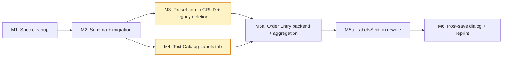

# Implementation Plan: Barcode Labels v2 — Configurable Label Preset Management (OGC-285)

**Branch (Spec PR / M1):** `feat/ogc-285-spec-cleanup`
**Date:** 2026-05-19
**Spec:** [./spec.md](./spec.md)
**Input:** Feature specification from `specs/OGC-285-barcode-label-presets/spec.md`

## Summary

Extend OpenELIS Global's barcode label system from a fixed 5-type model
to an **admin-configurable Label Preset** system: preset CRUD with
content fields, dimensions, and barcode type; per-test preset links
with override controls; dynamic Order Entry aggregation across all
tests in an order; and JSONB snapshot persistence for historical
reprint integrity.

**Deliverable includes video proof per user story.** Every milestone
that ships a user-facing flow (M3, M4, M5b, M6) MUST include a
Playwright demo spec under `frontend/playwright/tests/demo/core/` that
serves double duty — ci-safe functional verification (project
`core-demo`) AND video evidence (project `core-demo-video`, MP4 output).
The video for each user story is attached to the milestone PR and Jira
OGC-285 as visible proof that the feature exists and behaves. This is
the same infrastructure OGC-284 already uses (3 demo specs at
`ogc-285-*.spec.ts` adjacent to existing `ogc-284-*.spec.ts` files). Ships in 6 milestone PRs (M1 specs already
underway; M2 schema/migration; M3 admin CRUD + legacy page deletion;
M4 test catalog tab; M5 order entry rewrite + OGC-284 gap closure;
M6 post-save dialog + reprint via snapshot). Migration seeds 5
`is_system = true` presets from existing `site_information.barcode.*`
keys; legacy keys retained read-only for one release cycle.

Constitution Principle X (Legacy Code Removal) requires that the M3
PR delete `frontend/src/components/admin/barcodeConfiguration/BarcodeConfiguration.jsx`
entirely (with the Preprinted Accession Number controls migrating into
the new Label Presets admin surface) — recorded as a deliberate
divergence from FRS §5 and announced on
[Jira OGC-285](https://uwdigi.atlassian.net/browse/OGC-285).

## Technical Context

**Language/Version:** Java 21 LTS (Temurin); React 17 (JavaScript;
JSX). No NEEDS CLARIFICATION.
**Primary Dependencies:**
- Backend: Spring Framework 6.2.2 (Traditional MVC; NOT Spring Boot);
  Jakarta EE 9 (`jakarta.*`); Hibernate 6.x with PostgreSQL JSONB via
  `@JdbcTypeCode(SqlTypes.JSON)`; Liquibase 4.8.0; Spring Security RBAC.
- Frontend: React 17; `@carbon/react` Carbon Design System v1.15+;
  React Intl for i18n; Axios for REST.
**Storage:** PostgreSQL 14+ (existing OpenELIS DB; `clinlims` schema).
**Testing:**
- Backend: JUnit 4 (NOT JUnit 5) + Mockito + `BaseWebContextSensitiveTest`;
  Liquibase rollback tests; ORM validation tests.
- Frontend: Jest + React Testing Library for unit tests; Playwright
  for E2E (Cypress is DEPRECATED per CLAUDE.md; do not author new
  Cypress tests).
**Target Platform:** OpenELIS Global 2 deployments running on Linux
servers (Tomcat 9 / Spring 6 / PostgreSQL 14+). Browser support:
modern evergreen browsers.
**Project Type:** Web application (existing backend + frontend
monorepo).
**Performance Goals:** Order Entry Labels section MUST render the
two-table layout in <500ms for orders with up to 10 tests; the
`POST /api/orderEntry/labelRequest` aggregation endpoint MUST respond
in <100ms p95 for the same load. Admin CRUD operations MUST respond
in <200ms p95.
**Constraints:**
- All new code must satisfy constitution Principles I–X.
- All milestone PRs ≤30 files / ≤2,500 LOC net (engineering guardrail).
- No edits to non-English locale files (Transifex-managed); only
  `frontend/src/languages/en.json` receives new keys.
- No new Cypress tests (DEPRECATED); use Playwright.
**Scale/Scope:**
- Deployed sites: tens of OpenELIS installations across multiple
  countries.
- Custom presets per site: tens (typical) to low hundreds (maximum
  expected).
- Tests per site: hundreds.
- Orders per day per site: hundreds to low thousands.
- Labels per order: typically 5–20; up to 100 in pathology workflows.

## Constitution Check

_GATE: Must pass before Phase 0 research. Re-check after Phase 1 design._

Verify compliance with [OpenELIS Global Constitution](/.specify/memory/constitution.md):

- [x] **Configuration-Driven (I)**: No country-specific code branches
      planned. All Label Preset content (dimensions, fields,
      quantities) is data-driven; sites configure via Master Lists
      admin surface.
- [x] **Carbon Design System (II)**: All new UI uses `@carbon/react`
      exclusively (Modal, DataTable, NumberInput, Dropdown,
      FilterableMultiSelect, Tag, StructuredList, Tabs, Checkbox,
      Toggle, InlineNotification). NO Bootstrap, Tailwind, custom CSS
      frameworks. See spec.md CR-001.
- [x] **FHIR/IHE Compliance (III)**: Label Preset entities are NOT
      externally exposed (no FHIR R4 representation). The physical
      label PDFs render from internal data only. Order accession
      numbers (which are FHIR-exposed) are unchanged by this feature.
      See spec.md CR-005.
- [x] **Layered Architecture (IV)**: Backend follows 5-layer pattern.
      New package `org.openelisglobal.labelpreset.*` with explicit
      `valueholder/`, `dao/`, `service/`, `controller/rest/`, `form/`
      subpackages. `@Transactional` ONLY on service layer; controllers
      MUST NOT have `@Transactional`. Valueholders use JPA/Hibernate
      annotations (Jakarta EE 9 `jakarta.*`). See spec.md CR-003.
- [x] **Test Coverage (V)**: Unit + ORM validation + integration + E2E
      tests planned per Testing Strategy below. >80% backend, >70%
      frontend coverage. E2E uses **Playwright** (Cypress is DEPRECATED
      per CLAUDE.md; the plan-template's Cypress references are
      superseded for this feature).
- [x] **Schema Management (VI)**: All schema changes via Liquibase
      changesets. New changesets land in
      `src/main/resources/liquibase/3.3.x.x/` at the next available
      `0NN-*.xml` slots (after `028-barcode-info-tables.xml`). Every
      changeset includes a `<rollback>` block. See spec.md CR-004.
- [x] **Internationalization (VII)**: All new user-facing strings use
      React Intl. New keys in `frontend/src/languages/en.json` ONLY
      under three key prefixes (`admin.labelPresets.*`,
      `admin.testCatalog.labels.*`, `orderEntry.labels.*`). Other
      locale files are Transifex-managed and MUST NOT be touched. See
      spec.md CR-002.
- [x] **Security & Compliance (VIII)**: RBAC scopes per endpoint
      (`admin.barcode.manage`, `admin.testCatalog.manage`,
      `order.create`, `order.read`). Server-side validation on all
      input. Audit trail captured via JSONB snapshot + `created_at` +
      `updated_at` timestamps. See spec.md CR-007.
- [x] **Spec-Driven Development (IX)**: Milestone-based delivery
      (M1–M6); every milestone is a separately reviewable PR; AC
      traceability documented in [tasks.md](./tasks.md) when authored
      by `/speckit.tasks`. See Milestone Plan below.
- [x] **Legacy Code Removal (X)**: M3 PR deletes
      `frontend/src/components/admin/barcodeConfiguration/BarcodeConfiguration.jsx`
      entirely (and the backend qty/dim/element endpoints) in the
      same PR that ships the new admin surface. NO dual-write, NO
      legacy-first paths. Legacy `site_information.barcode.*` quantity
      keys are mirrored read-only for one release cycle per FRS §2.7,
      then removed in v2.x maintenance migration.

**Complexity Justification Required:** None. No constitution
violations identified. Complexity Tracking section is intentionally
empty.

## Milestone Plan

_GATE: Features >3 days MUST define milestones per Constitution
Principle IX. Each milestone = 1 PR._

### Milestone Table

| ID | Branch Suffix | Scope (Layers / Stories) | User Stories | Verification | Depends On |
|---|---|---|---|---|---|
| M1 | `m1-spec-cleanup` | Specs only (OGC-284 closure + OGC-285 scaffolding + speckit artifacts + remediation pass) | All | Spec PR review passes; AC traceability verified by reviewer | — |
| M2 | `m2-schema-migration` | DB schema (Liquibase) + Hibernate valueholders + DAOs + system-preset seed (split into 2 changesets — presets then fields-by-name); **Phase A legacy modernization**: re-annotate `Sample.java` / `SampleItem.java` / `Test.java` from XML mapping → JPA annotations, delete the 3 corresponding `.hbm.xml` files (Constitution Principle X — "address legacy/deprecated code when touched") | US1, US4, US5 | Liquibase up + rollback green; ORM validation tests; migration data-integrity tests against v1 DBUnit fixture; existing test suite green after .hbm.xml→JPA migration | M1 |
| M3 | `m3-preset-admin-crud` | LabelPresetService + REST + Master Lists admin UI; **delete `BarcodeConfiguration.jsx` + `BarcodeConfigurationRestController.java` entirely**; new `SiteWideBarcodeSettingsRestController` for Preprinted Accession Number endpoints; migrate Preprinted controls into new admin surface | US1 | Backend unit + controller tests for AC-2..AC-7; **demo spec `ogc-285-label-preset-admin.spec.ts` (AC-1..AC-7) + video attached as US1 proof**; legacy files no longer exist (grep gates) | M2 |
| `[P]` M4 | `m4-test-catalog-labels` | TestLabelConfigService + REST + Test Editor Labels tab (temporary `<Tabs>` shim in `ViewTestCatalog.jsx` until OGC-746 lands) | US2 | Backend tests for AC-8..AC-12; **demo spec `ogc-285-test-catalog-labels.spec.ts` (AC-8..AC-12) + video attached as US2 proof** | M2 |
| M5a | `m5a-order-entry-backend` | Aggregation `OrderEntryLabelRequestService` + `POST /api/orderEntry/labelRequest`; `OrderLabelRequestService` + `order_label_request` JSONB snapshot persistence; order-save hook wiring; **delete `BarcodeWorkflowPrintServiceImpl.java`** entirely (Principle X — `OrderEntryLabelRequestService` is the authoritative aggregator) | US3, US4 | Aggregation conflict-resolution tests (AC-16, AC-17); snapshot persistence test (AC-19); `grep 'BarcodeWorkflowPrintServiceImpl' src/main/java/` returns no matches. (No UI in this milestone; M5b records the video.) | M2, M3, M4 |
| M5b | `m5b-order-entry-frontend` | **Rewrite `LabelsSection.jsx` as two dynamic-column tables** (removes `applicableLabelTypes: ["specimen"]` hardcode — closes OGC-284 absorbed gap); update `OrderSuccessMessage.jsx`; update other consumers in workflow inventory | US3, US4 | Frontend Jest tests (AC-14, AC-15, AC-18); **demo spec `ogc-285-order-entry-labels.spec.ts` (AC-13..AC-19) + video attached as US3/US4 proof** (also visibly demonstrates OGC-284 hardcode closure); `grep "applicableLabelTypes" frontend/src/components/barcodeWorkflow/` returns no matches | M5a |
| M6 | `m6-postsave-dialog-reprint` | `GET /api/orders/{id}/labels` + `GET /api/barcode/print/{orderId}/{presetId}`; **rewrite `PostSavePrintDialog.jsx` as dynamic preset list with editable Carbon `<NumberInput>` (decrease-only, audit-bound) + Skip-Print-Later button**; reprint from Order View via snapshot | US5 | Snapshot-frozen-on-reprint regression test (AC-20); **demo spec `ogc-285-reprint-from-snapshot.spec.ts` (AC-20 + Skip flow) + video attached as US5 proof** | M5b |

**Legend:**
- **`[P]`** = parallel milestone (M3 + M4 can develop concurrently after M2 lands).
- **Sequential** (no prefix) = must complete before dependent milestones.
- **Branch naming**: `feat/ogc-285-{branch-suffix}` (e.g.,
  `feat/ogc-285-m2-schema-migration`). M1 uses
  `feat/ogc-285-spec-cleanup` (already pushed as PR #3628).

**Why M5 is split:** M5 originally combined backend aggregation, JSONB
persistence, LabelsSection.jsx rewrite, and OrderSuccessMessage update.
Estimated net change: ~3,500–4,000 LOC across ~30 files — busts the
≤2,500 LOC PR budget. Split into M5a (backend, ~2,000 LOC) and
M5b (frontend rewrite + workflow integration, ~1,500 LOC) keeps each PR
reviewable. M5b depends on M5a's `POST /api/orderEntry/labelRequest`
endpoint.

### Milestone Dependency Graph



### PR Strategy

- **Spec PR (M1):** `feat/ogc-285-spec-cleanup` → `develop` —
  documentation only. Already open as
  [PR #3628](https://github.com/DIGI-UW/OpenELIS-Global-2/pull/3628) (draft).
  Adds M1 SpecKit artifacts (spec.md, research.md, data-model.md,
  contracts/openapi.yaml, quickstart.md, plan.md, checklists/) on top
  of the OGC-284 closure + OGC-285 README scaffold already committed.
  Awaits non-Copilot human review.
- **Milestone PRs (M2–M6):** `feat/ogc-285-{m{N}-{desc}}` → `develop`
  per milestone. Each opens as **draft early** so CI runs during
  implementation (per engineering guardrail and durable memory rule
  "Commit early").

**Per-milestone PR discipline:**

1. No self-merge without a non-Copilot human reviewer's `APPROVED`
   review. The `reviewDecision` field must read `APPROVED` (not
   `REVIEW_REQUIRED`) at merge time.
2. AC checklist in PR body, with each FRS AC the PR closes as an
   explicit `[ ]` line; reviewer ticks them.
3. **Inversion Test results documented** per Constitution V.6. PR
   template MUST include the literal line `[ ] Inversion Test results
   documented (Constitution V.6)` and the body MUST list what
   implementation was mutated, which test failed, and confirm green
   restoration. This is honor-system + reviewer attention; no CI gate
   currently catches missing Inversion Test docs, so reviewers MUST
   enforce.
4. No mid-stream rescoping. If a milestone grows during
   implementation, open a follow-up issue and ship original scope.
5. No Jira self-resolve. Status moves to Done at PR merge.
6. ≤30 files / ≤2,500 LOC net per milestone PR. Larger means slice
   further (cf. M5 → M5a + M5b split).
7. Tests precede implementation (Constitution Principle V — TDD
   Red → Green → Refactor).
8. AC-by-AC walkthrough at PR-ready (running UI + reviewer).

### i18n key cleanup policy

New keys land in `frontend/src/languages/en.json` ONLY. **Non-English
locale files (`fr.json`, `mg.json`, `ar.json`, etc., 19 total) are
Transifex-managed** — engineers MUST NOT edit them in PR. If a
milestone deletes a key from `en.json` (e.g., the orphaned legacy
Barcode Configuration labels removed in M3), the corresponding keys
in non-English locales remain stale until the next Transifex sync
removes them.

**Reviewer rule:** non-English locale orphan keys are NOT a blocker
for milestone PRs. Do not flag stale keys in `fr.json` (etc.) as a
review issue; the Transifex round-trip handles cleanup. The only
locale check the reviewer applies is: confirm `en.json` has the new
keys + no other locale file was modified.

## Project Structure

### Documentation (this feature)

```text
specs/OGC-285-barcode-label-presets/
├── spec.md             # User stories, FRs, Constitution Compliance, SC, Clarifications (/speckit.specify output)
├── plan.md             # This file (/speckit.plan output)
├── research.md         # FRS pin + Q-resolutions + divergence rationale + workflow inventory (/speckit.plan output)
├── data-model.md       # DDL + CHECK constraints + JSONB snapshot shape + Hibernate notes (/speckit.plan output)
├── quickstart.md       # Per-milestone end-to-end verification recipes (/speckit.plan output)
├── contracts/
│   └── openapi.yaml    # OpenAPI 3 spec for the 10 REST endpoints (/speckit.plan output)
├── checklists/
│   └── requirements.md # Spec quality validation (/speckit.specify output; all items pass)
└── tasks.md            # Task-level breakdown with [T###] [P?] [US#] IDs and AC traceability (/speckit.tasks output — NOT created by /speckit.plan)
```

### Source Code (repository root)

Existing OpenELIS Global 2 web-application monorepo layout. New paths
this feature introduces:

```text
src/main/java/org/openelisglobal/labelpreset/             # NEW package (M2+)
├── valueholder/
│   ├── LabelPreset.java
│   ├── LabelPresetField.java
│   ├── TestLabelConfig.java
│   └── OrderLabelRequest.java
├── dao/
│   ├── LabelPresetDAO.java + Impl
│   ├── LabelPresetFieldDAO.java + Impl
│   ├── TestLabelConfigDAO.java + Impl
│   └── OrderLabelRequestDAO.java + Impl
├── service/
│   ├── LabelPresetService.java + Impl              # @Transactional here ONLY
│   ├── TestLabelConfigService.java + Impl
│   ├── OrderLabelRequestService.java + Impl
│   └── OrderEntryLabelRequestService.java + Impl   # aggregation function (M5)
├── controller/rest/
│   ├── LabelPresetRestController.java              # 6 endpoints (M3)
│   ├── TestLabelConfigRestController.java          # 2 endpoints (M4)
│   ├── OrderEntryLabelRequestController.java       # 1 endpoint (M5)
│   └── OrderLabelRequestController.java            # 2 endpoints (M6)
└── form/
    ├── LabelPresetForm.java
    └── TestLabelConfigForm.java

src/main/resources/liquibase/3.3.x.x/
├── 029-label-preset-tables.xml                     # NEW (M2): label_preset, label_preset_field, test_label_config, order_label_request, ALTER (or CREATE) test_label_preset_link
└── 030-seed-system-presets.xml                     # NEW (M2): seed 5 is_system=true rows from site_information.barcode.*

src/test/java/org/openelisglobal/labelpreset/        # NEW test tree (M2+)
├── valueholder/LabelPresetOrmValidationTest.java
├── service/LabelPresetServiceTest.java
├── controller/rest/LabelPresetRestControllerValidationTest.java
└── service/OrderEntryLabelRequestServiceAggregationTest.java

frontend/src/components/admin/labelPresets/          # NEW (M3): replaces BarcodeConfiguration.jsx entirely
├── LabelPresetList.jsx                             # Master Lists landing page; includes site-wide barcode settings section
├── LabelPresetEditor.jsx                           # Carbon <Modal> editor with 4 sections
├── LabelPresetEditor.test.jsx
├── LabelPresetList.test.jsx
└── helpers.js                                       # uniqueness normalization, content-field reorder

frontend/src/components/admin/testManagement/        # MODIFIED (M4)
├── ViewTestCatalog.jsx                             # adds temporary <Tabs> shim hosting LabelsTab until OGC-746 ships
└── labelsTab/
    ├── LabelsTab.jsx                               # NEW
    ├── LinkedPresetsTable.jsx
    └── OrderEntryPreview.jsx

frontend/src/components/barcodeWorkflow/             # MODIFIED (M5, M6)
├── LabelsSection.jsx                               # REWRITTEN in M5 (kills applicableLabelTypes hardcode)
├── PostSavePrintDialog.jsx                         # REWRITTEN in M6 (dynamic preset list, editable NumberInput, Skip-Print-Later)
└── *.test.jsx                                      # tests rewritten alongside

frontend/playwright/tests/demo/core/                 # NEW demo specs (M3+) — video-ready story proof
├── ogc-285-label-preset-admin.spec.ts              # M3 (US1)
├── ogc-285-test-catalog-labels.spec.ts             # M4 (US2)
├── ogc-285-order-entry-labels.spec.ts              # M5b (US3, US4)
└── ogc-285-reprint-from-snapshot.spec.ts           # M6 (US5)
# (Foundational tests, if needed for faster ci-safe smoke, land under
#  frontend/playwright/tests/foundational/core/ — typically not needed
#  since the demo specs are also run by the ci-safe core-demo project.)

frontend/src/languages/en.json                       # MODIFIED (every milestone): new keys under three prefixes
                                                    # NOTE: non-English files (fr.json, mg.json, etc.) MUST NOT be edited; Transifex-managed.

frontend/src/components/admin/barcodeConfiguration/  # DELETED in M3
└── BarcodeConfiguration.jsx                        # 1396 LOC removed; Preprinted controls migrate into LabelPresetList.jsx

src/main/java/org/openelisglobal/barcode/controller/rest/
└── BarcodeConfigurationRestController.java         # MODIFIED in M3: qty/dim/element endpoints DELETED; preprinted-prefix endpoint MOVES to labelpreset.controller.rest (or stays + URL deprecated)
```

**Structure Decision:** Web application (existing monorepo). New
backend code lives under `src/main/java/org/openelisglobal/labelpreset/`;
new frontend code under
`frontend/src/components/admin/labelPresets/` and
`frontend/src/components/admin/testManagement/labelsTab/`. M5/M6
rewrite existing files in-place in `frontend/src/components/barcodeWorkflow/`.

## Complexity Tracking

> Fill ONLY if Constitution Check has violations that must be justified.

**N/A** — all constitution checks pass. No violations.

## Testing Strategy

**Reference:** [OpenELIS Testing Roadmap](/.specify/guides/testing-roadmap.md).

**Note on Cypress vs Playwright:** The plan-template's E2E section
references Cypress. Per [CLAUDE.md](/CLAUDE.md) "Cypress E2E —
DEPRECATED" and "Playwright E2E — RECOMMENDED", this feature uses
**Playwright exclusively** for new E2E tests; do not author Cypress
tests. The Playwright execution contract (use `npm run pw:test`
scripts, never raw `npx playwright test`) applies.

### Coverage Goals

- **Backend:** >80% line coverage (measured via JaCoCo) on the new
  `org.openelisglobal.labelpreset.*` package.
- **Frontend:** >70% line coverage (measured via Jest) on the new
  `frontend/src/components/admin/labelPresets/` and
  `frontend/src/components/admin/testManagement/labelsTab/` and the
  rewritten `frontend/src/components/barcodeWorkflow/LabelsSection.jsx`
  + `PostSavePrintDialog.jsx`.
- **Critical paths:** 100% coverage on the JSONB snapshot
  serialization/deserialization, aggregation conflict-resolution
  function, and the legacy-page redirect.

### Test Types

- [x] **Unit Tests (Backend)** — JUnit 4 + Mockito; `@RunWith(MockitoJUnitRunner.class)` for isolated unit tests. Covers `LabelPresetService`, `OrderEntryLabelRequestService` aggregation function, `OrderLabelRequestService` snapshot serialization. SDD checkpoint: M2/M3/M4/M5 pre-merge.
- [x] **DAO Tests** — `BaseWebContextSensitiveTest` + real DAO beans + rollback. Covers persistence of all 4 new entities including JSONB round-trip. SDD checkpoint: M2 pre-merge.
- [x] **Controller Tests** — `BaseWebContextSensitiveTest` + `MockMvc`. Covers each of the 10 REST endpoints (request validation, response shape, scope enforcement). SDD checkpoint: per-controller milestone pre-merge.
- [x] **ORM Validation Tests** — Constitution V.4. MUST execute in <5s, MUST NOT require DB. Validates entity-to-table mapping for `LabelPreset`, `LabelPresetField`, `TestLabelConfig`, `OrderLabelRequest`. SDD checkpoint: M2 pre-merge.
- [x] **Integration Tests** — `BaseWebContextSensitiveTest` full-context. End-to-end "create preset → link to test → place order → save → reprint via snapshot" exercising the whole stack. SDD checkpoint: M5 + M6 pre-merge.
- [x] **Frontend Unit Tests** — Jest + React Testing Library. Component tests for `LabelPresetEditor.jsx`, `LabelsSection.jsx`, `PostSavePrintDialog.jsx`. Tests assert visible output (not implementation details) per durable memory "no test workaround comments".
- [x] **E2E Tests (Playwright demo specs — video proof per user story; MANDATORY deliverable)** — every OGC-285 user-facing milestone (M3, M4, M5b, M6) MUST ship a demo spec at `frontend/playwright/tests/demo/core/ogc-285-*.spec.ts` AND attach an MP4 video of that spec running. The same `.spec.ts` file serves double duty via Playwright's project routing: the `core-demo` project runs it ci-safe in CI (functional verification, no video), and the `core-demo-video` project records the video (slowMo=500ms, video=on). Both projects can run in CI — the difference is just video artifact handling. The video is the user-visible evidence that the feature exists and behaves; it is attached to the milestone PR body and to Jira OGC-285 alongside the test plan. Specs MUST live at `frontend/playwright/tests/demo/core/` (matches OGC-284 pattern at `ogc-284-*.spec.ts`). Authoring workflow: `/plan-record-playwright` → `/write-playwright-test` → `/audit-playwright`.

**No separate "foundational" specs for OGC-285.** The repo's foundational/demo distinction (`frontend/playwright/tests/foundational/core/`) is for tiny smoke checks (e.g., "sidenav renders", "analyzer list loads") that aren't user stories. Every OGC-285 user-facing flow IS a user story; demo specs cover them end-to-end. Adding foundational specs alongside would be redundant.

  | File | Milestone | User story | FRS ACs covered | Deliverable |
  |---|---|---|---|---|
  | `ogc-285-label-preset-admin.spec.ts` | M3 | US1 (admin CRUD + Master Lists surface) | AC-1, AC-2, AC-3, AC-4, AC-5, AC-6, AC-7 | Demo video: admin creates Cryo Vial preset, attempts to deactivate Order Label (blocked), validates uniqueness + scope-required errors. |
  | `ogc-285-test-catalog-labels.spec.ts` | M4 | US2 (Test Catalog Labels tab) | AC-8, AC-9, AC-10, AC-11, AC-12 | Demo video: admin opens CBC, links Specimen + Slide presets, toggles master switch, reload + verify state. |
  | `ogc-285-order-entry-labels.spec.ts` | M5b | US3, US4 (Order Entry two-table layout + OGC-284 hardcode closure) | AC-13, AC-14, AC-15, AC-16, AC-17, AC-18, AC-19 | Demo video: tech adds CBC + Tissue Biopsy, observes columns + source tags + lock icons, modifies a cell, saves order, verifies `order_label_request` rows. |
  | `ogc-285-reprint-from-snapshot.spec.ts` | M6 | US5 (reprint integrity) | AC-20, Skip-Print-Later flow | Demo video: tech saves order, admin mutates the preset, tech reprints from Order View — labels render from snapshot (pre-mutation dimensions). |

**Playwright anti-patterns to avoid** (per CLAUDE.md):
- No `response.ok()` as pass/fail — use `waitForResponse` for sync; assert on visible UI state.
- No `{ force: true }` on Carbon inputs — click the `<label>` instead.
- No `.catch(() => false)` on `isVisible()`.
- No `isVisible({ timeout: N })` — use `expect(el).toBeVisible({ timeout: N })`.

### Test Data Management

- **Backend:**
  - **DBUnit fixtures** (`FlatXmlDataSet` with `PostgresqlDataTypeFactory`)
    are the OpenELIS convention. `BaseWebContextSensitiveTest`
    (`src/test/java/org/openelisglobal/BaseWebContextSensitiveTest.java`)
    loads XML fixtures and rolls back per test via DBUnit + Spring's
    `AbstractTransactionalJUnit4SpringContextTests`.
  - Use `@ContextConfiguration(classes = { BaseTestConfig.class, AppTestConfig.class })`
    for context configuration — the existing OE test config pattern;
    don't introduce new test config classes.
  - New test fixtures land at
    `src/test/resources/fixtures/ogc-285/` as `.xml` (DBUnit format).
    Reference `src/test/resources/FIXTURE_LOADER_README.md` for the
    unified fixture-loader pattern.
  - Unit tests (`@RunWith(MockitoJUnitRunner.class)`) for service-layer
    logic with NO external collaborators may use builder/factory
    patterns. Integration tests use DBUnit fixtures.
  - JSONB persistence tests round-trip via real Hibernate
    (`JsonBinaryType` UserType) — no Jackson mocking.

- **Frontend (Playwright E2E):**
  - Playwright's `request` fixture for API-based setup; NOT slow
    UI-based seeding.
  - Login via Playwright's `storageState.json` from a one-time auth
    setup (the equivalent of Cypress's `cy.session()`; 10–20× faster
    than per-test login).
  - Playwright's `page.route(...)` used **spy-first** (assert
    request/response shapes); avoid stubbing backend responses in true
    E2E.
  - DO NOT stub the mutation endpoint under test
    (`PUT/POST/PATCH/DELETE`); if backend is stubbed, it is not E2E.

### Playwright script reference (verified in `frontend/package.json`)

| Script | When to use |
|---|---|
| `npm run pw:test` | Default; runs all Playwright tests across all projects. Use for one-off file invocations (`npm run pw:test -- ogc-285-label-preset-admin`). |
| `npm run pw:test:core-demo` | **OGC-285 functional CI run** — runs demo specs ci-safe (no video, no slowMo). The default core E2E job in `e2e-authoritative-reusable.yml` runs `projects: "core-app,core-demo"`. |
| `npm run pw:test:core-demo-video` | **OGC-285 video recording** — runs demo specs with `video: "on"` + `slowMo: 500ms`. Produces MP4 videos under `frontend/test-results/`. Runs locally OR can be invoked from a CI workflow by passing `projects: "core-demo-video"` to the reusable Playwright workflow (`e2e-playwright-reusable.yml` accepts arbitrary project names; the harness already does this via `projects/analyzer-harness/ci-parity-test.sh --mode video` for `harness-demo-video`). |
| `npm run pw:test:core-app` | Foundational ci-safe specs under `frontend/playwright/tests/foundational/core/` — tiny smoke checks unrelated to OGC-285. Not used by OGC-285. |
| `npm run pw:test:headed` | Debug visually. |
| `npm run pw:test:ui` | Playwright UI mode. |
| `npm run pw:test:demo` | Alias for `pw:test:harness-demo`; not used by OGC-285. |
| `npm run pw:install` | One-time Playwright browser install (`--only-shell chromium`). |

**Video output location:** after `pw:test:core-demo-video`, MP4s are at `frontend/test-results/{spec-name}-{project}-chromium/video.webm` (Playwright default), and the HTML report at `frontend/playwright-report/index.html` embeds them. PR description / Jira comment should link to or attach the relevant MP4 per user story.

### Checkpoint Validations

Per Constitution Principle V (Test-Driven Development) and the
engineering guardrail "tests precede implementation":

- [x] **After Phase 1 (M2 Entities):** ORM validation tests MUST pass; Liquibase up + rollback MUST succeed against a fresh DB; migration data-integrity test against the v1 fixture MUST pass.
- [x] **After Phase 2 (M3/M4 Services):** Backend unit tests (Service layer) MUST pass; controller validation tests MUST pass.
- [x] **After Phase 3 (M3/M4 Controllers):** Integration tests covering the new endpoints MUST pass; Spring Security RBAC scope enforcement tests MUST pass.
- [x] **After Phase 4 (M3/M4/M5/M6 Frontend):** Jest unit tests AND Playwright E2E tests MUST pass per the milestone's AC list.
- [x] **Pre-merge for every milestone:** AC-by-AC walkthrough at PR-ready — author and reviewer step through the running UI confirming each AC in the milestone's PR body checklist visibly satisfied.

## Phase 0 (Outline & Research) Notes

- Source-code-truth checks performed 2026-05-19 confirmed:
  - OGC-761 `test_label_preset_link` table is NOT on develop → M2
    creates the full table.
  - OGC-746 Test Editor scaffold is NOT on develop → M4 ships a
    `<Tabs>` shim in `ViewTestCatalog.jsx`.
- All 4 FRS Open Questions (Q1–Q4) resolved in [spec.md
  Clarifications](./spec.md#clarifications) during `/speckit.specify`
  and `/speckit.clarify` sessions; rationale recorded in
  [research.md](./research.md).
- Six deliberate divergences from the upstream FRS recorded (see [research.md §3](./research.md)):
  1. Editable post-save quantities = YES (decrease-only, audit-bound).
  2. OGC-284 Order Entry quantity UI gap absorbed by M5
     LabelsSection rewrite.
  3. Legacy BarcodeConfiguration page deleted in M3 (Constitution
     Principle X — announced via Jira comment on OGC-285).
- No `NEEDS CLARIFICATION` markers remain after `/speckit.clarify`.

## Phase 1 (Design & Contracts) Notes

- Data model authored in [data-model.md](./data-model.md): 4 new
  tables + 1 ALTER on (potentially absent) `test_label_preset_link`.
  All `CHECK` constraints + UNIQUE constraints derived from FRS §7.1.
  JSONB snapshot shape verbatim from FRS §7.3.1.
- API contracts authored in [contracts/openapi.yaml](./contracts/openapi.yaml):
  10 REST endpoints with example request/response payloads from
  FRS §8.
- Quickstart authored in [quickstart.md](./quickstart.md):
  per-milestone end-to-end verification recipes.
- Agent context file already up-to-date — see CLAUDE.md "Active
  Technologies" section.

## Next: /speckit.tasks

After this plan is reviewed/merged, run `/speckit.tasks` to author
[tasks.md](./tasks.md) with the `[T###] [P?] [US#]` task-level
breakdown and AC traceability per the FRS's 27 acceptance criteria.

## References

- [Canonical FRS v2.5 @ 7cf6f65](https://github.com/DIGI-UW/openelis-work/blob/7cf6f65cae9a9794e52f3dd4c5e759c920d87bf5/designs/admin-config/barcode-labels.md)
- [Jira OGC-285](https://uwdigi.atlassian.net/browse/OGC-285) (In Progress)
- [Jira OGC-285 comment #28885](https://uwdigi.atlassian.net/browse/OGC-285?focusedCommentId=28885) (FRS §5 divergence announcement)
- [Spec PR #3628](https://github.com/DIGI-UW/OpenELIS-Global-2/pull/3628) (draft, awaiting human review)
- [OpenELIS Global Constitution](/.specify/memory/constitution.md)
- [OpenELIS Testing Roadmap](/.specify/guides/testing-roadmap.md)
- [Playwright Best Practices](/.specify/guides/playwright-best-practices.md)
- [OGC-284 Gap Closure Matrix](../OGC-284-barcode-label-quantity-management/spec.md#gap-closure-matrix)
- [spec.md](./spec.md) · [research.md](./research.md) · [data-model.md](./data-model.md) · [contracts/openapi.yaml](./contracts/openapi.yaml) · [quickstart.md](./quickstart.md)
