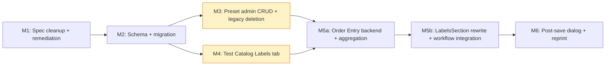
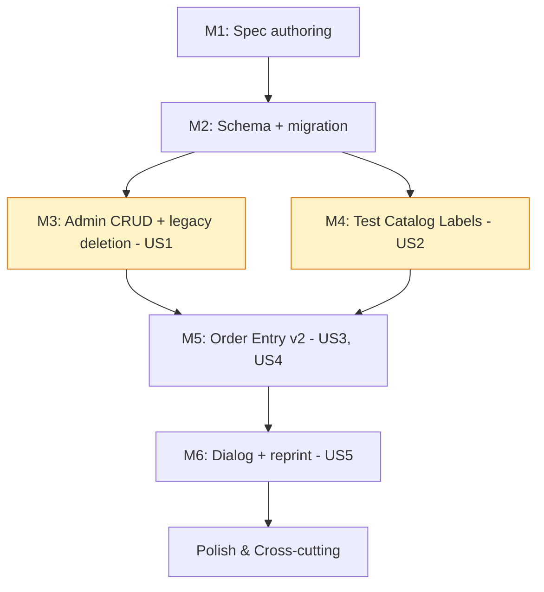

# Tasks: Barcode Labels v2 — Configurable Label Preset Management (OGC-285)

**Input:** Design documents from `specs/OGC-285-barcode-label-presets/`
**Prerequisites:** [plan.md](./plan.md), [spec.md](./spec.md), [research.md](./research.md), [data-model.md](./data-model.md), [contracts/openapi.yaml](./contracts/openapi.yaml), [quickstart.md](./quickstart.md)

**Organization Rule (OpenELIS Override):** Tasks are organized by **Milestone** per Constitution Principle IX, NOT by user story. Tests are **mandatory** per Constitution Principle V (TDD); tests precede implementation tasks within each milestone.

## Format: `- [ ] [T###] [P?] [US?] Description with file path`

- **`[T###]`**: Sequential task ID across all milestones.
- **`[P]`**: Parallelizable — different files, no unresolved dependency.
- **`[US#]`**: Story traceability (US1 admin CRUD · US2 test catalog · US3 order entry · US4 migration · US5 reprint snapshot).
- All paths are absolute from the worktree root.

## Anti-mocking discipline (user-requested emphasis)

Per user direction "tests that actually test the code (not over-mocked!)" and constitution Principle V, this task list enforces:

1. **DAO tests** use `BaseWebContextSensitiveTest` with a **real PostgreSQL test database** and rollback per test. NEVER mock the EntityManager.
2. **Service tests** mock ONLY external boundaries (time, randomness, external HTTP). Use real DAOs against the real test DB. The `@Mock` annotation is RESERVED for things outside the unit's contract.
3. **Controller tests** use `BaseWebContextSensitiveTest + MockMvc` with the real Spring context, real services, real DAOs, real DB. The test verifies the integrated path end-to-end via HTTP.
4. **JSONB snapshot tests** use real Jackson + real Hibernate JSON binding against the real DB. Round-trip serialization is the assertion.
5. **Aggregation function tests** use real `test_label_preset_link` rows in the test DB, not mocked DAO responses.
6. **Frontend Vitest tests** assert visible output (rendered text, `getByRole`, `getByText`) per durable memory rule "No test workaround comments". Avoid `getByTestId` for assertions about USER-VISIBLE behavior. (`frontend/package.json` declares `"test": "vitest run"`.)
7. **Playwright demo specs** (`frontend/playwright/tests/demo/core/ogc-285-*.spec.ts`) use the real backend stack (no `route.fulfill` stubbing of mutation endpoints under test). Per CLAUDE.md, Cypress is DEPRECATED — author Playwright only.
8. **Video proof per user story is a MANDATORY deliverable.** Each user-facing milestone (M3, M4, M5b, M6) ships:
   - The demo spec under `frontend/playwright/tests/demo/core/`, ci-safe-green via `npm run pw:test:core-demo`.
   - An MP4 video of that spec running under `core-demo-video` (slowMo=500ms, video=on), recorded via `npm run pw:test:core-demo-video` (locally OR via a CI workflow invocation passing `projects: "core-demo-video"`).
   - The MP4 attached to the milestone PR body AND to Jira OGC-285 as visible user-story proof.
   - PR cannot move to "ready for review" without the video attached.
9. **Inversion Test (Constitution V.6):** for every test, mutate the implementation it claims to cover and verify the test fails. A test that passes against a broken implementation is a broken test.

## Milestone Dependency Graph

M3 and M4 can develop in parallel after M2 merges. M5 was split into M5a (backend, ≤2,500 LOC) + M5b (frontend, ≤2,500 LOC) to honor the LOC budget. All milestones gated by a non-Copilot human reviewer's `APPROVED` review per engineering guardrail.

---

## Milestone M1 — Spec authoring (specs only; no code)

**Branch:** `feat/ogc-285-spec-cleanup` (active; PR #3628 open as draft).
**Stories:** All (foundation).
**Independent Test:** Spec PR carries the SpecKit artifacts; reviewer walks the [quickstart.md M1 section](./quickstart.md#m1--spec-authoring-no-code-documentation-only) and ticks every box.
**Depends On:** —
**FRS ACs closed:** None (specification, not implementation). Sets up AC-traceability for downstream milestones.

### M1 already-completed work (this branch)

- [x] T001 [US-all] Transition Jira OGC-285 from Backlog to In Progress via Atlassian MCP (`transitionJiraIssue` id `31`); verify status.
- [x] T002 [US-all] Create feature branch `feat/ogc-285-spec-cleanup` off `develop` (renamed from worktree auto-branch).
- [x] T003 [US-all] OGC-284 closure commit (`7aea1d600`): superseded-by banner across `specs/OGC-284-barcode-label-quantity-management/spec.md`, `plan.md`, `tasks.md`, `quickstart.md`; Gap Closure Matrix appended to `specs/OGC-284-barcode-label-quantity-management/spec.md`; status field updated to "Closed — Superseded by OGC-285 (2026-05-19)".
- [x] T004 [US-all] OGC-285 scaffold: directory `specs/OGC-285-barcode-label-presets/` created (FRS SHA `7cf6f65` pinned in research.md).
- [x] T005 [US-all] `/speckit.specify`: author `specs/OGC-285-barcode-label-presets/spec.md` + `checklists/requirements.md`.
- [x] T006 [US-all] `/speckit.clarify`: integrate Q1 (post-save qty bounds), Q2 (legacy page consolidation), Q3 (name uniqueness normalization) into `specs/OGC-285-barcode-label-presets/spec.md` Clarifications section.
- [x] T007 [US-all] Post Jira comment #28885 on OGC-285 announcing the FRS §5 divergence (legacy page deletion per Principle X).
- [x] T008 [US-all] `/speckit.plan`: author `specs/OGC-285-barcode-label-presets/plan.md`, `research.md`, `data-model.md`, `contracts/openapi.yaml`, `quickstart.md`.
- [x] T009 [US-all] Commit + push SpecKit artifacts (`24f6aaa92`); verify PR #3628 picked up the commit.

### M1 remaining tasks

- [x] T010 [US-all] `/speckit.tasks`: author this file (`specs/OGC-285-barcode-label-presets/tasks.md`).
- [ ] T011 [US-all] Commit tasks.md (single docs commit on `feat/ogc-285-spec-cleanup`); push to update PR #3628.
- [ ] T012 [US-all] Request non-Copilot human review on PR #3628 (engineering guardrail). Author MUST NOT self-merge.
- [ ] T013 [US-all] Address any review feedback on PR #3628; iterate until `reviewDecision = APPROVED`.
- [ ] T014 [US-all] Merge PR #3628 to `develop` (squash). Jira OGC-285 stays In Progress (does NOT flip to Done; M6 merge flips it).

---

## Milestone M2 — Schema + Hibernate entities + Liquibase migration

**Branch:** `feat/ogc-285-m2-schema-migration` (created from `develop` after M1 merges).
**Stories:** US1, US4, US5 (schema foundation).
**Independent Test:** [quickstart.md M2 section](./quickstart.md#m2--schema-hibernate-entities-migration). Fresh DB ↔ `mvn liquibase:update` succeeds; 5 seeded system presets present with values copied from `site_information.barcode.*` keys; rollback removes the new tables cleanly; ORM validation tests pass in <5s without a DB connection.
**Depends On:** M1.
**FRS ACs closed:** AC-21, AC-22, AC-24 (migration + schema). Foundation for AC-1, AC-19, AC-20.
**LOC/files budget:** ≤30 files / ≤2,500 LOC net (engineering guardrail).

### M2 setup

- [ ] T020 [US-all] Create branch `feat/ogc-285-m2-schema-migration` off `develop` after M1 merges; set up worktree at `.claude/worktrees/ogc-285-m2` if isolation needed.
- [ ] T021 [US-all] Open draft PR early (engineering guardrail "open PR as draft early"); body includes the M2 AC checklist (AC-21, AC-22, AC-24).

### M2 RED — tests precede implementation

- [ ] T022 [P] [US1] Author Liquibase rollback test `src/test/java/org/openelisglobal/labelpreset/migration/LabelPresetTablesRollbackTest.java`. Uses `BaseWebContextSensitiveTest` with the real test DB; runs `liquibase:update` then `liquibase:rollback`; asserts the new tables disappear. RED: changesets don't exist yet → test fails by class-not-found OR Liquibase asserts no changes.
- [ ] T023 [P] [US1] Author migration data-integrity test `src/test/java/org/openelisglobal/labelpreset/migration/SystemPresetSeedTest.java`. Loads `src/test/resources/fixtures/v1-barcode-config.sql` (M2 also creates this fixture in T032) into the test DB; runs the seed changeset; asserts 5 system preset rows exist with `default_per_*`/`max_per_*`/`height_mm`/`width_mm` matching the fixture's `site_information.barcode.*` values per FRS §2.7. RED: seed changeset absent.
- [ ] T024 [P] [US1] Author migration malformed-input test `src/test/java/org/openelisglobal/labelpreset/migration/SystemPresetSeedMalformedInputTest.java`. Fixture has intentionally non-numeric `site_information.barcode.specimen.default = "garbage"` row; asserts seed migration completes without error and writes the canonical fallback (`default_per_sample = 1`). RED: changeset doesn't yet handle this.
- [ ] T025 [P] [US1] Author ORM validation test `src/test/java/org/openelisglobal/labelpreset/valueholder/LabelPresetOrmValidationTest.java`. NO DB. Uses Hibernate's `Metamodel` API to validate `@Entity` → `@Table` mapping for `LabelPreset`, `LabelPresetField`, `TestLabelConfig`, `TestLabelPresetLink`, `OrderLabelRequest`. Must execute in <5s (Constitution V.4). RED: value-holders don't exist.
- [ ] T026 [P] [US5] Author JSONB round-trip test `src/test/java/org/openelisglobal/labelpreset/valueholder/PresetSnapshotJsonbRoundtripTest.java`. `BaseWebContextSensitiveTest` with real DB; persists an `OrderLabelRequest` with a `PresetSnapshotDto` matching FRS §7.3.1 shape; flushes Hibernate session; re-reads from DB; asserts the JSONB column round-trips byte-equal. RED: `OrderLabelRequest` doesn't exist.
- [ ] T027 [P] [US1] Author DAO test `src/test/java/org/openelisglobal/labelpreset/dao/LabelPresetDAOImplTest.java`. Real DAO + real DB; tests: insert, getById, listAll, listActive, listByBarcodeType, deactivate, hard-delete protected for `is_system=true`. NO `@Mock` of any kind. RED: DAO absent.
- [ ] T028 [P] [US2] Author DAO test `src/test/java/org/openelisglobal/labelpreset/dao/TestLabelPresetLinkDAOImplTest.java` with real DB. Tests insert/get/listByTestId/listByPresetId. RED.
- [ ] T029 [P] [US5] Author DAO test `src/test/java/org/openelisglobal/labelpreset/dao/OrderLabelRequestDAOImplTest.java` with real DB. Tests insert with JSONB snapshot, listByOrderId, listBySampleId. RED.

### M2 GREEN — implementation

- [ ] T030 [US1] Create Liquibase changeset `src/main/resources/liquibase/3.3.x.x/029-label-preset-tables.xml` per data-model.md §2 + §3. CREATE `label_preset`, `label_preset_field`, `test_label_config`. Conditional CREATE-or-ALTER on `test_label_preset_link` (preconditions check for OGC-761 absence per research.md §5). CREATE `order_label_request`. All CHECK constraints + UNIQUE constraints from FRS §7.1. Include `<rollback>` block per Principle VI.
- [ ] T031 [US1, US4] Register `029-label-preset-tables.xml` in `src/main/resources/liquibase/3.3.x.x/changelog.xml` (or equivalent root changelog include path).
- [ ] T032 [P] [US4] Create v1 fixture `src/test/resources/fixtures/v1-barcode-config.sql` with representative `site_information.barcode.*` rows for all 5 types (including malformed intentionals for T024). Document in `src/test/resources/FIXTURE_LOADER_README.md`.
- [ ] T033 [US4] Create seed changeset `src/main/resources/liquibase/3.3.x.x/030-seed-system-presets.xml`. SQL changeset reading `site_information.barcode.{type}.{default,max,height,width}` keys for type ∈ {order, specimen, block, slide, freezer}; INSERTs 5 `label_preset` rows per FRS §2.7 scope-aware mapping. Apply canonical fallback (default `1`, max `10`) for malformed values. **Presets only — no field rows.** Include `<rollback>` block.
- [ ] T033a [US4] Create field-seed changeset `src/main/resources/liquibase/3.3.x.x/031-seed-system-preset-fields.xml`. SQL changeset that looks up each system preset BY NAME (via `WHERE name = 'Order Label'` etc.) and INSERTs the LAB_NUMBER row at position 1 + v1 carry-over optional fields. Split from 030 because field INSERTs need the preset PKs generated in the previous changeset; looking up by NAME (which IS stable) avoids the PK chicken-and-egg problem. Include `<rollback>` block.
- [ ] T034 [US4] Register `030-seed-system-presets.xml` AND `031-seed-system-preset-fields.xml` in changelog (in that order).
- [ ] T035 [P] [US1] Create value-holder `src/main/java/org/openelisglobal/labelpreset/valueholder/LabelPreset.java` per data-model.md §5.2 (Jakarta EE 9 `jakarta.persistence.*`; `@Entity`, `@Table(schema="clinlims")`, `@OneToMany(mappedBy="preset", cascade=ALL, orphanRemoval=true) @OrderBy("displayOrder ASC")` for fields).
- [ ] T036 [P] [US1] Create enum `src/main/java/org/openelisglobal/labelpreset/valueholder/BarcodeType.java` with `CODE_128`, `QR`, `DATAMATRIX`.
- [ ] T037 [P] [US1] Create value-holder `src/main/java/org/openelisglobal/labelpreset/valueholder/LabelPresetField.java` with enum `FieldSourceType { SYSTEM }`.
- [ ] T038 [P] [US2] Create value-holder `src/main/java/org/openelisglobal/labelpreset/valueholder/TestLabelConfig.java`.
- [ ] T039 [P] [US2] Create value-holder `src/main/java/org/openelisglobal/labelpreset/valueholder/TestLabelPresetLink.java`.
- [ ] T040 [P] [US5] Create value-holder `src/main/java/org/openelisglobal/labelpreset/valueholder/OrderLabelRequest.java`. Map `presetSnapshot` (JSONB) using the repo's Hibernate-5.6 pattern: class-level `@TypeDef(name = "jsonb", typeClass = org.openelisglobal.hibernate.type.JsonBinaryType.class)` + field-level `@Type(type = "jsonb") @Column(name = "preset_snapshot", columnDefinition = "jsonb", nullable = false)`. Matches `Alert.java` / `PatientMergeAudit.java` / `AnalyzerRun.java`. The Hibernate-6 `@JdbcTypeCode(SqlTypes.JSON)` annotation is NOT available in this repo (Hibernate 5.6.15.Final per `pom.xml`).
- [ ] T041 [P] [US5] Create DTO `src/main/java/org/openelisglobal/labelpreset/valueholder/PresetSnapshotDto.java` with nested `PresetSnapshotPreset`, `PresetSnapshotField`, `PresetSnapshotTestLink` matching FRS §7.3.1. Jackson `@JsonIgnoreProperties(ignoreUnknown=true)` for forward compat.
- [ ] T042 [P] [US1] Create DAO interface + impl `src/main/java/org/openelisglobal/labelpreset/dao/LabelPresetDAO.java` + `LabelPresetDAOImpl.java`. Follow OpenELIS DAO conventions; uses `BaseDAO`/`SessionFactory`. Methods: `getById`, `listAll`, `listActive`, `listByBarcodeType`, `save`, `update`, `deactivate`.
- [ ] T043 [P] [US1] Create DAO `LabelPresetFieldDAO` + Impl.
- [ ] T044 [P] [US2] Create DAO `TestLabelPresetLinkDAO` + Impl.
- [ ] T045 [P] [US2] Create DAO `TestLabelConfigDAO` + Impl.
- [ ] T046 [P] [US5] Create DAO `OrderLabelRequestDAO` + Impl.

### M2 verification

- [ ] T047 [US1, US4, US5] Run `mvn test -Dtest='LabelPreset*Test,*PresetSeed*,*OrmValidation*,*JsonbRoundtrip*'` — all RED tests from T022-T029 now GREEN.
- [ ] T048 [US1, US4] Run `mvn liquibase:update` then `mvn liquibase:rollback -Dliquibase.rollbackCount=2` against a fresh DB; assert no leftovers (per [quickstart.md M2 Rollback](./quickstart.md#rollback)).
- [ ] T049 [US1, US4, US5] **Inversion Test pass** (Constitution V.6): for one test in each of T022..T029, manually mutate the implementation it covers and verify the test fails. Document inversion results in PR body.

### M2 Phase A — Legacy modernization (Constitution Principle X)

- [ ] T048a [US4] Re-annotate `src/main/java/org/openelisglobal/test/valueholder/Test.java` with JPA annotations matching `src/main/resources/hibernate/hbm/Test.hbm.xml` semantics: `@Entity @Table(name="test")`, `@Id` with custom `StringSequenceGenerator` via `@GenericGenerator(name="...", strategy="org.openelisglobal.hibernate.resources.StringSequenceGenerator", parameters=@Parameter(name="sequence_name", value="test_seq"))`, `@Type(LIMSStringNumberUserType)`, `@Column` for each scalar field, `@ManyToOne(fetch=FetchType.EAGER) @JoinColumn` for each `<many-to-one>` relationship (8+ relationships in Test.hbm.xml). `@DynamicUpdate` class annotation. Inherit `@Version` from `BaseObject<String>`.
- [ ] T048b [US4] Re-annotate `src/main/java/org/openelisglobal/sample/valueholder/Sample.java` same way per `Sample.hbm.xml`.
- [ ] T048c [US4] Re-annotate `src/main/java/org/openelisglobal/sampleitem/valueholder/SampleItem.java` same way per `SampleItem.hbm.xml`.
- [ ] T048d [US4] DELETE `src/main/resources/hibernate/hbm/Sample.hbm.xml`, `SampleItem.hbm.xml`, `Test.hbm.xml`.
- [ ] T048e [US4] Remove `<mapping resource="hibernate/hbm/{Sample,SampleItem,Test}.hbm.xml"/>` lines from `src/main/resources/hibernate/hibernate.cfg.xml`.
- [ ] T048f [US4] **Grep gate**: `find src/main/resources/hibernate/hbm -name "Sample.hbm.xml" -o -name "SampleItem.hbm.xml" -o -name "Test.hbm.xml" && exit 1 || exit 0` MUST pass.
- [ ] T048g [US4] Run full backend test suite `mvn test`. All previously-passing tests remain green. ANY new test failure attributable to fetch-strategy or relationship-cardinality change MUST be investigated and fixed in this PR — no "fix in follow-up". Per durable memory rule "Never skip tests".
- [ ] T048h [US4] **Inversion Test** for Phase A: mutate one `@ManyToOne(fetch=FetchType.EAGER)` to `LAZY` on a relationship known to be eager-loaded by a critical query; assert that the corresponding test catches it. Document in PR body.

### M2 close

- [ ] T050 [US-all] Verify ≤30 files / ≤2,500 LOC net via `git diff --stat develop...HEAD | tail -1`. Phase A: 3 Java files modified, 3 XML files deleted, 1 hibernate.cfg.xml modified = 7 files; Phase A LOC ≈ +500 Java annotations, −365 XML = +135 net. Combined with Phase 0 schema work, M2 stays well under budget.
- [ ] T051 [US-all] PR body checklist: tick AC-21, AC-22, AC-24 + inversion-test evidence (both schema AND Phase A) + Phase A grep gate evidence + the "applicableLabelTypes hardcode still present" line (M2 does not yet touch LabelsSection.jsx; M5 closes that).
- [ ] T052 [US-all] Request non-Copilot human review on M2 PR; iterate until `reviewDecision = APPROVED`; merge.

---

## Milestone M3 — Label Preset CRUD + Master Lists admin + LEGACY PAGE DELETION

**Branch:** `feat/ogc-285-m3-preset-admin-crud`.
**Stories:** US1.
**Independent Test:** [quickstart.md M3 section](./quickstart.md#m3--label-preset-crud--master-lists-admin--legacy-page-deletion). Reviewer walks AC-1..AC-7 in the browser; the legacy `BarcodeConfiguration.jsx` no longer exists; the redirect from `#barcodeConfiguration` to `#labelPresets` works.
**Depends On:** M2.
**FRS ACs closed:** AC-1, AC-2, AC-3, AC-4, AC-5, AC-6, AC-7.
**Constitution Principles invoked:** II (Carbon), IV (5-layer), VII (i18n via React Intl), VIII (security: `admin.barcode.manage` scope), V (TDD), X (Legacy Code Removal — delete BarcodeConfiguration.jsx).

### M3 setup

- [ ] T060 [US1] Create branch `feat/ogc-285-m3-preset-admin-crud` off `develop` post-M2-merge.
- [ ] T061 [US1] Open draft PR; body includes AC-1..AC-7 checklist + Principle X removal evidence checkbox.

### M3 RED — backend tests

- [ ] T062 [P] [US1] Author controller test `src/test/java/org/openelisglobal/labelpreset/controller/rest/LabelPresetRestControllerValidationTest.java`. `BaseWebContextSensitiveTest + MockMvc` — real Spring context. Cover: POST happy path (Cryo Vial example from FRS §8.1 → AC-2); POST with duplicate name (case-insensitive normalize → AC-4); POST with `default_per_sample > max_per_sample` → AC-7; POST with both scope flags off → AC-7; PATCH activate on `is_system=true` preset rejected → AC-3; POST without `admin.barcode.manage` scope → 403. NO `@MockBean` of `LabelPresetService` (uses real service + real DAO + real DB).
- [ ] T063 [P] [US1] Author service unit test `src/test/java/org/openelisglobal/labelpreset/service/LabelPresetServiceImplTest.java`. `@RunWith(MockitoJUnitRunner.class)` ONLY for the DAO collaborator AT FIRST; preferred final form: use real DAOs via `BaseWebContextSensitiveTest` per anti-mocking discipline #2. Cover the `normalizeName(input).trim().toLowerCase()` collision check → AC-4 variants (case, leading whitespace, trailing whitespace), the `is_system` rename/deactivate guard → AC-3/AC-6.
- [ ] T064 [P] [US1] Author DAO test extension for system-preset protection: `LabelPresetDAOImplTest` adds `delete(systemPreset)` → expect `BusinessException`; covers Principle X edge.

### M3 RED — frontend tests (Vitest + RTL)

- [ ] T065 [P] [US1] Author Vitest test `frontend/src/components/admin/labelPresets/LabelPresetList.test.jsx`. Assert visible output (table headers, row count, filter chips). NO `getByTestId` for visible behavior; use `getByRole`/`getByText` per durable memory "No test workaround comments".
- [ ] T066 [P] [US1] Author Vitest test `frontend/src/components/admin/labelPresets/LabelPresetEditor.test.jsx`. Cover modal open/close, form validation (uniqueness, max ≥ default, at least one scope), drag-reorder via keyboard (AC-26 / FR-032).

### M3 RED — Playwright E2E

- [ ] T067 [US1] Run `/plan-record-playwright` to scope the M3 demo spec flow.
- [ ] T068 [US1] Run `/write-playwright-test` to author `frontend/playwright/tests/demo/core/ogc-285-label-preset-admin.spec.ts` (demo spec, video-ready) covering AC-1, AC-2, AC-3, AC-4, AC-5, AC-6, AC-7. Real Spring stack; `request` fixture for setup data only; UI-driven assertions for video proof.
- [ ] T069 [US1] Run `/audit-playwright` against the new spec; resolve any anti-pattern flags (no `response.ok()` as pass/fail, no `{ force: true }` on Carbon inputs, no `.catch(() => false)` on `isVisible()`).

### M3 GREEN — backend implementation

- [ ] T070 [US1] Create service interface + impl `src/main/java/org/openelisglobal/labelpreset/service/LabelPresetService.java` + `Impl`. `@Transactional` here (NOT controller). Methods: `list(LabelPresetFilter)`, `create(LabelPresetForm)`, `get(Long)`, `update(Long, LabelPresetForm)`, `toggleActive(Long, boolean)`, `duplicate(Long, String newName)`. Includes `normalizeName(input) = input.trim().toLowerCase()` for uniqueness checks.
- [ ] T071 [US1] Create form `src/main/java/org/openelisglobal/labelpreset/form/LabelPresetForm.java` (Spring form bean). Validated by `@Valid` on controller.
- [ ] T072 [US1] Create REST controller `src/main/java/org/openelisglobal/labelpreset/controller/rest/LabelPresetRestController.java` implementing 6 endpoints from `contracts/openapi.yaml`:
  - `GET    /api/labelPresets` (list with optional `status` + `barcodeType` filters)
  - `POST   /api/labelPresets` (create)
  - `GET    /api/labelPresets/{id}` (read)
  - `PUT    /api/labelPresets/{id}` (update — full replacement)
  - `PATCH  /api/labelPresets/{id}/activate` (toggle is_active)
  - `POST   /api/labelPresets/{id}/duplicate` (server-side clone)
  Spring Security scope `admin.barcode.manage` on each endpoint via `@PreAuthorize("hasAuthority('admin.barcode.manage')")`. NO `@Transactional` on controller methods (CR-003).
- [ ] T073 [US1] **DELETE** `src/main/java/org/openelisglobal/barcode/controller/rest/BarcodeConfigurationRestController.java` entirely (Principle X — no parallel legacy controllers; locked in research.md Divergence 4).
- [ ] T073a [P] [US1] Create `src/main/java/org/openelisglobal/labelpreset/controller/rest/SiteWideBarcodeSettingsRestController.java` with endpoints for `barcode.preprinted.use_order_entry_format` (toggle) + `barcode.preprinted.prefix` (string). Reads/writes `site_information.barcode.preprinted.*` keys. Scope `admin.barcode.manage`.
- [ ] T073b [P] [US1] Author controller test `src/test/java/org/openelisglobal/labelpreset/controller/rest/SiteWideBarcodeSettingsRestControllerTest.java` covering round-trip + scope enforcement. Real `BaseWebContextSensitiveTest` + `MockMvc`.
- [ ] T073c [US1] **Grep gate**: `grep -rE 'BarcodeConfigurationRestController' src/main/java/ && exit 1 || exit 0` MUST pass in the PR (file deleted; no remaining references).

### M3 GREEN — frontend implementation

- [ ] T074 [P] [US1] Create `frontend/src/components/admin/labelPresets/LabelPresetList.jsx`. Carbon `<DataTable>` with filter bar (Barcode Type, Status), Add button, row actions (Edit / Duplicate / Deactivate). System preset rows tagged as "System". Includes the "Site-wide Barcode Settings" section ABOVE the preset table hosting the Preprinted Accession Number toggle + prefix (migrated from BarcodeConfiguration.jsx).
- [ ] T075 [P] [US1] Create `frontend/src/components/admin/labelPresets/LabelPresetEditor.jsx`. Carbon `<Modal>` with 4 sections per FRS §2.3 (Basic Info, Dimensions, Barcode Settings, Print Scope & Quantities); FilterableMultiSelect for content fields; reorderable rows (keyboard + HTML5 drag per Q3 resolution).
- [ ] T076 [P] [US1] Create `frontend/src/components/admin/labelPresets/helpers.js` with `normalizeName` (mirrors backend) and `reorderFields` utilities. Pure functions, fully unit-tested via Vitest.
- [ ] T077 [US1] Add Sidebar entry in `frontend/src/components/admin/Admin.jsx`: "Label Presets" under "Master Lists", alphabetical between "Lab Units" and "Methods" per FRS §2.1.
- [ ] T078 [US1] Add i18n keys to `frontend/src/languages/en.json` under prefix `admin.labelPresets.*`. **DO NOT EDIT** any other locale file (Transifex-managed per durable memory).

### M3 — LEGACY CODE REMOVAL (Principle X)

- [ ] T079 [US1] **DELETE** `frontend/src/components/admin/barcodeConfiguration/BarcodeConfiguration.jsx` (1396 LOC) AND its parent directory if empty.
- [ ] T080 [US1] Remove the SideNav entry for "Barcode Configuration" from `frontend/src/components/admin/Admin.jsx`.
- [ ] T081 [US1] Add legacy URL redirect: `/MasterListsPage#barcodeConfiguration` → `/MasterListsPage#labelPresets`. Implement via React Router or hash-based redirect in `Admin.jsx`.
- [ ] T082 [US1] Verify NO remaining references to the deleted file: `grep -rE "BarcodeConfiguration\\b" frontend/src/ && exit 1 || exit 0`.
- [ ] T083 [US1] Remove orphaned i18n keys from `en.json` previously serving the deleted page (the 5-type qty/dim/element labels). Identify via grep; remove from `en.json` only.

### M3 verification

- [ ] T084 [US1] Run backend tests `mvn test -Dtest='LabelPreset*Test*'`. All GREEN.
- [ ] T085 [US1] Run frontend unit tests `cd frontend && npm test -- labelPresets`. All GREEN.
- [ ] T086 [US1] Run `cd frontend && npm run pw:test:core-demo -- ogc-285-label-preset-admin`. All GREEN (ci-safe, no video).
- [ ] T086a [US1] Record video evidence: `cd frontend && npm run pw:test:core-demo-video -- ogc-285-label-preset-admin`. Verify MP4 produced under `frontend/test-results/`. Attach to PR body OR upload to Jira OGC-285 as visible US1 proof.
- [ ] T086b [US1] **AC-25 a11y smoke**: NVDA (Windows) AND/OR VoiceOver (macOS) walk of `LabelPresetEditor` modal — verify all four sections are reachable, all form fields announce their label + required state, error messages are read on save failure. Document screen-reader output snippet in PR body. (JAWS optional; NVDA is the open-source equivalent and covers the same screen-reader contract.)
- [ ] T086c [US1] **AC-27 color-not-sole-indicator audit**: walk the new admin surface (list view + editor) and verify every Tag, status badge, lock icon, and error state uses BOTH color AND text/icon. Spot-check with Chrome DevTools "emulate vision deficiency: achromatopsia" mode. Document findings in PR body.
- [ ] T087 [US1] Walk [quickstart.md M3 section](./quickstart.md#m3--label-preset-crud--master-lists-admin--legacy-page-deletion) manually in the browser — author + reviewer together.
- [ ] T088 [US1] **Inversion Test** for the M3 test suite: pick AC-4 (name uniqueness) test; remove `.trim().toLowerCase()` from `LabelPresetServiceImpl.normalizeName`; assert the corresponding controller test fails. Document in PR body.

### M3 close

- [ ] T089 [US1] Verify ≤30 files / ≤2,500 LOC net (engineering guardrail). DELETE of 1396-LOC `BarcodeConfiguration.jsx` is a net reducer.
- [ ] T090 [US1] PR body checklist: tick AC-1..AC-7 + Principle X removal evidence (file does not exist + redirect verified) + **US1 demo video MP4 attached to PR body and Jira OGC-285 comment**.
- [ ] T091 [US1] Request non-Copilot human review; iterate until `APPROVED`; merge.

---

## Milestone M4 [P] — Test Catalog Labels tab

**Branch:** `feat/ogc-285-m4-test-catalog-labels`. Parallelizable with M3 after M2 merges.
**Stories:** US2.
**Independent Test:** [quickstart.md M4 section](./quickstart.md#m4--test-catalog-labels-tab). Linking 2 presets to CBC + reload + verify state; AC-12 master toggle disable cascade.
**Depends On:** M2.
**FRS ACs closed:** AC-8, AC-9, AC-10, AC-11, AC-12.

### M4 setup

- [ ] T100 [US2] Create branch `feat/ogc-285-m4-test-catalog-labels` off `develop` post-M2-merge.
- [ ] T101 [US2] Open draft PR; body includes AC-8..AC-12 checklist + OGC-746 dependency note (temporary `<Tabs>` shim).

### M4 RED — backend tests

- [ ] T102 [P] [US2] Author controller test `src/test/java/org/openelisglobal/labelpreset/controller/rest/TestLabelConfigRestControllerTest.java`. `BaseWebContextSensitiveTest + MockMvc` with real services + real DB. Cover: GET happy path; PUT happy path; PUT duplicate `preset_id` (AC-11) → 422; PUT linking order-only preset (`prints_per_sample=false`) → 422; PUT with master toggle off → response shows all `allow_override=false` effectively (AC-12 semantics).
- [ ] T103 [P] [US2] Author service unit test `src/test/java/org/openelisglobal/labelpreset/service/TestLabelConfigServiceImplTest.java` with real DAO + real DB; covers per-sample-only validation logic (`assertPerSamplePreset`).

### M4 RED — frontend tests

- [ ] T104 [P] [US2] Author Vitest test `frontend/src/components/admin/testManagement/labelsTab/LabelsTab.test.jsx`. Cover: empty state; link 2 presets; trigger dup-preset error UI; toggle master switch off → all per-link Allow Override boxes go disabled.
- [ ] T105 [US2] `/plan-record-playwright` for the M4 demo spec flow.
- [ ] T106 [US2] `/write-playwright-test` → `frontend/playwright/tests/demo/core/ogc-285-test-catalog-labels.spec.ts` (demo spec, video-ready) covering AC-8, AC-9, AC-10, AC-11, AC-12 against the real backend.
- [ ] T107 [US2] `/audit-playwright` against the new spec.

### M4 GREEN — backend implementation

- [ ] T108 [US2] Create service interface + impl `org.openelisglobal.labelpreset.service.TestLabelConfigService` + `Impl`. `@Transactional`. Methods: `getByTestId(Long)`, `replace(Long testId, TestLabelConfigForm)`. Server-side enforcement: linked preset MUST have `prints_per_sample = true`; throw `BusinessException` if not.
- [ ] T109 [US2] Create REST controller `org.openelisglobal.labelpreset.controller.rest.TestLabelConfigRestController` implementing `GET` / `PUT /api/tests/{id}/labelConfig` from `contracts/openapi.yaml`. Scope `admin.testCatalog.manage`.
- [ ] T110 [US2] Service `TestLabelPresetLinkServiceImpl.assertPerSamplePreset(presetId)` — defense-in-depth per data-model.md §3.1.

### M4 GREEN — frontend implementation

- [ ] T111 [P] [US2] Create `frontend/src/components/admin/testManagement/labelsTab/LabelsTab.jsx`. Carbon `<DataTable>` for linked presets + master toggle Toggle component above the table + "+ Add Label Type" Dropdown picker (filtered to active per-sample presets).
- [ ] T112 [P] [US2] Create `frontend/src/components/admin/testManagement/labelsTab/LinkedPresetsTable.jsx` rendering per-link rows with Default/Max NumberInputs + Allow Override Checkbox + Remove action.
- [ ] T113 [P] [US2] Create `frontend/src/components/admin/testManagement/labelsTab/OrderEntryPreview.jsx` rendering the Carbon `<StructuredList>` summary (AC-10).
- [ ] T114 [US2] Add temporary Carbon `<Tabs>` host in `frontend/src/components/admin/testManagement/ViewTestCatalog.jsx` mounting LabelsTab. **Document the shim** in PR body as a known transitional state until OGC-746 ships; add a follow-up issue in Jira (or a TODO referencing OGC-746) so the migration is not lost.
- [ ] T115 [US2] Add i18n keys to `frontend/src/languages/en.json` under `admin.testCatalog.labels.*`. NO other locale edits.

### M4 verification

- [ ] T116 [US2] Run `mvn test -Dtest='*TestLabelConfig*'` — GREEN.
- [ ] T117 [US2] Run `cd frontend && npm test -- labelsTab` — GREEN.
- [ ] T118 [US2] Run `cd frontend && npm run pw:test:core-demo -- ogc-285-test-catalog-labels` — GREEN.
- [ ] T118a [US2] Record video: `cd frontend && npm run pw:test:core-demo-video -- ogc-285-test-catalog-labels`. Attach MP4 to PR / Jira as US2 proof.
- [ ] T119 [US2] Walk [quickstart.md M4 section](./quickstart.md#m4--test-catalog-labels-tab) in the browser.
- [ ] T120 [US2] Inversion Test: mutate `TestLabelConfigServiceImpl.assertPerSamplePreset` to skip the check; assert the controller test for the linking-order-only-preset case fails. Document in PR body.

### M4 close

- [ ] T121 [US2] ≤30 files / ≤2,500 LOC.
- [ ] T122 [US2] PR body checklist + Inversion Test evidence + **US2 demo video MP4 attached to PR body and Jira OGC-285 comment**.
- [ ] T123 [US2] Non-Copilot human review → `APPROVED` → merge.

---

## Milestone M5a — Order Entry backend (aggregation + JSONB persistence) + `BarcodeWorkflowPrintServiceImpl` deletion

**Branch:** `feat/ogc-285-m5a-order-entry-backend`.
**Stories:** US3, US4 (backend half).
**Independent Test:** Aggregation tests pass; `POST /api/orderEntry/labelRequest` returns the FRS §8.1 example shape; order save persists `order_label_request` rows with JSONB snapshot; `BarcodeWorkflowPrintServiceImpl.java` no longer exists (grep gate).
**Depends On:** M2, M3, M4.
**FRS ACs closed:** AC-16, AC-17, AC-19. (UI-driven AC-13/AC-14/AC-15/AC-18 close in M5b.)

## Milestone M5b — Order Entry frontend rewrite + workflow integration

**Branch:** `feat/ogc-285-m5b-order-entry-frontend`.
**Stories:** US3, US4 (frontend half — absorbs OGC-284 LabelsSection hardcode).
**Independent Test:** [quickstart.md M5b section](./quickstart.md#m5b--order-entry-frontend). CBC + Tissue Biopsy order entry; verify two-table layout, source tags, lock icons, total. `applicableLabelTypes: ["specimen"]` no longer in the codebase (grep gate).
**Depends On:** M5a (consumes the new `POST /api/orderEntry/labelRequest` endpoint).
**FRS ACs closed:** AC-13, AC-14, AC-15, AC-18. **Closes OGC-284 absorbed gap** (OGC-284 retro item) by removing `applicableLabelTypes: ["specimen"]` hardcode.

(Original M5 section preserved below for tasks; mapped onto M5a + M5b.)

## Milestone M5 — Order Entry Labels section v2 + OGC-284 gap closure (split into M5a + M5b)

**Branch:** `feat/ogc-285-m5-order-entry-v2`.
**Stories:** US3, US4 (absorbs OGC-284 LabelsSection hardcode).
**Independent Test:** [quickstart.md M5 section](./quickstart.md#m5--order-entry-labels-section-v2--ogc-284-gap-closure). CBC + Tissue Biopsy order entry; verify two-table layout, source tags, lock icons, total, snapshot persistence.
**Depends On:** M2, M3, M4.
**FRS ACs closed:** AC-13, AC-14, AC-15, AC-16, AC-17, AC-18, AC-19. **Closes OGC-284 absorbed gap** (OGC-284 retro item) by removing `applicableLabelTypes: ["specimen"]` hardcode.

### M5a + M5b setup

- [ ] T130 [US3] Create branch `feat/ogc-285-m5-order-entry-v2`; open draft PR.
- [ ] T131 [US3] PR body checklist + grep-gate evidence for OGC-284 hardcode removal.

### M5a RED — backend aggregation test

- [ ] T132 [P] [US3] Author aggregation function test `src/test/java/org/openelisglobal/labelpreset/service/OrderEntryLabelRequestServiceAggregationTest.java`. `BaseWebContextSensitiveTest` with real DB. Test fixtures (seeded via real DAOs, not mocks): CBC test linked to Specimen (default 1, max 5, allow_override true); Tissue Biopsy linked to Specimen (default 2, max 6, allow_override true) + Slide (default 4, max 12, allow_override false). Cases:
  - **AC-17 highest-default-wins**: order has CBC + Tissue Biopsy; Specimen cell pre-populates at 2.
  - **AC-16 most-restrictive**: cell with conflicting `allow_override` locks.
  - **AC-15**: cell with `allow_override = false` locks.
  - **FR-014 system-default fallback** (US3 ACs and edge cases): no test in order links Block → cell shows `preset.default_per_sample` with "system default" source tag.
  - **AC-13 column ordering**: system presets first, then custom alphabetical.
- [ ] T133 [P] [US3] Author controller test `src/test/java/org/openelisglobal/labelpreset/controller/rest/OrderEntryLabelRequestControllerTest.java`. POST payload shape from `contracts/openapi.yaml` §8.1; assert response matches the JSON example structure. Real Spring stack.
- [ ] T134 [P] [US3, US5] Author snapshot persistence test `src/test/java/org/openelisglobal/labelpreset/service/OrderLabelRequestSnapshotPersistenceTest.java`. Saves an order → asserts `order_label_request` rows created with non-null `preset_snapshot` matching FRS §7.3.1 shape. Uses Jackson real serialization (not mocked).

### M5b RED — frontend tests

- [ ] T135 [P] [US3] Author Vitest test for the rewritten `frontend/src/components/barcodeWorkflow/LabelsSection.test.jsx`. Assert: two `<DataTable>`s render; cells with `locked=true` from response render lock icon; source `<Tag>` chips render correct text; total row recomputes on cell change. NO test workarounds (durable memory rule).
- [ ] T136 [US3] `/plan-record-playwright` for the M5b demo spec flow.
- [ ] T137 [US3] `/write-playwright-test` → `frontend/playwright/tests/demo/core/ogc-285-order-entry-labels.spec.ts` (demo spec, video-ready) covering AC-13..AC-19 against real backend with the CBC + Tissue Biopsy scenario.
- [ ] T138 [US3] `/audit-playwright`.

### M5a GREEN — backend implementation

- [ ] T139 [US3] Create service `org.openelisglobal.labelpreset.service.OrderEntryLabelRequestService` + `Impl`. `@Transactional(readOnly = true)`. Aggregation function per data-model.md §6.1 / FRS §4.4.1. Pure deterministic function: same inputs → same output. Backed by real DAO queries.
- [ ] T140 [US3] Create REST controller `org.openelisglobal.labelpreset.controller.rest.OrderEntryLabelRequestController` implementing `POST /api/orderEntry/labelRequest`. Scope `order.create`.
- [ ] T141 [US3, US5] Create service `org.openelisglobal.labelpreset.service.OrderLabelRequestService` + `Impl`. `@Transactional`. Method `persistRequest(orderId, sampleIdMap, labelRequestPayload)`. Builds `PresetSnapshotDto` from current `label_preset` + linked `test_label_preset_link` + `test_label_config` state. Writes one `order_label_request` row per `(sample, preset)` for per-sample cells and one per per-order preset. Validates JSONB shape against the DTO schema before persist.
- [ ] T142 [US3] Hook order-save path: modify `src/main/java/org/openelisglobal/genericsample/service/GenericSampleOrderServiceImpl.java` (or whichever order-save service) to call `OrderLabelRequestService.persistRequest` post-save, post-accession-assignment. Workflow inventory: see [research.md §6](./research.md#6-workflow-inventory-m5-scope).

### M5b GREEN — frontend implementation

- [ ] T143 [US3, US4] **REWRITE** `frontend/src/components/barcodeWorkflow/LabelsSection.jsx`. Two Carbon `<DataTable>`s (Order Labels + Sample Labels). Dynamic columns from `POST /api/orderEntry/labelRequest` response. Source `<Tag>` chips below each cell. Lock icons + tooltips for locked cells. Live total row. **The applicableLabelTypes hardcode disappears as a side effect** — closing OGC-284 absorbed gap.
- [ ] T144 [P] [US3] Update `frontend/src/components/addOrder/OrderSuccessMessage.jsx` to pass `orderLabelRequests` (the persisted rows) to the post-save dialog rather than the legacy `printableLabelTypes`.
- [ ] T145 [P] [US3] Update any other consumers in the [workflow inventory](./research.md#6-workflow-inventory-m5-scope) — audit during T130 planning, verify all touched.
- [ ] T146 [US3] Add i18n keys to `frontend/src/languages/en.json` under `orderEntry.labels.*`.

### M5a + M5b — Code-truth gates (Principle X)

- [ ] T147 [US3, US4] Verify frontend hardcode removed in M5b: `grep -rE 'applicableLabelTypes.*specimen' frontend/src/components/barcodeWorkflow/ && exit 1 || exit 0`. PR body marks AC closed.
- [ ] T148 [US3, US4] **(M5a)** DELETE `src/main/java/org/openelisglobal/barcode/service/BarcodeWorkflowPrintServiceImpl.java` AND its interface `src/main/java/org/openelisglobal/barcode/service/BarcodeWorkflowPrintService.java` (if present) entirely. `OrderEntryLabelRequestService` is the authoritative aggregator (Principle X, research.md Divergence 5). Update any remaining callers to use the new service.
- [ ] T148a [US3, US4] **(M5a)** Grep gate: `grep -rE 'BarcodeWorkflowPrintService' src/main/java/ && exit 1 || exit 0`. PR body confirms.
- [ ] T148b [US3, US4] **(M5a)** Grep gate: `grep -rE 'List\\.of\\("specimen"\\)' src/main/java/org/openelisglobal/barcode/ && exit 1 || exit 0`. PR body confirms.

### M5a + M5b verification (each milestone runs its slice)

- [ ] T149 [US3] Backend: `mvn test -Dtest='OrderEntryLabelRequest*,OrderLabelRequest*'` — GREEN.
- [ ] T150 [US3] Frontend Vitest: `cd frontend && npm test -- LabelsSection`.
- [ ] T151 [US3] Playwright (ci-safe): `cd frontend && npm run pw:test:core-demo -- ogc-285-order-entry-labels`.
- [ ] T151a [US3] Record video: `cd frontend && npm run pw:test:core-demo-video -- ogc-285-order-entry-labels`. Attach MP4 to PR / Jira as US3 + US4 proof (closes OGC-284 hardcode visibly).
- [ ] T152 [US3] Walk [quickstart.md M5 section](./quickstart.md#m5--order-entry-labels-section-v2--ogc-284-gap-closure) in the browser.
- [ ] T153 [US3] **Inversion Test**: mutate `OrderEntryLabelRequestServiceImpl` to return MIN(default_qty) instead of MAX — assert AC-17 test fails. Document.

### M5a + M5b close (each milestone closes its own PR)

- [ ] T154 [US3] ≤30 files / ≤2,500 LOC. M5 is the largest milestone; if exceeded, slice into M5a (backend aggregation) + M5b (frontend rewrite + snapshot persistence wiring).
- [ ] T155 [US3] PR body: tick AC-13..AC-19 + OGC-284 hardcode-removed evidence + Inversion Test evidence + **US3/US4 demo video MP4 attached to PR body and Jira OGC-285 comment** (the video also serves as user-visible evidence of OGC-284 hardcode closure).
- [ ] T156 [US3] Non-Copilot human review → `APPROVED` → merge.

---

## Milestone M6 — Post-save dialog + reprint via snapshot

**Branch:** `feat/ogc-285-m6-postsave-dialog-reprint`.
**Stories:** US5.
**Independent Test:** [quickstart.md M6 section](./quickstart.md#m6--post-save-dialog--reprint-via-snapshot). Dialog renders dynamic preset list with editable NumberInput; Skip-Print-Later closes without printing; reprint from Order View uses snapshot (verified via post-save preset mutation regression test).
**Depends On:** M5.
**FRS ACs closed:** AC-20. Also closes OGC-284 dialog gap (qty was `
` → now `<NumberInput>`).

### M6 setup

- [ ] T160 [US5] Create branch `feat/ogc-285-m6-postsave-dialog-reprint`; open draft PR.
- [ ] T161 [US5] PR body checklist + the snapshot-frozen-on-reprint evidence checkbox.

### M6 RED — backend tests

- [ ] T162 [P] [US5] Author controller test `src/test/java/org/openelisglobal/labelpreset/controller/rest/OrderLabelRequestControllerTest.java`. `BaseWebContextSensitiveTest + MockMvc`. Cover: `GET /api/orders/{id}/labels` returns persisted rows with snapshot intact; `GET /api/barcode/print/{orderId}/{presetId}` returns `application/pdf`.
- [ ] T163 [P] [US5] Author reprint regression test `src/test/java/org/openelisglobal/labelpreset/service/ReprintFromSnapshotRegressionTest.java`. Real DB. Flow: (1) create preset with height 25mm; (2) save order using that preset (writes snapshot); (3) UPDATE the preset's `height_mm` to 50mm directly via DAO; (4) call reprint endpoint; (5) assert the rendered PDF uses 25mm dimensions from snapshot, NOT 50mm. **This is the AC-20 canonical test** and the Inversion Test target.

### M6 RED — frontend tests

- [ ] T164 [P] [US5] Author Vitest test `frontend/src/components/barcodeWorkflow/PostSavePrintDialog.test.jsx`. Assert: NumberInput renders (not `
`); `min=0` and `max=saved_qty` enforced; Skip button visible. **Inversion-test-friendly**: change min/max in component → test fails.
- [ ] T165 [US5] `/plan-record-playwright` for the M6 demo spec flow.
- [ ] T166 [US5] `/write-playwright-test` → `frontend/playwright/tests/demo/core/ogc-285-reprint-from-snapshot.spec.ts` (demo spec, video-ready). Cover Skip-Print-Later path + reprint after preset mutation (AC-20 canonical regression as a visible flow).
- [ ] T167 [US5] `/audit-playwright`.

### M6 GREEN — backend implementation

- [ ] T168 [US5] Create REST controller `org.openelisglobal.labelpreset.controller.rest.OrderLabelRequestController` implementing `GET /api/orders/{id}/labels` + `GET /api/barcode/print/{orderId}/{presetId}`. Scope `order.read`. The print endpoint reads `order_label_request.preset_snapshot` and passes it to the existing PDF rendering service.
- [ ] T169 [US5] Extend the existing PDF service to render labels from a `PresetSnapshotDto` instead of looking up the current `label_preset`. Dimensions, fields, barcode type all come from the snapshot. (Locate existing PDF service via grep during M6 prep.)
- [ ] T170 [US5] On Print action from the post-save dialog (POST/PUT to dialog endpoint, TBD by M6 design), UPDATE `order_label_request.qty` to the new (lower) value per Q1 resolution (decrease-only audit-bound). Service-layer validation rejects increases above original saved qty.

### M6 GREEN — frontend implementation

- [ ] T171 [US5] **REWRITE** `frontend/src/components/barcodeWorkflow/PostSavePrintDialog.jsx`. Dynamic preset list from response. Each row: preset name + Carbon `<NumberInput min=0 max={savedQty}>` + Print button. Top of dialog: "Skip — Print Later" Button. Existing Print buttons survive (one per preset). Quantity changes commit to backend on Print click (decrease-only).
- [ ] T172 [US5] Wire reprint from Order View page. Audit the Order View component (`frontend/src/components/sample/.../OrderView.jsx` — exact path TBD by grep) to expose a Reprint button per preset, calling `GET /api/barcode/print/{orderId}/{presetId}`.
- [ ] T173 [US5] Add i18n keys to `frontend/src/languages/en.json` under `barcode.print.dialog.*`.

### M6 verification

- [ ] T174 [US5] Backend: `mvn test -Dtest='*Reprint*,*OrderLabelRequest*Controller*'` — GREEN.
- [ ] T175 [US5] Frontend Vitest: `cd frontend && npm test -- PostSavePrintDialog`.
- [ ] T176 [US5] Playwright (ci-safe): `cd frontend && npm run pw:test:core-demo -- ogc-285-reprint-from-snapshot`.
- [ ] T176a [US5] Record video: `cd frontend && npm run pw:test:core-demo-video -- ogc-285-reprint-from-snapshot`. Attach MP4 to PR / Jira as US5 proof.
- [ ] T177 [US5] Walk [quickstart.md M6 section](./quickstart.md#m6--post-save-dialog--reprint-via-snapshot) in the browser including the snapshot-frozen-on-reprint manual regression.
- [ ] T178 [US5] **Inversion Test**: in `OrderLabelRequestController` print endpoint, change the PDF render call to use `labelPresetDAO.getById(presetId)` instead of `request.getPresetSnapshot()` — assert AC-20 regression test fails immediately. Document in PR body.

### M6 close

- [ ] T179 [US5] ≤30 files / ≤2,500 LOC.
- [ ] T180 [US5] PR body checklist: tick AC-20 + the snapshot-frozen-on-reprint Inversion Test evidence + **US5 demo video MP4 attached to PR body and Jira OGC-285 comment**.
- [ ] T181 [US5] Non-Copilot human review → `APPROVED` → merge.
- [ ] T182 [US-all] After M6 merge, transition Jira OGC-285 from "In Progress" to "Done" — at merge by the merge author, not via a delayed self-resolve.

---

## Polish & Cross-Cutting Concerns

- [ ] T190 [P] [US-all] Run full backend test suite: `mvn clean install`. All green.
- [ ] T191 [P] [US-all] Run full frontend test suite: `cd frontend && npm test`.
- [ ] T192 [P] [US-all] Run full Playwright suite: `cd frontend && npm run pw:test`.
- [ ] T193 [P] [US-all] JaCoCo backend coverage report: confirm ≥80% on `org.openelisglobal.labelpreset.*`.
- [ ] T194 [P] [US-all] Vitest frontend coverage report: confirm ≥70% on the new admin tree + rewritten `barcodeWorkflow/` files.
- [ ] T195 [US-all] Cross-milestone smoke: dropdb + recreate + `mvn liquibase:update` against a clean clinlims DB + full e2e suite. Per [quickstart.md cross-milestone smoke](./quickstart.md#cross-milestone-smoke-end-to-end).
- [ ] T196 [P] [US-all] Document the v2.x maintenance migration plan (remove legacy `site_information.barcode.{type}.{default,max,height,width}` keys) in a new Jira ticket; reference from spec.md FR-030.
- [ ] T197 [P] [US-all] Extract new en.json keys for the design team to upload to Transifex via the standard extraction tool. Output the JSON diff; submit per OpenELIS i18n process (see [memory note "Transifex manages translations"](https://...)).
- [ ] T198 [US-all] After M6 merges, confirm OGC-285 in [Jira](https://uwdigi.atlassian.net/browse/OGC-285) shows status Done; confirm OGC-284 in Jira remains Done (was already, but verify); confirm both link to each other.
- [ ] T199 [US-all] Update [research.md §6 workflow inventory](./research.md#6-workflow-inventory-m5-scope) with any newly discovered barcode-printing workflows touched during M5; the audit trail informs future v3+ planning.
- [ ] T200 [US-all] **Cross-milestone a11y verification (AC-25 + AC-27 recheck)**: full screen-reader walk of all 4 surfaces (Master Lists → Label Presets · Test Catalog Labels tab · Order Entry Labels section · Post-save dialog) confirming AC-25 (NVDA/VoiceOver smoke) and AC-27 (color not sole indicator). Document combined a11y pass in the OGC-285 closeout summary on Jira.

---

## Dependencies & Story Completion Order

- **MVP scope (US1 only):** M1 + M2 + M3. Gives admins the new Master Lists → Label Presets surface against the new schema; legacy page is deleted; OGC-284 hardcode REMAINS until M5.
- **MVP+ (US1 + US2):** add M4 → admins can link presets to tests.
- **Full feature (US1..US5):** add M5 + M6 → end-to-end Order Entry + reprint with snapshot integrity.

## Parallel Execution

After M2 merges, M3 and M4 run independently. Engineers can work on both branches concurrently; the M5 PR is the merge point.

Within milestones, `[P]`-marked tasks have no shared file dependencies and can be claimed in parallel by multiple engineers.

## Test Strategy Summary

| Test type | When | Where | Anti-mocking discipline |
|---|---|---|---|
| ORM validation | M2 RED | `LabelPresetOrmValidationTest` | NO DB; <5s; pure metamodel inspection |
| DAO | M2 RED | `*DAOImplTest extends BaseWebContextSensitiveTest` | Real PostgreSQL test DB; DBUnit `FlatXmlDataSet` fixtures under `src/test/resources/fixtures/ogc-285/`; rollback per test |
| Service | M3, M4, M5a, M6 RED | `*ServiceImplTest` | Real DAOs + real DB; mock ONLY external boundaries (time, randomness). `@RunWith(MockitoJUnitRunner.class)` only for pure-unit cases with no DB |
| Controller | M3, M4, M5a, M6 RED | `*RestControllerTest extends BaseWebContextSensitiveTest` | Real Spring context + `MockMvc`; uses `@ContextConfiguration(classes = { BaseTestConfig.class, AppTestConfig.class })`; NO `@MockBean` on services |
| JSONB round-trip | M2, M5a, M6 RED | `PresetSnapshotJsonbRoundtripTest`, `ReprintFromSnapshotRegressionTest` | Real Jackson + real Hibernate `JsonBinaryType` UserType (NOT `@JdbcTypeCode`) |
| Aggregation | M5a RED | `OrderEntryLabelRequestServiceAggregationTest` | Real `test_label_preset_link` rows in DB via DBUnit fixture; NOT mocked DAO responses |
| Frontend unit | M3, M4, M5b, M6 RED | `*.test.jsx` (Vitest) | Assert visible output via `getByRole`/`getByText`; NO `getByTestId` for visible behavior |
| Playwright demo specs (video-ready) | M3, M4, M5b, M6 GREEN + video recorded | `frontend/playwright/tests/demo/core/ogc-285-*.spec.ts` | Real backend; NO mutation-endpoint stubbing; `request` fixture for API-based setup. Functional run via `npm run pw:test:core-demo -- {spec-file}` (CI-safe). Video evidence via `npm run pw:test:core-demo-video -- {spec-file}` (local; produces MP4 for PR/Jira attachment) |
| Inversion Test | Every milestone close | Manual + documented in PR body via `[ ] Inversion Test results documented (Constitution V.6)` template line | Mutate implementation; assert test fails; if it still passes the test is broken |

## Format Validation

Every task in this file follows the checklist format:
`- [ ] [T###] [P?] [US?] Description with file path`

- Checkbox: `- [ ]` ✓
- Task ID: `T001`..`T199` sequential ✓
- `[P]` parallelism marker on tasks with no shared file dependencies ✓
- `[US#]` story label on every implementation task (US-all for cross-cutting) ✓
- File paths absolute or unambiguous relative ✓

## References

- [spec.md](./spec.md) — user stories, FRs, ACs.
- [plan.md](./plan.md) — milestone breakdown, testing strategy.
- [research.md](./research.md) — FRS pin, Q-resolutions, source-code-truth verifications.
- [data-model.md](./data-model.md) — DDL, JSONB shape, Hibernate notes.
- [contracts/openapi.yaml](./contracts/openapi.yaml) — 10 REST endpoints.
- [quickstart.md](./quickstart.md) — per-milestone verification recipes.
- [Constitution](/.specify/memory/constitution.md) — 10 principles (X = Legacy Code Removal mandates BarcodeConfiguration.jsx deletion in M3).
- [Testing Roadmap](/.specify/guides/testing-roadmap.md) — backend/frontend test patterns.
