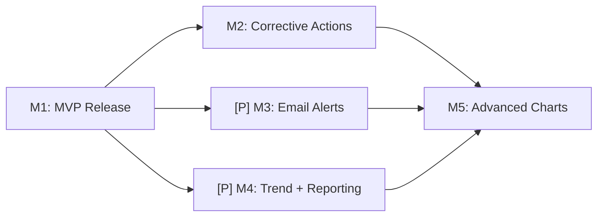

# Tasks: Westgard QC Rules Dashboard (OGC-41)

**Input**: [spec.md](spec.md), [plan.md](plan.md) **Jira**:
[OGC-41](https://uwdigi.atlassian.net/browse/OGC-41) **Organization**: By
milestone (Constitution Principle IX) **Tests**: MANDATORY (Constitution
Principle V)

## Format: `[ID] [P?] [M#] Description`

- **[P]**: Can run in parallel (different files/repos, no dependencies)
- **[M#]**: Milestone this task belongs to
- Include exact file paths and linked context in descriptions

---

## M1: MVP Release (current PR #3390 + Bridge #33)

**State**: 95% implemented. All backend services, frontend components, bridge
rule engine, and 327 tests exist. Remaining: test gaps + flow validation.

**Branch**: `feat/qc_westgard_rules` (stacked on
`fix/madagascar-accession-results-file-e2e`)

### M1.1 — End-to-end flow validation

**Goal**: Prove the full pipeline works before declaring MVP ready. **Context**:
Harness is running locally with 10 seeded analyzers. QC rules are populated from
profiles. Need to exercise: lot creation → QC result ingestion → z-score →
Westgard evaluation → violation → alert → dashboard.

- [ ] T001 [M1] Create a control lot via UI at `/analyzers/qc/control-lots/new`
      for HIV Viral Load (LOINC 20447-9) on QuantStudio 5 using Manufacturer
      Fixed method (mean=1000, SD=50). Verify lot appears in list with ACTIVE
      status. **Endpoint**: POST `/rest/qc/controlLot`

- [ ] T002 [M1] Generate a mock QC file for QuantStudio 5 containing a control
      row (specimen ID `CNEG001`, Target Name `VIH-1`, Task `STANDARD`, Quantity
      Mean `1180`). Use the mock server's HTTP API or drop a crafted Excel file
      into
      `projects/analyzer-harness/volume/analyzer-imports/quantstudio-5/incoming/`.
      **Context**: z-score = (1180 - 1000) / 50 = 3.6, which should trigger 1-3s
      REJECTION rule.

- [ ] T003 [M1] Verify end-to-end pipeline after file drop:

  1. Bridge logs show QC identification (rule match on CNEG prefix or STANDARD
     field) and FHIR bundle with `meta.tag code="QC"`
  2. OE logs show `QCResultProcessingService` creating a QCResult with z-score
     ~3.6
  3. OE logs show `QCResultCreatedEventListener` firing async evaluation
  4. DB query: `SELECT * FROM clinlims.qc_result WHERE control_lot_id = ?`
     returns the result with `result_status = 'REJECTED'`
  5. DB query: `SELECT * FROM clinlims.qc_rule_violation WHERE ...` returns a
     1-3s violation
  6. DB query: `SELECT * FROM clinlims.qc_alert WHERE ...` returns an alert

- [ ] T004 [M1] Verify dashboard reflects the violation:
  1. Navigate to `/analyzers/qc/db` — QuantStudio 5 should show RED status
  2. Click the instrument card — detail page shows the violation
  3. Navigate to `/analyzers/qc/charts/{lotId}` — Levey-Jennings chart shows the
     violated point highlighted
  4. Navigate to AlertsTab — violation alert visible, acknowledge it

### M1.2 — REST controller tests

**Goal**: Verify Spring wiring for all QC REST endpoints. 4 controllers, 0 tests
currently. **Pattern**: Follow `BaseWebContextSensitiveTest` + MockMvc pattern
from [Testing Roadmap](.specify/guides/testing-roadmap.md#backend-testing).
**Test data**: Use existing QC test builders (QCControlLotBuilder,
QCResultBuilder, etc.) from `src/test/java/org/openelisglobal/qc/`.

- [ ] T005 [P] [M1] Write controller tests for `QCRestController` in
      `src/test/java/org/openelisglobal/qc/controller/QCRestControllerTest.java`.
      Test endpoints:

  - GET `/rest/qc/control-lots` → 200 + list response
  - GET `/rest/qc/controlLot/{id}` → 200 + lot detail
  - POST `/rest/qc/controlLot` → 201 + created lot
  - GET `/rest/qc/dashboard/summary` → 200 + summary shape (totalInstruments,
    inControl, warning, outOfControl)
  - GET `/rest/qc/dashboard/instruments` → 200 + array
  - GET `/rest/qc/ruleConfig/summaries` → 200 + array **Reference**:
    [QCRestController.java](../../src/main/java/org/openelisglobal/qc/controller/QCRestController.java)

- [ ] T006 [P] [M1] Write controller tests for `QCChartDataRestController` in
      `src/test/java/org/openelisglobal/qc/controller/QCChartDataRestControllerTest.java`.
      Test endpoints:

  - GET `/rest/qc/charts/{controlLotId}` → 200 + chart data with points array
  - GET `/rest/qc/charts/{controlLotId}/statistics` → 200 + mean/SD/reference
    lines **Reference**:
    [QCChartDataRestController.java](../../src/main/java/org/openelisglobal/qc/controller/QCChartDataRestController.java)

- [ ] T007 [P] [M1] Write controller tests for `QCViolationRestController` in
      `src/test/java/org/openelisglobal/qc/controller/QCViolationRestControllerTest.java`.
      Test endpoints:
  - GET `/rest/qc/violations` → 200 + array
  - GET `/rest/qc/violations?status=UNRESOLVED` → filtered result
  - POST `/rest/qc/violations/{id}/acknowledge` → 200 + violation resolved
    **Reference**:
    [QCViolationRestController.java](../../src/main/java/org/openelisglobal/qc/controller/QCViolationRestController.java)

### M1.3 — Playwright QC smoke test

**Goal**: 1 E2E test proving QC dashboard routing + API + UI in CI. **Pattern**:
Follow
[Playwright best practices](.specify/guides/playwright-best-practices.md). Use
`/plan-record-playwright` for planning, `/write-playwright-test` for authoring.
Register in `harness-foundational` project.

- [ ] T008 [M1] Plan the Playwright QC smoke test via `/plan-record-playwright`.
      Test outline:

  1. Auth setup (reuse existing `auth.setup.ts`)
  2. Navigate to `/analyzers/qc/db`
  3. Assert: `[data-testid="qc-summary-tiles"]` visible
  4. Assert: at least one `[data-testid^="instrument-card-"]` visible
  5. Click first instrument card
  6. Assert: URL matches `/analyzers/qc/instruments/`
  7. Assert: breadcrumb visible
  8. Navigate to `/analyzers/qc/control-lots`
  9. Assert: page renders (heading visible) **Important**: Do NOT use
     `response.ok()` as pass/fail. Assert on visible UI state. Do NOT use
     `{ force: true }` on Carbon inputs.

- [ ] T009 [M1] Author the Playwright test via `/write-playwright-test` in
      `frontend/src/tests/e2e/harness-foundational/qc-dashboard-smoke.spec.ts`.
      Register in the harness-foundational Playwright project config.

- [ ] T010 [M1] Run `/audit-playwright` on the new test. Fix any anti-patterns
      flagged. Run `/debug-playwright` if the test fails on first execution.

### M1.4 — Cleanup + CI green

- [ ] T011 [M1] Remove unused `PropTypes` import from
      `frontend/src/components/analyzers/QcRules/QcRuleBuilderModal.jsx`

- [ ] T012 [M1] Delete the stale `003-westgard-qc` remote branch:
      `git push origin --delete 003-westgard-qc`

- [ ] T013 [M1] Verify CI fully green on PR #3390:
      `gh pr checks 3390 --repo DIGI-UW/OpenELIS-Global-2`. All checkpoints must
      pass: Build+Test, Static, Frontend, Shared Build, E2E, Translation,
      Duplicate key check.

- [ ] T014 [M1] Remove temporary CI trigger
      (`fix/madagascar-accession-results-file-e2e` from e2e-playwright.yml
      `pull_request.branches`) before merging to develop. **File**:
      `.github/workflows/e2e-playwright.yml` line 8

**M1 Checkpoint**: Full pipeline validated locally, controller tests pass in CI,
Playwright smoke test green, PR #3390 CI fully green. Ready for test-server
deploy and eventual merge to develop.

---

## M2: Corrective Actions (post-M1 merge)

**Design ref**:
[FR7 — westgard-rules.md](https://github.com/DIGI-UW/openelis-work/blob/main/designs/quality/westgard-rules.md)
**Branch**: `feat/OGC-41-westgard-qc-m2-corrective-actions` → `develop`
**Depends on**: M1 merged

- [ ] T015 [M2] Create branch `feat/OGC-41-westgard-qc-m2-corrective-actions`
      from `develop` (after M1 merged)

- [ ] T016 [M2] Write Liquibase changeset for `qc_corrective_action` table in
      `src/main/resources/liquibase/qc/009-create-corrective-action.xml`.
      Columns: id, violation_id (FK), action_type (enum: RECALIBRATION,
      MAINTENANCE, REPEAT_CONTROL, REAGENT_CHANGE, OTHER), description,
      assigned_to (FK to system_user), status (PENDING/IN_PROGRESS/COMPLETED),
      resolution_notes, created_by, created_date, completed_date. Add FK from
      `qc_rule_violation.corrective_action_id` → this table.

- [ ] T017 [P] [M2] Write ORM validation test for QCCorrectiveAction entity in
      `src/test/java/org/openelisglobal/qc/QCHibernateMappingValidationTest.java`

- [ ] T018 [M2] Create `QCCorrectiveAction` valueholder in
      `src/main/java/org/openelisglobal/qc/valueholder/QCCorrectiveAction.java`
      with JPA annotations per Constitution Principle IV.

- [ ] T019 [P] [M2] Write unit tests for `QCCorrectiveActionService` in
      `src/test/java/org/openelisglobal/qc/service/QCCorrectiveActionServiceTest.java`.
      Cover: create action, assign user, complete action with notes,
      auto-resolve violation on completion, prevent violation closure without
      action for REJECTION severity.

- [ ] T020 [M2] Implement DAO + Service (5-layer) for corrective actions:

  - `src/main/java/org/openelisglobal/qc/dao/QCCorrectiveActionDAO.java`
  - `src/main/java/org/openelisglobal/qc/dao/QCCorrectiveActionDAOImpl.java`
  - `src/main/java/org/openelisglobal/qc/service/QCCorrectiveActionService.java`
  - `src/main/java/org/openelisglobal/qc/service/QCCorrectiveActionServiceImpl.java`

- [ ] T021 [P] [M2] Write controller tests for corrective action endpoints in
      `src/test/java/org/openelisglobal/qc/controller/QCCorrectiveActionControllerTest.java`

- [ ] T022 [M2] Add REST endpoints to existing `QCRestController` or new
      controller:

  - POST `/rest/qc/violations/{id}/corrective-action` → create action
  - PUT `/rest/qc/corrective-actions/{id}` → update status/notes
  - GET `/rest/qc/corrective-actions?status=PENDING` → list active actions

- [ ] T023 [M2] Add corrective action form to the AlertsTab or violation detail
      page (inline, NOT modal per Constitution Principle 3). Carbon form
      components: Dropdown for action type, TextInput for description, ComboBox
      for assigned user, TextArea for resolution notes. **File**: New component
      at `frontend/src/components/qc/dashboard/CorrectiveActionForm.jsx`

- [ ] T024 [M2] Write Playwright test for corrective action workflow:
      acknowledge violation → create corrective action → complete action →
      verify violation auto-resolves.

- [ ] T025 [M2] Open PR for M2, verify CI green, request review.

**M2 Checkpoint**: Corrective action CRUD works; REJECTION violations require
corrective action before resolution; actions track status and assigned user.

---

## [P] M3: Email Alerts (post-M1 merge, parallel with M2)

**Design ref**:
[FR11 — westgard-rules.md](https://github.com/DIGI-UW/openelis-work/blob/main/designs/quality/westgard-rules.md)
**Branch**: `feat/OGC-41-westgard-qc-m3-email-alerts` → `develop` **Depends
on**: M1 merged

- [ ] T026 [M3] Create branch `feat/OGC-41-westgard-qc-m3-email-alerts` from
      `develop`

- [ ] T027 [M3] Write unit tests for email delivery in `QCAlertServiceTest.java`
      — mock SMTP, verify email content includes instrument name, rule violated,
      z-score, and link to detail view.

- [ ] T028 [M3] Wire `QCAlertServiceImpl` to Spring Mail (or existing OE email
      infrastructure). Add email template with: subject line, instrument/test
      identification, rule code + severity, z-score value, and deep link to
      violation detail. **File**:
      `src/main/java/org/openelisglobal/qc/service/QCAlertServiceImpl.java`

- [ ] T029 [M3] Create `QCNotificationPreference` entity + Liquibase changeset
      for per-user notification preferences (which severities trigger email).
      **File**:
      `src/main/resources/liquibase/qc/010-notification-preferences.xml`

- [ ] T030 [P] [M3] Add notification preferences UI in a new page or section of
      admin settings. Allow users to toggle email for WARNING vs REJECTION
      severities.

- [ ] T031 [M3] Integration test: trigger a violation → verify email queued with
      correct recipient and content.

- [ ] T032 [M3] Open PR for M3, verify CI green.

**M3 Checkpoint**: Email sent on violation; users can configure severity
preferences; 15-minute batching respected for WARNING emails.

---

## [P] M4: Trend Analysis + Reporting (post-M1 merge, parallel with M2)

**Design ref**:
[FR10, FR12 — westgard-rules.md](https://github.com/DIGI-UW/openelis-work/blob/main/designs/quality/westgard-rules.md)
**Branch**: `feat/OGC-41-westgard-qc-m4-trend-reporting` → `develop` **Depends
on**: M1 merged

- [ ] T033 [M4] Create branch `feat/OGC-41-westgard-qc-m4-trend-reporting` from
      `develop`

- [ ] T034 [P] [M4] Write unit tests for `QCTrendService`:

  - Compliance percentage over time (by date range)
  - Violation frequency distribution by rule type
  - Instruments with recurring violations **File**:
    `src/test/java/org/openelisglobal/qc/service/QCTrendServiceTest.java`

- [ ] T035 [M4] Implement `QCTrendService` + DAO queries:

  - `getComplianceTrend(dateRange, instrumentId?, testId?)` → time series
  - `getViolationFrequency(dateRange)` → rule_code → count map
  - `getRecurringViolationInstruments(dateRange, threshold)` → list **File**:
    `src/main/java/org/openelisglobal/qc/service/QCTrendServiceImpl.java`

- [ ] T036 [M4] Add REST endpoints for trend data:

  - GET `/rest/qc/trends/compliance?from=&to=&instrumentId=` → time series
  - GET `/rest/qc/trends/violation-frequency?from=&to=` → distribution **File**:
    Add to `QCRestController.java` or new `QCTrendRestController.java`

- [ ] T037 [P] [M4] Implement trend graph components using Carbon Charts (line
      chart for compliance trend, bar chart for violation frequency). **File**:
      `frontend/src/components/qc/trends/ComplianceTrendChart.jsx` **File**:
      `frontend/src/components/qc/trends/ViolationFrequencyChart.jsx`

- [ ] T038 [M4] Add violation history page with sortable, filterable, paginated
      table. Filters: date range, instrument, test, rule type, severity,
      resolution status. **File**:
      `frontend/src/components/qc/violations/ViolationHistoryPage.jsx`
      **Route**: `/analyzers/qc/violation-history`

- [ ] T039 [P] [M4] Implement PDF + CSV export for violation history and trend
      reports. Use backend streaming for CSV; PDF via iText or equivalent.
      **Endpoints**: GET `/rest/qc/reports/violations.csv`, GET
      `/rest/qc/reports/violations.pdf`

- [ ] T040 [M4] Playwright test for trend page: navigate to trend view, verify
      charts render, verify export buttons produce downloadable files.

- [ ] T041 [M4] Open PR for M4, verify CI green.

**M4 Checkpoint**: Trend graphs render with real data; violation history is
filterable; PDF and CSV exports work.

---

## M5: Advanced Charts + Manual Re-evaluation (after M2, M3, M4)

**Design ref**:
[FR5, FR9.6-9.8 — westgard-rules.md](https://github.com/DIGI-UW/openelis-work/blob/main/designs/quality/westgard-rules.md)
**Branch**: `feat/OGC-41-westgard-qc-m5-advanced-charts` → `develop` **Depends
on**: M2, M3, M4 merged

- [ ] T042 [M5] Create branch `feat/OGC-41-westgard-qc-m5-advanced-charts` from
      `develop`

- [ ] T043 [P] [M5] Write unit tests for manual re-evaluation service:

  - Evaluate a date range without persisting violations (preview mode)
  - Evaluate specific rule subsets
  - Re-evaluate after statistics recalculation **File**:
    `src/test/java/org/openelisglobal/qc/service/QCManualEvaluationServiceTest.java`

- [ ] T044 [M5] Implement manual re-evaluation service + endpoint:

  - POST `/rest/qc/evaluate-range` with `{ lotId, from, to, preview, rules[] }`
  - Returns evaluation results without persisting when `preview=true` **File**:
    `src/main/java/org/openelisglobal/qc/service/QCManualEvaluationServiceImpl.java`

- [ ] T045 [M5] Enable Carbon Charts zoom/pan on Levey-Jennings chart. Carbon
      Charts supports this via `zoomBar` option — wire it up in
      `LeveyJenningsChart.jsx`.

- [ ] T046 [P] [M5] Add multi-level subplot support (Low/Normal/High tabs or
      stacked chart rows) in `ControlChartDetail.jsx`. Each control level gets
      its own chart panel.

- [ ] T047 [P] [M5] Add chart export to PDF/PNG via html2canvas or Carbon Charts
      export API. Add export button to chart toolbar.

- [ ] T048 [M5] Add manual evaluation UI: date range picker + rule checkboxes

  - "Evaluate" button + preview toggle. Display results in a table below the
    chart without navigating away. **File**:
    `frontend/src/components/qc/charts/ManualEvaluationPanel.jsx`

- [ ] T049 [M5] Playwright test for chart interactions and manual evaluation.

- [ ] T050 [M5] Open PR for M5, verify CI green.

**M5 Checkpoint**: Charts support zoom/pan, multi-level display, and export.
Manual re-evaluation works in preview mode. Full OGC-41 design spec delivered.

---

## Dependencies & Execution Order

### Milestone Dependencies

### Within M1 (current session)

- T001-T004 (flow validation): sequential, local harness required
- T005-T007 (controller tests): parallel with each other, need Docker for
  integration context
- T008-T010 (Playwright): sequential (plan → write → audit)
- T011-T014 (cleanup): parallel, no dependencies

### Parallel Opportunities

- **M2 + M3 + M4**: all independent after M1 merges. Can be developed by
  different people simultaneously.
- **Within M1**: controller tests (T005-T007) can run in parallel with
  Playwright work (T008-T010).
- **Within M4**: trend service (T035) and frontend charts (T037) can be
  developed in parallel; export (T039) is independent.

---

## Implementation Strategy

### MVP (M1 only — current session)

1. Validate end-to-end flow locally (T001-T004)
2. Write controller tests (T005-T007) — parallel
3. Write Playwright smoke test (T008-T010) — parallel with controller tests
4. Cleanup + CI green (T011-T014)
5. **STOP and VALIDATE**: PR #3390 CI fully green, local flow proven

### Post-MVP Delivery

1. Merge M1 to develop via #3372 → develop, then #3390 → develop
2. M2 (corrective actions) — highest priority post-MVP
3. M3 (email) + M4 (trends) — parallel, assigned to available developers
4. M5 (polish) — after M2-M4 land

---

## Summary

| Milestone                   | Tasks                | New tests                             | Status               |
| --------------------------- | -------------------- | ------------------------------------- | -------------------- |
| **M1 MVP**                  | T001-T014 (14 tasks) | ~10 controller tests + 1 Playwright   | 95% done, completing |
| **M2 Corrective Actions**   | T015-T025 (11 tasks) | ~8 unit + 1 controller + 1 Playwright | Not started          |
| **[P] M3 Email Alerts**     | T026-T032 (7 tasks)  | ~4 unit + 1 integration               | Not started          |
| **[P] M4 Trends + Reports** | T033-T041 (9 tasks)  | ~6 unit + 1 Playwright                | Not started          |
| **M5 Advanced Charts**      | T042-T050 (9 tasks)  | ~4 unit + 1 Playwright                | Not started          |
| **Total**                   | **50 tasks**         | **~37 new tests**                     |                      |
