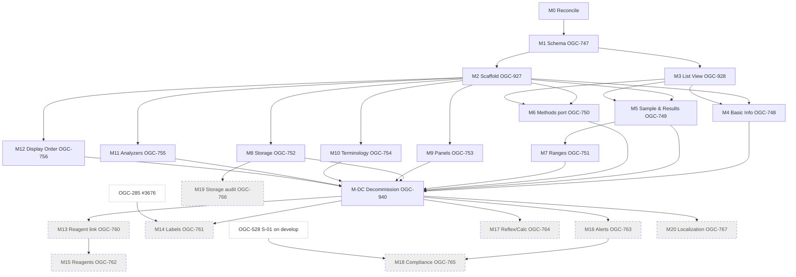

# Implementation Plan: Unified Test Catalog Management Editor (Test Catalog v2.5)

**Branch**: `spec/ogc-949-unified-test-catalog` | **Date**: 2026-06-10 | **Spec**: [spec.md](./spec.md)
**Input**: Feature specification from `specs/OGC-949-unified-test-catalog/spec.md`
**Umbrella**: [OGC-949](https://uwdigi.atlassian.net/browse/OGC-949) · **Canonical FRS** pinned at openelis-work `@f04cce54` (see spec header) · **Delivery plan**: [Confluence 1313865740](https://uwdigi.atlassian.net/wiki/spaces/oeg/pages/1313865740)

## Summary

Deliver the OGC-949 unified Test Catalog editor as a milestone program on
`develop`. v1 (M0–M12 + M-DC) replaces the legacy Test / Test Section / Panel /
Method admin pages with one SideNav-routed editor; v2 (M13–M20) is carried as
named-but-not-elaborated scope. Each milestone maps to one Jira epic; the Jira
child stories carry detailed acceptance criteria, so this plan and tasks.md
**leverage the existing Jira structure with inline links** rather than restating
it. The two heaviest pieces (M5 Sample & Results, M7 Ranges) are sequenced as a
pair via the `component_id` dependency; the remaining sections fan out in
parallel once the M1 schema foundation and M2/M3 editor shell land.

**This plan is the canonical roadmap** (milestone tables + the dependency graph
below). The Confluence delivery plan is the stakeholder-facing view.

## Technical Context

**Language/Version**: Java 21 LTS (Temurin); JavaScript / React 17
**Primary Dependencies**: Spring Framework 6.2 (Traditional MVC, **not** Spring Boot), Jakarta EE 9 (`jakarta.*`), Hibernate/JPA, `@carbon/react`, React Intl
**Storage**: PostgreSQL 14+ via JPA/Hibernate; schema changes via Liquibase 4.8 (`src/main/resources/liquibase/3.5.x.x/`, latest changeset `039-test-method-links.xml`)
**Testing**: JUnit 4 + Mockito + `BaseWebContextSensitiveTest` (backend); Jest + React Testing Library (frontend); **Playwright** E2E (`npm run pw:test`; Cypress deprecated, do not add new Cypress specs)
**Target Platform**: Containerized web app (Tomcat WAR + nginx frontend)
**Project Type**: Web (backend `src/main/java/org/openelisglobal/**` + frontend `frontend/src/components/admin/**`)
**Performance Goals**: Editor section load/save round-trip perceived as instant; Test List View paginates large catalogs without degradation
**Constraints**: No feature flag (direct replacement); lossless catalog migration; deprecated legacy columns retained one release cycle; `hasRole('ADMIN')` gate (no dependency on unmerged OGC-384 RBAC)
**Scale/Scope**: 14 editor sections; 20 Jira epics / 72 stories (49 v1 elaborated here); single-tenant per deployment

**Reusable infrastructure** (verified — see [research.md](./research.md)):
`ResultLimit` (`org.openelisglobal.resultlimits`) already carries age/sex/critical
ranges; analyzer test-code mappings (`org.openelisglobal.analyzer`) feed the
read-only Analyzers section; `org.openelisglobal.testreflex` +
`org.openelisglobal.testcalculated` feed v2 Reflex & Calc; the v2 Labels section
consumes OGC-285's `test_label_preset_link`; `ViewTestCatalog.jsx` +
`TestCatalogRestController` are the read-only ancestor; `DisplayListController`
is the dropdown-list pattern; the Methods section (M6) is **ported** from
`demo-silnas` PR #3706, not reimplemented.

## Constitution Check

_GATE: Must pass before Phase 0 research. Re-check after Phase 1 design._

- [x] **Configuration-Driven**: Domain (CLINICAL/ENV/VECTOR), AMR/WHONET
      (Madagascar), and SILNAS environmental/vector behavior are data/config on
      the test record — no country-specific code branches.
- [x] **Carbon Design System**: All editor UI uses `@carbon/react` (DataTable,
      ComboBox, FilterableMultiSelect, Accordion, Modal, Pagination, SideNav,
      Tag, InlineNotification). Mockup CSS is visual approximation only.
- [x] **FHIR/IHE Compliance**: Result-component mapping is locked to one
      `Observation` per component (FR-D02); external-facing entities carry
      `fhir_uuid` where exposed.
- [x] **Layered Architecture**: 5-layer (Valueholder→DAO→Service→Controller→Form);
      new valueholders use JPA/Hibernate annotations; `@Transactional` in
      services only.
- [x] **Test Coverage**: Per-milestone TDD — unit + ORM validation + integration + Playwright E2E. The M1 migration carries an explicit losslessness test.
- [x] **Schema Management**: All DDL via Liquibase changesets under `3.5.x.x/`.
- [x] **Internationalization**: React Intl; new keys in `en.json` only (Transifex
      owns non-English); v2.5 §0.8 i18n staging governs wave placement; FR-D01
      removes the 5 stale `editor.sidenav.*` keys.
- [x] **Security & Compliance**: `hasRole('ADMIN')` gate (UI hide + API 403);
      audit trail on `test_activation_acknowledgment` (v1) and
      `test_sample_handling_history` (v2); input validation on all forms.

**No complexity violations.** The legacy decommission (M-DC) satisfies Principle
X (no parallel legacy surfaces); it is deferred to the final v1 gate so the new
editor is proven before deletion (a sequencing choice, not a parallel-surface
violation — legacy and new never ship to a release simultaneously).

## Milestone Plan

_GATE: Features >3 days MUST define milestones per Constitution Principle IX.
Each milestone = 1 PR (M0 and M1 may split into several small PRs). `[P]` =
parallelizable. Milestone branches: `feat/ogc-949-m{N}-{desc}` → `develop`
(shortened house form; the constitution's full form is unwieldy at 21
milestones — recorded here as the legend)._

### Table 1 — v1 Wave (elaborated)

| ID          | Branch suffix     | Scope (Jira epic)                                                                                                                                  | User stories | Verification                                                                               | Depends On            |
| ----------- | ----------------- | -------------------------------------------------------------------------------------------------------------------------------------------------- | ------------ | ------------------------------------------------------------------------------------------ | --------------------- |
| **M0**      | m0-reconcile      | Reconciliation: port Methods #3706 → develop; record OGC-285↔OGC-761 boundary; sequence #3546 vs OGC-927; confirm `hasRole('ADMIN')` gate approach | —            | Ported Methods code green on develop; decision records in research.md                      | —                     |
| **M1**      | m1-schema         | Schema migrations + backend foundation ([OGC-747](https://uwdigi.atlassian.net/browse/OGC-747), stories 936–939)                                   | US1          | Liquibase up/down clean; **losslessness test** (counts match); ORM validation tests        | M0                    |
| **M2**      | m2-scaffold       | Editor scaffold + permissions + states ([OGC-927](https://uwdigi.atlassian.net/browse/OGC-927))                                                    | US2          | Shell renders; 403 for non-admin; Jest + Playwright smoke                                  | M1                    |
| **[P] M3**  | m3-listview       | Test List View + filters + pagination ([OGC-928](https://uwdigi.atlassian.net/browse/OGC-928))                                                     | US3          | URL state round-trips; Coverage tag renders; Jest + Playwright                             | M1                    |
| **[P] M4**  | m4-basicinfo      | Basic Info ([OGC-748](https://uwdigi.atlassian.net/browse/OGC-748))                                                                                | US4          | Domain/AMR persist; activation gate stub; integration + Jest                               | M2, M3                |
| **M5**      | m5-sample-results | Sample & Results / multi-component ([OGC-749](https://uwdigi.atlassian.net/browse/OGC-749))                                                        | US5          | 2-component test round-trips; inline-unit writes master list; integration + Jest           | M2, M3                |
| **[P] M6**  | m6-methods-port   | Methods section ([OGC-750](https://uwdigi.atlassian.net/browse/OGC-750)) — port-verification of #3706                                              | US6          | Ported Methods green on develop; integration + Jest                                        | M2, M3 (code from M0) |
| **M7**      | m7-ranges         | Ranges + Coverage Validation + Activation Ack ([OGC-751](https://uwdigi.atlassian.net/browse/OGC-751))                                             | US7          | Neonatal bilirubin coverage test; activate blocked w/o ack → audit row; integration + Jest | M5                    |
| **[P] M8**  | m8-storage        | Sample Storage ([OGC-752](https://uwdigi.atlassian.net/browse/OGC-752))                                                                            | US8          | Storage persists; in-progress-order lock behavior; integration + Jest                      | M2, M3                |
| **[P] M9**  | m9-panels         | Panels ([OGC-753](https://uwdigi.atlassian.net/browse/OGC-753))                                                                                    | US9          | Typeahead add + reposition persist; integration + Jest                                     | M2, M3                |
| **[P] M10** | m10-terminology   | Terminology Mappings ([OGC-754](https://uwdigi.atlassian.net/browse/OGC-754))                                                                      | US10         | Mapping add persists; integration + Jest                                                   | M2, M3                |
| **[P] M11** | m11-analyzers     | Analyzers read-only ([OGC-755](https://uwdigi.atlassian.net/browse/OGC-755))                                                                       | US11         | Read-only table + empty state; Jest                                                        | M2, M3                |
| **[P] M12** | m12-display-order | Display Order ([OGC-756](https://uwdigi.atlassian.net/browse/OGC-756))                                                                             | US12         | Reorder auto-saves + persists; integration + Jest                                          | M2, M3                |
| **M-DC**    | mdc-decommission  | Legacy decommission + release readiness ([OGC-940](https://uwdigi.atlassian.net/browse/OGC-940) under OGC-747)                                     | —            | Legacy controllers/JSX removed (grep gate); routes redirect; full regression + Playwright  | M4–M12                |

### Table 2 — v2 Wave (named — not elaborated)

Carried for dependency reasoning only. Verification column intentionally deferred;
each row is elaborated via a `/speckit.plan` revision + `/speckit.tasks` re-run at
v2 kickoff. No tasks beyond a single stub per milestone exist for these yet.

| ID      | Branch suffix     | Scope (Jira epic)                                                                        | User stories  | Verification                       | Depends On                             |
| ------- | ----------------- | ---------------------------------------------------------------------------------------- | ------------- | ---------------------------------- | -------------------------------------- |
| **M13** | m13-reagent-link  | Test-Reagent linkage backend ([OGC-760](https://uwdigi.atlassian.net/browse/OGC-760))    | see Jira epic | Deferred — elaborate at v2 kickoff | M-DC                                   |
| **M14** | m14-labels        | Labels section, 4 fixed presets ([OGC-761](https://uwdigi.atlassian.net/browse/OGC-761)) | see Jira epic | Deferred                           | M-DC, OGC-285 (#3676)                  |
| **M15** | m15-reagents      | Reagents section ([OGC-762](https://uwdigi.atlassian.net/browse/OGC-762))                | see Jira epic | Deferred                           | M13                                    |
| **M16** | m16-alerts        | Alerts section ([OGC-763](https://uwdigi.atlassian.net/browse/OGC-763))                  | see Jira epic | Deferred                           | M-DC, Test Notification system         |
| **M17** | m17-reflex-calc   | Reflex & Calc read-only ([OGC-764](https://uwdigi.atlassian.net/browse/OGC-764))         | see Jira epic | Deferred                           | M-DC                                   |
| **M18** | m18-compliance    | Compliance section, ENV/VECTOR ([OGC-765](https://uwdigi.atlassian.net/browse/OGC-765))  | see Jira epic | Deferred                           | **OGC-528 on develop** (PR #3500), M16 |
| **M19** | m19-storage-audit | Sample Storage audit history ([OGC-766](https://uwdigi.atlassian.net/browse/OGC-766))    | see Jira epic | Deferred                           | M8                                     |
| **M20** | m20-localization  | Localization Hardening ([OGC-767](https://uwdigi.atlassian.net/browse/OGC-767))          | see Jira epic | Deferred                           | M-DC                                   |

### Milestone Dependency Graph



### PR Strategy

- **Spec PR**: `spec/ogc-949-unified-test-catalog` → `develop` (this docs-only set).
- **Milestone PRs**: `feat/ogc-949-m{N}-{desc}` → `develop`, one per milestone.
- **Discipline** (per OGC-285 precedent): open **draft early**; PR body carries
  the milestone's Jira-story AC checklist; keep PRs **≤30 files / ≤2,500 LOC**
  (M0 and M1 split into several small PRs); no self-merge / no auto-merge —
  terminal state is "green CI + ready for review"; apply the Inversion Test to
  new tests.
- **Branch lane**: all milestone PRs target `develop`. `demo-silnas` continues to
  consume develop via merges; OGC-949 never targets demo-silnas. Only
  test-catalog-scoped, develop-clean commits are ported back (see research.md
  port policy).

## Project Structure

### Documentation (this feature)

```text
specs/OGC-949-unified-test-catalog/
├── spec.md              # program spec (integrator)
├── plan.md              # this file — canonical roadmap
├── research.md          # audit: demo-silnas, OGC-285/3546 boundaries, permission, Jira validation
├── data-model.md        # all v1 schema objects (= M1) + v2 stubs
├── quickstart.md        # M0 + M1 walkthroughs (extended per milestone)
├── contracts/
│   └── openapi.yaml     # foundation envelope (list/load/save/clone/permission)
├── checklists/
│   └── requirements.md  # spec quality checklist
└── tasks.md             # /speckit.tasks output (three-tier elaboration)
```

### Source Code (repository root)

```text
src/main/java/org/openelisglobal/
├── test/                         # Test, TestCatalog, TestSection valueholders (existing)
├── testconfiguration/            # legacy admin controllers + REST (M-DC removes/redirects)
├── testmethod/                   # Methods (ported from #3706 in M0/M6)
├── resultlimits/                 # ResultLimit — reused by Ranges (M7)
├── analyzer/                     # field mappings — read-only Analyzers (M11)
├── unitofmeasure/                # extended to master list (M1)
└── <new test-catalog editor REST controllers + services per section>

src/main/resources/liquibase/3.5.x.x/   # new changesets 040+ (M1 schema)

frontend/src/components/admin/
├── testManagement/ViewTestCatalog.jsx   # read-only ancestor → editor
├── testManagementConfigMenu/            # legacy React admin (M-DC removes)
└── <new unified editor: shell, list view, per-section components>
```

**Structure Decision**: Web (backend + frontend). The editor lives under
`frontend/src/components/admin/` mounting per-section React components into a
SideNav shell; backend adds per-section REST controllers + services following the
5-layer pattern, with the M1 Liquibase changesets as the foundation.

## Complexity Tracking

No Constitution violations requiring justification.

## Testing Strategy

**Reference**: [OpenELIS Testing Roadmap](/.specify/guides/testing-roadmap.md). **Note:** the plan template's E2E references predate the Playwright migration — this feature uses **Playwright** (`npm run pw:test`), not Cypress.

### Coverage Goals

- **Backend**: >80% (JaCoCo); **Frontend**: >70% (Jest); **Critical paths** (the
  M1 migration, the M7 activation gate, the FR-004 permission gate): 100%.

### Test Types (per milestone)

- [x] **Unit (JUnit 4 + Mockito)** — section services; `@RunWith(MockitoJUnitRunner.class)`, `@Mock` not `@MockBean`.
- [x] **DAO / ORM validation** — new valueholders (component, sample-handling, junctions); ORM validation runs <5s, no DB.
- [x] **Controller / integration (`BaseWebContextSensitiveTest` + MockMvc)** — per-section REST + the permission gate (403 path).
- [x] **Migration losslessness (M1)** — pre/post row-count assertions across `test`, `test_range`, `test_interpretation`, `test_select_list_option`; component_id backfill correctness.
- [x] **Frontend unit (Jest + RTL)** — editor shell, list-view URL state, section components, coverage-validation gap logic.
- [x] **E2E (Playwright)** — open editor → configure a complete orderable test end-to-end (SC-001); non-admin 403 (SC-005); neonatal-bilirubin activation-ack flow (SC-006). Use `npm run pw:test`, label-click on Carbon inputs, `waitForResponse` for sync + assert on visible UI (never `response.ok()`).

### Test Data Management

- **Backend**: builders/factories; `BaseWebContextSensitiveTest` rollback; the unified fixture loader `src/test/resources/load-test-fixtures.sh` for baseline catalog data.
- **Frontend (Playwright)**: API-based setup; `cy`-style stubbing avoided — spy-first on the mutation under test; never stub the editor save endpoint in E2E.

### Checkpoint Validations

- [x] **After M1 (Entities/Migration)**: ORM validation + losslessness tests pass before any section starts.
- [x] **After each section milestone**: that section's unit + integration + Jest pass; Playwright smoke green.
- [x] **After M-DC**: full regression + grep gate (no legacy controller/JSX remains) + Playwright suite green before v1 release.
