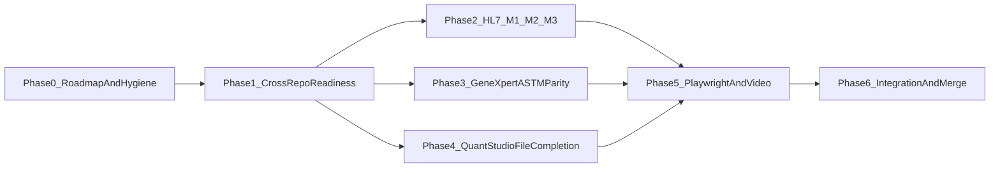

# Madagascar Analyzer Roadmap V3 (Finish Line)

> **SUPERSEDED** by
> [`madagascar-analyzer-roadmap-v4-results-first.md`](madagascar-analyzer-roadmap-v4-results-first.md)
> as of 2026-03-25.

**Status**: Superseded **Date**: 2026-03-16 **Supersedes**:

- `specs/roadmaps/madagascar-analyzer-roadmap-v2.md`
- `specs/roadmaps/parallel_analyzer_lanes_af342372.plan.md` **Companion
  Inputs**:
- `specs/roadmaps/madagascar-atlassian-alignment.md`
- `specs/013-hjra-hl7-stream-alignment/`
- `specs/012-generic-astm-plugin-profiles/`

## Purpose

Define the shortest credible path to finish and merge analyzer work into
`develop` with explicit completion gates for:

1. HL7 adaptor completion (`OGC-325`, `OGC-327`, `OGC-326`)
2. GeneXpert ASTM parity confidence against established ASTM behavior
3. QuantStudio file-based import completion and validation
4. Playwright-backed UI evidence
5. Feature-video style deliverables for handoff/demo
6. Cross-repo merge order and PR cleanup

## Finish-Line Outcomes

This roadmap is complete only when all outcomes below are true:

- **HL7**: BC-5380, BS-200, and BS-300 pass strict bridge-mediated proof and
  required backend tests.
- **ASTM parity**: GeneXpert ASTM pathways are validated through checklist
  evidence and no regressions are introduced by HL7/file integration.
- **File (QuantStudio)**: QuantStudio file import behavior is validated in
  plugin tests, backend path, and UI/admin flows.
- **Evidence**: Playwright evidence exists for analyzer UI flows tied to
  HL7/file completion.
- **Video**: Feature-video package is produced for HL7, ASTM parity, and
  QuantStudio flows.
- **Merge**: Subrepo dependencies are merged first, submodule pointers are
  updated, one clean integration PR lands to `develop`, and superseded 013 PRs
  are closed.

## Current State Snapshot (Signals)

### Main Repo PRs (high-impact subset)

- `#3031` `spec/013-hjra-hl7-stream-alignment` — open, merge-conflicted
- `#3033` `feat/013-ogc-325-hl7-listener-foundation` — open, merge-conflicted
- `#3034` `feat/013-ogc-327-bc5380-hl7-m2-profile-match` — open,
  merge-conflicted
- `#3035` `feat/013-ogc-326-bs-series-hl7` — open, merge-conflicted
- `#3032` ASTM M3 lane PR — open, merge-conflicted

### Subrepo PRs

- **Bridge (`openelis-analyzer-bridge`)**:
  - `#13` bridge authentication (clean)
  - `#20` draft sub-PR (clean)
  - No explicit open PR dedicated to 013 HL7 listener readiness is visible.
- **Plugins (`openelisglobal-plugins`)**:
  - `#63` GenericASTM responder bidirectional work (clean)
- **Mock (`analyzer-mock-server`)**:
  - `#18` strict 013 HL7 bridge-ready mock support (dirty)

### Roadmap/Spec Drift To Correct

- V2 roadmap assumes missing 013 artifacts, but 013 coordination package now
  exists.
- Current 013 implementation PRs overlap and are not cleanly stacked.
- Feature-video output is requested but not yet standardized in analyzer
  roadmaps.
- Playwright exists for analyzer UI validation, but current config defaults to
  `video: "off"`.

## Critical Dependencies

### Functional Dependencies

- **HL7 M2/M3 depend on M1 foundation**:
  - `specs/013-hjra-hl7-stream-alignment/contracts/hl7-readiness-gates.md`
- **BS-series confidence depends on BC-5380 proof first**:
  - `specs/013-hjra-hl7-stream-alignment/milestone-outlines/m2-ogc327-bc5380-tasks.md`
  - `specs/013-hjra-hl7-stream-alignment/milestone-outlines/m3-ogc326-bsseries-tasks.md`
- **ASTM parity baseline depends on 012 checklist evidence model**:
  - `specs/012-generic-astm-plugin-profiles/checklists/real-device-validation.md`
- **QuantStudio file completion depends on plugin + file-import path
  alignment**:
  - `plugins/analyzers/QuantStudio3/`
  - `plugins/analyzers/QuantStudio7Flex/`
  - `src/main/java/org/openelisglobal/analyzerimport/analyzerreaders/FileAnalyzerReader.java`
  - `src/main/java/org/openelisglobal/analyzer/service/FileImportServiceImpl.java`

### Cross-Repo Dependencies

- `analyzer-mock-server` strict 013 changes (`#18`) are required for
  reproducible HL7 proof runs.
- Bridge readiness ownership must be confirmed (merged already vs missing
  branch/PR).
- Plugin/submodule version alignment is required before final main-repo merge.

## Execution Phases

### Phase 0: Roadmap And Branch Hygiene

- Publish this roadmap as the execution source of truth.
- Freeze new feature scope additions to the 013/012/014 lanes during
  consolidation.
- Decide and communicate PR strategy:
  - Merge docs-only spec signal first (if needed for governance traceability)
  - Consolidate implementation into one integration path to `develop`

### Phase 1: Cross-Repo Readiness

- Verify bridge state for HL7 listener ownership and identify missing PR work
  (if any).
- Get `analyzer-mock-server#18` to clean/mergeable state.
- Confirm plugin dependencies (including ASTM responder behavior) and merge
  order.
- Define target submodule SHAs for final main-repo integration branch.

### Phase 2: HL7 Completion (M1 -> M2 -> M3 Checkpoints)

#### M1 Foundation Gate

- Validate listener path evidence:
  - Bridge receives framed HL7 over MLLP
  - ACK behavior demonstrated
  - Route reaches `/analyzer/hl7`
  - Representative ingestion path succeeds
- Required script:
  - `projects/analyzer-harness/scripts/test-hl7-profiles.sh`

#### M2 BC-5380 Gate

- BC-5380 path validated over proven listener route.
- No ASTM contamination of HL7 lane assumptions.
- BC-5380-specific evidence captured and reviewable.

#### M3 BS-Series Gate

- BS-200 validated.
- BS-300 early-equivalence check explicitly documented as pass/fail with impact.
- Strict 013 proof includes BC-5380, BS-200, BS-300 via bridge-mediated MLLP.

### Phase 3: GeneXpert ASTM Parity

Use ASTM lane as parity baseline for confidence and evidence quality.

- Execute/mock-validate GeneXpert ASTM push path:
  - `projects/analyzer-harness/scripts/test-genexpert-astm.sh`
- Track parity against real-device validation model:
  - `specs/012-generic-astm-plugin-profiles/checklists/real-device-validation.md`
- Confirm no HL7/file integration changes regress ASTM pathways.

### Phase 4: QuantStudio File Import Completion

Treat QuantStudio as file proving target (not a placeholder lane).

- Validate plugin tests:
  - `plugins/analyzers/QuantStudio7Flex/src/test/java/oe/plugin/analyzer/QuantStudio7FlexAnalyzerTest.java`
  - `plugins/analyzers/QuantStudio7Flex/src/test/java/oe/plugin/analyzer/QuantStudio7FlexAnalyzerImplementationTest.java`
- Validate backend file-import path behavior:
  - `FileAnalyzerReader` and `FileImportServiceImpl` expected parsing/ingestion
    flow
- Validate admin/UI path for file analyzers (config + test connection/upload
  flow) using Playwright where applicable.

### Phase 5: Playwright Evidence + Feature Video

#### Playwright Evidence

Reuse existing analyzer Playwright suite:

- `frontend/playwright/tests/analyzer-test-connection.spec.ts`
- `frontend/playwright/tests/analyzer-form.spec.ts`
- `frontend/playwright/tests/analyzer-list.spec.ts`
- `frontend/playwright/tests/analyzer-plugin-config.spec.ts`
- `frontend/playwright/tests/analyzer-simulator.spec.ts`

Run commands:

- `cd frontend && npm run pw:test`
- Focused execution for analyzer specs as needed

#### Feature Video Deliverables

Define and produce three concise demo videos (target 3-6 min each):

1. **HL7 adaptor flow**: mock -> bridge MLLP -> `/analyzer/hl7` -> result
   visibility
2. **GeneXpert ASTM parity**: core ASTM flow and parity checkpoints
3. **QuantStudio file import**: file configuration, ingest, validation/review

Implementation notes:

- Current Playwright config is `video: "off"` in
  `frontend/playwright.config.ts`.
- For demo capture, use one of:
  - dedicated temporary Playwright config with `video: "on"` for selected specs
  - headed guided walkthrough (`npm run pw:test:headed`) + external capture
- Preserve accompanying artifacts:
  - screenshots/traces for evidence
  - short markdown runbook describing exact reproduction steps

### Phase 6: Integration And Merge

- Build one clean integration branch from updated `develop`.
- Apply merged submodule pointers from bridge/plugins/mock dependencies.
- Execute final validation pack (HL7 + ASTM parity + QuantStudio + Playwright
  evidence).
- Open one integration PR to `develop`.
- Close/supersede overlapping 013 implementation PRs with explicit
  cross-reference.

## Validation Matrix (Finish Line)

| Area             | Minimum Gate                     | Evidence                                     |
| ---------------- | -------------------------------- | -------------------------------------------- |
| HL7 M1           | listener/ACK/routing/ingest      | `test-hl7-profiles.sh` + logs + review notes |
| HL7 M2           | BC-5380 proving path             | profile-backed E2E + tests + checklist       |
| HL7 M3           | BS-200 + BS-300 early validation | strict 013 run + documented BS-300 outcome   |
| ASTM parity      | GeneXpert pathway confidence     | 012 parity checklist + harness proof         |
| QuantStudio file | parser/import/admin correctness  | plugin tests + backend/UI checks             |
| Playwright       | analyzer UI regression coverage  | analyzer Playwright suite results            |
| Feature video    | stakeholder-ready walkthrough    | 3 feature videos + runbooks                  |

## Merge Decision Checklist

- [ ] Bridge/subrepo HL7 dependencies are merged or explicitly declared
      unnecessary with evidence.
- [ ] Mock-server strict HL7 dependency is merged and reflected in submodule
      pointer.
- [ ] Plugin dependencies (ASTM and file lane needs) are merged and pinned.
- [ ] HL7 gates (M1/M2/M3) are passed with recorded evidence.
- [ ] GeneXpert ASTM parity checklist reviewed and accepted.
- [ ] QuantStudio file import gates pass.
- [ ] Playwright analyzer evidence is current.
- [ ] Feature video package is complete and linked in PR description.
- [ ] Final integration PR is clean, focused, and mergeable to `develop`.

## Sequencing

## Risks And Mitigations

- **Risk**: BS-300 parity overstated without sufficient evidence.
  - **Mitigation**: Keep explicit early-validation pass/fail checkpoint and
    record consequences.
- **Risk**: Mock-server/bridge dependency drift blocks reproducibility.
  - **Mitigation**: Lock merge order and submodule SHA verification before
    integration PR.
- **Risk**: QuantStudio lane remains partial due to weak E2E framing.
  - **Mitigation**: Make QuantStudio a required finish-line gate, not optional
    follow-on.
- **Risk**: Video deliverables slip because not tied to test flow.
  - **Mitigation**: Bind video capture to post-validation phase and checklist.

## Notes

- This roadmap is intentionally finish-line oriented and does not preserve
  historical PR structure for its own sake.
- If roadmap scope changes materially, update this document first before
  changing branch/PR strategy.
