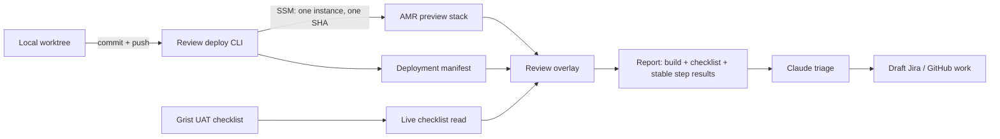

# OpenELIS Review Tooling Deployment Spike

> Status: accepted; review identity contract implemented in
> `DIGI-UW/openelis-review-tooling#2`, targeted AMR deployment in progress
> Date: 2026-07-24
> Scope: `DIGI-UW/openelis-review-tooling`, the AMR/analyzers demo stacks,
> Grist-authored UAT, and branch-based OpenELIS preview deployment

## Decision Summary

Use the existing EC2 host as a commit-addressed preview environment. Keep source
editing and focused tests in normal worktrees; deploy pushed commits to one
named review instance through a targeted SSM command.

The review tooling should:

1. deploy one OpenELIS review instance without rebuilding unrelated instances;
2. record the exact application commit and verification result;
3. expose that deployment identity to the review overlay and downloaded report;
4. preserve Grist as the checklist source of truth;
5. keep infrastructure credentials out of Grist, the widget, and web MCP;
6. add remote hot reload only if measured targeted-deploy latency is still too
   slow for the intended development loop.

The recommended first implementation is a targeted AMR deploy plus a review
target manifest. A remote browser IDE or server-side dirty worktree is outside
the first spike.

## Recon Baseline

### Intended Product

The checked-in `docs/overview.html` matches the supplied Claude artifact:

- humans and agents author one checklist in Grist;
- the overlay reads that checklist live;
- reviewers mark pass/fail/n-a and download Markdown plus JSON;
- Claude triages the report into Jira/GitHub work;
- the tooling is independent of the OpenELIS application repository.

`docs/AGENTS.md` is the authoritative operating contract for checklist
authoring and feedback triage:

- Grist is the UAT source of truth;
- agents read current rows before updating specific rows;
- the widget read surface is anonymous and read-only;
- reports are drafted into issues, not filed without an explicit request.

### Repository State

`DIGI-UW/openelis-review-tooling` is a new public standalone repository with
three commits on `main`, no issues, pull requests, tags, releases, or GitHub
Actions workflows as of 2026-07-24.

The repository contains:

- a standalone framework-free review widget;
- Grist, Dex, Redis, native MCP configuration, and a custom Grist read/MCP
  bridge;
- an nginx router that injects the overlay into AMR and analyzers;
- additive Compose overlays for the two OpenELIS instances;
- an SSM-based deployment script;
- demo-data seed scripts.

Shell and JavaScript syntax checks pass, but there is no automated test suite or
deployment validation workflow.

### Live State

The EC2 host is running:

- healthy AMR and analyzer OpenELIS stacks;
- router, Grist, Dex, Redis, and the Grist bridge;
- live checklist delivery with `X-UAT-Source: grist-live`;
- native Grist MCP OAuth metadata at `/api/mcp`.

The AMR checklist is already live in the overlay. The AMR application still
needs the current Microbiology navigation/canonical-route branch deployed
before those checklist steps can pass.

## Confirmed Gaps

| Priority | Finding | Why It Matters |
|---|---|---|
| P0 | Widget answers are keyed by section and step position (`0.0`, `0.1`) and stored only by instance. | Reordering a live checklist or deploying a different build can silently attach an old mark to a different step. |
| P0 | Reports contain no application commit, deployment id, checklist revision, or stable step id. | Feedback cannot be tied deterministically to the build and checklist that were reviewed. |
| P1 | `deploy.sh deploy` rebuilds AMR, analyzers, router, and supporting services together. | A small AMR change incurs the full 20-40 minute dual-stack path and risks disturbing unrelated review work. |
| P1 | Deployment overwrites static image tags and has no first-class rollback or deployed-SHA status. | Operators cannot prove or restore the exact reviewed build without host inspection. |
| P1 | The standalone deploy script does not start or reconcile the Grist stack, despite repository documentation presenting Grist as part of the deployment. | Fresh-host behavior is incomplete and differs from the live manually evolved host. |
| P1 | `grist/bootstrap.sh` still expects a removed `review/` directory and performs whole-table seed/generate operations. | The documented bootstrap path is stale and conflicts with row-level live authoring. |
| P1 | No automated tests cover widget state, report structure, bridge transforms, router injection, or deploy command selection. | The review evidence system itself can regress without a signal. |
| P2 | Native Grist MCP is live, while the custom bridge still exposes a second authoring MCP and token system. | Two authoring surfaces increase documentation, authentication, and maintenance drift. |
| P2 | Grist, router, and README comments still contain basic-auth/generate-era language. | Agents and operators can follow mutually inconsistent runbooks. |
| P2 | `docs/AGENTS.md` is not at repository root. | Agents that auto-load only root guidance may miss the live authoring contract. |
| P2 | `gristlabs/grist:latest` is unpinned. | A restart can introduce an unreviewed platform change into the authoring/control surface. |

The `docs/AGENTS.md` warning about `git checkout -f` reverting secrets is not a
confirmed exposure. Current Dex secrets are environment-supplied and the Grist
API key is held in a separate state directory. The spike must replace forced
checkout with an explicit clean/sync contract and update the warning to describe
the actual protected state.

## Target Operating Model



### Ownership Boundaries

- **OpenELIS repository** owns application code, migrations, fixtures, and
  product Playwright flows.
- **Review-tooling repository** owns preview orchestration, router injection,
  deployment identity, review overlay behavior, and review-tooling tests.
- **Grist** owns checklist content and checklist metadata.
- **SSM/AWS CLI** owns authenticated infrastructure execution.
- **The web/native MCP connector** authors checklist rows only. It does not
  receive AWS credentials or deploy applications.

### Lifecycle Separation

Use separate commands for operations with different risk and frequency:

```text
review infra bootstrap|status|upgrade
review app deploy <instance> --ref <sha> --scope frontend|backend|app
review app status <instance>
review app verify <instance>
review app rollback <instance>
review data seed <instance> --fixture <name>
```

- `infra` manages router, certificates, Grist, Dex, Redis, and the read bridge.
- `app` changes one OpenELIS review instance.
- `data` is explicit and never runs automatically during an app deployment.

## Deployment Contract

### Candidate Selection

- Deploy an immutable pushed commit SHA, not a dirty directory or mutable branch
  tip.
- The CLI may default to the current branch's upstream SHA, but it must print and
  record the resolved full SHA before starting.
- Reject a dirty or unpushed candidate unless a future explicit development-only
  transport is designed and accepted.

### Deployment Scopes

- `frontend`: rebuild/recreate only the target frontend.
- `backend`: rebuild/recreate only the target OpenELIS webapp.
- `app`: rebuild/recreate frontend and webapp; preserve PostgreSQL, FHIR,
  router, Grist, and other OpenELIS instances.
- `full`: reserved for deliberate infrastructure/bootstrap operations, not
  routine feature review.

The current Microbiology navigation change requires `app`: React routes changed
and the Java menu configuration loader changed. It requires no database reset or
new migration.

### Execution

- Use the existing SSM detached-runner pattern.
- Return a deployment id promptly instead of forcing the caller to watch.
- `status` reads bounded progress and the latest terminal result.
- Do not restart analyzers or Grist during an AMR application deployment.
- Preserve application database volumes by default.
- Detect candidate Liquibase changes before deployment and record whether the
  deployment is schema-affecting.

### Image And Rollback Identity

- Tag target frontend and backend images with the application SHA.
- Retain at least the current and prior healthy image sets.
- For a deployment without schema changes, rollback restores the prior image
  set and passes health verification.
- For a schema-affecting deployment, the CLI must state whether app-only
  rollback is supported; otherwise it blocks or requires an explicitly selected
  database recovery plan.

## Review Target Manifest

After a candidate is healthy and verified, deployment writes an atomic,
read-only manifest served at:

`/__review/target.json`

Minimum shape:

```json
{
  "instance": "amr",
  "deployment_id": "amr-20260724T190000Z-bf24f72c",
  "application": {
    "repository": "DIGI-UW/OpenELIS-Global-2",
    "branch": "feat/782-ogc-782-microbiology-mvp-m7-release-surveillance-readiness",
    "commit": "bf24f72c...",
    "scope": "app"
  },
  "deployed_at": "2026-07-24T19:00:00Z",
  "schema_affecting": false,
  "verification": {
    "health": "passed",
    "smoke": "passed"
  }
}
```

Grist remains the checklist source. The deployment manifest is runtime state and
must not be stored in `UAT_Meta` as though it were product content.

The overlay combines:

- deployment id and application SHA from the target manifest;
- checklist revision and steps from Grist;
- reviewer results from local state.

The downloaded Markdown and JSON include all three identities.

## Stable Checklist Contract

Before tying reports to deployments:

- expose a stable `step_id` for every Grist step;
- compute or publish a deterministic `checklist_revision`;
- key local answers by `step_id`, not section/array position;
- namespace stored review state by instance, deployment id, and checklist
  revision;
- include `step_id` in downloaded reports;
- detect an older local-state format and offer a clear reset instead of silently
  remapping it;
- preserve backend-free widget use by allowing static checklists to provide an
  explicit step id and revision.

The first implementation may use the immutable Grist row id as `step_id`.
Checklist revision can be a hash of ordered metadata and step fields.

## Spike Roadmap

### Spike 0: Reconcile The Live Contract

**Purpose**: establish one accurate runbook before changing runtime behavior.

Acceptance criteria:

- root `AGENTS.md` exists or points unambiguously to the authoritative guidance;
- README, Grist README, router comments, and AGENTS agree that Grist is live,
  native MCP is the authoring surface, and no publish/generate step is required;
- the custom bridge is documented as a live-read adapter, with its duplicate MCP
  authoring surface explicitly retained or deprecated;
- bootstrap either works from a fresh clone or is marked unsupported with a
  replacement command;
- protected state paths and sync behavior are documented accurately;
- a fresh-host component inventory lists every required env value, volume,
  secret source, and container.

Evidence:

- documentation consistency check;
- `docker compose config` for router and Grist using non-secret fixture values;
- a fresh-host dry-run transcript with no production mutation.

### Spike 1: Stable Review Identity

**Purpose**: prevent stale or reordered answers from corrupting review reports.

Acceptance criteria:

- two steps can be reordered without moving their saved pass/fail/n-a results;
- a changed checklist revision does not silently reuse incompatible answers;
- reports include instance, stable step ids, checklist revision, and route;
- legacy static/inline widget examples still work;
- widget tests cover reorder, insert, delete, revision change, report JSON, and
  Markdown summary;
- the live Grist transform includes stable ids and a deterministic revision.

Evidence:

- automated widget and bridge tests;
- Playwright proof showing marks remain attached to the same logical steps after
  a checklist reorder.

### Spike 2: Targeted Single-Instance Deployment

**Purpose**: deploy AMR without rebuilding analyzers or review infrastructure.

Acceptance criteria:

- `app deploy amr --ref <sha> --scope frontend|backend|app` resolves and records
  the exact pushed SHA;
- an AMR deploy does not restart or rebuild analyzers, router, Grist, Dex, Redis,
  or AMR PostgreSQL;
- the start command returns a deployment id without continuously polling;
- `app status amr` reports candidate SHA, phase, bounded recent logs, health,
  and terminal result;
- one frontend-only and one app deployment are timed and compared with the
  current dual-stack baseline;
- a non-schema deployment rolls back to the prior healthy SHA;
- failed health verification leaves the prior review target identified and does
  not publish the failed candidate as ready.

Evidence:

- before/after container ids and start times for every stack;
- deployment and rollback transcripts;
- measured warm-cache elapsed times;
- HTTP and authenticated OpenELIS health checks.

### Spike 3: Deployment-Aware Review Overlay

**Purpose**: bind UAT feedback to the exact application build.

Acceptance criteria:

- successful deployment publishes `/__review/target.json` atomically;
- the overlay displays a short application SHA and deployed time without
  obscuring checklist work;
- downloaded Markdown and JSON include deployment id, repository, branch, full
  SHA, checklist revision, and stable step ids;
- an in-progress or failed candidate is not presented as the ready review
  target;
- report generation works if target metadata is unavailable, but marks the
  deployment identity as unknown;
- the backend-free widget mode accepts optional inline/static target metadata.

Evidence:

- Playwright assertions against the injected AMR overlay;
- example Markdown and JSON reports tied to a known SHA;
- failure-mode test with the manifest endpoint unavailable.

### Spike 4: Verification And Review Readiness

**Purpose**: make “ready for review” a bounded local command, not a CI-watching
exercise.

Acceptance criteria:

- `app verify amr` checks HTTP, authenticated session, live UAT feed, target
  manifest, configured Microbiology navigation, canonical worklist URL, and one
  seeded case;
- verification uses the registered OpenELIS Playwright project where product
  behavior is involved;
- review-tooling tests cover router injection and widget/manifest integration;
- status records smoke pass/fail in the target manifest;
- the command exits with a useful non-zero result and evidence paths on failure;
- verification is bounded and does not start or monitor GitHub Actions.

Evidence:

- a successful OGC-782 AMR verification;
- one deliberately failed candidate proving the target is not promoted.

### Spike 5: Remote Development Decision

**Purpose**: decide from measurements whether hot reload is worth its added
state and routing complexity.

Test two modes:

1. commit-to-preview using targeted deployment;
2. optional `amr-dev` frontend service with Vite HMR and the existing AMR
   backend.

Acceptance criteria:

- record edit-to-visible latency for frontend-only and app changes;
- remote-dev mode, if prototyped, uses a separate review target and does not
  replace the stable AMR UAT instance;
- HMR works through TLS and nginx WebSocket proxying;
- no uncommitted server-side source is treated as a reviewable build;
- authentication, source-map exposure, and access boundaries are documented;
- select remote hot reload only if targeted preview deployment does not meet the
  agreed feedback-loop latency.

Default decision unless evidence changes it: keep commit-to-preview as the
supported workflow and do not install a browser IDE on the EC2 host.

## Exit Criteria

The deployment/review spike is complete when:

- a pushed OGC-782 commit can be deployed only to AMR;
- the caller receives a deployment id immediately and can query status later;
- AMR shows the exact reviewed SHA and checklist revision in the overlay;
- downloaded feedback retains stable step and deployment identity;
- the focused AMR Playwright verification passes;
- analyzers and Grist remain running without restart;
- a no-schema rollback is demonstrated;
- measured latency supports a decision on whether remote HMR work continues.

## Explicit Non-Goals

- turning Grist into a deployment controller;
- giving Claude web, the widget, or native Grist MCP AWS credentials;
- replacing OpenELIS product tests with UAT checklists;
- automatically filing Jira/GitHub issues from a report without confirmation;
- multi-tenant production deployment;
- building a general-purpose preview-environment platform before AMR works.

## Recommended PR Sequence

Keep the spike reviewable in `DIGI-UW/openelis-review-tooling`:

1. contract/docs plus test harness;
2. stable checklist and report identity;
3. targeted AMR deploy/status/rollback;
4. review target manifest plus overlay integration;
5. bounded verification and the remote-development decision record.

No OpenELIS application change should be required for the deployment manifest.
Product navigation and workflow behavior remain in the existing OGC-782
milestone PR.

## Sources

Primary evidence:

- `DIGI-UW/openelis-review-tooling` at commit `ae922fb`
- `docs/AGENTS.md`
- `docs/overview.html`
- `README.md`
- `deploy.sh`
- `router/nginx.conf.template`
- `router/docker-compose.router.yml`
- `grist/docker-compose.grist.yml`
- `grist/bootstrap.sh`
- `grist/mcp/server.mjs`
- `widget/oe-review-widget.js`
- live AMR/analyzers/Grist container status on 2026-07-24
- live AMR UAT response headers and native Grist MCP OAuth metadata
- current OGC-782 OpenELIS worktree and Playwright evidence

Source confidence:

- High: checked-in source, git history, live endpoint/container observations.
- Medium: the Claude-hosted artifact itself could not be opened because of the
  browser's site policy; the supplied artifact text and checked-in
  `docs/overview.html` materially match.
